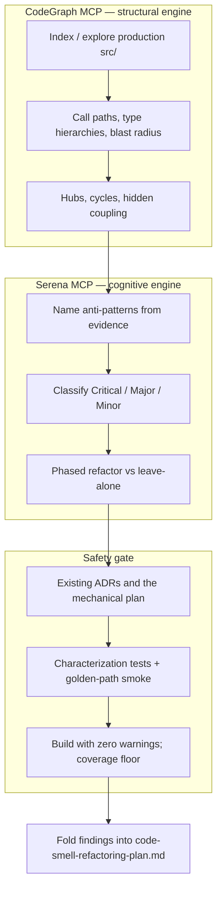

# 0008. Adopt CodeGraph + Serena as the standing dual-engine code-smell pipeline

**Status:** proposed <!-- proposed | accepted | rejected | deprecated | superseded by ADR-NNNN -->
**Date:** 2026-09-02
**Deciders:** David Pizon

## Context and Problem Statement

The repository already has an in-flight mechanical refactoring tracker —
[`docs/router/code-smell-refactoring-plan.md`](../router/code-smell-refactoring-plan.md) — produced by
an earlier CodeGraph + Serena survey plus a second independent audit. Phases 1–3 of that plan are
shipped; remaining work is either closed by [ADR-0006](0006-split-managementfacade-along-crud-aggregate-boundaries.md)
and [ADR-0007](0007-provider-admin-client-stays-on-http.md), adopted as a going-forward norm (GUI
store interfaces), or tracked as an explicit product TODO ([`tracked-todos.md` #6](../router/tracked-todos.md#6-build-a-real-iprovidercostreconciler-for-gemini)).
That document is the **work list**. It is not the **repeatable method** for the next survey.

Without a standing method, each audit invents its own scope, severity scale, and tracker — which is
how a parallel "brutal-cozy-pascal" write-up had to be folded back into the same plan. The forces
are: (1) structural facts (call graphs, type hierarchies, blast radius) are cheap and should be
machine-derived; (2) naming an anti-pattern and scheduling a refactor is a judgment call that must
respect existing ADRs and the hot-path/security-boundary constraints those ADRs locked in; (3) the
workspace already has two MCP engines that split those jobs — **CodeGraph** for structure,
**Serena** for design reasoning — but agents were not instructed to use them as a pair, nor what to
do when one is down.

This ADR **complements** the existing plan. It does not supersede it, does not re-open ADR-0006/0007,
and does not turn the Gemini cost reconciler into a smell. It records the pipeline, the classification
matrix, the safety protocol, and a **live CodeGraph catalog of production `src/` as of 2026-09-02**.
Serena MCP (`plugin-serena-serena`) failed live tool discovery on this pass; classification below is
the human/agent judgment layer using CodeGraph evidence, with Serena's intended role specified so a
future healthy session can re-run the cognitive half without re-deriving the graph.

**Scope of smell scoring:** production source under `src/TotallyHotArcRouter*` (router, Quality, GUI
assemblies). `*.Tests`, the installer, `docs/`, and generated data are out of scope for scoring;
tests are the regression net, not the catalog.

### Deep Code Smell Analysis Plan (execution workflow)

1. **Map (CodeGraph first).** Call `codegraph_explore` with the symbols or question spanning the
   area (for a whole-repo survey: the known hubs plus a size-ranked file list of production
   `*.cs`/`*.razor`). Treat returned source as already read. Record blast radius for any symbol with
   tens of callers. Do not re-grep indexed code to "confirm" the graph.
2. **Judge (Serena when available).** Feed the graph evidence — not a file dump — to Serena:
   anti-pattern name, cyclomatic/cognitive notes, whether the size is *protocol complexity*
   (payload translators) vs *mixed responsibilities* (a remaining God Object). If Serena is
   unavailable, the agent performs this step explicitly and records "Serena skipped" so the catalog
   is not mistaken for a dual-engine result.
3. **Classify** using the matrix in Decision Outcome. Reject candidates that the existing plan
   already ruled out (per-provider translators, `ParseBudgetWindow` vs `BudgetWindowCodec`, acyclic
   project references, Orchestrator voters / Quality analyzers) unless CodeGraph shows the
   *structure* changed.
4. **Schedule.** New work that is mechanical goes into
   [`code-smell-refactoring-plan.md`](../router/code-smell-refactoring-plan.md). Work that changes a
   security boundary, public surface, or transport gets a new ADR first. Product features (Gemini
   reconciler) stay in [`tracked-todos.md`](../router/tracked-todos.md).
5. **Edit only after blast-radius review.** Hubs named in the live catalog (`RequestInterceptor`,
   `ManagementFacade`, `ProxyMiddleware`) require the safety protocol below.

### Live CodeGraph catalog (2026-09-02, production `src/` only)

CodeGraph (workspace `user-codegraph`, ~907 indexed files; two explore calls this pass) plus a
line-count ranking of production `*.cs`/`*.razor` (excluding `obj`/`bin` and `*.Tests`).

**Structural hubs (blast radius):**

| Symbol | File | CodeGraph callers (approx.) | Role |
|---|---|---|---|
| `RequestInterceptor` | `Proxy/RequestInterceptor.cs` | **152** (incl. `ProxyMiddleware`, `LocalEndpointResponder`, plus tests) | Routing/introspection hub — Shotgun Surgery risk on any signature or candidate-builder change |
| `ManagementFacade` | `Proxy/Management/ManagementFacade.cs` | **21** (`ProxyServer`, `ProviderAdminEndpoints`, `ProviderMcpTools`, `McpHostedService`) | Security-boundary façade (ADR-0006): public method set is the boundary; implementation is delegated |
| `ManagementFacadeDependencies` | `Proxy/Management/ManagementFacadeDependencies.cs` | **15** | Optional-collaborator bag threaded into internal services |
| `ProxyServer` | `Proxy/ProxyServer.cs` | **10** (`ProxyHostedService` + tests) | Composition root for HTTP/gRPC/admin mapping |
| `McpHostedService` / `McpServer` | `Mcp/McpHostedService.cs`, `Mcp/McpServer.cs` | Hosted-service wiring | Same 11-dependency constructor bag duplicated across host and server |

**Type / composition notes:** `ManagementFacade` still *instantiates* `ProviderManagementService`,
`BudgetAndPriceOverrideService`, and `SecretManagementService` (internal delegation, matching
ADR-0006). `ProviderManagementService` holds a `Func<ProvidersResponse> buildProvidersResponse`
callback into the façade — callback coupling, not a project cycle. `RequestInterceptor` implements
routing via `IModelRouteResolver`, `ICircuitBreaker`, `IDimensionInferrer`, `IRequestClassifier`,
`IRoutingPolicy`; `CircuitBreaker` → `ICircuitBreaker`, `KeywordDimensionInferrer` →
`IDimensionInferrer`, `HeuristicRequestClassifier` → `IRequestClassifier`. No new circular *project*
coupling was observed; the earlier plan's acyclic reference graph still holds.

**Size outliers (production lines, not a smell by themselves):**

| Lines | Path | Reading against the existing plan |
|---|---|---|
| 1345 | `Proxy/ProxyMiddleware.cs` | Down from 2751; Phase 2 extracted `LocalEndpointResponder`, `RequestTelemetryPublisher`, `CandidateGates`. Remaining God-pipeline: `InvokeCoreAsync` still owns failover + gate walk + header/error writers |
| 919 | `Hosting/ServiceCollectionExtensions.cs` | Phase 1 split into `AddRouterCore` / `AddProxyRequestPipeline` / … — registration volume, not mixed domain logic |
| 889 | `Proxy/Management/ProviderManagementService.cs` | Largest remaining *implementation* behind the façade (provider/model CRUD + capability scan + dialect) |
| 799 | `Proxy/RequestTelemetryPublisher.cs` | Phase 2 extract; still a wide collaborator set (session, usage, spend, budget, ledger, transcript, quality ingress) |
| 688 | `Gui/Platforms/Windows/TrayWindowManager.cs` | Platform glue; single-UI-thread invariant already documented |
| 670 | `Proxy/RequestInterceptor.cs` | Down from 945; `RoutingCandidateBuilder` already extracted. Residual mixed interception + classification |
| 656 | `Proxy/Translation/ToolCalling/ToolCallNormalizingStreamTranslator.cs` | Protocol complexity |
| 599 | `Transcripts/TaxonomyComparisonService.cs` | Domain-sized, not previously flagged |
| 589 | `Telemetry/UsageRollupStore.cs` | Persistence |
| 580 | `PriceCatalog/PriceCatalogDatabase.cs` | ADO.NET/schema owner |
| 455 | `Proxy/Management/ManagementFacade.cs` | Down from ~2090 / 1562 / ~450 as ADR-0006 intended — thin delegating façade |
| 368 | `Gui.Admin/ProviderAdminClient.cs` | HTTP by [ADR-0007](0007-provider-admin-client-stays-on-http.md) — not a migration candidate |

**GUI stores** (14 files under `Gui/Services/*Store.cs`): still concrete singletons without
interfaces — the existing plan's going-forward norm, not a dedicated pass.

## Decision Drivers

- **Complement, don't fork** — one mechanical tracker; this ADR is the method and the current
  structural snapshot.
- **Structure before judgment** — CodeGraph blast radius and hierarchies before naming a smell.
- **Judgment is not optional, tools might be** — Serena classifies when healthy; a down Serena must
  not invent a third tracker or skip the catalog.
- **Respect locked decisions** — ADR-0006 (façade public surface), ADR-0007 (HTTP admin client),
  hot-path `CandidateGates` order.
- **Production `src/` only** — tests measure safety; they are not scored as smells.
- **Zero-warning build and 80% coverage** — same gates as `AGENTS.md` / the existing plan's
  validation section.

## Considered Options

- Option A — Keep ad-hoc audits only (no standing pipeline; each session writes a new plan)
- Option B — Adopt CodeGraph (structure) + Serena (judgment) as the standing dual-engine pipeline,
  folding results into the existing mechanical plan
- Option C — Rely on Roslyn analyzers / file-size CI only, without MCP graph or design classification

## Decision Outcome

Chosen option: **"Option B"**, because **complement, don't fork** forbids a parallel smell tracker,
**structure before judgment** requires CodeGraph as the first engine, and **judgment is not optional,
tools might be** requires Serena's role to be written down even when this pass cannot call it.
Option A is what produced the second audit that had to be merged by hand. Option C catches unused
usings, not God Objects or Shotgun Surgery.

### Smell classification matrix

| Severity | Meaning | Typical evidence | Default action |
|---|---|---|---|
| **Critical** | Change is unsafe without a new ADR or would break a locked boundary / hot-path contract | Hub with large blast radius *and* a proposed public-surface or gate-order change; security-boundary split; missing characterization tests on the proxy path | Stop. Write or cite an ADR. Do not "just extract." |
| **Major** | Cohesion/size/coupling that still hurts review, but existing tests + an internal split can proceed | Files ≫ 800 lines with mixed responsibilities; wide constructors; callback coupling inside an already-decided façade | Schedule a phase in the mechanical plan; blast-radius review; characterization tests if coverage is thin |
| **Minor** | Size, duplication, or missing interface that is legitimate complexity or a going-forward norm | Protocol translators; DI registration volume; GUI stores without interfaces; documented platform constraints | Note; extract only when the file is touched for another reason |

Apply the matrix to **this pass's catalog** (Serena skipped — agent judgment on CodeGraph + sizes):

| ID | Smell | Location | Severity | Why this grade | Relation to existing plan |
|---|---|---|---|---|---|
| S1 | Residual pipeline God Object | `ProxyMiddleware` (`InvokeCoreAsync` + error/header helpers, 1345 lines) | **Major** | Still the largest production file and the request hot path; Phase 2 already removed the worst of it | Continue only with staged extracts + golden-path smoke (existing validation gate item 6) |
| S2 | Shotgun Surgery hub | `RequestInterceptor` (152 CodeGraph callers, 670 lines) | **Major** | Any further split touches middleware, local endpoints, and a wide test set | Phase 4 item 8 partially done (`RoutingCandidateBuilder`); further cuts need interceptor-specific coverage first |
| S3 | Concentrated CRUD + scan behind the façade | `ProviderManagementService` (889 lines) | **Major** | Internal to ADR-0006's boundary; file is now where provider/model mutation *implementation* lives | Eligible for *internal* decomposition only — must not become a second public façade |
| S4 | Telemetry side-effect hub | `RequestTelemetryPublisher` (799 lines, wide ctor) | **Major** | Already decomposed into named private methods + characterization tests | Leave unless a new collaborator forces another split |
| S5 | Duplicated management wiring | `McpHostedService` / `McpServer` 11-dep constructors | **Minor** | Feature envy of the same bag; not a behavior bug | Optional extract of an options/record bag when MCP hosting is next touched |
| S6 | Callback coupling | `ProviderManagementService` → `BuildProvidersResponse` | **Minor** | Intentional: one snapshot builder for every CRUD cluster | Do not "fix" by making the service public |
| S7 | Composition-root bulk | `ServiceCollectionExtensions` (919 lines) | **Minor** | Already split by subsystem | No further phase |
| S8 | GUI stores without interfaces | `Gui/Services/*Store.cs` | **Minor** | Existing going-forward norm | Extract interface when a store is touched |
| S9 | Protocol-sized translators / stream normalizers | Anthropic/Gemini translators, `ToolCallNormalizingStreamTranslator` | **Minor** / **rejected as duplication** | Different wire shapes (existing "checked and rejected") | Do not unify bodies |
| S10 | Thin security façade | `ManagementFacade` (455 lines, 21 callers) | **Critical if public surface changes**; otherwise **not a smell** | ADR-0006's desired end state | Public-surface change requires a new ADR |

### Safety protocols

1. **Blast radius first.** Before editing a catalog hub, re-run CodeGraph on that symbol and list
   production callers. Do not start with a test-only or docs-only split that leaves the hub's
   contract implied.
2. **Locked ADRs.** Do not register `ProviderManagementService` / `BudgetAndPriceOverrideService` /
   `SecretManagementService` as independently injectable public services (ADR-0006). Do not migrate
   `ProviderAdminClient` to gRPC (ADR-0007).
3. **Hot path.** Changes under `ProxyMiddleware`, `CandidateGates`, `RequestInterceptor`, or
   `RequestTelemetryPublisher` keep Serilog templates as static literals, carry existing log events
   to the new home, and require the golden-path smoke (streaming, buffered, Bedrock, `/v1/models`,
   `/api/tags`, `/api/show`) when request handling changes.
4. **Validation gate** (same as the mechanical plan / `AGENTS.md`): `dotnet build` with zero
   warnings; XML docs accurate after moves; unit tests pass; ≥80% line coverage on non-GUI
   assemblies; no unusually heavy test over 5 seconds.
5. **Serena down.** Record the skip, still classify, still fold into the one mechanical plan. Retry
   Serena on the next smell survey; do not treat a CodeGraph-only catalog as dual-engine complete.
6. **Out of scope.** Do not score test projects. Do not open `tracked-todos.md` #6 as a refactor.

### Phased refactoring roadmap (this pipeline's output, not a new tracker)

- **Now (method):** agents follow this ADR + `AGENTS.md` dual-engine section on every architectural
  survey.
- **When touching the hot path:** S1/S2 only as internal extracts with characterization tests —
  append steps to the existing plan's Phase 2/4, do not open Phase 5 elsewhere.
- **When touching management implementation:** S3 internal-only; S6 stays.
- **Opportunistic:** S5, S8.
- **Closed / do not relitigate here:** S9, S10's public surface, ADR-0007, Gemini reconciler.

### Consequences

- Good, because the next audit has a named pair of engines, a severity scale, and one place to put
  mechanical work — reducing the chance of a third parallel plan.
- Good, because this pass's CodeGraph catalog is dated evidence, so "ProxyMiddleware is 2751 lines"
  cannot silently persist after Phase 2.
- Neutral, because Serena was unavailable; a later dual-engine run may regrade S1–S4 without a new
  ADR if the *method* is unchanged.
- Bad, because a standing pipeline adds agent latency (mandatory CodeGraph before architectural
  edits) and can over-fit file size as a smell — mitigated by the "checked and rejected" rule and
  the Minor bucket for protocol complexity.
- Bad, because documenting MCP tool names in `AGENTS.md` will drift if Cursor namespace ids change —
  mitigated by describing *roles* (structural vs cognitive) first and ids second.

## Pros and Cons of the Options

### Option A

Ad-hoc audits: each session surveys from scratch and writes whatever document it likes.

- Good, because it needs no ceremony and can go deep on one file.
- Bad, because independent audits already forked and had to be merged by hand.
- Bad, because severity and scope reset every time, so Phase 4 "backlog" items get rediscovered as
  if they were new Criticals.

### Option B

CodeGraph maps structure; Serena (or the agent, if Serena is down) classifies; results fold into
the existing mechanical plan; this ADR holds the method.

- Good, because it matches the tools the workspace already exposes and the "structure then
  judgment" split those tools imply.
- Good, because it preserves ADR-0006/0007 and the existing plan instead of rewriting them.
- Bad, because it depends on MCP health and on agents actually following `AGENTS.md`.

### Option C

CI analyzers and line-count budgets only.

- Good, because it is deterministic and does not need MCP.
- Bad, because it cannot distinguish protocol complexity from mixed responsibilities, nor report
  blast radius (the 152-caller `RequestInterceptor` fact).
- Bad, because it would flag `ServiceCollectionExtensions` and payload translators as equally
  "too big."

## More Information

- Mechanical work list: [`docs/router/code-smell-refactoring-plan.md`](../router/code-smell-refactoring-plan.md)
- Agent instructions for this pipeline: [`AGENTS.md`](../../AGENTS.md) (Dual-engine code-smell analysis)
- Related decisions: [ADR-0006](0006-split-managementfacade-along-crud-aggregate-boundaries.md),
  [ADR-0007](0007-provider-admin-client-stays-on-http.md)
- Product TODO, not a smell: [`tracked-todos.md` #6](../router/tracked-todos.md#6-build-a-real-iprovidercostreconciler-for-gemini)
- This pass: CodeGraph MCP only; Serena MCP tool discovery failed (`plugin-serena-serena`).
  Re-run the cognitive half when that namespace is healthy.
