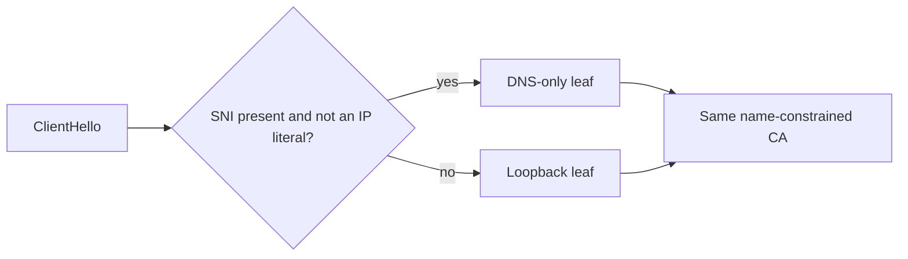

# 0013. Router-generated, name-constrained local CA for trusted HTTPS on every listener

**Status:** accepted <!-- proposed | accepted | rejected | deprecated | superseded by ADR-NNNN -->
**Date:** 2026-09-14
**Deciders:** David Pizon

> **Accepted 2026-09-15**, on completion of the web GUI migration plan's Phases P1-P10: the local CA and
> leaf issuance ship, every listener (proxy, web, MCP) is HTTPS by default, and `--install-certificate`/
> `--export-ca` are real, working CLI flags with Windows/Linux/macOS trust-store implementations.
>
> **Amended 2026-10-02** by [Amendment 1](#amendment-1-2026-10-02-an-sni-selected-dns-only-leaf-for-boringssl-clients):
> the CA now issues two leaves and each handshake gets one by its SNI, because BoringSSL clients reject
> the original leaf.

## Context and Problem Statement

`TelemetryTlsCertificate.GetOrCreate()` already generates a self-signed `CN=localhost` leaf for the
gRPC listener (port 5002), trusted today only because the GUI's `TelemetryChannelFactory` validates the
certificate by hand (accepts any cert whose subject is exactly `CN=localhost` on a loopback host,
ignoring chain errors) — a native-client-only workaround.

With the web port (ADR-0011) and, per the plain-HTTP-removal decision in
[`docs/archive/gui/web-gui-migration-plan.md`](../archive/gui/web-gui-migration-plan.md), the LLM proxy port 5001 both
moving to HTTPS by default, an ordinary browser now needs to trust these certificates without a custom
validation callback — browsers have no such escape hatch, and showing a certificate warning on every
page load is not an acceptable steady state for a desktop tool's own dashboard.

## Decision Drivers

- **Browsers must show a clean padlock**, or the dashboard looks broken on first run.
- **Renewal must not require re-trust.** A leaf that itself sits in the OS trust store means every
  renewal (leaves are short-lived: ≤398 days per Apple/CA-Browser-Forum norms) requires the installer
  or an elevated action to re-trust the new leaf on every machine.
- **Multiple listeners, one identity.** The web port (5004), MCP (5003), and the proxy (5001) all serve
  `localhost`/`127.0.0.1`/`::1` and should present certificates from one trusted root rather than three
  independently-trusted leaves.
- **Blast radius of a compromised root.** A locally-trusted root that could sign a certificate for *any*
  hostname would be a much larger prize than one scoped to this router's own loopback identities.
- **Cross-platform trust stores differ** (Windows `LocalMachine\Root`, Linux `update-ca-certificates`
  plus separate browser NSS databases, macOS System keychain) — the mechanism for "add this to the
  trust store" is inherently OS/installer-specific regardless of which certificate model is chosen.

## Considered Options

- Option A — Router-generated local CA, name-constrained to `localhost`/`127.0.0.1`/`::1`
  (`pathLen:0`), installers trust the CA; the router issues and rotates leaves under it without needing
  re-trust (chosen).
- Option B — A single long-lived self-signed leaf (extend `TelemetryTlsCertificate`'s existing
  approach), trusted directly as its own root.
- Option C — Always-self-signed, no OS trust step; users click through a browser warning once per
  browser profile.
- Option D — Require the operator to supply their own certificate (e.g. via `mkcert` or an internal
  CA), with no router-generated default.

## Decision Outcome

Chosen option: "Option A", because it is the only option satisfying both **renewal must not require
re-trust** and **blast radius of a compromised root**: the CA is trusted once (by the installer, at
install time, while already running elevated/as the service account) and every subsequent leaf
rotation is a silent Kestrel `ServerCertificateSelector` hot-swap with no OS interaction, while the
`pathLen:0` name constraint means a stolen CA key can only ever mint certificates for this router's own
three loopback identities — never an unrelated hostname. Option B fails **renewal must not require
re-trust** by construction: `TelemetryTlsCertificate` already stores a 2-year leaf, and re-trusting it
without an installer running (e.g. an unattended Linux service past its next scheduled maintenance
window) would leave the dashboard untrusted until an operator intervenes. Option C is rejected because
a permanent click-through warning is exactly the UX regression this ADR exists to avoid, and normalizes
ignoring certificate warnings — a bad habit to teach for a security-sensitive local tool. Option D is
rejected as the *only* path (it may still be offered as an override, see More Information) because it
reintroduces the manual-setup friction Option A eliminates for the default case.

### Consequences

- Good, because MCP (5003), the web GUI (5004), and the LLM proxy (5001) all present certificates from
  one trusted root, so installer/trust work happens exactly once per machine.
- Good, because leaf rotation needs no elevated action and no re-trust prompt, ever, after initial
  install.
- Bad, because the CA private key is now a higher-value secret than a single leaf's key was: its
  compromise (even name-constrained) lets an attacker impersonate this router's own loopback services
  to a client that trusts the CA. It is stored in `ProtectedSecretStore` (ADR-0014) accordingly.
- Bad, because Chrome-on-Linux and Firefox maintain their own certificate stores (NSS databases)
  separate from the OS trust store, so trusting the CA machine-wide via `update-ca-certificates` alone
  is insufficient for those browsers — this needs explicit per-browser handling (spike S5 in the
  migration plan) and is documented as a known gap rather than silently assumed to work.
- Neutral, because name constraints (RFC 5280 `NameConstraints` extension) are honored by
  every mainstream OS/browser trust-store implementation targeted here, but this is validated by spike
  S5 rather than assumed.

## Pros and Cons of the Options

### Option A — Name-constrained local CA (chosen)

- Good, because rotation is transparent to every already-trusting client.
- Good, because the name constraint caps what a compromised CA key can be used for.
- Bad, because it is more moving parts than a single leaf: CA generation, leaf issuance under it, and a
  hot-swappable `ServerCertificateSelector`.

### Option B — Single long-lived self-signed leaf

- Good, because it's the smallest change from what `TelemetryTlsCertificate` already does.
- Bad, because every renewal (mandatory well within its validity period on modern browsers) needs a
  fresh OS-trust step, which is exactly the maintenance burden this ADR is written to avoid.

### Option C — Self-signed, no trust, click-through warnings

- Good, because it requires zero installer/trust-store work of any kind.
- Bad, because a permanent browser warning on the product's own dashboard is a poor first impression
  and trains users to dismiss certificate warnings generally.

### Option D — Bring-your-own-certificate only

- Good, because it never asks the router to hold a CA/signing key at all.
- Bad, because it makes HTTPS opt-in-and-manual for every user, defeating the "HTTPS by default with no
  warning" goal for the common desktop case.

## More Information

See [`docs/archive/gui/web-gui-migration-plan.md`](../archive/gui/web-gui-migration-plan.md) phase P0 spike S5 (trust
matrix across Windows/Linux/macOS/browsers) and phase P7 (CA generation, MSI/Linux/macOS trust steps,
CLI `--install-certificate`/`--export-ca`, leaf hot-swap). An operator-supplied-certificate override
(Option D as a fallback, not the default) may be added later via config if a deployment needs it;
nothing in this decision precludes that. Builds on
[ADR-0011](0011-router-served-blazor-webassembly-gui-over-grpc-web.md) (which listeners need trusted
TLS) and [ADR-0014](0014-cross-platform-service-layout-and-secret-backend.md) (where the CA key is
stored).

## Amendment 1 (2026-10-02): an SNI-selected DNS-only leaf for BoringSSL clients

**Status:** accepted 2026-10-02. David replied "Fix it" to the plan that recommends this option,
[`issue-TBD-https-leaf-for-boringssl-clients.md`](../plans/issue-TBD-https-leaf-for-boringssl-clients.md).
Amends the Decision Outcome and its "Neutral" consequence above. The CA, its name constraint and the
trust steps do not change.

### Why

The "Neutral" consequence above assumed every TLS stack we target honours name constraints. BoringSSL
does not implement them for IP addresses. Its matcher (`nc_match_single` in
`crypto/x509/v3_ncons.cc`) handles DNS names, email addresses, URIs and directory names, and returns
`X509_V_ERR_UNSUPPORTED_CONSTRAINT_TYPE` for anything else. BoringSSL is the TLS library inside Bun, so
it is inside the native Claude Code build.

The original leaf carries `IP:127.0.0.1` and `IP:::1`, and this CA constrains both. So every Bun client
failed every HTTPS port with `UNSUPPORTED_CONSTRAINT_TYPE`, whichever host name it dialled. Reproduced
on 2026-10-02 with Claude Code 2.1.246 and 2.1.286. Node, .NET and Schannel accepted the same chain.
The reproduction is in the plan above.

### Decision

The CA issues two leaves, and each handshake gets one by the client's SNI:

| Handshake | Leaf | Subject alternative names | File |
|---|---|---|---|
| Client sent SNI (it dialled `localhost`) | DNS-only | `DNS:localhost` | `router-leaf-dns.pfx` |
| No SNI (it dialled an IP literal) | Loopback | `DNS:localhost`, `IP:127.0.0.1`, `IP:::1` | `router-leaf.pfx` (unchanged) |

Both leaves share the renewal window, lock and persistence code, and each has its own password secret
(`router-leaf-dns:cert-password` for the new one). The first start after upgrade mints
`router-leaf-dns.pfx`. Nothing is re-trusted.

### Consequences

- Good, because Bun clients, including the native Claude Code build, work on every HTTPS port through
  `https://localhost:…`.
- Good, because every other client keeps the leaf it gets today: an IP-literal URL still sends no SNI
  and still gets the leaf that names its address.
- Good, because the CA and its IP-address constraint are untouched, so the blast-radius driver above
  still holds.
- Bad, because Bun clients still fail on an IP-literal URL. No leaf can fix that while the CA constrains
  IP addresses, and dropping that constraint would let a stolen CA key sign for any IP address. The
  client docs tell those clients to use `localhost`.
- Bad, because there are now two leaf files and two password secrets to keep consistent.

### Options not taken

- **One DNS-only leaf for every handshake.** Smaller, but it breaks every `https://127.0.0.1:…` and
  `https://[::1]:…` URL for every client, including the dashboard URLs the web host allows.
- **Drop the IP subtrees from the CA's constraint.** Fixes Bun on every name, but it needs a new CA, so
  every machine and client bundle re-trusts. It also lets the CA key sign for any IP address.
- **Leave Bun clients on the plain-HTTP listener.** Keeps the main harness on plaintext loopback for
  good.
