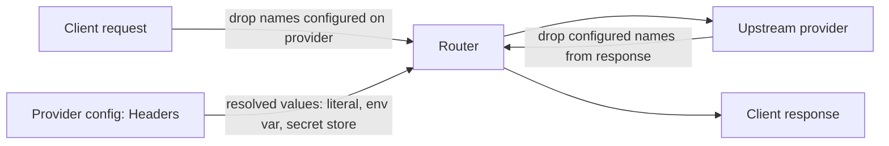

# 0016. Remove `AuthHeaderName`; mark secret headers per header and strip every configured header name

**Status:** proposed
**Date:** 2026-09-24
**Deciders:** David Pizon

## Context and Problem Statement

A provider's credential is already just an ordinary entry in `ProviderOptions.Headers`. Alongside it,
`ProviderOptions.AuthHeaderName` (default `"Authorization"`) records *which* of those headers is "the
credential". It is a second copy of information the header list already carries, and the two disagree:
`ollama` and `lmstudio` have no credential yet inherit `Authorization`, and the three `bedrock-*` entries set
`Authorization` only as a placeholder (they authenticate through the AWS SDK's SigV4 signing, not an HTTP
header). A Copilot review of PR #150 flagged the consequence: selecting those templates shows a misleading
"add your `Authorization` header" hint and persists a credential header name the provider never uses.

The field is not needed for the router to work. Its real jobs are two safety behaviours and one hint:

1. **Client-header stripping.** `UpstreamRequestBuilder.CopyClientHeaders` drops a client-sent header whose
   name equals `route.AuthHeaderName`, but only when `ResolvedModelRoute.AuthHeaderConfigured` is true.
2. **Secret locking.** `ProviderEditDialog.BuildHeaders` force-locks the literal whose name matches
   `AuthHeaderName`, so a forgotten padlock cannot leave a key readable through the management API.
3. **A display hint** in the dialog.

Removing it is a wire-contract change (`ProviderState`, `UpsertProviderRequest`, `ProviderTemplateView`, the
MCP provider tools, the admin client models, and about 40 test files), which `AGENTS.md` requires an ADR
for. The two safety behaviours must keep working without it, so where secrecy and stripping now come from is
the decision.

## Decision Drivers

- **One source of truth.** What is sent upstream and which header is secret should both be read from the
  header list, not from a name pointing into it.
- **No invented credentials.** Ollama, LM Studio and Bedrock must not carry a made-up `Authorization` value.
- **Secrecy is explicit, not defaulted.** A header is stored as a secret only when a template or the
  operator says so; nothing is locked by default.
- **Never leak a secret value.** The value behind a locked literal, or behind an env-var name, must not reach
  a management caller, a log line or a client response.
- **The client cannot override the operator's configuration.** A header the operator configured is the only
  one of that name that reaches the provider.
- **No legacy to preserve.** There is no old stored data and no old client to keep compatible.

## Considered Options

- **Option 1:** Keep `AuthHeaderName`; only correct the template hint and leave the persisted value as is.
- **Option 2:** Remove `AuthHeaderName`; add a per-template `Locked` flag on header entries; strip every
  configured header name from the request and the response.
- **Option 3:** Keep `AuthHeaderName` but make it optional (empty means "no credential header"), relaxing
  `EnsureValid`.

## Decision Outcome

Chosen option: "Option 2", because it is the only one that removes the duplicated fact rather than
patching around it, which satisfies the one-source-of-truth and no-invented-credentials drivers together,
and because both safety behaviours turn out to be derivable from the header list.

The concrete rules:

- **`AuthHeaderName` is deleted** from `ProviderOptions`, `ResolvedModelRoute`, `ProviderView`,
  `ProviderWriteRequest`, the gRPC contract (the field numbers are `reserved`), the MCP provider tools, the
  admin client models and the dialog. `ResolvedModelRoute.AuthHeaderConfigured` goes with it.
- **`Locked` defaults to `false`** on `ProviderHeader`, and a new header written without the flag starts
  unlocked. It was `true` in both places. A write that omits the flag for a header that already exists
  keeps that header's current lock (`request.Locked ?? existing?.Locked ?? false`), so flipping the default
  cannot unlock a stored secret by omission and hand its value back on the next read. Only an explicit
  `false` unlocks.
- **Templates declare secrets per header.** A template header entry's existing `Locked` flag now means "store
  this value as a secret once it is set". `ProviderTemplateView`'s header gains a `locked` field, so the
  dialog learns it from the template rather than from a name match.
- **Credential rows are projected, pre-pointed at their env var.** A template projects its credential header
  as a row with its name, its env-var name (a name, not a secret, so it is shown and may be logged) and
  `Locked: true`, without a value. The row starts on the env-var source; the flag only takes effect if the
  operator switches it to a literal, because env-var rows are always stored unlocked. A literal value in
  appsettings on a `Locked` template header is still never projected. `ollama`, `lmstudio` and `bedrock-*`
  declare no credential header, so they project none.
- **Stripping uses the configured header names, on both sides.** Any client request header whose name matches
  a header configured on the resolved provider is dropped before forwarding, whether or not its value
  resolved (fail closed, so a missing env var never lets the client's own value through). The same set of
  names is dropped from the upstream response before it reaches the client. A header name the provider does
  not configure is forwarded as today, except that the client's own `Authorization` header is never
  forwarded to any provider (it was already in `UpstreamRequestBuilder.AlwaysSkippedRequestHeaders`).
- **A blank `Locked` row saves as it is.** The provider's own rejection is the feedback for a missing key.

### Consequences

- Good, because a provider's authentication is described once, by its headers, so a template can no longer
  contradict itself and Ollama and Bedrock stop carrying a fake `Authorization`.
- Good, because stripping every configured name is stricter and simpler than stripping one credential name:
  it also protects pinned non-credential headers such as `anthropic-version`, and it no longer depends on a
  separate "is the credential configured" flag.
- Good, because secrecy is now an explicit, visible choice on the template or the row rather than a hidden
  name match.
- Bad, because nothing forces a secret to be locked any more. An operator who adds a header by hand and types
  a key into an unlocked literal row exposes that key to management callers; the force-lock safety net is
  gone. This is the accepted cost of "do not default to locked".
- Bad, because it is a broad, mechanical change (the contract, the router, the MCP tools, the GUI and about
  40 test files) that lands as one unit and touches security-sensitive paths.
- Bad, because response-side stripping can drop a harmless response header that happens to share a configured
  request header's name.
- Neutral, because the secret-store and `Locked` mechanics are otherwise unchanged; only the default and the
  source of the "is this a secret" decision move.
- Neutral, because the resolved value of an env-var header is never exposed by a management surface (the
  `HeaderView` for an env-var header carries only the variable's name). `EnvVarHeaderValueLeakTests` pins that
  for the provider list, `ResolvedModelRoute.ToString()` and `ProviderOptions.ToString()`. Logging and
  telemetry paths that might capture outgoing headers still need an audit, tracked as follow-up work.

## Pros and Cons of the Options

### Option 1

Keep the field and only fix the hint. Smallest change.

- Good, because it is a few lines and touches no wire contract.
- Bad, because the duplicated fact remains and can disagree with the header list again.
- Bad, because Ollama and Bedrock still persist `Authorization`, which is a made-up credential.

### Option 2

Delete the field; per-header `Locked` on templates; strip every configured name.

- Good, because it removes the duplication and the invented credentials (see Decision Outcome).
- Good, because both safety behaviours keep working, now derived from the header list.
- Bad, because it is a wide, breaking change and loses the automatic force-lock (see Consequences).

### Option 3

Keep the field but allow it to be empty, and relax `EnsureValid`.

- Good, because Ollama and Bedrock could be expressed as "empty".
- Bad, because the duplication stays and an empty value becomes a fourth state next to "matches a header",
  "doesn't match" and "default `Authorization`".
- Bad, because it still needs the wire contract touched (an empty-string sentinel) without removing the
  underlying problem.

## More Information

- Surfaced by the Copilot review on PR #150 ("Preserve no-auth templates instead of defaulting to
  Authorization").
- Related: [ADR-0006](0006-split-managementfacade-along-crud-aggregate-boundaries.md) (do not change
  `ManagementFacade`'s public method set; this ADR changes only the shape of the types it exchanges) and
  [ADR-0011](0011-router-served-blazor-webassembly-gui-over-grpc-web.md) (the gRPC-Web contract).
- Secret-storage mechanics stay as described in `docs/router/secrets-at-rest-plan.md` and
  `docs/gui/secret-field.md`.
- Implementation sites: `ProviderOptions` and `ProviderHeader` in
  `src/TotallyHotArcRouter/Models/ModelRoutingOptions.cs`, `UpstreamRequestBuilder.CopyClientHeaders`,
  `UpstreamResponseWriter.CopyStatusAndHeaders`, `ProviderTemplateCatalog.Project`,
  `ProviderManagementService.ResolveHeader`, and `ProviderEditDialog`.
