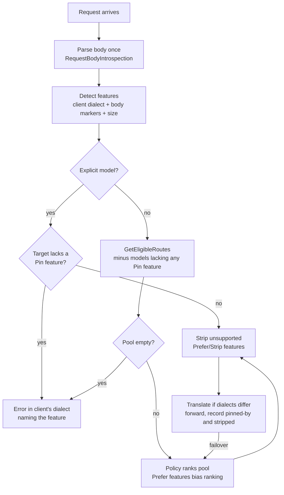

# 0017. Pin auto-routed requests to capable models only when they carry backend-specific features

**Status:** proposed
**Date:** 2026-09-28
**Deciders:** David Pizon

> **Precondition: this ADR's PR stays open until the traffic census lands.** An ADR is accepted
> when its PR merges, so this PR must not merge before the census is done. The policy the mechanism
> runs (which features pin and which are stripped) depends on the traffic census in
> [tracked TODO #8](../router/tracked-todos.md#8-capture-and-analyze-real-claude-code-and-codex-traffic-before-deciding-adr-0017s-pin-policy),
> and so does the decision on whether inbound translation is worth building. Every marker in the tables
> below is a **hypothesis until that census measures it.** Once
> `docs/router/harness-traffic-census.md` exists, update this ADR from it in this same PR. Then
> either set the status to `accepted` and merge, or close the PR as rejected.

## Context and Problem Statement

With `"model": "auto"`, a harness asks Arc Router to pick the provider and model. The goal is that a
harness can send a request in its own API dialect and let the router pick **any** configured model,
whatever dialect that model speaks. Today the router falls well short of that:

- It translates only *outward*, from OpenAI Chat Completions into Anthropic, Gemini, Bedrock and Ollama
  ([`unified-api-translation.md`](../router/unified-api-translation.md)). A Claude Code request
  (Anthropic Messages on `/v1/messages`) is passed through unchanged, so it works only when the pick is
  Anthropic. A Codex request (OpenAI Responses on `/v1/responses`) works only when the pick serves
  `/responses`.
- Candidate selection ignores the request's dialect and features. `RoutingCandidateBuilder.GetEligibleRoutes`
  (`src/TotallyHotArcRouter/Proxy/RoutingCandidateBuilder.cs`) filters only on circuit state and
  operator stop/disable. So `auto` can pick a model that cannot read the request, and the turn fails.
  The harness guides added in PR #156 document this as a limitation.

Adding inbound translators (Messages → Chat Completions, Responses → Chat Completions) would make most
requests routable anywhere. But some requests carry things a translation cannot carry across. Examples:
a harness-specific custom tool such as Codex's `apply_patch`, state held by the vendor
(`previous_response_id`), a signed Anthropic `thinking` block that Anthropic insists on getting back,
or prompt-caching markers (`cache_control`) whose loss raises cost without failing anything.

The question is **when a request should be restricted to the subset of models that can honor it,
and when it should be translated with the untranslatable parts stripped.** The answer is not obvious,
for two reasons. Pinning too readily throws away the routing that `auto` exists for. Pinning too
rarely breaks harnesses or silently raises cost. And the right balance depends on a fact that has
not been measured: how often real harness traffic carries each such feature. If a harness sends a
hard-to-translate feature on nearly every request, any feature-based rule ends up pinning that
harness permanently.

## Decision Drivers

- **Correctness:** never forward a request to a model that will reject it or break the harness's tools.
- **Routing freedom:** keep the widest candidate pool the request can actually use. That pool is what
  `auto` is for.
- **Honesty toward explicit picks:** an explicitly named model is never silently rerouted. This applies
  ADR-0005's rule for circuit trips to every cause, not just circuit trips. When no model qualifies, the
  error names the feature instead of degrading silently.
- **Evidence before policy:** which features pin and which are stripped is decided from measured traffic
  (tracked TODO #8), not from vendor docs or guesses.
- **Hot-path cost:** detection reads the body already parsed for routing, as `RequestBodyIntrospection`
  (`src/TotallyHotArcRouter/Proxy/RequestBodyIntrospection.cs`) does for `CarriesTools` today. There is
  no second parse.
- **Observability:** every constrained or stripped decision is recorded with its reason. The dashboard
  can then explain a pick, and regret evaluation scores against the pool the router could actually
  choose from.

## Considered Options

- **Option 1: always pin by client dialect.** `/v1/messages` goes only to Messages-capable models,
  `/v1/responses` only to Responses-capable models. No inbound translation.
- **Option 2: never pin.** Always translate into the chosen model's dialect and strip whatever it
  can't honor.
- **Option 3: feature-gated pinning.** Detect backend-specific features per request, then apply a
  per-feature **Pin / Prefer / Strip** policy to the candidate pool. Pin only when the request needs it.
- **Option 4: pin by harness identity.** Recognize Claude Code or Codex by `User-Agent` and pin those
  harnesses to their native backends.
- **Option 5: conversation stickiness instead of per-request detection.** Route a conversation's first
  turn freely, then keep every later turn of that conversation on the same backend.

## Decision Outcome

Chosen option: **Option 3, feature-gated pinning**, contingent on tracked TODO #8.

It is the only option that meets both **Correctness** and **Routing freedom**. Requests that need a
specific kind of backend get one, and every other request keeps the full pool. Options 1 and 4 give up
routing freedom for every request to protect the few that need it. Option 2 gives up correctness.

Option 3 also contains Option 1. The client's dialect is modeled as one more feature: "arrived as
Anthropic Messages" is a Pin marker until an inbound Messages translator exists, and then its policy
changes to *translate*. So Option 3 can ship before any inbound translator and behave exactly like
Option 1. It widens one dialect at a time as translators land. The translators themselves are a
separate decision, taken per dialect from the census.

**Evidence before policy** decides everything left open. The census supplies the Pin/Prefer/Strip
classification, whether Option 5 must be layered on top, and the degenerate-case check below.

### Decision rule the census must apply

For each harness and configuration, compute **P**: the share of requests that still carry at least one
**Pin** marker under the census-derived classification, *after* the client-dialect marker is removed.
Removing it means asking: if an inbound translator existed, how many requests would it still fail to
free?

- **P ≥ 90%** (a proposed threshold; the census report may argue for a different one): an inbound
  translator for that harness's dialect buys almost no routing freedom. Keep that dialect as a permanent
  Pin marker, which is Option 1's behavior for that harness, and do not build its translator. Record
  this in this ADR before its PR merges.
- **P < 90%:** building that dialect's inbound translator is justified. File it as its own ADR, since
  it adds a new public request surface.

### How the mechanism fits into the existing pipeline

- **Detection** extends `RequestBodyIntrospection` next to `CarriesTools` and `CarriesToolHistory`.
  Each detector has an id, a predicate over the parsed body, headers and path, the capability it
  requires, and a policy. A field the chosen translator does not map, and that the table does not list,
  **defaults to Pin** until classified. This keeps the router correct when a harness adds a field
  nobody has seen, and the census exists to keep that list short.
- **Filtering** adds the required capabilities to `RoutingCandidateBuilder.GetEligibleRoutes`. Both
  `RankEligibleModels` (failover) and `RequestInterceptor.BuildRoutingCandidates` (the policy's menu)
  already go through it. A failover therefore stays inside the constrained pool, and the untrained-baseline
  counterfactual is drawn from the menu the router could really choose from.
- **Capabilities per candidate** come from data the router already has, plus operator overrides:
  - Provider dialect (the provider key).
  - Scanned endpoint flavors: `ProviderEndpointCapabilities.AnthropicCompatible` from
    `ProviderEndpointScanner`. This lets a non-Anthropic endpoint that natively accepts Messages join a
    Messages-pinned pool.
  - Tool support (ADR-0003) and probed context windows (ADR-0002).
- **Policies:**
  - **Pin:** remove candidates that lack the capability.
  - **Prefer:** keep the pool, rank capable candidates higher, and strip the feature if a non-capable
    candidate is chosen anyway.
  - **Strip:** keep the pool and remove the feature when the target lacks it.

  Each detector's policy is operator-overridable. The defaults come from the census.
- **Recording.** Pinning is not substitution, so it gets its own record instead of a new
  `RoutingSubstitutionReason` value. There are two new response headers in the existing `X-ArcRouter-*`
  family: `X-ArcRouter-Pinned-By` and `X-ArcRouter-Stripped-Features`. The same two lists are added
  to routing telemetry and the transcript row.

### Initial marker hypotheses (to be replaced by the census)

| Marker (dialect) | Hypothesized default | Why |
|---|---|---|
| Client dialect: Anthropic Messages / OpenAI Responses | Pin, until that dialect's inbound translator exists | No translation yet |
| Tools with `type: "custom"` (freeform), e.g. Codex `apply_patch` (Responses) | Pin | The harness's edit tool breaks elsewhere |
| `previous_response_id` (Responses) | Pin | Conversation state lives at the vendor |
| Signed `thinking` / `redacted_thinking` in history + tool loop + thinking on (Messages) | Pin, or Strip blocks *and* disable thinking | Anthropic rejects a tool-loop turn without them |
| Vendor-hosted tools (web search, code execution, file search) | Pin; operator may set Strip | Stripping changes behavior |
| `cache_control` (Messages) | Prefer | Loss raises cost, not errors |
| Encrypted `reasoning` items / `include: reasoning.encrypted_content` (Responses) | Strip | Readable only by the issuing vendor |
| Image or document content blocks | Pin to vision-capable models | Outbound translators ignore them today |
| Estimated prompt tokens > candidate's context window | Pin (filter), always | The request cannot fit |

### Consequences

- Good, because a request that needs a particular kind of backend always reaches one, and every other
  request keeps the full `auto` pool.
- Good, because it can ship before any inbound translator, with dialect as a Pin marker, and fixes
  today's failed turns immediately with the behavior of Option 1.
- Good, because an explicit pick is never silently rerouted, and a request no model can serve fails
  with the feature named.
- Bad, because the policy table is a new operator-facing setting that has to be explained, validated,
  and shown in the GUI.
- Bad, because harnesses change what they send between versions. The table goes stale unless someone
  re-runs the census when an observed failure or new field shows up. Defaulting unlisted fields to Pin
  prevents that from breaking anything, but staleness then shows up as unexplained over-pinning.
- Bad, because Strip and Prefer mean some `auto` requests lose features, such as prompt caching, the
  harness asked for. That is visible in headers and telemetry, but still a change the harness did not
  request.
- Neutral, because `GetEligibleRoutes` gains a parameter (internal, two production callers), and
  telemetry and transcript storage gain two columns.
- Neutral, because inbound translators and any conversation stickiness each need their own decision.
  This ADR only fixes the constraint mechanism they plug into.

## Pros and Cons of the Options

### Option 1: always pin by client dialect

- Good, because it is the smallest change and fixes today's failed turns immediately.
- Good, because native pass-through keeps full fidelity: caching, thinking signatures, beta headers.
- Bad, because Claude Code and Codex never reach a model outside their vendor's dialect, which throws
  away most of `auto`'s value for the two harnesses most likely to use it.
- Bad, because it gives no reason to build inbound translation, even for dialects where most requests
  would translate cleanly.

### Option 2: never pin

- Good, because the candidate pool is always the full configured list.
- Bad, because some features cannot be stripped without breaking the turn: a harness's custom edit
  tool, vendor-held conversation state, Anthropic's signed-thinking requirement. This fails the
  **Correctness** driver outright.
- Bad, because cost-bearing losses such as dropped `cache_control` happen on every cross-dialect turn
  with no way to prefer a native backend.

### Option 3: feature-gated pinning

- Good, because it meets Correctness and Routing freedom together, per request.
- Good, because it contains Option 1 as its starting state and widens as translators land.
- Good, because its policy table is data-driven and operator-overridable, not hard-coded guesses.
- Bad, because it needs detectors, a capability model and a policy table to be built and kept current.
- Bad, because whether it is worth more than Option 1 for a given harness is unknown until the census
  runs. If that harness's P is high, the extra machinery buys nothing for it.

### Option 4: pin by harness identity

- Good, because it's trivial to implement and needs no body inspection.
- Bad, because in effect it is Option 1 with a more fragile trigger. `User-Agent` strings change, and
  proxies or wrappers rewrite them.
- Bad, because it can't see features inside Chat Completions clients (Aider, Cursor), and it pins
  requests that carry nothing that needs pinning.

### Option 5: conversation stickiness instead of per-request detection

- Good, because it avoids the cross-provider history problems, such as signed thinking blocks from one
  vendor meeting another vendor on the next turn.
- Good, because conversation identity already exists (`MessageHistoryContinuityMatcher`).
- Bad, because the first turn's pick locks in the whole conversation, even when later turns would
  route better elsewhere.
- Bad, because it does not replace detection: the first turn still needs a capable model, so a
  harness-specific tool still has to be seen.
- Neutral, because it may still be needed *on top of* Option 3 for markers that persist once they
  enter the history. The census's persistence measurement decides this.

## More Information

- **Blocking prerequisite:** [tracked TODO #8](../router/tracked-todos.md#8-capture-and-analyze-real-claude-code-and-codex-traffic-before-deciding-adr-0017s-pin-policy).
  It covers the traffic census, its volume minimums, and the report that replaces the hypothesis table
  above.
- **Related decisions:** ADR-0002 (probed context windows), ADR-0003 (declared tool support) and
  ADR-0005 (explicit selections are not silently substituted) supply capabilities and constraints this
  mechanism relies on.
- **Outbound translation it builds on:** [`unified-api-translation.md`](../router/unified-api-translation.md).
- **Harness guides whose Limitation sections this ADR would lift:** `docs/install/harnesses/`, from
  PR #156. Once the ADR is accepted, those sections should link here instead of describing the gap as
  settled behavior.
- **Out of scope:** the inbound translators themselves (one ADR per dialect, gated by the decision rule
  above) and any change to the routing policy's scoring beyond the Prefer bias.
