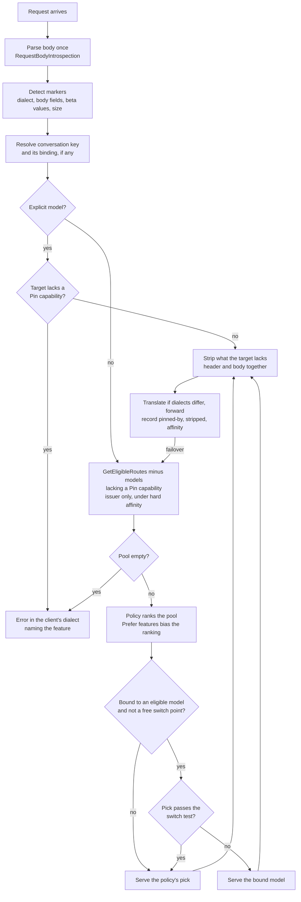

# 0017. Constrain auto-routed requests by per-model capability and conversation affinity

**Status:** proposed
**Date:** 2026-09-28 (revised 2026-10-02)
**Deciders:** David Pizon

> **Not accepted. Revised 2026-10-02.** PR #159 merged this file on 2026-09-28, before the traffic census its own
> text required. David confirmed on 2026-10-02 that the ADR is not approved, so it stays `proposed` and was revised in
> place. The revision rests on vendor documentation collected in
> [`harness-routing-constraints-evidence.md`](../research/harness-routing-constraints-evidence.md), cited below as
> **R §n**. Every default in the marker table is still a **hypothesis until
> [tracked TODO #8](../router/tracked-todos.md#8-capture-and-analyze-real-claude-code-and-codex-traffic-before-deciding-adr-0017s-pin-policy)
> measures real traffic.** Once `docs/router/harness-traffic-census.md` exists, update this ADR from it. David then
> accepts or rejects it.

## Context and Problem Statement

With `"model": "auto"`, a harness asks Arc Router to pick the provider and model. The goal is that a harness sends a
request in its own API dialect and the router picks any configured model that can serve it, at the best quality for
the money. Today the router falls short of that:

- It translates only *outward*, from OpenAI Chat Completions into Anthropic, Gemini, Bedrock and Ollama
  ([`unified-api-translation.md`](../router/unified-api-translation.md)). A Claude Code request (Anthropic Messages on
  `/v1/messages`) passes through unchanged, so it works only when the pick reads Messages. A Codex request (OpenAI
  Responses on `/v1/responses`) works only when the pick serves `/responses` (R §3).
- Candidate selection ignores the request's dialect and features. `RoutingCandidateBuilder.GetEligibleRoutes`
  (`src/TotallyHotArcRouter/Proxy/RoutingCandidateBuilder.cs`) filters only on circuit state and operator
  stop/disable. So `auto` can pick a model that cannot read the request, and the turn fails. The harness guides added
  in PR #156 document this. Issue #163 added a narrow precursor (commit 3a690a1, ADR-0022): biased Claude Code
  traffic only considers candidates whose provider key is `anthropic`.

The first version of this ADR proposed feature detection with a per-feature **Pin / Prefer / Strip** policy, judged per
dialect. Vendor documentation changes that framing in four ways:

1. **Each dialect is spoken by more than one vendor.** LM Studio and Ollama serve Anthropic Messages natively, LM Studio
   also serves Responses, and Copilot can be set to speak any of the three dialects (R §1.3, §2.3). Restricting a
   request to its dialect no longer means restricting it to one vendor.
2. **A dialect is not a capability.** Behind a gateway, Claude Code treats `auto` as a current Claude model and sends
   adaptive thinking, effort and context management (R §1.1). Claude Haiku 4.5, Sonnet 4.5 and Opus 4.5 reject adaptive
   thinking with a 400, and Bedrock rejects context management (R §2.1, §2.3). Endpoints that speak a dialect also
   support only part of it (R §2.3).
3. **Some state belongs to whoever issued it.** Codex's encrypted reasoning can be read only by the OpenAI organization
   that produced it. A `previous_response_id` resolves only on the server that issued it. Claude Sonnet 5.5's thinking
   blocks are tied to the account that produced them (R §1.2, §2.1, §2.3). "Has the capability" is the wrong test for
   these; "is the issuer" is the right one.
4. **Moving a conversation has a price.** Each model keeps its own prompt cache, so the first request after a switch
   re-reads the whole conversation uncached (R §2.2). R §4 works out when a move pays for itself. On a 100,000-token
   conversation, moving from Opus 5.5 to the four-times-cheaper Haiku 4.5 makes that first request cost 6.25× more
   on input.

So the question is really three questions. Which candidates can serve this request? Which of its features may be
removed, and how? When may a conversation move to another model? Pinning too readily throws away the routing that
`auto` exists for. Pinning too rarely breaks harnesses. Moving too often pays cache penalties larger than the routing
saves.

## Decision Drivers

- **Correctness:** never forward a request to a model that will reject it or break the harness's tools. Check this per
  model, because that is where backends enforce it.
- **Routing freedom:** keep the widest candidate pool the request can actually use, at the points where choosing is
  worth something.
- **Cache continuity:** do not move a conversation when the move costs more than it saves (R §4).
- **Harness recovery compatibility:** do not defeat a harness's own recovery from rejected features. Claude Code reads
  the upstream's error wording, retries, and turns the rejected feature off for the rest of the conversation (R §1.1).
- **Honesty toward explicit picks:** an explicitly named model is never silently rerouted. This applies ADR-0005's rule
  for circuit trips to every cause. When no model qualifies, the error names the feature.
- **Evidence before policy:** which features pin, strip or bind is decided from measured traffic (tracked TODO #8), with
  vendor documentation as the starting hypothesis.
- **Hot-path cost:** detection reads the body already parsed for routing, as `RequestBodyIntrospection`
  (`src/TotallyHotArcRouter/Proxy/RequestBodyIntrospection.cs`) does for `CarriesTools` today. The affinity lookup is
  one in-memory map read per request.
- **Observability:** every constrained, stripped or held decision is recorded with its reason. The dashboard can then
  explain a pick, and regret evaluation scores against the pool the router could actually choose from.

## Considered Options

- **Option 1: always pin by client dialect.** `/v1/messages` goes only to Messages-capable endpoints, `/v1/responses`
  only to Responses-capable endpoints. No inbound translation.
- **Option 2: never pin.** Always translate into the chosen model's dialect and strip whatever it can't honor.
- **Option 3: feature-gated pinning per request, judged per dialect.** The first version of this ADR: detect
  backend-specific features, apply a per-feature Pin / Prefer / Strip policy, and pin only when the request needs it.
- **Option 4: pin by harness identity.** Recognize Claude Code or Codex by `User-Agent` and pin those harnesses to their
  native backends.
- **Option 5: hard conversation stickiness.** Route a conversation's first request freely, then keep every later
  request of that conversation on the same backend.
- **Option 6: per-model capability filter with issuer affinity and a cache-aware switch test.** Option 3's detectors,
  with capabilities kept per provider and model, a fourth policy (**Affinity**) for state bound to its issuer, and
  Option 5's stickiness as a soft default that a move must pay its way out of.

## Decision Outcome

Chosen option: **Option 6**. It is the only option that meets **Correctness** where backends enforce it, per model and
per issuer, and also meets **Cache continuity**. It keeps **Routing freedom** where choosing costs nothing: at the
start of a conversation, after its cache has gone cold, and after compaction. Option 3 as first proposed judged
capabilities per dialect. It would send `auto` traffic carrying adaptive thinking to Haiku 4.5, which rejects it
(R §2.1), and it put no price on a switch. Option 5 alone keeps a conversation in place even when a move would pay.

Option 6 still contains Option 1. Until an inbound translator exists, the client's dialect is a Pin marker. It is matched
against what the endpoint speaks, not against the provider key. So the first build behaves like Option 1, but its pool
already includes LM Studio and Ollama endpoints that speak the dialect natively (R §2.3).

### Policies

| Policy | Effect on the candidate pool | Used for |
|---|---|---|
| **Pin** | Remove candidates that lack the capability. | Features a backend rejects or cannot carry out. |
| **Prefer** | Keep the pool. Rank capable candidates higher, and strip the feature if a non-capable one wins anyway. | Features whose loss costs money or quality but fails nothing. |
| **Strip** | Keep the pool. Remove the feature from the copy sent to a target that lacks it. | Features a target rejects but the turn can do without. |
| **Affinity** | Restrict or bias the pool toward the provider and model the conversation is bound to. | State only its issuer can read (hard), and warm caches and thinking history (soft). |

**Hard affinity** restricts the pool to the issuing provider: the same provider key, so the same credential, account and
organization. **Soft affinity** keeps the bound model unless the switch test below says a move pays.

**Strip rules.** A strip must not cause the failure it exists to avoid:

1. Remove an `anthropic-beta` value together with the body field it pairs with. Removing only one of the two produces
   a 400 (R §1.1).
2. Change only the copy sent to the chosen target. Never send an altered system prompt, tool list or earlier message
   to the backend whose thinking blocks are in that history, because its prefix check rejects the request (R §2.1).
   The harness keeps its own unaltered history, so the next request to that backend arrives intact.
3. Never invent content that only an issuer can produce. A response translated back to a harness must not contain
   thinking blocks, signatures or encrypted reasoning items that the harness would later send to the real issuer.
4. Record every strip.

**Error forwarding.** On native-dialect paths, forward upstream error bodies unchanged so the harness's own recovery
can read them (R §1.1). A Pin failure the router raises itself is written in the client's dialect and names the
feature.

### Capabilities per provider and model

- **Keyed by provider and model**, as `ModelToolCapability` already is. Each feature is supported, unsupported or
  unknown, with its evidence ordered the way `DetectionConfidence` orders tool-call dialects.
- **Seeded** (the Heuristic tier) from the provider key, the detected server type (`AnthropicCompatible`,
  `LmStudioNative`, `OllamaNative`, and a new `ResponsesCompatible` flag) and vendor documentation. Examples:
  - Claude 4.5-generation and earlier models reject adaptive thinking (R §2.1).
  - Ollama's Messages endpoint lacks `cache_control`, `tool_choice`, `metadata` and PDF documents (R §2.3).
  - Claude on Bedrock rejects `context_management` and `output_config` (R §2.3).
- **Observed** from live traffic:
  - A 400 whose message names a field marks that field unsupported for that provider and model.
  - A cache marker that never yields cache reads over a repeated prefix marks caching as ignored.
- **Operator** overrides come last and are never overwritten by a scan or an observation.
- **Probes cannot do this alone.** Testing a feature means generating with a real model, which loads it on a local
  runtime. Some backends also ignore a field instead of rejecting it, so a single successful response proves nothing
  (R §5). The endpoint scan gains `ResponsesCompatible` through an opt-in POST probe, modeled on
  `ProviderOptions.ProbeAnthropicMessages`.
- **Unknown is not supported.** For a Pin marker, an unknown capability counts as missing. A body field or beta value
  that no detector lists pins the request to the dialect's own vendor endpoint until it is classified. That vendor
  endpoint is `anthropic` for Messages and the OpenAI API for Responses. This keeps the router correct when a harness
  adds a field, which Claude Code does every release (R §1.1).

### Moving a conversation: the switch test

**Conversation key.** For Claude Code, the key is `x-claude-code-session-id`, already read by `SessionIdResolver`,
plus `x-claude-code-agent-id` for a subagent, which runs its own conversation (R §1.1). Other harnesses use
history-prefix matching. `MessageHistoryContinuityMatcher` first has to be extended to Responses `input` items, as
tracked TODO #8 already plans. Each record notes which source produced its key.

**Binding.** Each conversation is bound to the provider and model that served its last request. The binding also
records when that request was served and the prefix size its usage reported (input, cache-read and cache-write
tokens). The router already parses these (`AnthropicUsageParser`, `OpenAiUsageParser`).

**Cost of a request** (R §4.1). For model *X* with base input price *p*, output price *q*, cache-read multiplier *r*
and cache-write multiplier *w*, take a request with cached prefix *C*, new input *n* and output *o*:

$$c_{\text{warm}}(X) = r_X\,p_X\,C + w\,p_X\,n + q_X\,o \qquad c_{\text{cold}}(X) = w\,p_X\,(C+n) + q_X\,o$$

A move from the bound model *A* to a candidate *B* costs $\Delta = c_{\text{cold}}(B) - c_{\text{warm}}(A)$ extra on its
first request. It saves $s = c_{\text{warm}}(A) - c_{\text{warm}}(B)$ on each request after that. Over *k* requests on B,
the move pays off when

$$k > 1 + \frac{\Delta}{s} \qquad (s > 0)$$

For a large prefix, a single request on B pays only when $p_B / p_A < r_A / w$ (R §4.2). With the 5-minute cache
(*w* = 1.25), B must be at least 12.5× cheaper than a model with the standard 0.1× read rate, 25× cheaper than Opus 5.5
(0.05×) and 50× cheaper than Fable 5.1 (0.025×).

Worked examples (R §4.4). Prices come from Anthropic's price table. The token counts *C* = 100,000, *n* = 2,000 and
*o* = 1,000 are illustrative until the census measures them:

| Move | Extra cost of the move (Δ) | Saving per later request (*s*) | Requests on B to break even |
|---|---|---|---|
| Opus 5.5 → Haiku 4.5 | \$0.0825 | \$0.0325 | 4 |
| Sonnet 5.5 → Haiku 4.5 | \$0.0975 | \$0.0175 | 7 |
| Opus 5.5 → Sonnet 5.5 | \$0.2150 | \$0.0150 | 16 |

Opus 5.5 → Sonnet 5.5 barely pays for itself. Opus 5.5's 0.05× read rate gives it the same cached-input price as
Sonnet 5.5, \$0.20 per million tokens. Halving the list price therefore saves only on new input and output.

**The rule:**

- **Free switch points** route freely over the filtered pool. These are:
  - the first request of a conversation, including a subagent's first request;
  - a request after the bound model's cache TTL has passed (5 minutes by default, or 1 hour when the request asks for
    it);
  - the first request after a compaction (`x-claude-code-context-compacted`, or a break in the history prefix).

  At these points nothing is cached that a move would lose, so Δ is at most the difference in cold costs (R §4.5).
- **Otherwise soft affinity holds.** The bound model serves the request unless one of these is true:
  - it is no longer eligible: its circuit is open, it was stopped, or it lacks a Pin capability the request now
    needs;
  - the policy's pick *B* passes the switch test. In that test, *k* is the census's median number of remaining
    requests for a conversation of this length, prices come from the price catalog (`CacheReadPerMillionTokens`,
    `CacheWritePerMillionTokens`), and *C* comes from the last usage.
- **A model B that is still warm for this conversation** pays Δ only on the part of the prefix it has not cached
  (R §4.5).
- **A move wanted for quality alone** (B costs more, so *s* < 0) waits for the next free switch point.
- **The operator can turn soft affinity off.** Every request is then routed independently, as today.
- **Free providers.** For a provider marked free (`ProviderOptions.IsFree`), *p* = 0 and the money penalty vanishes.
  The time it takes to re-read the prefix is not priced (R §4.6).

### How the mechanism fits into the existing pipeline

- **Detection** extends `RequestBodyIntrospection` next to `CarriesTools` and `CarriesToolHistory`. Each detector has an
  id, a predicate over the parsed body, headers and path, the capability or issuer it requires, and a policy. Each
  detector's policy can be overridden by the operator. The defaults come from the census.
- **Filtering** adds the required capabilities and any hard-affinity restriction to
  `RoutingCandidateBuilder.GetEligibleRoutes`. Both `RankEligibleModels` (failover) and
  `RequestInterceptor.BuildRoutingCandidates` (the policy's menu) already go through it. A failover therefore stays
  inside the constrained pool, and the untrained-baseline counterfactual is drawn from the menu the router could really
  choose from. A failover away from a hard-affinity issuer strips encrypted reasoning items, which the harness re-sends
  with the full history. It cannot strip a `previous_response_id`, so that request fails with the feature named.
- **Recording.** Pinning and affinity are not substitution, so they get their own records instead of new
  `RoutingSubstitutionReason` values. There are three new response headers in the existing `X-ArcRouter-*` family:
  - `X-ArcRouter-Pinned-By`
  - `X-ArcRouter-Stripped-Features`
  - `X-ArcRouter-Affinity`: `none`, `held`, `hard` or `moved`, with the estimated Δ when a move was weighed.

  The same fields go into routing telemetry and the transcript row. A request served under held affinity is not a
  policy pick, so regret evaluation does not score it as one.

### Marker hypotheses (to be replaced by the census)

| Marker (dialect) | What it binds to | Hypothesized default | Data source today | Evidence |
|---|---|---|---|---|
| Client dialect: Anthropic Messages | An endpoint that speaks Messages | Pin, until an inbound translator exists | Provider key `anthropic`, `AnthropicCompatible` | R §2.3, §3 |
| Client dialect: OpenAI Responses | An endpoint that speaks Responses | Pin, until an inbound translator exists | None yet (`ResponsesCompatible` to add) | R §1.2, §2.3 |
| `thinking: {"type": "adaptive"}` (Messages) | Model | Strip for models that lack it | None yet (seed per model) | Claude 4.5 and earlier return a 400. If the 400 reaches Claude Code, it turns thinking off for the rest of the conversation (R §1.1, §2.1). |
| `output_config.effort` (Messages) | Model | Strip for models that lack it | None yet | Claude Code drops effort for the rest of the session after a rejection (R §1.1) |
| `context_management`, beta tool fields (`strict`, `defer_loading`), `output_config.format` / `task_budget`, each with its beta value | Model and endpoint | Pin to Claude API endpoints; operator may set Strip (both halves) | None yet | Bedrock and Vertex reject them, and Claude Code does not retry (R §1.1, §2.3) |
| Signed `thinking` / `redacted_thinking` in history (Messages) | The model that produced them; the account, for Sonnet 5.5 | Soft affinity; Strip from the copy sent to a model that cannot read them | Conversation binding (new) | Unreadable blocks are dropped without error, and adaptive mode does not fail mid-turn. The hard error is the prefix check, which Strip rule 2 avoids (R §2.1). |
| `cache_control` (Messages) | An endpoint that honors caching | Prefer. The real cost of a move is priced by the switch test, not by this marker. | Observed from cache reads (usage already parsed) | Ollama does not support it. A stripped marker bills the whole history as uncached input (R §1.1, §2.3). |
| `previous_response_id` (Responses) | The issuing server | Hard affinity; error if the issuer is unavailable | Conversation binding (new) | State lives on the server that issued the id, LM Studio included (R §2.3) |
| Encrypted `reasoning` items / `include: ["reasoning.encrypted_content"]` (Responses) | The issuing organization | Hard affinity; Strip on a forced move | Conversation binding (new) | Another organization rejects them with `invalid_encrypted_content` (R §1.2, third-party report) |
| Tools with `type: "custom"` (freeform), e.g. Codex `apply_patch` (Responses) | An endpoint that supports custom tools | Pin | None yet | Whether Codex sends it under `auto` is unknown (R §1.2, census) |
| Vendor-hosted tools (web search, code execution, file search) | An endpoint that hosts the tool | Pin; operator may set Strip | None yet | Stripping changes behavior |
| Image or document content blocks | A model that reads that block type | Pin | None yet | No vision data exists in code (R §3). Ollama lacks PDF documents (R §2.3). |
| Estimated prompt tokens > candidate's context window | Model | Pin, always | Probed context windows (ADR-0002) | Claude Code assumes 200K for an unrecognized id such as `auto` (R §1.1) |
| A body field or beta value no detector lists | Unknown | Pin to the dialect's own vendor endpoint until classified | Not applicable | Claude Code adds fields each release (R §1.1) |

### Decision rule the census must apply

Measure per harness and per dialect configuration. Copilot's dialect is a setting, so each setting counts separately
(R §1.3).

- **P_conv:** the share of conversations, weighted by spend, whose *first* request still carries at least one Pin or
  hard-Affinity marker once the client-dialect marker is removed. It is measured per conversation because, under soft
  affinity, routing choices are made at conversation starts and other free switch points, not on every request. A
  per-request share would count requests whose model was already settled by affinity.
- **Switch-test inputs:** conversation length and the remaining-requests distribution (for *k*), the share of idle gaps
  longer than the cache TTL (free switch points), and the real *C*, *n* and *o*.

Then:

- **P_conv ≥ 90%** (a proposed threshold; the census report may argue for another): an inbound translator for that
  dialect would free almost no routing decisions. Keep the dialect as a permanent Pin marker, which is Option 1's
  behavior over a multi-vendor native pool, and do not build the translator.
- **P_conv < 90%:** a translator may be proposed in its own ADR, since it adds a new public request surface. That ADR
  must show two things:
  1. A model the operator wants that no endpoint speaking the dialect can serve.
  2. An estimated saving per conversation, from the census and the price catalog, after the switch penalties above.

  It must also plan for maintenance. Claude Code adds request fields every release, and each unmapped field pins the
  request, which shrinks the share the translator frees. Anthropic also does not support Claude Code on non-Claude
  models (R §1.1).

### Relationship to ADR-0022's precursor

Commit 3a690a1 restricts biased Claude Code traffic to candidates whose provider key is `anthropic`. This ADR replaces
that check in two ways:

- The dialect check uses endpoint capability, so a probed `AnthropicCompatible` endpoint qualifies.
- The adaptive-thinking and effort markers are stripped when a Claude 4.5-generation model is picked.

The default `appsettings.json` ships Claude Haiku 4.5 (R §3). Census question 1 asks whether helper and subagent requests
carry adaptive thinking under `auto`. If they do, the precursor can forward requests that Haiku 4.5 rejects with a 400.
Claude Code then turns thinking off for the rest of that conversation.

### Consequences

- Good, because a request that needs a particular kind of backend always reaches one, checked per model. Every other
  request keeps the full `auto` pool.
- Good, because it can ship before any inbound translator, with the dialect as a Pin marker. That behaves like
  Option 1, over a pool that already includes compatible LM Studio and Ollama endpoints.
- Good, because conversations move only when the move pays or is free. The switch test uses data the router already
  records: usage cache tokens, and cache prices in the price catalog.
- Good, because it keeps the harness's own recovery working. Errors are forwarded verbatim, and strips never split a
  header from its body field or alter an issuer's prefix.
- Good, because an explicit pick is never silently rerouted, and a request no model can serve fails with the feature
  named.
- Bad, because feature support grows from one record per dialect to one per provider, model and feature. Seeded values
  taken from vendor docs go stale as servers and models change. The Observed and Operator tiers correct them, but only
  after a failure or a manual fix.
- Bad, because a move wanted only for quality waits for the next free switch point, such as a cache TTL of idle time
  or a compaction. A conversation that started on a weaker model stays on it for that long.
- Bad, because affinity is in-memory state per conversation, bounded and expired with the cache TTL. A router restart
  forgets it, which turns the next request of every active conversation into a free switch point and can cost one cold
  prefix each.
- Bad, because the policy table and the affinity switch are operator-facing settings that have to be explained,
  validated and shown in the GUI.
- Bad, because harnesses change what they send between versions. Unlisted fields default to Pin, so a stale table
  shows up as unexplained over-pinning rather than as failures.
- Bad, because Strip and Prefer mean some `auto` requests lose features the harness asked for, such as caching or
  effort. That is visible in headers and telemetry, but it is still a change the harness did not request.
- Bad, because routing Claude Code to a non-Claude model is outside Anthropic's support, even when it works (R §1.1).
- Bad, because *k* in the switch test is a census median. It is right on average and wrong for individual
  conversations.
- Neutral, because `GetEligibleRoutes` gains a parameter (internal, two production callers),
  `ProviderEndpointCapabilities` gains `ResponsesCompatible`, the per-model feature records need a database migration,
  and telemetry and transcript storage gain columns.
- Neutral, because each inbound translator needs its own decision under the rule above. This ADR fixes only the
  constraint mechanism they plug into.

## Pros and Cons of the Options

### Option 1: always pin by client dialect

- Good, because it is the smallest change and fixes today's failed turns immediately.
- Good, because native pass-through keeps full fidelity: caching, thinking signatures, beta headers.
- Good, because the pool is not one vendor. LM Studio and Ollama speak Messages and LM Studio speaks Responses (R §2.3),
  so pinning by endpoint capability still leaves a choice. The first version of this ADR said otherwise; that was wrong.
- Bad, because a dialect is not a capability. Within the Messages pool, Haiku 4.5 rejects the adaptive thinking that
  Claude Code sends under `auto`, and Bedrock rejects context management (R §2.1, §2.3).
- Bad, because it puts no price on moving a conversation between models in the same dialect.

### Option 2: never pin

- Good, because the candidate pool is always the full configured list.
- Bad, because some features cannot be stripped without breaking or losing the turn: a harness's custom edit tool, a
  `previous_response_id`, encrypted reasoning sent to the wrong organization (R §1.2, §2.3). This fails the
  **Correctness** driver outright.
- Bad, because it needs an inbound translator for every dialect. Claude Code's request fields form an open-ended list
  that grows every release (R §1.1).

### Option 3: feature-gated pinning per request, judged per dialect

- Good, because it meets Correctness and Routing freedom together at dialect granularity.
- Good, because it contains Option 1 as its starting state and widens as translators land.
- Bad, because capabilities judged per dialect miss rejections that happen per model (R §2.1).
- Bad, because Pin, Prefer and Strip cannot express "must go to the issuer" (R §1.2, §2.1).
- Bad, because nothing prices a switch. Per-request routing can move a conversation for a saving smaller than the cache
  penalty (R §4).
- Bad, because its hypothesis for signed thinking was wrong in adaptive mode. Anthropic does not reject a tool-loop turn
  without thinking blocks there; the hard error is the prefix check (R §2.1).

### Option 4: pin by harness identity

- Good, because it's trivial to implement and needs no body inspection.
- Bad, because in effect it is Option 1 with a more fragile trigger. `User-Agent` strings change, and proxies or
  wrappers rewrite them.
- Bad, because it can't see features inside Chat Completions clients (Aider, Cursor). It also misreads Copilot, whose
  dialect is a setting (R §1.3).

### Option 5: hard conversation stickiness

- Good, because it avoids cross-backend history problems and keeps the cache warm.
- Good, because conversation identity is cheap for Claude Code, which sends a session id on every request (R §1.1).
- Bad, because the first request's pick locks in the whole conversation. That holds even when a move would pay, or when
  the cache has already gone cold and moving is free.
- Bad, because it does not replace detection. The first request still needs a capable model, so a harness-specific tool
  still has to be seen.

### Option 6: per-model capability filter with issuer affinity and a cache-aware switch test

- Good, because it meets Correctness at the granularity backends enforce: per model, and per issuer for bound state.
- Good, because it moves conversations only when the move pays or is free, using a cost model built from published
  prices (R §4).
- Good, because it reuses what exists: the `DetectionConfidence` ladder, the price catalog's cache prices, the usage
  parsers' cache tokens, and `SessionIdResolver`.
- Bad, because it has the most machinery of any option: per-model feature records, conversation bindings, and the
  switch test.
- Bad, because the switch test depends on census-measured conversation lengths and on current prices.

## More Information

- **Research behind this revision:**
  [`docs/research/harness-routing-constraints-evidence.md`](../research/harness-routing-constraints-evidence.md). It
  holds the sources, confidence tags, the full cost derivation and the census questions.
- **Blocking prerequisite:**
  [tracked TODO #8](../router/tracked-todos.md#8-capture-and-analyze-real-claude-code-and-codex-traffic-before-deciding-adr-0017s-pin-policy).
  It covers the traffic census, its volume minimums, and the report that replaces the hypothesis table above.
- **Related decisions:**
  - ADR-0002 (probed context windows), ADR-0003 (declared tool support) and ADR-0005 (explicit selections are not
    silently substituted) supply capabilities and constraints this mechanism relies on.
  - [ADR-0022](0022-route-harness-subagent-and-helper-traffic-by-kind.md) holds the precursor this ADR replaces.
- **Cost plan:** [`multi-agent-cost-plan.md`](../router/multi-agent-cost-plan.md) items G2, G5, F7 and F8 track this
  work.
- **Outbound translation it builds on:** [`unified-api-translation.md`](../router/unified-api-translation.md).
- **Harness guides whose Limitation sections this ADR would lift:** `docs/install/harnesses/`, from PR #156. Once the
  ADR is accepted, those sections should link here instead of describing the gap as settled behavior.
- **Out of scope:**
  - The inbound translators themselves: one ADR per dialect, gated by the decision rule above.
  - Changes to the routing policy's scoring beyond the Prefer bias and the switch test.
  - Pricing latency.
- **File name:** kept from the first proposal so existing links stay valid.
- **History:**
  - 2026-09-28: proposed as feature-gated pinning (PR #159, merged early).
  - 2026-10-02: revised with per-model capabilities, issuer affinity and the switch test.
