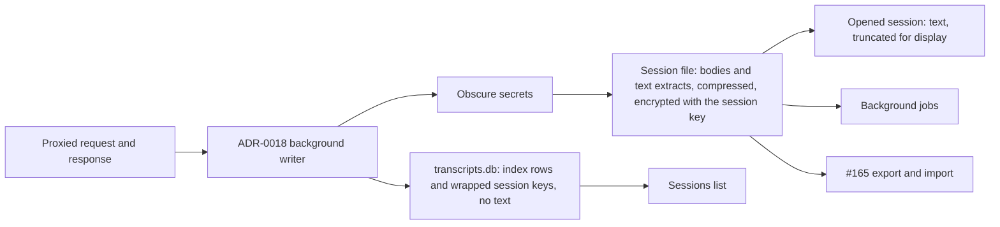

# 0019. Store conversation text in encrypted per-session files, with SQLite as a text-free index

**Status:** proposed
**Date:** 2026-09-30
**Deciders:** David Pizon

## Context and Problem Statement

Conversation text is stored today in `transcripts.db`, in the `prompt_text` and `response_text` columns of `request_transcripts`, written by `SqliteTranscriptStore`. That text is an extract, not the transaction:
- only the newest user message's text parts and the reply's text parts are kept;
- the reply comes from a response capture capped at its first 4 MiB (`UpstreamResponseWriter.MaxCapturedResponseBytes`);
- no full request or response body is stored anywhere;
- the request the router forwards is a re-serialization (`RequestBodyIntrospection`), not the bytes the client sent.

Issue #165's export and import need the full transactions.

On 2026-09-30 David set the requirements:

> Important: I want the application to store the full session text. When the application imports or exports transaction history (#165), it must always import and export the full, unadulterated, transaction text. However, the application does not need to display the conversation in the "Sessions" tab, a truncated or load-on-demand version of the task text is permissible and actually preferred to remain performant.

Later the same day he added:

> Allow secrets and key-shaped strings to be obscured when written to the file storage. This will mean that session data will not have secrets when imported or exported.

Three forces make this a storage decision, not an extension of the transcript table:

- **Privacy and security.**
  - The router creates its data folder with a plain `Directory.CreateDirectory` (`AppDataPaths`), so `transcripts.db` inherits the default `%ProgramData%` permissions. Under Windows defaults, those let local users read it.
  - `TranscriptDatabase` does not set `secure_delete`, so deleted rows stay in freed pages and in the WAL.
  - Uninstall keeps the folder.
  - The service runs as LocalSystem.
- **Size.** Agent clients resend the whole conversation with every request. On the sampled machine a request averaged about 41,000 input tokens, roughly 160 KB. Storing each turn's full request therefore repeats the history, so storage grows with the square of session length.
- **Fidelity.** Export must be complete and byte-exact apart from obscured secrets. Today's capture can provide neither.

## Decision Drivers

- **Privacy and security first**, David's first priority:
  - no readable conversation text at rest outside a protected store;
  - deletion that really removes data;
  - no secret ever written to disk.
- **Full fidelity:** stored and exported text is complete and byte-exact, except for obscured secrets.
- **Performance second:**
  - capture stays off the request path;
  - the Sessions tab stays fast;
  - storage growth stays small.
- **One retention rule the operator already controls:** the Sample Size setting.
- **Reuse existing patterns:** ADR-0015's key custody and ADR-0018's background writer.

## Considered Options

- Keep everything in SQLite, with application-level encryption and `secure_delete`
- Whole-database encryption (SQLCipher)
- SQLite index plus one encrypted file per turn
- SQLite index plus one encrypted, compressed file per session

## Decision Outcome

Chosen option: "SQLite index plus one encrypted, compressed file per session". It best serves **privacy and security first**: one key per session makes deletion real, and SQLite holds no conversation text at all. It also meets **performance second**: compressing each session across its turns measured about 50 times smaller at under a millisecond per turn, and the Sessions list reads only SQLite.

What this ADR commits to:

- **SQLite holds no conversation text.** `transcripts.db` keeps index rows only:
  - session and turn metadata;
  - each session's file id and wrapped key;
  - each turn's position in its file.

  It keeps no prompt, reply, preview or extract text. Rows derived from a session elsewhere, such as its learned embeddings, hold no conversation text either.
- **What a session file holds, per turn:**
  - the client's exchange: the request bytes exactly as received, captured before any decoding, and the response bytes exactly as relayed;
  - the provider-side request and response, only when the router translated them;
  - the text extracts that the background jobs and the Sessions tab use: the newest user message and the reply text.
- **Secrets are obscured before anything is written.** This applies to bodies and extracts, on capture and on import. It is the only change ever made to stored text.
- **Nothing is truncated.** A body is either complete or absent, never a prefix. A capture that can't complete is recorded as missing.
- **Encryption.**
  - Each session has its own random AES-GCM key.
  - That key is stored wrapped by a master key, held the way ADR-0015 holds the shared secret store (with ADR-0014's backend on other platforms).
  - The session folder is administrator-only, and the router checks that at startup.
- **Deletion.** Deleting a session destroys its key, then deletes its file, its index rows, and its learned embeddings (`memory_entries`). Once the key is destroyed, any leftover copy is unreadable.
- **Compression.**
  - Each request is stored as its change from the previous request in the same session: the shared start and end, plus the new bytes in between.
  - Records are compressed with Brotli.
  - Periodic full snapshots keep reconstruction short.
- **Retention.**
  - Keep the newest N turns, where N is the Sample Size setting (System Settings → Adaptive Routing; `RoutingOptions.EmbeddingMemoryCapacity`, default 20,000).
  - Beyond N, the oldest whole sessions are deleted.
  - There is no age or size limit. This replaces `TranscriptOptions.RetentionDays` and `TranscriptOptions.MaxRows`.
- **Capture control.** On by default, and controlled only by the existing Transcription Capture toggle (`TranscriptOptions.Enabled`). Today, transcript writes also require Adaptive Routing to be on (`RequestTelemetryPublisher.PersistTranscriptAsync`). Session capture drops that second condition, because the session files are the conversation record, not only learning data.
- **Reads.**
  - The Sessions list reads SQLite only.
  - Opening a session reads its text extracts and truncates them for display.
  - Full bodies are read only for export or an explicit full view.
- **Writes** go through ADR-0018's background writer, off the request path. Writes to any one session are serialized.
- **Upgrade.** Existing `request_transcripts` text is deleted, not migrated, in a way that removes it from the file.

### Consequences

- Good, because a copy of `transcripts.db` reveals no conversation content. All conversation text sits in one kind of protected file.
- Good, because deleting a session defeats leftovers in freed pages, the WAL, backups and copies.
- Good, because storage shrinks sharply: a 40-turn agent session measured 8.4 MiB raw and 0.17 MiB stored.
- Good, because export and import become per-session copies, byte-exact apart from obscured secrets.
- Bad, because capture changes the hot path, so ADR-0008's hub safety rules and the golden-path smoke test apply:
  - the raw request bytes must be kept before `RequestInterceptor.ResolveModelRouteAsync` decodes them;
  - the response copy loops in `UpstreamResponseWriter` and `BedrockInvocationHandler` need an uncapped copy alongside the 4 MiB telemetry capture.
- Bad, because `EmbeddingBackfillService`, `QualityRescanService`, `ClusterTrainingService` and `TokenCalibrationService` move from SQL to the file store, as do `ITranscriptStore`'s text reads.
- Bad, because old rows lose their text, with no migration. They can no longer be re-embedded, re-graded or used for token calibration.
- Bad, because a service running as LocalSystem does more file work:
  - check the folder's permissions;
  - use random file names;
  - refuse to follow junctions;
  - sweep up files a crash leaves behind, which are unreadable without their key.
- Bad, because with no age or size limit, disk use depends on turn size. The measurement stored about 4 KiB per turn, about 85 MiB at 20,000 turns, but real sessions may be larger.
- Bad, because ADR-0018's crash-loss window now covers full bodies too, and its queue must be bounded by bytes, not only by item count.
- Bad, because obscuring key-shaped strings also changes matching non-secrets, such as fake keys in code and test fixtures.
- Bad, because deleting learned embeddings with their sessions limits the learning memory to what retained sessions produced. David may revisit this if a wider window routes better.
- Neutral, because #165's plan changes:
  - its archive becomes these session files;
  - its 8 MiB per-body truncation and its separate off-by-default flag go away;
  - its redaction happens at write time.
- Neutral, because turning Adaptive Routing off no longer stops capture. Only the Transcription Capture toggle does. Anyone who relied on Adaptive Routing to stop transcripts must use that toggle instead.
- Neutral, because imported sessions appear in the Sessions tab and feed learning (#165 decision 3), so they follow the same storage, deletion and retention rules as captured sessions. They never count toward spend, savings or ROI, and never feed the benchmark tables (#165 decisions 3 and 8).
- Neutral, because #176 reads its on-demand text from session files.
- Neutral, because the `ListPersistedSessions` size fix ([#179](https://github.com/davidpizon/TotallyHot-ArcRouter/issues/179)) stays an interim fix until the list carries metadata only.

## Pros and Cons of the Options

### Keep everything in SQLite, with application-level encryption and `secure_delete`

Full bodies are added as encrypted rows, in `transcripts.db` or in #165's separate archive database.

- Good, because it is one file with atomic transactions and the fewest file operations for a LocalSystem service.
- Good, because it is the least new code: the stores and jobs keep their SQL reads, plus decryption.
- Bad, because each turn's row repeats the history, and compressing one row at a time measured only 4.4 times smaller.
- Bad, because large blobs bloat the file, need VACUUM to shrink it, and hold SQLite's single write lock while written.

### Whole-database encryption (SQLCipher)

- Good, because it encrypts everything, metadata included, without code for each field.
- Bad, because it needs a different SQLite native build, with packaging and licensing costs.
- Bad, because one key covers the whole database, so one session can't be erased by destroying its key.
- Bad, because it keeps the first option's growth and bloat.

### SQLite index plus one encrypted file per turn

- Good, because each write is independent and random access is simple.
- Bad, because the default Sample Size means twenty thousand or more files for a LocalSystem service to manage, and for antivirus and backup tools to open.
- Bad, because nothing compresses across turns, so it matches per-row compression (4.4 times smaller).
- Bad, because deleting one session means many file deletions.

### SQLite index plus one encrypted, compressed file per session

- Good, because one key per session makes deletion real, and SQLite holds no text.
- Good, because compressing across turns measured about 50 times smaller at 0.9 ms per turn.
- Good, because the session is already the unit of retention, export and deletion.
- Bad, because it needs per-session write serialization, a startup sweep, and hardened file handling.
- Bad, because reading one old turn's full body means rebuilding it from the last snapshot.

## More Information

**Measurements, 2026-09-30, on an 8-core x64 machine.**
- The session was synthetic: 40 turns in Anthropic's format, built from this repository's files.
- Each request resends the whole history, and a cache marker moves to the newest message every turn.
- Raw size was 8.4 MiB. Requests grew from 38 to 310 KiB, and responses averaged about 41 KiB.

| Method | Stored | Write per turn | Read whole session |
|---|---|---|---|
| None | 8.39 MiB | — | — |
| Brotli q4, each body alone | 1.92 MiB (4.4×) | 2.7 ms | 18 ms |
| Brotli q5, one stream per session | 0.12 MiB (69×) | 0.95 ms | 14 ms |
| Change from previous request, then Brotli q4 | 0.17 MiB (50×) | 0.86 ms | — |

- Opening a session's text took 1.3 ms. AES-GCM ran at about 7 GiB/s.
- One stream per session compressed better, but it held about 33 MiB of encoder memory per active session and loses its state on restart. So the change-from-previous method is chosen.
- Real sessions will compress differently. They still resend their history every turn, which is what this method exploits.

**Found during the investigation, tracked separately:**
- OpenAI-format stream extraction drops whitespace-only deltas.
- Transcript data sits under default permissions, and deleted rows persist.

**Left to the implementation plan:**
- the secret patterns and the marker format;
- obscuring a secret that is split across SSE events;
- the snapshot interval;
- the file format and its versioning;
- the delta base for the first turn after a restart;
- the byte bound on ADR-0018's queue.

**Related:**
- [#165 plan](../plans/issue-165-export-import-history.md)
- [#176](https://github.com/davidpizon/TotallyHot-ArcRouter/issues/176)
- [ADR-0008](0008-codegraph-serena-dual-engine-code-smell-pipeline.md)
- [ADR-0014](0014-cross-platform-service-layout-and-secret-backend.md)
- [ADR-0015](0015-machine-scoped-protection-for-the-shared-secret-store.md)
- [ADR-0018](0018-persist-request-telemetry-off-the-request-path-via-a-bounded-channel.md)
