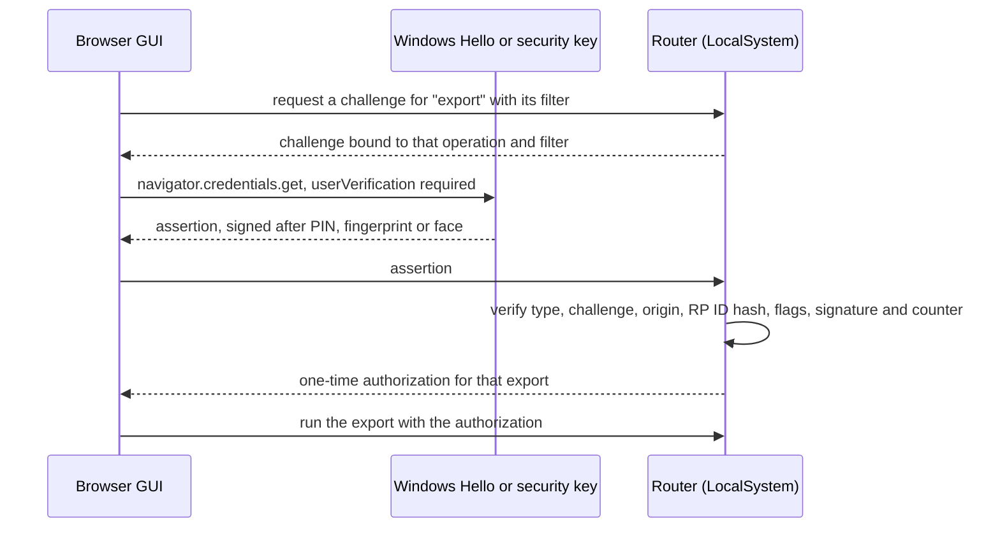

# 0020. Require passkey user verification before conversation content leaves the router

**Status:** proposed
**Date:** 2026-09-30
**Deciders:** David Pizon

## Context and Problem Statement

Under [ADR-0012](0012-loopback-session-auth-and-token-in-secret-store.md), the web port gives a management session to any caller that looks local.
- **Issuance.** `POST /auth/session` checks the Host, the Origin and the loopback address. The caller presents no credential.
- **No identity.** The returned ticket signs only the management token's generation (`ManagementSessionTicketService.IssueTicket`). Every ticket issued in one generation is identical, and none identifies a caller.
- **ADR-0012's own words.** The fast path is "available to any process/browser profile on the machine".

That session can read conversation text today:
- `ListPersistedSessions` returns stored prompt and reply text. It becomes previews once [#179](../plans/issue-179-persisted-sessions-list-size.md) lands.
- `StreamEvents` carries live `request_summary` and `response_summary` fields. It also carries `LogLineEvent` lines, which hold request and response excerpts at the shipped Debug level.
- `GetManagementToken` returns the management token. That token opens the token-login path and the MCP endpoint.
- Planned:
  - [#176](https://github.com/davidpizon/TotallyHot-ArcRouter/issues/176)'s `GetTurnTexts`;
  - [ADR-0019](0019-store-conversation-text-in-encrypted-per-session-files.md)'s full view of a session;
  - [#165](../plans/issue-165-export-import-history.md)'s export and import.

The same session can also destroy history:
- `ClearTranscripts` (`RouterSettingsAdminGrpcService`) wipes it.
- Under ADR-0019's retention, lowering Sample Size deletes every turn beyond the newest N. Sample Size is `UpdateRouterSettings`' `embedding_memory_capacity`, minimum 500.

On 2026-09-30 David set the requirement:

> I am concerned about who can export session data. I don't want to leave it open to any application that can make an HTTP call.

He then chose passkeys, and extended the gate to import. He kept Clear and lowering Sample Size off it, because they destroy history rather than disclose it.

**Why this is a decision.** Every application the operator runs acts as the operator's Windows account. Two kinds of control cannot tell those applications from the operator:
- controls that identify the account: file ACLs, pipe ACLs, the loopback session;
- controls that rely on a secret the account can read: bearer tokens.

Meeting the requirement means proving that a person approved the action. That narrows ADR-0012's boundary for conversation content, and it adds a setup step that today's zero-setup flow does not have.

The requirement surfaced in the [transcript data-protection plan](../plans/issue-TBD-transcript-data-protection.md), as its decision 1.

## Decision Drivers

- **No silent access by other applications** (David's requirement). An application running as the operator must not export, import, or read conversation text without the operator's knowledge.
- **No copyable standing secret.** Anything stored where the operator's applications can read it fails the first driver. That includes MCP client configs, browser storage, and a token file.
- **Works where the buttons already are.** #165 decision 7 puts Export and Import in a Sessions-tab modal of the browser GUI.
- **Every platform the router runs on** ([ADR-0014](0014-cross-platform-service-layout-and-secret-backend.md)): Windows, macOS, Linux, and Docker reached through a port published on the host's `localhost`.
- **Usable.** Reading sessions must not prompt on every click.
- **Keep ADR-0012 for everything else.** Metadata, routing, providers, prices and settings stay on today's session.

## Considered Options

- Keep ADR-0012's boundary for content
- Identify the calling account over a named pipe or Unix socket (tray and CLI only)
- Require an elevated (UAC) caller for content operations
- Require the management token for content operations
- Require passkey user verification (WebAuthn) for content operations

## Decision Outcome

Chosen option: "Require passkey user verification (WebAuthn) for content operations". It is the only option that proves a person approved the action (**No silent access by other applications**) without leaving a copyable secret (**No copyable standing secret**). It also runs in the browser GUI on every platform (**Works where the buttons already are**, **Every platform the router runs on**).

What this ADR commits to:

- **Credential.**
  - WebAuthn with `userVerification: "required"`. The authenticator is Windows Hello, Touch ID, or a security key. Neither the router nor the calling application ever sees the private key, and each use needs the operator's PIN, fingerprint, face or touch.
  - **Synced passkeys.** Passkeys come in two kinds:
    - **device-bound**, such as security keys, and Windows Hello keys kept on the device;
    - **synced**, where the provider (for example iCloud Keychain, Google Password Manager, or a password-manager extension) backs the private key up and copies it to the user's other devices. The authenticator reports this with the backup-eligible flag.

    **Synced passkeys are allowed** (David, 2026-09-30). The built-in passkeys on macOS sync through iCloud Keychain, so a device-bound-only rule would force a security key there. The router records the backup-eligible flag at enrollment and shows it in the passkey list.
  - The router verifies assertions with the `Fido2` library ([fido2-net-lib](https://github.com/passwordless-lib/fido2-net-lib), MIT).
  - On Windows, the tray and CLI reach the same authenticators through `webauthn.dll`, via `DSInternals.Win32.WebAuthn` ([webauthn-interop](https://github.com/MichaelGrafnetter/webauthn-interop), MIT).
  - **What the router checks.** An assertion counts only when all of these hold:
    - `clientDataJSON.type` is `webauthn.get` (`webauthn.create` at enrollment);
    - its `challenge` is the one pending for that operation;
    - its `origin` is exactly the dashboard's origin, matching scheme, host and port (`https://localhost:47104` by default). A `localhost` credential works on every port, so the router refuses a page that another local app serves on a different port;
    - the authenticator data's `rpIdHash` is the SHA-256 of `localhost`;
    - the user-present and user-verified flags are set;
    - the signature verifies against an enrolled public key, and the signature counter moves forward when the authenticator keeps one.
  - **Native callers.** An app that calls `webauthn.dll` writes its own `clientDataJSON`, so the origin check constrains browsers only. For the tray and CLI, the user-verification gesture is the boundary.
- **Relying party and origin.** The relying-party ID is `localhost`. The only accepted origin is the router's own dashboard, `https://localhost:<web port>`, which is the advertised dashboard address. `localhost` is also a name on the router's leaf certificate.
  - WebAuthn never accepts an IP literal, so the GUI redirects `https://127.0.0.1:47104` to `https://localhost:47104`.
  - Docker works when its web port is published on the host's `localhost`.
  - **A remote host name is out of scope.** Two things rule it out today:
    - [ADR-0013](0013-name-constrained-local-ca-for-router-tls.md)'s CA is name-constrained to `localhost`, `127.0.0.1` and `::1`, so it cannot issue a certificate for any other name;
    - WebAuthn needs a secure context.

    From any other origin, the gated operations are unavailable. Supporting one needs its own decision: an operator-supplied certificate or a TLS-terminating proxy, and the exact origin to allow.
- **Enrollment needs an administrator.**
  - An elevated CLI command writes a single-use enrollment code, valid for 10 minutes, into the [ADR-0015](0015-machine-scoped-protection-for-the-shared-secret-store.md) secret store, and prints it. Only `SYSTEM` and Administrators can write to that store.
  - The GUI's "Add passkey" dialog takes the code, and the router accepts a registration only with it.
  - Removing a passkey is also an elevated CLI command.
  - **Storage.** Enrolled credentials live in the same store: credential id, public key, signature counter, name, and date. They are not secret, but only an administrator can change them, so no application can add its own.
  - Several passkeys may be enrolled, so a security key can back up Windows Hello. A lost one is replaced the same way.
- **What a verification unlocks.**
  - **One operation per verification.** A fresh verification is needed every time for:
    - export and import;
    - `GetManagementToken`.

    The challenge is bound to the operation and its parameters, so an approval cannot be replayed for anything else.
  - **Challenges stay available.** Each challenge expires after two minutes, and requests are rate-limited per caller. Several challenges may be pending at once, so no application can lock the operator out by holding one open.
  - **A read window.** Reading conversation text needs a content grant. That covers `ListPersistedSessions` text, `GetTurnTexts`, ADR-0019's full view, and the text fields of `StreamEvents`.
    - **What it is.** A verification issues the grant as its own `__Host-` cookie (HttpOnly, Secure, SameSite=Strict). The cookie holds a random grant id and an expiry, checked against an in-memory table.
    - **How long it lasts.** 15 minutes by default (David, 2026-09-30). It ends early at "Lock" or a router restart, and it never authorizes a one-operation action.
    - **Why a separate cookie.** ADR-0012's ticket is the same for every caller in a generation, so it cannot carry the grant.
  - **Without a grant**, the same RPCs return metadata only. `StreamEvents` drops its text fields, checked per event, so a grant that expires mid-stream stops the text from then on.
- **Closed until enrolled** (David, 2026-09-30). Before any passkey exists, conversation text stays hidden. The gated operations are refused with `FailedPrecondition`, and the message names the enrollment command.
- **Not gated (David, 2026-09-30).** Clear, deleting a session or an import, and lowering Sample Size stay on ADR-0012's session. They destroy history rather than disclose it.
- **Everything else is unchanged.** ADR-0012's session still covers metadata, routing, providers, prices, and settings. The MCP endpoint exposes no conversation content and is also unchanged.
- **Audit.** Every challenge, verification, refusal and gated operation is logged with a static Serilog template: the operation, the credential's name, and the outcome. No conversation text is logged. The GUI lists recent approvals, so an approval the operator did not make is visible.

### Consequences

- Good, because no application can export, import, or read conversation text without the operator's gesture. The management token can no longer be lifted through the API.
- Good, because an approval covers one operation with its parameters. It cannot be replayed or widened.
- Good, because the router stores no standing secret.
  - It never sees a private key.
  - Only an administrator can change the enrolled public keys.
  - Its one bearer credential, the read grant, expires in 15 minutes and authorizes no one-operation action.
- Bad, because a fresh install shows no conversation text until an administrator enrolls a passkey. Today's zero-setup Sessions tab ends.
- Bad, because it adds friction: a prompt for each export, import and token copy, and one per read window.
- Bad, because any application that can make an HTTP call can still destroy history: it can run Clear, delete a session or an import, or lower Sample Size. David chose to leave these ungated, since they destroy data rather than disclose it.
- Bad, because the read window is a cookie. An application running as the operator that can read the browser's cookie store could reuse an unexpired grant for reads, though not for one-operation actions. The window is short for that reason.
- Bad, because some attacks remain:
  - Malware running as the operator can still capture the screen while a session is open, or read an export after it is saved.
  - Malware can also trigger a prompt at a moment the operator expects one. The GUI saying what is being approved, and its list of recent approvals, reduce that.
  - Code running elevated or as `SYSTEM` is beyond any of this (ADR-0015).
  - UAC is not a hard boundary, so the elevated enrollment stops ordinary applications, not malware that bypasses UAC.
- Bad, because synced passkeys are weaker:
  - a synced passkey's private key lives with its provider, and on every device it syncs to;
  - a passkey held by a password-manager extension verifies the user only as strongly as that manager's unlock.

  Device-bound authenticators (security keys, and Windows Hello keys kept on the device) are the ones to recommend.
- Bad, because only `https://localhost:<web port>` can use the gated features. An IP-literal URL cannot, and a remote host name cannot until a certificate path for one is decided.
- Bad, because a headless host with no platform authenticator needs a security key to use the gated operations through the router.
- Neutral, because it adds two dependencies, `Fido2` and `DSInternals.Win32.WebAuthn`, both MIT-licensed.
- Neutral, because it sets ship order: #165's export and import, #176's `GetTurnTexts`, and ADR-0019's full view must not ship before this gate. #179's previews move behind it once it exists.
- Neutral, because ADR-0012 stays in force for everything except conversation content. When this ADR is accepted, ADR-0012 gets a forward link.

## Pros and Cons of the Options

### Keep ADR-0012's boundary for content

- Good, because it needs no new code and no setup, and the GUI stays frictionless.
- Bad, because it fails the requirement: any application that can make an HTTP call can export, import and read text, and can fetch the management token.

### Identify the calling account over a named pipe or Unix socket (tray and CLI only)

On a named pipe, Windows reports the client's account, and the pipe's ACL limits who can connect. A Unix socket reports peer credentials on Linux and macOS. Kestrel serves both.

- Good, because it is an OS-enforced boundary between accounts, with no secret and no prompt.
- Good, because the service could then act as the caller for file access.
- Bad, because every application the operator runs is the operator's account, so it passes the same check. That fails the first driver.
- Bad, because the browser cannot use a pipe:
  - Export and Import would leave the Sessions tab, reversing #165 decision 7;
  - the browser's text reads would stay open.
- Bad, because a confirmation dialog in the tray adds nothing. Other applications at the same integrity level can drive it.

### Require an elevated (UAC) caller for content operations

- Good, because a UAC consent prompt runs on the secure desktop, where unelevated applications cannot click it.
- Good, because it needs no enrollment.
- Bad, because the browser cannot run elevated. Content would move to an elevated CLI or helper, out of the GUI.
- Bad, because Microsoft does not treat UAC as a security boundary, and auto-elevation bypasses exist at the default UAC level.
- Bad, because prompting on every read makes the Sessions tab unusable, and caching the elevation recreates a token.
- Bad, because it is Windows-specific. Other platforms would need their own prompts.

### Require the management token for content operations

- Good, because the mechanism already exists: the `x-admin-token` header and `/auth/login`.
- Bad, because the token is a copyable bearer secret, already written into MCP client configs that any of the operator's applications can read.
- Bad, because `GetManagementToken` hands it to any session. Closing that RPC still leaves the copies in those configs.
- Bad, because it proves possession of a string, not a person's approval.

### Require passkey user verification (WebAuthn) for content operations

- Good, because each use needs a person's gesture on an authenticator, and the private key is never exposed to the router or the calling application.
- Good, because it is built into browsers, so it works in the Sessions tab on every platform. Native clients on Windows use the same credentials.
- Good, because it binds an approval to one operation and its parameters.
- Bad, because it adds an enrollment step and prompts.
- Bad, because it is new code:
  - a challenge store and a grant table;
  - the enrollment flow;
  - the GUI prompts;
  - two libraries.
- Bad, because only the router's own `https://localhost` origin can use it. That excludes an IP literal, and a remote host name with today's CA.

## More Information

- **Requirement and context:** decision 1 of the [transcript data-protection plan](../plans/issue-TBD-transcript-data-protection.md). That plan protects the data directory, where this ADR protects the API.
- **WebAuthn and localhost.** WebAuthn accepts `localhost` as a relying-party ID and never an IP address. Browsers enforce this: Chrome allows WebAuthn on `https://localhost`, not on `https://127.0.0.1`.
- **Why not ASP.NET Core Identity's passkeys.** .NET 10 Identity's passkey support is scoped to Identity sign-in, through `SignInManager` and `UserManager`. This router has no Identity users, so a standalone library fits better.
- **Left to the implementation plan:**
  - challenge and grant lifetimes, and rate limits on challenges;
  - how the GUI shows locked text and the "Lock" control;
  - how the CLI runs the ceremony on macOS and Linux (security keys through libfido2);
  - the format of enrolled-credential entries in the secret store;
  - whether to require attestation.- **Related:** [ADR-0012](0012-loopback-session-auth-and-token-in-secret-store.md), [ADR-0013](0013-name-constrained-local-ca-for-router-tls.md), [ADR-0014](0014-cross-platform-service-layout-and-secret-backend.md), [ADR-0015](0015-machine-scoped-protection-for-the-shared-secret-store.md), [ADR-0019](0019-store-conversation-text-in-encrypted-per-session-files.md), the [#165 plan](../plans/issue-165-export-import-history.md), the [#179 plan](../plans/issue-179-persisted-sessions-list-size.md), and [#176](https://github.com/davidpizon/TotallyHot-ArcRouter/issues/176).
