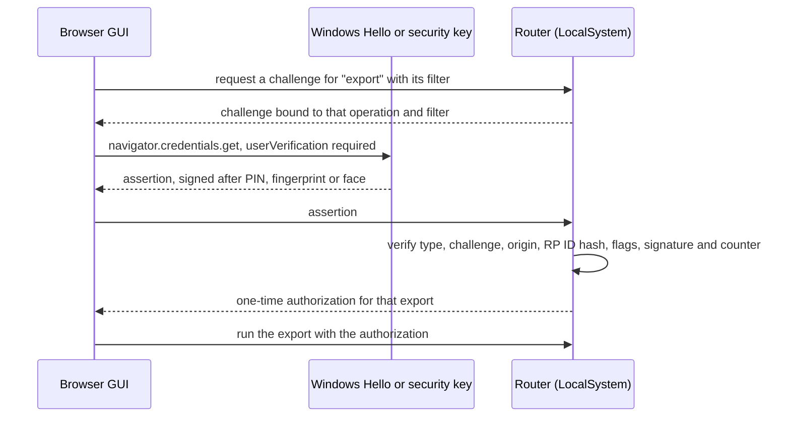

# 0020. Require passkey user verification before conversation content leaves the router

**Status:** proposed
**Date:** 2026-09-30
**Deciders:** David Pizon

## Context and Problem Statement

Under [ADR-0012](0012-loopback-session-auth-and-token-in-secret-store.md), the web port gives a management session to any caller that looks local.
- **Issuance.** `POST /auth/session` checks the Host, the Origin and the loopback address. The caller presents no credential.
- **No identity.** The returned ticket signs only the management token's generation (`ManagementSessionTicketService.IssueTicket`). Every ticket issued in one generation is identical, and none identifies a caller.
- **ADR-0012's own words.** The fast path is "available to any process/browser profile on the machine".

That session can read conversation text today:
- `ListPersistedSessions` returns stored prompt and reply text. It becomes previews once [#179](../plans/issue-179-persisted-sessions-list-size.md) lands.
- `StreamEvents` carries live `request_summary` and `response_summary` fields. It also carries `LogLineEvent` lines, which hold request and response excerpts at the shipped Debug level.
- `GetManagementToken` returns the management token, and so does `RegenerateManagementToken`, which returns the new one (`ManagementTokenAdminGrpcService`). That token opens the token-login path and the MCP endpoint.
- Planned:
  - [#176](https://github.com/davidpizon/TotallyHot-ArcRouter/issues/176)'s `GetTurnTexts`;
  - [ADR-0019](0019-store-conversation-text-in-encrypted-per-session-files.md)'s full view of a session;
  - [#165](../plans/issue-165-export-import-history.md)'s export and import.

The same session can also destroy history:
- `ClearTranscripts` (`RouterSettingsAdminGrpcService`) wipes it.
- Under ADR-0019's retention, lowering Sample Size deletes every turn beyond the newest N. Sample Size is `UpdateRouterSettings`' `embedding_memory_capacity`, minimum 500.

On 2026-09-30 David set the requirement:

> I am concerned about who can export session data. I don't want to leave it open to any application that can make an HTTP call.

He then chose passkeys, and extended the gate to import. He kept Clear and lowering Sample Size off it, because they destroy history rather than disclose it.

**Why this is a decision.** Every application the operator runs acts as the operator's Windows account. Two kinds of control cannot tell those applications from the operator:
- controls that identify the account: file ACLs, pipe ACLs, the loopback session;
- controls that rely on a secret the account can read: bearer tokens.

Meeting the requirement means proving that a person approved the action. That narrows ADR-0012's boundary for conversation content, and it adds a setup step that today's zero-setup flow does not have.

The requirement surfaced in the [transcript data-protection plan](../plans/issue-184-transcript-data-protection.md) for [#184](https://github.com/davidpizon/TotallyHot-ArcRouter/issues/184), as its decision 1. This ADR is tracked in [#185](https://github.com/davidpizon/TotallyHot-ArcRouter/issues/185).

## Decision Drivers

- **No silent access by other applications** (David's requirement). An application running as the operator must not export, import, or read conversation text without the operator's knowledge.
- **No copyable standing secret.** Anything stored where the operator's applications can read it fails the first driver. That includes MCP client configs, browser storage, and a token file.
- **Works where the buttons already are.** #165 decision 7 puts Export and Import in a Sessions-tab modal of the browser GUI.
- **Every platform the router runs on** ([ADR-0014](0014-cross-platform-service-layout-and-secret-backend.md)): Windows, macOS, Linux, and Docker reached through a port published on the host's `localhost`.
- **Usable.** Reading sessions must not prompt on every click.
- **Keep ADR-0012 for everything else.** Metadata, routing, providers, prices and settings stay on today's session.

## Considered Options

- Keep ADR-0012's boundary for content
- Identify the calling account over a named pipe or Unix socket (tray and CLI only)
- Require an elevated (UAC) caller for content operations
- Require the management token for content operations
- Require passkey user verification (WebAuthn) for content operations

## Decision Outcome

Chosen option: "Require passkey user verification (WebAuthn) for content operations". It is the only option that proves a person approved the action (**No silent access by other applications**) without leaving a copyable secret (**No copyable standing secret**). It also runs in the browser GUI on every platform (**Works where the buttons already are**, **Every platform the router runs on**).

What this ADR commits to:

- **Credential.**
  - WebAuthn with `userVerification: "required"`. The authenticator is Windows Hello, Touch ID, or a security key. Neither the router nor the calling application ever sees the private key, and each use needs user verification: the operator's PIN, fingerprint or face. A touch alone proves only that someone is present, so a security key that offers no PIN or built-in biometric cannot satisfy `required`. It can be neither enrolled nor used.
  - **Synced passkeys.** Passkeys come in two kinds:
    - **device-bound**, such as security keys, and Windows Hello keys kept on the device;
    - **synced**, where the provider (for example iCloud Keychain, Google Password Manager, or a password-manager extension) backs the private key up and copies it to the user's other devices.

    The authenticator reports two separate flags. Backup eligible (`BE`) means the credential *can* be backed up. Backup state (`BS`) means it currently *is*, and that can change after enrollment.

    **Synced passkeys are allowed** (David, 2026-09-30). The built-in passkeys on macOS sync through iCloud Keychain, so a device-bound-only rule would force a security key there.
    - The router records both flags at enrollment, and updates `BS` from every assertion.
    - The passkey list shows "can sync" from `BE`, and "synced" or "not synced" from the latest `BS`.
  - **No attestation is required.** Synced passkeys from providers such as iCloud Keychain and Google Password Manager return none, so requiring it would undo the decision to allow them. What keeps an unknown authenticator out is the administrator-only enrollment code.
  - The router verifies assertions with the `Fido2` library ([fido2-net-lib](https://github.com/passwordless-lib/fido2-net-lib), MIT).
  - On Windows, the tray and CLI reach the same authenticators through `webauthn.dll`, via `DSInternals.Win32.WebAuthn` ([webauthn-interop](https://github.com/MichaelGrafnetter/webauthn-interop), MIT).
    - **Windows 10 1809.** `webauthn.dll` first shipped in Windows 10 1903, and the library needs it. The README still supports 1809 (build 17763), which Windows 10 Enterprise LTSC 2019 runs.
    - On 1809 the tray and CLI check for the API before a ceremony. They refuse the gated operation, and the message sends the operator to the dashboard.
    - The dashboard still works with a security key: without `webauthn.dll`, Chromium-based browsers fall back to their own USB support. Windows Hello is unavailable, because browsers reach it only through that API.
    - Raising the product minimum to 1903 would remove this case. That is a separate decision; this ADR does not make it.
  - **macOS and Linux.** The CLI runs no ceremony there. It refuses the gated operation, and the message sends the operator to the dashboard, as on 1809.
    - Neither platform offers a CLI a system WebAuthn API the way Windows offers `webauthn.dll`. macOS's passkey API (AuthenticationServices) serves only an app entitled for the relying party's domain, and Linux has no system API. A native ceremony would need a native library such as libfido2, which reaches security keys only, and has to be packaged for every distribution.
    - Adding one later is a separate decision; this ADR does not make it.
  - **What the router checks.** An assertion counts only when all of these hold:
    - `clientDataJSON.type` is `webauthn.get` (`webauthn.create` at enrollment);
    - its `challenge` is the one pending for that operation, and verification consumes that challenge atomically (compare and remove) before it issues any authorization. It removes the challenge first, before any other check, so every attempt uses the challenge up, whether verification then passes or fails; after a failure the operator starts a new ceremony. A replayed assertion, whether concurrent or later, then finds no pending challenge. Synced passkeys often keep the signature counter at zero, so the counter alone cannot catch a replay;
    - its `origin` is exactly the dashboard's origin, matching scheme, host and port (`https://localhost:47104` by default). A `localhost` credential works on every port, so the router refuses a page that another local app serves on a different port;
    - the authenticator data's `rpIdHash` is the SHA-256 of `localhost`;
    - the user-present and user-verified flags are set;
    - the signature verifies against an enrolled public key, and the signature counter moves forward when the authenticator keeps one.
  - **Native callers.** An app that calls `webauthn.dll` writes its own `clientDataJSON`, so the origin check constrains browsers only. For the tray and CLI, the user-verification gesture is the boundary.
- **Relying party and origin.** The relying-party ID is `localhost`. The only accepted origin is the router's own dashboard, `https://localhost:<web port>`, which is the advertised dashboard address. `localhost` is also a name on the router's leaf certificate.
  - WebAuthn never accepts an IP literal, so the GUI redirects `https://127.0.0.1:47104` to `https://localhost:47104`.
  - Docker works when its web port is published on the host's `localhost`.
  - **A remote host name is out of scope.** Two things rule it out today:
    - [ADR-0013](0013-name-constrained-local-ca-for-router-tls.md)'s CA is name-constrained to `localhost`, `127.0.0.1` and `::1`, so it cannot issue a certificate for any other name;
    - WebAuthn needs a secure context.

    From any other origin, the gated operations are unavailable. Supporting one needs its own decision: an operator-supplied certificate or a TLS-terminating proxy, and the exact origin to allow.
- **Enrollment needs an administrator.**
  - **The code is unguessable.** The enrollment code is the only credential the registration endpoint accepts, and every loopback application can reach that endpoint.
    - It comes from a cryptographically secure generator, with at least 128 bits of entropy, shown as grouped base32 characters for typing.
    - The router compares it in constant time.
    - Five wrong codes invalidate it, and the operator mints a new one.
  - **A privileged handoff, not a direct write.** An elevated CLI command asks the running service for a single-use enrollment code, valid for 10 minutes, over a local channel that only an elevated caller can open:
    - **Windows:** a named pipe whose ACL admits only `SYSTEM` and Administrators, so only an elevated token can connect;
    - **Linux and macOS:** a Unix socket in the protected state directory, where the service accepts a peer only if its credentials are root or the service account.

    The service writes the code into the [ADR-0015](0015-machine-scoped-protection-for-the-shared-secret-store.md) secret store itself, and the CLI prints it.
  - **Why the CLI never writes the store.** `SecureFile.WriteMachineShared` would grant the invoking user full control on Windows, letting that user's unelevated applications rewrite the enrolled credentials. On Linux and macOS it would leave a root-owned `0600` file that the service cannot read.
  - **Pipe squatting.** The service creates the pipe as its first instance, and the CLI checks that the server process is the service before it sends anything.
  - **Not the rejected pipe option.** This channel does not gate content. It only proves that the caller is elevated, which an unelevated application cannot fake.
  - The GUI's "Add passkey" dialog takes the code, and the router accepts a registration only with it.
  - Removing a passkey goes through the same channel.
  - **Storage.** Enrolled credentials live in the same store: credential id, public key, signature counter, name, and date. They are not secret, but only `SYSTEM` and Administrators can change them, so no application can add its own. That depends on the data-protection plan's change to `WriteMachineShared`, which stops granting the writing account an ACE on machine-wide writes.
  - **Prerequisite: #184's phase 1.**
    - **Why.** Today `secrets.dat` can still grant its last writer full control, and `WriteMachineShared` keeps adding that ACE. So an unelevated application of that user could add its own credential and skip enrollment.
    - **Order.** #184's phase 1 therefore ships first, including migrating the existing store's ACL.
    - **Startup check.** At startup, the gate checks the store itself. On Windows, any ACE for an individual account fails the check. On Linux and macOS, a store not owned by the service account with mode `0600` fails it.
    - **On failure** the gate fails closed: enrollment is refused, the gated operations stay unavailable, and the log names the fix.
  - Several passkeys may be enrolled, so a security key can back up Windows Hello. A lost one is replaced the same way.
- **What a verification unlocks.**
  - **One operation per verification.** A fresh verification is needed every time for:
    - export and import;
    - `GetManagementToken`, and `RegenerateManagementToken`, which also returns a token.

    The challenge is bound to the operation and its parameters, so an approval cannot be replayed for anything else.

    **The authorization is single-use too.** Consuming the challenge stops a replayed assertion, but the authorization it returns is a bearer token of its own.
    - **Stored with its binding.** The router stores each authorization with the operation and parameters its challenge was bound to, and an expiry two minutes after issue.
    - **Consumed first.** A gated request removes the authorization atomically (compare and remove) before any gated work starts. Only then does the router check that the request's operation and parameters match the stored binding, and that the authorization has not expired. A mismatch or an expired authorization fails the request, and the authorization is gone either way.
    - **So** two concurrent requests that present the same authorization get one operation between them, and a failed request needs a new verification.
    - **No flood.** An authorization exists only after a passkey gesture, so no application can fill that table.

    **Import binds to the bytes, not a path.** The archive is first staged into a router-owned spool in the protected data directory, and the challenge binds the staged file's SHA-256. The router then imports exactly the bytes the operator approved. Replacing the source file after the ceremony changes nothing, and an approval for one archive cannot import another.

    **Staging is bounded**, because it happens before the passkey check:
    - only one stage exists at a time, and a new upload replaces an unclaimed one;
    - before any data is written, an upload is refused unless its declared length fits in free space minus #165's reserve (the larger of 1 GiB and 10% of the volume);
    - an upload that grows past its declared length is cut off;
    - an unclaimed stage expires after 10 minutes, and every stage is deleted at startup.

    Any application can still occupy or churn the staging slot. Like challenge flooding, that is an accepted denial of service. It cannot exhaust the disk, or import anything without the gesture.
  - **Challenge store.** Each challenge is 32 bytes from a cryptographically secure generator (WebAuthn requires at least 16). Challenges live in one global, bounded store: at most 32 pending, each expiring after two minutes, with the oldest evicted when the store is full.
    - **No per-caller limit.** The router cannot rate-limit per caller, because nothing tells one loopback caller from another: every ticket in a generation is identical, and all callers share the loopback address.
    - **Issuance is bounded too.** One global token bucket admits challenge requests, for example 10 a minute with bursts of 5.
      - Requests beyond it are refused with `ResourceExhausted`.
      - Refusals are logged as one coalesced line per minute with a count.

      So a flood cannot burn CPU without limit, fill the log, or push real audit records out of the 30-file window.
    - **Denial of service.** An application that floods challenges can evict the operator's challenge, or use up the global allowance. The ceremony then fails, and the GUI offers a retry, which may wait up to a minute for the allowance to refill. The flood still cannot produce an approval without the operator's gesture.
    - **Accepted.** Availability against a hostile local application is not a goal of this ADR; the gate protects against disclosure. Every challenge is logged, so a flood is visible.
  - **A read window.** Reading conversation text needs a content grant. That covers `ListPersistedSessions` text, `GetTurnTexts`, ADR-0019's full view, and the text fields of `StreamEvents`.
    - **What it is.** A verification returns the grant as an opaque token in the response body.
      - The token is 256 bits from a cryptographically secure generator.
      - The router keys its table by a hash of the token, so a lookup's timing reveals nothing about a valid one.
      - The dashboard keeps it only in memory, and sends it in a request header (`x-content-grant`) on content RPCs.
      - The router checks it, and its expiry, against an in-memory table.
      - A page reload loses it, and the operator verifies again.
      - One-operation authorizations are generated, stored and carried the same way. Like the grant, they are bearer credentials that any loopback caller could present, so a predictable value would bypass the passkey check.
    - **How long it lasts.** 15 minutes by default (David, 2026-09-30). It ends early at "Lock" or a router restart, and it never authorizes a one-operation action.
    - **Ending a grant clears the screen too.** The router's checks stop only future reads. Text already delivered stays in the dashboard's component state, caches and rendered page. So the dashboard discards the grant and every piece of conversation text it holds, and re-renders metadata only, whenever:
      - the grant's expiry passes. The verification response states the expiry, and the dashboard sets its own timer for it;
      - the operator presses "Lock";
      - a content RPC fails because the grant is missing, expired or unknown. That is how a grant lost to a router restart shows up;
      - the event stream reconnects after a router restart.

      The dashboard never puts conversation text in browser storage, so clearing what it holds in memory removes all of it.
    - **Why not a cookie.** Cookies are scoped to a host, not a port. The browser would send a `localhost` cookie to any trusted `https://localhost:<other port>` service, where another local application could capture it and replay it. Script state is scoped to the full origin (scheme, host and port), so the token never leaves the dashboard. ADR-0012's ticket cannot carry the grant either, because every caller in a generation gets the same ticket.
  - **Without a grant**, the same RPCs return metadata only. `StreamEvents` drops its text fields, checked per event, so a grant that expires mid-stream stops the text from then on.
  - **Marked log lines.** `LogLineEvent` today carries only a rendered `message` (`TelemetryLogEventSink`), so nothing tells a conversation-bearing line from a diagnostic one.
    - The four conversation-bearing templates (#184's F9) set a marker property at the source.
    - `TelemetryLogEventSink` copies it into a new, additive `content_bearing` field.
    - `StreamEvents` drops marked lines for sessions without a grant. Every other line still streams, so the Console tab keeps its diagnostics while locked.
    - #184's opt-in body files select their lines by the same marker.
- **Closed until enrolled** (David, 2026-09-30). Before any passkey exists, conversation text stays hidden. The gated operations are refused with `FailedPrecondition`, and the message names the enrollment command.
- **Not gated (David, 2026-09-30).** Clear, deleting a session or an import, and lowering Sample Size stay on ADR-0012's session. They destroy history rather than disclose it.
- **Everything else is unchanged.** ADR-0012's session still covers metadata, routing, providers, prices, and settings. The MCP endpoint exposes no conversation content and is also unchanged.
- **Audit.** Every issued challenge, verification and gated operation is logged with a static Serilog template: the operation, the credential's name, and the outcome. Refused challenge requests are coalesced, as described under "Challenge store". No conversation text is logged. The GUI lists recent approvals, so an approval the operator did not make is visible.

### Consequences

- Good, because no application can export, import, or read conversation text without the operator's gesture. The management token can no longer be lifted through the API.
- Good, because an approval covers one operation with its parameters. It cannot be replayed or widened.
- Good, because the router stores no standing secret.
  - It never sees a private key.
  - Only an administrator can change the enrolled public keys.
  - Its bearer credentials are short-lived. The read grant expires in 15 minutes and authorizes no one-operation action. A one-operation authorization works once, within two minutes.
- Bad, because a fresh install shows no conversation text until an administrator enrolls a passkey. Today's zero-setup Sessions tab ends.
- Bad, because it adds friction: a prompt for each export, import, token copy and token regeneration, and one per read window.
- Bad, because any application that can make an HTTP call can still destroy history: it can run Clear, delete a session or an import, or lower Sample Size. David chose to leave these ungated, since they destroy data rather than disclose it.
- Bad, because the read grant is a bearer token for its 15 minutes. An application that can read the dashboard's memory, for example by injecting into the browser, could reuse it for reads, though not for one-operation actions. The window is short for that reason.
- Bad, because any local application can disrupt a verification by flooding challenges (see "Challenge store"), or by churning the single import stage. It cannot pass the gate, but it can make the operator retry, or wait up to a minute for the issuance allowance to refill.
- Bad, because some attacks remain:
  - Malware running as the operator can still capture the screen while a session is open, or read an export after it is saved.
  - Malware can also trigger a prompt at a moment the operator expects one. The GUI saying what is being approved, and its list of recent approvals, reduce that.
  - Code running elevated or as `SYSTEM` is beyond any of this (ADR-0015).
  - UAC is not a hard boundary, so the elevated enrollment stops ordinary applications, not malware that bypasses UAC.
- Bad, because synced passkeys are weaker:
  - a synced passkey's private key lives with its provider, and on every device it syncs to;
  - a passkey held by a password-manager extension verifies the user only as strongly as that manager's unlock.

  Device-bound authenticators (security keys, and Windows Hello keys kept on the device) are the ones to recommend.
- Bad, because only `https://localhost:<web port>` can use the gated features. An IP-literal URL cannot, and a remote host name cannot until a certificate path for one is decided.
- Bad, because a headless host with no platform authenticator needs a security key to use the gated operations through the router.
- Bad, because on Windows 10 1809 the tray and CLI cannot run a ceremony, and Windows Hello is unavailable. A security key in the dashboard is the only way through the gate there.
- Bad, because on macOS and Linux the CLI cannot run a ceremony either, so the gated operations go through the dashboard there.
- Neutral, because it adds two dependencies, `Fido2` and `DSInternals.Win32.WebAuthn`, both MIT-licensed. It adds no native library, because the CLI on macOS and Linux sends the operator to the dashboard.
- Neutral, because it sets ship order: #165's export and import, #176's `GetTurnTexts`, and ADR-0019's full view must not ship before this gate. #179's previews move behind it once it exists.
- Neutral, because ADR-0012 stays in force for everything except conversation content. When this ADR is accepted, ADR-0012 gets a forward link.

## Pros and Cons of the Options

### Keep ADR-0012's boundary for content

- Good, because it needs no new code and no setup, and the GUI stays frictionless.
- Bad, because it fails the requirement: any application that can make an HTTP call can export, import and read text, and can fetch the management token.

### Identify the calling account over a named pipe or Unix socket (tray and CLI only)

On a named pipe, Windows reports the client's account, and the pipe's ACL limits who can connect. A Unix socket reports peer credentials on Linux and macOS. Kestrel serves both.

- Good, because it is an OS-enforced boundary between accounts, with no secret and no prompt.
- Good, because the service could then act as the caller for file access.
- Bad, because every application the operator runs is the operator's account, so it passes the same check. That fails the first driver.
- Bad, because the browser cannot use a pipe:
  - Export and Import would leave the Sessions tab, reversing #165 decision 7;
  - the browser's text reads would stay open.
- Bad, because a confirmation dialog in the tray adds nothing. Other applications at the same integrity level can drive it.

### Require an elevated (UAC) caller for content operations

- Good, because a UAC consent prompt runs on the secure desktop, where unelevated applications cannot click it.
- Good, because it needs no enrollment.
- Bad, because the browser cannot run elevated. Content would move to an elevated CLI or helper, out of the GUI.
- Bad, because Microsoft does not treat UAC as a security boundary, and auto-elevation bypasses exist at the default UAC level.
- Bad, because prompting on every read makes the Sessions tab unusable, and caching the elevation recreates a token.
- Bad, because it is Windows-specific. Other platforms would need their own prompts.

### Require the management token for content operations

- Good, because the mechanism already exists: the `x-admin-token` header and `/auth/login`.
- Bad, because the token is a copyable bearer secret, already written into MCP client configs that any of the operator's applications can read.
- Bad, because `GetManagementToken` and `RegenerateManagementToken` hand it to any session. Closing those RPCs still leaves the copies in those configs.
- Bad, because it proves possession of a string, not a person's approval.

### Require passkey user verification (WebAuthn) for content operations

- Good, because each use needs a person's gesture on an authenticator, and the private key is never exposed to the router or the calling application.
- Good, because it is built into browsers, so it works in the Sessions tab on every platform. Native clients on Windows use the same credentials.
- Good, because it binds an approval to one operation and its parameters.
- Bad, because it adds an enrollment step and prompts.
- Bad, because it is new code:
  - a challenge store and a grant table;
  - the enrollment flow;
  - the GUI prompts;
  - two libraries.
- Bad, because only the router's own `https://localhost` origin can use it. That excludes an IP literal, and a remote host name with today's CA.

## More Information

- **Tracking issue:** [#185](https://github.com/davidpizon/TotallyHot-ArcRouter/issues/185). Its implementation plan will be `docs/plans/issue-185-passkey-content-gate.md`, written once the issue is boarded.
- **Requirement and context:** decision 1 of the [transcript data-protection plan](../plans/issue-184-transcript-data-protection.md) (#184). That plan protects the data directory, where this ADR protects the API.
- **WebAuthn and localhost.** WebAuthn accepts `localhost` as a relying-party ID and never an IP address. Browsers enforce this: Chrome allows WebAuthn on `https://localhost`, not on `https://127.0.0.1`.
- **Why not ASP.NET Core Identity's passkeys.** .NET 10 Identity's passkey support is scoped to Identity sign-in, through `SignInManager` and `UserManager`. This router has no Identity users, so a standalone library fits better.
- **Left to the implementation plan:**
  - the exact issuance rate (the token bucket above is illustrative);
  - whether the fixed limits can be configured: two-minute challenges and authorizations, a 32-entry store, and the 15-minute grant;
  - how the GUI shows locked text and the "Lock" control;
  - the format of enrolled-credential entries in the secret store;
  - the names of the enrollment pipe and socket, and their request format.
- **Related:** [ADR-0012](0012-loopback-session-auth-and-token-in-secret-store.md), [ADR-0013](0013-name-constrained-local-ca-for-router-tls.md), [ADR-0014](0014-cross-platform-service-layout-and-secret-backend.md), [ADR-0015](0015-machine-scoped-protection-for-the-shared-secret-store.md), [ADR-0019](0019-store-conversation-text-in-encrypted-per-session-files.md), the [#165 plan](../plans/issue-165-export-import-history.md), the [#179 plan](../plans/issue-179-persisted-sessions-list-size.md), and [#176](https://github.com/davidpizon/TotallyHot-ArcRouter/issues/176).
