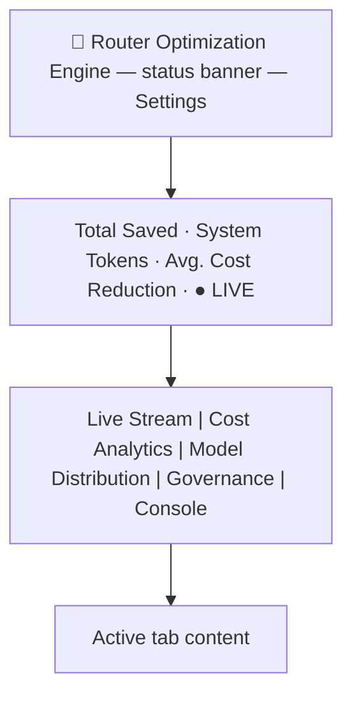

# TotallyHotArcRouter.Gui Dashboard

This document describes the dashboard UI rendered inside `TotallyHotArcRouter.Gui`'s window
(`src/TotallyHotArcRouter.Gui/Components/`). For the tray-app shell itself (tray icon, show/hide behavior,
build/run instructions), see [`src/TotallyHotArcRouter.Gui/README.md`](../../src/TotallyHotArcRouter.Gui/README.md).

## Purpose

The dashboard presents routing, cost, and governance telemetry for the TotallyHotArcRouter proxy: which
requests were routed to which upstream model, how much that saved versus a worst-case baseline, token
volume trends, model market share, and per-provider budget status.

**Current status: mixed live and mock data.** The **Live Stream** tab and the **Console** tab are
wired to live telemetry pushed from the `TotallyHotArcRouter` proxy over gRPC (`Services/LiveDataStore.cs`)
- see [`../router/telemetry.md`](../router/telemetry.md) for the routing-telemetry pipeline and this
doc's Console tab section above for the log-line pipeline. Until the proxy is running and reachable
(or before it has forwarded any requests / emitted any log events), those surfaces simply show no
data rather than falling back to mock data. The **Cost Analytics** tab is **live + mock merged**: it
plots live conversation turns when present, on top of a deterministic timestamped mock history
(`MockData.BuildMetricHistory`) so every metric/range renders offline; the metrics that have no live
source (ROI, tool steps, cache, context) are demonstrated by the mock history only. Model
Distribution and the header ticker still read entirely from the hard-coded `MockData` class - no
telemetry source exists for that data yet (see `../gui/backlog.md`). Governance's **Providers** and
**Price Sources** sub-views are fully live against the proxy; per-provider monthly budgets now live on
each Providers card (real caps in SQLite, real current-month spend), replacing the former mock **Budgets**
sub-view.

## Stack

| Layer | Choice |
| --- | --- |
| App shell | .NET MAUI (Windows-only, single window, tray-resident via Win32 interop) |
| UI framework | Razor components in a MAUI `BlazorWebView` (Blazor Hybrid) |
| Styling | A static stylesheet (`wwwroot/css/app.css`) containing the dashboard's compiled Tailwind utility classes plus custom rules; state-driven colors are inline styles in the components |
| Charts | [Apache ECharts](https://echarts.apache.org/) (`echarts.min.js` vendored under `wwwroot/lib/echarts`, Apache-2.0), driven by `wwwroot/js/echarts-interop.js` via the shared `<EChart>` host - the seven bespoke Cost Analytics charts plus Model Distribution's grouped bars and donut; plus a hand-rolled inline SVG sparkline (no chart library) for the Live Stream summary card |
| Icons | Small inline SVG glyphs (`Components/Icon.razor`) |
| Chart data logic | `src/TotallyHotArcRouter.Gui.Charts/` - a plain `net10.0` class library (no MAUI/Blazor dependency) holding the pure data-transformation math behind the charts (cumulative token series, sparkline coordinate normalization), so it's unit-testable on any platform even though the Gui project itself is Windows-only. See `TotallyHotArcRouter.Gui.Charts.Tests/`. |
| Console tab logic | `src/TotallyHotArcRouter.Gui.Console/` - same pattern as the chart data logic above: a plain `net10.0` class library holding `LogLevelColorMapper` and the bounded `LogBuffer`. See `TotallyHotArcRouter.Gui.Console.Tests/`. |

The dashboard has no web build step: the Razor components compile with the .NET project, the stylesheet
is checked-in static content, and the chart JavaScript ships inside the NuGet package's static web
assets (so everything works offline). All navigation is client-side component state (`_activeTab` in
`Components/Dashboard.razor`); there is no router, dev server, or backend API.

The UI is a conversion of an earlier React/Vite/Tailwind implementation of the same design; the visual
design, layout, colors, and mock data carry over unchanged. Because the stylesheet is the *compiled*
Tailwind output of that design, new markup must stick to utility classes that already appear in it (or
add plain CSS to `app.css`) - there is no Tailwind build to generate new utilities.

## Visual theme

See [`DESIGN.md`](DESIGN.md) for the full design system (palette, typography, components, elevation,
do's and don'ts). In short: dark theme only, fixed (no light mode / no theme toggle), Inter UI text
with JetBrains Mono for all numeric/monospace values.

The whole app is a fixed-height, non-scrolling shell (`h-screen overflow-hidden`) with individual panels
scrolling internally where their content can overflow.

## Layout

### Header

- Brand: `🤖 Router Optimization Engine`.
- Status banner (center): reads live per-provider budget utilization from `ProviderAdminStore` (real
  caps + current-month spend). Providers with no budget are ignored.
  - All budgeted providers under 80%: green pulsing dot + "System Status: OK".
  - Any provider ≥ 100%: red "🚨 N PROVIDER BREACHED" (or "N BREACHED" alongside approaching count).
  - Any provider ≥ 80% and < 100%: amber "⚠️ N PROVIDER APPROACHING LIMIT".
  - Clicking the banner (when there's an alert) jumps to the **Governance** tab's Providers view.
- **Settings** button (top right) opens the settings modal.
- Ticker row: three mock aggregate stats (Total Saved, System Tokens, Avg. Cost Reduction) plus a `LIVE`
  indicator with a pulsing dot.

### Tabs

1. **Live Stream** (`LiveStream.razor`, default tab) - a conversation-centric two-panel view. The
   panels are adjustable split panes: a full-height divider between them can be dragged to resize
   (pointer handling in `wwwroot/js/split-pane.js`; left panel defaults to 35% width, clamped 20-65%).
   - Left panel (`ConversationCard.razor`): a searchable, scrollable list of conversations, sourced
     live from `Services/LiveDataStore.cs` (empty until the proxy has forwarded at least one
     request; see [`../router/telemetry.md`](../router/telemetry.md)). Each card shows the
     conversation title, first → last turn timestamps,
     total session cost, total tokens (K/M notation), turn count, and color-dotted names of the first
     two distinct agents; conversations containing fallback turns get an amber `⚠` badge and left
     border. Search filters by title, session ID, agent name, or model name.
   - Right panel, top (`ConversationSummary.razor`): a compact pinned summary card for the selected
     conversation that stays visible while the turn list scrolls. A title row (title, fallback badge
     when applicable, session ID + time range) above a one-line stat strip - Total Cost, Total Tokens,
     Avg ROI, Turns, and a **Trend** sparkline (inline SVG polyline, per-turn total tokens, built from
     `TotallyHotArcRouter.Gui.Charts.SparklineLayout` - only rendered when the conversation has turns) - each
     stat with a tooltip explaining the metric.
   - Right panel, below (`TurnCard.razor`): the scrollable list of the conversation's turns as compact
     two-line cards, so many turns fit on screen. Each card's background and left border are tinted
     with the selected agent's color (deterministic per-agent color from `Utils/ColorUtils.cs`, the
     same tinted-row visual language as the routing decision log). The header line shows the turn
     position (N/M), the first words of the turn's request text as the card title, a color-coded agent
     chip naming the agent the router selected, a fallback badge when applicable, and the timestamp.
     The second line is a wrapping stat strip ranked by business priority - ROI, Cost, Tok P/C, Steps,
     Cache, TTFT, Ctx, Model - every stat carrying a tooltip that defines the metric. Prompt-token
     growth across successive turns makes token compounding (the "hockey stick" curve) visible while
     scrolling. Clicking the header expands a drill-down: the step-by-step "Routing Decision" log with
     color-coded row backgrounds (`Ok` = green, `Warn` = amber, `Info` = blue) plus the turn's request
     and response text in scrollable blocks.
   - Tooltips: metric tooltips across the tab are floating tooltips driven by `data-tip` attributes
     (`wwwroot/js/tooltips.js`, a single body-level element) rather than native `title` attributes,
     so they render reliably inside the BlazorWebView and are never clipped by scroll containers.
     Keyboard-accessible: every `data-tip` element not nested inside a `<button>` also carries
     `tabindex="0"` and a static `aria-describedby="ls-tooltip"`, and `tooltips.js` shows/hides on
     `focusin`/`focusout` (in addition to hover) and dismisses on Escape. The shared tooltip element
     is hidden via opacity rather than `display:none` specifically so it stays in the accessibility
     tree (`display:none` would break `aria-describedby`). The handful of `data-tip` spans that *are*
     nested inside a card's outer `<button>` (e.g. the turn-position/agent-chip/fallback badges in a
     `TurnCard` header, or every stat on a `ConversationCard`) intentionally skip `tabindex` - nesting
     a focusable element inside a `<button>` is an ARIA anti-pattern - and instead the outer button
     carries a comprehensive `aria-label` summarizing the same facts for screen-reader users.

2. **Cost Analytics** (`CostAnalytics.razor`) - a **metric explorer** where each metric renders in its
   own bespoke chart format, per [`cost-analytics-visualization-spec.md`](cost-analytics-visualization-spec.md).
   A control bar lets the user pick one of the seven ranked Perf/$ metrics, a time range, and a
   session scope; one chart below plots the choice.
   - **Metric selector**: a pill row ranked 1-7 by business priority - Routing ROI, Turn Cost,
     Tokens, Tool Steps, Cache Hit, TTFT, Context Buffer (the `CostMetric` enum order in
     `TotallyHotArcRouter.Gui.Charts.CostChartBuilder`).
   - **Time range**: Hour / Day / Week / Month / All - the window each chart's per-turn points are
     filtered to.
   - **Session scope**: a `<select>` of `All Sessions` plus each session in the corpus (live
     conversations from `Services/LiveDataStore.cs` by title - same source as the Live Stream tab -
     then the mock demo sessions). Defaults to whatever session the Live Stream tab has selected,
     passed in as `InitialSessionId`.
   - **Bespoke per-metric charts** (Apache ECharts, one point per turn on a time x-axis): Routing ROI
     is a dual-directional bar chart (savings above 0, fallback remediation below, colored by model);
     Turn Cost a stepped cumulative area recolored per active model; Tokens a cumulative stepped area
     with exponential-runaway detection (hatched zone + rippling alert); Tool Steps a per-turn bar
     segmented by the model that handled each stretch of steps; Cache Hit a stepped % line with a
     gradient track; TTFT a stepped latency line over per-model background zones with spikes pinned;
     Context Buffer a stepped % line with a fixed 90% threshold and pulsing breaches. Colors are
     deterministic via `TotallyHotArcRouter.Gui.Charts.ChartPalette` (which `Utils/ColorUtils` now delegates
     to). The chart models are built by `TotallyHotArcRouter.Gui.Charts.CostChartBuilder.Build` (pure,
     unit-tested in `TotallyHotArcRouter.Gui.Charts.Tests`), serialized with `ChartJson`, and rendered
     through the shared `<EChart>` host + `wwwroot/js/echarts-interop.js`.
   - **Data source**: the corpus is the live conversation turns (real tokens/cost/TTFT/model/
     timestamp) **merged with** `MockData.BuildMetricHistory(now)` - a deterministic, timestamped
     multi-session history spanning the last hour back through months, with fixed exemplar events (a
     token runaway, a TTFT spike, a fallback, context breaches) so every chart shows its special state
     even with no proxy running. Every rich tooltip figure (worst-case baseline, per-step model split,
     cached/uncached tokens, context token counts, cold-start split) is **derived in `CostChartBuilder`**
     from each turn's existing fields, so nothing new has to flow through telemetry. This supersedes the
     tab's former combo chart (a single metric line plus per-model stacked bars). Note that ROI, tool
     steps, cache, and context are still 0 for *live* turns (no proxy source - see
     `../router/telemetry.md`), so the mock history is what demonstrates those metrics.

3. **Model Distribution** (`ModelDistribution.razor`) - a time-range filter bar (Day/Month/3-Month/
   6-Month/Year - visual only, does not currently refilter data) with From/To text inputs, above:
   - A grouped bar chart of prompt vs. completion token volume by day (`MockData.TokenBuckets`).
   - A donut chart of model market share by execution volume (`MockData.ModelShares`), with a custom
     HTML legend below it.

4. **Governance** (`Governance.razor`) - two sub-views behind a toggle:

   - **Providers** (default, `ProvidersAdmin.razor`, full spec in
     [`provider-management.md`](provider-management.md)) - add/remove/edit provider endpoints,
     credentials, and models against the proxy's `/admin` REST API on :5001. Each provider card also
     carries an optional **monthly budget**: a `$` cap and/or token cap (persisted to SQLite via
     `PUT /admin/providers/{key}/budget`), the current month's spend, and two ECharts utilization bars
     ("% $ spent" and "% tokens utilized") colored `OK`/`WARNING`/`CRITICAL` at the 80%/100% thresholds.
     A breached provider is skipped in routing; a request whose every candidate provider is over budget is
     rejected with 402 (see [`provider-management.md`](provider-management.md)).
   - **Price Sources** (`PriceSourcesAdmin.razor`) - enable/disable each model price feed, reorder which
     one wins a contested price, and pull fresh data on demand, over the `PriceSourceAdminService` gRPC
     API on :5002 (`Services/PriceSourceStore.cs`). Two sources today, LiteLLM and OpenRouter. Each card
     shows the source's toggle, rank, and how many prices it owns - **feed metadata only, never prices**,
     per
     [`../router/model-price-catalog.md`](../router/model-price-catalog.md)'s D5 licensing rule. The
     toggle writes `aggregator_sources.enabled` and takes effect live, including cancelling a fetch
     already in flight (D6); up/down rank controls write `priority_score` and immediately re-run an
     ingestion cycle so a contested price re-resolves under the new order rather than waiting for the
     next scheduled poll. The header carries a **countdown to the next automatic pull** ("Next pull in
     3h 12m", hovering for the absolute time) - one clock for the panel, not one per card, because a
     cycle refreshes every enabled source together. The router reports the cadence and the interval's
     anchor; the panel adds them and re-renders once a minute, and never polls the router on a timer of
     its own. Any pull re-anchors the interval
     ([D4](../router/model-price-catalog.md#d4-ingestion-is-its-own-hosted-service-on-its-own-cadence)),
     so Pull Now resets the countdown off its own response. Past the due time it reads "due now" rather
     than counting negative: the panel can see the schedule but not the running cycle.

   A proposed (not yet implemented) fourth section - per-model pricing/spend cards driven by real
   `ModelRouting` config, with a functional date-range picker - is specified in
   [`governance-model-cards.md`](governance-model-cards.md).

5. **Console** (`ConsoleTab.razor`, full spec in [`console-tab-plan.md`](console-tab-plan.md)) - a
   real-time, color-coded log stream: every Serilog log event the proxy emits, normalized to
   DEBUG/INFO/WARN/ERROR/FATAL and pushed over the telemetry gRPC stream's `log_line` case by
   `src/TotallyHotArcRouter/Telemetry/TelemetryLogEventSink.cs`, buffered client-side (1,000-line cap,
   `TotallyHotArcRouter.Gui.Console.LogBuffer`) by `Services/LiveDataStore.cs`. A toolbar toggles
   Auto-Scroll (with "Smart-Disengage" - scrolling up with the wheel/trackpad switches it off, see
   `wwwroot/js/console-scroll.js`), copies every buffered line to the clipboard (MAUI's native
   `Clipboard`, with a briefly-shown "Copied!" confirmation), and clears the buffer. Unlike the other
   tabs this one never reads `MockData` - it's live-only, since a log line has no meaningful
   mock/demo equivalent.

### Settings modal (`SettingsModal.razor`)

Opened via the header's **Settings** button. A centered modal (dimmed/blurred backdrop, click-outside to
close) with a "Destructive Actions Zone": **Reset Stats** and **Clear History** buttons, each requiring
the user to type a literal confirmation word (`RESET` / `PURGE`) before the action button enables. No
action is actually wired to real data yet - confirming just closes the modal.

This window is also the **reference pattern for every new GUI window** - its backdrop, panel, header,
close glyph, and `OnClose` callback are what new modals/dialogs copy rather than restyle
(`ProviderEditDialog.razor` already does). The full contract is in
[`DESIGN.md`](DESIGN.md) §4.1.

## Data model (`Models/DashboardData.cs`)

`Conversation`/`ConversationTurn` are shared between mock and live data: `MockData.Conversations`
populates them by hand; `Services/LiveDataStore.cs` populates them from proxy telemetry via
`Services/LiveConversationMapper.cs` (see [`../router/telemetry.md`](../router/telemetry.md) for the
full pipeline, and that file's table of which `ConversationTurn` fields are real vs. honestly
defaulted in live mode - the record shape itself hasn't changed). The other five collections below
remain mock-only; typed via C# records:

- `MockData.Conversations: Conversation[]` - three hand-written sample conversations, used only as a
  design/layout reference now that the Live Stream tab reads live data; kept for local UI
  development when no proxy is running. Each has a title, first/last timestamps, aggregate
  cost/token totals, a fallback flag, and an ordered list of `ConversationTurn`s carrying the
  per-turn metrics (prompt/completion tokens, routing ROI, cost, tool execution steps, cache hit
  rate, TTFT, context buffer %), a `RoutingSteps` log, optional plain-text request/response excerpts
  (the request excerpt doubles as the turn card title), and a fallback flag. The mock turns' prompt
  tokens grow turn-over-turn to demonstrate token compounding.
- `MockData.Entries: RoutingEntry[]` - individual routing decisions (session/trace IDs, agent, model,
  fallback flag, token counts, actual vs. worst-case cost, savings, timestamp, and an ordered
  `RoutingSteps` log). No longer rendered by the Live Stream tab, but kept as the entry-level
  telemetry shape for future integration.
- `MockData.Providers: Provider[]` - per-provider budget state (cap, current spend, estimated days
  remaining).
- `MockData.CostData: CostDataPoint[]` / `MockData.AgentRoi: AgentRoi[]` - the former Cost Analytics
  Cumulative-Savings and ROI-by-Agent series. **No longer rendered** (the Cost Analytics rewrite
  replaced those panels with the metric explorer); kept as reference shapes.
- `MockData.BuildMetricHistory(now): MetricTurnPoint[]` - a deterministic, timestamped multi-session
  turn corpus (fixed RNG seed; timestamps anchored to `now`) that backs the Cost Analytics metric
  explorer, populating all seven metrics across the hour→all-time ranges so the tab renders offline.
- `MockData.TokenBuckets: TokenBucket[]` - daily prompt/completion token volume.
- `MockData.ModelShares: ModelShare[]` - market-share percentage and color per model.

Wiring the dashboard to the live proxy means replacing these collections with data fetched from
`TotallyHotArcRouter`'s actual routing/telemetry, without needing to change the component layer.

### Chart data logic (`TotallyHotArcRouter.Gui.Charts/`)

A separate, plain `net10.0` class library (referenced by `TotallyHotArcRouter.Gui.csproj` via
`ProjectReference`) holding the pure math behind the Cost Analytics and Live Stream charts, kept out
of the Windows-only Gui project so it's unit-testable on any platform:

- `CostChartBuilder.Build(points, metric, range, sessionId, now)` - the Cost Analytics metric
  explorer's per-metric chart models: filters a turn corpus to a time range and optional session, and
  emits one `CostChartModel` (a chart-kind discriminator, per-turn points, derived tooltip lines, and
  special-state flags for runaways/spikes/breaches) that `wwwroot/js/echarts-interop.js` renders in the
  metric's bespoke format. Covered by `CostChartBuilderTests`; the C#↔JS JSON field contract is guarded
  by `ChartJsonTests`. `ChartPalette` provides the deterministic per-model colors; `ChartJson`
  serializes the models for interop.
- `TokenCompoundingSeries.Build(turns)` - cumulative prompt/completion token series ordered by turn
  number, feeding the `ConversationSummary` sparkline (and formerly the Cost Analytics token chart).
- `TokenCompoundingSeries.BuildSparkline(turns)` - compact per-turn (non-cumulative) total-token
  series, feeding the `ConversationSummary` sparkline.
- `SparklineLayout.Normalize(values, width, height, padding)` - scales a value series into SVG
  polyline points (largest value at the smallest Y, since SVG's Y axis grows downward).

Covered by `TotallyHotArcRouter.Gui.Charts.Tests` (xUnit): empty/single-value/unsorted-input edge cases,
cumulative-sum correctness, and coordinate-normalization correctness (flat series, custom padding,
value-to-Y direction). This is the one piece of Gui-adjacent logic actually verified in this repo's
Linux CI/agent environment - see the note in "Known gaps" below about why the rest isn't.

## Known gaps / non-functional controls

These match the source design as received and are called out so they aren't mistaken for bugs:

- Model Distribution's time-range filter buttons and From/To inputs don't actually refilter the charts.
- Governance's per-provider budget caps are persisted to SQLite and enforced live in routing (breached
  providers are skipped; an all-breached request gets a 402). Spend is real per-provider, current-month.
- Settings modal's Reset/Clear actions don't affect any data - they just close the modal once confirmed.
- Model Distribution's chart axis ranges (e.g. the 0-6M token scale) are pinned to fit the mock data;
  they'll need to become dynamic when real telemetry is wired in. (Cost Analytics' explorer already
  auto-scales its axes to whatever data is in range.)
- The chart tooltips are custom dark-themed HTML built in `wwwroot/js/echarts-interop.js` to match the
  card styling; minor visual differences from the original React implementation are expected there.
- The telemetry gRPC server address (`https://localhost:5002` - a dedicated TLS port, separate from
  the plain-HTTP proxy port 5001) is hardcoded to the proxy's default port in
  `Services/LiveDataStore.cs` - there's no settings UI yet to point the GUI at a
  differently-configured proxy.
- Several `ConversationTurn` fields have no live-data source and are shown as their "nothing to
  report" state (e.g. ROI/cache rate render as `—`) when viewing live conversations: Routing ROI,
  Tool Steps, Cache Hit Rate, and Context Buffer. See [`../router/telemetry.md`](../router/telemetry.md)'s
  field table for why each one, and Time to First Token / Request+Response text for the turn-level
  fields that *are* real in live mode.
- **Verification limitation**: this repo's Linux CI/agent environment has no .NET SDK and cannot
  install one (network policy blocks the installer), so `TotallyHotArcRouter.Gui`'s Razor/C# changes are
  necessarily review-verified rather than compiled or run. The exceptions: `TotallyHotArcRouter.Gui.Charts`
  and `TotallyHotArcRouter.Gui.Telemetry` (plain `net10.0` libraries, unit-tested - see above and
  `../router/telemetry.md`) and `wwwroot/js/tooltips.js`'s keyboard-focus behavior, which was
  smoke-tested against a standalone HTML harness with Playwright/Chromium (both available in this
  environment independent of the .NET toolchain). `Services/LiveDataStore.cs` and
  `Services/LiveConversationMapper.cs` are Windows/MAUI-only glue and, like the Razor components,
  are not unit-tested here for the same reason. A full build/run pass on a Windows machine (or CI
  with the MAUI workload) is still needed before trusting any of this compiles clean.

