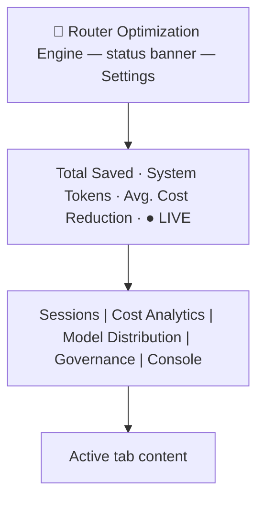

# Dashboard

> **Updated for the web GUI migration plan's P11 docs close-out (2026-09-15).** The dashboard is now a
> Blazor **WebAssembly** app (`src/TotallyHotArcRouter.Gui.Web`) served directly by the router over HTTPS
> on the web port, opened in any browser - not the retired Windows-only .NET MAUI Blazor Hybrid app this
> document originally described (ADR-0011). The Razor components themselves moved essentially unchanged
> into `src/TotallyHotArcRouter.Gui.Components/Components/` (plan's "Reuse" section: "moved, not
> rewritten"), so most of this document's tab-by-tab UI description below is still accurate; the sections
> that described the old MAUI/WebView2 shell, ports, and CI story have been updated in place.

This document describes the dashboard UI rendered by `src/TotallyHotArcRouter.Gui.Web`'s WASM host, using
components from `src/TotallyHotArcRouter.Gui.Components/Components/`. There is no longer a separate
tray-app README to link to for the shell itself: the small Windows-only system-tray companion
(`src/TotallyHotArcRouter.Tray`) just opens the dashboard in the default browser, toggles routing, and
shows service status - it renders none of the UI below itself.

## Purpose

The dashboard presents routing, cost, and governance telemetry for the TotallyHotArcRouter proxy: which
requests were routed to which upstream model, how much that saved versus a worst-case baseline, token
volume trends, model market share, and per-provider budget status.

**Current status: mixed live and mock data.** The **Sessions** tab (formerly "Live Stream") and the **Console** tab are
wired to live telemetry pushed from the `TotallyHotArcRouter` proxy over gRPC (`Services/LiveDataStore.cs`)
- see [`../router/telemetry.md`](../router/telemetry.md) for the routing-telemetry pipeline and this
doc's Console tab section above for the log-line pipeline. Until the proxy is running and reachable
(or before it has forwarded any requests / emitted any log events), those surfaces simply show no
data rather than falling back to mock data. The **Cost Analytics** tab is **live + mock merged**: it
plots live conversation turns when present, on top of a deterministic timestamped mock history
(`MockData.BuildMetricHistory`) so every metric/range renders offline; the metrics that have no live
source (ROI, tool steps, cache, context) are demonstrated by the mock history only. **Model
Distribution** fetches real rollup buckets through `UsageStore.LoadRollupAsync` on every filter
change, falling back to the hard-coded `MockData` class only when there is no live data to show. The
**header ticker** is partly real: System Tokens comes from `UsageStore.LoadSummaryAsync`, while Total
Saved and Avg. Cost Reduction are still mock and labelled "(demo)". [`backlog.md`](backlog.md) is the
authority for which surfaces are live and which are still mock - when the two disagree, that doc is
the one being maintained against the code. Governance's **Providers** and
**Price Sources** sub-views are fully live against the proxy; per-provider monthly budgets now live on
each Providers card (real caps in SQLite, real current-month spend), replacing the former mock **Budgets**
sub-view.

## Stack

| Layer | Choice |
| --- | --- |
| App shell | Blazor WebAssembly (`src/TotallyHotArcRouter.Gui.Web`, cross-platform - any modern browser), served by the router over gRPC-Web on the same origin as the static files (ADR-0011); the router-hosted files are on the web port (`WebInterfaceOptions.Port`, default `47104`) |
| UI framework | Razor components (`src/TotallyHotArcRouter.Gui.Components/Components/`), running client-side in the browser's WASM runtime rather than a `BlazorWebView` host process |
| Styling | A static stylesheet (`wwwroot/css/app.css`) containing the dashboard's compiled Tailwind utility classes plus custom rules; state-driven colors are inline styles in the components |
| Charts | [Apache ECharts](https://echarts.apache.org/) (`echarts.min.js` vendored under `wwwroot/lib/echarts`, Apache-2.0), driven by `wwwroot/js/echarts-interop.js` via the shared `<EChart>` host - the seven bespoke Cost Analytics charts plus Model Distribution's grouped bars and donut; plus a hand-rolled inline SVG sparkline (no chart library) for the Sessions summary card |
| Icons | Small inline SVG glyphs (`Components/Icon.razor`) |
| Chart data logic | `src/TotallyHotArcRouter.Gui.Charts/` - a plain `net10.0` class library holding the pure data-transformation math behind the charts (cumulative token series, sparkline coordinate normalization). See `TotallyHotArcRouter.Gui.Charts.Tests/`. |
| Console tab logic | `src/TotallyHotArcRouter.Gui.Console/` - same pattern as the chart data logic above: a plain `net10.0` class library holding `LogLevelColorMapper` and the bounded `LogBuffer`. See `TotallyHotArcRouter.Gui.Console.Tests/`. |

The dashboard has a real publish step now (`dotnet publish` trims and AOT-ish-optimizes the WASM
payload, per the migration plan's P0 spike S4/P6), but no separate JS bundler: the Razor components
compile with the .NET project, the stylesheet is checked-in static content, and the chart JavaScript
ships as ordinary static web assets the router serves via `MapStaticAssets`. All navigation is
client-side component state (`_activeTab` in `Components/Dashboard.razor`); there is still no
client-side router, dev server, or separate backend API - the browser talks to the router itself over
gRPC-Web on the same origin.

The UI is a conversion of an earlier React/Vite/Tailwind implementation of the same design; the visual
design, layout, colors, and mock data carry over unchanged. Because the stylesheet is the *compiled*
Tailwind output of that design, new markup must stick to utility classes that already appear in it (or
add plain CSS to `app.css`) - there is no Tailwind build to generate new utilities.

## Visual theme

[`DESIGN.md`](DESIGN.md) is the authority for the visual system - the surface ramp and accent (§2),
typography and font tokens (§3), components (§4), layout (§5), and elevation (§6). This doc
deliberately does not restate any of those values: a summary here is a second copy to keep in step,
and the one that used to sit in this section drifted (it still named Inter as the UI font long after
the app moved to `var(--font-ds)`).

The whole app is a fixed-height, non-scrolling shell (`h-screen overflow-hidden`) with individual panels
scrolling internally where their content can overflow.

## Layout

### Header

- Brand: `🤖 Router Optimization Engine`.
- Status banner (center): reads live per-provider budget utilization from `ProviderAdminStore` (real
  caps + current-month spend). Providers with no budget are ignored.
  - All budgeted providers under 80%: green pulsing dot + "System Status: OK".
  - Any provider ≥ 100%: red "🚨 N PROVIDER BREACHED" (or "N BREACHED" alongside approaching count).
  - Any provider ≥ 80% and < 100%: amber "⚠️ N PROVIDER APPROACHING LIMIT".
  - Clicking the banner (when there's an alert) jumps to the **Governance** tab's Providers view.
- **Settings** button (top right) opens the settings modal.
- Ticker row: three aggregate stats (Total Saved, System Tokens, Avg. Cost Reduction) plus a `LIVE`
  indicator with a pulsing dot. System Tokens is real (`UsageStore.LoadSummaryAsync("all")`); the other
  two are still mock and carry a "(demo)" label.

### Tabs

1. **Sessions** (`LiveStream.razor`, default tab, formerly "Live Stream") - a conversation-centric view
   that starts as a **full-width, oldest-first list of session cards** and opens into a two-panel split
   view (session detail left, chat reproduction right) only once a card is double-clicked; single-clicking
   a card just selects it (shared with Cost Analytics' initial-session behavior below) without opening the
   split view. The split view's divider can be dragged to resize (pointer handling in
   `wwwroot/js/split-pane.js`; left panel defaults to 35% width, clamped 20-65%), and a "Back to Sessions"
   button in the left panel collapses back to the full-width list.
   - **Data sources, merged** (`Dashboard.razor`'s `MergedSessionConversations()`): the live gRPC stream
     (`Services/LiveDataStore.cs`, empty until the proxy has forwarded at least one request this GUI
     session; see [`../router/telemetry.md`](../router/telemetry.md)) plus **persisted history** from the
     router's `request_transcripts` table (`Services/PersistedSessionStore.cs`, loaded once on tab
     activation via the `TelemetryService.ListPersistedSessions` RPC - see
     [`../router/sessions-tab-training-data-plan.md`](../router/sessions-tab-training-data-plan.md)), so a
     session survives a GUI restart instead of existing only in the current connection's live buffer. Live
     data wins for any session id present in both. Persisted history requires transcript capture to be on
     (`TranscriptOptions.Enabled`, the System Settings window's Transcription Capture toggle); with it off,
     the Sessions tab shows only the live stream, same as before this merge existed.
   - Card list (`ConversationCard.razor`): a searchable, full-width list of session cards. Each card shows the
     conversation title, first → last turn timestamps,
     total session cost, total tokens (K/M notation), turn count, and color-dotted names of the first
     two distinct agents; conversations containing fallback turns get an amber `⚠` badge and left
     border, and a session with at least one turn folded into the router's live-learning corpus
     (`memory_entries`, i.e. `Conversation.IsUsedForTraining`) gets a green 🎓 "used for live training"
     badge. Search filters by title, session ID, agent name, or model name.
   - Split view, left panel top (`ConversationSummary.razor`): a compact pinned summary card for the selected
     conversation that stays visible while the turn list scrolls. A title row (title, fallback badge
     when applicable, session ID + time range) above a one-line stat strip - Total Cost, Total Tokens,
     Avg ROI, Turns, and a **Trend** sparkline (inline SVG polyline, per-turn total tokens, built from
     `TotallyHot.ArcRouter.Gui.Charts.SparklineLayout` - only rendered when the conversation has turns) - each
     stat with a tooltip explaining the metric.
   - Split view, right panel (`SessionConversationPane.razor`): a chat-style, chronological reproduction
     of the session's turns - a labeled separator per turn (turn number, agent chip, model, timestamp)
     above a request bubble (left) and a response bubble (right), tinted with the turn's agent color (the
     same tinted-row visual language `ColorUtils.GetColorForAgent` gives the routing decision log).
     `TurnCard.razor` (the compact two-line card with the "ROI, Cost, Tok P/C, Steps, Cache, TTFT, Ctx,
     Model" stat strip and the click-to-expand routing-decision drill-down) is not currently instantiated
     anywhere in the Sessions tab or elsewhere in the app - it predates the double-click split view and
     is effectively dead code, kept alive only by `TurnCardTests.cs`.
   - Tooltips: metric tooltips across the tab are floating tooltips driven by `data-tip` attributes
     (`wwwroot/js/tooltips.js`, a single body-level element) rather than native `title` attributes,
     so they render reliably and are never clipped by scroll containers.
     Keyboard-accessible: every `data-tip` element not nested inside a `<button>` also carries
     `tabindex="0"` and a static `aria-describedby="ls-tooltip"`, and `tooltips.js` shows/hides on
     `focusin`/`focusout` (in addition to hover) and dismisses on Escape. The shared tooltip element
     is hidden via opacity rather than `display:none` specifically so it stays in the accessibility
     tree (`display:none` would break `aria-describedby`). The handful of `data-tip` spans that *are*
     nested inside a card's outer `<button>` (e.g. every stat, and the fallback/training badges, on a
     `ConversationCard`) intentionally skip `tabindex` - nesting
     a focusable element inside a `<button>` is an ARIA anti-pattern - and instead the outer button
     carries a comprehensive `aria-label` summarizing the same facts for screen-reader users.

2. **Cost Analytics** (`CostAnalytics.razor`) - a **metric explorer** where each metric renders in its
   own bespoke chart format, per [`cost-analytics-visualization-spec.md`](cost-analytics-visualization-spec.md).
   A control bar lets the user pick one of the seven ranked Perf/$ metrics, a time range, and a
   session scope; one chart below plots the choice.
   - **Metric selector**: a pill row ranked 1-7 by business priority - Routing ROI, Turn Cost,
     Tokens, Tool Steps, Cache Hit, TTFT, Context Buffer (the `CostMetric` enum order in
     `TotallyHot.ArcRouter.Gui.Charts.CostChartBuilder`).
   - **Time range**: Hour / Day / Week / Month / All - the window each chart's per-turn points are
     filtered to.
   - **Session scope**: a `<select>` of `All Sessions` plus each session in the corpus (live
     conversations from `Services/LiveDataStore.cs` by title, then the mock demo sessions - live-only,
     unlike the Sessions tab's merged live+persisted list, since Cost Analytics has no use for
     persisted-history sessions or the training-data flag). Defaults to whatever session the Sessions tab
     has selected, passed in as `InitialSessionId`.
   - **Bespoke per-metric charts** (Apache ECharts, one point per turn on a time x-axis): Routing ROI
     is a dual-directional bar chart (savings above 0, fallback remediation below, colored by model).
     While that metric is selected the chart header carries a **Methodology** link to
     [`../score-delta-methodology.md`](../score-delta-methodology.md) — the as-built method for
     estimated regret / score-delta versus the frozen untrained baseline. The chart itself still
     plots only the **cost** half (`estimated_net_savings_usd`); the methodology says so.
     Turn Cost a stepped cumulative area recolored per active model; Tokens a cumulative stepped area
     with exponential-runaway detection (hatched zone + rippling alert); Tool Steps a per-turn bar
     segmented by the model that handled each stretch of steps; Cache Hit a stepped % line with a
     gradient track; TTFT a stepped latency line over per-model background zones with spikes pinned;
     Context Buffer a stepped % line with a fixed 90% threshold and pulsing breaches. Colors are
     deterministic via `TotallyHot.ArcRouter.Gui.Charts.ChartPalette` (which `Utils/ColorUtils` now delegates
     to). The chart models are built by `TotallyHot.ArcRouter.Gui.Charts.CostChartBuilder.Build` (pure,
     unit-tested in `TotallyHot.ArcRouter.Gui.Charts.Tests`), serialized with `ChartJson`, and rendered
     through the shared `<EChart>` host + `wwwroot/js/echarts-interop.js`.
   - **Data source**: the corpus is the live conversation turns (real tokens/cost/TTFT/model/
     timestamp) **merged with** `MockData.BuildMetricHistory(now)` - a deterministic, timestamped
     multi-session history spanning the last hour back through months, with fixed exemplar events (a
     token runaway, a TTFT spike, a fallback, context breaches) so every chart shows its special state
     even with no proxy running. Every rich tooltip figure (worst-case baseline, per-step model split,
     cached/uncached tokens, context token counts, cold-start split) is **derived in `CostChartBuilder`**
     from each turn's existing fields, so nothing new has to flow through telemetry. This supersedes the
     tab's former combo chart (a single metric line plus per-model stacked bars). Note that ROI, tool
     steps, cache, and context are still 0 for *live* turns (no proxy source - see
     `../router/telemetry.md`), so the mock history is what demonstrates those metrics.

3. **Model Distribution** (`ModelDistribution.razor`) - a time-range filter bar (Day/Month/3-Month/
   6-Month/Year - visual only, does not currently refilter data) with From/To text inputs, above:
   - A grouped bar chart of prompt vs. completion token volume by day (`MockData.TokenBuckets`).
   - A donut chart of model market share by execution volume (`MockData.ModelShares`), with a custom
     HTML legend below it.

4. **Governance** (`Governance.razor`) - two sub-views behind a toggle:

   - **Providers** (default, `ProvidersAdmin.razor`, full spec in
     [`provider-management.md`](provider-management.md)) - add/remove/edit provider endpoints,
     credentials, and models against the router's `ProviderAdminGrpcService` (gRPC-Web, on the web port -
     REST `/admin` was deleted in Phase P2; see [`../router/mcp-endpoint.md`](../router/mcp-endpoint.md)).
     Each provider card also carries an optional **monthly budget**: a `$` cap and/or token cap, the
     current month's spend, and two ECharts utilization bars ("% $ spent" and "% tokens utilized")
     colored `OK`/`WARNING`/`CRITICAL` at the 80%/100% thresholds. A breached provider is skipped in
     routing; a request whose every candidate provider is over budget is rejected with 402 (see
     [`provider-management.md`](provider-management.md)).
   - **Price Sources** (`PriceSourcesAdmin.razor`) - enable/disable each model price feed, reorder which
     one wins a contested price, and pull fresh data on demand, over the `PriceSourceAdminService` gRPC-Web
     API on the same web port (`Services/PriceSourceStore.cs`). Two sources today, LiteLLM and OpenRouter. Each card
     shows the source's toggle, rank, and how many prices it owns - **feed metadata only, never prices**,
     per
     [`../router/model-price-catalog.md`](../router/model-price-catalog.md)'s D5 licensing rule. The
     toggle writes `aggregator_sources.enabled` and takes effect live, including cancelling a fetch
     already in flight (D6); up/down rank controls write `priority_score` and immediately re-run an
     ingestion cycle so a contested price re-resolves under the new order rather than waiting for the
     next scheduled poll. The header carries a **countdown to the next automatic pull** ("Next pull in
     3h 12m", hovering for the absolute time) - one clock for the panel, not one per card, because a
     cycle refreshes every enabled source together. The router reports the cadence and the interval's
     anchor; the panel adds them and re-renders once a minute, and never polls the router on a timer of
     its own. Any pull re-anchors the interval
     ([D4](../router/model-price-catalog.md#d4-ingestion-is-its-own-hosted-service-on-its-own-cadence)),
     so Pull Now resets the countdown off its own response. Past the due time it reads "due now" rather
     than counting negative: the panel can see the schedule but not the running cycle.

   A proposed (not yet implemented) fourth section - per-model pricing/spend cards driven by real
   `ModelRouting` config, with a functional date-range picker - is specified in
   [`governance-model-cards.md`](governance-model-cards.md).

5. **Console** (`ConsoleTab.razor`, full spec in [`console-tab-plan.md`](console-tab-plan.md)) - a
   real-time, color-coded log stream: every Serilog log event the proxy emits, normalized to
   DEBUG/INFO/WARN/ERROR/FATAL and pushed over the telemetry gRPC-Web stream's `log_line` case by
   `src/TotallyHotArcRouter/Telemetry/TelemetryLogEventSink.cs`, buffered client-side (1,000-line cap,
   `TotallyHot.ArcRouter.Gui.Console.LogBuffer`) by `Services/LiveDataStore.cs`. A toolbar toggles
   Auto-Scroll (with "Smart-Disengage" - scrolling up with the wheel/trackpad switches it off, see
   `wwwroot/js/console-scroll.js`), copies every buffered line to the clipboard (via `IClipboardService`,
   the browser `navigator.clipboard`-backed implementation since Phase P6 - MAUI's native `Clipboard` is
   gone, with a briefly-shown "Copied!" confirmation), and clears the buffer. Unlike the other
   tabs this one never reads `MockData` - it's live-only, since a log line has no meaningful
   mock/demo equivalent.

### Toast host (`ToastHost.razor`)

Rendered once in the shell, after `<main>` and before the settings modal, so it floats above every tab
and (thanks to its `z-index: 500`) above the settings modal too. Driven by `ToastService`, a singleton
subscribed the same way every other store-backed component subscribes to its store's `Changed` event.
Any admin store can call `ToastService.ShowError` to surface a failure that would otherwise go unnoticed
- e.g. `ProviderAdminStore.RefreshFromEndpointAsync` raising one when the router's "Refresh from
endpoint" succeeded at the HTTP level but the underlying discovery failed (an expired provider API key).
See [`DESIGN.md`](DESIGN.md) §4.4 and [`MOTION.md`](MOTION.md)'s Toast Enter/Exit pattern.

### Settings modal (`SettingsModal.razor`)

Opened via the header's **Settings** button. A centered modal (dimmed/blurred backdrop, click-outside to
close) with a "Destructive Actions Zone": **Reset Stats** and **Clear History** buttons, each requiring
the user to type a literal confirmation word (`RESET` / `PURGE`) before the action button enables. Both
actions call `LiveDataStore.ClearEvents()` to clear this session's live view; **Clear History**
additionally clears the Console tab's log buffer. Neither touches the proxy's own durable history or
any persisted configuration.

This window is also the **reference pattern for every new GUI window** - its backdrop, panel, header,
close glyph, and `OnClose` callback are what new modals/dialogs copy rather than restyle
(`ProviderEditDialog.razor` already does). The full contract is in
[`DESIGN.md`](DESIGN.md) §4.1.

## Data model (`Models/DashboardData.cs`)

`Conversation`/`ConversationTurn` are shared between mock, live, and persisted-history data:
`MockData.Conversations` populates them by hand; `Services/LiveDataStore.cs` populates them from proxy
telemetry via `Services/LiveConversationMapper.cs` (see [`../router/telemetry.md`](../router/telemetry.md)
for the full pipeline, and that file's table of which `ConversationTurn` fields are real vs. honestly
defaulted in live mode - the record shape itself hasn't changed); `Services/PersistedSessionStore.cs`
populates them from the router's persisted `request_transcripts` history via
`Services/PersistedSessionMapper.cs`, following the same real-vs-honestly-defaulted convention (see
[`../router/sessions-tab-training-data-plan.md`](../router/sessions-tab-training-data-plan.md)). The other
five collections below remain mock-only; typed via C# records:

- `MockData.Conversations: Conversation[]` - three hand-written sample conversations, used only as a
  design/layout reference now that the Sessions tab reads live and persisted data; kept for local UI
  development when no proxy is running. Each has a title, first/last timestamps, aggregate
  cost/token totals, a fallback flag, and an ordered list of `ConversationTurn`s carrying the
  per-turn metrics (prompt/completion tokens, routing ROI, cost, tool execution steps, cache hit
  rate, TTFT, context buffer %), a `RoutingSteps` log, optional plain-text request/response excerpts
  (the request excerpt doubles as the turn card title), and a fallback flag. The mock turns' prompt
  tokens grow turn-over-turn to demonstrate token compounding.
- `MockData.Entries: RoutingEntry[]` - individual routing decisions (session/trace IDs, agent, model,
  fallback flag, token counts, actual vs. worst-case cost, savings, timestamp, and an ordered
  `RoutingSteps` log). No longer rendered by the Sessions tab, but kept as the entry-level
  telemetry shape for future integration.
- `MockData.Providers: Provider[]` - per-provider budget state (cap, current spend, estimated days
  remaining).
- `MockData.CostData: CostDataPoint[]` / `MockData.AgentRoi: AgentRoi[]` - the former Cost Analytics
  Cumulative-Savings and ROI-by-Agent series. **No longer rendered** (the Cost Analytics rewrite
  replaced those panels with the metric explorer); kept as reference shapes.
- `MockData.BuildMetricHistory(now): MetricTurnPoint[]` - a deterministic, timestamped multi-session
  turn corpus (fixed RNG seed; timestamps anchored to `now`) that backs the Cost Analytics metric
  explorer, populating all seven metrics across the hour→all-time ranges so the tab renders offline.
- `MockData.TokenBuckets: TokenBucket[]` - daily prompt/completion token volume.
- `MockData.ModelShares: ModelShare[]` - market-share percentage and color per model.

Wiring the dashboard to the live proxy means replacing these collections with data fetched from
`TotallyHotArcRouter`'s actual routing/telemetry, without needing to change the component layer.

### Chart data logic (`TotallyHotArcRouter.Gui.Charts/`)

A separate, plain `net10.0` class library (referenced by `TotallyHotArcRouter.Gui.csproj` via
`ProjectReference`) holding the pure math behind the Cost Analytics and Sessions charts, kept out
of the Windows-only Gui project so it's unit-testable on any platform:

- `CostChartBuilder.Build(points, metric, range, sessionId, now)` - the Cost Analytics metric
  explorer's per-metric chart models: filters a turn corpus to a time range and optional session, and
  emits one `CostChartModel` (a chart-kind discriminator, per-turn points, derived tooltip lines, and
  special-state flags for runaways/spikes/breaches) that `wwwroot/js/echarts-interop.js` renders in the
  metric's bespoke format. Covered by `CostChartBuilderTests`; the C#↔JS JSON field contract is guarded
  by `ChartJsonTests`. `ChartPalette` provides the deterministic per-model colors; `ChartJson`
  serializes the models for interop.
- `TokenCompoundingSeries.Build(turns)` - cumulative prompt/completion token series ordered by turn
  number, feeding the `ConversationSummary` sparkline (and formerly the Cost Analytics token chart).
- `TokenCompoundingSeries.BuildSparkline(turns)` - compact per-turn (non-cumulative) total-token
  series, feeding the `ConversationSummary` sparkline.
- `SparklineLayout.Normalize(values, width, height, padding)` - scales a value series into SVG
  polyline points (largest value at the smallest Y, since SVG's Y axis grows downward).

Covered by `TotallyHot.ArcRouter.Gui.Charts.Tests` (xUnit): empty/single-value/unsorted-input edge cases,
cumulative-sum correctness, and coordinate-normalization correctness (flat series, custom padding,
value-to-Y direction). This is the one piece of Gui-adjacent logic actually verified in this repo's
Linux CI/agent environment - see the note in "Known gaps" below about why the rest isn't.

## Known gaps / non-functional controls

These match the source design as received and are called out so they aren't mistaken for bugs:

- Governance's per-provider budget caps are persisted to SQLite and enforced live in routing (breached
  providers are skipped; an all-breached request gets a 402). Spend is real per-provider, current-month.
- Cost Analytics' $0-$160 savings scale is still pinned to the mock data's range. (Model
  Distribution's token histogram now derives its ceiling from the rendered data via
  `GroupedBarsModel.DynamicYMax`, and the Cost Analytics explorer auto-scales its axes.)
- The chart tooltips are custom dark-themed HTML built in `wwwroot/js/echarts-interop.js` to match the
  card styling; minor visual differences from the original React implementation are expected there.
- The telemetry gRPC-Web server address is no longer a separately configurable setting: since the
  dashboard is now served by the same router process it talks to, it always uses
  `NavigationManager.BaseUri` (same-origin), and `GuiSettingsStore`'s telemetry-address field was
  dropped in Phase P6 along with the dedicated telemetry port it used to point at (`LiveDataStore`'s
  `DefaultServerAddress` dead constant, also removed).
- Several `ConversationTurn` fields have no live-data source and are shown as their "nothing to
  report" state (e.g. ROI/cache rate render as `—`) when viewing live conversations: Routing ROI,
  Tool Steps, Cache Hit Rate, and Context Buffer. See [`../router/telemetry.md`](../router/telemetry.md)'s
  field table for why each one, and Time to First Token / Request+Response text for the turn-level
  fields that *are* real in live mode.
- **Verification, resolved by the migration**: `TotallyHot.ArcRouter.Gui.Components` (the Razor
  components themselves) and `TotallyHot.ArcRouter.Gui.Web` (the WASM host) both target plain `net10.0`
  - no MAUI, no `net10.0-windows` - so they build and their bUnit tests
  (`TotallyHotArcRouter.Gui.Components.Tests`) run on `dotnet-ci.yml`'s Linux job like every other
  library, with AGENTS.md's 80% coverage bar enforced on every push. The `windows-gui-build-and-test`
  job this section used to describe as deliberately disabled was deleted outright in Phase P9 along with
  the MAUI project it built. `wwwroot/js/tooltips.js`'s keyboard-focus behavior was additionally
  smoke-tested against a standalone HTML harness with Playwright/Chromium.

