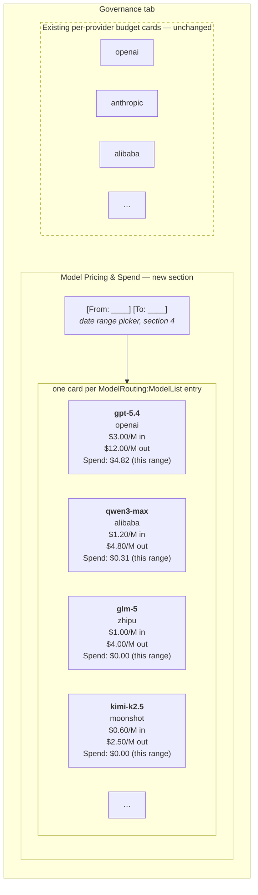

# Governance Tab: Per-Model Cards (Configured Models + Live Pricing + Spend)

> **Status: Spend half implemented (Phase 4 of
> [`../router/token-tracking-implementation-plan.md`](../router/token-tracking-implementation-plan.md));
> price half still proposed.** `Governance.razor` now has a "Models" sub-view
> (`Components/GovernanceModelCards.razor`) rendering one card per `ModelRouting:ModelList` entry via
> `ProviderAdminStore.Providers` (not the SignalR/gRPC push sketched in section 2 below - the
> already-loaded `/admin/providers` model list was sufficient) with real spend from
> `UsageStore`/`GET /admin/usage/rollup` (§5.15) over a fixed 30-day window, not the date-range picker
> section 4 sketches. Every card still reads **"Price unavailable"**: this doc's dependency #1, a
> live model price catalog channel to the GUI
> ([`../router/model-price-catalog.md`](../router/model-price-catalog.md)), remains unbuilt, so
> sections 3 and 4 below (pricing) are still a proposed design, not current behavior.

## Dependency

**This depends on two proposed, not-yet-implemented designs**, because model cards need two things
today's codebase has neither of:

- A live, queryable **model price catalog** — [`../router/model-price-catalog.md`](../router/model-price-catalog.md),
  the canonical plan for price data. (This dependency used to point at `agent-cost-tracking.md` §3.2,
  where the catalog was originally sketched; it has since moved to its own doc and grown from a single
  LiteLLM feed into a multi-aggregator design.)
- A persistent, queryable **usage history** (`usage_ledger`) —
  [`../router/agent-cost-tracking.md`](../router/agent-cost-tracking.md), which retains the ledger and
  provider-reconciliation halves.

Both share one SQLite file and can ship separately. Nothing here works against today's
estimate-once-broadcast-once-and-discard telemetry model.

## Architecture boundary: the GUI still only talks to the proxy

**This doc does not create an exception to [`telemetry.md`](../router/telemetry.md#gui-consumption)'s
architecture principle: the GUI only ever talks to the TotallyHotArcRouter proxy.** It would be simpler, in
the narrow sense of "fewer moving parts," for `TotallyHotArcRouter.Gui` to open
`agent-cost-tracking.md`'s SQLite file directly and query `usage_ledger`/`model_prices` itself - both
processes typically run on the same machine as the same OS user, so nothing would stop it technically.
That is deliberately not this design. Every piece of data a model card needs - the configured model
list (section 2), prices, and spend (sections 3-4) - is obtained by asking the *proxy*, over a
channel the proxy exposes on purpose (a gRPC push, a gRPC query), never by the GUI reaching
into the proxy's own storage or calling a provider directly. The proxy stays the only process that
opens the database, holds credentials, and talks to upstream providers; the GUI stays a thin client of
it, exactly as it is today for the existing telemetry hub.

## What this adds

A **second, new section** on the Governance tab, alongside the existing per-provider budget cards
(which are unchanged by this doc - see "Layout" below): one card per entry in the proxy's
`ModelRouting:ModelList` configuration, each showing that model's live price and its accumulated
spend over a user-selected date range. Config-driven, not usage-driven - every configured model gets
a card, including ones with zero traffic in the selected range (shown as $0.00, not omitted).

---

## 1. Layout: additive, not a replacement

The existing per-provider cards (`Governance.razor`'s current `foreach (var provider in Sorted)`
grid) stay exactly as they are - they answer "is this provider near its spending cap," a question
with its own budget-cap/alert semantics (`OK`/`WARNING`/`CRITICAL`, per
[`backlog.md`](backlog.md)'s note that provider caps still need a real persistence backend). Model
cards answer a different question - "what does each configured model actually cost, and how much has
it been used" - and are **purely informational**: no budget cap, no alert thresholds, no
`OK`/`WARNING`/`CRITICAL` badge. If per-model budget capping is wanted later, that's a distinct
follow-on feature superseding this doc's "informational only" scope, not something bundled in here.



The two sections are independent: the existing per-provider budget cards keep their
`OK`/`WARNING`/`CRITICAL` semantics, while every model card is informational only. A configured model
with no traffic in the selected range shows **$0.00** (as `glm-5` and `kimi-k2.5` do above) — distinct
from **"Price unavailable"**, which means the price itself is unknown (see 3.1).

---

## 2. Getting the configured model list to the GUI

Today there's no channel for this at all - `Governance.razor` only ever sees `MockData.Providers`.
This design predates [`grpc-migration.md`](../router/grpc-migration.md) and pushes the model list
over what was then the SignalR hub - `TelemetryHub` no longer exists (see
[`telemetry.md`](../router/telemetry.md#transport-grpc)), and `grpc-migration.md`'s shipped `.proto`
doesn't include a `ModelListEvent` case either, since it was descoped for having no existing
behavior to port. The C# sketch in 2.1/2.2 below is unbuilt and untranslated to gRPC - the shape
(one push per connection, kept separate from the on-demand spend query in section 4 for the reason
that section gives) is still the intended design, but the mechanism would now be a new oneof case on
`TelemetryEvent` plus a one-time send from `TelemetryGrpcService.StreamEvents` when a call starts,
not a SignalR `OnConnectedAsync` override.

### 2.1 Server: push once per connection (SignalR-era sketch, not translated to gRPC)

`TelemetryHub` used to be empty (`public sealed class TelemetryHub : Hub;`, deliberately pure
server-push with no client-callable methods). This sketch added its first connection-lifecycle
override, back when the transport was still SignalR:

```csharp
public sealed class TelemetryHub : Hub
{
    private readonly IModelRouteResolver _modelRouteResolver;

    // ... constructor omitted ...

    public override async Task OnConnectedAsync()
    {
        var models = _modelRouteResolver.ListModels(); // existing method, see ModelRouteResolver.cs
        await Clients.Caller.SendAsync("ModelList", models.Select(ToDto));
        await base.OnConnectedAsync();
    }
}
```

`ModelRouteResolver.ListModels()` already exists (it backs the OpenAI-compatible `/v1/models`
discovery endpoint today - see `ProxyMiddleware`'s `ModelsListPath` handling) but returns
`AvailableModel(ModelName, Provider)`, missing `ProviderModelId` - needed for price-catalog lookups
(section 3). Either extend `AvailableModel` with `ProviderModelId`, or introduce a small
`ModelListEntryDto(ModelName, Provider, ProviderModelId)` built from `ModelRoutingOptions.ModelList`
directly rather than reusing `AvailableModel` - a decision to make at implementation time depending on
whether `/v1/models`'s response shape should also gain `ProviderModelId` (a client-facing behavior
change to an existing endpoint) or stay as-is.

### 2.2 GUI: `LiveDataStore` gains a model list (SignalR-era sketch, not translated to gRPC)

Mirrors the `LogLines`/`LogLinesChanged` precedent already in `LiveDataStore.cs` (a dedicated event so
this doesn't force-rerender unrelated tabs). Written when `LiveDataStore` still owned a
`HubConnection` - it now owns a `GrpcChannel`/`TelemetryServiceClient` instead (see
[`telemetry.md`](../router/telemetry.md#transport-grpc)), so `_hubConnection.On<T>(name, handler)`
below would become another case in `Dispatch`'s `switch` on `TelemetryEvent.EventCase`:

```csharp
_hubConnection.On<IReadOnlyList<ModelListEntryDto>>("ModelList", OnModelListReceived);

public IReadOnlyList<ModelListEntryDto> ConfiguredModels => _configuredModels;
public event Action? ModelListChanged;
```

Static config today (no hot-reload anywhere in this codebase), so one push per connection is
sufficient - no need for the server to re-push if config were to change without a restart, since
nothing currently supports that.

---

## 3. Matching a configured model to its price and spend

Two lookups per configured model, and they key differently - worth spelling out precisely since
getting this wrong silently produces wrong numbers rather than an obvious error. **Both lookups run
inside the proxy**, per the architecture boundary above - the SQL below is what the proxy executes
when building the `ModelList` push (price, section 3.1) and when servicing the `GetModelSpend` RPC
(spend, section 3.2 and section 4). The GUI never runs this SQL, or any SQL, itself.

### 3.1 Price lookup: always `ModelName`, resolved through the catalog's alias table

> **Revised.** This section previously described a guess-and-retry lookup: try `model_prices` by
> `ProviderModelId` first (on the assumption the table was keyed however LiteLLM names models), then by
> `ModelName`, then the static fallback. That was a workaround for a genuinely open question, and
> [`../router/model-price-catalog.md`](../router/model-price-catalog.md) has since answered it — the
> catalog is now multi-aggregator, so "keyed however the upstream names things" was never going to
> scale to several upstreams that each name things differently. Its D3 makes the mapping explicit data
> rather than a lookup heuristic, so this section no longer guesses.

The naming problem is real and hasn't gone away: each aggregator names models its own way, and none of
them match this repo's client-facing aliases from `ModelRouting:ModelList[].ModelName`. The two are
usually different strings for the same configured model — `appsettings.json`'s `ModelList` entry for
`ModelName: "claude-opus-4.6"` has `ProviderModelId: "claude-opus-4-6"`, dots vs. hyphens, a small but
real difference that breaks any exact-string match. What changed is **where that reconciliation
happens**: at ingest, recorded in the catalog's `model_aliases` table, rather than at every read site
guessing which key might hit.

So price lookup for a configured model is a single keyed read, resolving to one of:

1. `IModelPriceCatalog` by **`ModelKey(ModelName, Provider)`** — both halves taken straight from the
   card's own `ModelList` entry. `ModelName` is the client-facing identity, the same key
   `usage_ledger.model_identifier` (section 3.2) already uses; `Provider` is required because the same
   model costs different amounts depending on who serves it, and whether it offers cached or batch rates
   at all is a provider fact ([D7](../router/model-price-catalog.md#d7-price-is-keyed-by-model-provider--never-by-model-alone)).
   The catalog resolves each aggregator's own naming onto its internal model id at ingest via
   `model_aliases`, so callers never see upstream naming at all. One key, one read, no retry ladder.
   Cards are a display surface, so they read what telemetry reads — including rows well past the 24h
   floor the *router* refuses (see [`model-price-catalog.md`](../router/model-price-catalog.md)'s
   Phase 3), which a card should show with its age.
2. The provider is flagged **`IsFree`** (`ProviderOptions.IsFree`): the card shows a real **$0.00**.
   This is a known price, not a missing one — a local runtime genuinely costs nothing.
3. Neither: the card shows **"Price unavailable"** — an explicit "we don't know," not a fabricated zero.

**Steps 2 and 3 must be visually distinct, and this now matters more than it used to.** There is no
longer a fallback table quietly backstopping step 1 (the `appsettings.json` `Pricing` section was
deleted — see [`telemetry.md`](../router/telemetry.md#pricing)), so "Price unavailable" is a state real
users will actually see, and $0.00 is a real, reachable, meaningful value rather than a theoretical
one. A card that renders unknown as `$0.00` is now actively lying about a case that occurs.

**Surface where the price came from, and how old it is.** Every catalog row carries its originating
source and `last_updated_utc`, so a card can show "as of 3h ago" alongside the number. That age is
directly useful on a governance surface rather than decorative: it is the same 24h threshold the router
uses to decide whether a price is rankable at all
([D1](../router/model-price-catalog.md#d1-auto-selection-requires-a-price-fetched-within-the-last-24-hours)),
so a card showing a 30h-old price is also telling the user why that model isn't being auto-selected.

**If a model has no `model_aliases` entry**, no aggregator ever reported it, and its price falls to
step 2 or 3. That is not an error: `llama3` (local Ollama) lands on step 2 and shows $0.00 by virtue of
its provider's `IsFree` flag, while `copilot-utility-small` — an alias no aggregator publishes — lands
on step 3 and shows "Price unavailable."

### 3.2 Spend lookup: always `ModelName`

`usage_ledger.model_identifier` (see `agent-cost-tracking.md`'s schema) should be populated from
`RoutingTelemetryEvent.RequestedModel` - the client-facing name - not `ResolvedModel`. This matches
the key the price catalog itself uses (`ModelRouting:ModelList[].ModelName`, see
[`model-price-catalog.md`](../router/model-price-catalog.md)'s D3), and is the stable identity
across a provider's own model-id changes (e.g. if `gpt-5.4`'s `ProviderModelId` gets bumped to a new
dated snapshot in config, `ModelName` "gpt-5.4" keeps meaning the same configured model to this
ledger). **`agent-cost-tracking.md`'s schema section left this ambiguous; treat this doc as the
clarification** - `usage_ledger.model_identifier` = `RequestedModel`, always.

So: spend for a card is `SUM(usage_ledger.estimated_cost_usd) WHERE model_identifier = <ModelName> AND timestamp_unix BETWEEN <range>` - backed by
`IUsageLedger.GetAccumulatedCostByModelAsync(from, to)` (see `agent-cost-tracking.md` section 3.3),
**not** `GetAccumulatedCostAsync(modelIdentifier, window)` - that method answers a different question
("cost over the trailing N hours from right now," for budget checks) than this section's arbitrary,
user-picked historical range.

---

## 4. Date range: a real picker, and an on-demand query

### 4.1 Why not reuse Model Distribution's filter bar

Model Distribution already has a Day/Month/3-Month/6-Month/Year filter bar plus From/To text inputs -
but per [`dashboard.md`](dashboard.md)'s "Known gaps," it's **purely cosmetic**, doesn't parse or
validate input, and isn't wired to anything. This doc specifies a genuinely functional picker instead
of extending that cosmetic one, scoped only to the new model-cards section (the existing per-provider
cards and Model Distribution's own filter bar are both untouched):

```razor
<input type="date" @bind="_rangeStart" ... />
<input type="date" @bind="_rangeEnd" ... />
```

Real `<input type="date">` elements (browser-native date pickers, parseable `DateOnly`/`DateTime`
values via Blazor's `@bind`), not the `type="text"` placeholders Model Distribution uses today.
Default range on first render: **last 24 hours** - matches
`agent-cost-tracking.md`'s own default budget-check window (`IsWithinBudgetAsync`'s `TimeSpan.FromHours(24)`),
one consistent "recent spend" definition reused across both features rather than two different
defaults for the same underlying data.

### 4.2 Why this needs a request/response query, not another push — and why it's a gRPC RPC

> **Revised — this is now a gRPC RPC, not a REST endpoint.** Earlier drafts of this section specified
> `GET /governance/model-spend` and left the choice open ("whichever of the two mechanisms gets
> implemented first"). That is settled: the query is
> [`../router/grpc-migration.md`](../router/grpc-migration.md) §3.2's **`GetModelSpend`** unary RPC,
> which that doc already describes as "a direct, one-to-one translation" of the endpoint this section
> used to propose. Both were always blocked on `IUsageLedger`
> ([`../router/agent-cost-tracking.md`](../router/agent-cost-tracking.md)), which still doesn't exist —
> what changed is which one gets built when it does. The reasoning below (why *some* request/response
> mechanism is needed, as opposed to another push) is unchanged and was never the contested part.

The model list (section 2) is a natural **push**: the server has one fixed answer ("here's what's
configured") and hands it to every connecting client once. Spend-for-a-range is different - it's a
**parameterized, on-demand query** driven by the user changing the date picker, with no single
"current" answer to push. So this needs a request/response mechanism, and
`TelemetryGrpcService` is push-only today (`StreamEvents` is its only RPC - see
[`telemetry.md`](../router/telemetry.md#transport-grpc)).

**Prefer gRPC over REST for internal communication where strict, language-agnostic contracts matter.**
That applies squarely here, and three things decide it:

1. **The contract.** `src/Protos/telemetry.proto` is already compiled into both the proxy
   (`GrpcServices="Server"`) and `TotallyHotArcRouter.Gui.Telemetry` (`GrpcServices="Client"`) from one file,
   so the two sides **cannot** structurally drift — the exact failure the hand-synced SignalR DTOs
   invited before the migration. A REST endpoint reintroduces a hand-synced JSON contract for the one
   query, in a codebase that just finished removing them.
2. **One transport per surface.** Model cards already receive **price** over the gRPC push, and not by
   preference — [D5](../router/model-price-catalog.md#d5-price-data-must-never-be-exposed-via-a-public-api--licensing)
   forbids price on any HTTP surface on the proxy's port. A REST spend endpoint would leave one card
   assembling from two transports for no reason other than which doc specified which half.
3. **No new public surface.** A `/governance/*` path on :5001 is another unauthenticated endpoint on the
   proxy's listening port (see Known limitations). The RPC adds no new listener.

**The cost, stated plainly:** `TelemetryGrpcService` gains its first non-streaming method, so it stops
being purely push-only. This section previously treated that as the reason to prefer HTTP — "a larger
change to that service's shape than adding a plain HTTP endpoint alongside it." That was an argument
about effort, not correctness, and `grpc-migration.md` §3.2 undercuts it by scoping the work as a
one-to-one translation. Adding a unary RPC to an existing service is a smaller structural change than
standing up a second transport with its own contract, auth story, and error semantics.

```protobuf
// New unary RPC on the existing TelemetryService (src/Protos/telemetry.proto).
rpc GetModelSpend(GetModelSpendRequest) returns (GetModelSpendResponse);

message GetModelSpendRequest {
  int64 from_unix_seconds = 1;
  int64 to_unix_seconds   = 2;
}

message ModelSpend {
  string model_name          = 1;
  string accumulated_cost_usd = 2;  // decimal-as-string, matching the existing cost encoding
}

message GetModelSpendResponse {
  repeated ModelSpend models = 1;
}
```

`accumulated_cost_usd` is a string for the same reason `EstimatedCostUsd` already is on the wire:
proto3 has no decimal, and a float dollar figure is exactly the kind of quiet inaccuracy this doc set
refuses elsewhere. `LiveDataStore` already handles that encoding when mapping telemetry events.

One call per date-range change (debounced client-side so every keystroke/date-picker click doesn't
fire a request), returning spend for every configured model in one round trip rather than one request
per card.

---

## 5. `Governance.razor` changes

- New model-cards section, rendered from `LiveDataStore.ConfiguredModels` (section 2) joined against:
  - Price, via `IModelPriceCatalog`-backed data bundled into the `ModelList` push over the **local
    telemetry channel**. Given prices refresh at most daily (the catalog's 24h staleness window) while
    spend changes continuously, bundling price into the push and re-fetching only spend on date-range
    change is also the more efficient split — but efficiency is no longer what decides it. **Price data
    must not be served from an HTTP endpoint on the proxy's listening port**, per
    [`../router/model-price-catalog.md`](../router/model-price-catalog.md)'s D5: that is a licensing
    constraint on redistributing aggregated third-party pricing, and anything reachable on port 5001 is
    a public surface regardless of intent. The loopback telemetry push to this GUI is the user reading
    their own catalog and is fine. What was an open efficiency question is therefore now closed on
    other grounds: **push, never a second HTTP call.**
  - Spend, via the new `GetModelSpend` RPC (section 4.2), re-fetched on every date-range change over
    the same gRPC channel `LiveDataStore` already owns — so the whole card, price and spend both,
    arrives over one transport.
- Each card shows: `ModelName`, `Provider` (badge, matching the existing provider-card badge style),
  input/output price per million tokens (or **"Price unavailable"**, see 3.1), and accumulated spend
  for the selected range (or **$0.00** if genuinely zero usage - distinct from "unavailable").
- No status badge, no border-color-by-utilization, no flash animation - informational cards only, per
  the scope decision in section 1.

---

## 6. Known limitations

- **Hard dependency on two storage designs.** None of this works until the price catalog
  ([`../router/model-price-catalog.md`](../router/model-price-catalog.md)) and `usage_ledger`
  ([`../router/agent-cost-tracking.md`](../router/agent-cost-tracking.md)) exist; this doc doesn't
  re-specify either storage layer, only how the GUI consumes them.
- **Price-catalog key mismatch — now owned, not unowned.** This doc used to warn that aggregator naming
  and this repo's `ModelName` aliases "won't always align… unless someone maintains a manual alias
  mapping, which this doc doesn't specify." The catalog's `model_aliases` table
  ([D3](../router/model-price-catalog.md)) is now exactly that mapping, specified and owned there. The
  residual risk is narrower but real: **a model nobody has written an alias row for shows "Price
  unavailable."** That is now a data-completeness question with a defined place to fix it, rather than a
  naming collision with nowhere to record the answer.
- **The `GetModelSpend` RPC is unauthenticated**, same as everything else on this host today: the gRPC
  port is loopback-bound and TLS-encrypted, but any local process can connect with no credential check
  (see [`telemetry.md`](../router/telemetry.md#transport-grpc)'s security note and
  [`../router/signalr-hub-security.md`](../router/signalr-hub-security.md)). It should get the same
  eventual protection as the telemetry stream it shares a service with, not a separate bespoke scheme —
  which is one more argument for it living there rather than on its own transport.
- **Moving spend to gRPC removed a licensing forcing-function; the split is now a design choice.**
  While spend was a `:5001` HTTP endpoint, [D5](../router/model-price-catalog.md#d5-price-data-must-never-be-exposed-via-a-public-api--licensing)
  made "spend only, never price" a **hard rule** — anything on the proxy's listening port is a public
  surface. The RPC is on the local telemetry channel, which D5's table explicitly permits for price
  ("loopback, same machine, same OS user — the user reading their own catalog"). So price on this RPC
  would no longer be a licensing violation. Price still travels on the `ModelList` push anyway, for the
  reason section 5 gives: it refreshes at most daily while spend is a parameterized query. **What has
  not changed:** D5 still forbids price on *any* HTTP surface on the proxy's port, so this reasoning
  must not be read as loosening it — it only means the price/spend split is no longer being held in
  place by licensing, and whoever revisits it must supply the design argument themselves rather than
  inheriting a constraint that no longer applies.
- **This is the first client-initiated, on-demand query in the GUI.** Every other GUI data source
  today is push-only over the telemetry gRPC stream (`Changed`, `LogLinesChanged`, and now
  `ModelListChanged`), and `TelemetryGrpcService` has only ever had the one server-streaming RPC. The
  spend query's request/response-on-user-interaction shape is a genuinely different integration pattern
  from the rest of the app, not just "one more stream event" — this is the real cost of the gRPC
  decision in section 4.2, and it is a change to that service's shape, not merely an addition to it.
- **No budget cap at the model level.** Explicitly out of scope per section 1 - if wanted later, it's
  a distinct follow-on design, not an extension bolted onto this doc.

