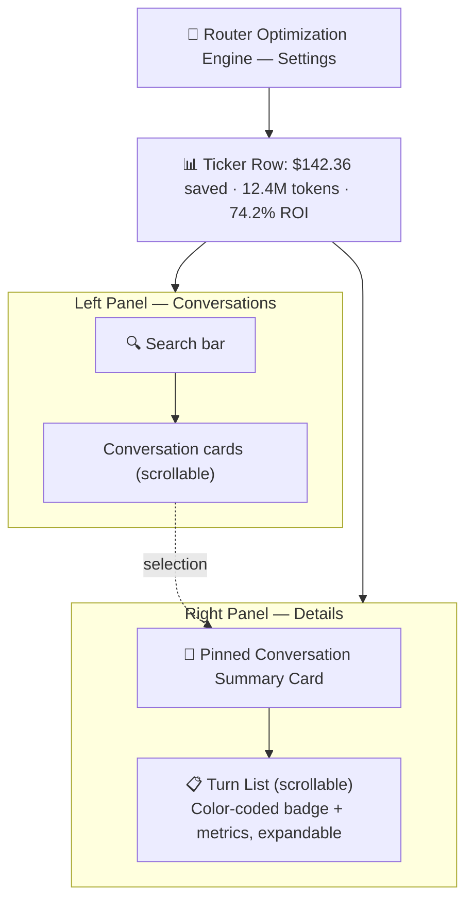
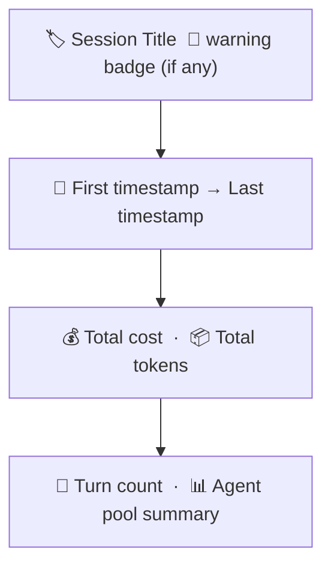
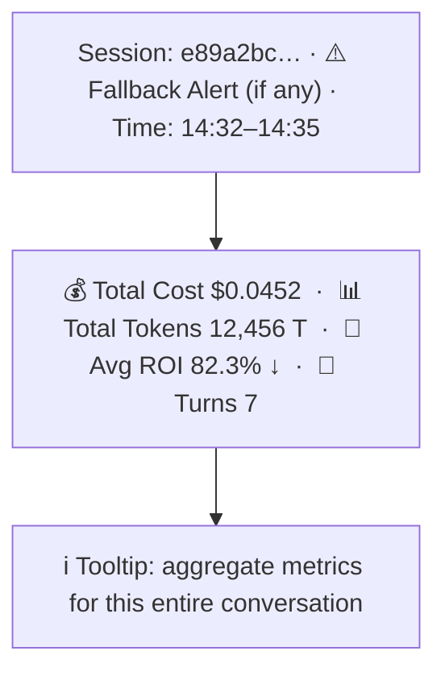
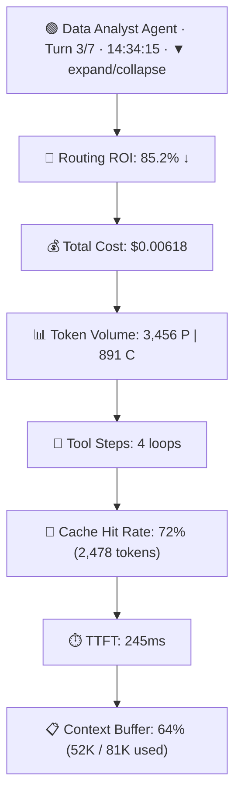
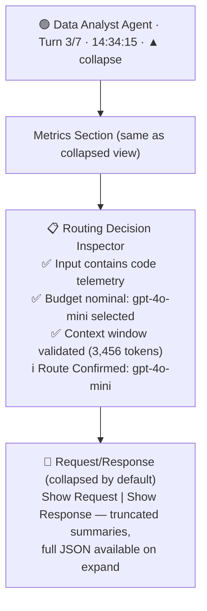

# Live Stream Tab UI/UX Revision - Agentic Routing Dashboard

## Context

The current Live Stream screen displays individual routing decisions with cost-saving metrics. The revised design must support **conversation-level analysis** where each session contains multiple turns (multi-step agent workflows), allowing users to:

1. **Monitor token compounding** across turns within a session
2. **Track routing efficiency** (ROI, cost, performance) per turn
3. **Visualize agent selection** color-coded by which agent the router selected
4. **Drill down** into turn details to inspect metrics and optionally view request/response payloads

This is a live dashboard that auto-refreshes as conversations progress in real-time. The framework's core objective is optimizing **Performance-per-Dollar ($\text{Perf}/\$)** during streaming, agentic tasks. Simulated/mock data is sufficient for initial implementation.

---

## Metric Priority (Ranked by Importance)

### 🟢 Primary (High Visibility)
1. **Routing ROI** - Cost savings percentage from the routing decision (e.g., "85.2% ↓")
2. **Total Turn Cost** - Exact dollar amount for this turn's execution
3. **Token Volume** - Prompt + Completion tokens with hockey stick curve visualization

### 🟡 Secondary (Medium Visibility)  
4. **Tool Execution Loop Count** - Number of internal steps/API calls within this turn
5. **Cache Hit Rate** - Percentage of tokens served from prompt cache (if applicable)

### 🔴 Tertiary (Low Visibility / Tooltips)
6. **Time-to-First-Token (TTFT)** - Routing latency (secondary concern for async workflows)
7. **Context Buffer Margin** - Percentage of context window used (system constraint, not optimization target)

---

## Screen Layout Architecture

### Overall Structure: **Three-Section Layout**



---

## Left Panel: Conversation List

### Search Bar
- **Placeholder**: "Search conversations, agents, or models..."
- **Search across**: Conversation title, agent names, model names, session ID
- **Icon**: Magnifying glass (existing Icon component)

### Conversation Cards (Scrollable)
Each card is a button that selects the conversation. Styling:
- **Unselected**: Dark background (`--surface-card`, #181818), neutral border (`--border-button`, #4d4d4d)
- **Selected**: Highlighted background (`--surface-elevated-a`, #252525), accent border (`--accent`, #1ed760 — updated from the old cyan/sky-400 accent as part of aspirational-design adoption, see [`DESIGN.md`](DESIGN.md) §2)
- **Fallback warning**: Orange left border + warning badge if any turn in session had fallback routing

**Card Content** (top to bottom):


**Interaction**:
- Clicking a card selects the conversation and populates the right panel
- First visible conversation auto-selects on page load

---

## Right Panel: Conversation & Turn Details

### 1️⃣ Pinned Conversation Summary Card (Top)

Sticky card that remains visible when scrolling through turns below.

**Layout** (horizontal grid):


**Metrics Displayed**:
- **Total Cost**: Sum of all turns' costs
- **Total Tokens**: Prompt + Completion across all turns
- **Avg Routing ROI**: Mean ROI across turns (indicator of routing effectiveness)
- **Turn Count**: Number of turns in this conversation
- **Fallback Flag**: Visual warning if any turn had fallback routing

**Tooltips** (hover over each metric):
- "Total Cost" → "Sum of all LLM API costs for this conversation"
- "Total Tokens" → "Cumulative prompt + completion tokens sent to LLM"
- "Avg Routing ROI" → "Average cost reduction percentage across all turns in this conversation"
- "Turn Count" → "Number of multi-step agent workflows within this conversation"

---

### 2️⃣ Turn List (Below Pinned Card)

Each turn is a collapsible card showing metrics first, with expandable request/response details.

#### Turn Card (Collapsed View - Default)



**Color Coding**:
- **Left border color**: Auto-generated from agent name (consistent hash-based color)
- **Status indicator**: 🟢 = successful, 🟠 = fallback, 🔴 = error (if applicable)

**Interactive Elements**:
- **Expand button (▼)**: Shows/hides detailed metrics + request/response
- **Tooltips on each metric** (hover):
  - "Routing ROI" → "Cost reduction from routing this task to a cheaper model vs. worst-case expensive model"
  - "Total Cost" → "Sum of prompt token cost + completion token cost for this turn"
  - "Token Volume" → "Prompt tokens sent to LLM + Completion tokens generated. Hockey stick curve visible across turns."
  - "Tool Steps" → "Number of tool invocations/API calls within this turn's multi-step workflow"
  - "Cache Hit Rate" → "Percentage of prompt tokens served from Anthropic's prompt cache (if using Claude)"
  - "TTFT" → "Time elapsed from routing decision to first token received from LLM"
  - "Context Buffer" → "Current session context size relative to model's max context window"

---

#### Turn Card (Expanded View - On Expand Click)

When expanded, the turn card shows additional sections:



**Sections**:
1. **Metrics** (always visible when expanded)
2. **Routing Decision Inspector** (color-coded steps from RoutingStep data)
3. **Request/Response** (collapsed by default):
   - Two sub-sections: "Show Request" and "Show Response"
   - Show truncated preview initially
   - Expand to show full JSON/payload

---

## Token Compounding Visualization (Separate Concern)

**Note**: Per user guidance, the line chart showing token compounding by conversation should appear in the **Cost Analytics tab**, NOT in Live Stream. That's a separate task.

However, **within the Live Stream turn list**, users can see the hockey stick curve indirectly:
- By scrolling through turns and observing how **Total Tokens** and **Token Volume** grow
- Adding a small **sparkline or mini chart** to the conversation summary card showing token growth across turns (optional enhancement)

---

## Color Scheme: Agent Auto-Generation

- **Algorithm**: Hash agent name to a deterministic color
- **Palette**: Use a curated set of 10-12 vibrant, accessible colors (mix of saturated hues + neutral fallback)
- **Example palette**:
  ```
  #10b981 (emerald),  #38bdf8 (cyan),    #818cf8 (indigo),
  #fb7185 (rose),     #f59e0b (amber),   #a78bfa (purple),
  #14b8a6 (teal),     #0ea5e9 (sky),     #6366f1 (indigo-2),
  #ec4899 (pink),     #f97316 (orange),  #06b6d4 (cyan-2)
  ```
- **Hash function**: Simple modulo hash: `color_index = Hash(agent_name) % palette.length`

---

## Real-Time Updates (Live Dashboard Behavior)

- **Auto-refresh interval**: Every 1-2 seconds (configurable)
- **Streaming data**: New turns appear at the bottom of the turn list
- **Conversation card update**: Summary metrics (cost, token count) update in real-time
- **Selection persistence**: If a user has a conversation selected, it remains selected as new data arrives
- **Scroll behavior**: New turns don't auto-scroll into view (avoid jarring UX)

---

## Data Model Extensions (Mock Data)

Current data model has `RoutingEntry` (single routing decision). Need to add:

### New Records to `DashboardData.cs`:

```csharp
/// <summary>A single turn within a conversation (multi-step agentic workflow).</summary>
public sealed record ConversationTurn(
    string Id,                              // Unique turn ID
    string Agent,                           // Agent name
    string Model,                           // Selected model
    int TurnNumber,                         // Position in conversation (1, 2, 3, ...)
    int PromptTokens,
    int CompletionTokens,
    decimal RoutingRoi,                     // Cost reduction percentage
    decimal TotalCost,                      // Turn cost in dollars
    int ToolExecutionSteps,                 // Number of tool calls
    decimal CacheHitRate,                   // % (0-100)
    int TimeToFirstTokenMs,                 // TTFT in milliseconds
    decimal ContextBufferPercent,           // % of context window used
    string Timestamp,
    IReadOnlyList<RoutingStep> RoutingSteps,
    string? RequestSummary,                 // Brief request preview (optional)
    string? ResponseSummary);               // Brief response preview (optional)

/// <summary>A conversation/session containing multiple turns.</summary>
public sealed record Conversation(
    string Id,                              // Session ID
    string Title,                           // User-friendly title
    string FirstTimestamp,
    string LastTimestamp,
    decimal TotalCost,                      // Sum of all turn costs
    int TotalPromptTokens,
    int TotalCompletionTokens,
    bool HasFallbackTurns,                  // Warning flag
    IReadOnlyList<ConversationTurn> Turns); // All turns in this conversation
```

### Mock Data:
Extend `MockData` class to include a few sample `Conversation` objects, each containing 3-5 sample `ConversationTurn` records showing token growth across turns.

---

## Component Implementation Strategy

### New/Modified Components:

1. **LiveStream.razor** (revise existing)
   - Refactor to accept `IReadOnlyList<Conversation>` instead of `IReadOnlyList<RoutingEntry>`
   - Left panel: Conversation list + search
   - Right panel: Pinned summary + turn list with expandable cards

2. **ConversationCard.razor** (new)
   - Reusable component for left-panel conversation card
   - Parameters: `Conversation`, `IsSelected`, `OnSelect` callback

3. **TurnCard.razor** (new)
   - Reusable component for each turn in the turn list
   - Collapsible: metrics (always) + inspector (on expand) + request/response (on further expand)
   - Parameters: `ConversationTurn`, `IsExpanded`, `OnToggleExpand` callback

4. **ConversationSummary.razor** (new)
   - Pinned summary card showing aggregate metrics for selected conversation
   - Grid layout with tooltips

5. **Tooltip.razor** (new or reuse existing)
   - Simple tooltip component for hover help text
   - Used throughout for metric definitions

### Styling
- Leverage existing Tailwind CSS + inline styles from current codebase
- Maintain dark theme (#181818 card backgrounds, #4d4d4d borders, #10b981/#1ed760/#f59e0b accents —
  see [`DESIGN.md`](DESIGN.md) §2 for the full token table)
- Add subtle animations on expand/collapse (smooth transition)

---

## Verification & Testing

### Manual Testing Checklist:
- [ ] Left panel displays conversation cards with all required fields (title, timestamps, cost, tokens, turn count, warnings)
- [ ] Search bar filters conversations by title, agent, model, session ID
- [ ] Selecting a conversation populates right panel with summary + turn list
- [ ] Turn cards display all 7 metrics in correct priority order
- [ ] Tooltips appear on hover with correct definitions
- [ ] Turn card expand/collapse toggles request/response visibility
- [ ] Agent color coding is consistent across all turns (same agent = same color)
- [ ] Real-time updates: new turns appear in list without page reload
- [ ] Pinned summary card remains visible when scrolling turn list
- [ ] Fallback warnings appear on both conversation card and summary card
- [ ] Responsive layout: left/right panels maintain proper flex sizing
- [ ] Mock data demonstrates token compounding (each successive turn has higher token count)

### Browser Testing:
- Verify on Chromium (pre-installed for Playwright)
- Check dark theme rendering
- Confirm tooltips render correctly on all major browsers

---

## Files to Modify/Create

| File | Action | Notes |
|------|--------|-------|
| `src/TotallyHotArcRouter.Gui/Components/LiveStream.razor` | Revise | Refactor to use conversation-level data + new layout |
| `src/TotallyHotArcRouter.Gui/Components/ConversationCard.razor` | Create | New reusable component for left panel |
| `src/TotallyHotArcRouter.Gui/Components/TurnCard.razor` | Create | New reusable component for turn list |
| `src/TotallyHotArcRouter.Gui/Components/ConversationSummary.razor` | Create | Pinned summary card component |
| `src/TotallyHotArcRouter.Gui/Models/DashboardData.cs` | Extend | Add `Conversation` and `ConversationTurn` records + mock data |
| `src/TotallyHotArcRouter.Gui/Utils/ColorUtils.cs` | Create | Deterministic agent-name → color mapping |
| `src/TotallyHotArcRouter.Gui/wwwroot/js/split-pane.js` | Create | Pointer-drag handling for the adjustable split panels |
| `src/TotallyHotArcRouter.Gui/wwwroot/css/app.css` | Extend | `ls-*` classes: split divider, metric tiles, truncation, payload areas |

---

## Implemented Revision Decisions (v2)

The first implementation of this plan was rejected and replaced. The current revision departs from
the earlier attempt (and refines this plan) as follows:

1. **Adjustable split panels**: the left/right panels are separated by a full-height draggable
   divider (`wwwroot/js/split-pane.js`, invoked from `LiveStream.razor` via JS interop). Left panel
   defaults to 35% width and is clamped to 20-65% while dragging.
2. **Compact two-line turn cards**: each collapsed turn card is a header line plus a single
   wrapping stat strip (small uppercase label + value pairs) in business-priority order - ROI, Cost,
   Tok P/C, Steps, Cache, TTFT, Ctx, Model - so many turns fit on screen at once. An earlier tile
   grid was rejected as too tall.
3. **Minimal iconography**: plain text labels and the existing SVG `Icon` component, matching the
   rest of the dashboard, rather than emoji markers on every metric.
4. **Floating tooltips**: every metric (turn-level, summary, and conversation-card) carries a
   `data-tip` attribute rendered by a body-level floating tooltip (`wwwroot/js/tooltips.js`).
   Native `title` tooltips proved unreliable in the BlazorWebView and CSS-only tooltips get clipped
   by the internal scroll containers.
5. **Per-turn fallback flag**: `ConversationTurn` gained an optional `IsFallback` so fallback badges
   render on individual turn cards, not just at conversation level.
6. **Stable agent colors**: `ColorUtils` hashes agent names with FNV-1a (not `string.GetHashCode()`,
   which is randomized per process) so agent colors survive app restarts.
7. **Pinned-by-layout summary**: the conversation summary card sits above the scrollable turn list
   (rather than using `position: sticky` inside it), so it can never scroll out of view.
8. **Consistent mock totals**: conversation-level cost/token totals equal the sum of their turns.
9. **Request excerpt as turn title**: the first words of the turn's request text serve as the turn
   card title, so scanning the list reads like the conversation itself. Request/response mock data
   is plain sample text (not JSON payloads), shown directly in the expanded drill-down without a
   second collapse level.
10. **Agent-tinted cards**: each turn card's background and left border are tinted with the selected
    agent's color, and the header carries a color-coded agent chip - reusing the tinted-row visual
    language of the original Routing Decision Inspector to make the selected agent obvious at a
    glance.
11. **Real-time updates ended up being push, not polling**: the "Real-Time Updates" section above
    describes the original plan's "auto-refresh interval" framing, written before live proxy
    integration existed. What actually shipped (see [`../router/telemetry.md`](../router/telemetry.md))
    is a gRPC stream pushing each `RoutingTelemetryEvent` to the GUI as soon as the proxy forwards a
    request (SignalR at the time this shipped, migrated to gRPC afterward - see
    [`../router/grpc-migration.md`](../router/grpc-migration.md)) - there is no polling interval,
    configurable or otherwise, anywhere in the implementation.

---

## v3: Renamed to "Sessions", rebuilt as a full-width list with a double-click split view

The tab was renamed from "Live Stream" to "Sessions" and its default layout inverted: rather than an
always-visible two-panel split with the first conversation auto-selected, the tab now opens on a
single **full-width, oldest-first card list** with no panel split at all. A **double-click** on a
card is what now opens the split view - previously the split was permanent and single-click drove
selection within it.

1. **Full-width list is the resting state**: `LiveStream.razor` renders `ConversationCard`s in a
   responsive grid (`ls-sessions-grid`, `auto-fill, minmax(260px, 1fr)`) spanning the tab's full
   width when no session is opened - there is no auto-selected first conversation and no
   permanently-visible right panel.
2. **Oldest-first ordering**: the card list sorts by each conversation's earliest turn
   `TimestampUtc` ascending (`LiveStream.FirstTurnTimestampUtc`), not `Conversation.FirstTimestamp`
   (a display-only `"HH:mm:ss"` string, unreliable to sort by across a day boundary) and not the
   store's most-recent-active-first order.
3. **Double-click opens the split, single-click does not**: `ConversationCard` gained a second
   `OnDoubleClick` callback alongside its existing `OnSelect`. Single-click still invokes `OnSelect`
   (preserved so Dashboard's shared `_selectedConversationId` - and therefore Cost Analytics'
   initial-session behavior - keeps working), but no longer opens anything in the Sessions tab
   itself. Double-click both opens the split view and invokes `OnSelect`, so the two stay in sync.
4. **Split view is session details + a chat reproduction, not a pinned summary + turn-metrics
   list**: the left pane reuses `ConversationSummary` (unchanged) behind a "Back to Sessions" button
   that collapses the split; the right pane is a new component, `SessionConversationPane.razor`,
   rendering each turn's `RequestSummary`/`ResponseSummary` as left/right chat bubbles
   (`ls-chat-bubble-user`/`ls-chat-bubble-model`) tinted with the turn's agent color, in ascending
   `TurnNumber` order. A turn with no captured summary shows a muted "No request/response captured"
   placeholder rather than an empty bubble. The old turn-metrics list (`TurnCard`, with its
   ROI/cost/token stat strip and expandable routing-decision log) is unchanged and still used
   elsewhere - it is simply no longer what the Sessions split view's right pane shows.
5. **`splitPane.init` reused as-is**: the draggable divider between the two split panes is the same
   `wwwroot/js/split-pane.js` hook as before, now invoked only in `OnAfterRenderAsync` when a split
   is actually open (previously it ran whenever any conversation existed, since the split was
   permanent).

---

## Critical Design Decisions

1. **Metrics Priority**: Ordering by business value (ROI first, then cost, then tokens) rather than frequency
2. **Request/Response Collapsed**: Reduces cognitive load; users drill down only when needed for debugging
3. **Auto-generated Agent Colors**: Deterministic, no config needed; colors are stable across sessions
4. **Pinned Summary**: Allows users to reference session-level metrics while scrolling through turn-level details
5. **Live Auto-refresh**: Essential for monitoring; new turns stream in as they complete
6. **Simulated Data**: Mock data sufficient for UI/UX iteration; real integration is a separate task

---

## Notes for Implementation

- The current `RoutingEntry` model assumes one routing decision per card. The new model supports multiple turns per conversation, which is a significant structural change to the data flow.
- The mock data should show realistic token growth (prompt tokens increasing, completion tokens relatively stable or growing slightly) to accurately simulate the hockey stick curve.
- The color generation function should be placed in a shared utility class (e.g., `ColorUtils.cs`) for reuse across tabs.
- All tooltips should support keyboard accessibility (aria-describedby for screen readers).

