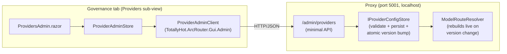

# Governance Tab: Provider & Credential Management

> **Status: Implemented.** The Governance tab's **Providers** sub-view adds/removes/edits provider
> endpoints and credentials and manages each provider's models, backed by the `/admin/*` management API
> on the proxy that reloads the router live. Each provider card also carries an optional **monthly
> budget** — a `$` cap and/or token cap persisted to SQLite (`provider_budgets`), the current month's
> spend (`provider_spend`, accumulated by `ProviderBudgetStore` on the telemetry path), and two ECharts
> utilization bars. A breached provider is skipped in routing and an all-breached request is rejected
> with 402. This replaced the former mock **Budgets** sub-view (`MockData.Providers`).

## Architecture

The GUI is a separate process from the proxy and, per
[`../router/telemetry.md`](../router/telemetry.md#gui-consumption), only ever talks to the proxy —
never to configuration files or providers directly. Provider management follows that rule over a new
HTTP channel:

- **`IProviderConfigStore`** (`src/TotallyHotArcRouter/Proxy/ProviderConfigStore.cs`) is the writable source
  of truth for `ModelRouting` (providers + model allowlist). It seeds from `appsettings.json` on first
  run (in memory — nothing is written until an edit), then persists the whole config to
  `model-routing.json` and becomes the source of truth on later startups. `ModelRouteResolver` reads
  its snapshots and rebuilds its lookup whenever the version advances, so edits take effect **without
  restarting the proxy**.
- **`/admin/*` API** (`src/TotallyHotArcRouter/Proxy/Management/ProviderAdminEndpoints.cs`) is mapped on the
  plain-HTTP proxy port (5001), alongside LLM forwarding. Endpoints: `GET /admin/providers`,
  `PUT`/`DELETE /admin/providers/{key}`, `PUT`/`DELETE /admin/providers/{key}/models/{modelName}`,
  `PUT /admin/providers/{key}/models/{modelName}/enabled` (per-model Start/Stop, the model-level twin
  of `PUT /admin/providers/{key}/enabled`), and three related model-discovery routes:
  `discover-models` and `scan-capabilities` are independently callable building blocks, while
  `POST /admin/providers/{key}/refresh-from-endpoint` is the one the GUI actually calls — see below.
- **Refresh from endpoint is a single router-side operation**, not the GUI orchestrating several calls.
  `ManagementFacade.RefreshFromEndpointAsync` discovers the provider's live model list, **reconciles it
  into `ModelRouting:ModelList`** (a model the endpoint newly reports is added automatically but starts
  `Enabled: false`; a configured model the endpoint no longer reports is flagged `PresentUpstream: false`
  and greyed out — **never deleted**, since e.g. LM Studio's `/v1/models` only lists the currently
  *loaded* model, not everything downloaded), then re-probes endpoint flavors and re-runs tiers 1-3
  tool-call dialect detection (`docs/router/tool-call-normalization.md` §3.2-3.3). One click, one
  request; the response is the same `GET /admin/providers` shape (`ModelView` now also carries
  `Enabled`/`PresentUpstream` alongside `Dialect`/`Confidence`, and `ProviderView` carries
  `EndpointCapabilities`), so the GUI just re-renders. `ModelRouteEntry.Enabled`/`PresentUpstream` are
  independent signals: `Enabled` is the operator's own Start/Stop intent and is never touched by a scan;
  `PresentUpstream` is fully scan-managed, so a model the operator started resumes routable the moment
  it's rediscovered, with no extra click. Both are enforced on the very next request via
  `IModelRouteResolver.IsModelEnabled` — a stopped or not-currently-upstream model is treated exactly
  like an unconfigured one for routing purposes.
- **`TotallyHot.ArcRouter.Gui.Admin`** (plain `net10.0`) holds the DTOs and `ProviderAdminClient` HTTP logic,
  unit-tested in CI. **`ProviderAdminStore`** (MAUI) is the thin singleton the UI binds to, mirroring
  `LiveDataStore`.
- **A failed refresh/scan/discovery is visible, not silent.** `RefreshFromEndpointAsync` still returns
  `200 OK` even when the provider rejected the request outright (e.g. an expired API key) - the model
  list reconciliation and capability scan are independent of whether discovery itself succeeded, so
  the request as a whole "succeeds" with nothing changed. `ProviderInteractionStatusStore`
  (in-memory, keyed by provider, reset on router restart) separately records the outcome of each
  admin-initiated interaction and is surfaced as `ProviderView.LastInteraction` /
  `ProviderAdminView.LastInteraction`. The Governance card shows a persistent amber warning icon and
  tooltip while the last interaction failed, and `ProviderAdminStore.RefreshFromEndpointAsync` raises
  an app-wide toast (`ToastService`, `docs/gui/dashboard.md`) the moment it happens - the warning
  clears on the provider's next successful interaction, never on a timer. A discovery `Error` alone is
  not treated as a failure when the capability scan corroborates the endpoint is reachable and
  authenticating (e.g. hosted Anthropic has no OpenAI-shaped `/v1/models`, so discovery always reports
  unsupported even though the provider is healthy) - see `ManagementFacade.RecordRefreshOutcome`.

## Provider types

The edit dialog's **Provider Type** dropdown selects a provider *family*, which pre-fills the base URL,
the authentication shape, and any header the API requires. Each entry is a family rather than a single
vendor: everything that authenticates identically shares one entry and differs only in a base URL the
operator edits.

| Dropdown label | `ProviderType` | Requires auth | Auth header hint |
|---|---|---|---|
| Anthropic | `Anthropic` | yes | `x-api-key` |
| OpenAI / Groq / DeepSeek | `OpenAI` | yes | `Authorization` |
| Google Gemini | `GoogleGemini` | yes | `Authorization` |
| Azure OpenAI | `AzureOpenAI` | yes | `api-key` |
| Cohere | `Cohere` | yes | `Authorization` |
| Ollama / LM Studio / llama.cpp | `LocalRuntime` | **no** | — |
| AWS Bedrock | `Bedrock` | **no** (SigV4) | — |
| Other | `Other` | yes | `Authorization` |

The `OpenAI` entry covers every OpenAI-compatible endpoint — xAI, Together, OpenRouter, Mistral,
Fireworks, Perplexity, vLLM — because they share the identical bearer-token shape. The Anthropic
template also seeds the mandatory `anthropic-version: 2023-06-01` custom header, without which that API
rejects every request.

The selection is persisted on `ProviderOptions.ProviderType` (as the enum member's **name**) purely so
that reopening a provider restores its type and defaults. Nothing in the routing or forwarding path
reads it; behavior comes entirely from the concrete fields the template filled in.

## Authentication

There is no dedicated credential field or fieldset: authentication is expressed as an ordinary entry in
**Custom Headers** below, exactly like `anthropic-version` or any other header a provider's API needs.
Selecting a **Provider Type** doesn't tick a checkbox — it shows a hint above Custom Headers naming the
header the family authenticates with (e.g. `x-api-key` for Anthropic), so the operator knows what to add
a row for. A local runtime or Bedrock (SigV4-signed by the AWS SDK) simply needs no such row.

`AuthHeaderName` — which header is "the" credential header — is still stored on the provider, derived
automatically from the selected type's template on save (or carried through unchanged for a type with no
template). It is not itself a credential: it exists so the proxy can strip a client-sent header of the
same name before forwarding, so a client can't override or duplicate the configured one.

## Custom headers

**Custom Headers** holds every extra header a provider's API needs — including whichever one carries
authentication — each a name plus a value sourced from either a literal or an environment variable.

A literal value's box is a [**secret field**](secret-field.md): an ordinary readable text box with a
padlock inside its right edge, **defaulting to unlocked**. Public configuration is therefore visible and
directly editable, while a header that happens to carry a credential can be locked per header — at which
point it masks to dots and the router stops returning its value to the GUI entirely. Unlocking clears
the value, because a value that was never returned cannot be shown again; the padlock takes two clicks
to unlock and says so first.

Consequently a blank literal box means different things per header: under a locked padlock it preserves
the stored value, and under an unlocked one it means the value is genuinely empty. Env-var-sourced
headers show no padlock — they hold a variable name, not a secret.

One exception to "defaulting to unlocked": on save, the literal header whose name matches the provider's
`AuthHeaderName` (the credential header) is always stored locked, regardless of its padlock state in the
dialog. This is why a freshly added `Authorization` or `x-api-key` row shows unlocked while you're
editing it, but its value has disappeared the next time you reopen the dialog — that row is the
credential, and it is never left readable back through the management API.

Headers already in `model-routing.json` before the padlock existed load as **locked**, so nothing that
was previously write-only becomes visible on upgrade.

## Free providers

A provider can be marked **Free** (`ProviderOptions.IsFree`, a checkbox in the edit dialog, shown as a
`Free` badge on the provider card). It means requests to this provider cost nothing — a local Ollama
runtime, say — so its models report a cost of **$0.00** instead of an unknown cost. It is independent
of credentials: a free endpoint may still require a token.

This is the only thing in TotallyHotArcRouter that currently produces a non-null `EstimatedCostUsd`. There is
no price table — the hand-maintained one was deleted as unverified placeholder data, and real prices
arrive with [`model-price-catalog.md`](../router/model-price-catalog.md) — so every other model's cost
reads as unknown. See [`telemetry.md`](../router/telemetry.md#pricing).

**It defaults off, and only fresh installs get it seeded.** `appsettings.json` sets `IsFree: true` on
`ollama`, but that seed applies only when no `model-routing.json` exists yet; once the file is written,
it owns provider config and an absent `IsFree` key loads as `false`. So on an existing install a local
provider reports unknown cost until someone ticks the box. That is why the badge is on the card rather
than hidden in the dialog: the flag's state should be visible without opening anything.

## Security

The `/admin/*` endpoints inherit the proxy's loopback-only posture, and are additionally gated by a
shared token on every request — **always on, not configurable off**. `ManagementAccessToken.GetOrCreate`
generates a cryptographically random token on first run and persists it to
`%ProgramData%\TotallyHotArcRouter\management-token.txt` with an access-restricted ACL (Windows: system,
administrators, and the writing account get full control, `Users` read-only) / file mode 644 (POSIX); the
GUI reads the same file to attach it as `X-Admin-Token` on every call, verified server-side in constant
time (`ManagementAccessToken.Verify`). The location is machine-wide rather than per-user because the
installed router runs as `LocalSystem` while the GUI runs as the interactive user — under `%LOCALAPPDATA%`
the two processes read different files and every call came back 401.
There is no `Management:Token` configuration key — the token is never entered or stored in
`appsettings.json`.

## Manual verification (Windows / MAUI)

The MAUI Gui project is Windows-only and excluded from CI, so the UI is verified manually; all
extractable logic (the `ProviderAdminClient` and the store/resolver) is covered by CI tests
(`TotallyHot.ArcRouter.Gui.Admin.Tests`, `ProviderConfigStoreTests`, `ProviderAdminEndpointsTests`).

1. Start the proxy, then run the Gui. Open **Governance → Providers**.
2. **Add** a provider with type *Ollama / LM Studio / llama.cpp*; confirm the base URL fills in and
   **Free provider** ticks itself, with no header suggested under Custom Headers.
3. **Add** a model under it (`llama3`), then confirm `GET http://localhost:5001/v1/models` lists it
   with no proxy restart.
4. **Edit** a provider's base URL without re-entering a locked header's value; confirm the value is
   preserved.
4b. Select type *Anthropic* on a new provider: confirm the Custom Headers hint names `x-api-key`, and
   `anthropic-version` is added as a header automatically. Add an `x-api-key` header with a literal value,
   save, close, and reopen — the type must still read **Anthropic**.
4c. Select type *OpenAI / Groq / DeepSeek*, add an `Authorization` header sourced from an env var named
   `OPENAI_API_KEY`, save, and inspect `model-routing.json`: it must store that header under `Headers`
   with `"ValueEnvVar": "OPENAI_API_KEY"`.
4d. **Custom headers, locked and unlocked.** Add a header with a literal value and save; reopen and
   confirm the value is shown in full (unlocked is the default). Click its padlock, save, reopen: the box
   must now be blank and masked with the `••••••••` placeholder, and `model-routing.json` must carry
   `"Locked": true` beside the value. Click the padlock again — the first click must only turn it red
   with a warning tooltip, the second must clear the box — then save and confirm the value is gone from
   `model-routing.json` rather than silently preserved. Finally confirm an existing `anthropic-version`
   header still reads `2023-06-01` and switching a header to *Env var* removes its padlock.
5. **Refresh from endpoint** on a running provider; confirm a newly-available model appears
   automatically (stopped, greyed out — click Start to activate it), a dialect badge (e.g. `hermes`,
   `openai-native`) appears next to a model once the provider's endpoint exposes enough metadata to
   classify it (`docs/router/tool-call-normalization.md` §3.2 for what each tier needs), and that
   stopping the provider's model (e.g. unloading it in LM Studio) and refreshing again greys the row out
   as "not detected" without removing it — reloading the model and refreshing once more should resume it
   as started, with no extra click, if it was started before.
6. **Remove** a provider that still has models. The trashcan opens a type-to-confirm dialog
   (`RemoveProviderDialog`) naming how many models will go with it; the Remove button stays disabled
   until the provider's key is typed exactly. Confirm the provider *and* its models disappear in one
   step, and that the provider's historical spend/usage figures are unaffected.
7. Stop the proxy and reopen the tab; confirm the "management API unreachable" state with a Retry.

## Non-goals

Virtual keys, per-*team* budgets, SSO, and audit logs remain out of scope — this stays a
single-developer tool, not a multi-tenant platform.
Per-*provider* monthly budget caps are now implemented (persisted, enforced, with real current-month
spend) as part of this Providers sub-view.

