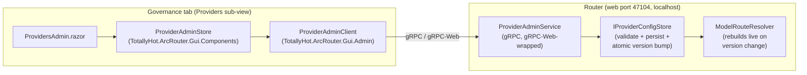

# Governance Tab: Provider & Credential Management

> **Status: Implemented.** Updated for the web GUI migration plan's P11 docs close-out (2026-09-15) - the
> transport moved from HTTP/JSON REST to gRPC/gRPC-Web, and the dashboard moved from a Windows-only MAUI
> process to a browser-hosted Blazor WebAssembly app; the feature behavior described below is unchanged.
> The Governance tab's **Providers** sub-view adds/removes/edits provider endpoints and credentials and
> manages each provider's models, backed by the router's `ProviderAdminService` gRPC service that reloads
> the router live. Each provider card also carries an optional **monthly budget** — a `$` cap and/or token
> cap persisted to SQLite (`provider_budgets`), the current month's spend (`provider_spend`, accumulated
> by `ProviderBudgetStore` on the telemetry path), and two ECharts utilization bars. A breached provider is
> skipped in routing and an all-breached request is rejected with 402. This replaced the former mock
> **Budgets** sub-view (`MockData.Providers`).

## Architecture

The dashboard only ever talks to the router - never to configuration files or providers directly - per
[`../router/telemetry.md`](../router/telemetry.md#gui-consumption). Provider management follows that
rule over gRPC (native from the Windows Tray, gRPC-Web from the browser-hosted WASM dashboard):

- **`IProviderConfigStore`** (`src/TotallyHotArcRouter/Proxy/ProviderConfigStore.cs`) is the writable source
  of truth for the live provider list and model allowlist. On first run, when no `model-routing.json`
  exists yet, that list starts empty and stays in memory until the first edit; nothing is written until
  then. `ModelRouting:Providers` in `appsettings.json` is the add-provider template catalog, not a copy
  of this list. After an edit the whole configuration is persisted to `model-routing.json` and that file
  is the source of truth on later startups. `ModelRouteResolver` reads the store's snapshots and rebuilds
  its lookup whenever the version advances, so edits take effect **without restarting the proxy**.
- **`ProviderAdminService`** (`src/Protos/admin.proto`, implemented by
  `src/TotallyHotArcRouter/Proxy/Management/ProviderAdminGrpcService.cs`) is mapped on the router's single
  web port, wrapped in gRPC-Web so the browser dashboard can call it directly - there is no separate REST
  `/admin/*` API any more (deleted in Phase P2). RPCs: `ListProviders`, `UpsertProvider`/`RemoveProvider`,
  `UpsertModel`/`RemoveModel`, `SetModelEnabled` (per-model Start/Stop, the model-level twin of
  `SetProviderEnabled`), and three related model-discovery RPCs: `DiscoverModels` and `ScanCapabilities`
  are independently callable building blocks, while `RefreshFromEndpoint` is the one the GUI actually
  calls — see below.
- **Refresh from endpoint is a single router-side operation**, not the GUI orchestrating several calls.
  `ManagementFacade.RefreshFromEndpointAsync` discovers the provider's live model list, **reconciles it
  into `ModelRouting:ModelList`** (a model the endpoint newly reports is added automatically but starts
  `Enabled: false`; a configured model the endpoint no longer reports is flagged `PresentUpstream: false`
  and greyed out — **never deleted**, since e.g. LM Studio's `/v1/models` only lists the currently
  *loaded* model, not everything downloaded), then re-probes endpoint flavors and re-runs tiers 1-3
  tool-call dialect detection (`docs/router/tool-call-normalization.md` §3.2-3.3). One click, one
  request; the response is the same `ListProviders`/`ProviderListResponse` shape every other mutation
  returns (`ModelView` now also carries `Enabled`/`PresentUpstream` alongside `Dialect`/`Confidence`, and
  `ProviderView` carries `EndpointCapabilities`), so the GUI just re-renders. `ModelRouteEntry.Enabled`/`PresentUpstream` are
  independent signals: `Enabled` is the operator's own Start/Stop intent and is never touched by a scan;
  `PresentUpstream` is fully scan-managed, so a model the operator started resumes routable the moment
  it's rediscovered, with no extra click. Both are enforced on the very next request via
  `IModelRouteResolver.IsModelEnabled` — a stopped or not-currently-upstream model is treated exactly
  like an unconfigured one for routing purposes.
- **`TotallyHot.ArcRouter.Gui.Admin`** (plain `net10.0`) holds the DTOs and `ProviderAdminClient`'s gRPC
  logic, unit-tested in CI. **`ProviderAdminStore`** (`TotallyHot.ArcRouter.Gui.Components`, also plain
  `net10.0` - cross-platform since Phase P5) is the thin singleton the UI binds to, mirroring
  `LiveDataStore`.
- **A failed refresh/scan/discovery is visible, not silent.** `RefreshFromEndpointAsync` still returns
  `200 OK` even when the provider rejected the request outright (e.g. an expired API key) - the model
  list reconciliation and capability scan are independent of whether discovery itself succeeded, so
  the request as a whole "succeeds" with nothing changed. `ProviderInteractionStatusStore`
  (in-memory, keyed by provider, reset on router restart) separately records the outcome of each
  admin-initiated interaction and is surfaced as `ProviderView.LastInteraction` /
  `ProviderAdminView.LastInteraction`. The Governance card shows a persistent amber warning icon and
  tooltip while the last interaction failed, and `ProviderAdminStore.RefreshFromEndpointAsync` raises
  an app-wide toast (`ToastService`, `docs/gui/dashboard.md`) the moment it happens - the warning
  clears on the provider's next successful interaction, never on a timer. A discovery `Error` alone is
  not treated as a failure when the capability scan corroborates the endpoint is reachable and
  authenticating (e.g. hosted Anthropic has no OpenAI-shaped `/v1/models`, so discovery always reports
  unsupported even though the provider is healthy) - see `ManagementFacade.RecordRefreshOutcome`.

## Provider types

The edit dialog's **Provider Type** dropdown lists one option per key in `ModelRouting:Providers`
(`appsettings.json`), then a blank **Other** choice. Selecting a key pre-fills that entry's base URL,
free-provider flag, auth-header name, and custom headers other than the credential header. The operator
can change the base URL and headers afterward. The list is the configured catalog, not a hardcoded set
of families: keys such as `alibaba` or `bedrock-anthropic` appear when they are configured, and a new
key needs no GUI change.

`Other` is reserved. `ModelRoutingOptions` rejects a provider key with that spelling (any casing),
because the dialog uses it as the blank choice. It means the operator fills the form in without a
template. The credential row is not copied from the catalog: the dialog records the template's auth
header name, and the operator adds the credential header themselves.

A stored `ProviderType` reopens on its catalog key when that key is present, case-insensitively.
Legacy names that identify one shipped entry still map when that entry exists: `Anthropic` →
`anthropic`, `OpenAI` → `openai`, `GoogleGemini` → `gemini`. Names that do not identify a single
entry — `LocalRuntime`, `Bedrock`, `AzureOpenAI`, `Cohere`, a removed key, or a value written by
hand — reopen as `Other` and keep the saved fields, including Bedrock's `Aws*` settings. Saving
without picking a real template persists that stored type. Picking a template replaces it. A catalog
that fails to load leaves only `Other` selectable and follows the same rule, so a missing RPC cannot
rewrite a stored key to `Other`.

The selection is persisted on `ProviderOptions.ProviderType` as that key or legacy name. Nothing in
the routing or forwarding path reads it; behavior comes from the concrete fields.

## Authentication

There is no dedicated credential field or fieldset: authentication is expressed as an ordinary entry in
**Custom Headers** below, exactly like `anthropic-version` or any other header a provider's API needs.
Selecting a **Provider Type** inserts the template's headers into Custom Headers, including — for a
provider that needs a key — an empty **locked** row named for the credential header (e.g. `x-api-key` for
the `anthropic` entry). It starts on its usual environment variable when the template names one (e.g.
`ANTHROPIC_API_KEY`); switch it to **Value** to type a key instead, and the row locks. A template whose
credential is not an HTTP header (a local runtime, or Bedrock signed with SigV4 by the AWS SDK) adds no
such row. There is no separate "credential header" setting: which header is secret is stated per header
by its padlock (see
[ADR-0016](../adr/0016-remove-authheadername-and-mark-secrets-per-header.md)).

Every header name a provider configures — secret or not — is stripped from the client's request before
forwarding, and from the upstream response before it reaches the client, so a client can't override or
duplicate the configured one.

## Custom headers

**Custom Headers** holds every extra header a provider's API needs — including whichever one carries
authentication — each a name plus a value sourced from either a literal or an environment variable.

A literal value's box is a [**secret field**](secret-field.md): an ordinary readable text box with a
padlock inside its right edge, **defaulting to unlocked**. Public configuration is therefore visible and
directly editable, while a header that happens to carry a credential can be locked per header — at which
point it masks to dots and the router stops returning its value to the GUI entirely. Unlocking clears
the value, because a value that was never returned cannot be shown again; clicking the padlock on a
locked field therefore opens a confirmation dialog (`UnlockSecretFieldDialog`) stating that consequence
before anything changes, rather than toggling in place. Locking is one click - nothing is lost. See
[`secret-field.md`](secret-field.md).

Consequently a blank literal box means different things per header: under a locked padlock it preserves
the stored value, and under an unlocked one it means the value is genuinely empty. Env-var-sourced
headers show no padlock — they hold a variable name, not a secret.

Nothing is locked implicitly. A row is stored locked only when its padlock is on — either because the
template declared it a secret, or because the operator locked it. A header you add by hand and type a
key into stays **readable** back through the management API until you lock it, so lock any row that
carries a credential.

A header stored without the flag is public configuration and loads unlocked.

## Free providers

A provider can be marked **Free** (`ProviderOptions.IsFree`, a checkbox in the edit dialog, shown as a
`Free` badge on the provider card). It means requests to this provider cost nothing — a local Ollama
runtime, say — so its models report a cost of **$0.00** instead of an unknown cost. It is independent
of credentials: a free endpoint may still require a token.

This is the only thing in TotallyHotArcRouter that currently produces a non-null `EstimatedCostUsd`. There is
no price table — the hand-maintained one was deleted as unverified placeholder data, and real prices
arrive with [`model-price-catalog.md`](../router/model-price-catalog.md) — so every other model's cost
reads as unknown. See [`telemetry.md`](../router/telemetry.md#pricing).

**It defaults off.** A missing `model-routing.json` starts with no providers, so nothing is free until
one is added. `appsettings.json` sets `IsFree: true` on the `ollama` template; selecting that template
in the edit dialog ticks the box. An existing persisted provider with no `IsFree` key loads as `false`
and reports unknown cost until someone ticks the box. That is why the badge is on the card rather than
hidden in the dialog: the flag's state should be visible without opening anything.

## Security

Every RPC on the router's web port inherits its loopback-session-cookie/token gate (ADR-0012) - the
browser dashboard's own gRPC-Web calls are covered by whichever the current session used to authenticate,
and there is no separate, weaker check for provider management specifically. `ManagementAccessToken.GetOrCreate`
generates a cryptographically random token on first run and persists it through `ProtectedSecretStore`
(DPAPI-protected on Windows, ASP.NET Data Protection-protected elsewhere - Phase P3/P9), not the plaintext
`management-token.txt` file this section originally described. A non-loopback client (the Tray's native
gRPC channel, a Docker deployment) presents it as `Authorization: Bearer <token>`, verified server-side in
constant time (`ManagementAccessToken.Verify`); a same-machine browser session instead gets a session
cookie with no manual token handling at all. There is no `Management:Token` configuration key — the token
is never entered or stored in `appsettings.json`.

## Manual verification

`TotallyHot.ArcRouter.Gui.Components` (the Razor components) and `TotallyHot.ArcRouter.Gui.Web` (the WASM
host) both target plain `net10.0` and build/test on the Linux CI job like every other library - this
section's original "MAUI is Windows-only and its CI job is disabled" caveat no longer applies (see
`dashboard.md`'s verification note). The UI is still additionally verified manually for real end-to-end
behavior; all extractable logic (the `ProviderAdminClient` and the store/resolver) is covered by CI tests
(`TotallyHot.ArcRouter.Gui.Admin.Tests`, `TotallyHot.ArcRouter.Gui.Components.Tests`,
`ProviderConfigStoreTests`, `ProviderAdminGrpcServiceTests`).

1. Start the router, then open the dashboard in a browser. Open **Governance → Providers**.
2. **Add** a provider with type *Ollama / LM Studio / llama.cpp*; confirm the base URL fills in and
   **Free provider** ticks itself, with no header suggested under Custom Headers.
3. **Add** a model under it (`llama3`), then confirm `GET https://localhost:47101/v1/models` lists it
   with no router restart.
4. **Edit** a provider's base URL without re-entering a locked header's value; confirm the value is
   preserved.
4b. Select type *Anthropic* on a new provider: confirm the Custom Headers hint names `x-api-key`, and
   `anthropic-version` is added as a header automatically. Add an `x-api-key` header with a literal value,
   save, close, and reopen — the type must still read **Anthropic**.
4c. Select type *OpenAI / Groq / DeepSeek*, add an `Authorization` header sourced from an env var named
   `OPENAI_API_KEY`, save, and inspect `model-routing.json`: it must store that header under `Headers`
   with `"ValueEnvVar": "OPENAI_API_KEY"`.
4d. **Custom headers, locked and unlocked.** Add a header with a literal value and save; reopen and
   confirm the value is shown in full (unlocked is the default). Click its padlock, save, reopen: the box
   must now be blank and masked with the `••••••••` placeholder, and `model-routing.json` must carry
   `"Locked": true` beside the value. Click the padlock again — a confirmation dialog must open naming
   the consequence; Cancel/Escape/backdrop must leave the value untouched, and Continue must clear the
   box — then save and confirm the value is gone from `model-routing.json` rather than silently
   preserved. Finally confirm an existing `anthropic-version`
   header still reads `2023-06-01` and switching a header to *Env var* removes its padlock.
5. **Refresh from endpoint** on a running provider; confirm a newly-available model appears
   automatically (stopped, greyed out — click Start to activate it), a dialect badge (e.g. `hermes`,
   `openai-native`) appears next to a model once the provider's endpoint exposes enough metadata to
   classify it (`docs/router/tool-call-normalization.md` §3.2 for what each tier needs), and that
   stopping the provider's model (e.g. unloading it in LM Studio) and refreshing again greys the row out
   as "not detected" without removing it — reloading the model and refreshing once more should resume it
   as started, with no extra click, if it was started before.
6. **Remove** a provider that still has models. The trashcan opens a type-to-confirm dialog
   (`RemoveProviderDialog`) naming how many models will go with it; the Remove button stays disabled
   until the provider's key is typed exactly. Confirm the provider *and* its models disappear in one
   step, and that the provider's historical spend/usage figures are unaffected.
7. Stop the proxy and reopen the tab; confirm the "management API unreachable" state with a Retry.

## Non-goals

Virtual keys, per-*team* budgets, SSO, and audit logs remain out of scope — this stays a
single-developer tool, not a multi-tenant platform.
Per-*provider* monthly budget caps are now implemented (persisted, enforced, with real current-month
spend) as part of this Providers sub-view.

