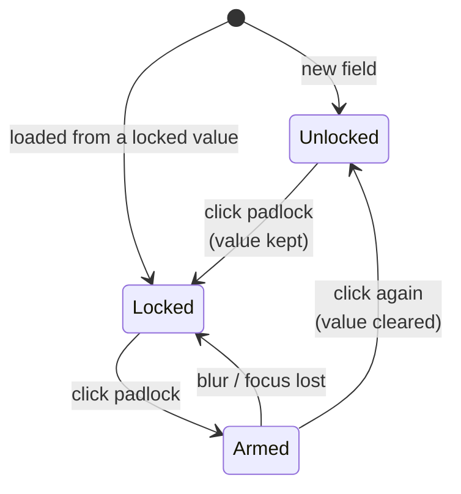
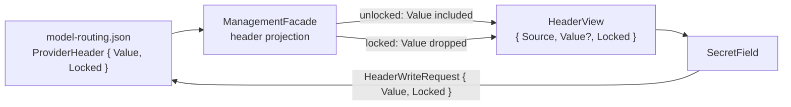

# Secret Field

> **Status: Implemented.** `SecretField.razor` is a text input with a padlock toggle inside its right
> edge. Unlocked (the default) it is an ordinary readable text box; locked it masks to dots and the
> router stops returning its value to the GUI at all. Currently used by the **Custom Headers** value
> boxes in `ProviderEditDialog`.

## Why it exists

A provider's custom headers are a mixed bag. `anthropic-version: 2023-06-01`, `X-Title`, and
`HTTP-Referer` are plain configuration the operator wants to see and edit; an occasional
`X-Subscription-Key` is a credential. Treating the whole section as write-only (blank boxes, dots,
"blank keeps it") made the common case unreadable to protect the rare one, and treating it as plain
text would put credentials on screen and over the wire.

The secret field pushes that decision down to the individual field, where the operator — the only one
who knows which is which — can make it. Two properties make it worth the extra control:

1. **Locking is a storage decision, not a display one.** A locked value is not merely hidden behind a
   masked input; ArcRouter never sends it to the GUI. Nothing in the GUI process holds it, so nothing
   there can leak it.
2. **Unlocking is therefore destructive.** A value that was never returned cannot be shown, so the only
   honest way to leave the locked state is to clear the value and start again. The field says so before
   the click, not after.

## States

| Aspect | Unlocked (default) | Locked |
| --- | --- | --- |
| Input type | `text` | `password` |
| Padlock | open (`unlock` glyph), muted grey | closed (`lock` glyph), warning amber |
| Value returned by the router | yes | **never** |
| Blank value on save means | the value is empty — clear what is stored | keep whatever is stored |
| Clicking the padlock | locks in one click; the value is kept | arms a confirmation; a second click clears the value and unlocks |

Locking is one click because nothing is lost. Unlocking takes two because something is: the first click
turns the padlock critical-red and swaps the tooltip to the warning; a second click clears the box and
opens the padlock. Moving focus away from the padlock disarms it, so a half-armed toggle cannot be
completed by a much later, unrelated click.

### Tooltips

The padlock uses the shared floating tooltip (`data-tip` + `aria-describedby="ls-tooltip"`, see
`wwwroot/js/tooltips.js`) rather than a native `title`, so it is not clipped by the modal's scroll
container and is reachable by keyboard. `aria-label` carries the short accessible name ("Lock this
value" / "Unlock this value"); the tooltip is the description:

| State | Text |
| --- | --- |
| Unlocked | *Lock this value. A locked value is shown as dots and is never sent back to this screen.* |
| Locked | *Locked - this value cannot be read. Unlocking it will clear the value entirely.* |
| Armed | *Click again to clear this value and unlock it.* |

## Component API

`src/TotallyHotArcRouter.Gui/Components/SecretField.razor`

| Parameter | Purpose |
| --- | --- |
| `Value` / `ValueChanged` | The text. `ValueChanged` also fires with `""` when unlocking clears it. |
| `Locked` / `LockedChanged` | The lock state. **The component never owns this** — it reports the toggle and re-renders from what the parent gives back, so the state can live in the form data. |
| `Placeholder` | Greyed hint. Callers typically pass `•••••••• (saved, blank keeps it)` for a locked field with a stored value. |
| `Class` | Extra classes on the wrapper (e.g. `flex-1 min-w-0` from the surrounding row). |
| `TestId` | The input's `data-testid`; the padlock gets the same value suffixed `-lock`. |
| `Disabled` | Makes both the input and the padlock non-interactive. |

Styling lives in `app.css` as `.ds-secret-field`, `.ds-secret-input`, and `.ds-secret-toggle*` rather
than Tailwind utilities: the compiled blob carries no `right-*`, `pr-7`, or inset-positioning classes
(see [`DESIGN.md`](DESIGN.md) §5.1).

## Wire contract

Lock state is **form data**. It travels with the value through every layer and is persisted next to it,
so the GUI is never the authority on what is secret — it only reflects and edits what the router stores.

The projection in `ManagementFacade.BuildProvidersResponse` is the **single place** a stored literal
header value can leave the application. Every read surface — the REST `/admin/providers` API and the MCP
`list_providers` tool — goes through it, so "a locked value is never sent to the GUI" is enforced once
rather than per caller.

On the write side, `HeaderWriteRequest.Locked` is a `bool?` and qualifies the blank rule:

| `Locked` | Blank value means |
| --- | --- |
| `true` | Preserve the stored value — the caller was never shown it, so it could not resend it. |
| `false` | Clear it — the caller could see the field in full and left it empty. This is how the editor's unlock reaches storage. |
| `null` | Legacy: preserve, and store any literal as locked. For callers that predate the flag. |

`ProviderHeader.Locked` likewise defaults to **`true`** when absent from JSON. A header persisted before
this flag existed has unknown provenance, so it stays hidden rather than becoming visible on upgrade —
the operator must unlock it (and thus retype it) to make it readable. Values known to be public say
`"Locked": false` explicitly: the `anthropic-version` seed in `appsettings.json`, and the default
headers merged in by the editor's provider templates.

An **env-var-backed** header never shows a padlock and always stores unlocked. It holds only a variable
*name*; the secret itself lives in the environment, outside the configuration file, so there is nothing
for the lock to withhold. Switching a header's source to `Env var` drops its lock.

## Use in the Edit Provider dialog

The **Custom Headers** section's value box is a secret field, defaulting to unlocked so a provider can
carry a mix of public and private header data. See
[`provider-management.md`](provider-management.md#custom-headers).

The credential rows in the **Credentials** fieldset are *not* secret fields: a stored API key is
unconditionally write-only and has no readable state to offer. Credential rows past the first are stored
as custom headers, and the dialog always writes them locked.

## Adding a secret field elsewhere

1. Hold the value and its lock state together in whatever model backs the form; do not keep the lock in
   component state.
2. Only render the padlock where a *stored literal* exists to protect — not for references, names, or
   values that live outside the configuration.
3. Make sure the read path drops the value at a single chokepoint on the server. A field that masks in
   the browser but still ships the value has none of the property this component exists for.
