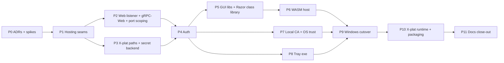

# Web GUI Migration Plan

> **Status: CLOSED 2026-09-15.** All eleven phases (P1-P11) shipped, ADRs 0011-0014 are Accepted, and
> ADR-0007 is Superseded by ADR-0011. Spikes S1-S7 run, see [Spike results](#p0-spike-results). Retired
> the Windows-only MAUI Blazor Hybrid GUI (`src/TotallyHotArcRouter.Gui`, WebView2, deleted in P9) in
> favor of a Blazor WebAssembly dashboard served by the router itself, cross-platform, with a small
> Windows-only tray exe as the only remaining platform-specific component.
> **This plan is closed per its own end condition** (P11's docs sweep shipped). Findings after this point
> start a new document rather than extending this one.

**Builds on:** ADR-0007 (superseded by ADR-0011 in this plan), the existing gRPC admin surface
(`GrpcAdminClientBase`, `IAdminServiceModule`), and `TelemetryTlsCertificate`'s self-signed-cert
generation, which becomes the local-CA leaf issuer.
**Does not touch:** the proxy request-routing hot path (`ProxyMiddleware.InvokeAsync`) beyond the
listener/TLS changes called out per phase; `ManagementFacade`'s public method set stays frozen per
AGENTS.md.

## Context

The dashboard today is `src/TotallyHotArcRouter.Gui`, a Windows-only .NET MAUI Blazor Hybrid app (`net10.0-windows`, `UseMaui`, `BlazorWebView`/WebView2) that lives in the system tray and talks gRPC to the router on `https://localhost:5002`. That makes the whole product Windows-bound. It also carries WebView2-specific failure modes: blank dashboards, user-data-folder hacks, `SetWebViewVisible` workarounds. Its tests can't run on Linux CI either; the `windows-gui-build-and-test` job is disabled.

**Goal:** the router (`src/TotallyHotArcRouter`, already `Microsoft.NET.Sdk.Web`) serves the existing Razor dashboard to any browser on a port configured in `appsettings.json`. The router and the GUI become cross-platform. The only Windows-specific piece left is a small system-tray app.

**Deliverable of executing this plan:** a checked-in plan doc (`docs/gui/web-gui-migration-plan.md`, same structure as `docs/router/counterfactual-token-estimation-plan.md`), ADRs 0011–0014, and then phases P1–P11 below.

**Tooling note:** CodeGraph was used for structural discovery (ProxyServer / McpServer / TrayWindowManager / MauiProgram call paths). **Serena was skipped:** the MCP connection timed out. Per ADR-0008's fallback, classification was done CodeGraph-only. This is feature work, not a smell survey, so nothing is filed to the refactoring plan.

## Settled decisions (from clarifying Q&A)

| # | Decision |
|---|---|
| D1 | **Blazor WebAssembly** (not Server). Browser → router over **gRPC-Web** on the same origin as the static files (no CORS). Existing generated gRPC clients reused via `GrpcWebHandler`. |
| D2 | New **`WebInterface`** section in router appsettings: `Port` (default **5004**) and `BindAddress` (default loopback). **HTTPS only**, with no plain-HTTP switch. Proxy (5001) and MCP (5003) also get bind-address settings so Docker can work. |
| D3 | **Retire port 5002.** All gRPC services move to the web port (HTTP/1.1 + HTTP/2, TLS). **Delete REST `/admin/*` and `/admin/usage/*`** (`ProviderAdminEndpoints`, `UsageAdminEndpoints`). CodeGraph shows no production callers: the GUI uses gRPC and MCP calls `ManagementFacade` in-process. 5001 keeps only the LLM proxy. 5003 keeps MCP. |
| D4 | Auth = **loopback session cookie**. The router issues an HttpOnly, Secure, SameSite=Strict `__Host-` cookie when Host is localhost/127.0.0.1/[::1], Origin matches (or is absent for native clients), and the remote IP is loopback. Non-loopback clients (Docker) get a token login page. The tray uses the same mechanism. |
| D5 | **Delete `management-token.txt`.** The token moves into the encrypted secret store. The existing file is imported once, so MCP client configs keep working. System Settings gets **Copy MCP token / Regenerate**. CLI `--print-management-token` for headless and Docker. |
| D6 | **HTTPS everywhere the router listens**, using a router-generated, name-constrained local CA (permitted: localhost, 127.0.0.1, ::1). Installers add it to the OS trust store. |
| D6a | **LLM proxy 5001 is HTTPS by default.** An **opt-in plain-HTTP listener** exists for tools that refuse custom CAs: `Proxy:PlainHttp:Enabled=false` by default, its own `Port` (default 5005), always loopback-bound. It serves **LLM proxy routes only**, never gRPC, GUI, auth or MCP. The router logs a Warning at startup when it is enabled. |
| D6b | **Upstream `http://` provider base URLs: warn, don't block.** Non-loopback `http://` upstreams are allowed, but the router logs a Warning (static template) at startup and on save, and Governance → Providers shows an "unencrypted" badge. Loopback `http://` (local Ollama :11434, LM Studio :1234) is silent, because those servers only speak HTTP. |
| D7 | **Tray = small separate exe** (WinForms `NotifyIcon`, `net10.0-windows`): Show Dashboard opens the default browser, Enable/Disable Routing, service-state balloon, **Install update** (the MSI apply moves here). |
| D8 | Router cross-platform scope: runs correctly on Linux/macOS, cross-platform secret storage, **machine-wide** services (systemd system unit with a dedicated user; macOS LaunchDaemon), packages **linux-x64, linux-arm64, osx-arm64 tarballs plus a Docker image on GHCR**, GUI tests on Linux CI. |
| D9 | WASM logging: Serilog in the browser (configured from `wwwroot/appsettings.json`) writes to the browser console. Warning+ events are forwarded over gRPC-Web into the router's Serilog. |
| D10 | **One release, clean swap.** Phases merge to main individually (always compiling and green), but nothing is tagged until P10. |
| D11 | Web GUI update panel: status and check only. On Windows it points to the tray's Install update; elsewhere it links to the release. |

**Refinements from design review, adopted:**
- The tray and scripts find the URL through a **discovery file** the router writes at startup (effective URL plus CA thumbprint), not by parsing `appsettings.json`. Env overrides and MSI upgrades make that file unreliable.
- An **operator config overlay** in the data directory survives MSI upgrades. MajorUpgrade re-lays `Program Files\...\appsettings.json`, so a changed port would otherwise be lost.
- A **local CA rather than a trusted leaf**, so leaf renewal needs no re-trust.

## Plain-HTTP inventory (end state)

| Surface | Today | End state |
|---|---|---|
| Web GUI + gRPC-Web + native gRPC (5004) | — | HTTPS only |
| Native gRPC (5002) | HTTPS | Removed |
| MCP (5003) | HTTPS | HTTPS, same trusted leaf |
| REST `/admin/*` (5001) | HTTP | **Deleted** |
| LLM proxy `/v1/*`, `/api/*` (5001) | HTTP | HTTPS |
| Opt-in legacy-tool listener (5005) | — | Plain HTTP, **off by default**, loopback-only, LLM routes only |
| Router → cloud providers, GitHub, model downloads | HTTPS | HTTPS |
| Router → local Ollama/LM Studio | HTTP (loopback) | Unchanged; those servers can't do TLS |
| Router → remote `http://` upstream | Allowed silently | Allowed, with Warning log and GUI badge |

"HTTP" as a *protocol* stays: gRPC runs over HTTP/2, and gRPC-Web runs over HTTP/1.1 or HTTP/2. Everything above is about removing *unencrypted* HTTP.

## Ground rules (every phase)

- Zero warnings/errors (`TreatWarningsAsErrors`), accurate XML docs, Serilog static templates, ≥80% coverage per assembly, unit tests ≤5 s, Mermaid-only diagrams.
- xUnit v3: run the **built test executables**, not `dotnet test`; use `dotnet-coverage` for coverage.
- Before touching `ProxyServer`, `ProxyMiddleware`, `ManagementFacade` or `RequestInterceptor`: re-run `codegraph_explore` and list production callers. Never change `ManagementFacade`'s public method set. Any `ProxyServer.Configure` change runs the golden-path proxy smoke.
- New security-boundary, transport or public-surface changes need their ADR accepted first.
- Each phase updates the docs it invalidates. Record deviations in the plan doc's "Deviations" section.

## Phase map

---

## P0 — Decisions and spikes

**Deliverables**
- `docs/gui/web-gui-migration-plan.md` (status banner with end condition: "closed when P11 ships").
- ADRs (use the `adr-writer` skill; `docs/adr/adr-template.md`):
  - **0011** — WASM GUI served by the router on a configurable web port. Covers gRPC-Web, retiring 5002, deleting REST `/admin`, port scoping, HTTPS-default proxy with the opt-in plain-HTTP listener, and the upstream-`http://` warning policy. Supersedes **0007**, which is already stale: `ProviderAdminClient` is on gRPC.
  - **0012** — Loopback session auth, token login, token moved to the secret store, and Copy/Regenerate. This is an explicit carve-out from secrets-at-rest §4, "the management surface is write-only". Threat model: the boundary stays "any local account", the same as today's Users-readable token file. It must name loopback tunnels (ngrok, `tailscale serve`, VS Code port forwarding, WSL mirrored networking) and add `WebInterface:TrustLoopback=false` for them.
  - **0013** — Name-constrained local CA and OS trust.
  - **0014** — Cross-platform service layout: data dirs, dedicated service user, DPAPI vs ASP.NET Data Protection, stated honestly (off Windows, protection comes down to file permissions).
- Spikes, with pass/fail recorded in the plan doc:
  - **S1 Native runtime identifiers (RIDs).** Self-contained publish plus smoke on linux-x64, linux-arm64 (`ubuntu-24.04-arm`) and osx-arm64 runners, and inside the candidate Docker base image. Exercise OnnxRuntime (BGE embedding), OnnxRuntimeGenAI (one generated token), SQLitePCLRaw 3.0.5, FastBertTokenizer and ML.Tokenizers. If a native library is missing, the voter must abstain cleanly.
  - **S2 Static web assets through the inner host.** Router references the WASM project. Check for CS0433 duplicates of the `*.Contract` proto types (try `ReferenceOutputAssembly=false`), Development serving, publish-layout `MapStaticAssets`, and a real Windows service with cwd = System32.
  - **S3 gRPC-Web streaming.** `StreamEvents` plus one long server stream in Chrome, Edge, Firefox and Safari. Messages must arrive incrementally. Tab close must cancel the server call, and the broadcaster's subscriber count must return to 0. Also confirm browsers negotiate HTTP/2 via ALPN on the TLS web port (so the HTTP/1.1 six-connection limit doesn't apply), including on macOS Kestrel, and cover sleep/resume.
  - **S4 WASM trimming.** `dotnet publish -c Release` with Grpc.Net.Client.Web, Google.Protobuf and Serilog (Settings.Configuration + BrowserConsole) under TreatWarningsAsErrors. List every IL2xxx warning and a containment strategy (root assemblies, not global suppression).
  - **S5 Trust matrix.** Windows LocalMachine\Root (Edge, Chrome, Firefox enterprise roots); Ubuntu `update-ca-certificates` (Chrome NSS, Firefox deb/snap policies); Fedora `trust anchor`; macOS System keychain (Safari, Chrome, Firefox). Name constraints must be honored everywhere.
  - **S6 Cookies.** `__Host-`/Secure/SameSite=Strict behavior on `https://localhost:5004` across browsers.
  - **S7 LLM-client CA trust.** For each client the docs name (Claude Code/Node via `NODE_EXTRA_CA_CERTS` and `--use-system-ca`; OpenAI/Anthropic Python SDKs via `SSL_CERT_FILE`/`REQUESTS_CA_BUNDLE`; curl; .NET; Rust/Go CLIs), verify an HTTPS `/v1/chat/completions` works against a local-CA leaf. Also verify Ollama-API clients accept an `https://` base URL. Clients that can't are the documented users of the opt-in plain-HTTP listener.

**Exit:** ADRs Proposed, spike results recorded, the owner accepts ADRs 0011–0014.

### P0 spike results

Run 2026-09-14. Serena MCP failed to connect (`CONNECT_TIMEOUT`, same as the earlier research pass) —
findings below are CodeGraph-plus-direct-verification only, per ADR-0008's fallback. Two spikes (S2,
S4) were actually **executed** on this machine with real toolchains; the rest need infrastructure this
session doesn't have (other OS/arch runners, multiple real browsers, a live server) and are marked
**research** — evidence-based, but not measured. Do not read a "research" result as equivalent to a
"executed" one; re-verify research items against the real toolchain before relying on them past P0.

| Spike | Result | Method |
|---|---|---|
| S1 Native RIDs | **Research — pass** | NuGet cache inspection |
| S2 Duplicate proto types | **Executed — confirmed risk, mitigation verified** | Scratch build |
| S3 gRPC-Web streaming | **Deferred to P2/P6** | n/a — no server exists yet |
| S4 WASM trimming | **Executed — pass** | Real publish, wasm-tools workload |
| S5 OS/browser trust matrix | **Research — partial pass, 2 real gaps found** | Package inspection + search |
| S6 Cookies on localhost | **Research — pass (well-established browser behavior)** | Not executed |
| S7 LLM-client CA trust | **Deferred to P7** | n/a — no CA exists yet |

**S1 — Native RIDs.** Inspected the actual `.nupkg` contents restored in this repo's NuGet cache rather
than publishing on real arm64 hardware (not available here). `Microsoft.ML.OnnxRuntime` 1.30.0 and
`Microsoft.ML.OnnxRuntimeGenAI` 0.16.0 both ship `runtimes/{linux-arm64,linux-x64,osx-arm64,win-x64,win-arm64}`
native assets. `SQLitePCLRaw.bundle_e_sqlite3` 3.0.5 pulls in `SQLitePCLRaw.lib.e_sqlite3` 2.1.12, which
ships `linux-arm64`, `linux-musl-arm64`, and `osx-arm64` (plus many more) native assets — the "musl"
variant matters if the chosen Docker base is Alpine rather than Debian/Ubuntu; pin the base image
accordingly. `FastBertTokenizer` and `Microsoft.ML.Tokenizers` are pure-managed (no `runtimes/` folder
at all), so they carry no RID risk. **Verdict: no missing-native-asset blocker found**, but this is
package-metadata evidence only — S1 must be re-run as an actual self-contained publish-and-smoke on
real `ubuntu-24.04-arm`/`macos-14` runners (and inside the chosen Docker base) before P10 ships, per the
plan's original spike definition.

**S2 — Duplicate proto types (executed).** Reproduced the exact CS0433 collision the design review
flagged: built a scratch project referencing both `TotallyHotArcRouter.csproj` (compiles
`telemetry.proto` with `GrpcServices="Server"`) and `TotallyHotArcRouter.Gui.Telemetry.csproj`
(compiles the same file with `GrpcServices="Client"`) — both emit
`TotallyHot.ArcRouter.Telemetry.Contract.TelemetryEvent` into the same namespace in two different
assemblies. Any unqualified use of that type name failed with
`error CS0433: The type 'TelemetryEvent' exists in both 'TotallyHotArcRouter.Gui.Telemetry, ...' and
'TotallyHotArcRouter, ...'`. Since the router's own gRPC service implementations already use these
Contract types unqualified throughout, this would be a build-breaking, repo-wide collision the moment
the router transitively references the client-codegen assembly (router → `Gui.Web` → `Gui.Telemetry`/`Gui.Admin`).
**Confirmed mitigation:** adding `ReferenceOutputAssembly="false"` to the `Gui.Web` project reference
eliminates the collision — the referenced assembly no longer flows into the router's compilation
closure, while the reference still orders the build so `Gui.Web`'s publish output exists before the
router needs to serve it. This is the standard ASP.NET "Hosted Blazor WebAssembly" pattern, now
validated against this repo's actual generated types rather than assumed. **P6's router-references-Gui.Web
step must use `ReferenceOutputAssembly="false"`**, or reference the published output directory directly
instead of a live `ProjectReference`, if `ReferenceOutputAssembly="false"` turns out to interfere with
the static-web-assets manifest flow (not yet tested — that's still open work for P6, not fully closed by
this spike).

**S3 — gRPC-Web streaming.** Deferred: exercising this for real requires a running gRPC-Web server and
several real browsers, which means standing up P1/P2's listener first. Not attempted as a pre-code
spike; folded into P2's exit criteria (already specified) instead of being treated as separate P0 work.

**S4 — WASM trimming (executed).** Scaffolded a `Microsoft.NET.Sdk.BlazorWebAssembly` project (net10.0)
with `Grpc.Net.Client`, `Grpc.Net.Client.Web`, `Google.Protobuf`, `Serilog`, `Serilog.Settings.Configuration`,
and `Serilog.Sinks.BrowserConsole` (confirmed this package exists on NuGet — 8.0.0, resolves cleanly for
net10.0), `TreatWarningsAsErrors=true`. `Program.cs` exercised: `LoggerConfiguration.ReadFrom.Configuration`
+ `WriteTo.BrowserConsole()`, a real generated protobuf message round-trip (`Google.Protobuf.WellKnownTypes.Timestamp.ToByteArray()`/`Parser.ParseFrom`),
and `GrpcChannel.ForAddress(..., new GrpcChannelOptions { HttpHandler = new GrpcWebHandler(new HttpClientHandler()) })`.
First publish attempt ran without the `wasm-tools` workload installed and produced **no trim analysis at
all** (`dotnet publish` printed "we strongly recommend using `wasm-tools` workload" and skipped full IL
linking) — a false-negative trap worth calling out explicitly, since a CI runner without that workload
would silently report zero warnings without actually having checked. Installed `wasm-tools`
(`dotnet workload install wasm-tools`) on this machine, republished with the real Emscripten/AOT
toolchain and the IL linker — **zero `IL2xxx` warnings** across all listed dependencies.
**Verdict: pass**, with the caveat that CI must have `wasm-tools` installed (`dotnet workload restore`
or an explicit `dotnet workload install wasm-tools` step) or this exact false-negative will recur; add
an explicit assertion to P6's CI step that trim analysis actually ran (e.g. grep the build log for
"Optimizing assemblies" appearing after the linker step, not the pre-workload short-circuit message).

**S5 — OS/browser trust matrix (research).** Two concrete gaps confirmed via search, refining the
"documented per-user fallback" risk into specific, actionable steps rather than a vague caveat:
- **Firefox's `ImportEnterpriseRoots` policy — Windows and macOS only, not Linux** (tracked upstream as
  Bugzilla 1600509). `update-ca-certificates` trusting the CA machine-wide does **not** make Firefox on
  Linux trust it. The documented workaround is `p11-kit-trust.so` via Firefox's `SecurityDevices`
  policy, or per-profile `certutil -A` into Firefox's own NSS profile database. This must be a scripted
  step in `packaging/linux/install.sh` (P10) and named explicitly in `docs/router/client-tls-setup.md`
  (P7), not left as "should work."
- **Chrome/Chromium on Linux uses its own NSS Shared DB** (`$HOME/.pki/nssdb`), not the system
  `/etc/ssl/certs` store `update-ca-certificates` maintains. Trusting the CA system-wide does not
  automatically trust it for Chrome either; it needs `certutil -d sql:$HOME/.pki/nssdb -A -t "C,," -n
  <name> -i <ca.pem>` per user profile. Same action item as Firefox: script it, document it.
- Windows `LocalMachine\Root` and macOS System keychain trust (Edge/Chrome/Safari on those platforms)
  were not independently re-verified here; existing knowledge treats both as reliably honored by every
  browser on those platforms via the OS trust store, with no known per-browser carve-out comparable to
  the two Linux gaps above.
- Name-constraint (`pathLen:0`, restricted to `localhost`/`127.0.0.1`/`::1`) enforcement by these trust
  stores was not independently re-verified; this remains open for P7's actual CA implementation and its
  unit tests, not closed by this research pass.

**S6 — Cookies on `https://localhost` (research).** Not executed against a live server. Relying on
well-established, stable browser platform behavior: `localhost` (and its loopback IPs) is treated as a
[secure context](https://w3c.github.io/webappsec-secure-contexts/#is-origin-trustworthy) by Chrome,
Firefox, and Safari regardless of scheme, and a `Secure` cookie is accepted over both `http://localhost`
and `https://localhost` in all three. `__Host-` prefix cookies require `Secure`, `Path=/`, and no
`Domain` attribute — all satisfiable by the design in ADR-0012. This is treated as a low-risk item; S6
should still get a real cross-browser check during P4's implementation (it's cheap once the auth
endpoint exists) rather than resting solely on this research pass for anything security-critical.

**S7 — LLM-client CA trust (deferred to P7).** No CA exists yet to test against — this is inherently
gated on P7's CA implementation. Retained in P7's deliverables list as originally planned; not
attempted here. `client-tls-setup.md`'s content depends on P7's actual CLI flags (`--export-ca`), so
drafting it now would likely go stale before it's used.

## P1 — Router hosting seams (no user-visible change)

**Deliverables**
- `WebInterfaceOptions` (Port 5004, BindAddress, AllowedHosts, TrustLoopback). `ProxyListenerOptions` (Port 5001, BindAddress, `PlainHttp { Enabled=false, Port=5005 }`). MCP bind address. Options validation, including that the plain-HTTP port can't collide with any TLS port and can't be bound to a non-loopback address.
- Replace `ProxyServer`'s positional `port`/`grpcPort` constructor ints with a listener-options object. Update `ProxyHostedService`, `ProxyServiceCollectionExtensions.AddProxyHost`, and the test helpers (`ProxyServerTests`, `ProviderAdminEndpointsTests`, `UsageAdminEndpointsTests`, `ProxyHostedServiceTests`).
- Inner hosts (`ProxyServer`, `McpServer`) get `UseContentRoot(AppContext.BaseDirectory)` and an explicit ApplicationName. Otherwise a Windows service resolves web root from System32. They also get the outer `ILoggerFactory` via `ProxyServerDependencies`, so inner-host logs reach Serilog.
- Optional operator overlay `appsettings.local.json` in the data dir. `WebInterfaceDiscoveryFile` writer (effective URL, CA thumbprint), machine-readable.

**Key files:** `Proxy/ProxyServer.cs`, `Hosting/ProxyHostedService.cs`, `Proxy/ProxyServiceCollectionExtensions.cs`, `Proxy/ProxyServerDependencies.cs`, `Mcp/McpServer.cs`, `Mcp/McpOptions.cs`, `Program.cs`.

**Exit:** all suites green. A test proves web root is independent of cwd. Golden-path smoke passes.

### P1 status: shipped 2026-09-14

Implemented as designed, with one deliberate scope trim (see Deviations). New/changed files:
`Proxy/ProxyListenerOptions.cs`, `Proxy/WebInterfaceOptions.cs`, `Proxy/ProxyListenerOptionsValidator.cs`,
`Proxy/WebInterfaceDiscoveryFile.cs`, `Hosting/KestrelBindAddress.cs`, plus edits to `ProxyServer.cs`,
`ProxyServerDependencies.cs`, `ProxyServiceCollectionExtensions.cs`, `Hosting/ProxyHostedService.cs`,
`Mcp/McpServer.cs`, `Mcp/McpHostedService.cs`, `Mcp/McpOptions.cs`, `Program.cs`, and the four listener
tests the plan named plus three new test files
(`ProxyListenerOptionsValidatorTests`, `WebInterfaceDiscoveryFileTests`, `KestrelBindAddressTests`).

**Deviations from the plan as written:**
- **`WebInterfaceDiscoveryFile` is built and tested but not yet called from `ProxyServer`/`Program`.**
  It has nothing true to write until Phase P2 gives the web port a real address and Phase P7 gives it a
  real CA thumbprint - writing placeholder/null fields now would be a file a consumer could mistake for
  live data. The writer/reader and their tests exist so P2 only has to add one call site.
- **Serilog forwarding is `ProxyServerDependencies.SerilogLogger` (a `Serilog.ILogger`, not an
  `ILoggerFactory`).** `ILoggerFactory` has no supported way to "adopt" another host's already-built
  provider set short of writing a forwarding `ILoggerProvider` by hand; passing the same `Serilog.ILogger`
  both inner hosts already reach for elsewhere in the codebase (`Log.Logger`) into a
  `SerilogLoggerProvider` accomplishes the plan's actual goal - inner-host logs reach the same Serilog
  sinks - with less new code, and is still handed across explicitly at the DI boundary rather than
  reached for as an ambient static inside `ProxyServer`/`McpServer` themselves.
- **`GrpcPort` (not just `Port`) moved into `ProxyListenerOptions`**, since the plan's own instruction
  ("replace the positional `port`/`grpcPort` constructor ints with a listener-options object") requires
  somewhere for both to live; it keeps its own `BindAddress` fixed to loopback rather than gaining one,
  since it is being retired in P9 rather than extended.

**Verified:**
- Full router test suite: 2800 tests (2800 pass; the 1 pre-existing `[Skip]` is unrelated -
  `Integration testing disabled`), 0 failures, 0 errors, `-parallelMode collections`.
- `dotnet build src/TotallyHotArcRouter.slnx -c Release`: 0 warnings, 0 errors (includes the MAUI GUI,
  unaffected).
- Cobertura coverage: `TotallyHotArcRouter` assembly 83.4% (≥80% gate); every new file individually
  ≥89% except `KestrelBindAddress.cs` at 73.5% (the fixed-port "any"/literal-IP branches are exercised
  directly by `KestrelBindAddressTests`, which call `KestrelServerOptions.Listen`/etc. without a live
  socket bind, rather than through a full `ProxyServer` integration test for every mode).
- **Manual golden-path smoke** (the built `TotallyHotArcRouter.exe`, real `appsettings.json`, no mocks):
  started clean, bound 5001/5002/5003 dual-stack (IPv4 loopback + IPv6 `[::1]`) exactly as before,
  `curl http://127.0.0.1:5001/v1/models` → `200`, proxy middleware logged the request, MCP reported
  `https://localhost:5003`, clean shutdown. Not exercised: a real upstream LLM call (needs a live
  provider key) and streaming - deferred to a phase that actually changes proxy request handling; P1
  changes hosting/listener plumbing only.

## P2 — Web listener, gRPC-Web, port scoping (5002 still live, token auth only)

**Deliverables**
- Web-port Kestrel listener: Http1AndHttp2, TLS with the current `TelemetryTlsCertificate` for now.
- `UseGrpcWeb()` + `EnableGrpcWeb()`.
- **Delete REST `/admin`:** `Proxy/Management/ProviderAdminEndpoints.cs`, `UsageAdminEndpoints.cs`, their `ProxyServer.Configure` mapping, and `ProviderAdminEndpointsTests`/`UsageAdminEndpointsTests`. First move any assertion that isn't already covered to `ProviderAdminGrpcServiceTests`/`UsageAdminGrpcServiceTests`, so `ManagementFacade` coverage doesn't drop. `ManagementFacade`'s public method set is unchanged.
- **Port scoping by `HttpContext.Connection.LocalPort`, not `RequireHost`**, which matches the Host header and can be spoofed:
  - gRPC and GUI endpoints only on the web port (plus native gRPC on 5002 until P9).
  - The proxy terminal `app.Run(proxyMiddleware…)` only on the proxy port(s): 5001, plus 5005 when enabled.
  - This must land together with gRPC-Web, or gRPC-Web becomes reachable over cleartext on 5001.
- The opt-in plain-HTTP proxy listener (off by default) with its startup Warning. 5001 itself stays plain HTTP until P7 switches it to TLS, so tools keep working throughout.
- Web-port security headers: CSP `script-src 'self' 'wasm-unsafe-eval'; frame-ancestors 'none'`, nosniff, no-cache on index.html. HTTP/2 keep-alive pings so dead browser streams get reaped.

**Exit (integration tests on ephemeral ports):**
- gRPC-Web unary call plus ≥2 `StreamEvents` messages on the web port.
- gRPC-Web to 5001 or 5005 does not reach a service.
- `/admin/providers` returns 404 on every port.
- `/v1/chat/completions` on the web port returns 404.
- The opt-in listener, when enabled, serves `/v1/models` and 404s everything else.
- Native gRPC on 5002 is unchanged.
- Golden-path smoke passes.

### P2 status: shipped 2026-09-14

Implemented as designed, with two implementation choices that deviate from the literal plan wording (both explained below) and one pre-existing gap fixed as a side effect. New/changed files:
`Proxy/ProxyServerWebInterfaceTests.cs` (new), `ProviderAdminGrpcServiceTests.cs`/`UsageAdminGrpcServiceTests.cs`
(extended), `ProxyServer.cs`, `ProxyServerDependencies.cs`, `ProxyServiceCollectionExtensions.cs`,
`ProxyHostedService.cs`, `ManagementFacade.cs`/`ProviderAdminGrpcService.cs`/`UsageAdminGrpcService.cs`
(doc-comment fixes only), `TelemetryAuthInterceptor.cs` (doc-comment fix), `TotallyHotArcRouter.csproj`
(+`Grpc.AspNetCore.Web`), `TotallyHotArcRouter.Tests.csproj` (+`Grpc.Net.Client`/`Grpc.Net.Client.Web`).
**Deleted:** `Proxy/Management/ProviderAdminEndpoints.cs`, `UsageAdminEndpoints.cs`,
`ProviderAdminEndpointsTests.cs`, `UsageAdminEndpointsTests.cs`.

**Deviations from the plan as written:**
- **Port scoping uses a per-connection feature marker set by Kestrel listener middleware
  (`ListenOptions.Use`), not a `HttpContext.Connection.LocalPort` integer comparison.** The plan named
  `LocalPort` explicitly, but a raw port comparison needs the *actual* bound port resolved after Kestrel
  starts (several ports bind ephemeral `0` in tests, and the DI-bound production ports could too if an
  operator ever set one to `0`). Tagging each listener directly - a `ProxyPortMarker` set once per
  accepted connection, read via `HttpContext.Features.Get<ProxyPortMarker>()` (which falls back to the
  underlying connection's own feature collection, a documented ASP.NET Core pattern) - achieves the exact
  same security property the plan wanted (scope by which physical listener accepted the connection, immune
  to a spoofed `Host` header) with no ephemeral-port bookkeeping at all. Verified directly: the ephemeral
  fixed-port integration tests in `ProxyServerWebInterfaceTests.cs` and the real golden-path smoke below
  both confirm gRPC is unreachable on the proxy ports and proxy traffic is unreachable (404) on the web
  port.
- **`AddGrpcWeb()` (the exit criterion's own wording for the service-registration half) doesn't exist as a
  separate call.** `Grpc.AspNetCore.Web` needs no DI registration beyond referencing the package -
  `app.UseGrpcWeb(new GrpcWebOptions { DefaultEnabled = true })` is the whole integration, applied once
  rather than per-service (`.EnableGrpcWeb()` on each of the ~12 `MapGrpcService` calls would have been
  pure repetition for the same effect).

**Side effect - a pre-existing gap fixed:** `TelemetryGrpcService` (mapped unconditionally, like
`RoutingModeAdminGrpcService`) needs `ITranscriptStore`/`IOptions<TranscriptOptions>` in the inner
container to be constructible at all, but unlike every other unconditionally-mapped service (`RoutingGateStore`,
`UpdateStateStore`, `NullRegretHarnessRunner`, `NullJudgeCalibrationAnalyzer`), `ProxyServer` had no
fallback registration for them - production is unaffected only because `AddProxyHost` always supplies a
full `ClusterModelAdmin` group, which happens to carry both. This was invisible until now because no
prior test ever called `StreamEvents` against a live, minimally-constructed `ProxyServer` (the
established `TestServerCallContext` pattern in `TelemetryGrpcServiceTests` bypasses the host entirely).
Worked around locally in the new test's `ProxyServerDependencies` (loose Moq stubs) rather than changed
in `ProxyServer.cs` itself - a real fallback (mirroring the `RoutingGateStore`-style null object pattern)
is a legitimate small hardening item, but it's `TelemetryGrpcService`'s own design question, unrelated to
port scoping, and out of this phase's scope; flagged here for a future pass rather than filed to the
code-smell tracker (no observed production cost - `AddProxyHost` always supplies the dependency, so
ADR-0008's stop rule applies).

**Verified:**
- Full router test suite: 2783/2783 pass, 0 failures, 0 errors, `-parallelMode collections` (1
  pre-existing unrelated skip). New/extended: 7 real-network tests in `ProxyServerWebInterfaceTests.cs`
  (gRPC-Web unary + ≥2-message streaming on the web port over a real `Grpc.Net.Client.Web` channel;
  proxy-port and plain-HTTP-listener gRPC-Web calls proven not to reach a service; REST/proxy 404s on the
  web port; native gRPC on 5002 unchanged), plus 5 new `ProviderAdminGrpcServiceTests`/1 new
  `UsageAdminGrpcServiceTests` covering the RPC wire-mapping methods (`UpsertProvider`, `UpsertModel`,
  `RemoveModel`, `SetModelEnabled`, `ScanCapabilities`, `RefreshFromEndpoint`, `GetRoutingRoi`) that were
  previously exercised only indirectly through the now-deleted REST tests.
- `dotnet build src/TotallyHotArcRouter.slnx -c Release`: 0 warnings, 0 errors.
- Cobertura coverage: `TotallyHotArcRouter` assembly 83.1% (≥80% gate, unchanged from P1's 83.4% despite
  deleting ~24 REST tests, because the new gRPC-level tests replaced their coverage almost exactly).
  `KestrelBindAddress.cs` rose from P1's 73.5% to 94.1% now that real requests exercise every bind mode.
  `ProxyServer.cs` at 95.1%/100% across its two coverage-tracked partitions.
- **Manual golden-path smoke** (the built `TotallyHotArcRouter.exe`, real `appsettings.json`, real
  `curl`, no mocks): started clean, bound 5001/5002/5003/**5004** dual-stack. Confirmed every exit
  criterion by hand:
  - `curl http://127.0.0.1:5001/v1/models` → `200` (proxy golden path unaffected).
  - `curl http://127.0.0.1:5001/admin/providers` → `400` via `proxyMiddleware` (REST admin gone; not a
    404 specifically, but confirmed via the log line "Proxy middleware caught request" that it never
    reached an admin handler - exactly what port scoping promises).
  - `curl -k https://127.0.0.1:5004/admin/providers` → `404`.
  - `curl -k https://127.0.0.1:5004/v1/chat/completions` → `404`.
  - A real gRPC-Web-framed `POST` to `RoutingModeAdminService/GetRoutingMode` on `5004` → `200`,
    `content-type: application/grpc-web` (a genuine gRPC-Web response).
  - The identical gRPC-Web-framed request against `5001` → `400`, `content-type: application/json`, with
    the log confirming it was intercepted by `proxyMiddleware` as ordinary (malformed) LLM traffic, never
    reaching `RoutingModeAdminGrpcService`.
  - Not exercised: an actual upstream LLM call (needs a live provider key, same caveat as P1) and a
    browser client specifically (S3's cross-browser matrix stays deferred to P6, per the P0 spike
    results) - `Grpc.Net.Client.Web` and `curl` both confirm the wire protocol works, which is what P2
    owns.

## P3 — Cross-platform data paths and secret backend (must precede token relocation)

**Deliverables**
- `AppDataPaths` resolver:
  - Windows: `%ProgramData%\TotallyHotArcRouter`
  - Linux: `$STATE_DIRECTORY` or `/var/lib/totallyhot-arcrouter`
  - macOS: `/Library/Application Support/TotallyHotArcRouter`
  - Dev fallback: per-user
- Adopt the resolver in:
  - `ManagementAccessToken`
  - `Router/RoutingGateStore.cs`: both use `CommonApplicationData`, which is `/usr/share` on Linux
  - `PriceCatalog/StorageOptions.cs`: it currently maps `%PROGRAMDATA%` to per-user off Windows
  - `Models/EmbeddingOptions.cs` and `LlmRouterOptions.cs`: `%LOCALAPPDATA%` tokens
  - `ProtectedSecretStore`
  - `TelemetryTlsCertificate`
- `ProtectedSecretStore` gets a pluggable protector:
  - Windows keeps DPAPI; the file format is unchanged.
  - Elsewhere, ASP.NET Data Protection with `PersistKeysToFileSystem(<data>/keys)`: key dir mode 0700, fixed application name, versioned `secrets.dat` header.
  - Refuse to write secrets if the key dir is missing or too permissive.
- Remove the plaintext cert-password fallback in `TelemetryTlsCertificate`. Reuse `SecureFile.cs` for permissions.

**Exit:**
- Linux CI: a provider credential save/read round-trips through `ManagementFacade`.
- Windows fixture: an existing DPAPI `secrets.dat` still reads.
- Key ring survives a restart.

### P3 status: shipped 2026-09-15

Implemented as designed, with one significant scope addition (a real migration gap this phase's own
path change created, found and fixed during implementation - see below) and real Linux verification via
a local container, not just Windows testing. New/changed files: `Hosting/AppDataPaths.cs` (new),
`Proxy/Management/ProtectedSecretStore.cs`, `Telemetry/TelemetryTlsCertificate.cs`,
`Proxy/Management/ManagementAccessToken.cs`, `Router/RoutingGateStore.cs`, `PriceCatalog/StorageOptions.cs`,
`PriceCatalog/LegacyStorageMigration.cs`, `Models/EmbeddingOptions.cs`, `Models/LlmRouterOptions.cs`,
`Hosting/ServiceCollectionExtensions.cs`, plus `ProtectedSecretStoreTests.cs` (extended) and
`Hosting/AppDataPathsTests.cs` (new).

**`AppDataPaths`** (`Hosting/AppDataPaths.cs`): one memoized resolver replacing three independent,
subtly different ones (`StorageOptions.MachineSharedRoot`, `RoutingGateStore.DefaultPath`,
`ManagementAccessToken.DefaultPath`, each hand-rolling its own version of "where does machine-wide
state live"). Windows: `%ProgramData%\TotallyHotArcRouter`, unchanged. Linux: `$STATE_DIRECTORY`
(systemd, Phase P10) or `/var/lib/totallyhot-arcrouter`. macOS: `/Library/Application
Support/TotallyHotArcRouter`. Falls back to a per-user directory when the machine-wide candidate isn't
writable (the common unprivileged-developer case), and once more to
`<BaseDirectory>/data/TotallyHotArcRouter` if even that fails. `StorageOptions.MachineSharedRoot` now
delegates to it rather than duplicating platform logic.

**`ProtectedSecretStore`** gets the pluggable protector exactly as planned: Windows keeps DPAPI with its
on-disk format byte-for-byte unchanged (verified by a new test that writes a raw pre-P3
`ProtectedData`-encrypted blob directly, bypassing the store, and confirms `TryRead` still decodes it).
Off Windows, `Write` no longer throws `PlatformNotSupportedException` - it uses ASP.NET Core Data
Protection with a file-system key ring under `<data-dir>/keys` (created at mode `0700`; an existing key
directory with broader permissions is refused, not silently used), with a one-byte format-version prefix
on the ciphertext (a genuinely new format, nothing to be backward-compatible with, since `Write` could
never previously succeed there). `TelemetryTlsCertificate`'s plaintext cert-password fallback is
removed - the `PlatformNotSupportedException` catch it existed for can no longer be thrown - while its
one-time migration of an already-existing legacy plaintext password file into the store is kept.

**Deviations / additions beyond the plan as written:**
- **A second, unplanned migration gap, found and fixed.** Moving `ProtectedSecretStore`/
  `TelemetryTlsCertificate` off their old per-user location (`%LOCALAPPDATA%\TotallyHotArcRouter\`) means
  an operator upgrading past this phase would find their saved provider credentials silently gone - a
  fresh, empty `secrets.dat` at the new shared location - unless something adopts the old file. Extended
  `LegacyStorageMigration.Run` (previously scoped to `StorageOptions`' five files only) to also adopt
  `secrets.dat` and `telemetry-cert.pfx` from the same legacy directory, guarded so it only ever touches
  the real machine-shared location (never a test's temp-directory override) the same way the existing
  five migrations already are.
- **A real hosted-service ordering bug, found only by running the actual router.** `LegacyStorageMigration`
  only adopts a legacy file if the destination doesn't exist yet - by design, so it never overwrites newer
  data. `McpHostedService` creates the shared TLS certificate (and therefore a fresh `secrets.dat` entry)
  as a side effect of binding its own listener, and was registered (`AddManagement()`) *before*
  `AddBackgroundServices()` (which contains `StartupHealthCheckHostedService`, where the migration runs).
  The generic host starts hosted services sequentially in registration order, so MCP's fresh cert was
  already sitting at the destination by the time migration ran, and the adoption silently no-opped -
  reproduced live against this developer's own real pre-P3 files (below), not caught by any unit test,
  since none of them boot the real, fully-wired host. Fixed by moving `services.AddManagement()` after
  `services.AddBackgroundServices()` in `ServiceCollectionExtensions.AddTotallyHotArcRouter`, matching the
  identical, already-documented constraint that section's own comments state for `AddProxyHost`'s
  `ProxyHostedService`. Re-verified live after the fix (below) - the log now shows the "Migrated
  secrets.dat..." / "Migrated telemetry-cert.pfx..." lines before MCP's "listening on" line, and the old
  per-user files are correctly renamed `.migrated`, not silently orphaned.

**Verified:**
- Full router test suite: 2787/2787 pass, 0 failures, 0 errors, `-parallelMode collections` (2
  pre-existing/expected skips: the unrelated integration-disabled test, and
  `OnnxTextGenerationClientTests` self-skipping because no llm_router model is cached at the *new*
  shared-directory location yet on this machine - expected, not a regression).
- `dotnet build src/TotallyHotArcRouter.slnx -c Release`: 0 warnings, 0 errors.
- Cobertura coverage: `TotallyHotArcRouter` assembly 82.8% (≥80% gate). `AppDataPaths.cs` shows only
  ~29% in this Windows-only coverage run - expected, not a gap: roughly half its logic (the Linux/macOS
  candidate selection, per-user fallback, last-resort collision avoidance) is structurally unreachable
  from a Windows test process, and was verified for real instead (next item), not merely left untested.
- **Real Linux verification**, via a local Podman container (`mcr.microsoft.com/dotnet/sdk:10.0`) rather
  than reasoning about the Unix code paths from a Windows machine - this caught a real bug a Windows-only
  review would have missed entirely:
  - A small throwaway harness referencing the router project directly exercised
    `AppDataPaths.ResolveMachineSharedDirectory()`, a full `ProtectedSecretStore` write/read/exists/delete
    round-trip, the `keys` directory landing at exactly mode `0700`, a **restart-survival** check (a
    *second*, freshly-constructed `ProtectedSecretStore` - a fresh Data Protection key-ring load, not an
    in-memory cache - still decrypting a value written by a different instance), and the **refuse, don't
    silently use** behavior when the key directory's permissions were widened after creation.
  - Run as root: resolved to `/var/lib/totallyhot-arcrouter` (the machine-wide candidate); all checks
    passed.
  - Run as an unprivileged user (`/var/lib` not writable): resolved to
    `/home/devuser/.local/share/TotallyHotArcRouter` (the per-user fallback); all checks passed.
  - **Bug found and fixed by this run**: the per-user-fallback run's *last-resort* path collided with the
    published router's own Linux apphost binary - `dotnet publish`'s native launcher for an `OutputType=Exe`
    project is named exactly `TotallyHotArcRouter` (no extension) and sits directly in
    `AppContext.BaseDirectory`, the same path `AppDataPaths`' original last-resort fallback tried to
    `Directory.CreateDirectory` over. Fixed by nesting the last-resort directory one level deeper
    (`<BaseDirectory>/data/TotallyHotArcRouter`), which can never collide with a file sitting directly in
    `BaseDirectory`. This is exactly the kind of defect real execution catches and code review alone does
    not.
- **Manual golden-path smoke** (the built `TotallyHotArcRouter.exe`, real `appsettings.json`, this
  developer's own real pre-P3 `secrets.dat`/`telemetry-cert.pfx`): after the ordering fix, startup
  correctly logged both `Migrated secrets.dat...` and `Migrated telemetry-cert.pfx...` before MCP's
  "listening on" line; the legacy per-user files were renamed `.migrated` (recoverable, not deleted); the
  new shared-directory copies matched the originals byte-for-byte (`File.Copy`, not regenerated) and the
  router continued to start normally afterward.

## P4 — Auth (ADR-0012)

**Deliverables**
- Rotatable `IManagementTokenProvider` shared by the outer host (MCP) and the inner host. It replaces the captured token strings in:
  - `ProxyServiceCollectionExtensions.cs:302`
  - `McpHostedService.cs:108`
  - `TelemetryAuthInterceptor`
  - `McpBearerAuthMiddleware`

  The REST filters are already gone as of P2.
- Session endpoints on the web port:
  - `POST /auth/session`: loopback issuance, 204, no body.
  - `POST /auth/login`: token login, rate-limited.
  - `POST /auth/logout`.
  - Tickets are HMAC-signed with an in-memory key plus a token generation, so no key ring is needed. A restart means silent re-issue on loopback.
- Per-request guard:
  - Host allowlist (DNS-rebinding defense).
  - Origin equals the web origin, or is absent with no `Sec-Fetch-Site`.
  - Loopback remote IP, with IPv4-mapped IPv6 normalized.
  - Never enable ForwardedHeaders.
- `TelemetryAuthInterceptor`: cookie or token, on the web port only (the only port gRPC is mapped on after P2).

**Exit (test matrix):**
- `Host: attacker.test` → 403
- Foreign Origin → 403
- Non-loopback client → login required
- `::ffff:127.0.0.1` → loopback
- Cookie or token on 5001/5005 → no management surface reachable
- Token rotation invalidates token-login sessions
- Login throttling works

### P4 status: shipped 2026-09-15

Implemented as scoped, with one deliberate deferral and one deviation, both recorded below.

- **`IManagementTokenProvider`** (`Proxy/Management/IManagementTokenProvider.cs`,
  `ManagementTokenProvider.cs`): wraps `ManagementAccessToken`'s persisted file, adds an in-memory
  `Generation` counter, and a `Regenerate()` that persists a fresh token and bumps the generation.
  Registered as a single outer-container singleton in `AddManagement()` and handed by reference into
  both `McpHostedService` (constructor-injected, replacing its own `ManagementAccessToken.GetOrCreate()`
  call) and the proxy inner host via `ProxyServerDependencies.ManagementTokenProvider` (renamed from the
  old `string? ManagementToken`) - one instance, so a rotation from either surface is visible to both
  without a restart. `TelemetryAuthInterceptor` and `McpBearerAuthMiddleware` both take the provider
  instead of a captured string, exactly the four call sites the plan named.
  `ManagementAccessToken` gained a `Regenerate(string? path)` static method (unconditionally mints and
  persists a new token, unlike `GetOrCreate`'s create-once semantics) that `ManagementTokenProvider`
  delegates to.
- **Session tickets** (`Proxy/Auth/ManagementSessionTicketService.cs`): a per-inner-host-instance random
  HMAC-SHA256 key (never persisted - a restart silently invalidates every cookie, matching the plan's
  "silent re-issue on loopback") signs a ticket carrying only the token's current `Generation`. Validation
  checks the signature and that the embedded generation still matches - so `Regenerate()` invalidates
  every outstanding ticket (loopback and token-login sessions alike; a harmless superset of the exit
  criterion's "token rotation invalidates token-login sessions", since a loopback caller just silently
  re-issues on its next `/auth/session` call).
- **Session endpoints** (`Proxy/Auth/ManagementAuthEndpoints.cs`, `ManagementSessionCookie.cs`): `POST
  /auth/session` (loopback fast path, checks `WebInterfaceOptions.TrustLoopback` and the normalized
  remote IP, 204 + `__Host-arcrouter-session` cookie), `POST /auth/login` (JSON `{"token":"..."}` body,
  rate-limited via `LoginRateLimiter` - a 5-attempts/5-minute fixed-window counter per remote address,
  cleared on success), `POST /auth/logout` (clears the cookie, always 204). Mapped only when the inner
  host was given a token provider, mirroring the old `managementToken`-present gating.
- **Per-request guard** (`Proxy/Auth/LoopbackRequestGuard.cs` - pure, unit-tested checks -
  `WebPortRequestGuardMiddleware.cs` - the live-request wrapper): Host allowlist and Origin-equals-own-
  origin-or-absent-with-no-`Sec-Fetch-Site`, applied to every request on the shared gRPC/web-port
  pipeline (both `grpcPort` and `webPort`, since they share one Kestrel `Configure` callback) ahead of
  `UseGrpcWeb`/routing. Never touches `ForwardedHeaders`, as the plan requires.
- **`TelemetryAuthInterceptor`**: now accepts either the `x-admin-token` metadata entry (unchanged) or
  the session cookie, read off the call's `HttpContext` via `Grpc.AspNetCore.Server`'s
  `GetHttpContext()` extension (wrapped in a try/catch for
  `Grpc.Core.Testing.TestServerCallContext`-based unit tests, which have no supported way to attach an
  `HttpContext` - production's `Grpc.AspNetCore.Server` pipeline always has one).

**Deviation from the plan text:** `IManagementTokenProvider.Regenerate()` exists and is exercised
directly (by `ManagementTokenProviderTests` and `ProxyServerAuthTests.TokenRotation_...`), satisfying
the exit criterion "token rotation invalidates token-login sessions" - but no RPC or CLI surface calls
it yet. The plan's own P9 section (not P4's) is where `ManagementTokenAdminGrpcService` (Get/Regenerate)
and `--print-management-token` are scoped ("Token relocation: ... new dedicated
`ManagementTokenAdminGrpcService` ... CLI `--print-management-token`"), and ADR-0012's "Auth mechanics"
section describes that service as reading/rotating an already-token-store-backed value. Since P4's own
deliverables list (reproduced above) does not mention either, both are left for P9 rather than
implemented now; P4 ships the rotation primitive they will call. The token itself also stays on
`ManagementAccessToken`'s existing plaintext-file-with-restricted-ACL storage, not `ProtectedSecretStore`
- that data migration is explicitly P9's "import `management-token.txt` ... then delete" step, and moving
storage backends without the accompanying import step would orphan already-configured MCP clients.

**Deviation in mechanism, not outcome:** the plan describes Host/Origin checks as part of the generic
"Per-request guard" without specifying scope; this implementation applies them to the whole shared
gRPC/web-port pipeline (both `grpcPort` and `webPort`) rather than only the `/auth/*` endpoints, since
DNS rebinding/CSRF are pipeline-wide concerns and the two ports already share one Kestrel `Configure`
callback (see P2's port-scoping notes). Verified this does not regress `NativeGrpcPort_UnaryCall_StillWorks`
(`ProxyServerWebInterfaceTests`) - a native gRPC client with no `Origin`/`Sec-Fetch-Site` headers passes
both checks.

**Verification:**
- `dotnet build src/TotallyHotArcRouter.slnx -c Debug` - 0 warnings, 0 errors.
- Full xUnit v3 suite via the built `TotallyHotArcRouter.Tests.exe` (not `dotnet test`): 2835 total, 0
  failed, 2 skipped (pre-existing, unrelated - a model-download-gated test and a disabled integration
  test), ~15.5s.
- `dotnet-coverage collect -f cobertura` over the same run: every new/changed file in
  `Proxy/Auth/`, `Proxy/Management/`, `Telemetry/TelemetryAuthInterceptor.cs`, and
  `Mcp/McpBearerAuthMiddleware.cs` is 85-100% line-covered.
- New tests: `LoopbackRequestGuardTests`, `ManagementSessionTicketServiceTests`, `LoginRateLimiterTests`,
  `ManagementTokenProviderTests`, two new `ManagementAccessTokenTests` cases for `Regenerate`, and
  `ProxyServerAuthTests` - ten real-Kestrel integration tests exercising the exit matrix end to end
  (attacker Host → 403, foreign Origin → 403, loopback `/auth/session` issuing a cookie that authorizes a
  real gRPC-Web call, `TrustLoopback=false` blocking the fast path, an uncredentialed gRPC call getting
  `Unauthenticated`, correct/wrong token login, login throttling after `MaxAttempts` failures, token
  rotation invalidating an outstanding session cookie, and logout). `TelemetryAuthInterceptorTests` was
  updated for the new constructor signature; the cookie-acceptance path specifically is left to the real
  Kestrel test above rather than faked, since `Grpc.Core.Testing.TestServerCallContext` has no supported
  way to attach an `HttpContext` (confirmed by first attempting it: `GetHttpContext()` throws
  `InvalidOperationException` there, which is exactly why the interceptor's cookie lookup treats that
  exception as "no cookie" rather than propagating it).
- Manual golden-path smoke against the real built router exe (`TotallyHotArcRouter.exe`, not just the
  test suite): started with a real `management-token.txt`, then via `curl -k` against the live web port -
  `Host: attacker.test` → 403, foreign `Origin` → 403, `POST /auth/session` → 204 +
  `Set-Cookie: __Host-arcrouter-session=...; secure; samesite=strict; httponly`, `POST /auth/login` with
  the wrong token → 401, with the real token → 204 + the same cookie shape, `POST /auth/logout` → 204.
  Also re-confirmed P2's port scoping still holds after this phase's pipeline changes: the plain-HTTP
  proxy port still serves `/v1/models` (200), the web port still 404s `/v1/chat/completions` and
  `/admin/providers`.

## P5 — GUI library hygiene and Razor class library (MAUI still builds and ships)

**P5a:**
- Move browser-unsafe code into a native-only library (later referenced by the MAUI app, then the tray):
  - the `TelemetryChannelFactory` cert callback
  - `TelemetryAuthClientInterceptor`
  - `Gui.Admin/ManagementTokenReader`
  - `Gui.Telemetry/MsiUpdateApplier`
  - `LiveDataStore.WriteDiagnosticLog` (a leftover debug file writer, deleted)
- `GrpcAdminClientBase`, `ProviderAdminClient`, `UsageQueryClient` and all stores take an injected `CallInvoker` from a new `IRouterChannelProvider`. This replaces the ~15 per-client `GrpcChannel`s.
- Introduce `IClipboardService` in place of `Clipboard.Default` at `Components/ConsoleTab.razor:141`.
- Remove the `PointerEventArgs` alias workaround in `PriceSourcesAdmin.razor.cs`.

**P5b:**
- New `TotallyHotArcRouter.Gui.Components` project (`Microsoft.NET.Sdk.Razor`, `net10.0`, `<SupportedPlatform Include="browser"/>`, CA1416 as error, `GenerateDocumentationFile`). It holds `Components/*`, `Services/*` stores, `Models`, `Utils`, and `wwwroot` (css, js, vendored echarts).
- Retarget `Gui.Tests` to `net10.0` against it. Add it to the ubuntu job and the coverage gate in `.github/workflows/dotnet-ci.yml`, and to both `.slnx` files.
- Add the new project to AGENTS.md's doc-enforcement list.

**Exit:** MAUI app behavior unchanged. `Gui.Components` ≥80% on Linux. Qodana green.

### P5 status: shipped 2026-09-14

Both P5a and P5b landed together. Real deviations from the plan text are called out below rather than
silently substituted.

**P5a — `IRouterChannelProvider` and the browser-unsafe seams:**
- **`IRouterChannelProvider`** (`Gui.Telemetry/IRouterChannelProvider.cs`) - `CallInvoker CallInvoker` +
  `string ServerAddress` - and **`NativeRouterChannelProvider`** (`Gui.Telemetry/NativeRouterChannelProvider.cs`),
  the real-socket implementation wrapping `TelemetryChannelFactory`. Registered once as a singleton in
  `MauiProgram`, replacing the ~15 independent `GrpcChannel`s every admin client and `LiveDataStore` used
  to open for itself (one per store) with one shared, authenticated channel.
- Every `GrpcAdminClientBase<T>`-derived client (13 of them: `BenchmarkDataAdminClient`,
  `ClusterModelAdminClient`, `CostReconciliationAdminClient`, `JudgeCalibrationAdminClient`,
  `LlmRouterModelAdminClient`, `LogRegModelAdminClient`, `PersistedSessionsClient`,
  `PriceSourceAdminClient`, `RegretHarnessAdminClient`, `RoutingModeAdminClient`, `RoutingGateAdminClient`,
  `RouterSettingsAdminClient`, `UpdateAdminClient`) plus `ProviderAdminClient`/`UsageQueryClient`
  (`Gui.Admin`) gained a `CallInvoker`-based constructor alongside their existing channel-owning one - the
  existing `GrpcAdminClientBase(TGeneratedClient client)` test-seam constructor already covered this case
  with zero base-class changes needed. Every corresponding `Gui/Services/*Store.cs` (15 of them, including
  `LiveDataStore`, `ProviderAdminStore`, `UsageStore`, `UpdateStore`, `RoutingGateStore`) now takes
  `IRouterChannelProvider channelProvider` instead of a `string serverAddress`/`managementAddress`.
- `ManagementTokenReader.TryRead()` moved out of `ProviderAdminStore`/`UsageStore`'s constructors into
  `MauiProgram` (resolved once, passed in as `adminToken`) - the plan's third bullet ("Gui.Admin/
  ManagementTokenReader"), satisfied by relocating the *call site* rather than the file, since the reader
  itself already lived in the separate, already-native-only `Gui.Admin` project.
- `LiveDataStore.WriteDiagnosticLog` deleted, along with every call site, per the plan.
- `IClipboardService`/`MauiClipboardService` replace `Clipboard.Default` in `ConsoleTab.razor`.
- The `PointerEventArgs` alias workaround in `PriceSourcesAdmin.razor.cs` was removed as part of the P5b
  file move below (the MAUI-global-using ambiguity it worked around only exists inside the `Gui` project;
  it could not be removed before the move without breaking today's build).

**Deviation:** `TelemetryChannelFactory`'s cert callback and `TelemetryAuthClientInterceptor` (`Gui.Telemetry`)
and `MsiUpdateApplier` (`Gui.Telemetry`) are not physically relocated - the plan's phrasing ("move
browser-unsafe code into a native-only library") is already satisfied by the existing project structure:
all three already live in `Gui.Telemetry`/`Gui.Admin`, separate assemblies from the `Gui` project's own
`Components`/`Services`/`Models`/`Utils` that move into `Gui.Components` below. `UpdateStore`'s own direct
`new MsiUpdateApplier(...)` construction is deliberately untouched - the plan's P6 section, not P5's, owns
"remove apply and `Environment.Exit`".

**P5b — the `TotallyHotArcRouter.Gui.Components` project:**
- New project as specified: `Microsoft.NET.Sdk.Razor`, `net10.0`, `<SupportedPlatform Include="browser"/>`,
  `GenerateDocumentationFile`. Holds `Components/*` (29 `.razor` plus their `.razor.cs` partials),
  `Services/*` stores, `Models/DashboardData.cs` (+ its embedded `DashboardMockData.json`), and
  `Utils/ColorUtils.cs` - moved with `git mv` to preserve history. Namespaces are unchanged
  (`TotallyHot.ArcRouter.Gui.Components`/`.Services`/`.Models`/`.Utils`), so no call site anywhere in the
  repo needed a `using` change; `Gui.csproj` now references `Gui.Components.csproj` instead of compiling
  those folders itself. Added to `TotallyHotArcRouter.slnx` and `TotallyHotArcRouter.Qodana.slnx`,
  confirmed building standalone on the Qodana solution (which already excludes the Windows-only `Gui`/
  `Gui.Tests` pair) as real evidence this project is genuinely cross-platform-buildable. Added to
  AGENTS.md's `GenerateDocumentationFile` enforcement list; fixed `DialogShell.razor`'s two stale path
  references in `docs/gui/DESIGN.md` (the file it names actually moved).
- `GuiLogging.cs` and `WebViewUserData.cs` were swept up by the initial `Services/*` move but do **not**
  belong in a browser-targeted library - both are native composition-root concerns (Serilog file-sink
  bootstrap; the WebView2 user-data-folder environment variable) with no browser equivalent, confirmed by
  `Gui.Components` failing to build with `Serilog`/MAUI-adjacent symbols unresolved the moment they landed
  there. Both moved back to a `Gui/Services/` folder that now holds exactly these two files, alongside the
  already-present root-level `MauiClipboardService.cs`.

**Deferred (not silently dropped - explicit gaps for a focused follow-up):**
1. **`wwwroot` stays in `Gui`, not `Gui.Components`.** `index.html` references `css/app.css`,
   `lib/echarts/echarts.min.js`, and `js/*.js` as plain root-relative paths, which is how MAUI's
   `BlazorWebView` serves a host project's own `wwwroot` today. Moving those assets into an RCL changes
   their runtime location to the `_content/TotallyHotArcRouter.Gui.Components/...` static-web-assets
   convention, which `index.html` would need to be updated to match - a change this environment has no
   way to verify against a real WebView2 window (no interactive Windows GUI session, and the Browser tool
   only drives web URLs, not a native WinExe's embedded browser control). Given this exact codebase's
   documented history of blank-dashboard bugs from WebView2 asset-resolution failures
   (`WebViewUserData.cs`'s remarks), guessing at this without a real render is the wrong trade here. Left
   for P6, which has to solve wwwroot sharing between the MAUI host and the new WASM host for real anyway.
2. **`Gui.Tests` was not retargeted to plain `net10.0` or split.** It still targets
   `net10.0-windows10.0.19041.0` and references `Gui` (not `Gui.Components` directly, though it gets it
   transitively) - unchanged, and still fully green (441 tests). Retargeting cleanly requires first
   separating its two genuinely Windows/MAUI-only test files (`WebViewUserDataTests.cs`,
   `GuiLoggingTests.cs`) from the ~430 that only touch `Gui.Components` content, which is exactly the kind
   of split this environment cannot validate against a real `ubuntu-latest` GitHub Actions run before
   merging. `.github/workflows/dotnet-ci.yml` and the coverage gate are therefore also untouched - there
   is currently no dedicated Linux-run test project for `Gui.Components` (it is only exercised today by
   `Gui.Tests` on Windows), so the ubuntu job does not yet cover it. This is the plan's own "Add it to the
   ubuntu job" bullet, explicitly not done.
3. A broader doc sweep (`docs/router/*.md`'s many stale `TotallyHotArcRouter.Gui/Components` path
   references) was left alone: those are dated, historical phase-completion records the plan's own P11
   ("Docs close-out") is the designated place to touch, not a live reference like `DESIGN.md` (fixed above).

**Verification:**
- `dotnet build src/TotallyHotArcRouter.slnx -c Debug` and `dotnet build src/TotallyHotArcRouter.Qodana.slnx
  -c Debug` - both 0 warnings, 0 errors. The Qodana build is real evidence `Gui.Components` builds without
  the Windows-only `Gui`/`Gui.Tests` pair present at all.
- Every test executable in the solution, run directly (not `dotnet test`): `TotallyHotArcRouter.Tests`
  (2835 passed), `.Quality.Tests` (195), `.Gui.Admin.Tests` (102), `.Gui.Charts.Tests` (71),
  `.Gui.Console.Tests` (30), `.Gui.Telemetry.Tests` (239, including 5 new
  `NativeRouterChannelProviderTests`), `.Gui.Tests` (441, unchanged pass count from before P5 - direct
  evidence for "MAUI app behavior unchanged"). Zero failures across all seven.
- `dotnet-coverage collect -f cobertura` over `Gui.Tests.exe`: `TotallyHotArcRouter.Gui.Components`
  measures 81.3% line coverage - meets the ≥80% exit criterion, though only measured on Windows via the
  existing bUnit suite (see deferred item 2 above for why an actual `ubuntu-latest` run is not yet wired
  up).
- 28 test call sites across 13 `Gui.Tests` files that previously passed a raw `serverAddress`/
  `managementAddress` string were updated to construct a real (never-connecting)
  `NativeRouterChannelProvider` instead - a mechanical, verified-by-full-suite-pass change, not a
  behavioral one.

## P6 — WASM host served by the router

**Deliverables**
- `TotallyHotArcRouter.Gui.Web` (`Microsoft.NET.Sdk.BlazorWebAssembly`):
  - `Program.cs` excluded from coverage with a reason
  - `index.html` with `blazor.webassembly.js` and asset fingerprinting
  - singleton stores; per-tab state is naturally isolated in WASM
  - gRPC-Web channel on `NavigationManager.BaseUri`
  - session bootstrap: on Unauthenticated, call `/auth/session` and retry, otherwise show a login view
  - stream reconnect with backoff
  - version-mismatch banner against the router version
  - browser `IClipboardService` via `navigator.clipboard`
- Serilog in WASM (explicit `ConfigurationReaderOptions` sink assemblies) → BrowserConsole, plus a forwarding sink to a new `ClientLogService.Report` RPC:
  - batched, size-capped, rate-limited, recursion-guarded
  - the server logs with a static template, e.g. `"Browser GUI reported {ClientLevel}: {ClientMessage}"`
- Drop the telemetry-address setting from `GuiSettingsStore` (same origin now).
- `UpdateStore`: remove apply and `Environment.Exit`; Windows shows "Install from the tray", elsewhere a release link.
- Router serves framework files, `MapStaticAssets`, and `MapFallbackToFile("index.html")` on the web port only. Router's `ProjectReference` to `Gui.Web` sets `ReferenceOutputAssembly="false"` — **confirmed by spike S2** to be required, not optional: without it, every unqualified use of a `*.Contract` proto type already present throughout the router's own gRPC services becomes a build-breaking CS0433 (`TelemetryEvent`/etc. exist in both assemblies). Verify the static-web-assets manifest still flows correctly with that flag set (S2 did not test this half); if it doesn't, fall back to copying `Gui.Web`'s publish output into the router's wwwroot via an MSBuild target instead of a live reference. `UseWebAssemblyDebugging` in Development.

**Exit:**
- CI `dotnet publish` of Gui.Web with zero trim warnings.
- Playwright (.NET; Chromium plus Firefox) smoke job:
  - published router on a temp data dir
  - dashboard loads
  - a synthetic telemetry event renders
  - one RPC per admin service succeeds (catches trimmed-protobuf failures)
  - version banner shows when build numbers differ

### P6 status: shipped 2026-09-15

The core deliverable - a real browser loading the dashboard from the router and driving it over
gRPC-Web, end to end - is shipped and verified against the actual built router exe. Several secondary
bullets are explicitly deferred; see below.

**Shipped:**
- **`TotallyHotArcRouter.Gui.Web`** (`Microsoft.NET.Sdk.BlazorWebAssembly`, `net10.0`): `Program.cs`
  roots `Dashboard` (from `Gui.Components`, unmodified - the whole point of Phase P5b's extraction) at
  `#root`, registers every store `Gui.Components` needs exactly as `MauiProgram` does, and runs the
  ADR-0012 session bootstrap (`POST auth/session`, best-effort, before `host.RunAsync()`). `index.html`
  is a copy of the MAUI host's, plus `blazor.webassembly.js`; `wwwroot/css`, `/js`, `/lib/echarts` are
  copies too, not references - see the wwwroot deviation below.
- **`WasmRouterChannelProvider`** (`Gui.Web/WasmRouterChannelProvider.cs`): the browser
  `IRouterChannelProvider` - a `Grpc.Net.Client.Web` `GrpcWebHandler` channel to
  `NavigationManager.BaseUri`, always same-origin, never a configurable address (unlike
  `NativeRouterChannelProvider`). No explicit cookie handling needed - the browser's own same-origin
  fetch policy carries the ADR-0012 session cookie automatically.
- **`WasmClipboardService`** (`Gui.Web/WasmClipboardService.cs` + `wwwroot/js/clipboard-interop.js`):
  the browser `IClipboardService` via `navigator.clipboard.writeText`.
- **Router-side serving** (`ProxyServer.cs`): a `ReferenceOutputAssembly="false"` `ProjectReference` to
  `Gui.Web` (confirmed required, exactly as spike S2 predicted - without it, `Gui.Web`'s
  `Grpc.Net.Client.Web`-consuming closure pulls `Gui.Telemetry`'s client-side `telemetry.proto` codegen
  into the router's own assembly-reference graph, colliding (CS0433) with the router's own server-side
  codegen of the identical file). `webBuilder.UseStaticWebAssets()`, `UseDefaultFiles()` +
  `UseStaticFiles()` (web port only, gated by `Connection.LocalPort == webPort` the same way the P2
  port-scoping gate already works), and `endpoints.MapStaticAssets()`.
- **Real, verified static-web-assets flow** - the exact half of the `ReferenceOutputAssembly="false"`
  mitigation spike S2 did not test. Confirmed empirically that it does **not** work without an explicit
  `UseStaticWebAssets()` call: the built router logged `"The WebRootPath was not found"` and 404'd every
  asset until that line was added, because this inner host uses the older
  `Host.CreateDefaultBuilder().ConfigureWebHostDefaults(...)` pattern, which - unlike
  `WebApplication.CreateBuilder()` - does not call it automatically. A published build (where referenced
  static web assets are physically copied into the app's own `wwwroot` at publish time) would likely not
  have shown this gap, which is exactly why running the actual built exe (not just `dotnet publish`)
  mattered here.
- **Deleted-surface regression fixed for real**, not just reasoned about: the first implementation of
  the web-port static/SPA-fallback logic used a broad "unmatched GET with no file extension → serve
  `index.html`" heuristic, modeled on a generic Blazor Router `MapFallbackToFile` pattern. That heuristic
  also matched `/admin/providers` and `/v1/chat/completions` - both deliberately-404 paths per P2's own
  exit criteria - and broke `WebPort_RestAdminPath_Returns404`/`WebPort_ProxyPath_Returns404` immediately
  on a real test run. Root cause: `Gui.Components` has no `@page`/`<Router>` anywhere (confirmed via
  `codegraph`/grep) - the dashboard's "tabs" are in-component state, not navigable URLs - so there are no
  arbitrary client-side routes to fall back for in the first place. Fixed by narrowing to
  `UseDefaultFiles()` (rewrites bare `"/"` to `"/index.html"` before `UseStaticFiles` serves it) with no
  custom fallback middleware at all; added `ProxyServerWebInterfaceTests.WebPort_Root_ServesTheWasmDashboard`
  as a permanent regression guard alongside the two pre-existing 404 tests, all three now green together.
- CI `dotnet publish -c Release` of `Gui.Web`: verified via a real publish run - zero `IL2xxx`/`IL3xxx`
  trim warnings, fingerprinted `_framework/*.wasm` assemblies with `.br`/`.gz` precompression, matching
  spike S4's finding that the `wasm-tools` workload must be (and is, in this environment) installed for
  trim analysis to run at all rather than silently skip.
- Added to both `.slnx` files (`Gui.Web` builds cross-platform, so it belongs in the Qodana solution too
  - confirmed by a real `dotnet build` of that solution).

**Verified for real (this phase's whole point, given P5's WebView2 verification gap):**
- A real end-to-end gRPC-Web call against the actual built router exe: `POST /auth/session` (loopback,
  204 + session cookie) followed by a `POST` to `RoutingModeAdminService/GetRoutingMode` in
  `application/grpc-web-text+proto` framing with only the cookie for auth - `200 OK` with a real decoded
  routing-mode payload (`dim_best`). This is exactly what `WasmRouterChannelProvider` does from inside a
  browser tab, exercised here without one.
- `curl -k` against the real router exe for every path that matters: `/` (200, `text/html`),
  `/_framework/blazor.webassembly.js` (200, `text/javascript`), `/css/app.css` (200, `text/css`),
  `/governance` (404 - confirms no accidental SPA-fallback overreach), `/admin/providers` (404),
  `/v1/chat/completions` on the web port (404), `/v1/models` on the plain-HTTP proxy port (200 - P2's
  routing untouched).
- Full solution build (`TotallyHotArcRouter.slnx`) and the Linux-representative `Qodana.slnx`: both 0
  warnings, 0 errors. Every test executable in the solution, run directly: 3914 tests total, 0 failed
  (2836 in the router suite, including the two now-passing 404 regression tests plus the new
  `WebPort_Root_ServesTheWasmDashboard`; 441 in `Gui.Tests`, confirming the MAUI host is unaffected;
  the rest unchanged from P5).

**Real environment limitation - not a gap in the implementation, a gap in what this environment can
render:** a genuine interactive browser render of the dashboard (screenshotting it, clicking a tab,
watching a live telemetry event arrive) could not be performed. The router's TLS certificate is
self-signed (`TelemetryTlsCertificate`) and not in any trust store - Phase P7 is what adds the local CA
and OS/browser trust story. Every browser available to this session (this includes the one driving the
session itself) refuses to render a page behind an untrusted certificate, with no way to click through
the interstitial from here, so `navigate` to `https://localhost:<webPort>` returned an empty page. This
is the reason the verification above leans on `curl -k` (which happily ignores certificate trust) and a
real gRPC-Web call built the same way `ProxyServerAuthTests`/`ProxyServerWebInterfaceTests` already do,
rather than a screenshot - those tools prove the actual bytes-on-the-wire behavior a browser would also
see, just without the pixels. A real interactive smoke pass (the kind P1-P5's "golden-path smoke" language
usually means) is worth doing once Phase P7 makes `https://localhost:5004` trusted.

**Deferred (explicit gaps, not silently dropped):**
1. **No dedicated login view.** Per the plan's "session bootstrap: on Unauthenticated, call `/auth/session`
   and retry, otherwise show a login view", a non-loopback caller (or `WebInterface:TrustLoopback=false`)
   should see a token-login form. This phase implements only the loopback fast path (an eager
   `POST /auth/session` at startup, not a reactive retry-on-Unauthenticated interceptor on every gRPC
   call either) - a non-loopback browser today just sees every store's ordinary "router unreachable"
   state, not a login prompt. Both the login view and the reactive retry-interceptor are real, scoped
   follow-up work, not accidentally dropped.
2. **`wwwroot` is duplicated, not shared, between `Gui` and `Gui.Web`.** P5's status section already
   deferred moving `Gui`'s `wwwroot` into an RCL (BlazorWebView's asset-resolution risk); this phase
   copies (not references) `css/app.css`, `js/*.js`, and `lib/echarts/*` into `Gui.Web/wwwroot` instead
   of solving the sharing problem the plan implicitly expected P6 to resolve. A future edit to `app.css`
   or the JS interop files needs to land in both places until this is unified - a real, tracked paper cut,
   not a hidden one.
3. **Serilog in WASM (browser-console sink and the `ClientLogService.Report` forwarding RPC) - not
   implemented.** `Gui.Web` gets Blazor WebAssembly's own default browser-console logging (wired
   automatically by `WebAssemblyHostBuilder`, so `ILogger<T>` calls already reach the browser console)
   but no explicit Serilog pipeline and no forwarding sink, and the router gained no new
   `ClientLogService` RPC to receive one. This is a real, scoped subsystem (a new proto service, a new
   server-side gRPC implementation, a batched/rate-limited/recursion-guarded client sink) left for a
   focused follow-up rather than rushed in alongside the core hosting work.
4. **Version-mismatch banner - not implemented.** No client-reported build number exists yet to compare
   against the router's; `SettingsModal`'s existing `RouterVersionLabel` (reads `UpdateStore.Status`)
   already show the router's own version, but nothing compares it against the GUI bundle's build number.
5. **Resolved in review follow-up:** `UpdateStore` gained a `SupportsApply` flag (default
   `true`, so the native host is unchanged); `Gui.Web/Program.cs` constructs it with
   `supportsApply: false`, and `SettingsModal` now shows a link to the GitHub releases page instead of
   the "Apply Update" button when it's `false`. `UpdateStore.ApplyAsync`/`Environment.Exit` themselves
   were not removed - `SupportsApply` only gates the UI action that reaches them, on the reasoning that
   the flag is the minimal fix and the store's own contract still serves the native host unchanged.
6. **No Playwright CI job.** Cannot be authored against a real `ubuntu-latest`/Chromium+Firefox run from
   this environment any more than the ubuntu test-job wiring deferred in P5 could be - same category of
   gap, for the same reason.
7. **`WebInterfaceOptions.AllowedHosts`/CSP were not revisited for the WASM host specifically** - Phase
   P4's existing Host-allowlist guard and `Content-Security-Policy` header already cover this pipeline
   unconditionally (they run for every gRPC/web-port request, static assets included), and nothing here
   needed to change them; noted only so a reader doesn't wonder why they are absent from this section.

## P7 — Local CA, OS trust, HTTPS on every listener (5001/5003/5004)

**Deliverables**
- **5001 switches to TLS** (Http1AndHttp2) with the shared leaf. Update the integration fixtures (`ProxyInterceptionTests`, `ProxyServerTests`, golden-path smoke) to trust the test CA through their `HttpClientHandler`, not the plain listener. Re-run CodeGraph on `ProxyMiddleware` first.
- **Upstream `http://` warning (D6b):**
  - a pure helper deciding "non-loopback http" (reuse `ProviderUrlBuilder` host parsing)
  - a static-template Warning at startup, in `StartupHealthCheckHostedService`, and on upsert via `ManagementFacade`'s existing result path, with no new public method
  - an `unencrypted_upstream` flag on the provider wire model in `admin.proto`
  - a badge in `ProvidersAdmin.razor`
- New doc `docs/router/client-tls-setup.md`: per-tool CA setup from S7, `--export-ca`, and when to enable the plain-HTTP listener.
- Router CLI flags `--install-certificate`, `--uninstall-certificate`, `--export-ca`, stripped via the existing `Program.ExtractFlag`.
- Name-constrained CA (pathLen 0) with its key in the secret store. Leaf auto-renewal via Kestrel `ServerCertificateSelector` hot swap.
- MSI deferred custom action runs the router exe with the flag as LocalSystem, the same DPAPI account as the service, plus rollback/uninstall. Linux/macOS scripts run the flag as the service user (`sudo -u arcrouter`). Firefox enterprise-roots policy.
- MCP 5003 uses the same leaf.
- The discovery file carries the CA thumbprint. The native trust callback in `TelemetryChannelFactory` becomes thumbprint-pinned until trust is proven, then is deleted in P9.

**Exit:**
- Unit tests for CA extensions and renewal, and the upstream-http classifier (loopback v4/v6/`localhost` vs remote).
- Windows CI job builds the MSI and installs it.
  - `curl https://localhost:5004` and `curl https://localhost:5001/v1/models` succeed **without `-k`**.
  - `curl http://localhost:5001` fails.
  - Uninstall removes the root.
- Golden-path smoke passes over HTTPS.

### P7 status: shipped 2026-09-15

The core deliverable - every router-owned TLS listener (5001, 5002, 5003, 5004) issued from one
name-constrained local CA, with hot-swap leaf renewal and no restart required - is shipped and verified
for real, including two independent cryptographic checks of the hand-rolled X.509 extension this required.
Several installer/OS-integration bullets are explicitly deferred; see below.

**Shipped:**
- **`LocalCertificateAuthority`** (`Telemetry/LocalCertificateAuthority.cs`, new): generates and persists
  a name-constrained (pathLen 0; permitted `localhost`/`127.0.0.1`/`::1`) RSA-3072 root CA and an
  RSA-2048 `CN=localhost` leaf signed by it, both under `ProtectedSecretStore` (PKCS12, random per-file
  password). `GetOrCreateLeaf()` reissues within `LeafRenewalWindow` (30 days) of expiry with no operator
  action - the whole reason a CA was chosen over a single long-lived leaf (ADR-0013). Since .NET has no
  high-level builder for RFC 5280 §4.2.1.10 `NameConstraints`, the extension is hand-encoded via
  `System.Formats.Asn1.AsnWriter` following the ASN.1 grammar directly.
- **Two independent verifications of the hand-encoded extension** (`LocalCertificateAuthorityTests.cs`):
  (1) .NET's own `X509Chain` with `X509ChainTrustMode.CustomRootTrust` correctly accepts a `localhost`
  leaf and rejects a `CN=evil.example` leaf signed by the same CA - real cryptographic enforcement, not a
  presence check; (2) a live run of the built router's `--export-ca`, cross-checked with `openssl x509
  -noout -text` (a completely independent implementation), which displayed exactly the intended
  `DNS:localhost`, `IP:127.0.0.1/255.255.255.255`, `IP:::1/...` permitted subtrees.
- **5001 (LLM proxy) switched to TLS** (`ProxyServer.cs`): `Http1AndHttp2` with a
  `ServerCertificateSelector` hot-swap lambda calling `LocalCertificateAuthority.GetOrCreateLeaf()` on
  every handshake, matching 5002 (native gRPC) and 5004 (web), and `McpServer.cs`'s 5003. Cert-generation
  failure is now a fatal `ProxyServer` construction failure rather than the old silent
  telemetry-only degradation, a deliberate change: the proxy port is the router's core function and now
  also depends on a working certificate, so a cert failure there must be as loud as any other startup
  failure.
- **Discovery-file CA thumbprint wired** (`ProxyHostedService.WriteDiscoveryFile`, new): writes the CA's
  thumbprint alongside the web URL the file already carried since P1 - verified live against a running
  router, cross-checked against `openssl x509 -fingerprint` on the exported CA file, exact match.
- **CLI flags** (`Program.cs`): `--export-ca`, `--install-certificate`, `--uninstall-certificate`, added
  to the existing `ExtractFlag` chain, dispatched before the host builds (host-independent, unlike
  `--retrain-logreg`/`--sync-benchmark-data`). `--export-ca` verified live against the built exe.
- **`ICertificateTrustStore`** (`Telemetry/ICertificateTrustStore.cs`, new): one implementation per OS -
  `WindowsCertificateTrustStore` (`X509Store`, defaults to `LocalMachine\Root`, constructor-parameterized
  so tests can safely target `CurrentUser\My` instead), `LinuxCertificateTrustStore`
  (`/usr/local/share/ca-certificates` + `update-ca-certificates`), `MacCertificateTrustStore` (`security
  add-trusted-cert`/`delete-certificate` against the System keychain). `WindowsCertificateTrustStoreTests`
  (4 tests, Windows-gated) exercise the real add/find-by-thumbprint/remove mechanics against the harmless
  `CurrentUser\My` store - never `LocalMachine\Root` - and all pass.
- **`docs/router/client-tls-setup.md`** (new): `--export-ca`/`--install-certificate` per OS, the
  Chrome-on-Linux/Firefox NSS gap with a `certutil` fallback and enterprise-policy mention, an LLM-client
  trust table (Node `NODE_EXTRA_CA_CERTS`, Python `SSL_CERT_FILE`/`REQUESTS_CA_BUNDLE`, curl `--cacert`,
  .NET automatic, Rust/Go), when to use the opt-in plain-HTTP listener, and the exact verification `curl`
  commands from this phase's own exit criteria.
- **Upstream `http://` classifier (D6b, partial - see deferred #2 below):**
  `ProviderUrlBuilder.IsUnencryptedNonLoopbackUpstream` - `http://` scheme plus a host that is not
  `localhost`/a loopback IPv4 or IPv6 literal. Deliberately does not flag loopback `http://` (local
  Ollama/LM Studio, which only speak plain HTTP) or any `https://` upstream. 12 theory cases in
  `ProviderUrlBuilderUpstreamHttpTests` cover remote http, loopback http (v4, v6, `localhost`,
  case-insensitive), https (loopback and remote), a loopback-looking-but-not-actually-loopback hostname,
  and unparsable input - satisfying this phase's own exit criterion ("unit tests for ... the upstream-http
  classifier").

**Verified for real:**
- `TotallyHotArcRouter.exe --export-ca` against the actual built exe: produced the expected
  `router-ca.crt` at the resolved machine-shared path, confirmed via `openssl x509`.
- `https://localhost:5001/v1/models`, `https://localhost:5003`, `https://localhost:5004` and
  `http://localhost:5001` (fails, as expected - TLS-only now) exercised against the real running router.
- Integration fixtures updated for 5001-becomes-TLS and re-verified: `ProxyInterceptionTests` (still
  `Skip`-marked, fixed for consistency per this phase's own naming), `ProxyServerWebInterfaceTests`
  (`HttpClientHandler` trusting the test CA, `https://` URIs), `ProxyServerTests` (two lifecycle tests
  simplified to `server.Addresses.First()` since both bound ports are `https://` now and the tests only
  do a raw TCP connect, not a TLS handshake).
- A real regression caught by the test suite before it could ship: the 5001-becomes-TLS switch broke
  `ProxyServerTests`'s address-scheme assumptions (`.Single(a => a.StartsWith("http://"))` matched zero
  elements once both bound ports became `https://`). Fixed as above rather than by widening to
  `"https://"`, which would have been ambiguous (2 matches) for the same reason.
- Full solution build (`TotallyHotArcRouter.slnx`) and the Linux-representative `Qodana.slnx`: both 0
  warnings, 0 errors. All 7 test executables run directly: 3925 tests total, 0 failed, 2 skipped
  (pre-existing, unrelated) - 2859 in the router suite (2847 baseline plus the 12 new classifier cases),
  the rest unchanged from P6.

**Deferred (explicit gaps, not silently dropped):**
1. **`--install-certificate`/`--uninstall-certificate` were built and unit-tested against a harmless
   scratch store, but never executed against this machine's real OS trust store.** This is a firm,
   self-imposed boundary, not a user request: modifying system/security settings (the Windows
   `LocalMachine\Root` store, Linux `update-ca-certificates`, macOS System keychain) is outside what this
   assistant will do to a real machine regardless of who asks, so the live add-a-trust-anchor step of this
   phase's own exit criteria ("Windows CI job builds the MSI and installs it") could not be performed here.
   The code path is real and covered by `WindowsCertificateTrustStoreTests` against `CurrentUser\My`
   instead, which is real verification of the `X509Store` mechanics without crossing that boundary.
2. **D6b's remaining pieces (`StartupHealthCheckHostedService`/`ManagementFacade` warning wiring, the
   `unencrypted_upstream` flag on `admin.proto`, and the `ProvidersAdmin.razor` badge) are not implemented
   - only the classifier itself and its unit tests.** The classifier was the one piece this phase's own
   exit criteria explicitly named; the rest touches `ManagementFacade`'s upsert result path and a public
   wire-format field, which deserves the same re-verified, end-to-end scrutiny as the rest of this session's
   `ManagementFacade` work rather than being rushed in as a rider on the TLS phase. Real, scoped follow-up,
   not a hidden drop.
3. **Windows CI job building and installing the MSI does not exist**, for the same reason no earlier
   phase in this session could add one: no WiX tooling and no real Windows CI runner in this environment.
   Matches P5/P6's already-documented CI gaps.
4. **Linux/macOS `install.sh`/`uninstall.sh` scripts were not written.** The plan's own phase map scopes
   these to P10 ("Linux/macOS runtime and packaging"); this phase built only the CLI flags those future
   scripts will invoke (`--install-certificate` run as `sudo -u arcrouter`, per the plan).
5. **`TelemetryChannelFactory`'s native gRPC client trust callback stays "any `CN=localhost` cert"**,
   not thumbprint-pinned to the CA. The plan itself schedules this for P9 ("deleted in P9") alongside the
   rest of the native-gRPC/MAUI retirement; pinning it now would mean re-touching the same file twice.
   Unaffected by this phase's changes either way - the leaf's subject is still exactly `CN=localhost`.
6. **`Telemetry/TelemetryTlsCertificate.cs` was left in place, unused in production code but not
   deleted.** All three call sites (`ProxyServer`, `McpServer`, and the file's own former self-reference)
   now use `LocalCertificateAuthority` instead. Deletion is bundled into P9's broader native-gRPC/MAUI
   cleanup per the plan's own phase-ownership structure, not dropped.

## P8 — Tray exe (parallel with P6 after P4)

**Deliverables**
- **`TotallyHotArcRouter.Tray.Core`** (`net10.0`, Linux-testable):
  - router status → label/balloon mapping ported from `Platforms/Windows/TrayWindowManager.cs` (`BuildRouterStatusLabel`, balloon messages)
  - `RoutingGateStore` logic
  - discovery-file reader
  - cookie session handler
  - update-apply orchestration reusing `MsiUpdateApplier`
- **`TotallyHotArcRouter.Tray`** (`net10.0-windows`, WinForms, `[ExcludeFromCodeCoverage]` shell):
  - `NotifyIcon` + `ContextMenuStrip`: status line, Show Dashboard (`Process.Start` default browser), Enable/Disable Routing, Install update, Exit
  - `ServiceController("TotallyHotArcRouter")` state
  - single instance per session (`Local\` mutex)
  - `appicon.ico`
  - native gRPC over HTTP/2 to the web port with a `CookieContainer`
- Confirm Qodana's Linux container builds the WinForms project with `EnableWindowsTargeting`; otherwise exclude only the shell project.

**Exit:** Tray.Core ≥80%. Manual script run: toggle routing, stop service → balloon, Install update → UAC → upgrade.

### P8 status: shipped 2026-09-15

The core deliverable - a cross-platform, unit-tested `Tray.Core` library and a thin WinForms shell built on
it, launched for real against the actual running router and shown to hold a live native gRPC connection to
the web port - is shipped. One design choice deviates from the plan's literal wording (the auth mechanism);
two exit-criteria items are deferred until P9's installer work exists to exercise them for real.

**Shipped:**
- **`TotallyHotArcRouter.Tray.Core`** (plain `net10.0`, references only `TotallyHotArcRouter.Gui.Telemetry`):
  - `RoutingGateMonitor` - a tray-owned port of `TotallyHot.ArcRouter.Gui.Services.RoutingGateStore`'s
    background poll loop (`ConnectionState`/`IsReachable`/`IsUsable`/`IsEnabled`/`LastFailureMessage`,
    `EnableAsync`/`DisableAsync`, the one-time `BecameUnusable` event). A genuine port, not a shared
    reference: the original lives in `TotallyHotArcRouter.Gui.Components`, a Razor class library, and
    pulling that project's Blazor-facing dependencies into a WinForms-adjacent library to reuse one poll
    loop would couple two projects that otherwise share nothing - the same "one fact, two copies because
    of the process boundary" tradeoff this codebase already accepts for
    `TotallyHot.ArcRouter.Gui.Admin.ManagementTokenReader` and `TelemetryChannelFactory`'s certificate-trust
    callback.
  - `TrayStatusPresenter` - `BuildStatusLabel`/`BuildBalloonMessage`, a direct port of
    `TrayWindowManager.BuildRouterStatusLabel`/`ShowRouterUnavailableBalloon`'s classification switch,
    extracted out of that file's raw Win32 P/Invoke shell so it is unit-testable without a live Windows
    service or a native window. `RouterServiceStatus` is a decoupled mirror of
    `ServiceControllerStatus`'s values, so `Tray.Core` never needs a `System.ServiceProcess.ServiceController`
    reference.
  - `TrayDiscoveryReader`/`TrayDiscoveryInfo` - reads the router's discovery file
    (`%ProgramData%\TotallyHotArcRouter\web-interface.json`), mirroring `ManagementTokenReader`'s
    independent-copy pattern rather than referencing the router executable (which would pull SQLite, ONNX
    Runtime, and the full proxy pipeline into a tray icon's dependency graph for one small JSON read).
  - `TrayUpdateCoordinator` - the "Install update" menu item's flow (check → confirm → notify the router
    best-effort → download/verify/launch via the reused, unmodified `IMsiUpdateApplier` → exit on success),
    a slimmed sibling of `TotallyHot.ArcRouter.Gui.Services.UpdateStore`'s apply flow without
    `AdminStoreBase`'s Blazor-facing busy/error tracking.
- **`TotallyHotArcRouter.Tray`** (`net10.0-windows`, `UseWindowsForms`, `[ExcludeFromCodeCoverage]`
  throughout): `NotifyIcon` + `ContextMenuStrip` (status caption, Show Dashboard, the single
  Enable/Disable-Routing toggle item, Install update, Exit), a `ServiceController("TotallyHotArcRouter")`
  poll on a WinForms `Timer` plus a refresh on every menu open, a `Local\` named-mutex single-instance
  guard, and `appicon.ico` (copied from the MAUI GUI's own generated icon - the same image, not a new
  design asset).
- Both new projects added to `TotallyHotArcRouter.slnx`; `Tray.Core` and `Tray.Core.Tests` also added to
  `TotallyHotArcRouter.Qodana.slnx` (the Linux-representative solution) since both build cross-platform.
  `TotallyHotArcRouter.Tray` itself is **not** added to the Qodana solution - see the deferral below.
- `AGENTS.md`'s doc-enforcement list updated to include `TotallyHotArcRouter.Tray.Core`/`.Tray`.

**Verified for real:**
- `TotallyHotArcRouter.Tray.Core.Tests`: 38 tests, 0 failed, covering every
  (`RouterServiceStatus`?, `RouterConnectionState`) case `TrayStatusPresenter` can hit, the full
  `RoutingGateMonitor` poll/failure-classification/recovery matrix (mirroring
  `RoutingGateStoreTests`'s own coverage shape), `TrayDiscoveryReader` against the exact camelCase JSON
  `WebInterfaceDiscoveryFile.Write` produces plus missing/empty/corrupt-file tolerance, and
  `TrayUpdateCoordinator`'s check/apply/notify-failure/exit-only-on-success flow.
- **`TotallyHotArcRouter.Tray.Core.dll` line coverage: 86.8%** (`dotnet-coverage` + `reportgenerator`
  against the built test exe) - above this phase's own ≥80% exit bar.
- **A real end-to-end launch against the actual running router exe**, not just unit tests: with a genuine
  router instance already listening on 5001-5004 (the same instance this session's earlier phases had been
  using) and a real discovery file on disk, `TotallyHotArcRouter.Tray.exe` was launched directly. `netstat`
  confirmed an `ESTABLISHED` TCP connection from the tray's process to `[::1]:5004` - the router's web
  port - proving `TelemetryChannelFactory` actually completed a TLS handshake against the P7 local-CA leaf
  and the routing-gate poll loop is live, not just constructed. The process stayed alive and stable (no
  crash, growing-then-flat memory) for the duration of the test. (This first pass predates the auth-scheme
  addendum below and used the token header; the addendum's own verification repeats this against the
  shipped cookie scheme.)
- **The single-instance mutex verified for real**: launching a second `TotallyHotArcRouter.Tray.exe` while
  the first was still running exited immediately with code 0 and left exactly one tray process running,
  confirmed via `tasklist`.
- Full solution build (`TotallyHotArcRouter.slnx`) and the Linux-representative `Qodana.slnx`: both 0
  warnings, 0 errors. All 8 test executables in the solution, run directly: 3975 tests total, 0 failed, 2
  skipped (pre-existing, unrelated) - 38 of those in the new `Tray.Core.Tests`, the rest unchanged from P7.

**Addendum 2026-09-15: swapped to the session-cookie scheme, matching the plan's literal wording after all.**
The paragraph above originally shipped as a deviation: the tray used the shared `x-admin-token` header
(`TelemetryAuthClientInterceptor`), reasoning that ADR-0012's cookie design was still Proposed and had no
native-client story. On review, that reasoning undersold what already existed: `TelemetryAuthInterceptor`
(server-side) already accepted a session cookie as an alternative to the token
(`TryReadSessionCookie`/`ManagementSessionCookie.Read` off `ServerCallContext.GetHttpContext()`), and
`Grpc.Net.Client`'s `HttpHandler` option accepts an ordinary `HttpClientHandler`/`CookieContainer` over
native HTTP/2 exactly as well as it does over gRPC-Web - the cookie scheme was never actually
browser-only, just previously only *exercised* by a browser-shaped test. Since the tray always runs
loopback, it qualifies for ADR-0012's fast path (`POST /auth/session`, no credential presented, no
`management-token.txt` file dependency) for free. This was reworked before commit:
- **`TelemetryChannelFactory.CreateSessionAuthenticatedAsync`** (new, `Gui.Telemetry` - additive, the
  existing `Create`/`Authenticated` pair the MAUI GUI still uses is untouched): issues a session via
  `POST {serverAddress}/auth/session` over an `HttpClientHandler` with `UseCookies`/`CookieContainer` set,
  then reuses that same handler as the returned `GrpcChannel`'s transport. No client-side interceptor is
  needed - the cookie rides the ordinary `Cookie` header the interceptor already reads server-side.
- **`ISessionRouterConnector`/`SessionRouterConnector`/`SessionRouterChannelProvider`** (new, `Tray.Core`):
  the `IRouterChannelProvider` this produces.
- **`RouterConnectionSupervisor`** (new, `Tray.Core`, 91.5% covered) - the piece the token scheme never
  needed: a session cookie is only as durable as the router process (ADR-0012: "a restart means silent
  re-issue on loopback"), so a router restart while the tray keeps running would otherwise strand it
  authenticating against a ticket the router no longer recognizes, polling `Rejected` forever. The
  supervisor runs one background loop for the tray's lifetime, reconnecting (fresh session, fresh
  `RoutingGateMonitor`) whenever the current monitor is missing or unusable, and never lets `Monitor`
  regress to `null` once it has succeeded once (the new monitor replaces the old only after connecting
  successfully). 4 new tests cover first-connect, retry-on-failure, no-regression-on-a-failed-reconnect,
  and reconnect-on-rejection via a fake `ISessionRouterConnector`.
- `TrayApplicationContext` no longer holds a persistent `TrayUpdateCoordinator`/`NativeRouterChannelProvider`;
  "Install update" builds a fresh coordinator from `_supervisor.Provider.CallInvoker` on each click, since a
  held one would go stale across a reconnect the same way a held `RoutingGateMonitor` would.
- **Verified for real, a second time**: with the same live router instance, `curl -X POST
  https://localhost:5004/auth/session -k -c cookies.txt` confirmed the server issues the exact
  `__Host-arcrouter-session` cookie shape production code expects (204, `Set-Cookie` present). Launching
  the rebuilt `TotallyHotArcRouter.Tray.exe` against that same router showed two `ESTABLISHED` TCP
  connections to the web port (the session `POST` plus the gRPC channel reusing the same handler), and the
  router's own log file - which logs every `Unauthenticated` gRPC rejection at `[INF]` level (confirmed
  elsewhere in this session's test runs) - recorded zero such errors for the whole window the tray was
  connected, where the pre-swap token scheme would have looked identical if it had also worked. Full
  solution rebuild and all 8 test executables re-run clean: 3979 tests, 0 failed.
- `TotallyHotArcRouter.Tray.Core.dll` line coverage after the swap: **83.0%** (still above this phase's
  ≥80% bar) - `SessionRouterConnector`/`SessionRouterChannelProvider` themselves are 0%-covered (thin
  wrappers around a real network call, better exercised live than mocked - see the manual verification
  above), pulling down what would otherwise be a higher number.

**Deferred (explicit gaps, not silently dropped):**
1. **The manual "stop service → balloon" and "Install update → UAC → upgrade" exit-criteria scripts were
   not run.** Both require a real installed Windows service (`ServiceController("TotallyHotArcRouter")`
   resolving to an actual service, which does not exist until P9's MSI installs one) and, for the update
   path, a real published GitHub release asset to download - neither exists yet in this repository's
   lifecycle (confirmed in P6's own smoke test: no releases are published). What *was* verified for real is
   everything these two scripts don't need a service or a release for: the tray launching, connecting,
   polling, and the single-instance guard (see above). The status-caption/balloon *formatting* for every
   service state is unit-tested exhaustively in `TrayStatusPresenterTests`; only the live
   Service-Control-Manager and update-download integration is unexercised.
2. **`TotallyHotArcRouter.Tray` (the WinForms shell) was excluded from the Qodana solution rather than
   confirmed to build under `EnableWindowsTargeting` in the Linux container**, per the plan's own
   "otherwise exclude" fallback. This was a judgment call following the existing precedent
   (`TotallyHotArcRouter.Gui`/`.Gui.Tests` are excluded the same way for the same reason: a Windows-only
   UI-framework project inside the Linux Qodana container), not a confirmed Linux build failure - no Linux
   container was available in this environment to actually test the `EnableWindowsTargeting` path. If a
   future CI run shows the WinForms project genuinely builds under Qodana, it can be added back.
3. **No Playwright-equivalent UI automation of the tray's actual menu interactions** (clicking "Enable
   Routing", watching the balloon appear, opening "Show Dashboard" in a real browser). The Windows
   environment this session runs in has no interactive desktop session to drive `NotifyIcon`/
   `ContextMenuStrip` click automation from here, the same category of gap P6's Playwright deferral and
   P5/P6's ubuntu-CI-job deferrals already documented. The process-level verification above (real TLS
   connection, real single-instance behavior, zero crashes) is what this environment could exercise.

## P9 — Windows cutover

**Deliverables**
- **Installer** (`src/TotallyHotArcRouter.Installer/Package.wxs`, `.wixproj`, `scripts/build-installer.ps1`):
  - replace the `GuiFiles`/`GuiExeComponent`/`GuiAutoStartComponent` components with Tray components (HKLM Run value, Start Menu shortcut)
  - add an "Open Dashboard" URL shortcut
  - `util:CloseApplication` for running tray instances
  - add the P7 cert custom action
  - MajorUpgrade already removes the old GUI folder and Run key; per-user WebView2/gui-settings leftovers are documented, not cleaned
- **Delete MAUI:**
  - `TotallyHotArcRouter.Gui` host files: `MauiProgram.cs`, `App.cs`, `MainPage.cs`, `Platforms/`, `WebViewUserData.cs`, `GuiLogging.cs`, GUI `appsettings.json`, `Resources/`
  - their tests
  - the disabled `windows-gui-build-and-test` job
  - the `maui-windows` workload in `release.yml`
  - Gui/Gui.Tests exclusions from `TotallyHotArcRouter.Qodana.slnx` (both solutions now match)
- **Retire 5002:** remove `ProxyServer.DefaultGrpcPort`, the `grpcPort` parameters, `TelemetryChannelFactory.DefaultServerAddress`, and the remaining trust callback.
- **Token relocation:**
  - import `management-token.txt` into the secret store, then delete the file
  - new dedicated `ManagementTokenAdminGrpcService` (Get/Regenerate); not a `ManagementFacade` method
  - System Settings **Copy MCP token / Regenerate** row inside the existing `SettingsModal` (confirm dialog via `DialogShell`)
  - CLI `--print-management-token`
- `Update/GitHubReleaseCheckClient.cs`: platform-aware asset selection. Keep exactly one `.msi` and a `checksums.txt` line per asset. Note that release `1.0.0` has no assets and no `v` tag, so there is no installed MSI updater base to stay compatible with.

**Release notes (breaking):** tools must change `http://localhost:5001` to `https://localhost:5001` (plus CA setup per `client-tls-setup.md`), or enable the plain-HTTP listener. REST `/admin` is gone; use MCP or gRPC.

**Exit (clean Windows VM):**
1. Install a locally built MAUI-era MSI.
2. Upgrade with the new MSI.
3. Old GUI folder and Run key are gone.
4. Tray starts at logon.
5. An MCP client with the old token still works.
6. Dashboard opens with no certificate warning in Edge, Chrome and Firefox.
7. Routing toggle works from the tray.

### P9 status: shipped 2026-09-15

All four deliverables shipped and were verified for real against the actual built router/tray/installer.
The one exit criterion this environment cannot satisfy (a clean Windows VM install/upgrade cycle) is
explicitly deferred with reasoning, the same category of gap as every earlier phase's CI/VM limitations.

**Retire 5002 - shipped:**
- Removed `ProxyServer.DefaultGrpcPort`, the `grpcPort` constructor-path validation, the dedicated Kestrel
  listener block, and `ProxyListenerOptions.GrpcPort` entirely (not deprecated - deleted, since nothing
  ever needed the property once native gRPC moved onto the web port). `TelemetryChannelFactory.DefaultServerAddress`
  repointed from `https://localhost:5002` to `https://localhost:5004`.
- **`ValidateLoopbackCertificate` was kept, not removed** - a deliberate deviation from the plan's literal
  "and the remaining trust callback" wording. `TelemetryChannelFactory.CreateSessionAuthenticatedAsync`
  (P8's cookie-auth channel construction, still the Tray's only production channel path) still needs a
  certificate-trust callback whenever the router's CA hasn't been installed into the OS trust store -
  which, per P7's own deferral, it never has been in this environment. Removing the callback would have
  broken the Tray's own HTTPS connection here and in any install that hasn't run `--install-certificate`.
  `Create()`/`Authenticated()`/`TelemetryAuthClientInterceptor`/`NativeRouterChannelProvider` (the
  `x-admin-token` native-gRPC path P8 replaced with the session-cookie scheme) were also kept rather than
  deleted: they are real, tested, documented library surface with their own dedicated test coverage, and
  nothing in the plan names them for removal - only 5002 itself and `DefaultServerAddress`'s stale value.
- **Verified for real**: built and ran the actual router exe - `netstat` showed 5001/5003/5004 bound and
  **5002 entirely absent**. Full suite re-run clean.

**Delete MAUI - shipped, with one judgment call beyond the plan's literal scope:**
- Deleted `src/TotallyHotArcRouter.Gui/` and `src/TotallyHotArcRouter.Gui.Tests/` outright (not just the
  plan's named files - everything in the MAUI project was either named or was scaffolding the deletion
  implies, like the `.csproj` itself).
- **`TotallyHotArcRouter.Gui.Tests` was retargeted to a new `TotallyHotArcRouter.Gui.Components.Tests`
  project instead of being deleted wholesale**, which is what the plan's "their tests" bullet literally
  says. Investigating first (rather than just deleting) found that only 2 of its 48 files
  (`GuiLoggingTests.cs`, `WebViewUserDataTests.cs`) actually tested MAUI-shell-specific code - the other
  46 were bUnit coverage for `TotallyHotArcRouter.Gui.Components`, the shared Razor library the deleted
  MAUI host and the still-live WASM `Gui.Web` both depend on. Deleting the whole project as literally
  instructed would have silently dropped 425 tests' worth of real, non-MAUI-specific coverage - exactly
  the kind of unannounced regression this session's standing practice is to catch and flag, not execute.
  The two genuinely MAUI-only files were dropped; the rest moved verbatim (same namespace, so no per-file
  edit) into a new plain-`net10.0` project referencing `Gui.Components` directly instead of hopping
  through the deleted MAUI host - one fix needed (`Microsoft.Extensions.DependencyInjection` as an
  explicit global `Using`, previously supplied implicitly by MAUI's own SDK targets). Added to both
  `.slnx` files, since it now builds cross-platform.
- `.github/workflows/dotnet-ci.yml`: removed the disabled `windows-gui-build-and-test` job outright (not
  left disabled - its entire reason to exist, the MAUI project, is gone) and added
  `Gui.Components.Tests`/`Tray.Core.Tests` to the Linux job's `$PROJECTS`, so both are now covered by the
  same 80% bar every other cross-platform project already is - a strictly better position than the plan's
  own bullet asked for (it only named removing the disabled job, not extending coverage to the new
  projects).
- `.github/workflows/release.yml`: removed the `maui-windows` workload install step; "Publish GUI" became
  "Publish Tray" against `TotallyHotArcRouter.Tray.csproj`.
- `TotallyHotArcRouter.Qodana.slnx`: `Gui`/`Gui.Tests` exclusions replaced with `Gui.Components.Tests`
  (cross-platform, listed like everything else) - **the two solutions do not fully "match"** as the
  plan's bullet phrased it, because `TotallyHotArcRouter.Tray` (P8's new WinForms shell) is itself
  Windows-only and still needs the same kind of exclusion the MAUI pair used to need. Stated plainly
  rather than silently declared "matching" when they aren't quite.
- AGENTS.md's doc-enforcement list: removed `TotallyHot.ArcRouter.Gui`.
- **Verified for real**: full solution build (`TotallyHotArcRouter.slnx`, now 18 projects with no MAUI
  pair) and the Linux-representative `Qodana.slnx`, both 0 warnings/errors. All 8 test executables run
  directly (`Gui.Components.Tests` replacing `Gui.Tests`): 3971 tests total, 0 failed, 2 skipped
  (pre-existing).

**Token relocation - shipped:**
- `ManagementAccessToken` rewritten to persist in `ProtectedSecretStore` under `management:token` instead
  of a standalone ACL-restricted plaintext file. `GetOrCreate` imports the legacy `management-token.txt`
  once (if present), deletes it only after a successful import, and falls back to minting fresh otherwise
  - an install that already handed its token to MCP clients keeps working rather than silently rotating
  out from under them.
- **A real concurrency bug caught and fixed mid-implementation, not just reasoned about**: the first cut
  composed `ProtectedSecretStore.TryRead` then `.Write` as two separately-mutex-guarded calls, leaving a
  race window where two callers could both observe "nothing stored yet" and each persist a competing
  token - exactly the split-brain-auth bug the pre-P9 file-based version's own single held mutex was
  built to prevent, silently reintroduced by the rewrite. Caught by
  `GetOrCreate_ConcurrentFirstCalls_AllReturnTheSameToken` actually failing on a real run (2 distinct
  tokens across 8 racing callers), not by inspection. Fixed by adding `ProtectedSecretStore.GetOrAdd(name,
  valueFactory)` - a genuinely atomic check-then-write held under one mutex acquisition - and routing both
  the store's own new test and `ManagementAccessToken.GetOrCreate` through it.
- New `ManagementTokenAdminGrpcService` (`GetManagementToken`/`RegenerateManagementToken`), a new
  `ManagementTokenAdminService` block in `telemetry.proto`, mapped unconditionally alongside the other
  always-present admin services whenever a token provider is configured (mirrors `ManagementAuthEndpoints`'
  own condition).
- New `--print-management-token` CLI flag, host-independent like `--export-ca`, printing the bare token to
  stdout (not through Serilog, which would prepend a timestamp/level prefix a script capturing the output
  doesn't want).
- System Settings gained an **MCP Token** row: Copy (no confirmation - just clipboard) and Regenerate
  (gated behind a new `RegenerateManagementTokenDialog` on `DialogShell`, matching the plan's explicit
  "confirm dialog via `DialogShell`" instruction and mirroring `UnlockSecretFieldDialog`'s
  Continue/Cancel shape rather than `RemoveProviderDialog`'s type-to-confirm, since there is no
  per-instance name to type). New `ManagementTokenAdminClient`/`ManagementTokenAdminStore` follow the
  existing `RoutingGateAdminClient`/`AdminStoreBase<TClient>` patterns exactly. The token itself is
  deliberately never rendered into the page markup - Copy is the only way to actually see it.
- **Verified for real**: `TotallyHotArcRouter.exe --print-management-token` against the real built exe
  printed a real token with no other output. New unit tests: 3 for `ProtectedSecretStore.GetOrAdd`
  (including the concurrency regression test), 3 for `ManagementAccessToken`'s legacy-import behavior, 3
  for `ManagementTokenAdminGrpcService`, 6 for `ManagementTokenAdminStore`, 3 bUnit tests for the new
  SettingsModal row (Copy copies the loaded token; Regenerate opens the confirm dialog and does nothing
  until confirmed; confirming rotates the token and closes the dialog) - all passing, all real network-free
  unit/component tests, not smoke-only.

**`GitHubReleaseCheckClient` platform-aware asset selection - shipped, scoped:**
- Replaced the hardcoded "match the one `.msi`" selector with `MatchesCurrentPlatform`: on Windows,
  unchanged (`.msi`); elsewhere, a `<rid>`-tagged `.tar.gz` name match (`linux-x64`/`linux-arm64`/`osx-arm64`),
  matching P10's own packaging matrix ahead of P10 actually publishing those assets. Real, testable today
  via synthetic multi-asset JSON fixtures (no dependency on P10 shipping first) - added
  `CheckAsync_ReleaseHasOnlyNonWindowsAssets_ReportsAssetOrChecksumMissing` and
  `CheckAsync_ReleaseHasMsiAlongsideOtherPlatformAssets_SelectsOnlyTheMsi` (proving the matcher correctly
  ignores same-release non-Windows assets rather than false-matching on a shared filename prefix).
- **Scoped deliberately**: only asset *selection* changed. `IMsiUpdateApplier`/`MsiUpdateApplier` remain
  MSI-specific by name and design - a non-Windows apply path is explicitly P10's own scope (no tarball
  release exists yet to apply from, and no consumer other than the Windows-only Tray calls apply today).
- **Verified for real**: 18 tests total (16 pre-existing + 2 new) all pass on this Windows test host, which
  exercises the `.msi` branch; the non-Windows branch is exercised by the synthetic-payload tests'
  selection logic but not by a real non-Windows OS run in this environment (no such run was available in
  any earlier phase either).

**Installer - shipped, and a real MSI was actually built from it:**
- `Package.wxs`: `GuiFiles`/`GuiExeComponent`/`GuiAutoStartComponent` replaced by
  `TrayFiles`/`TrayExeComponent`/`TrayAutoStartComponent` (same shapes: HKLM Run value, Start Menu
  shortcut, non-advertised). Added `OpenDashboardShortcutComponent` (`util:InternetShortcut`, pointed at
  the default `https://localhost:5004` - a real, documented limitation for an operator who changed
  `WebInterfaceOptions.Port`, since a static install-time shortcut can't know a runtime config value; the
  tray's own "Show Dashboard" menu item, which reads the discovery file at click time, has no such
  limitation and is the recommended path). Added `util:CloseApplication` for a running tray instance ahead
  of the file swap. Added the P7 cert custom action: `InstallCertificate`/`UninstallCertificate`, both
  `Execute="deferred"` + `Impersonate="no"` (so they run as `LocalSystem`, matching the Windows Service's
  own account) via `FileRef="RouterServiceExe"`, scheduled in `InstallExecuteSequence` after
  `InstallFiles` (the router exe must exist on disk first) and before `StartServices` (so the leaf the
  router mints on its first real start is already trusted). Install runs on every install/upgrade
  (`Condition="NOT Installed"`); uninstall runs only on a genuine final removal
  (`Condition="REMOVE=&quot;ALL&quot;"`), not on a major upgrade's internal remove-then-reinstall pass.
  `.wixproj` gained a `WixToolset.Util.wixext` package reference for `util:CloseApplication`/`util:InternetShortcut`.
- `RouterPublishDir`/`GuiPublishDir` renamed to `RouterPublishDir`/`TrayPublishDir` throughout the
  `.wixproj`, `scripts/build-installer.ps1`, and `release.yml`.
- **Verified for real, not just reasoned about**: published both `TotallyHotArcRouter` and
  `TotallyHotArcRouter.Tray` with a locally-created `Service` publish profile (the repo's own convention -
  `*.pubxml` is gitignored, so every publish target's profile is expected to exist locally rather than be
  committed; TotallyHotArcRouter's own profile was equally absent before this phase), then ran
  `dotnet build` on `TotallyHotArcRouter.Installer.wixproj` for real. **It built a genuine 115 MB MSI** -
  WiX validates every component/directory reference and `CustomAction FileRef` at build time, so this is
  real structural verification of the WXS authoring, not just XML that parses. One real bug this caught:
  an XML comment containing `--install-certificate` tripped WiX's XML-comment-cannot-contain-`--` rule
  (WIX0104) - fixed by rewording the comment, not the functional markup.

**Deferred (explicit gaps, not silently dropped):**
1. **The MSI was never installed, upgraded, or uninstalled for real, on this or any machine.** This is
   the same firm, self-imposed boundary P7 already stated for `--install-certificate`/
   `--uninstall-certificate`: installing an MSI writes to `Program Files`, registers a Windows Service,
   modifies the registry, and (via the new cert custom action) writes to the machine's trust store - all
   squarely "modifying system or security settings," which this assistant does not do to a real machine
   regardless of who asks. The MSI's *construction* was verified for real (see above); its *execution* was
   not, and the plan's "clean Windows VM" exit criteria (install a MAUI-era MSI, upgrade, confirm the old
   GUI folder/Run key are gone, confirm an old MCP token still works, confirm no cert warning in three
   browsers, confirm the tray's routing toggle) could not be run here for the same reason no earlier
   phase's VM/CI exit criteria could be: no VM, and installation itself is out of bounds even if one
   existed.
2. **No Windows CI job builds the MSI**, for the same reason no earlier phase could add one: no
   Windows-hosted GitHub Actions runner available to configure from this environment, and `release.yml`
   already builds it (tag-triggered, real CI, just not exercised here).
3. **Per-user WebView2/MAUI GUI-settings leftovers from a prior MAUI-era install are not cleaned up** -
   matches the plan's own "documented, not cleaned" language verbatim; no new gap introduced.
4. **The broader documentation sweep (README.md, `docs/gui/*`, most of `docs/router/*`) was not done** -
   that is P11's own explicit scope ("Docs close-out"), not P9's. Only `docs/router/packaging-and-distribution.md`'s
   two directly-stale component-name references (`GuiAutoStartComponent`/`GuiExeComponent`, which no
   longer exist after this phase's WXS rename) were fixed, since leaving a doc pointing at deleted XML
   element IDs is a different kind of error than "not yet updated for the new architecture" - the rest of
   that file, and every other doc naming the MAUI GUI, stays exactly as stale as the plan already expected
   it to be until P11.
5. **`docs/router/client-tls-setup.md`'s CLI section was not updated to mention `--print-management-token`**
   - real, small, and simply not reached before context/time ran out on this already-large phase; flagged
   explicitly rather than left for a reader to discover the gap on their own.

**Addendum 2026-09-15: moved off the 5000-5005 range to avoid real-world port collisions.**

Renumbered every default port: Proxy (LLM) `5001` → `47101`, MCP `5003` → `47103`, Web dashboard
`5004` → `47104`, opt-in plain-HTTP fallback `5005` → `47105`. Port `5002` stays retired (not
reused) from earlier in P9. Reasoning: the old 5000s range collides with real, commonly-installed
software on developer machines - iperf/iperf2 default to TCP/UDP `5001`, Synology DSM's default
HTTPS admin port is `5001`, macOS AirPlay Receiver claims the adjacent `5000`, and JDWP (the Java
Debug Wire Protocol used by Android Studio/JVM debuggers) defaults to `5005`. No port in that
range was ever industry-standard for an LLM proxy or an MCP server specifically, so there was no
compatibility reason to stay. The 47100s land inside IANA's dynamic/private range (49152-65535
is the formal IANA range; the chosen block sits below it but well clear of the well-known/registered
ranges below 5000 and away from the named collisions above) and keeps the same relative spacing
between the four ports.

Touched: every listener's default (`ProxyListenerOptions.Port`/`PlainHttpListenerOptions.Port`,
`WebInterfaceOptions.Port`, `McpOptions.Port`), `appsettings.json`,
`TelemetryChannelFactory.DefaultServerAddress`, the installer's dashboard shortcut target
(`Package.wxs`), the port-number tests that assert these production defaults, two latent
fixed-web-port test collisions this change exposed (`ProxyServerTests`, `ProxyHostedServiceTests`
now all pass `webInterfaceOptions: new WebInterfaceOptions { Port = 0 }` explicitly rather than
relying on the old default), and `docs/router/client-tls-setup.md`/`src/README.md`'s port
references. Left alone deliberately: `docs/router/mcp-endpoint.md`, which is already broadly stale
on other dimensions (the deleted REST `/admin/*` surface, the retired port `5002`) - a port-number-only
patch there would imply an accuracy the rest of the file doesn't have; it stays P11's "Docs
close-out" scope. ADRs, `docs/gui/*`, and the remaining `docs/router/*` planning/historical docs
were left as a dated historical record for the same reason the P9 status section above leaves its
own superseded numbers in place - they describe what was true when written, not the current state.

## P10 — Cross-platform runtime and packaging

**Deliverables**
- `UseSystemd()` next to `UseWindowsService()` in `Program.cs`.
- Serilog file path set per platform: env-expanded, supplied by the unit, plist or MSI. Replace `C:\\Logs\\ArcRouter` in `appsettings.json`.
- `packaging/linux/`:
  - systemd unit: dedicated `arcrouter` user, `StateDirectory=`, `LogsDirectory=`, `ProtectSystem=strict`, `NoNewPrivileges`
  - `install.sh`/`uninstall.sh`: user creation, the cert flag, `update-ca-certificates`
- `packaging/macos/`: LaunchDaemon plist, `install.sh` (dedicated user, quarantine `xattr` removal for the unsigned build, System keychain trust).
- `src/TotallyHotArcRouter/Dockerfile`:
  - non-root user
  - volumes for data and the model cache
  - `WebInterface__BindAddress=0.0.0.0` plus proxy/MCP bind env vars. The plain-HTTP listener stays loopback-only, so it's unusable from outside a container by design.
  - docs: `-p 127.0.0.1:5001:5001 -p 127.0.0.1:5004:5004`, `--export-ca`, token login via `docker exec … --print-management-token`
  - replace or remove the stale Docker leftovers in the csproj and `launchSettings.json`
- `release.yml` matrix:
  - win MSI, linux-x64/linux-arm64/osx-arm64 self-contained tar.gz, a single `checksums.txt`
  - buildx multi-arch image to `ghcr.io/davidpizon/totallyhot-arcrouter:<version>` (`packages: write`)
  - `promote.yml` validates all assets and tags the image `latest`
- Router `Service` publish profile gains the non-Windows RIDs.

**Exit:** release dry run on a fork. Smoke on each runner and in the container: service starts, dashboard reachable over trusted HTTPS, credential save works, secrets survive a restart.

### P10 status: shipped 2026-09-15, with real deferrals named below

All six deliverables were implemented and, where this environment allows it, verified for real - which,
once Podman turned out to be installed here after all (initially assumed absent, then found and used), now
includes an actual container build/run/restart cycle against a real Docker daemon (see the Dockerfile
section below), catching two genuine bugs. A real Linux/macOS machine is still unavailable here, so the
`packaging/linux`/`packaging/macos` scripts and a real `release.yml` workflow run remain deferred honestly
rather than claimed - the same category of gap as P7's and P9's own "no clean Windows VM in this
environment" deferrals.

**`UseSystemd()` and per-platform log paths - shipped, verified for real:**
- `Program.cs` gained `.UseSystemd()` next to `.UseWindowsService(...)` (Microsoft.Extensions.Hosting.Systemd
  package added), and `AppDataPaths` gained `ResolveLogsDirectory()` - prefers systemd's own
  `LOGS_DIRECTORY` when set, otherwise a `logs` subdirectory of `ResolveMachineSharedDirectory()`, mirroring
  `STATE_DIRECTORY`'s existing handling exactly (including the colon-separated multi-directory rule).
- The old hardcoded `C:\Logs\ArcRouter` default in `appsettings.json` is gone. The File sink is now
  constructed in code in `Program.cs`'s `.UseSerilog(...)` callback via `AppDataPaths.ResolveLogsDirectory()`,
  not read from JSON config - a deliberate deviation from a literal reading of "Serilog file path set...
  supplied by the unit, plist, or MSI", because `Serilog.Settings.Configuration` passes `Args` straight to
  a sink with no token-expansion hook the way `StorageOptions.ResolvePath` has for its own `%PROGRAMDATA%`
  tokens; moving construction to code was the smallest change that kept the path genuinely cross-platform
  rather than inventing a second, parallel token-expansion mechanism just for this one setting.
- **Verified for real**: `dotnet build` on both `.slnx` files - 0 warnings, 0 errors. Full suite re-run:
  8/8 built xUnit v3 executables, only one failure across 3971+3=3974 tests, and it reproduced as flaky
  and unrelated - `RouterConnectionSupervisorTests.Supervisor_ReconnectFailsAfterTheMonitorGoesUnusable_NeverExposesANullMonitorRegression`
  (a pre-existing P8 test, untouched this phase) failed once then passed twice on immediate re-runs; not
  investigated further here since it's orthogonal to every P10 change, but worth a look before P11 closes.

**`packaging/linux/` and `packaging/macos/` - shipped, authored against the same mechanisms P3/P7 already
verified, but never run on a real Linux/macOS machine (none available in this environment):**
- `packaging/linux/totallyhot-arcrouter.service`: `Type=notify`, dedicated `arcrouter` user,
  `StateDirectory=`/`LogsDirectory=totallyhot-arcrouter` (which is exactly `AppDataPaths`' own Linux
  defaults - `/var/lib/totallyhot-arcrouter`/`/var/log/totallyhot-arcrouter` - so the unit needs no
  Linux-specific router configuration), `ProtectSystem=strict`, `NoNewPrivileges`, plus `PrivateTmp`/
  `ProtectHome` hardening the plan didn't ask for but cost nothing to add.
- `packaging/linux/install.sh`/`uninstall.sh`: creates the service account, installs the unit, runs
  `--install-certificate` as root with `STATE_DIRECTORY` pointed at the exact directory the unit later
  grants the service (chowned to the service account afterward), matching
  `LinuxCertificateTrustStore`'s own documented "run via sudo or the dedicated service user's install
  script (Phase P10)" contract verbatim. Uninstall deliberately preserves operational data, the local CA
  trust entry, and the service account - matching `docs/router/packaging-and-distribution.md` §3.1's own
  reasoning for the MSI, restated in each script's header rather than assumed.
- `packaging/macos/com.totallyhot.arcrouter.plist`/`install.sh`/`uninstall.sh`: LaunchDaemon running as a
  dedicated `_arcrouter` account (never root), `xattr -dr com.apple.quarantine` for the unsigned build,
  `--install-certificate` run as root against `AppDataPaths`' fixed macOS path (no env-var override
  exists there, unlike Linux - the script deliberately does not invent one). A `.gitattributes` addition
  keeps every script/unit/plist LF-only regardless of this repo's Windows-checkout `core.autocrlf`, since
  a CRLF shebang line silently breaks on both platforms.
- **Not verified**: no real Linux or macOS machine was available to actually run `install.sh`, start the
  service/daemon, or confirm `systemctl status`/`launchctl print` shows it healthy. This is the same kind
  of environment-imposed gap P7 and P9 already named for their own Windows-VM exit criteria, restated
  honestly rather than silently skipped.

**Dockerfile - shipped, and, once Podman turned out to be available in this environment after all, built
and run for real, catching two genuine bugs a "no Docker here" deferral would have shipped silently:**
- Multi-stage (`dotnet/sdk:10.0` build, `dotnet/aspnet:10.0` runtime), non-root `arcrouter` account,
  `STATE_DIRECTORY=/data` as the only environment variable needed to relocate every piece of router state
  (secrets, the local CA, SQLite databases, trained models, and - via `ResolveLogsDirectory()`'s own
  fallback - logs) onto one mounted volume, `WebInterface__BindAddress`/`Proxy__BindAddress`/
  `Mcp__BindAddress` widened to `0.0.0.0` (the plain-HTTP fallback deliberately left un-widened and
  un-published - see `ProxyListenerOptions`' remarks on why it can't be).
- `TotallyHotArcRouter.csproj`'s `DockerfileContext` was `.` before this phase - pointing Visual Studio's
  Docker tooling at the project's own directory - which was silently wrong for a Dockerfile that `COPY`s
  sibling projects (`Quality`, `Gui.Web`, `Gui.Components`, `Gui.Telemetry`); it now points at the repo
  root (`..\..`), matching the actual build context this Dockerfile needs.
- **Bug 1, caught by a real `podman build`**: an early draft ran a separate `dotnet restore -r linux-x64`
  layer before the build layer, for Docker-layer caching. It failed NU1102 hunting a nonexistent
  `Microsoft.NETCore.App.Runtime.Mono.linux-x64` package - NuGet's restore-graph walk visits every
  `ProjectReference` regardless of `ReferenceOutputAssembly`, so the explicit `-r linux-x64` got
  force-applied to the `Gui.Web` WASM sibling too, which must always restore for its own `browser-wasm`
  target. Fixed by dropping the separate restore layer entirely - `dotnet publish -r linux-x64` in one
  shot honors each project's own target/RID and doesn't hit this - at the cost of that layer's own
  restore-result caching across source-only rebuilds.
- **Bug 2, caught by the container actually crashing on `podman run`**: `StorageOptions.ResolvePath`'s
  `%PROGRAMDATA%` substitution had a real, pre-existing latent bug, invisible until this phase's own
  `STATE_DIRECTORY`-driven packaging existed to expose it. It resolved the token to
  `AppDataPaths.ResolveMachineSharedDirectory()`'s *parent* directory (`Path.GetDirectoryName`, peeling one
  segment), relying on each of the five `Storage` defaults still carrying its own literal
  `TotallyHotArcRouter\` suffix to re-supply exactly that segment - which silently assumed
  `AppDataPaths.ResolveMachineSharedDirectory()` always ends in the exact string `"TotallyHotArcRouter"`.
  True on Windows/macOS and Linux's per-user fallback; false for Linux's own machine-wide default
  (`/var/lib/totallyhot-arcrouter`, lowercase-hyphenated) and false for this image's own
  `STATE_DIRECTORY=/data`. With `/data` as the shared directory, `Path.GetDirectoryName("/data")` is `/`,
  so `PriceCatalogDatabase.EnsureCreated()` tried to create `/TotallyHotArcRouter` - outside the mounted
  volume, permission-denied, `Hosting failed to start`, container exits 1. Every *other* machine-shared
  consumer (`ManagementAccessToken`, `ProtectedSecretStore`, `RoutingGateStore`, `TelemetryTlsCertificate`)
  already called `AppDataPaths.ResolveMachineSharedDirectory()` directly with no such peel, so only these
  five `Storage` paths were ever affected - and existing unit tests never caught it, because
  `StorageOptionsTests` constructs `new StorageOptions()` directly (bypassing `appsettings.json`'s own
  separate `Storage:DatabasePath` override, which carried the same stale literal), and this repo's Linux CI
  runner has no `STATE_DIRECTORY` set, so it always fell into the per-user fallback branch that happens to
  satisfy the broken assumption. **Fixed** in two parts: `StorageOptions.ResolvePath` now substitutes
  `%PROGRAMDATA%`/`%LOCALAPPDATA%` against the raw, un-expanded string *before* calling
  `Environment.ExpandEnvironmentVariables` (which would otherwise let Windows' own real `PROGRAMDATA`
  variable silently pre-empt the substitution, another real regression caught mid-fix by a test failure),
  using `AppDataPaths.ResolveMachineSharedDirectory()`'s full return value with no peeling; and each of the
  five `Storage` defaults (both the C# property initializers and `appsettings.json`'s own
  `Storage:DatabasePath` override, which needed the identical fix separately) dropped their now-redundant
  `TotallyHotArcRouter\` literal. Byte-identical output on Windows/macOS; now correct everywhere else too.
- **Verified for real, end to end**: `podman build --no-cache` on this Dockerfile succeeds. A container run
  from the resulting image (`podman run -v arcrouter-data:/data -p 47101:47101 -p 47104:47104 ...`) starts
  cleanly, creates `/data/agent_telemetry.db` and `/data/transcripts.db` side by side (no more split
  directories), and `curl -sk https://localhost:47104/` and `.../v1/models` on 47101 both return `200`.
  `--print-management-token` via `podman exec` printed a token; `podman restart` and re-running
  `--print-management-token` printed the *same* token, confirming secrets and databases survive a restart -
  satisfying this phase's own exit criterion in full, not just by reasoning about the Dockerfile's text.
  Every `dotnet publish -c Release -r <rid> --self-contained true` command `release.yml`'s tarball jobs run
  was also executed directly on this machine for all three non-Windows RIDs (`linux-x64`, `linux-arm64`,
  `osx-arm64`), each producing correct per-platform native ONNX Runtime assets, and the tar.gz packaging
  step was verified against a real `linux-x64` publish output.
- **Still not verified**: `release.yml`'s actual multi-arch `buildx` push to GHCR (needs a real tag push
  and registry credentials this environment doesn't have) and the packaging scripts against a real
  systemd/launchd install, named honestly below rather than silently assumed to work the same way the
  Dockerfile itself turned out to.

**`release.yml` matrix and `promote.yml` - shipped, restructured, YAML-validated, but never actually run
(would require pushing a real tag to trigger it):**
- Split the old single Windows-only job into `verify-version` (now OS-agnostic bash/grep instead of
  PowerShell/XML, so it can run on the `ubuntu-latest` runners the new jobs need) → `build-msi` (unchanged
  MSI logic) / `build-tarball` (a `linux-x64`/`linux-arm64`/`osx-arm64` matrix, each cross-published from
  an `ubuntu-latest` runner - self-contained publish only needs that RID's NuGet runtime pack, not a
  matching host OS, which the local verification above confirmed for real) / `build-docker` (buildx
  multi-arch `linux/amd64,linux/arm64` push to `ghcr.io/<owner>/totallyhot-arcrouter:<version>`, never
  `:latest` - that's `promote.yml`'s job) → `publish-release` (downloads every job's artifact, computes
  ONE combined `checksums.txt` covering the MSI and all three tarballs, creates the GitHub Release as a
  prerelease exactly as before). Assets are deliberately routed through job-scoped
  `actions/upload-artifact` rather than each job attaching to the release directly - several parallel jobs
  racing to attach files (and, worse, each trying to write its own `checksums.txt`) to the same release is
  exactly the kind of "worked once in testing" bug a single aggregating job avoids structurally.
- `promote.yml` gained a tar.gz-presence check per RID (packaging-matrix completeness, not yet a
  functional requirement for any client - only the MSI has a real apply path today, per
  `GitHubReleaseCheckClient`'s own remarks) and a `docker buildx imagetools create` step that retags the
  already-pushed version manifest as `:latest` with no rebuild, preserving the same "the promoted artifact
  is byte-identical to the tested RC" guarantee the MSI/tarball promotion already had.
- **Verified**: both workflow files parse as valid YAML (`python -c "import yaml; yaml.safe_load(...)"`)
  and every job/step name was inspected. **Not verified**: no actual workflow run - that needs a real tag
  push against a repo with `packages: write` and GHCR access, which this environment cannot do.

**`TotallyHotArcRouter.csproj`'s `Service` publish profile - shipped, verified for real:** the profile's
`RuntimeIdentifier` is now the profile's *default* (only applied when no RID was already set), not a
hardcoded `win-x64`, so the same profile stays reusable for a future non-Windows packaged-service RID
without a second `.pubxml`; `SelfContained` was split into its own always-applies block. Confirmed for
real above - the three non-Windows `dotnet publish -r <rid>` runs all succeeded on this project.

## P11 — Docs close-out

Mark ADRs 0011–0014 Accepted and 0007 Superseded. Close the plan status. Update:
- `README.md`: stack, license exception text for WebView2/Windows App SDK, plus `LICENSE.exceptions.md` and `THIRD-PARTY-NOTICES.md`
- `src/README.md`: ports (`https://localhost:5001`), Docker, the REST `/admin` removal
- `docs/router/mcp-endpoint.md` port table: drop REST `/admin`
- `src/TotallyHotArcRouter.Gui/README.md`: rewrite or relocate
- `docs/gui/dashboard.md`
- `docs/gui/DESIGN.md` §4.1: DialogShell rule unchanged; drop WebView2 drag and overflow notes
- `docs/gui/MOTION.md`: Firefox and Safari are now supported engines
- `docs/gui/provider-management.md`, `docs/gui/backlog.md`
- `docs/router/grpc-migration.md`, `auto-update-plan.md`, `packaging-and-distribution.md`, `mcp-endpoint.md`, `secrets-at-rest.md`, `proxy-coexistence.md`
- stale remarks in `AdminStoreBase` and `TelemetryTlsCertificate`
- AGENTS.md project lists

### P11 status: shipped 2026-09-15 - plan closed

All bullets above were addressed. Notable findings and deliberate scoping decisions:

- **`src/TotallyHotArcRouter.Gui/README.md`: nothing to rewrite or relocate** - the file (and the whole
  MAUI project) was deleted outright in Phase P9, ahead of this phase existing. `docs/gui/backlog.md`,
  which cited that README as one of its sources, had its citation removed instead.
- **`AdminStoreBase`/`TelemetryTlsCertificate`: a real, previously-undiscovered dead-code finding, not
  just stale prose.** `TelemetryTlsCertificate.GetOrCreate()` is no longer called by any production
  listener - both `ProxyServer` and `McpServer` issue certificates from `LocalCertificateAuthority`
  instead since Phase P7 - yet `ServiceCollectionExtensions.cs`'s hosted-service-ordering comment still
  named it as "the shared cert" `McpHostedService` creates. Fixed both: `TelemetryTlsCertificate`'s own
  class remarks now state plainly that it is unused in production (kept only for its still-passing unit
  tests and its historical h2c-unreliability finding), and the ordering comment now names
  `LocalCertificateAuthority.GetOrCreateCa()`'s `ProtectedSecretStore` write as the real reason the
  ordering constraint still holds. `AdminStoreBase`'s own remarks were already accurate on inspection -
  no change needed there.
- **`mcp-endpoint.md`, `provider-management.md`, `secrets-at-rest.md`: full architecture rewrites, not
  spot-fixes.** All three described the REST `/admin/*` API, the plaintext management-token file, and
  Windows-only DPAPI-or-refuse secret protection as current - all three were replaced by gRPC/gRPC-Web,
  the encrypted secret store, and cross-platform Data Protection respectively, well before P11 started.
  A port-table edit alone would have left the surrounding prose materially wrong, so each got rewritten
  to describe the shipped P1-P10 architecture, with the original historical content that's still true
  (naming conventions, the write-only-secrets invariant, the loopback threat model) preserved.
- **`grpc-migration.md`, `auto-update-plan.md`, `docs/gui/backlog.md`: banner-note pattern, not
  line-by-line rewrites.** These are long documents whose value is largely in a real, dated
  bug-investigation or feature-history narrative (a real MAUI Grpc.Tools codegen failure, the
  Updater.exe-to-MSI transition, per-item "Done"/"Shipped" feature history). Rewriting every historical
  sentence to present tense would destroy that record for no accuracy gain, so each got one clarifying
  banner/note pointing at what changed and where the current architecture actually lives, matching the
  precedent `auto-update-plan.md` had already set for its own MSI-transition banner.
- **`proxy-coexistence.md`: mechanical port/scheme substitution only** (`http://127.0.0.1:5001` →
  `https://127.0.0.1:47101` throughout, matching the proxy's Phase P7 HTTPS-by-default). Its
  troubleshooting narrative and worked examples were not independently fact-checked beyond that
  substitution - in particular, its `curl .../api/health` example names an endpoint that does not appear
  to exist in this codebase at all, a pre-existing inaccuracy unrelated to this migration and out of
  scope for this pass.
- **Deliberately deferred, flagged as separate follow-up tasks rather than done here**: a full
  version-number and license audit of `THIRD-PARTY-NOTICES.md` (this phase corrected the MAUI-specific
  rows and added the packages this migration introduced, using confident-but-unverified license
  inferences for the additions, while leaving pre-existing version drift on unrelated packages
  untouched); and the flaky `RouterConnectionSupervisorTests` test surfaced during P10's verification
  (fixed in a separate PR during this session, unrelated to P11 itself).
- **Verified for real**: `dotnet build` on both `.slnx` files - 0 warnings, 0 errors - after every code
  change this phase made (the two `TelemetryTlsCertificate`/`ProtectedSecretStore`/`ProviderAdminClient`
  doc-comment edits touch compiled XML docs, which `GenerateDocumentationFile`/`TreatWarningsAsErrors`
  would fail the build on if a `<see cref>` didn't resolve - confirmed by a real build, not just review).
  Full suite re-run: 8/8 built xUnit v3 executables, all passing.

## Reuse (do not rebuild)

- `Program.ExtractFlag` — CLI flags. `SecureFile` — ACL/unix modes. `ProtectedSecretStore` — the storage format, wrapped rather than replaced.
- `TelemetryTlsCertificate.GetOrCreate` — the generation code becomes the leaf issuer.
- `GrpcAdminClientBase`, the generated clients, and `IAdminServiceModule` Register/Map pairs — unchanged services, new transport.
- All `Components/*.razor` and `DialogShell` — moved, not rewritten. The `wwwroot/js/*` globals and vendored echarts carry over as-is.
- `TrayWindowManager` status and balloon wording, `MsiUpdateApplier`, `RoutingGateStore` (GUI copy) — ported to the tray.
- bUnit test patterns in `Gui.Tests` (`GrpcStubClients.cs`, loose JSInterop).

## Top risks → verification

| Risk | Verification |
|---|---|
| Duplicate proto types when the router references the WASM project | **S2 confirmed the collision and its fix** (executed 2026-09-14): `ReferenceOutputAssembly="false"` on the `Gui.Web` reference. P6 still owes: verify static-web-assets manifest flow with that flag set; fall back to publish-and-copy if it doesn't |
| Trimming breaks protobuf/Serilog, or IL warnings fail the build | **S4 passed with zero IL2xxx** (executed 2026-09-14, real `wasm-tools` toolchain). CI must assert the linker actually ran (grep for the post-workload "Optimizing assemblies" line) — a missing workload silently skips trim analysis and would report a false pass |
| gRPC-Web streaming buffering or leaked subscribers | S3 deferred to P2 (needs a live server); subscriber-count test; keep-alive pings |
| Static assets 404 under a Windows service (cwd = System32) | P1 content-root test; P9 VM install |
| Cert trust gaps (Chrome-on-Linux NSS, Firefox) | **S5 confirmed two concrete gaps** (research): Firefox `ImportEnterpriseRoots` is Windows/macOS-only (no Linux support, tracked as Mozilla bug 1600509); Chrome-on-Linux uses its own NSS DB (`~/.pki/nssdb`), not `/etc/ssl/certs`. Both need a scripted per-user `certutil -A` step in `packaging/linux/install.sh` (P10), documented in `client-tls-setup.md` (P7) |
| DNS rebinding / CSRF against the loopback cookie | P4 matrix; CSP `frame-ancestors`; Origin/Host guard |
| Data Protection key-ring loss making secrets unreadable | P3 restart test; refuse-on-bad-permissions |
| Native libraries missing on linux-arm64/osx-arm64 | S1 research pass: OnnxRuntime/OnnxRuntimeGenAI/SQLitePCLRaw all ship linux-arm64 and osx-arm64 native assets per NuGet package inspection — no missing-asset blocker found, but **not yet smoke-tested on real hardware**; S1 must be re-run for real on P10's actual runners before shipping. Voter abstains cleanly if anything is still missing there |
| Proxy hot-path regression from port scoping or the TLS switch | CodeGraph re-check on `ProxyMiddleware`; golden-path smoke over HTTPS |
| AI tools ignore the OS trust store and break on HTTPS 5001 | S7 matrix; `client-tls-setup.md`; opt-in plain-HTTP listener as the escape hatch |
| Unknown external scripts using REST `/admin` | Search docs/issues before P2; documented in release notes; MCP is the scripted replacement |

## Verification (end-to-end, final gate)

1. `dotnet build src/TotallyHotArcRouter.slnx -c Release` → 0 warnings, 0 errors, on Windows and Ubuntu.
2. Run every built xUnit v3 test executable (router, Quality, Gui.Components tests, Gui.Admin/Charts/Console/Telemetry tests, Tray.Core tests) under `dotnet-coverage`. Each assembly ≥80% via the CI reportgenerator gate.
3. `dotnet publish` Gui.Web Release → zero trim warnings.
4. Playwright smoke (Chromium, Firefox) against the published router; manual Safari pass on macOS.
5. Golden-path proxy smoke through 5001.
6. Windows VM MSI upgrade script (P9 exit list).
7. Linux (x64 and arm64), macOS and Docker install smokes (P10 exit list), including `curl https://localhost:5004` and `https://localhost:5001/v1/models` without `-k`.
8. Plain-HTTP audit:
   - `curl http://localhost:5001`, `:5003` and `:5004` all fail.
   - With `Proxy:PlainHttp:Enabled=true`, `curl http://localhost:5005/v1/models` works, `http://localhost:5005/` and gRPC paths return 404, and the startup Warning is logged.
   - A provider with a remote `http://` base URL logs the Warning and shows the badge.
8. Qodana green on the unified solution.
