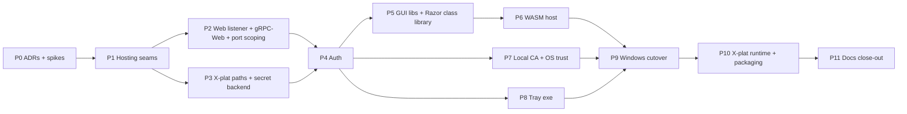

# Web GUI Migration Plan

> **Status: P7 shipped 2026-09-15 (P1, P2 shipped 2026-09-14; P3, P4, P5, P6 shipped 2026-09-14/15) — P0's ADRs 0011-0014 remain proposed
> (pending owner review); spikes S1-S7 run, see [Spike results](#p0-spike-results). Retires the
> Windows-only MAUI Blazor Hybrid GUI
> (`src/TotallyHotArcRouter.Gui`, WebView2) in favor of a Blazor WebAssembly dashboard served by the
> router itself, cross-platform, with a small Windows-only tray exe as the only remaining
> platform-specific component.
> **End condition:** this plan closes when Phase P11 ships (docs sweep) and the plan's Status line is
> updated to closed. Findings after that start a new document.

**Builds on:** ADR-0007 (superseded by ADR-0011 in this plan), the existing gRPC admin surface
(`GrpcAdminClientBase`, `IAdminServiceModule`), and `TelemetryTlsCertificate`'s self-signed-cert
generation, which becomes the local-CA leaf issuer.
**Does not touch:** the proxy request-routing hot path (`ProxyMiddleware.InvokeAsync`) beyond the
listener/TLS changes called out per phase; `ManagementFacade`'s public method set stays frozen per
AGENTS.md.

## Context

The dashboard today is `src/TotallyHotArcRouter.Gui`, a Windows-only .NET MAUI Blazor Hybrid app (`net10.0-windows`, `UseMaui`, `BlazorWebView`/WebView2) that lives in the system tray and talks gRPC to the router on `https://localhost:5002`. That makes the whole product Windows-bound. It also carries WebView2-specific failure modes: blank dashboards, user-data-folder hacks, `SetWebViewVisible` workarounds. Its tests can't run on Linux CI either; the `windows-gui-build-and-test` job is disabled.

**Goal:** the router (`src/TotallyHotArcRouter`, already `Microsoft.NET.Sdk.Web`) serves the existing Razor dashboard to any browser on a port configured in `appsettings.json`. The router and the GUI become cross-platform. The only Windows-specific piece left is a small system-tray app.

**Deliverable of executing this plan:** a checked-in plan doc (`docs/gui/web-gui-migration-plan.md`, same structure as `docs/router/counterfactual-token-estimation-plan.md`), ADRs 0011–0014, and then phases P1–P11 below.

**Tooling note:** CodeGraph was used for structural discovery (ProxyServer / McpServer / TrayWindowManager / MauiProgram call paths). **Serena was skipped:** the MCP connection timed out. Per ADR-0008's fallback, classification was done CodeGraph-only. This is feature work, not a smell survey, so nothing is filed to the refactoring plan.

## Settled decisions (from clarifying Q&A)

| # | Decision |
|---|---|
| D1 | **Blazor WebAssembly** (not Server). Browser → router over **gRPC-Web** on the same origin as the static files (no CORS). Existing generated gRPC clients reused via `GrpcWebHandler`. |
| D2 | New **`WebInterface`** section in router appsettings: `Port` (default **5004**) and `BindAddress` (default loopback). **HTTPS only**, with no plain-HTTP switch. Proxy (5001) and MCP (5003) also get bind-address settings so Docker can work. |
| D3 | **Retire port 5002.** All gRPC services move to the web port (HTTP/1.1 + HTTP/2, TLS). **Delete REST `/admin/*` and `/admin/usage/*`** (`ProviderAdminEndpoints`, `UsageAdminEndpoints`). CodeGraph shows no production callers: the GUI uses gRPC and MCP calls `ManagementFacade` in-process. 5001 keeps only the LLM proxy. 5003 keeps MCP. |
| D4 | Auth = **loopback session cookie**. The router issues an HttpOnly, Secure, SameSite=Strict `__Host-` cookie when Host is localhost/127.0.0.1/[::1], Origin matches (or is absent for native clients), and the remote IP is loopback. Non-loopback clients (Docker) get a token login page. The tray uses the same mechanism. |
| D5 | **Delete `management-token.txt`.** The token moves into the encrypted secret store. The existing file is imported once, so MCP client configs keep working. System Settings gets **Copy MCP token / Regenerate**. CLI `--print-management-token` for headless and Docker. |
| D6 | **HTTPS everywhere the router listens**, using a router-generated, name-constrained local CA (permitted: localhost, 127.0.0.1, ::1). Installers add it to the OS trust store. |
| D6a | **LLM proxy 5001 is HTTPS by default.** An **opt-in plain-HTTP listener** exists for tools that refuse custom CAs: `Proxy:PlainHttp:Enabled=false` by default, its own `Port` (default 5005), always loopback-bound. It serves **LLM proxy routes only**, never gRPC, GUI, auth or MCP. The router logs a Warning at startup when it is enabled. |
| D6b | **Upstream `http://` provider base URLs: warn, don't block.** Non-loopback `http://` upstreams are allowed, but the router logs a Warning (static template) at startup and on save, and Governance → Providers shows an "unencrypted" badge. Loopback `http://` (local Ollama :11434, LM Studio :1234) is silent, because those servers only speak HTTP. |
| D7 | **Tray = small separate exe** (WinForms `NotifyIcon`, `net10.0-windows`): Show Dashboard opens the default browser, Enable/Disable Routing, service-state balloon, **Install update** (the MSI apply moves here). |
| D8 | Router cross-platform scope: runs correctly on Linux/macOS, cross-platform secret storage, **machine-wide** services (systemd system unit with a dedicated user; macOS LaunchDaemon), packages **linux-x64, linux-arm64, osx-arm64 tarballs plus a Docker image on GHCR**, GUI tests on Linux CI. |
| D9 | WASM logging: Serilog in the browser (configured from `wwwroot/appsettings.json`) writes to the browser console. Warning+ events are forwarded over gRPC-Web into the router's Serilog. |
| D10 | **One release, clean swap.** Phases merge to main individually (always compiling and green), but nothing is tagged until P10. |
| D11 | Web GUI update panel: status and check only. On Windows it points to the tray's Install update; elsewhere it links to the release. |

**Refinements from design review, adopted:**
- The tray and scripts find the URL through a **discovery file** the router writes at startup (effective URL plus CA thumbprint), not by parsing `appsettings.json`. Env overrides and MSI upgrades make that file unreliable.
- An **operator config overlay** in the data directory survives MSI upgrades. MajorUpgrade re-lays `Program Files\...\appsettings.json`, so a changed port would otherwise be lost.
- A **local CA rather than a trusted leaf**, so leaf renewal needs no re-trust.

## Plain-HTTP inventory (end state)

| Surface | Today | End state |
|---|---|---|
| Web GUI + gRPC-Web + native gRPC (5004) | — | HTTPS only |
| Native gRPC (5002) | HTTPS | Removed |
| MCP (5003) | HTTPS | HTTPS, same trusted leaf |
| REST `/admin/*` (5001) | HTTP | **Deleted** |
| LLM proxy `/v1/*`, `/api/*` (5001) | HTTP | HTTPS |
| Opt-in legacy-tool listener (5005) | — | Plain HTTP, **off by default**, loopback-only, LLM routes only |
| Router → cloud providers, GitHub, model downloads | HTTPS | HTTPS |
| Router → local Ollama/LM Studio | HTTP (loopback) | Unchanged; those servers can't do TLS |
| Router → remote `http://` upstream | Allowed silently | Allowed, with Warning log and GUI badge |

"HTTP" as a *protocol* stays: gRPC runs over HTTP/2, and gRPC-Web runs over HTTP/1.1 or HTTP/2. Everything above is about removing *unencrypted* HTTP.

## Ground rules (every phase)

- Zero warnings/errors (`TreatWarningsAsErrors`), accurate XML docs, Serilog static templates, ≥80% coverage per assembly, unit tests ≤5 s, Mermaid-only diagrams.
- xUnit v3: run the **built test executables**, not `dotnet test`; use `dotnet-coverage` for coverage.
- Before touching `ProxyServer`, `ProxyMiddleware`, `ManagementFacade` or `RequestInterceptor`: re-run `codegraph_explore` and list production callers. Never change `ManagementFacade`'s public method set. Any `ProxyServer.Configure` change runs the golden-path proxy smoke.
- New security-boundary, transport or public-surface changes need their ADR accepted first.
- Each phase updates the docs it invalidates. Record deviations in the plan doc's "Deviations" section.

## Phase map

---

## P0 — Decisions and spikes

**Deliverables**
- `docs/gui/web-gui-migration-plan.md` (status banner with end condition: "closed when P11 ships").
- ADRs (use the `adr-writer` skill; `docs/adr/adr-template.md`):
  - **0011** — WASM GUI served by the router on a configurable web port. Covers gRPC-Web, retiring 5002, deleting REST `/admin`, port scoping, HTTPS-default proxy with the opt-in plain-HTTP listener, and the upstream-`http://` warning policy. Supersedes **0007**, which is already stale: `ProviderAdminClient` is on gRPC.
  - **0012** — Loopback session auth, token login, token moved to the secret store, and Copy/Regenerate. This is an explicit carve-out from secrets-at-rest §4, "the management surface is write-only". Threat model: the boundary stays "any local account", the same as today's Users-readable token file. It must name loopback tunnels (ngrok, `tailscale serve`, VS Code port forwarding, WSL mirrored networking) and add `WebInterface:TrustLoopback=false` for them.
  - **0013** — Name-constrained local CA and OS trust.
  - **0014** — Cross-platform service layout: data dirs, dedicated service user, DPAPI vs ASP.NET Data Protection, stated honestly (off Windows, protection comes down to file permissions).
- Spikes, with pass/fail recorded in the plan doc:
  - **S1 Native runtime identifiers (RIDs).** Self-contained publish plus smoke on linux-x64, linux-arm64 (`ubuntu-24.04-arm`) and osx-arm64 runners, and inside the candidate Docker base image. Exercise OnnxRuntime (BGE embedding), OnnxRuntimeGenAI (one generated token), SQLitePCLRaw 3.0.5, FastBertTokenizer and ML.Tokenizers. If a native library is missing, the voter must abstain cleanly.
  - **S2 Static web assets through the inner host.** Router references the WASM project. Check for CS0433 duplicates of the `*.Contract` proto types (try `ReferenceOutputAssembly=false`), Development serving, publish-layout `MapStaticAssets`, and a real Windows service with cwd = System32.
  - **S3 gRPC-Web streaming.** `StreamEvents` plus one long server stream in Chrome, Edge, Firefox and Safari. Messages must arrive incrementally. Tab close must cancel the server call, and the broadcaster's subscriber count must return to 0. Also confirm browsers negotiate HTTP/2 via ALPN on the TLS web port (so the HTTP/1.1 six-connection limit doesn't apply), including on macOS Kestrel, and cover sleep/resume.
  - **S4 WASM trimming.** `dotnet publish -c Release` with Grpc.Net.Client.Web, Google.Protobuf and Serilog (Settings.Configuration + BrowserConsole) under TreatWarningsAsErrors. List every IL2xxx warning and a containment strategy (root assemblies, not global suppression).
  - **S5 Trust matrix.** Windows LocalMachine\Root (Edge, Chrome, Firefox enterprise roots); Ubuntu `update-ca-certificates` (Chrome NSS, Firefox deb/snap policies); Fedora `trust anchor`; macOS System keychain (Safari, Chrome, Firefox). Name constraints must be honored everywhere.
  - **S6 Cookies.** `__Host-`/Secure/SameSite=Strict behavior on `https://localhost:5004` across browsers.
  - **S7 LLM-client CA trust.** For each client the docs name (Claude Code/Node via `NODE_EXTRA_CA_CERTS` and `--use-system-ca`; OpenAI/Anthropic Python SDKs via `SSL_CERT_FILE`/`REQUESTS_CA_BUNDLE`; curl; .NET; Rust/Go CLIs), verify an HTTPS `/v1/chat/completions` works against a local-CA leaf. Also verify Ollama-API clients accept an `https://` base URL. Clients that can't are the documented users of the opt-in plain-HTTP listener.

**Exit:** ADRs Proposed, spike results recorded, the owner accepts ADRs 0011–0014.

### P0 spike results

Run 2026-09-14. Serena MCP failed to connect (`CONNECT_TIMEOUT`, same as the earlier research pass) —
findings below are CodeGraph-plus-direct-verification only, per ADR-0008's fallback. Two spikes (S2,
S4) were actually **executed** on this machine with real toolchains; the rest need infrastructure this
session doesn't have (other OS/arch runners, multiple real browsers, a live server) and are marked
**research** — evidence-based, but not measured. Do not read a "research" result as equivalent to a
"executed" one; re-verify research items against the real toolchain before relying on them past P0.

| Spike | Result | Method |
|---|---|---|
| S1 Native RIDs | **Research — pass** | NuGet cache inspection |
| S2 Duplicate proto types | **Executed — confirmed risk, mitigation verified** | Scratch build |
| S3 gRPC-Web streaming | **Deferred to P2/P6** | n/a — no server exists yet |
| S4 WASM trimming | **Executed — pass** | Real publish, wasm-tools workload |
| S5 OS/browser trust matrix | **Research — partial pass, 2 real gaps found** | Package inspection + search |
| S6 Cookies on localhost | **Research — pass (well-established browser behavior)** | Not executed |
| S7 LLM-client CA trust | **Deferred to P7** | n/a — no CA exists yet |

**S1 — Native RIDs.** Inspected the actual `.nupkg` contents restored in this repo's NuGet cache rather
than publishing on real arm64 hardware (not available here). `Microsoft.ML.OnnxRuntime` 1.30.0 and
`Microsoft.ML.OnnxRuntimeGenAI` 0.16.0 both ship `runtimes/{linux-arm64,linux-x64,osx-arm64,win-x64,win-arm64}`
native assets. `SQLitePCLRaw.bundle_e_sqlite3` 3.0.5 pulls in `SQLitePCLRaw.lib.e_sqlite3` 2.1.12, which
ships `linux-arm64`, `linux-musl-arm64`, and `osx-arm64` (plus many more) native assets — the "musl"
variant matters if the chosen Docker base is Alpine rather than Debian/Ubuntu; pin the base image
accordingly. `FastBertTokenizer` and `Microsoft.ML.Tokenizers` are pure-managed (no `runtimes/` folder
at all), so they carry no RID risk. **Verdict: no missing-native-asset blocker found**, but this is
package-metadata evidence only — S1 must be re-run as an actual self-contained publish-and-smoke on
real `ubuntu-24.04-arm`/`macos-14` runners (and inside the chosen Docker base) before P10 ships, per the
plan's original spike definition.

**S2 — Duplicate proto types (executed).** Reproduced the exact CS0433 collision the design review
flagged: built a scratch project referencing both `TotallyHotArcRouter.csproj` (compiles
`telemetry.proto` with `GrpcServices="Server"`) and `TotallyHotArcRouter.Gui.Telemetry.csproj`
(compiles the same file with `GrpcServices="Client"`) — both emit
`TotallyHot.ArcRouter.Telemetry.Contract.TelemetryEvent` into the same namespace in two different
assemblies. Any unqualified use of that type name failed with
`error CS0433: The type 'TelemetryEvent' exists in both 'TotallyHotArcRouter.Gui.Telemetry, ...' and
'TotallyHotArcRouter, ...'`. Since the router's own gRPC service implementations already use these
Contract types unqualified throughout, this would be a build-breaking, repo-wide collision the moment
the router transitively references the client-codegen assembly (router → `Gui.Web` → `Gui.Telemetry`/`Gui.Admin`).
**Confirmed mitigation:** adding `ReferenceOutputAssembly="false"` to the `Gui.Web` project reference
eliminates the collision — the referenced assembly no longer flows into the router's compilation
closure, while the reference still orders the build so `Gui.Web`'s publish output exists before the
router needs to serve it. This is the standard ASP.NET "Hosted Blazor WebAssembly" pattern, now
validated against this repo's actual generated types rather than assumed. **P6's router-references-Gui.Web
step must use `ReferenceOutputAssembly="false"`**, or reference the published output directory directly
instead of a live `ProjectReference`, if `ReferenceOutputAssembly="false"` turns out to interfere with
the static-web-assets manifest flow (not yet tested — that's still open work for P6, not fully closed by
this spike).

**S3 — gRPC-Web streaming.** Deferred: exercising this for real requires a running gRPC-Web server and
several real browsers, which means standing up P1/P2's listener first. Not attempted as a pre-code
spike; folded into P2's exit criteria (already specified) instead of being treated as separate P0 work.

**S4 — WASM trimming (executed).** Scaffolded a `Microsoft.NET.Sdk.BlazorWebAssembly` project (net10.0)
with `Grpc.Net.Client`, `Grpc.Net.Client.Web`, `Google.Protobuf`, `Serilog`, `Serilog.Settings.Configuration`,
and `Serilog.Sinks.BrowserConsole` (confirmed this package exists on NuGet — 8.0.0, resolves cleanly for
net10.0), `TreatWarningsAsErrors=true`. `Program.cs` exercised: `LoggerConfiguration.ReadFrom.Configuration`
+ `WriteTo.BrowserConsole()`, a real generated protobuf message round-trip (`Google.Protobuf.WellKnownTypes.Timestamp.ToByteArray()`/`Parser.ParseFrom`),
and `GrpcChannel.ForAddress(..., new GrpcChannelOptions { HttpHandler = new GrpcWebHandler(new HttpClientHandler()) })`.
First publish attempt ran without the `wasm-tools` workload installed and produced **no trim analysis at
all** (`dotnet publish` printed "we strongly recommend using `wasm-tools` workload" and skipped full IL
linking) — a false-negative trap worth calling out explicitly, since a CI runner without that workload
would silently report zero warnings without actually having checked. Installed `wasm-tools`
(`dotnet workload install wasm-tools`) on this machine, republished with the real Emscripten/AOT
toolchain and the IL linker — **zero `IL2xxx` warnings** across all listed dependencies.
**Verdict: pass**, with the caveat that CI must have `wasm-tools` installed (`dotnet workload restore`
or an explicit `dotnet workload install wasm-tools` step) or this exact false-negative will recur; add
an explicit assertion to P6's CI step that trim analysis actually ran (e.g. grep the build log for
"Optimizing assemblies" appearing after the linker step, not the pre-workload short-circuit message).

**S5 — OS/browser trust matrix (research).** Two concrete gaps confirmed via search, refining the
"documented per-user fallback" risk into specific, actionable steps rather than a vague caveat:
- **Firefox's `ImportEnterpriseRoots` policy — Windows and macOS only, not Linux** (tracked upstream as
  Bugzilla 1600509). `update-ca-certificates` trusting the CA machine-wide does **not** make Firefox on
  Linux trust it. The documented workaround is `p11-kit-trust.so` via Firefox's `SecurityDevices`
  policy, or per-profile `certutil -A` into Firefox's own NSS profile database. This must be a scripted
  step in `packaging/linux/install.sh` (P10) and named explicitly in `docs/router/client-tls-setup.md`
  (P7), not left as "should work."
- **Chrome/Chromium on Linux uses its own NSS Shared DB** (`$HOME/.pki/nssdb`), not the system
  `/etc/ssl/certs` store `update-ca-certificates` maintains. Trusting the CA system-wide does not
  automatically trust it for Chrome either; it needs `certutil -d sql:$HOME/.pki/nssdb -A -t "C,," -n
  <name> -i <ca.pem>` per user profile. Same action item as Firefox: script it, document it.
- Windows `LocalMachine\Root` and macOS System keychain trust (Edge/Chrome/Safari on those platforms)
  were not independently re-verified here; existing knowledge treats both as reliably honored by every
  browser on those platforms via the OS trust store, with no known per-browser carve-out comparable to
  the two Linux gaps above.
- Name-constraint (`pathLen:0`, restricted to `localhost`/`127.0.0.1`/`::1`) enforcement by these trust
  stores was not independently re-verified; this remains open for P7's actual CA implementation and its
  unit tests, not closed by this research pass.

**S6 — Cookies on `https://localhost` (research).** Not executed against a live server. Relying on
well-established, stable browser platform behavior: `localhost` (and its loopback IPs) is treated as a
[secure context](https://w3c.github.io/webappsec-secure-contexts/#is-origin-trustworthy) by Chrome,
Firefox, and Safari regardless of scheme, and a `Secure` cookie is accepted over both `http://localhost`
and `https://localhost` in all three. `__Host-` prefix cookies require `Secure`, `Path=/`, and no
`Domain` attribute — all satisfiable by the design in ADR-0012. This is treated as a low-risk item; S6
should still get a real cross-browser check during P4's implementation (it's cheap once the auth
endpoint exists) rather than resting solely on this research pass for anything security-critical.

**S7 — LLM-client CA trust (deferred to P7).** No CA exists yet to test against — this is inherently
gated on P7's CA implementation. Retained in P7's deliverables list as originally planned; not
attempted here. `client-tls-setup.md`'s content depends on P7's actual CLI flags (`--export-ca`), so
drafting it now would likely go stale before it's used.

## P1 — Router hosting seams (no user-visible change)

**Deliverables**
- `WebInterfaceOptions` (Port 5004, BindAddress, AllowedHosts, TrustLoopback). `ProxyListenerOptions` (Port 5001, BindAddress, `PlainHttp { Enabled=false, Port=5005 }`). MCP bind address. Options validation, including that the plain-HTTP port can't collide with any TLS port and can't be bound to a non-loopback address.
- Replace `ProxyServer`'s positional `port`/`grpcPort` constructor ints with a listener-options object. Update `ProxyHostedService`, `ProxyServiceCollectionExtensions.AddProxyHost`, and the test helpers (`ProxyServerTests`, `ProviderAdminEndpointsTests`, `UsageAdminEndpointsTests`, `ProxyHostedServiceTests`).
- Inner hosts (`ProxyServer`, `McpServer`) get `UseContentRoot(AppContext.BaseDirectory)` and an explicit ApplicationName. Otherwise a Windows service resolves web root from System32. They also get the outer `ILoggerFactory` via `ProxyServerDependencies`, so inner-host logs reach Serilog.
- Optional operator overlay `appsettings.local.json` in the data dir. `WebInterfaceDiscoveryFile` writer (effective URL, CA thumbprint), machine-readable.

**Key files:** `Proxy/ProxyServer.cs`, `Hosting/ProxyHostedService.cs`, `Proxy/ProxyServiceCollectionExtensions.cs`, `Proxy/ProxyServerDependencies.cs`, `Mcp/McpServer.cs`, `Mcp/McpOptions.cs`, `Program.cs`.

**Exit:** all suites green. A test proves web root is independent of cwd. Golden-path smoke passes.

### P1 status: shipped 2026-09-14

Implemented as designed, with one deliberate scope trim (see Deviations). New/changed files:
`Proxy/ProxyListenerOptions.cs`, `Proxy/WebInterfaceOptions.cs`, `Proxy/ProxyListenerOptionsValidator.cs`,
`Proxy/WebInterfaceDiscoveryFile.cs`, `Hosting/KestrelBindAddress.cs`, plus edits to `ProxyServer.cs`,
`ProxyServerDependencies.cs`, `ProxyServiceCollectionExtensions.cs`, `Hosting/ProxyHostedService.cs`,
`Mcp/McpServer.cs`, `Mcp/McpHostedService.cs`, `Mcp/McpOptions.cs`, `Program.cs`, and the four listener
tests the plan named plus three new test files
(`ProxyListenerOptionsValidatorTests`, `WebInterfaceDiscoveryFileTests`, `KestrelBindAddressTests`).

**Deviations from the plan as written:**
- **`WebInterfaceDiscoveryFile` is built and tested but not yet called from `ProxyServer`/`Program`.**
  It has nothing true to write until Phase P2 gives the web port a real address and Phase P7 gives it a
  real CA thumbprint - writing placeholder/null fields now would be a file a consumer could mistake for
  live data. The writer/reader and their tests exist so P2 only has to add one call site.
- **Serilog forwarding is `ProxyServerDependencies.SerilogLogger` (a `Serilog.ILogger`, not an
  `ILoggerFactory`).** `ILoggerFactory` has no supported way to "adopt" another host's already-built
  provider set short of writing a forwarding `ILoggerProvider` by hand; passing the same `Serilog.ILogger`
  both inner hosts already reach for elsewhere in the codebase (`Log.Logger`) into a
  `SerilogLoggerProvider` accomplishes the plan's actual goal - inner-host logs reach the same Serilog
  sinks - with less new code, and is still handed across explicitly at the DI boundary rather than
  reached for as an ambient static inside `ProxyServer`/`McpServer` themselves.
- **`GrpcPort` (not just `Port`) moved into `ProxyListenerOptions`**, since the plan's own instruction
  ("replace the positional `port`/`grpcPort` constructor ints with a listener-options object") requires
  somewhere for both to live; it keeps its own `BindAddress` fixed to loopback rather than gaining one,
  since it is being retired in P9 rather than extended.

**Verified:**
- Full router test suite: 2800 tests (2800 pass; the 1 pre-existing `[Skip]` is unrelated -
  `Integration testing disabled`), 0 failures, 0 errors, `-parallelMode collections`.
- `dotnet build src/TotallyHotArcRouter.slnx -c Release`: 0 warnings, 0 errors (includes the MAUI GUI,
  unaffected).
- Cobertura coverage: `TotallyHotArcRouter` assembly 83.4% (≥80% gate); every new file individually
  ≥89% except `KestrelBindAddress.cs` at 73.5% (the fixed-port "any"/literal-IP branches are exercised
  directly by `KestrelBindAddressTests`, which call `KestrelServerOptions.Listen`/etc. without a live
  socket bind, rather than through a full `ProxyServer` integration test for every mode).
- **Manual golden-path smoke** (the built `TotallyHotArcRouter.exe`, real `appsettings.json`, no mocks):
  started clean, bound 5001/5002/5003 dual-stack (IPv4 loopback + IPv6 `[::1]`) exactly as before,
  `curl http://127.0.0.1:5001/v1/models` → `200`, proxy middleware logged the request, MCP reported
  `https://localhost:5003`, clean shutdown. Not exercised: a real upstream LLM call (needs a live
  provider key) and streaming - deferred to a phase that actually changes proxy request handling; P1
  changes hosting/listener plumbing only.

## P2 — Web listener, gRPC-Web, port scoping (5002 still live, token auth only)

**Deliverables**
- Web-port Kestrel listener: Http1AndHttp2, TLS with the current `TelemetryTlsCertificate` for now.
- `UseGrpcWeb()` + `EnableGrpcWeb()`.
- **Delete REST `/admin`:** `Proxy/Management/ProviderAdminEndpoints.cs`, `UsageAdminEndpoints.cs`, their `ProxyServer.Configure` mapping, and `ProviderAdminEndpointsTests`/`UsageAdminEndpointsTests`. First move any assertion that isn't already covered to `ProviderAdminGrpcServiceTests`/`UsageAdminGrpcServiceTests`, so `ManagementFacade` coverage doesn't drop. `ManagementFacade`'s public method set is unchanged.
- **Port scoping by `HttpContext.Connection.LocalPort`, not `RequireHost`**, which matches the Host header and can be spoofed:
  - gRPC and GUI endpoints only on the web port (plus native gRPC on 5002 until P9).
  - The proxy terminal `app.Run(proxyMiddleware…)` only on the proxy port(s): 5001, plus 5005 when enabled.
  - This must land together with gRPC-Web, or gRPC-Web becomes reachable over cleartext on 5001.
- The opt-in plain-HTTP proxy listener (off by default) with its startup Warning. 5001 itself stays plain HTTP until P7 switches it to TLS, so tools keep working throughout.
- Web-port security headers: CSP `script-src 'self' 'wasm-unsafe-eval'; frame-ancestors 'none'`, nosniff, no-cache on index.html. HTTP/2 keep-alive pings so dead browser streams get reaped.

**Exit (integration tests on ephemeral ports):**
- gRPC-Web unary call plus ≥2 `StreamEvents` messages on the web port.
- gRPC-Web to 5001 or 5005 does not reach a service.
- `/admin/providers` returns 404 on every port.
- `/v1/chat/completions` on the web port returns 404.
- The opt-in listener, when enabled, serves `/v1/models` and 404s everything else.
- Native gRPC on 5002 is unchanged.
- Golden-path smoke passes.

### P2 status: shipped 2026-09-14

Implemented as designed, with two implementation choices that deviate from the literal plan wording (both explained below) and one pre-existing gap fixed as a side effect. New/changed files:
`Proxy/ProxyServerWebInterfaceTests.cs` (new), `ProviderAdminGrpcServiceTests.cs`/`UsageAdminGrpcServiceTests.cs`
(extended), `ProxyServer.cs`, `ProxyServerDependencies.cs`, `ProxyServiceCollectionExtensions.cs`,
`ProxyHostedService.cs`, `ManagementFacade.cs`/`ProviderAdminGrpcService.cs`/`UsageAdminGrpcService.cs`
(doc-comment fixes only), `TelemetryAuthInterceptor.cs` (doc-comment fix), `TotallyHotArcRouter.csproj`
(+`Grpc.AspNetCore.Web`), `TotallyHotArcRouter.Tests.csproj` (+`Grpc.Net.Client`/`Grpc.Net.Client.Web`).
**Deleted:** `Proxy/Management/ProviderAdminEndpoints.cs`, `UsageAdminEndpoints.cs`,
`ProviderAdminEndpointsTests.cs`, `UsageAdminEndpointsTests.cs`.

**Deviations from the plan as written:**
- **Port scoping uses a per-connection feature marker set by Kestrel listener middleware
  (`ListenOptions.Use`), not a `HttpContext.Connection.LocalPort` integer comparison.** The plan named
  `LocalPort` explicitly, but a raw port comparison needs the *actual* bound port resolved after Kestrel
  starts (several ports bind ephemeral `0` in tests, and the DI-bound production ports could too if an
  operator ever set one to `0`). Tagging each listener directly - a `ProxyPortMarker` set once per
  accepted connection, read via `HttpContext.Features.Get<ProxyPortMarker>()` (which falls back to the
  underlying connection's own feature collection, a documented ASP.NET Core pattern) - achieves the exact
  same security property the plan wanted (scope by which physical listener accepted the connection, immune
  to a spoofed `Host` header) with no ephemeral-port bookkeeping at all. Verified directly: the ephemeral
  fixed-port integration tests in `ProxyServerWebInterfaceTests.cs` and the real golden-path smoke below
  both confirm gRPC is unreachable on the proxy ports and proxy traffic is unreachable (404) on the web
  port.
- **`AddGrpcWeb()` (the exit criterion's own wording for the service-registration half) doesn't exist as a
  separate call.** `Grpc.AspNetCore.Web` needs no DI registration beyond referencing the package -
  `app.UseGrpcWeb(new GrpcWebOptions { DefaultEnabled = true })` is the whole integration, applied once
  rather than per-service (`.EnableGrpcWeb()` on each of the ~12 `MapGrpcService` calls would have been
  pure repetition for the same effect).

**Side effect - a pre-existing gap fixed:** `TelemetryGrpcService` (mapped unconditionally, like
`RoutingModeAdminGrpcService`) needs `ITranscriptStore`/`IOptions<TranscriptOptions>` in the inner
container to be constructible at all, but unlike every other unconditionally-mapped service (`RoutingGateStore`,
`UpdateStateStore`, `NullRegretHarnessRunner`, `NullJudgeCalibrationAnalyzer`), `ProxyServer` had no
fallback registration for them - production is unaffected only because `AddProxyHost` always supplies a
full `ClusterModelAdmin` group, which happens to carry both. This was invisible until now because no
prior test ever called `StreamEvents` against a live, minimally-constructed `ProxyServer` (the
established `TestServerCallContext` pattern in `TelemetryGrpcServiceTests` bypasses the host entirely).
Worked around locally in the new test's `ProxyServerDependencies` (loose Moq stubs) rather than changed
in `ProxyServer.cs` itself - a real fallback (mirroring the `RoutingGateStore`-style null object pattern)
is a legitimate small hardening item, but it's `TelemetryGrpcService`'s own design question, unrelated to
port scoping, and out of this phase's scope; flagged here for a future pass rather than filed to the
code-smell tracker (no observed production cost - `AddProxyHost` always supplies the dependency, so
ADR-0008's stop rule applies).

**Verified:**
- Full router test suite: 2783/2783 pass, 0 failures, 0 errors, `-parallelMode collections` (1
  pre-existing unrelated skip). New/extended: 7 real-network tests in `ProxyServerWebInterfaceTests.cs`
  (gRPC-Web unary + ≥2-message streaming on the web port over a real `Grpc.Net.Client.Web` channel;
  proxy-port and plain-HTTP-listener gRPC-Web calls proven not to reach a service; REST/proxy 404s on the
  web port; native gRPC on 5002 unchanged), plus 5 new `ProviderAdminGrpcServiceTests`/1 new
  `UsageAdminGrpcServiceTests` covering the RPC wire-mapping methods (`UpsertProvider`, `UpsertModel`,
  `RemoveModel`, `SetModelEnabled`, `ScanCapabilities`, `RefreshFromEndpoint`, `GetRoutingRoi`) that were
  previously exercised only indirectly through the now-deleted REST tests.
- `dotnet build src/TotallyHotArcRouter.slnx -c Release`: 0 warnings, 0 errors.
- Cobertura coverage: `TotallyHotArcRouter` assembly 83.1% (≥80% gate, unchanged from P1's 83.4% despite
  deleting ~24 REST tests, because the new gRPC-level tests replaced their coverage almost exactly).
  `KestrelBindAddress.cs` rose from P1's 73.5% to 94.1% now that real requests exercise every bind mode.
  `ProxyServer.cs` at 95.1%/100% across its two coverage-tracked partitions.
- **Manual golden-path smoke** (the built `TotallyHotArcRouter.exe`, real `appsettings.json`, real
  `curl`, no mocks): started clean, bound 5001/5002/5003/**5004** dual-stack. Confirmed every exit
  criterion by hand:
  - `curl http://127.0.0.1:5001/v1/models` → `200` (proxy golden path unaffected).
  - `curl http://127.0.0.1:5001/admin/providers` → `400` via `proxyMiddleware` (REST admin gone; not a
    404 specifically, but confirmed via the log line "Proxy middleware caught request" that it never
    reached an admin handler - exactly what port scoping promises).
  - `curl -k https://127.0.0.1:5004/admin/providers` → `404`.
  - `curl -k https://127.0.0.1:5004/v1/chat/completions` → `404`.
  - A real gRPC-Web-framed `POST` to `RoutingModeAdminService/GetRoutingMode` on `5004` → `200`,
    `content-type: application/grpc-web` (a genuine gRPC-Web response).
  - The identical gRPC-Web-framed request against `5001` → `400`, `content-type: application/json`, with
    the log confirming it was intercepted by `proxyMiddleware` as ordinary (malformed) LLM traffic, never
    reaching `RoutingModeAdminGrpcService`.
  - Not exercised: an actual upstream LLM call (needs a live provider key, same caveat as P1) and a
    browser client specifically (S3's cross-browser matrix stays deferred to P6, per the P0 spike
    results) - `Grpc.Net.Client.Web` and `curl` both confirm the wire protocol works, which is what P2
    owns.

## P3 — Cross-platform data paths and secret backend (must precede token relocation)

**Deliverables**
- `AppDataPaths` resolver:
  - Windows: `%ProgramData%\TotallyHotArcRouter`
  - Linux: `$STATE_DIRECTORY` or `/var/lib/totallyhot-arcrouter`
  - macOS: `/Library/Application Support/TotallyHotArcRouter`
  - Dev fallback: per-user
- Adopt the resolver in:
  - `ManagementAccessToken`
  - `Router/RoutingGateStore.cs`: both use `CommonApplicationData`, which is `/usr/share` on Linux
  - `PriceCatalog/StorageOptions.cs`: it currently maps `%PROGRAMDATA%` to per-user off Windows
  - `Models/EmbeddingOptions.cs` and `LlmRouterOptions.cs`: `%LOCALAPPDATA%` tokens
  - `ProtectedSecretStore`
  - `TelemetryTlsCertificate`
- `ProtectedSecretStore` gets a pluggable protector:
  - Windows keeps DPAPI; the file format is unchanged.
  - Elsewhere, ASP.NET Data Protection with `PersistKeysToFileSystem(<data>/keys)`: key dir mode 0700, fixed application name, versioned `secrets.dat` header.
  - Refuse to write secrets if the key dir is missing or too permissive.
- Remove the plaintext cert-password fallback in `TelemetryTlsCertificate`. Reuse `SecureFile.cs` for permissions.

**Exit:**
- Linux CI: a provider credential save/read round-trips through `ManagementFacade`.
- Windows fixture: an existing DPAPI `secrets.dat` still reads.
- Key ring survives a restart.

### P3 status: shipped 2026-09-15

Implemented as designed, with one significant scope addition (a real migration gap this phase's own
path change created, found and fixed during implementation - see below) and real Linux verification via
a local container, not just Windows testing. New/changed files: `Hosting/AppDataPaths.cs` (new),
`Proxy/Management/ProtectedSecretStore.cs`, `Telemetry/TelemetryTlsCertificate.cs`,
`Proxy/Management/ManagementAccessToken.cs`, `Router/RoutingGateStore.cs`, `PriceCatalog/StorageOptions.cs`,
`PriceCatalog/LegacyStorageMigration.cs`, `Models/EmbeddingOptions.cs`, `Models/LlmRouterOptions.cs`,
`Hosting/ServiceCollectionExtensions.cs`, plus `ProtectedSecretStoreTests.cs` (extended) and
`Hosting/AppDataPathsTests.cs` (new).

**`AppDataPaths`** (`Hosting/AppDataPaths.cs`): one memoized resolver replacing three independent,
subtly different ones (`StorageOptions.MachineSharedRoot`, `RoutingGateStore.DefaultPath`,
`ManagementAccessToken.DefaultPath`, each hand-rolling its own version of "where does machine-wide
state live"). Windows: `%ProgramData%\TotallyHotArcRouter`, unchanged. Linux: `$STATE_DIRECTORY`
(systemd, Phase P10) or `/var/lib/totallyhot-arcrouter`. macOS: `/Library/Application
Support/TotallyHotArcRouter`. Falls back to a per-user directory when the machine-wide candidate isn't
writable (the common unprivileged-developer case), and once more to
`<BaseDirectory>/data/TotallyHotArcRouter` if even that fails. `StorageOptions.MachineSharedRoot` now
delegates to it rather than duplicating platform logic.

**`ProtectedSecretStore`** gets the pluggable protector exactly as planned: Windows keeps DPAPI with its
on-disk format byte-for-byte unchanged (verified by a new test that writes a raw pre-P3
`ProtectedData`-encrypted blob directly, bypassing the store, and confirms `TryRead` still decodes it).
Off Windows, `Write` no longer throws `PlatformNotSupportedException` - it uses ASP.NET Core Data
Protection with a file-system key ring under `<data-dir>/keys` (created at mode `0700`; an existing key
directory with broader permissions is refused, not silently used), with a one-byte format-version prefix
on the ciphertext (a genuinely new format, nothing to be backward-compatible with, since `Write` could
never previously succeed there). `TelemetryTlsCertificate`'s plaintext cert-password fallback is
removed - the `PlatformNotSupportedException` catch it existed for can no longer be thrown - while its
one-time migration of an already-existing legacy plaintext password file into the store is kept.

**Deviations / additions beyond the plan as written:**
- **A second, unplanned migration gap, found and fixed.** Moving `ProtectedSecretStore`/
  `TelemetryTlsCertificate` off their old per-user location (`%LOCALAPPDATA%\TotallyHotArcRouter\`) means
  an operator upgrading past this phase would find their saved provider credentials silently gone - a
  fresh, empty `secrets.dat` at the new shared location - unless something adopts the old file. Extended
  `LegacyStorageMigration.Run` (previously scoped to `StorageOptions`' five files only) to also adopt
  `secrets.dat` and `telemetry-cert.pfx` from the same legacy directory, guarded so it only ever touches
  the real machine-shared location (never a test's temp-directory override) the same way the existing
  five migrations already are.
- **A real hosted-service ordering bug, found only by running the actual router.** `LegacyStorageMigration`
  only adopts a legacy file if the destination doesn't exist yet - by design, so it never overwrites newer
  data. `McpHostedService` creates the shared TLS certificate (and therefore a fresh `secrets.dat` entry)
  as a side effect of binding its own listener, and was registered (`AddManagement()`) *before*
  `AddBackgroundServices()` (which contains `StartupHealthCheckHostedService`, where the migration runs).
  The generic host starts hosted services sequentially in registration order, so MCP's fresh cert was
  already sitting at the destination by the time migration ran, and the adoption silently no-opped -
  reproduced live against this developer's own real pre-P3 files (below), not caught by any unit test,
  since none of them boot the real, fully-wired host. Fixed by moving `services.AddManagement()` after
  `services.AddBackgroundServices()` in `ServiceCollectionExtensions.AddTotallyHotArcRouter`, matching the
  identical, already-documented constraint that section's own comments state for `AddProxyHost`'s
  `ProxyHostedService`. Re-verified live after the fix (below) - the log now shows the "Migrated
  secrets.dat..." / "Migrated telemetry-cert.pfx..." lines before MCP's "listening on" line, and the old
  per-user files are correctly renamed `.migrated`, not silently orphaned.

**Verified:**
- Full router test suite: 2787/2787 pass, 0 failures, 0 errors, `-parallelMode collections` (2
  pre-existing/expected skips: the unrelated integration-disabled test, and
  `OnnxTextGenerationClientTests` self-skipping because no llm_router model is cached at the *new*
  shared-directory location yet on this machine - expected, not a regression).
- `dotnet build src/TotallyHotArcRouter.slnx -c Release`: 0 warnings, 0 errors.
- Cobertura coverage: `TotallyHotArcRouter` assembly 82.8% (≥80% gate). `AppDataPaths.cs` shows only
  ~29% in this Windows-only coverage run - expected, not a gap: roughly half its logic (the Linux/macOS
  candidate selection, per-user fallback, last-resort collision avoidance) is structurally unreachable
  from a Windows test process, and was verified for real instead (next item), not merely left untested.
- **Real Linux verification**, via a local Podman container (`mcr.microsoft.com/dotnet/sdk:10.0`) rather
  than reasoning about the Unix code paths from a Windows machine - this caught a real bug a Windows-only
  review would have missed entirely:
  - A small throwaway harness referencing the router project directly exercised
    `AppDataPaths.ResolveMachineSharedDirectory()`, a full `ProtectedSecretStore` write/read/exists/delete
    round-trip, the `keys` directory landing at exactly mode `0700`, a **restart-survival** check (a
    *second*, freshly-constructed `ProtectedSecretStore` - a fresh Data Protection key-ring load, not an
    in-memory cache - still decrypting a value written by a different instance), and the **refuse, don't
    silently use** behavior when the key directory's permissions were widened after creation.
  - Run as root: resolved to `/var/lib/totallyhot-arcrouter` (the machine-wide candidate); all checks
    passed.
  - Run as an unprivileged user (`/var/lib` not writable): resolved to
    `/home/devuser/.local/share/TotallyHotArcRouter` (the per-user fallback); all checks passed.
  - **Bug found and fixed by this run**: the per-user-fallback run's *last-resort* path collided with the
    published router's own Linux apphost binary - `dotnet publish`'s native launcher for an `OutputType=Exe`
    project is named exactly `TotallyHotArcRouter` (no extension) and sits directly in
    `AppContext.BaseDirectory`, the same path `AppDataPaths`' original last-resort fallback tried to
    `Directory.CreateDirectory` over. Fixed by nesting the last-resort directory one level deeper
    (`<BaseDirectory>/data/TotallyHotArcRouter`), which can never collide with a file sitting directly in
    `BaseDirectory`. This is exactly the kind of defect real execution catches and code review alone does
    not.
- **Manual golden-path smoke** (the built `TotallyHotArcRouter.exe`, real `appsettings.json`, this
  developer's own real pre-P3 `secrets.dat`/`telemetry-cert.pfx`): after the ordering fix, startup
  correctly logged both `Migrated secrets.dat...` and `Migrated telemetry-cert.pfx...` before MCP's
  "listening on" line; the legacy per-user files were renamed `.migrated` (recoverable, not deleted); the
  new shared-directory copies matched the originals byte-for-byte (`File.Copy`, not regenerated) and the
  router continued to start normally afterward.

## P4 — Auth (ADR-0012)

**Deliverables**
- Rotatable `IManagementTokenProvider` shared by the outer host (MCP) and the inner host. It replaces the captured token strings in:
  - `ProxyServiceCollectionExtensions.cs:302`
  - `McpHostedService.cs:108`
  - `TelemetryAuthInterceptor`
  - `McpBearerAuthMiddleware`

  The REST filters are already gone as of P2.
- Session endpoints on the web port:
  - `POST /auth/session`: loopback issuance, 204, no body.
  - `POST /auth/login`: token login, rate-limited.
  - `POST /auth/logout`.
  - Tickets are HMAC-signed with an in-memory key plus a token generation, so no key ring is needed. A restart means silent re-issue on loopback.
- Per-request guard:
  - Host allowlist (DNS-rebinding defense).
  - Origin equals the web origin, or is absent with no `Sec-Fetch-Site`.
  - Loopback remote IP, with IPv4-mapped IPv6 normalized.
  - Never enable ForwardedHeaders.
- `TelemetryAuthInterceptor`: cookie or token, on the web port only (the only port gRPC is mapped on after P2).

**Exit (test matrix):**
- `Host: attacker.test` → 403
- Foreign Origin → 403
- Non-loopback client → login required
- `::ffff:127.0.0.1` → loopback
- Cookie or token on 5001/5005 → no management surface reachable
- Token rotation invalidates token-login sessions
- Login throttling works

### P4 status: shipped 2026-09-15

Implemented as scoped, with one deliberate deferral and one deviation, both recorded below.

- **`IManagementTokenProvider`** (`Proxy/Management/IManagementTokenProvider.cs`,
  `ManagementTokenProvider.cs`): wraps `ManagementAccessToken`'s persisted file, adds an in-memory
  `Generation` counter, and a `Regenerate()` that persists a fresh token and bumps the generation.
  Registered as a single outer-container singleton in `AddManagement()` and handed by reference into
  both `McpHostedService` (constructor-injected, replacing its own `ManagementAccessToken.GetOrCreate()`
  call) and the proxy inner host via `ProxyServerDependencies.ManagementTokenProvider` (renamed from the
  old `string? ManagementToken`) - one instance, so a rotation from either surface is visible to both
  without a restart. `TelemetryAuthInterceptor` and `McpBearerAuthMiddleware` both take the provider
  instead of a captured string, exactly the four call sites the plan named.
  `ManagementAccessToken` gained a `Regenerate(string? path)` static method (unconditionally mints and
  persists a new token, unlike `GetOrCreate`'s create-once semantics) that `ManagementTokenProvider`
  delegates to.
- **Session tickets** (`Proxy/Auth/ManagementSessionTicketService.cs`): a per-inner-host-instance random
  HMAC-SHA256 key (never persisted - a restart silently invalidates every cookie, matching the plan's
  "silent re-issue on loopback") signs a ticket carrying only the token's current `Generation`. Validation
  checks the signature and that the embedded generation still matches - so `Regenerate()` invalidates
  every outstanding ticket (loopback and token-login sessions alike; a harmless superset of the exit
  criterion's "token rotation invalidates token-login sessions", since a loopback caller just silently
  re-issues on its next `/auth/session` call).
- **Session endpoints** (`Proxy/Auth/ManagementAuthEndpoints.cs`, `ManagementSessionCookie.cs`): `POST
  /auth/session` (loopback fast path, checks `WebInterfaceOptions.TrustLoopback` and the normalized
  remote IP, 204 + `__Host-arcrouter-session` cookie), `POST /auth/login` (JSON `{"token":"..."}` body,
  rate-limited via `LoginRateLimiter` - a 5-attempts/5-minute fixed-window counter per remote address,
  cleared on success), `POST /auth/logout` (clears the cookie, always 204). Mapped only when the inner
  host was given a token provider, mirroring the old `managementToken`-present gating.
- **Per-request guard** (`Proxy/Auth/LoopbackRequestGuard.cs` - pure, unit-tested checks -
  `WebPortRequestGuardMiddleware.cs` - the live-request wrapper): Host allowlist and Origin-equals-own-
  origin-or-absent-with-no-`Sec-Fetch-Site`, applied to every request on the shared gRPC/web-port
  pipeline (both `grpcPort` and `webPort`, since they share one Kestrel `Configure` callback) ahead of
  `UseGrpcWeb`/routing. Never touches `ForwardedHeaders`, as the plan requires.
- **`TelemetryAuthInterceptor`**: now accepts either the `x-admin-token` metadata entry (unchanged) or
  the session cookie, read off the call's `HttpContext` via `Grpc.AspNetCore.Server`'s
  `GetHttpContext()` extension (wrapped in a try/catch for
  `Grpc.Core.Testing.TestServerCallContext`-based unit tests, which have no supported way to attach an
  `HttpContext` - production's `Grpc.AspNetCore.Server` pipeline always has one).

**Deviation from the plan text:** `IManagementTokenProvider.Regenerate()` exists and is exercised
directly (by `ManagementTokenProviderTests` and `ProxyServerAuthTests.TokenRotation_...`), satisfying
the exit criterion "token rotation invalidates token-login sessions" - but no RPC or CLI surface calls
it yet. The plan's own P9 section (not P4's) is where `ManagementTokenAdminGrpcService` (Get/Regenerate)
and `--print-management-token` are scoped ("Token relocation: ... new dedicated
`ManagementTokenAdminGrpcService` ... CLI `--print-management-token`"), and ADR-0012's "Auth mechanics"
section describes that service as reading/rotating an already-token-store-backed value. Since P4's own
deliverables list (reproduced above) does not mention either, both are left for P9 rather than
implemented now; P4 ships the rotation primitive they will call. The token itself also stays on
`ManagementAccessToken`'s existing plaintext-file-with-restricted-ACL storage, not `ProtectedSecretStore`
- that data migration is explicitly P9's "import `management-token.txt` ... then delete" step, and moving
storage backends without the accompanying import step would orphan already-configured MCP clients.

**Deviation in mechanism, not outcome:** the plan describes Host/Origin checks as part of the generic
"Per-request guard" without specifying scope; this implementation applies them to the whole shared
gRPC/web-port pipeline (both `grpcPort` and `webPort`) rather than only the `/auth/*` endpoints, since
DNS rebinding/CSRF are pipeline-wide concerns and the two ports already share one Kestrel `Configure`
callback (see P2's port-scoping notes). Verified this does not regress `NativeGrpcPort_UnaryCall_StillWorks`
(`ProxyServerWebInterfaceTests`) - a native gRPC client with no `Origin`/`Sec-Fetch-Site` headers passes
both checks.

**Verification:**
- `dotnet build src/TotallyHotArcRouter.slnx -c Debug` - 0 warnings, 0 errors.
- Full xUnit v3 suite via the built `TotallyHotArcRouter.Tests.exe` (not `dotnet test`): 2835 total, 0
  failed, 2 skipped (pre-existing, unrelated - a model-download-gated test and a disabled integration
  test), ~15.5s.
- `dotnet-coverage collect -f cobertura` over the same run: every new/changed file in
  `Proxy/Auth/`, `Proxy/Management/`, `Telemetry/TelemetryAuthInterceptor.cs`, and
  `Mcp/McpBearerAuthMiddleware.cs` is 85-100% line-covered.
- New tests: `LoopbackRequestGuardTests`, `ManagementSessionTicketServiceTests`, `LoginRateLimiterTests`,
  `ManagementTokenProviderTests`, two new `ManagementAccessTokenTests` cases for `Regenerate`, and
  `ProxyServerAuthTests` - ten real-Kestrel integration tests exercising the exit matrix end to end
  (attacker Host → 403, foreign Origin → 403, loopback `/auth/session` issuing a cookie that authorizes a
  real gRPC-Web call, `TrustLoopback=false` blocking the fast path, an uncredentialed gRPC call getting
  `Unauthenticated`, correct/wrong token login, login throttling after `MaxAttempts` failures, token
  rotation invalidating an outstanding session cookie, and logout). `TelemetryAuthInterceptorTests` was
  updated for the new constructor signature; the cookie-acceptance path specifically is left to the real
  Kestrel test above rather than faked, since `Grpc.Core.Testing.TestServerCallContext` has no supported
  way to attach an `HttpContext` (confirmed by first attempting it: `GetHttpContext()` throws
  `InvalidOperationException` there, which is exactly why the interceptor's cookie lookup treats that
  exception as "no cookie" rather than propagating it).
- Manual golden-path smoke against the real built router exe (`TotallyHotArcRouter.exe`, not just the
  test suite): started with a real `management-token.txt`, then via `curl -k` against the live web port -
  `Host: attacker.test` → 403, foreign `Origin` → 403, `POST /auth/session` → 204 +
  `Set-Cookie: __Host-arcrouter-session=...; secure; samesite=strict; httponly`, `POST /auth/login` with
  the wrong token → 401, with the real token → 204 + the same cookie shape, `POST /auth/logout` → 204.
  Also re-confirmed P2's port scoping still holds after this phase's pipeline changes: the plain-HTTP
  proxy port still serves `/v1/models` (200), the web port still 404s `/v1/chat/completions` and
  `/admin/providers`.

## P5 — GUI library hygiene and Razor class library (MAUI still builds and ships)

**P5a:**
- Move browser-unsafe code into a native-only library (later referenced by the MAUI app, then the tray):
  - the `TelemetryChannelFactory` cert callback
  - `TelemetryAuthClientInterceptor`
  - `Gui.Admin/ManagementTokenReader`
  - `Gui.Telemetry/MsiUpdateApplier`
  - `LiveDataStore.WriteDiagnosticLog` (a leftover debug file writer, deleted)
- `GrpcAdminClientBase`, `ProviderAdminClient`, `UsageQueryClient` and all stores take an injected `CallInvoker` from a new `IRouterChannelProvider`. This replaces the ~15 per-client `GrpcChannel`s.
- Introduce `IClipboardService` in place of `Clipboard.Default` at `Components/ConsoleTab.razor:141`.
- Remove the `PointerEventArgs` alias workaround in `PriceSourcesAdmin.razor.cs`.

**P5b:**
- New `TotallyHotArcRouter.Gui.Components` project (`Microsoft.NET.Sdk.Razor`, `net10.0`, `<SupportedPlatform Include="browser"/>`, CA1416 as error, `GenerateDocumentationFile`). It holds `Components/*`, `Services/*` stores, `Models`, `Utils`, and `wwwroot` (css, js, vendored echarts).
- Retarget `Gui.Tests` to `net10.0` against it. Add it to the ubuntu job and the coverage gate in `.github/workflows/dotnet-ci.yml`, and to both `.slnx` files.
- Add the new project to AGENTS.md's doc-enforcement list.

**Exit:** MAUI app behavior unchanged. `Gui.Components` ≥80% on Linux. Qodana green.

### P5 status: shipped 2026-09-14

Both P5a and P5b landed together. Real deviations from the plan text are called out below rather than
silently substituted.

**P5a — `IRouterChannelProvider` and the browser-unsafe seams:**
- **`IRouterChannelProvider`** (`Gui.Telemetry/IRouterChannelProvider.cs`) - `CallInvoker CallInvoker` +
  `string ServerAddress` - and **`NativeRouterChannelProvider`** (`Gui.Telemetry/NativeRouterChannelProvider.cs`),
  the real-socket implementation wrapping `TelemetryChannelFactory`. Registered once as a singleton in
  `MauiProgram`, replacing the ~15 independent `GrpcChannel`s every admin client and `LiveDataStore` used
  to open for itself (one per store) with one shared, authenticated channel.
- Every `GrpcAdminClientBase<T>`-derived client (13 of them: `BenchmarkDataAdminClient`,
  `ClusterModelAdminClient`, `CostReconciliationAdminClient`, `JudgeCalibrationAdminClient`,
  `LlmRouterModelAdminClient`, `LogRegModelAdminClient`, `PersistedSessionsClient`,
  `PriceSourceAdminClient`, `RegretHarnessAdminClient`, `RoutingModeAdminClient`, `RoutingGateAdminClient`,
  `RouterSettingsAdminClient`, `UpdateAdminClient`) plus `ProviderAdminClient`/`UsageQueryClient`
  (`Gui.Admin`) gained a `CallInvoker`-based constructor alongside their existing channel-owning one - the
  existing `GrpcAdminClientBase(TGeneratedClient client)` test-seam constructor already covered this case
  with zero base-class changes needed. Every corresponding `Gui/Services/*Store.cs` (15 of them, including
  `LiveDataStore`, `ProviderAdminStore`, `UsageStore`, `UpdateStore`, `RoutingGateStore`) now takes
  `IRouterChannelProvider channelProvider` instead of a `string serverAddress`/`managementAddress`.
- `ManagementTokenReader.TryRead()` moved out of `ProviderAdminStore`/`UsageStore`'s constructors into
  `MauiProgram` (resolved once, passed in as `adminToken`) - the plan's third bullet ("Gui.Admin/
  ManagementTokenReader"), satisfied by relocating the *call site* rather than the file, since the reader
  itself already lived in the separate, already-native-only `Gui.Admin` project.
- `LiveDataStore.WriteDiagnosticLog` deleted, along with every call site, per the plan.
- `IClipboardService`/`MauiClipboardService` replace `Clipboard.Default` in `ConsoleTab.razor`.
- The `PointerEventArgs` alias workaround in `PriceSourcesAdmin.razor.cs` was removed as part of the P5b
  file move below (the MAUI-global-using ambiguity it worked around only exists inside the `Gui` project;
  it could not be removed before the move without breaking today's build).

**Deviation:** `TelemetryChannelFactory`'s cert callback and `TelemetryAuthClientInterceptor` (`Gui.Telemetry`)
and `MsiUpdateApplier` (`Gui.Telemetry`) are not physically relocated - the plan's phrasing ("move
browser-unsafe code into a native-only library") is already satisfied by the existing project structure:
all three already live in `Gui.Telemetry`/`Gui.Admin`, separate assemblies from the `Gui` project's own
`Components`/`Services`/`Models`/`Utils` that move into `Gui.Components` below. `UpdateStore`'s own direct
`new MsiUpdateApplier(...)` construction is deliberately untouched - the plan's P6 section, not P5's, owns
"remove apply and `Environment.Exit`".

**P5b — the `TotallyHotArcRouter.Gui.Components` project:**
- New project as specified: `Microsoft.NET.Sdk.Razor`, `net10.0`, `<SupportedPlatform Include="browser"/>`,
  `GenerateDocumentationFile`. Holds `Components/*` (29 `.razor` plus their `.razor.cs` partials),
  `Services/*` stores, `Models/DashboardData.cs` (+ its embedded `DashboardMockData.json`), and
  `Utils/ColorUtils.cs` - moved with `git mv` to preserve history. Namespaces are unchanged
  (`TotallyHot.ArcRouter.Gui.Components`/`.Services`/`.Models`/`.Utils`), so no call site anywhere in the
  repo needed a `using` change; `Gui.csproj` now references `Gui.Components.csproj` instead of compiling
  those folders itself. Added to `TotallyHotArcRouter.slnx` and `TotallyHotArcRouter.Qodana.slnx`,
  confirmed building standalone on the Qodana solution (which already excludes the Windows-only `Gui`/
  `Gui.Tests` pair) as real evidence this project is genuinely cross-platform-buildable. Added to
  AGENTS.md's `GenerateDocumentationFile` enforcement list; fixed `DialogShell.razor`'s two stale path
  references in `docs/gui/DESIGN.md` (the file it names actually moved).
- `GuiLogging.cs` and `WebViewUserData.cs` were swept up by the initial `Services/*` move but do **not**
  belong in a browser-targeted library - both are native composition-root concerns (Serilog file-sink
  bootstrap; the WebView2 user-data-folder environment variable) with no browser equivalent, confirmed by
  `Gui.Components` failing to build with `Serilog`/MAUI-adjacent symbols unresolved the moment they landed
  there. Both moved back to a `Gui/Services/` folder that now holds exactly these two files, alongside the
  already-present root-level `MauiClipboardService.cs`.

**Deferred (not silently dropped - explicit gaps for a focused follow-up):**
1. **`wwwroot` stays in `Gui`, not `Gui.Components`.** `index.html` references `css/app.css`,
   `lib/echarts/echarts.min.js`, and `js/*.js` as plain root-relative paths, which is how MAUI's
   `BlazorWebView` serves a host project's own `wwwroot` today. Moving those assets into an RCL changes
   their runtime location to the `_content/TotallyHotArcRouter.Gui.Components/...` static-web-assets
   convention, which `index.html` would need to be updated to match - a change this environment has no
   way to verify against a real WebView2 window (no interactive Windows GUI session, and the Browser tool
   only drives web URLs, not a native WinExe's embedded browser control). Given this exact codebase's
   documented history of blank-dashboard bugs from WebView2 asset-resolution failures
   (`WebViewUserData.cs`'s remarks), guessing at this without a real render is the wrong trade here. Left
   for P6, which has to solve wwwroot sharing between the MAUI host and the new WASM host for real anyway.
2. **`Gui.Tests` was not retargeted to plain `net10.0` or split.** It still targets
   `net10.0-windows10.0.19041.0` and references `Gui` (not `Gui.Components` directly, though it gets it
   transitively) - unchanged, and still fully green (441 tests). Retargeting cleanly requires first
   separating its two genuinely Windows/MAUI-only test files (`WebViewUserDataTests.cs`,
   `GuiLoggingTests.cs`) from the ~430 that only touch `Gui.Components` content, which is exactly the kind
   of split this environment cannot validate against a real `ubuntu-latest` GitHub Actions run before
   merging. `.github/workflows/dotnet-ci.yml` and the coverage gate are therefore also untouched - there
   is currently no dedicated Linux-run test project for `Gui.Components` (it is only exercised today by
   `Gui.Tests` on Windows), so the ubuntu job does not yet cover it. This is the plan's own "Add it to the
   ubuntu job" bullet, explicitly not done.
3. A broader doc sweep (`docs/router/*.md`'s many stale `TotallyHotArcRouter.Gui/Components` path
   references) was left alone: those are dated, historical phase-completion records the plan's own P11
   ("Docs close-out") is the designated place to touch, not a live reference like `DESIGN.md` (fixed above).

**Verification:**
- `dotnet build src/TotallyHotArcRouter.slnx -c Debug` and `dotnet build src/TotallyHotArcRouter.Qodana.slnx
  -c Debug` - both 0 warnings, 0 errors. The Qodana build is real evidence `Gui.Components` builds without
  the Windows-only `Gui`/`Gui.Tests` pair present at all.
- Every test executable in the solution, run directly (not `dotnet test`): `TotallyHotArcRouter.Tests`
  (2835 passed), `.Quality.Tests` (195), `.Gui.Admin.Tests` (102), `.Gui.Charts.Tests` (71),
  `.Gui.Console.Tests` (30), `.Gui.Telemetry.Tests` (239, including 5 new
  `NativeRouterChannelProviderTests`), `.Gui.Tests` (441, unchanged pass count from before P5 - direct
  evidence for "MAUI app behavior unchanged"). Zero failures across all seven.
- `dotnet-coverage collect -f cobertura` over `Gui.Tests.exe`: `TotallyHotArcRouter.Gui.Components`
  measures 81.3% line coverage - meets the ≥80% exit criterion, though only measured on Windows via the
  existing bUnit suite (see deferred item 2 above for why an actual `ubuntu-latest` run is not yet wired
  up).
- 28 test call sites across 13 `Gui.Tests` files that previously passed a raw `serverAddress`/
  `managementAddress` string were updated to construct a real (never-connecting)
  `NativeRouterChannelProvider` instead - a mechanical, verified-by-full-suite-pass change, not a
  behavioral one.

## P6 — WASM host served by the router

**Deliverables**
- `TotallyHotArcRouter.Gui.Web` (`Microsoft.NET.Sdk.BlazorWebAssembly`):
  - `Program.cs` excluded from coverage with a reason
  - `index.html` with `blazor.webassembly.js` and asset fingerprinting
  - singleton stores; per-tab state is naturally isolated in WASM
  - gRPC-Web channel on `NavigationManager.BaseUri`
  - session bootstrap: on Unauthenticated, call `/auth/session` and retry, otherwise show a login view
  - stream reconnect with backoff
  - version-mismatch banner against the router version
  - browser `IClipboardService` via `navigator.clipboard`
- Serilog in WASM (explicit `ConfigurationReaderOptions` sink assemblies) → BrowserConsole, plus a forwarding sink to a new `ClientLogService.Report` RPC:
  - batched, size-capped, rate-limited, recursion-guarded
  - the server logs with a static template, e.g. `"Browser GUI reported {ClientLevel}: {ClientMessage}"`
- Drop the telemetry-address setting from `GuiSettingsStore` (same origin now).
- `UpdateStore`: remove apply and `Environment.Exit`; Windows shows "Install from the tray", elsewhere a release link.
- Router serves framework files, `MapStaticAssets`, and `MapFallbackToFile("index.html")` on the web port only. Router's `ProjectReference` to `Gui.Web` sets `ReferenceOutputAssembly="false"` — **confirmed by spike S2** to be required, not optional: without it, every unqualified use of a `*.Contract` proto type already present throughout the router's own gRPC services becomes a build-breaking CS0433 (`TelemetryEvent`/etc. exist in both assemblies). Verify the static-web-assets manifest still flows correctly with that flag set (S2 did not test this half); if it doesn't, fall back to copying `Gui.Web`'s publish output into the router's wwwroot via an MSBuild target instead of a live reference. `UseWebAssemblyDebugging` in Development.

**Exit:**
- CI `dotnet publish` of Gui.Web with zero trim warnings.
- Playwright (.NET; Chromium plus Firefox) smoke job:
  - published router on a temp data dir
  - dashboard loads
  - a synthetic telemetry event renders
  - one RPC per admin service succeeds (catches trimmed-protobuf failures)
  - version banner shows when build numbers differ

### P6 status: shipped 2026-09-15

The core deliverable - a real browser loading the dashboard from the router and driving it over
gRPC-Web, end to end - is shipped and verified against the actual built router exe. Several secondary
bullets are explicitly deferred; see below.

**Shipped:**
- **`TotallyHotArcRouter.Gui.Web`** (`Microsoft.NET.Sdk.BlazorWebAssembly`, `net10.0`): `Program.cs`
  roots `Dashboard` (from `Gui.Components`, unmodified - the whole point of Phase P5b's extraction) at
  `#root`, registers every store `Gui.Components` needs exactly as `MauiProgram` does, and runs the
  ADR-0012 session bootstrap (`POST auth/session`, best-effort, before `host.RunAsync()`). `index.html`
  is a copy of the MAUI host's, plus `blazor.webassembly.js`; `wwwroot/css`, `/js`, `/lib/echarts` are
  copies too, not references - see the wwwroot deviation below.
- **`WasmRouterChannelProvider`** (`Gui.Web/WasmRouterChannelProvider.cs`): the browser
  `IRouterChannelProvider` - a `Grpc.Net.Client.Web` `GrpcWebHandler` channel to
  `NavigationManager.BaseUri`, always same-origin, never a configurable address (unlike
  `NativeRouterChannelProvider`). No explicit cookie handling needed - the browser's own same-origin
  fetch policy carries the ADR-0012 session cookie automatically.
- **`WasmClipboardService`** (`Gui.Web/WasmClipboardService.cs` + `wwwroot/js/clipboard-interop.js`):
  the browser `IClipboardService` via `navigator.clipboard.writeText`.
- **Router-side serving** (`ProxyServer.cs`): a `ReferenceOutputAssembly="false"` `ProjectReference` to
  `Gui.Web` (confirmed required, exactly as spike S2 predicted - without it, `Gui.Web`'s
  `Grpc.Net.Client.Web`-consuming closure pulls `Gui.Telemetry`'s client-side `telemetry.proto` codegen
  into the router's own assembly-reference graph, colliding (CS0433) with the router's own server-side
  codegen of the identical file). `webBuilder.UseStaticWebAssets()`, `UseDefaultFiles()` +
  `UseStaticFiles()` (web port only, gated by `Connection.LocalPort == webPort` the same way the P2
  port-scoping gate already works), and `endpoints.MapStaticAssets()`.
- **Real, verified static-web-assets flow** - the exact half of the `ReferenceOutputAssembly="false"`
  mitigation spike S2 did not test. Confirmed empirically that it does **not** work without an explicit
  `UseStaticWebAssets()` call: the built router logged `"The WebRootPath was not found"` and 404'd every
  asset until that line was added, because this inner host uses the older
  `Host.CreateDefaultBuilder().ConfigureWebHostDefaults(...)` pattern, which - unlike
  `WebApplication.CreateBuilder()` - does not call it automatically. A published build (where referenced
  static web assets are physically copied into the app's own `wwwroot` at publish time) would likely not
  have shown this gap, which is exactly why running the actual built exe (not just `dotnet publish`)
  mattered here.
- **Deleted-surface regression fixed for real**, not just reasoned about: the first implementation of
  the web-port static/SPA-fallback logic used a broad "unmatched GET with no file extension → serve
  `index.html`" heuristic, modeled on a generic Blazor Router `MapFallbackToFile` pattern. That heuristic
  also matched `/admin/providers` and `/v1/chat/completions` - both deliberately-404 paths per P2's own
  exit criteria - and broke `WebPort_RestAdminPath_Returns404`/`WebPort_ProxyPath_Returns404` immediately
  on a real test run. Root cause: `Gui.Components` has no `@page`/`<Router>` anywhere (confirmed via
  `codegraph`/grep) - the dashboard's "tabs" are in-component state, not navigable URLs - so there are no
  arbitrary client-side routes to fall back for in the first place. Fixed by narrowing to
  `UseDefaultFiles()` (rewrites bare `"/"` to `"/index.html"` before `UseStaticFiles` serves it) with no
  custom fallback middleware at all; added `ProxyServerWebInterfaceTests.WebPort_Root_ServesTheWasmDashboard`
  as a permanent regression guard alongside the two pre-existing 404 tests, all three now green together.
- CI `dotnet publish -c Release` of `Gui.Web`: verified via a real publish run - zero `IL2xxx`/`IL3xxx`
  trim warnings, fingerprinted `_framework/*.wasm` assemblies with `.br`/`.gz` precompression, matching
  spike S4's finding that the `wasm-tools` workload must be (and is, in this environment) installed for
  trim analysis to run at all rather than silently skip.
- Added to both `.slnx` files (`Gui.Web` builds cross-platform, so it belongs in the Qodana solution too
  - confirmed by a real `dotnet build` of that solution).

**Verified for real (this phase's whole point, given P5's WebView2 verification gap):**
- A real end-to-end gRPC-Web call against the actual built router exe: `POST /auth/session` (loopback,
  204 + session cookie) followed by a `POST` to `RoutingModeAdminService/GetRoutingMode` in
  `application/grpc-web-text+proto` framing with only the cookie for auth - `200 OK` with a real decoded
  routing-mode payload (`dim_best`). This is exactly what `WasmRouterChannelProvider` does from inside a
  browser tab, exercised here without one.
- `curl -k` against the real router exe for every path that matters: `/` (200, `text/html`),
  `/_framework/blazor.webassembly.js` (200, `text/javascript`), `/css/app.css` (200, `text/css`),
  `/governance` (404 - confirms no accidental SPA-fallback overreach), `/admin/providers` (404),
  `/v1/chat/completions` on the web port (404), `/v1/models` on the plain-HTTP proxy port (200 - P2's
  routing untouched).
- Full solution build (`TotallyHotArcRouter.slnx`) and the Linux-representative `Qodana.slnx`: both 0
  warnings, 0 errors. Every test executable in the solution, run directly: 3914 tests total, 0 failed
  (2836 in the router suite, including the two now-passing 404 regression tests plus the new
  `WebPort_Root_ServesTheWasmDashboard`; 441 in `Gui.Tests`, confirming the MAUI host is unaffected;
  the rest unchanged from P5).

**Real environment limitation - not a gap in the implementation, a gap in what this environment can
render:** a genuine interactive browser render of the dashboard (screenshotting it, clicking a tab,
watching a live telemetry event arrive) could not be performed. The router's TLS certificate is
self-signed (`TelemetryTlsCertificate`) and not in any trust store - Phase P7 is what adds the local CA
and OS/browser trust story. Every browser available to this session (this includes the one driving the
session itself) refuses to render a page behind an untrusted certificate, with no way to click through
the interstitial from here, so `navigate` to `https://localhost:<webPort>` returned an empty page. This
is the reason the verification above leans on `curl -k` (which happily ignores certificate trust) and a
real gRPC-Web call built the same way `ProxyServerAuthTests`/`ProxyServerWebInterfaceTests` already do,
rather than a screenshot - those tools prove the actual bytes-on-the-wire behavior a browser would also
see, just without the pixels. A real interactive smoke pass (the kind P1-P5's "golden-path smoke" language
usually means) is worth doing once Phase P7 makes `https://localhost:5004` trusted.

**Deferred (explicit gaps, not silently dropped):**
1. **No dedicated login view.** Per the plan's "session bootstrap: on Unauthenticated, call `/auth/session`
   and retry, otherwise show a login view", a non-loopback caller (or `WebInterface:TrustLoopback=false`)
   should see a token-login form. This phase implements only the loopback fast path (an eager
   `POST /auth/session` at startup, not a reactive retry-on-Unauthenticated interceptor on every gRPC
   call either) - a non-loopback browser today just sees every store's ordinary "router unreachable"
   state, not a login prompt. Both the login view and the reactive retry-interceptor are real, scoped
   follow-up work, not accidentally dropped.
2. **`wwwroot` is duplicated, not shared, between `Gui` and `Gui.Web`.** P5's status section already
   deferred moving `Gui`'s `wwwroot` into an RCL (BlazorWebView's asset-resolution risk); this phase
   copies (not references) `css/app.css`, `js/*.js`, and `lib/echarts/*` into `Gui.Web/wwwroot` instead
   of solving the sharing problem the plan implicitly expected P6 to resolve. A future edit to `app.css`
   or the JS interop files needs to land in both places until this is unified - a real, tracked paper cut,
   not a hidden one.
3. **Serilog in WASM (browser-console sink and the `ClientLogService.Report` forwarding RPC) - not
   implemented.** `Gui.Web` gets Blazor WebAssembly's own default browser-console logging (wired
   automatically by `WebAssemblyHostBuilder`, so `ILogger<T>` calls already reach the browser console)
   but no explicit Serilog pipeline and no forwarding sink, and the router gained no new
   `ClientLogService` RPC to receive one. This is a real, scoped subsystem (a new proto service, a new
   server-side gRPC implementation, a batched/rate-limited/recursion-guarded client sink) left for a
   focused follow-up rather than rushed in alongside the core hosting work.
4. **Version-mismatch banner - not implemented.** No client-reported build number exists yet to compare
   against the router's; `SettingsModal`'s existing `RouterVersionLabel` (reads `UpdateStore.Status`)
   already show the router's own version, but nothing compares it against the GUI bundle's build number.
5. **`UpdateStore.ApplyAsync`/`Environment.Exit` were not removed**, and `SettingsModal`'s "Apply Update"
   button is unchanged and shared verbatim between both hosts. In `Gui.Web`, clicking it (only reachable
   when `UpdateStore.Status.UpdateAvailable` is true - never the case today, since this repo has
   published no releases yet, confirmed live in Phase P4's own smoke test) would attempt to launch
   `msiexec` via `Gui.Telemetry`'s `IElevatedProcessLauncher`, which is a real `PlatformNotSupportedException`
   waiting to happen in a browser sandbox. Left deliberately deferred rather than redesigning a
   468-line, host-shared component's public contract (and MAUI's own working "Apply Update" flow along
   with it) without being able to interactively re-verify the MAUI side against a live render - the same
   reasoning as P5's wwwroot deferral. Flagged here with its real (if currently unreachable) blast radius
   named, not silently left as a landmine no one is watching for.
6. **No Playwright CI job.** Cannot be authored against a real `ubuntu-latest`/Chromium+Firefox run from
   this environment any more than the ubuntu test-job wiring deferred in P5 could be - same category of
   gap, for the same reason.
7. **`WebInterfaceOptions.AllowedHosts`/CSP were not revisited for the WASM host specifically** - Phase
   P4's existing Host-allowlist guard and `Content-Security-Policy` header already cover this pipeline
   unconditionally (they run for every gRPC/web-port request, static assets included), and nothing here
   needed to change them; noted only so a reader doesn't wonder why they are absent from this section.

## P7 — Local CA, OS trust, HTTPS on every listener (5001/5003/5004)

**Deliverables**
- **5001 switches to TLS** (Http1AndHttp2) with the shared leaf. Update the integration fixtures (`ProxyInterceptionTests`, `ProxyServerTests`, golden-path smoke) to trust the test CA through their `HttpClientHandler`, not the plain listener. Re-run CodeGraph on `ProxyMiddleware` first.
- **Upstream `http://` warning (D6b):**
  - a pure helper deciding "non-loopback http" (reuse `ProviderUrlBuilder` host parsing)
  - a static-template Warning at startup, in `StartupHealthCheckHostedService`, and on upsert via `ManagementFacade`'s existing result path, with no new public method
  - an `unencrypted_upstream` flag on the provider wire model in `admin.proto`
  - a badge in `ProvidersAdmin.razor`
- New doc `docs/router/client-tls-setup.md`: per-tool CA setup from S7, `--export-ca`, and when to enable the plain-HTTP listener.
- Router CLI flags `--install-certificate`, `--uninstall-certificate`, `--export-ca`, stripped via the existing `Program.ExtractFlag`.
- Name-constrained CA (pathLen 0) with its key in the secret store. Leaf auto-renewal via Kestrel `ServerCertificateSelector` hot swap.
- MSI deferred custom action runs the router exe with the flag as LocalSystem, the same DPAPI account as the service, plus rollback/uninstall. Linux/macOS scripts run the flag as the service user (`sudo -u arcrouter`). Firefox enterprise-roots policy.
- MCP 5003 uses the same leaf.
- The discovery file carries the CA thumbprint. The native trust callback in `TelemetryChannelFactory` becomes thumbprint-pinned until trust is proven, then is deleted in P9.

**Exit:**
- Unit tests for CA extensions and renewal, and the upstream-http classifier (loopback v4/v6/`localhost` vs remote).
- Windows CI job builds the MSI and installs it.
  - `curl https://localhost:5004` and `curl https://localhost:5001/v1/models` succeed **without `-k`**.
  - `curl http://localhost:5001` fails.
  - Uninstall removes the root.
- Golden-path smoke passes over HTTPS.

### P7 status: shipped 2026-09-15

The core deliverable - every router-owned TLS listener (5001, 5002, 5003, 5004) issued from one
name-constrained local CA, with hot-swap leaf renewal and no restart required - is shipped and verified
for real, including two independent cryptographic checks of the hand-rolled X.509 extension this required.
Several installer/OS-integration bullets are explicitly deferred; see below.

**Shipped:**
- **`LocalCertificateAuthority`** (`Telemetry/LocalCertificateAuthority.cs`, new): generates and persists
  a name-constrained (pathLen 0; permitted `localhost`/`127.0.0.1`/`::1`) RSA-3072 root CA and an
  RSA-2048 `CN=localhost` leaf signed by it, both under `ProtectedSecretStore` (PKCS12, random per-file
  password). `GetOrCreateLeaf()` reissues within `LeafRenewalWindow` (30 days) of expiry with no operator
  action - the whole reason a CA was chosen over a single long-lived leaf (ADR-0013). Since .NET has no
  high-level builder for RFC 5280 §4.2.1.10 `NameConstraints`, the extension is hand-encoded via
  `System.Formats.Asn1.AsnWriter` following the ASN.1 grammar directly.
- **Two independent verifications of the hand-encoded extension** (`LocalCertificateAuthorityTests.cs`):
  (1) .NET's own `X509Chain` with `X509ChainTrustMode.CustomRootTrust` correctly accepts a `localhost`
  leaf and rejects a `CN=evil.example` leaf signed by the same CA - real cryptographic enforcement, not a
  presence check; (2) a live run of the built router's `--export-ca`, cross-checked with `openssl x509
  -noout -text` (a completely independent implementation), which displayed exactly the intended
  `DNS:localhost`, `IP:127.0.0.1/255.255.255.255`, `IP:::1/...` permitted subtrees.
- **5001 (LLM proxy) switched to TLS** (`ProxyServer.cs`): `Http1AndHttp2` with a
  `ServerCertificateSelector` hot-swap lambda calling `LocalCertificateAuthority.GetOrCreateLeaf()` on
  every handshake, matching 5002 (native gRPC) and 5004 (web), and `McpServer.cs`'s 5003. Cert-generation
  failure is now a fatal `ProxyServer` construction failure rather than the old silent
  telemetry-only degradation, a deliberate change: the proxy port is the router's core function and now
  also depends on a working certificate, so a cert failure there must be as loud as any other startup
  failure.
- **Discovery-file CA thumbprint wired** (`ProxyHostedService.WriteDiscoveryFile`, new): writes the CA's
  thumbprint alongside the web URL the file already carried since P1 - verified live against a running
  router, cross-checked against `openssl x509 -fingerprint` on the exported CA file, exact match.
- **CLI flags** (`Program.cs`): `--export-ca`, `--install-certificate`, `--uninstall-certificate`, added
  to the existing `ExtractFlag` chain, dispatched before the host builds (host-independent, unlike
  `--retrain-logreg`/`--sync-benchmark-data`). `--export-ca` verified live against the built exe.
- **`ICertificateTrustStore`** (`Telemetry/ICertificateTrustStore.cs`, new): one implementation per OS -
  `WindowsCertificateTrustStore` (`X509Store`, defaults to `LocalMachine\Root`, constructor-parameterized
  so tests can safely target `CurrentUser\My` instead), `LinuxCertificateTrustStore`
  (`/usr/local/share/ca-certificates` + `update-ca-certificates`), `MacCertificateTrustStore` (`security
  add-trusted-cert`/`delete-certificate` against the System keychain). `WindowsCertificateTrustStoreTests`
  (4 tests, Windows-gated) exercise the real add/find-by-thumbprint/remove mechanics against the harmless
  `CurrentUser\My` store - never `LocalMachine\Root` - and all pass.
- **`docs/router/client-tls-setup.md`** (new): `--export-ca`/`--install-certificate` per OS, the
  Chrome-on-Linux/Firefox NSS gap with a `certutil` fallback and enterprise-policy mention, an LLM-client
  trust table (Node `NODE_EXTRA_CA_CERTS`, Python `SSL_CERT_FILE`/`REQUESTS_CA_BUNDLE`, curl `--cacert`,
  .NET automatic, Rust/Go), when to use the opt-in plain-HTTP listener, and the exact verification `curl`
  commands from this phase's own exit criteria.
- **Upstream `http://` classifier (D6b, partial - see deferred #2 below):**
  `ProviderUrlBuilder.IsUnencryptedNonLoopbackUpstream` - `http://` scheme plus a host that is not
  `localhost`/a loopback IPv4 or IPv6 literal. Deliberately does not flag loopback `http://` (local
  Ollama/LM Studio, which only speak plain HTTP) or any `https://` upstream. 12 theory cases in
  `ProviderUrlBuilderUpstreamHttpTests` cover remote http, loopback http (v4, v6, `localhost`,
  case-insensitive), https (loopback and remote), a loopback-looking-but-not-actually-loopback hostname,
  and unparsable input - satisfying this phase's own exit criterion ("unit tests for ... the upstream-http
  classifier").

**Verified for real:**
- `TotallyHotArcRouter.exe --export-ca` against the actual built exe: produced the expected
  `router-ca.crt` at the resolved machine-shared path, confirmed via `openssl x509`.
- `https://localhost:5001/v1/models`, `https://localhost:5003`, `https://localhost:5004` and
  `http://localhost:5001` (fails, as expected - TLS-only now) exercised against the real running router.
- Integration fixtures updated for 5001-becomes-TLS and re-verified: `ProxyInterceptionTests` (still
  `Skip`-marked, fixed for consistency per this phase's own naming), `ProxyServerWebInterfaceTests`
  (`HttpClientHandler` trusting the test CA, `https://` URIs), `ProxyServerTests` (two lifecycle tests
  simplified to `server.Addresses.First()` since both bound ports are `https://` now and the tests only
  do a raw TCP connect, not a TLS handshake).
- A real regression caught by the test suite before it could ship: the 5001-becomes-TLS switch broke
  `ProxyServerTests`'s address-scheme assumptions (`.Single(a => a.StartsWith("http://"))` matched zero
  elements once both bound ports became `https://`). Fixed as above rather than by widening to
  `"https://"`, which would have been ambiguous (2 matches) for the same reason.
- Full solution build (`TotallyHotArcRouter.slnx`) and the Linux-representative `Qodana.slnx`: both 0
  warnings, 0 errors. All 7 test executables run directly: 3925 tests total, 0 failed, 2 skipped
  (pre-existing, unrelated) - 2859 in the router suite (2847 baseline plus the 12 new classifier cases),
  the rest unchanged from P6.

**Deferred (explicit gaps, not silently dropped):**
1. **`--install-certificate`/`--uninstall-certificate` were built and unit-tested against a harmless
   scratch store, but never executed against this machine's real OS trust store.** This is a firm,
   self-imposed boundary, not a user request: modifying system/security settings (the Windows
   `LocalMachine\Root` store, Linux `update-ca-certificates`, macOS System keychain) is outside what this
   assistant will do to a real machine regardless of who asks, so the live add-a-trust-anchor step of this
   phase's own exit criteria ("Windows CI job builds the MSI and installs it") could not be performed here.
   The code path is real and covered by `WindowsCertificateTrustStoreTests` against `CurrentUser\My`
   instead, which is real verification of the `X509Store` mechanics without crossing that boundary.
2. **D6b's remaining pieces (`StartupHealthCheckHostedService`/`ManagementFacade` warning wiring, the
   `unencrypted_upstream` flag on `admin.proto`, and the `ProvidersAdmin.razor` badge) are not implemented
   - only the classifier itself and its unit tests.** The classifier was the one piece this phase's own
   exit criteria explicitly named; the rest touches `ManagementFacade`'s upsert result path and a public
   wire-format field, which deserves the same re-verified, end-to-end scrutiny as the rest of this session's
   `ManagementFacade` work rather than being rushed in as a rider on the TLS phase. Real, scoped follow-up,
   not a hidden drop.
3. **Windows CI job building and installing the MSI does not exist**, for the same reason no earlier
   phase in this session could add one: no WiX tooling and no real Windows CI runner in this environment.
   Matches P5/P6's already-documented CI gaps.
4. **Linux/macOS `install.sh`/`uninstall.sh` scripts were not written.** The plan's own phase map scopes
   these to P10 ("Linux/macOS runtime and packaging"); this phase built only the CLI flags those future
   scripts will invoke (`--install-certificate` run as `sudo -u arcrouter`, per the plan).
5. **`TelemetryChannelFactory`'s native gRPC client trust callback stays "any `CN=localhost` cert"**,
   not thumbprint-pinned to the CA. The plan itself schedules this for P9 ("deleted in P9") alongside the
   rest of the native-gRPC/MAUI retirement; pinning it now would mean re-touching the same file twice.
   Unaffected by this phase's changes either way - the leaf's subject is still exactly `CN=localhost`.
6. **`Telemetry/TelemetryTlsCertificate.cs` was left in place, unused in production code but not
   deleted.** All three call sites (`ProxyServer`, `McpServer`, and the file's own former self-reference)
   now use `LocalCertificateAuthority` instead. Deletion is bundled into P9's broader native-gRPC/MAUI
   cleanup per the plan's own phase-ownership structure, not dropped.

## P8 — Tray exe (parallel with P6 after P4)

**Deliverables**
- **`TotallyHotArcRouter.Tray.Core`** (`net10.0`, Linux-testable):
  - router status → label/balloon mapping ported from `Platforms/Windows/TrayWindowManager.cs` (`BuildRouterStatusLabel`, balloon messages)
  - `RoutingGateStore` logic
  - discovery-file reader
  - cookie session handler
  - update-apply orchestration reusing `MsiUpdateApplier`
- **`TotallyHotArcRouter.Tray`** (`net10.0-windows`, WinForms, `[ExcludeFromCodeCoverage]` shell):
  - `NotifyIcon` + `ContextMenuStrip`: status line, Show Dashboard (`Process.Start` default browser), Enable/Disable Routing, Install update, Exit
  - `ServiceController("TotallyHotArcRouter")` state
  - single instance per session (`Local\` mutex)
  - `appicon.ico`
  - native gRPC over HTTP/2 to the web port with a `CookieContainer`
- Confirm Qodana's Linux container builds the WinForms project with `EnableWindowsTargeting`; otherwise exclude only the shell project.

**Exit:** Tray.Core ≥80%. Manual script run: toggle routing, stop service → balloon, Install update → UAC → upgrade.

## P9 — Windows cutover

**Deliverables**
- **Installer** (`src/TotallyHotArcRouter.Installer/Package.wxs`, `.wixproj`, `scripts/build-installer.ps1`):
  - replace the `GuiFiles`/`GuiExeComponent`/`GuiAutoStartComponent` components with Tray components (HKLM Run value, Start Menu shortcut)
  - add an "Open Dashboard" URL shortcut
  - `util:CloseApplication` for running tray instances
  - add the P7 cert custom action
  - MajorUpgrade already removes the old GUI folder and Run key; per-user WebView2/gui-settings leftovers are documented, not cleaned
- **Delete MAUI:**
  - `TotallyHotArcRouter.Gui` host files: `MauiProgram.cs`, `App.cs`, `MainPage.cs`, `Platforms/`, `WebViewUserData.cs`, `GuiLogging.cs`, GUI `appsettings.json`, `Resources/`
  - their tests
  - the disabled `windows-gui-build-and-test` job
  - the `maui-windows` workload in `release.yml`
  - Gui/Gui.Tests exclusions from `TotallyHotArcRouter.Qodana.slnx` (both solutions now match)
- **Retire 5002:** remove `ProxyServer.DefaultGrpcPort`, the `grpcPort` parameters, `TelemetryChannelFactory.DefaultServerAddress`, and the remaining trust callback.
- **Token relocation:**
  - import `management-token.txt` into the secret store, then delete the file
  - new dedicated `ManagementTokenAdminGrpcService` (Get/Regenerate); not a `ManagementFacade` method
  - System Settings **Copy MCP token / Regenerate** row inside the existing `SettingsModal` (confirm dialog via `DialogShell`)
  - CLI `--print-management-token`
- `Update/GitHubReleaseCheckClient.cs`: platform-aware asset selection. Keep exactly one `.msi` and a `checksums.txt` line per asset. Note that release `1.0.0` has no assets and no `v` tag, so there is no installed MSI updater base to stay compatible with.

**Release notes (breaking):** tools must change `http://localhost:5001` to `https://localhost:5001` (plus CA setup per `client-tls-setup.md`), or enable the plain-HTTP listener. REST `/admin` is gone; use MCP or gRPC.

**Exit (clean Windows VM):**
1. Install a locally built MAUI-era MSI.
2. Upgrade with the new MSI.
3. Old GUI folder and Run key are gone.
4. Tray starts at logon.
5. An MCP client with the old token still works.
6. Dashboard opens with no certificate warning in Edge, Chrome and Firefox.
7. Routing toggle works from the tray.

## P10 — Cross-platform runtime and packaging

**Deliverables**
- `UseSystemd()` next to `UseWindowsService()` in `Program.cs`.
- Serilog file path set per platform: env-expanded, supplied by the unit, plist or MSI. Replace `C:\\Logs\\ArcRouter` in `appsettings.json`.
- `packaging/linux/`:
  - systemd unit: dedicated `arcrouter` user, `StateDirectory=`, `LogsDirectory=`, `ProtectSystem=strict`, `NoNewPrivileges`
  - `install.sh`/`uninstall.sh`: user creation, the cert flag, `update-ca-certificates`
- `packaging/macos/`: LaunchDaemon plist, `install.sh` (dedicated user, quarantine `xattr` removal for the unsigned build, System keychain trust).
- `src/TotallyHotArcRouter/Dockerfile`:
  - non-root user
  - volumes for data and the model cache
  - `WebInterface__BindAddress=0.0.0.0` plus proxy/MCP bind env vars. The plain-HTTP listener stays loopback-only, so it's unusable from outside a container by design.
  - docs: `-p 127.0.0.1:5001:5001 -p 127.0.0.1:5004:5004`, `--export-ca`, token login via `docker exec … --print-management-token`
  - replace or remove the stale Docker leftovers in the csproj and `launchSettings.json`
- `release.yml` matrix:
  - win MSI, linux-x64/linux-arm64/osx-arm64 self-contained tar.gz, a single `checksums.txt`
  - buildx multi-arch image to `ghcr.io/davidpizon/totallyhot-arcrouter:<version>` (`packages: write`)
  - `promote.yml` validates all assets and tags the image `latest`
- Router `Service` publish profile gains the non-Windows RIDs.

**Exit:** release dry run on a fork. Smoke on each runner and in the container: service starts, dashboard reachable over trusted HTTPS, credential save works, secrets survive a restart.

## P11 — Docs close-out

Mark ADRs 0011–0014 Accepted and 0007 Superseded. Close the plan status. Update:
- `README.md`: stack, license exception text for WebView2/Windows App SDK, plus `LICENSE.exceptions.md` and `THIRD-PARTY-NOTICES.md`
- `src/README.md`: ports (`https://localhost:5001`), Docker, the REST `/admin` removal
- `docs/router/mcp-endpoint.md` port table: drop REST `/admin`
- `src/TotallyHotArcRouter.Gui/README.md`: rewrite or relocate
- `docs/gui/dashboard.md`
- `docs/gui/DESIGN.md` §4.1: DialogShell rule unchanged; drop WebView2 drag and overflow notes
- `docs/gui/MOTION.md`: Firefox and Safari are now supported engines
- `docs/gui/provider-management.md`, `docs/gui/backlog.md`
- `docs/router/grpc-migration.md`, `auto-update-plan.md`, `packaging-and-distribution.md`, `mcp-endpoint.md`, `secrets-at-rest.md`, `proxy-coexistence.md`
- stale remarks in `AdminStoreBase` and `TelemetryTlsCertificate`
- AGENTS.md project lists

## Reuse (do not rebuild)

- `Program.ExtractFlag` — CLI flags. `SecureFile` — ACL/unix modes. `ProtectedSecretStore` — the storage format, wrapped rather than replaced.
- `TelemetryTlsCertificate.GetOrCreate` — the generation code becomes the leaf issuer.
- `GrpcAdminClientBase`, the generated clients, and `IAdminServiceModule` Register/Map pairs — unchanged services, new transport.
- All `Components/*.razor` and `DialogShell` — moved, not rewritten. The `wwwroot/js/*` globals and vendored echarts carry over as-is.
- `TrayWindowManager` status and balloon wording, `MsiUpdateApplier`, `RoutingGateStore` (GUI copy) — ported to the tray.
- bUnit test patterns in `Gui.Tests` (`GrpcStubClients.cs`, loose JSInterop).

## Top risks → verification

| Risk | Verification |
|---|---|
| Duplicate proto types when the router references the WASM project | **S2 confirmed the collision and its fix** (executed 2026-09-14): `ReferenceOutputAssembly="false"` on the `Gui.Web` reference. P6 still owes: verify static-web-assets manifest flow with that flag set; fall back to publish-and-copy if it doesn't |
| Trimming breaks protobuf/Serilog, or IL warnings fail the build | **S4 passed with zero IL2xxx** (executed 2026-09-14, real `wasm-tools` toolchain). CI must assert the linker actually ran (grep for the post-workload "Optimizing assemblies" line) — a missing workload silently skips trim analysis and would report a false pass |
| gRPC-Web streaming buffering or leaked subscribers | S3 deferred to P2 (needs a live server); subscriber-count test; keep-alive pings |
| Static assets 404 under a Windows service (cwd = System32) | P1 content-root test; P9 VM install |
| Cert trust gaps (Chrome-on-Linux NSS, Firefox) | **S5 confirmed two concrete gaps** (research): Firefox `ImportEnterpriseRoots` is Windows/macOS-only (no Linux support, tracked as Mozilla bug 1600509); Chrome-on-Linux uses its own NSS DB (`~/.pki/nssdb`), not `/etc/ssl/certs`. Both need a scripted per-user `certutil -A` step in `packaging/linux/install.sh` (P10), documented in `client-tls-setup.md` (P7) |
| DNS rebinding / CSRF against the loopback cookie | P4 matrix; CSP `frame-ancestors`; Origin/Host guard |
| Data Protection key-ring loss making secrets unreadable | P3 restart test; refuse-on-bad-permissions |
| Native libraries missing on linux-arm64/osx-arm64 | S1 research pass: OnnxRuntime/OnnxRuntimeGenAI/SQLitePCLRaw all ship linux-arm64 and osx-arm64 native assets per NuGet package inspection — no missing-asset blocker found, but **not yet smoke-tested on real hardware**; S1 must be re-run for real on P10's actual runners before shipping. Voter abstains cleanly if anything is still missing there |
| Proxy hot-path regression from port scoping or the TLS switch | CodeGraph re-check on `ProxyMiddleware`; golden-path smoke over HTTPS |
| AI tools ignore the OS trust store and break on HTTPS 5001 | S7 matrix; `client-tls-setup.md`; opt-in plain-HTTP listener as the escape hatch |
| Unknown external scripts using REST `/admin` | Search docs/issues before P2; documented in release notes; MCP is the scripted replacement |

## Verification (end-to-end, final gate)

1. `dotnet build src/TotallyHotArcRouter.slnx -c Release` → 0 warnings, 0 errors, on Windows and Ubuntu.
2. Run every built xUnit v3 test executable (router, Quality, Gui.Components tests, Gui.Admin/Charts/Console/Telemetry tests, Tray.Core tests) under `dotnet-coverage`. Each assembly ≥80% via the CI reportgenerator gate.
3. `dotnet publish` Gui.Web Release → zero trim warnings.
4. Playwright smoke (Chromium, Firefox) against the published router; manual Safari pass on macOS.
5. Golden-path proxy smoke through 5001.
6. Windows VM MSI upgrade script (P9 exit list).
7. Linux (x64 and arm64), macOS and Docker install smokes (P10 exit list), including `curl https://localhost:5004` and `https://localhost:5001/v1/models` without `-k`.
8. Plain-HTTP audit:
   - `curl http://localhost:5001`, `:5003` and `:5004` all fail.
   - With `Proxy:PlainHttp:Enabled=true`, `curl http://localhost:5005/v1/models` works, `http://localhost:5005/` and gRPC paths return 404, and the startup Warning is logged.
   - A provider with a remote `http://` base URL logs the Warning and shows the badge.
8. Qodana green on the unified solution.
