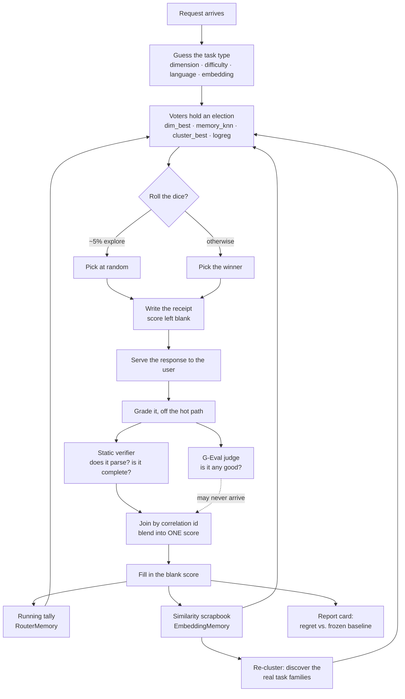

# How Arc Router Learns

**A plain-language walkthrough of how the router records what happened, remembers it, and gets better at
sending the right task to the right model.**

Most model routers ask a fixed question: *"which model is best?"* Arc Router asks a harder one:
*"which model is best **at this**, and how would I know?"* Answering it means keeping receipts, grading
answers, and being honest about the difference between "it ran" and "it was right."

This is that loop, start to finish.

---

## The help desk

Imagine you run a homework help desk. Kids bring you all kinds of jobs — *fix this bug*, *write me a
test*, *explain this*. You have several helpers. Some are brilliant but expensive. Some are cheap and
fast. **You don't know who's best at what yet.**

So you keep a notebook.

That notebook is the entire system. Everything below is just the discipline of writing in it honestly.



---

## Step 1 — A job arrives, and the router *guesses* what kind of job it is

Three sticky-notes get attached to every request by a heuristic classifier:

- **dimension** — what *kind* of job this is: `bug_fixing`, `test_generation`, `code_review`,
  `algorithm`, `design`, `explanation`
- **difficulty** — how hard it looks
- **language** — Python? C#?

The router also tries to take a **fingerprint of the meaning** — an *embedding*, a long list of numbers
where *"fix this null crash"* and *"this throws NullReferenceException"* land close together, even
though they share almost no words.

There's a stopwatch on the fingerprint step. If the embedding model isn't warm yet, the request goes
ahead **without** one rather than making a user wait. Nothing is lost — Step 6b comes back for it.

> Source: [`RequestInterceptor.cs`](https://github.com/davidpizon/TotallyHot-ArcRouter/blob/main/src/TotallyHotArcRouter/Proxy/RequestInterceptor.cs)

## Step 2 — Pick a helper by holding a little election

A panel of **voters** each reads the notebook a different way:

| Voter | How it thinks |
|---|---|
| `dim_best` | *"For* bug_fixing *jobs, who has the best average score?"* |
| `memory_knn` | *"Find the most similar past jobs. Who did well on **those**?"* |
| `cluster_best` | *"This job belongs to family #7. Who's best at family #7?"* |
| `logreg` / `llm_router` | Learned predictors over the prompt text |

Each voter either names a model with a confidence, or **abstains**. That second option matters more
than it sounds: a voter that doesn't recognize the job is *allowed to say nothing* rather than being
forced into a low-confidence guess. Votes are multiplied by a configured weight, summed, and the
highest total wins.

**Then, on purpose, the router sometimes rolls dice.**

If you always pick your current favorite, you never discover that the cheap helper got good. So a small
fraction of the time — the *exploration rate* — it picks at random instead.

And it writes down **the odds it had of making that pick**: the *propensity*.

```
normal pick:  (1 − ε) + ε/K
dice roll:    ε/K
```

That number is an honesty label. It lets every later calculation un-bias itself: *"I picked this model,
but I only had a 5% chance of doing so — don't over-count this result."* Without it, a router that
explores would slowly poison its own statistics.

> Source: [`OrchestratorRoutingPolicy.cs`](https://github.com/davidpizon/TotallyHot-ArcRouter/blob/main/src/TotallyHotArcRouter/Router/Orchestrator/OrchestratorRoutingPolicy.cs)

## Step 3 — Write the receipt *before* knowing whether it worked

One row goes into the transcript store the moment the response is served:

> correlation id · timestamp · model requested · model actually used · dimension · difficulty ·
> language · prompt text · response text · cost · input/output tokens · **was this exploratory** ·
> **propensity** · **which model the frozen baseline would have picked** · **score = blank**

The score is blank because **the answer hasn't been graded yet**. The receipt is filed immediately;
grading happens off to the side. The user never waits for it.

Two writes per request — insert at request time, update at grade time. That's the whole storage
contract.

> Source: [`TranscriptRecord.cs`](https://github.com/davidpizon/TotallyHot-ArcRouter/blob/main/src/TotallyHotArcRouter/Transcripts/TranscriptRecord.cs) ·
> [`SqliteTranscriptStore.cs`](https://github.com/davidpizon/TotallyHot-ArcRouter/blob/main/src/TotallyHotArcRouter/Transcripts/SqliteTranscriptStore.cs)

## Step 4 — Grade the answer

Two independent graders run — neither of which executes the code. See
[**What "fitness" means**](#what-fitness-means-beyond-cost) below for what they actually measure, and
[**Two graders, one grade**](#two-graders-one-grade) for how their two opinions become a single number.
When that grade arrives, the receipt is found by correlation id and the blank gets filled in.

**Grading can also run later, from the filed receipts themselves.** The live trigger has three limits it
cannot escape: a response dropped because the grading queue was full is never graded *at all* — and the
queue fills under load, exactly when the evidence is most valuable; changing how grading works only
affects traffic from that moment on, so comparing two ways of grading means waiting weeks; and the queue
drops work rather than deferring it, so there is no way to grade more cheaply by grading later.

So a background sweep re-reads the saved receipts — which kept the prompt *and* the response — regrades
them, and writes the result back onto the row. Rows the live path never got to are picked up. Change the
grading rules and bump `Quality:ScorerVersion`, and the whole filing cabinet is re-marked under the new
rules, so the old and new way of grading can be compared on the *same* answers rather than on different
months of traffic.

One deliberate limit: **the sweep writes only to the receipt, never to the tally sheet.** Drawer A in
Step 5 keeps a running sum and count, so re-grading an answer that was already counted would count it
twice — the router would believe it had twice as much evidence as it does, and the inflation would be
invisible in the resulting average. That is the same miscount
[**Two graders, one grade**](#two-graders-one-grade) exists to prevent, and a second writer would undo
it. The sweep produces a re-markable *corpus*; letting any of those marks reach the tally sheet is a
separate decision.

## Step 5 — File the grade into two memory drawers

One grade — already joined from both graders — fans out to several listeners at once.

**Drawer A — the tally sheet.** A running average per *(task type, model)* pair. Just a sum and a
count, so it stays small forever no matter how many jobs run through:

```
bug_fixing → model-x → average 0.81 across 340 attempts
```

**Drawer B — the scrapbook.** One entry per job: the meaning-fingerprint, which model ran it, the
score, the cost. Capacity-bounded and FIFO — *"the last N jobs I remember in detail."* Nearest-neighbour
search over this drawer is what powers the `memory_knn` voter.

> Source: [`RouterMemory.cs`](https://github.com/davidpizon/TotallyHot-ArcRouter/blob/main/src/TotallyHotArcRouter/Router/RouterMemory.cs) ·
> [`EmbeddingMemory.cs`](https://github.com/davidpizon/TotallyHot-ArcRouter/blob/main/src/TotallyHotArcRouter/Router/EmbeddingMemory.cs)

## Step 6 — Getting smarter, three different ways

### 6a. Live experience beats the textbook

The `dim_best` voter starts from an offline benchmark as a cold-start prior — a reasonable opinion
before any real evidence exists. But the moment there is **any** real observation for a
*(task type, model)* pair, the live average wins outright. The textbook only fills gaps.

This is a deliberate, documented choice rather than an accident. A sample-size-weighted blend — trusting
the prior more when live evidence is thin — is expressible today and was still declined, because
switching rules changes live routing behaviour and belongs to a change prepared to *measure* the
difference.

### 6b. Nothing gets wasted

Every few minutes, a background service sweeps for receipts that got graded but never got a
fingerprint — the ones where the Step 1 stopwatch expired. It computes the fingerprint now and files
them into the scrapbook.

Training data that a slower machine would simply have dropped gets recovered instead.

> Source: [`EmbeddingBackfillService.cs`](https://github.com/davidpizon/TotallyHot-ArcRouter/blob/main/src/TotallyHotArcRouter/Transcripts/EmbeddingBackfillService.cs)

### 6c. It invents its own task categories

This is the interesting one.

Those hand-written labels — `bug_fixing`, `algorithm` — are somebody's guess about how coding work
divides up. They might be wrong.

So the router periodically takes every remembered fingerprint and runs **spherical k-means** over them.
It sweeps a range of *k* and lets the data decide how many natural task-families actually exist. Each
resulting cluster gets named from its most distinctive terms. The `cluster_best` voter then routes by
*"which family is this?"* — the router's own discovered taxonomy — instead of *"which label did the
keyword matcher guess?"*

The guardrails here are strict, and they're the reason to trust the result:

- If the embedding model changes, every stored fingerprint now describes a **different coordinate
  space**. The voter **abstains** rather than scoring against meaningless centroids, and the trainer
  refuses to average incomparable vectors together.
- If a task isn't similar enough to any centroid, that's an abstention too. *"I don't recognize this
  kind of job"* is a legal, designed answer — not a forced low-confidence guess.

> Source: [`ClusterTrainingService.cs`](https://github.com/davidpizon/TotallyHot-ArcRouter/blob/main/src/TotallyHotArcRouter/Router/Orchestrator/ClusterTrainingService.cs) ·
> [`ClusterBestVoter.cs`](https://github.com/davidpizon/TotallyHot-ArcRouter/blob/main/src/TotallyHotArcRouter/Router/Orchestrator/ClusterBestVoter.cs)

## Step 7 — The report card

A background service replays receipts and asks the only question that really matters: **did the smart
ensemble actually beat the simple baseline?**

This is why every receipt stores which model the frozen baseline *would* have picked — the
counterfactual. The comparison is scored as *regret*:

```
routed reward    = ε₁ · observed score  + ε₂ · actual cost
baseline reward  = ε₁ · predicted score + ε₂ · counterfactual cost

regret = baseline reward − routed reward     // positive means the router lost
```

When the router happened to pick the same model as the baseline, the baseline's prediction is computed
**leave-one-out** — with that observation removed — so it isn't graded on evidence it has already been
fed. The router does not get to mark its own homework.

> Source: [`TaxonomyComparisonService.cs`](https://github.com/davidpizon/TotallyHot-ArcRouter/blob/main/src/TotallyHotArcRouter/Transcripts/TaxonomyComparisonService.cs)

---

## What "fitness" means beyond cost

Cost is the easy metric — it's printed on the invoice. The hard question is whether the answer was any
good. Two independent graders answer it, and **neither one looks at price**.

### Grader 1 — "Does it hold up when you read it?"

Code in the response is extracted and **parsed** — never run. The evidence collapses into a score between
0 and 1 over two axes.

**s_syntax** is 1 if it parses, 0 if it doesn't. But with one twist that matters: the router tracks
*whether it actually knows*. C# is parsed with Roslyn and JavaScript/TypeScript with Acornima — real
parsers, real verdicts. Python and shell get a bracket-balance heuristic, because no in-process parser for
them exists on .NET. So those verdicts are **flagged as non-authoritative and weighted at half**. A
bracket count is not a compiler's opinion, and pretending otherwise would quietly inflate every Python
score the router learns from.

**s_analysis** is where the interesting judgement lives — four checks, each of which may *abstain*:

| Check | Looking for | Why it matters |
|---|---|---|
| **Placeholder** | `TODO`, `// ... rest of the implementation ...`, `NotImplementedException`, bare `pass` | A stub parses perfectly. Under a syntax-only score it grades identically to a real answer. |
| **Truncation** | unterminated string or comment, last line ending mid-expression | Distinguishes "wrote bad code" from "ran out of output tokens" — different failures, and only the first is the model's fault. |
| **Diagnostics** | Roslyn warnings, below the error line | Parsing clean and parsing *well* are not the same thing. |
| **Complexity** | nesting depth, branch density | A gentle nudge, floored at 0.5 — a hard algorithm is *supposed* to branch. |

Placeholder detection is the most valuable of the four. It catches the specific way a weaker model fails:
handing back a confident, well-shaped skeleton with nothing inside it.

**Abstention is a first-class answer here too.** An analyzer with no opinion — the complexity check on a
three-line snippet, the C# diagnostics check on Python — returns nothing, and its weight is **dropped from
the calculation** rather than counted as a zero. The same applies to the judge below. This is the single
most important rule in the scorer: *"I couldn't measure this"* must never look like *"this scored badly."*

> Wondering why it doesn't just execute the code and see what happens? That used to be exactly what it
> did. See [**Why not just run it?**](#why-not-just-run-it) below.

The weights are **per task type**: `code_understanding` leans almost entirely on the judge, while
`code_completion` — short, structural — leans on syntax.

> Source: [`QualityScorer.cs`](https://github.com/davidpizon/TotallyHot-ArcRouter/blob/main/src/TotallyHotArcRouter.Quality/Scoring/QualityScorer.cs) ·
> [`StructuralParser.cs`](https://github.com/davidpizon/TotallyHot-ArcRouter/blob/main/src/TotallyHotArcRouter.Quality/Parsing/StructuralParser.cs) ·
> [`PlaceholderAnalyzer.cs`](https://github.com/davidpizon/TotallyHot-ArcRouter/blob/main/src/TotallyHotArcRouter.Quality/Analysis/PlaceholderAnalyzer.cs)

### Grader 2 — "Is it any *good*?"

Parsing is not the same as being right. **Perfect nonsense compiles fine.**

So the response also goes to a cheap judge model with a rubric written specifically for that task type:

- **bug_fixing** — does it fix the defect *without introducing new ones or changing unrelated
  behaviour*?
- **test_generation** — *would these tests actually fail on a broken implementation?*
- **code_review** — does it find real issues *and avoid flagging non-issues*?
- **algorithm** — sound approach, correct edge cases, reasonable complexity?

The judge returns a single digit, 1 to 5. Then comes the clever part: rather than trusting the one digit
it happened to sample, the router reads the **token probabilities** and computes a probability-weighted
mean, normalised to 0–1. A judge torn between 3 and 4 scores 3.5 — not a coin flip.

This runs **entirely off the hot path**, on a bounded queue that *drops work when full* rather than
making anyone wait. The rule is absolute: the routing path never blocks on judging.

The judge used to be a bystander — its scores were recorded for comparison and never touched routing. It
is not any more. With execution gone it became one of the two graders the router actually learns from, so
it now turns itself **on by default** whenever a free model is available to run it. (An operator who
switches it off stays switched off, however many free models turn up later.)

That promotion created a counting problem worth explaining, because the fix is the least obvious part of
this whole system.

> Source: [`GEvalJudgeClient.cs`](https://github.com/davidpizon/TotallyHot-ArcRouter/blob/main/src/TotallyHotArcRouter/Judge/GEvalJudgeClient.cs) ·
> [`JudgeShadowScoreQueue.cs`](https://github.com/davidpizon/TotallyHot-ArcRouter/blob/main/src/TotallyHotArcRouter/Judge/JudgeShadowScoreQueue.cs)

### So where does cost actually come in?

Worth being precise, because it's a genuine design decision and not an obvious one.

**The live vote is cost-blind.** `dim_best`, `memory_knn`, and `cluster_best` all rank purely on
*quality score*. None of them looks at price.

Cost enters in exactly two places, both of them **accounting** rather than **selection**:

1. The reward function `r = ε₁·score + ε₂·cost` used by the offline evaluation harness.
2. The live regret report card described in Step 7, using that same formula.

In other words: **the router chases quality, then measures whether that was worth the money.** Making
cost a first-class vote would be a change in behaviour, not a change in wiring.

---

## Two graders, one grade

The tally sheet in Step 5 stores a **sum and a count** per (task type, model) pair. So if both graders
wrote their own score, a judged request would be counted **twice** — and the router would come to believe
it had twice as much evidence about that model as it really does. Worse, it would be averaging two
different scales together.

That is a subtle, invisible kind of wrong. The average still looks plausible; it is just quietly built on
a miscount.

So the two grades are **joined** before either is written. The static verdict is computed immediately and
then *held*, filed under the request correlation id, waiting for the judge. When the judge answers, the
two are blended and **one** score is written. If the judge never answers — it is switched off, no free
model is available, the response text aged out, or a minute goes by — the held static score is written on
its own, and the judge share of the weight is dropped rather than counted as zero.

The guarantee is enforced by a race rather than a flag: every path that wants to write must first *remove*
the held entry, and only the winner writes. A second write is not unlikely — it is impossible.

One deliberate detail: when the holding table fills up, the oldest entry is still **written**, not
dropped. Losing a score the verifier had already computed would be worst exactly when the router is
busiest and most needs the evidence. Only the judge contribution is forfeited.

> Source: [`QualityScoreAggregator.cs`](https://github.com/davidpizon/TotallyHot-ArcRouter/blob/main/src/TotallyHotArcRouter.Quality/Grading/QualityScoreAggregator.cs)

---

## Why not just run it?

Because running code a language model just wrote is a risk this project decided not to take.

It used to. An earlier version of Grader 1 **executed** the extracted snippet — inside a Linux jail with
an empty network namespace, a deny-by-default syscall allowlist, memory and CPU and process-count caps,
and a three-second wall clock, escalating to a Firecracker microVM with its own kernel when the syscall
filter fired. It scored what happened: clean exit, non-zero exit, timeout, out-of-memory kill.

All of that worked. It was removed anyway.

The isolation was real but it was not a guarantee, and it was a *lot* of machinery whose only purpose was
to make an inherently dangerous act survivable — a kernel shared with the host at the fast tier, user
namespaces with their own CVE history, and all of it running on the operator own machine rather than on
disposable infrastructure. "This raises the cost of an escape substantially" is a fair claim. It is not
the same as "this cannot hurt you."

So the answer is now structural rather than defensive: **there is no code path that can execute model
output.** The verifier assembly has no process launch in it, and the two parsers it uses have no
evaluators attached — the JavaScript one is deliberately a well-known interpreter parser taken *without*
the interpreter. Nothing needs to be configured correctly for this to hold.

**What that costs, stated plainly:**

- *"It compiled, ran, and exited cleanly"* was the strongest signal available, and it is gone. The judge
  partially compensates. It does not replace it.
- Python and shell lost their real syntax check — it used to be a subprocess that actually tried to parse
  them. They now get a heuristic, marked as such and weighted at half.
- What is left cannot tell you the code is *correct*. It can tell you it parses, that it is not a stub,
  that it is not cut off, and what a judge model thinks of it.

The upside beyond safety: the pipeline is now identical on every operating system. There is no capability
probe, no Linux-only path, and no "degraded mode" — Windows and Linux run exactly the same verifier.

## Honest gaps

A system that grades itself should be candid about what it doesn't yet measure.

- **Nothing here proves correctness.** The verifier can tell you code parses, is not a stub, and is not
  truncated; the judge can tell you a model opinion of it. Neither is a test suite. For live traffic
  there is no ground truth to check against, and this document should not be read as claiming otherwise.
- **Python and shell are graded on a bracket count.** No in-process parser exists for them on .NET, so
  their syntax verdict is a heuristic. It is flagged and weighted at half rather than hidden, but it is
  still the weakest link in the static axis.
- **The judge grades what it grades.** Probability-weighted G-Eval is a real improvement over sampling one
  digit, but it is still one model opinion of another work, with whatever blind spots that implies.
- **The graders still cannot see the question.** The prompt now travels with the request as far as the
  grader (and the saved-receipt sweep above supplies it for history too), but nothing *reads* it yet: the
  parser checks the code, and the judge is handed the answer alone. So a complete, well-formed, entirely
  correct-looking snippet that answers a **different question** still scores as well as one that answers
  this one. The plumbing is in place; the graders that use it are not built yet.
- **The judge calibration against the static grader is not yet analysed.** Both scores are recorded side
  by side in `judge_shadow_scores` for exactly that purpose. The analysis has not been done.

---

## The one-line version

Every request leaves a receipt. A parser and a rubric-judge grade the answer — without ever running it —
and their two opinions are joined into exactly one score. That score lands in a running tally and a
similarity scrapbook, and those two drawers are what the voters read next time.
Every so often the router re-clusters its own memory to discover what the task categories *really* are —
while a report card keeps score against the frozen baseline, so improvement is something you can prove
rather than something you assume.
