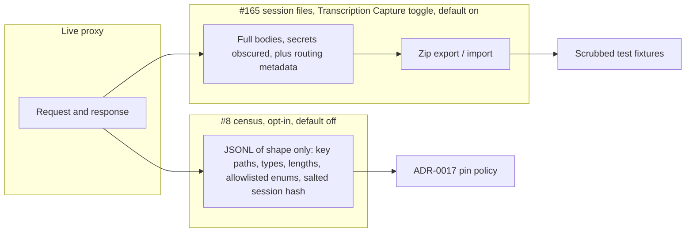

# Plan: Export and import agent conversation history (#165)

**Status:** Proposed. Awaiting David's approval. No implementation in this change.
**Issue:** [#165](https://github.com/davidpizon/TotallyHot-ArcRouter/issues/165) — "Feature: Export/import full agent conversation history as a zip file".
**Related:** [`tracked-todos.md` #8](../router/tracked-todos.md#8-capture-and-analyze-real-claude-code-and-codex-traffic-before-deciding-adr-0017s-pin-policy) (live, content-free traffic census).
**ADR-0008 Amendment 1:** Binding. This plan adds a feature and does not schedule a smell audit. It does not change `ManagementFacade`.

It does change the proxy hot path (ADR-0019), so ADR-0008's hub safety rules and the golden-path smoke test apply:
- `RequestInterceptor` keeps the raw request bytes before decoding them;
- the response copy loops keep an uncapped copy;
- both feed the existing post-response writer.

**Amended 2026-09-30:** to match [ADR-0019](../adr/0019-store-conversation-text-in-encrypted-per-session-files.md), which records David's storage and privacy decisions of that day. Sections changed:
- Prerequisite;
- §1 Export and §2 Import;
- §3's redaction rules and §4's comparison;
- §5 Phasing and §6 Test strategy;
- §7 decisions 1–8 and 10–12, which are decided (11 and 12 are new), and decision 9, which is deferred.

§2 also now records David's import rules: timestamps, skipping or filling in existing sessions, keeping the local copy on conflict, and the session checksum.

David's request, exact words:

> I would like to have a mechanism where the entire conversation history of agent requests and responses is exportable as a zip file, and importable as a zip file, so that I can export the conversations and build a larger dataset for, so that I can write better tests.

David's requirement, 2026-09-30, exact words:

> Important: I want the application to store the full session text. When the application imports or exports transaction history (https://github.com/davidpizon/TotallyHot-ArcRouter/issues/165), it must always import and export the full, unadulterated, transaction text. However, the application does not need to display the conversation in the "Sessions" tab, a truncated or load-on-demand version of the task text is permissible and actually preferred to remain performant.

Later the same day:

> Allow secrets and key-shaped strings to be obscured when written to the file storage. This will mean that session data will not have secrets when imported or exported.

## What is stored today

**Full request and response bodies are not stored.** Nothing on disk can reconstruct the HTTP request a harness sent or the HTTP response the client received. An export of today's tables would be a metadata-and-extract archive, not a replayable conversation.

Durable stores, and what each one actually keeps:

| Store | File / table | What is kept | What is absent |
|---|---|---|---|
| Transcript store | `transcripts.db` → `request_transcripts` (`TranscriptDatabase`, `SqliteTranscriptStore`) | Newest user-message **text** (`prompt_text`), extracted assistant **text** (`response_text`), correlation id `{sessionId}:{turn}`, `session_id`, timestamps, requested model, routed model, heuristic dimension / difficulty / language / utility, score, estimated cost, exploratory flag, propensity, input/output token counts, `memory_entry_id`, `dim_best_model`, untrained-baseline model and predicted score, `is_judge_scored`, `scorer_version` | Raw JSON, system prompt, prior turns, tool definitions, tool calls and tool results, images, reasoning / thinking blocks, headers, harness, provider, resolved provider model id, cache tokens, HTTP status, latency, streaming flag, substitution reason |
| Usage ledger | price-catalog SQLite → `usage_ledger` (`UsageLedger`) | `session_id`, `turn_number`, provider, requested model, resolved model, prompt / completion / cache-creation / cache-read tokens, estimated cost, `cost_confidence`, `occurred_at_utc`, dedup key | Any body or text. No status, latency, or harness |
| Learned memory | `memory_entries` (`MemoryEntry`) | Embedding vector, chosen model, score, cost, verifier trace, exploratory provenance | Prompt and response text |
| Live telemetry | in-memory `RoutingTelemetryEvent` only | The fields above plus fallback, streaming, latency, duration, status, substitution reason, router tokens/cost, and summaries truncated to 2,000 characters (`TextTruncator.DefaultMaxLength`) | Not written to SQLite. Lost on process exit |
| Debug logs | Serilog, `[INTERCEPTOR] Intercepted agent request/response message` | A copy of the body capped at **4,000** characters (`RequestInterceptor.MaxLoggedBodyLength`, `LogRedaction`) | Not a store. Newlines stripped. Unsuitable as a dataset |
| Response capture buffer | `UpstreamResponseWriter.MaxCapturedResponseBytes` = **4 MiB** | Bytes held in memory long enough to parse usage and extract reply text, then discarded | The buffer is not persisted. A larger body is truncated before extraction, and extraction then often yields nothing |

How the transcript text is produced:

- `RequestTextExtractor.ExtractNewestUserMessage` walks `messages` from the end and returns the latest `role: "user"` text. `MessageContentTextExtractor` keeps `type: "text"` parts and drops images, `tool_use`, and other blocks. A Responses-API body (`input` items, no `messages` array) yields **null** `prompt_text`.
- `ResponseTextExtractor` pulls assistant text out of the capped buffer (OpenAI or Anthropic shape, streaming or not). Tool-only replies yield **null** `response_text`. The stored string is the extracted text, not the 2,000-character live-summary truncation.
- The request the router forwards is not the client's bytes. `RequestInterceptor.ResolveModelRouteAsync` decodes the body as UTF-8 text, and `RequestBodyIntrospection` forwards `jsonObject.ToJsonString()`.
  - That strips whitespace and escapes non-ASCII and `<>&'+` characters, so a 117-byte sample became 162 bytes.
  - Decoding also replaces invalid UTF-8.
- Writes happen in `RequestTelemetryPublisher.PersistTranscriptAsync` only when `Transcript:Enabled` is true (default **on**) **and** `Routing:EnableAdaptiveRouting` is true (default **on**). Retention then deletes rows older than 30 days or past 50,000 rows (`TranscriptOptions`). "Entire history" today means whatever that purge has not removed.
- `taxonomy_comparisons` is a derived routing-evaluation table. It is not conversation content.

Existing "export" and "replay" machinery does not cover this:

- `UsageAdminService.ExportUsageRollup` streams aggregated `usage_rollup` buckets (counts, tokens, cost). No conversation text.
- `TelemetryService.ListPersistedSessions` returns recent `prompt_text` / `response_text` rows for the Sessions tab, capped by the caller's limit. It is a UI read, not an archive.
- `RouterSettings` `ClearTranscripts` wipes `request_transcripts`. There is no import.
- CodeRouterBench (`benchmark_id_tasks`, `benchmark_ood_tasks`) stores the published Hugging Face corpus. `raw_json` has a benchmark `prompt` string. Sync replaces those tables. The regret harness replays that corpus (`--run-regret-harness`). It does not read live traffic.
- `RecordedModelTranscripts` / `RecordedStreamTranscripts` are hand-recorded translation fixtures checked into the test project. They are the closest pattern for "a real reply, replayed in a test," and they hold a full response envelope because a human put it there.

The host binary already has one-shot flags (`--sync-benchmark-data`, `--run-regret-harness`, `--export-ca`, …) stripped in `Program.Main` before configuration binding. There is no general CLI framework. Admin gRPC is loopback, and the Governance tab is nine sub-views reached from the dashboard (`docs/gui/dashboard.md`). Transcription capture and Clear live in System Settings, not on a Governance pane.

## Prerequisite: capture the bodies

Export can only package what was kept. Shipping a zip of `prompt_text` / `response_text` would not let David replay an agent turn (missing system prompt, history, tools, tool results, and the response envelope). **Capturing full bodies is a prerequisite**, not a follow-up.

[ADR-0019](../adr/0019-store-conversation-text-in-encrypted-per-session-files.md) decides how the bodies are stored. This section applies it.

**Store.**
- Each session is one encrypted, compressed file, indexed by `transcripts.db`. The database keeps no conversation text.
- There is no separate archive store. The session files are the conversation record for the Sessions tab, the learning jobs, and this export.
- Do not fold raw JSON into `request_transcripts.prompt_text`, which embedding backfill, quality rescan and cluster naming treat as plain task text. The per-turn text extracts live in the session file instead.

**What each turn stores:**

- `archive_turn_id` — ID minted when the turn is captured, unique across machines (decision 6). It is a version 7 UUID: random apart from a time prefix, so ids also sort by capture time. This is the stable identity. SQLite `rowid` and `correlation_id` are not: row ids differ per install, and session ids can collide across machines.
- `archive_session_id` — UUID minted when the session's file is created. It identifies the session across machines, where `session_id` can collide, and import matches existing sessions on it (§2).
- **The client's exchange.**
  - The request bytes exactly as the client sent them, taken before `RequestInterceptor` decodes them.
  - The response bytes exactly as relayed to the client, with no size cap. Today's 4 MiB telemetry capture stays as it is, and the full copy is taken alongside it.
  - Record `content_encoding` (`json` or `sse`).
- **The provider-side request and response**, only when a translator ran (Gemini always; Anthropic when translated), because only then do they differ from the client's exchange.
- **The per-turn text extracts** that the learning jobs and the Sessions tab read: the newest user message and the reply text.
- A metadata snapshot taken at that moment, so export does not join `usage_ledger` later (the ledger has its own retention and can drop the row): provider, requested model, routed model, resolved provider model id, substitution reason, fallback, exploratory, propensity, classification labels, score, scorer version, judge-scored flag, token counts including cache tokens, estimated cost, cost confidence, HTTP status, latency, duration, streaming flag, session synthesized flag, `session_id`, turn number, `correlation_id`, `created_at_utc`.
- Normalized harness only: allowlisted product token plus version (the same rule #8 specifies for `User-Agent`). Any other agent is `other` plus the header's length. The raw `User-Agent` is not stored.
- `origin` = `captured`. Imported rows use `imported` (see Import).

**Rules from ADR-0019:**

- **Secrets.** Secrets and key-shaped strings are obscured before any byte is written, on capture and on import. Nothing else about the text changes.
- **No truncation.** A body is complete or absent, never a prefix. A capture that can't complete is recorded as missing.
- **Capture control.** On by default, controlled only by the Transcription Capture toggle. It no longer also requires Adaptive Routing. When capture is off, no session file is created and the hot path makes no second copy of the body.
- **Retention.** Keep the newest N turns, where N is the Sample Size setting (default 20,000). The oldest whole sessions are deleted first. There is no age or size limit.
- **Deletion.** Deleting a session destroys its key, then deletes its file, its index rows and its learned embeddings.
- **Writes.** Writes go through ADR-0018's background writer, off the request path. Failures are logged with a static Serilog template and never fail the proxy response.

**Existing data.**
- `request_transcripts` keeps its metadata rows but loses its text. The upgrade deletes the text without migrating it, and the learning jobs read extracts from session files from then on.
- `usage_ledger` is unchanged and still feeds cost analytics.

## 1. Export

One code path writes the zip. The CLI and the Sessions tab's Export / Import modal call it; they do not format the zip themselves.

**Zip layout** (schema version 1):

```text
manifest.json
turns.jsonl
conversations/{session_id}/turns/{turn:D4}.request.json
conversations/{session_id}/turns/{turn:D4}.response.json
conversations/{session_id}/turns/{turn:D4}.provider-request.json    (translated turns only)
conversations/{session_id}/turns/{turn:D4}.provider-response.json   (translated turns only)
```

- `manifest.json`: `schema_version` (integer `1`), `exported_at_utc`, router version, the filter that produced the file, counts (conversations, turns, missing bodies, bytes), a SHA-256 for `turns.jsonl` and for every body entry, and each session's `session_sha256` (§2). Zip CRC32 is incidental; import trusts the manifest hashes.
- `turns.jsonl`: one JSON object per turn, in `(session_id, turn_number)` order.
  - It holds `archive_turn_id`, `archive_session_id`, the metadata snapshot above, the relative paths of the body files, and each body's SHA-256 and length.
  - It also holds `secrets_obscured`, `origin`, and `content_fidelity: "full-body"`.
  - Hashes are computed over the stored bytes, after secrets were obscured at write.
  - This is the index a test harness reads without opening every body.
- Body files: the raw bytes, UTF-8 JSON or SSE, not pretty-printed (pretty-printing would change the hash). A missing body (capture failed, or a pre-archive transcript export if one is ever allowed) is an absent file plus `content_fidelity` set to the real level, never an empty file pretending to be the body.
- Session directory names are the sanitized session id. Characters outside `[A-Za-z0-9._-]` become `_`. The unsanitized id stays in `turns.jsonl`.

**Compression:** Deflate (the `ZipArchive` default). Bodies are already JSON text, so Deflate is where the size win is. Do not gzip the bodies a second time inside the entry.

**Filtering:** optional `from` / `to` (UTC, inclusive), session id, normalized harness, provider, requested model. Default is every session still inside retention. Filters are recorded in the manifest so a later import knows the zip is not "the whole router."

**Size and streaming:**
- Write the zip in `ZipArchiveMode.Create` to a file stream, one entry at a time. Each body is read from its session file, decrypted, and rebuilt from the last snapshot. Do not load the corpus into a `byte[]`.
- `ZipArchive` create-mode is forward-only, which matches export.
- For a multi-gigabyte export the operator gets a path, not an in-memory gRPC message. The GUI's 4 MiB receive cap rules out a single message anyway.
- The gRPC API streams progress (turns written, bytes written) and then a final path or chunked file, following the existing server-stream pattern of `ExportUsageRollup` and `RunRegretHarness`.
- ADR-0019 sets no store size quota. Check free disk space before writing, so a bug cannot fill the disk.

**Where it is exposed:**

- **CLI:** `--export-conversations <path>` on the existing host, stripped in `Program.Main` the way `--export-ca` is, plus optional `--from`, `--to`, `--session`, `--harness`, `--provider`, `--model`. The process writes the zip and exits.
- **gRPC admin:** a new loopback service (admin token, same as the other admin services). Not a new method on `ManagementFacade`, and not a new field on `ExportUsageRollup` — that RPC is cost buckets. Suggested RPCs: `ExportConversations` (server stream of progress, zip written to a caller-supplied path on the router machine) and `ImportConversations` (below). A path on the router machine matches how this process already runs headless jobs; pulling the zip through gRPC chunk-by-chunk is a later option if a remote GUI must download it.
- **Sessions tab (decision 7):** a button at the top of the Sessions tab opens an "Export / Import" modal.
  - The modal is built on `DialogShell`, as every GUI window must be (`AGENTS.md`; `docs/gui/DESIGN.md` §4.1).
  - It shows whether capture is on, session and turn counts, bytes on disk, the Sample Size retention, a filter row, Export, Import with its options, and the list of past imports, each of which can be deleted.
  - It calls the gRPC service.
  - System Settings keeps the Transcription Capture toggle, which controls capture. The modal only exports and imports.
  - #176 is redesigning the Sessions tab, so the button goes into that layout.

## 2. Import

Read the zip from a path. `ZipArchive` read mode needs a seekable file, which a path provides.

**Validation, in order. Stop on the first manifest failure. Skip and count a bad turn; do not abort the rest.**

1. Reject entry names that are absolute, contain `..`, or start with a slash (zip-slip).
2. `manifest.json` exists, parses, and `schema_version` is `1`. Any other version is rejected with a message that names the version. Do not best-effort a newer file.
3. Recompute SHA-256 for `turns.jsonl` always. Recompute a body's SHA-256 only when that body is about to be stored.
   - Bodies of skipped sessions and turns are never read, so re-importing data that is already present costs little.
   - A body whose hash doesn't match rejects that turn.
4. Each JSONL line parses, has `archive_turn_id`, `archive_session_id`, `session_id`, `turn_number`, `created_at_utc`, and paths that stay under `conversations/`. There is no body size limit (ADR-0019). Bodies are streamed, never loaded whole.
5. Unknown extra JSON fields are ignored so a later additive field does not break an older importer. Missing required fields reject the turn.

**Obscuring on write.** Import writes session files, so secrets are obscured exactly as on capture (ADR-0019). A zip made by another machine or an older version may still contain some. If obscuring changes a body, the stored SHA-256 is the new one, and the zip's hash is kept as `source_sha256`.

**Import options** (David, 2026-09-30). The same choices appear wherever import is exposed.

- **Timestamps.**
  - `original` (default): keep each turn's original `created_at_utc`.
  - `import-time`: adopt the moment of import while keeping the original order.
    - Every timestamp of a session new to the history shifts by the same offset. The newest imported turn lands at the import time, and the order and spacing of turns and sessions are unchanged.
    - The original timestamp is kept as `original_created_at_utc`.
    - Turns filled into an existing session keep their original timestamps under either option, so they slot into that session in order.
- **Existing sessions** (default behavior, David, 2026-09-30).
  - Sessions match on `archive_session_id`, and turns on `archive_turn_id`. The router's own `session_id` can collide across machines, so it is never used to match.
  - A session whose turns are all already present is skipped, so importing an identical session changes nothing. `session_sha256` decides this first (below).
  - A partly present session, one whose `archive_session_id` matches, gets only its missing turns filled in.
- **Keep the local copy on conflict** (future option, on by default, David, 2026-09-30).
  - When a turn is present on both sides with different contents, the local copy is kept. That is the conflict table's `skip`.
  - Turned off, the conflict table's `overwrite` or `keep-both` applies instead.

**Session checksum** (decision 12). `session_sha256` is a SHA-256 over the session's turns in turn order, each turn contributing its `archive_turn_id` and its bodies' SHA-256s.
- **What it covers.** Content only. It excludes timestamps and other metadata, which `import-time` changes.
- **Where it lives.** The index keeps it per session and updates it whenever turns are added. Export writes each session's value to the manifest.
- **How import uses it.**
  - Import compares it before anything else. If the values are equal, the session is skipped without reading any of its bodies.
  - If they differ, import compares turn by turn using the recorded hashes, then reads and verifies only the bodies it will store (validation step 3).
- **Previously obscured imports.** A session whose bodies were changed by obscuring during an earlier import won't match on the checksum. The per-turn comparison also accepts a turn's `source_sha256`, so re-importing the same zip still finds nothing to add.

**Timestamps and retention.** Under the default `original`, retention and ordering treat imported sessions like captured sessions of the same age. So a session older than the newest Sample Size turns is deleted at the next retention pass, and the import summary reports how many turns that removed. `import-time` keeps such an import by making it the newest history.

**Conflicts**, keyed by `archive_turn_id`:

| Mode | Behavior | Default |
|---|---|---|
| `skip` | Leave the existing row. Count it as already present | **Yes** |
| `overwrite` | Replace bodies and metadata for that id. Keep the original `archive_turn_id` | Flag |
| `keep-both` | Insert a second row with a new local id and the same `archive_turn_id` recorded as `source_archive_turn_id`. A later `skip` import still matches the original id and does not insert a third copy | Flag |

**Storage:**
- Imported turns become session files and index rows marked `origin = imported`, with `imported_at_utc`.
- **They feed learning like captured turns (decision 3).**
  - They are embedded and added to `memory_entries`.
  - They keep the scores they arrive with. Only turns without a score are graded, so an import doesn't pay to re-grade what was already graded.
- **They never affect spend, savings or ROI metrics** (David, 2026-09-30).
  - They don't enter `usage_ledger`, provider spend or budgets, because the router didn't serve them.
  - They never produce `taxonomy_comparisons` rows, so the Routing ROI chart and estimated savings ignore them.
  - Every spend or savings total skips rows marked `origin = imported`.
  - An imported session can still show its own recorded cost in its details.
- **They appear in the Sessions tab**, marked as imported (decision 3).
- **They never feed the CodeRouterBench benchmark tables** (decision 8). Those stay published data.
- **The Export / Import modal lists imports** and can delete one.
- Imports count toward retention by their stored timestamps (decision 11).

**Idempotency:** importing the same zip twice under `skip` is a no-op after the first success. The unique key is `archive_turn_id`. A crash mid-import leaves a partial set; re-running `skip` fills the gap without duplicating. Import runs in one SQLite transaction per batch (for example 100 turns) so a process kill loses a batch, not the whole file, and does not hold a multi-gigabyte transaction.

## 3. Purpose: larger test datasets

The zip is the hand-off. It is not itself a test project, and it does not sync into CodeRouterBench (decision 8).

- A small offline reader (a test helper, not a router hot-path type) opens `turns.jsonl` and yields `(metadata, request bytes, response bytes)`.
- Tests that already replay a recorded envelope — tool-call translation (`RecordedModelTranscripts`), response-text and usage parsers — can take a scrubbed turn from that reader instead of a hand-pasted string.
- New tests for harness dialects (Claude Code `messages` plus tools, Codex `input` items) load a directory of scrubbed turns checked in only after review. The regret harness and `benchmark_*` tables stay on the published corpus. Their sync deletes and replaces rows; pointing it at a conversation zip would wipe the benchmark.
- The converter that emits a fixture directory lives next to the test project. It copies bodies out and refuses to write under the repository root unless the operator passes an explicit fixture path outside the tree. CI does not download or import a zip.

**Privacy and redaction**

- The archive exists to keep user content. That content includes source code, paths, and anything the operator pasted. The zip is an operator artifact. It is not committed, not attached to a PR, and not uploaded by the app.
- **Headers are never stored**, apart from the normalized harness token. `Authorization`, `x-api-key`, `api-key`, and any header whose name contains `key`, `token`, or `secret` never reach a session file or a zip.
- **Secrets are obscured once, when written.** This covers secrets and key-shaped strings in bodies and text extracts, on capture and on import (ADR-0019). Export writes the stored bytes unchanged.
  - Starting shapes: `sk-`, `sk-ant-`, `ghp_`, `github_pat_`, `AKIA`, `xoxb-`, `xoxp-`, and PEM blocks. The full list and the marker format belong to the implementation.
  - Non-secrets that match, such as fake keys in code and test fixtures, are obscured too.
  - The turn records `secrets_obscured`.
- **A unit test plants each shape** in a message string, a tool-argument string, a streamed reply split across SSE events, and an imported zip. It asserts that none of them reaches a session file or an exported zip.
- **There is no content-free export mode.** David requires every export to carry the full text (2026-09-30), so the former `--redact-content` mode is dropped.
- Imported rows feed the same learning jobs as captured ones: `EmbeddingBackfillService`, `QualityRescanService` (unscored turns only), and the logreg and cluster trainers (decision 3).

## 4. How this relates to tracked-todos #8

#8 and #165 both look at real Claude Code and Codex traffic. They answer different questions and must not share a store, a flag, or a writer.



| | #8 census | #165 archive |
|---|---|---|
| Question | How often do harness requests carry pin-worthy fields? | What did this conversation actually contain, so a test can replay it? |
| Content | None. Strings become lengths. Keys inside tool arguments and `metadata` become `*` | Full bodies, with secrets obscured at write |
| When | Live, one line per request, during the capture window #8 specifies | Live capture into session files, then an offline zip whenever the operator asks |
| Opt-in | Its own flag, default off, left off after the study | The Transcription Capture toggle, default on |
| Output | `docs/router/harness-traffic-census.md` and a local JSONL that is not a zip of prompts | A zip on disk. Nothing in the repo until a human scrubs a fixture |
| Identity | Salted hash of the session id, salt not written out | Stable `archive_turn_id` plus the real session id, because the operator is exporting their own machine |

Rules so they do not collide:

- Capture does not write census lines. Enabling the census does not write bodies.
- The census stays content-free after #165 exists. #165 does not relax #8's acceptance test (a planted secret must not appear in census output).
- #8's optional "≤ 20 raw bodies, outside the repo, scrubbed by hand" can be **chosen out of a #165 zip** and then scrubbed. That is a manual step. The census writer still does not store those bodies, and a #165 zip is not committed to satisfy #8.
- Normalized harness names use the same allowlist in both, implemented as a pure function each writer calls. Do not route archive bytes through the census serializer to "reuse" it.
- Neither feature changes ADR-0017's pin decision by itself. #8 still has to hit its session and request minimums before that ADR merges.

## 5. Phasing

1. **Session store and capture (ADR-0019).**
   - The session file format and per-session keys held the ADR-0015 way.
   - The admin-only folder, checked at startup.
   - Compression, obscuring, and the ADR-0018 writer.
   - On the hot path: raw request bytes taken before decoding, and uncapped response copies. ADR-0008's hub rules and the golden-path smoke test apply.
   - No zip yet.
   - Exit:
     - capture off writes nothing;
     - capture on round-trips request and response bytes exactly, including a response over 4 MiB and a translated turn's provider-side bodies;
     - planted secrets are obscured;
     - deleting a session leaves nothing decryptable.
2. **Text moves off `transcripts.db`.**
   - The learning jobs and `ITranscriptStore`'s text reads switch to session files.
   - The Sessions tab reads text from session files on demand.
   - The upgrade deletes the old text.
   - Retention switches to Sample Size, deleting whole sessions.
   - Learned embeddings are deleted with their session.
   - Exit: `transcripts.db` holds no conversation text, and neither do its freed pages.
3. **Export.** Zip writer, CLI flag, gRPC stream, and the Sessions tab's Export / Import modal with Export only. Exit: a fixture corpus exports to the layout above and the manifest hashes match.
4. **Import.**
   - Validation, obscuring on write, `skip` / `overwrite` / `keep-both`, `origin=imported`, idempotent re-import.
   - Both timestamp options, skipping or filling in existing sessions, and "keep the local copy on conflict".
   - The session checksum, and body verification only for bodies being stored.
   - Exit:
     - importing a secret-free corpus into an empty store reproduces the source;
     - a second import under `skip` adds zero rows;
     - a tampered byte fails that turn;
     - `original` keeps the source timestamps, and `import-time` keeps the source order;
     - an identical session imports nothing, and a partly present one gains exactly its missing turns;
     - re-importing a zip that is already fully present reads none of its body entries.
5. **Test helper.** Reader plus one scrubbed-fixture test on an existing parser or translator. No change to CodeRouterBench sync or the regret harness.

Phase 3 can ship before phase 4. Phase 5 is what makes the zip useful for tests; it does not block export.

## 6. Test strategy

Unit tests, each well under the 5-second ceiling. No live provider, no GUI browser pass until the Export / Import modal exists (phase 3). Then add a bUnit test of the modal, plus one manual click against a local router.

- **Capture control.** With the Transcription Capture toggle off, a completed proxy request leaves no session file. With it on and Adaptive Routing off, the turn is captured.
- **Capture on.** Request bytes, response bytes, provider, models, tokens, and harness token match the fixture.
  - A Responses-API `input` body is stored whole (today it would not even produce `prompt_text`).
  - The stored request equals the client's bytes exactly, including whitespace, non-ASCII, `<>&'+` and invalid UTF-8.
  - A response over 4 MiB is stored whole.
  - A translated turn also stores its provider-side request and response.
- **Obscuring.** The shapes in section 3 are absent from session files, text extracts and zips.
- **Compression.** Compression and snapshots round-trip byte-exact, including the first turn after a restart.
- **Deletion.** After a session is deleted, a copy of its file cannot be decrypted, and its `memory_entries` are gone.
- **Retention.** Going over Sample Size deletes the oldest whole sessions.
- Export filter: a date window and a harness filter select the right turns and the manifest records the filter.
- Streaming bound: exporting many small turns writes incrementally (assert the writer is invoked per turn, using a fake body store).
- Import: bad version, bad hash, zip-slip name, and malformed JSONL line each take the path in section 2. `skip` is idempotent. `overwrite` replaces bytes. `keep-both` does not grow on a second `skip`.
- Import timestamps:
  - `original` keeps every turn's `created_at_utc`.
  - `import-time` shifts every timestamp of a new session by one offset, keeps order and spacing, and records `original_created_at_utc`.
  - Under `original`, a session older than the retention window is removed at the next pass and counted in the import summary.
- Existing sessions:
  - an identical session imports nothing;
  - a partly present session (same `archive_session_id`) gains exactly its missing turns, which keep their original timestamps even under `import-time`;
  - a matching router `session_id` from another machine, with a different `archive_session_id`, is not treated as a match.
- Session checksum:
  - an identical session is skipped without opening any of its body entries (the test counts entry reads);
  - one changed turn makes import fall back to per-turn comparison;
  - timestamps changed by `import-time` leave `session_sha256` unchanged.
- Keep the local copy on conflict:
  - on, the default: a differing turn keeps the local copy;
  - off: the turn is replaced (`overwrite`) or both copies are kept (`keep-both`), per the mode.
- Imported sessions:
  - appear in the Sessions tab, marked as imported;
  - feed embedding backfill and memory, and only unscored turns are graded;
  - never enter `usage_ledger`, provider spend, budgets, `taxonomy_comparisons` or the benchmark tables, so an import leaves spend, savings and ROI totals unchanged;
  - disappear with their session.
- Census isolation: with both flags on in a test host, the census sink receives no prompt text and the archive sink receives no census line. Until #8's writer exists, the test stubs the census sink.

## 7. Decisions needed from David

1. **Is a zip of today's `prompt_text` / `response_text` acceptable as a first milestone?** **Decided (David, 2026-09-30): no.** Export must carry the full transaction text.
2. **Archive location and defaults.** **Decided (David, 2026-09-30; ADR-0019):**
   - one encrypted, compressed file per session, indexed by `transcripts.db`;
   - capture follows only the Transcription Capture toggle, default on;
   - retention keeps the newest Sample Size turns, deleting whole sessions;
   - no per-body cap.
3. **Does import restore Sessions-tab history and learning rows?** **Decided (David, 2026-09-30): yes.** Imported sessions appear in the Sessions tab, marked as imported, and feed learning. They never affect spend, savings or ROI metrics (§2).
4. **Conflict policy default.** **Decided (David, 2026-09-30):**
   - A differing turn keeps the local copy. This is a future import option, "keep the local copy on conflict", on by default; turned off, `overwrite` or `keep-both` applies.
   - By default, identical sessions are skipped, and partly present ones, matched on `archive_session_id`, are filled in (§2).
5. **Content in the default zip.** **Decided (David, 2026-09-30):** full content, with secrets and key-shaped strings obscured at write. There is no content-free mode. Zips are never committed.
6. **Stable identity.** **Decided (David, 2026-09-30):** each turn is identified by an ID created when it is captured, unique across machines. That is `archive_turn_id`, a version 7 UUID; sessions get `archive_session_id` the same way. Never key on SQLite row id or on `correlation_id` alone.
7. **Where the button lives.** **Decided (David, 2026-09-30):**
   - A button at the top of the Sessions tab opens an Export / Import modal built on `DialogShell`.
   - The CLI flags and one gRPC service stay.
   - Not a new `ManagementFacade` method, and not an extension of `ExportUsageRollup`.
8. **May the archive feed CodeRouterBench or the regret harness?** **Decided (David, 2026-09-30): no.** Imported data never feeds the benchmark tables. A test helper reads the zip, and the published benchmark tables stay published data.
   - **Why.** Feeding the benchmark tables wouldn't train the router on imported data anyway:
     - `LogRegTrainer` reads only the out-of-distribution tables, which every benchmark sync wipes and reloads;
     - `DimensionModelScoreMatrix` reads only one published batch of results.

     The benchmark is also the yardstick routing is measured against, so mixing in your own data would grade the router on data it learned from.
   - **Training on imported data** comes through decision 3 instead: learned memory and the cluster model read imported sessions.
   - **Follow-up.** Teaching the LogReg voter to learn from sessions is a separate item, [#182](https://github.com/davidpizon/TotallyHot-ArcRouter/issues/182).
9. **Share any code with #8?** **Deferred (David, 2026-09-30).** This only matters once #8's census is built, and nothing in #165 depends on it. If #8 starts before it is revisited, this default applies:
   - a pure harness-token allowlist only;
   - separate flags, stores, and writers;
   - #8 remains content-free;
   - a handful of scrubbed #165 bodies may be picked by hand for translator fixtures, and the census does not store them.
10. **Per-body cap.** **Decided (David, 2026-09-30):** none. A body is complete or absent, never a prefix.
11. **Imported sessions and retention.** **Decided (David, 2026-09-30):**
    - An import keeps its original timestamps by default, so retention treats imported sessions like captured sessions of the same age.
    - An `import-time` option adopts the moment of import instead, keeping the original order.
    - Under the default, a session older than the newest Sample Size turns is removed at the next retention pass, and the import summary says so.
12. **Session checksum.** **Decided (David, 2026-09-30): yes**, as described in §2.
    - It gives one comparison per session before any per-turn work.
    - Together with verifying only the bodies being stored, it means re-importing data that is already present reads almost nothing.
