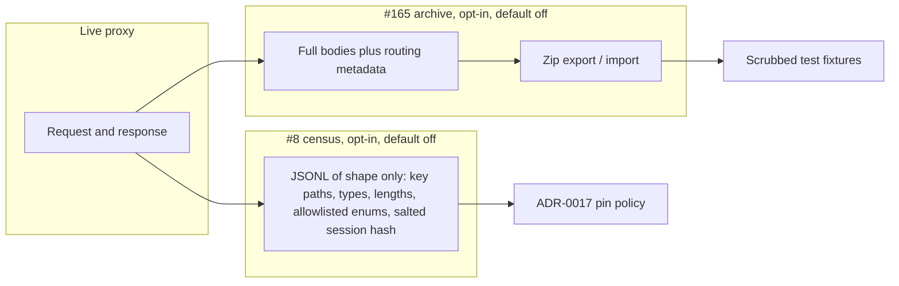

# Plan: Export and import agent conversation history (#165)

**Status:** Proposed. Awaiting David's approval. No implementation in this change.
**Issue:** [#165](https://github.com/davidpizon/TotallyHot-ArcRouter/issues/165) — "Feature: Export/import full agent conversation history as a zip file".
**Related:** [`tracked-todos.md` #8](../router/tracked-todos.md#8-capture-and-analyze-real-claude-code-and-codex-traffic-before-deciding-adr-0017s-pin-policy) (live, content-free traffic census).
**ADR-0008 Amendment 1:** Binding. This plan adds a feature. It does not schedule a smell audit and it does not change `ProxyMiddleware`, `RequestInterceptor`, or `ManagementFacade` except to call a new best-effort writer from the existing post-response telemetry path.

David's request, exact words:

> I would like to have a mechanism where the entire conversation history of agent requests and responses is exportable as a zip file, and importable as a zip file, so that I can export the conversations and build a larger dataset for, so that I can write better tests.

## What is stored today

**Full request and response bodies are not stored.** Nothing on disk can reconstruct the HTTP request a harness sent or the HTTP response the client received. An export of today's tables would be a metadata-and-extract archive, not a replayable conversation.

Durable stores, and what each one actually keeps:

| Store | File / table | What is kept | What is absent |
|---|---|---|---|
| Transcript store | `transcripts.db` → `request_transcripts` (`TranscriptDatabase`, `SqliteTranscriptStore`) | Newest user-message **text** (`prompt_text`), extracted assistant **text** (`response_text`), correlation id `{sessionId}:{turn}`, `session_id`, timestamps, requested model, routed model, heuristic dimension / difficulty / language / utility, score, estimated cost, exploratory flag, propensity, input/output token counts, `memory_entry_id`, `dim_best_model`, untrained-baseline model and predicted score, `is_judge_scored`, `scorer_version` | Raw JSON, system prompt, prior turns, tool definitions, tool calls and tool results, images, reasoning / thinking blocks, headers, harness, provider, resolved provider model id, cache tokens, HTTP status, latency, streaming flag, substitution reason |
| Usage ledger | price-catalog SQLite → `usage_ledger` (`UsageLedger`) | `session_id`, `turn_number`, provider, requested model, resolved model, prompt / completion / cache-creation / cache-read tokens, estimated cost, `cost_confidence`, `occurred_at_utc`, dedup key | Any body or text. No status, latency, or harness |
| Learned memory | `memory_entries` (`MemoryEntry`) | Embedding vector, chosen model, score, cost, verifier trace, exploratory provenance | Prompt and response text |
| Live telemetry | in-memory `RoutingTelemetryEvent` only | The fields above plus fallback, streaming, latency, duration, status, substitution reason, router tokens/cost, and summaries truncated to 2,000 characters (`TextTruncator.DefaultMaxLength`) | Not written to SQLite. Lost on process exit |
| Debug logs | Serilog, `[INTERCEPTOR] Intercepted agent request/response message` | A copy of the body capped at **4,000** characters (`RequestInterceptor.MaxLoggedBodyLength`, `LogRedaction`) | Not a store. Newlines stripped. Unsuitable as a dataset |
| Response capture buffer | `UpstreamResponseWriter.MaxCapturedResponseBytes` = **4 MiB** | Bytes held in memory long enough to parse usage and extract reply text, then discarded | The buffer is not persisted. A larger body is truncated before extraction, and extraction then often yields nothing |

How the transcript text is produced:

- `RequestTextExtractor.ExtractNewestUserMessage` walks `messages` from the end and returns the latest `role: "user"` text. `MessageContentTextExtractor` keeps `type: "text"` parts and drops images, `tool_use`, and other blocks. A Responses-API body (`input` items, no `messages` array) yields **null** `prompt_text`.
- `ResponseTextExtractor` pulls assistant text out of the capped buffer (OpenAI or Anthropic shape, streaming or not). Tool-only replies yield **null** `response_text`. The stored string is the extracted text, not the 2,000-character live-summary truncation.
- Writes happen in `RequestTelemetryPublisher.PersistTranscriptAsync` only when `Transcript:Enabled` is true (default **on**) **and** `Routing:EnableAdaptiveRouting` is true (default **on**). Retention then deletes rows older than 30 days or past 50,000 rows (`TranscriptOptions`). "Entire history" today means whatever that purge has not removed.
- `taxonomy_comparisons` is a derived routing-evaluation table. It is not conversation content.

Existing "export" and "replay" machinery does not cover this:

- `UsageAdminService.ExportUsageRollup` streams aggregated `usage_rollup` buckets (counts, tokens, cost). No conversation text.
- `TelemetryService.ListPersistedSessions` returns recent `prompt_text` / `response_text` rows for the Sessions tab, capped by the caller's limit. It is a UI read, not an archive.
- `RouterSettings` `ClearTranscripts` wipes `request_transcripts`. There is no import.
- CodeRouterBench (`benchmark_id_tasks`, `benchmark_ood_tasks`) stores the published Hugging Face corpus. `raw_json` has a benchmark `prompt` string. Sync replaces those tables. The regret harness replays that corpus (`--run-regret-harness`). It does not read live traffic.
- `RecordedModelTranscripts` / `RecordedStreamTranscripts` are hand-recorded translation fixtures checked into the test project. They are the closest pattern for "a real reply, replayed in a test," and they hold a full response envelope because a human put it there.

The host binary already has one-shot flags (`--sync-benchmark-data`, `--run-regret-harness`, `--export-ca`, …) stripped in `Program.Main` before configuration binding. There is no general CLI framework. Admin gRPC is loopback, and the Governance tab is nine sub-views reached from the dashboard (`docs/gui/dashboard.md`). Transcription capture and Clear live in System Settings, not on a Governance pane.

## Prerequisite: capture the bodies

Export can only package what was kept. Shipping a zip of `prompt_text` / `response_text` would not let David replay an agent turn (missing system prompt, history, tools, tool results, and the response envelope). **Capturing full bodies is a prerequisite**, not a follow-up.

Add an opt-in archive, off by default, written from the same post-response path that already calls `PersistTranscriptAsync` (response bytes are already in hand; the rewritten request bytes are already in hand). Do not fold raw JSON into `request_transcripts.prompt_text` — embedding backfill, quality rescan, and cluster naming all treat that column as plain task text.

Each captured turn is one row (or one blob plus one metadata row) with:

- `archive_turn_id` — UUID minted at capture. This is the stable identity. SQLite `rowid` and `correlation_id` are not: row ids differ per install, and session ids can collide across machines.
- The request bytes and the response bytes **as the client exchanged them** after model rewrite (OpenAI-shaped when a translator ran, native otherwise — the same bytes `RequestTelemetryPublisher` already parses). Record `content_encoding` (`json` or `sse`) and `truncated` when a cap is hit.
- A metadata snapshot taken at that moment, so export does not join `usage_ledger` later (the ledger has its own retention and can drop the row): provider, requested model, routed model, resolved provider model id, substitution reason, fallback, exploratory, propensity, classification labels, token counts including cache tokens, estimated cost, cost confidence, HTTP status, latency, duration, streaming flag, session synthesized flag, `session_id`, turn number, `correlation_id`, `created_at_utc`.
- Normalized harness only: allowlisted product token plus version (the same rule #8 specifies for `User-Agent`). Any other agent is `other` plus the header's length. The raw `User-Agent` is not stored.
- `origin` = `captured`. Imported rows use `imported` (see Import).

Own retention, separate from the 30-day / 50,000-row transcript cap. Agent clients resend the growing history on every turn, so byte size, not row count, is the bound. Recommended default: **14 days or 2 GiB**, whichever trips first, oldest turns deleted first, both configurable. A turn over the per-body cap is stored truncated and flagged, not dropped silently. Recommended per-body cap: **8 MiB** (today's telemetry cap is 4 MiB and then discarded).

When the flag is off, the archive file is not created and the hot path does not allocate a second copy of the body. Failures are logged with a static Serilog template and never fail the proxy response, matching transcript insert.

`request_transcripts` and `usage_ledger` stay as they are. They still feed learning, the Sessions tab, and cost analytics. The archive is the replay corpus.

## 1. Export

One code path writes the zip. CLI and Governance call it; they do not format the zip themselves.

**Zip layout** (schema version 1):

```text
manifest.json
turns.jsonl
conversations/{session_id}/turns/{turn:D4}.request.json
conversations/{session_id}/turns/{turn:D4}.response.json
```

- `manifest.json`: `schema_version` (integer `1`), `exported_at_utc`, router version, the filter that produced the file, counts (conversations, turns, truncated turns, bytes), and a SHA-256 for `turns.jsonl` and for every body entry. Zip CRC32 is incidental; import trusts the manifest hashes.
- `turns.jsonl`: one JSON object per turn, in `(session_id, turn_number)` order. Holds `archive_turn_id`, the metadata snapshot above, relative paths of the two body files, each body's SHA-256 and uncompressed length, `truncated`, `origin`, and `content_fidelity: "full-body"`. This is the index a test harness reads without opening every body.
- Body files: the raw bytes, UTF-8 JSON or SSE, not pretty-printed (pretty-printing would change the hash). A missing body (capture failed, or a pre-archive transcript export if one is ever allowed) is an absent file plus `content_fidelity` set to the real level, never an empty file pretending to be the body.
- Session directory names are the sanitized session id. Characters outside `[A-Za-z0-9._-]` become `_`. The unsanitized id stays in `turns.jsonl`.

**Compression:** Deflate (the `ZipArchive` default). Bodies are already JSON text, so Deflate is where the size win is. Do not gzip the bodies a second time inside the entry.

**Filtering:** optional `from` / `to` (UTC, inclusive), session id, normalized harness, provider, requested model. Default is every archive row still inside retention. Filters are recorded in the manifest so a later import knows the zip is not "the whole router."

**Size and streaming:** write the zip in `ZipArchiveMode.Create` to a file stream, one entry at a time, reading each body from SQLite as a stream. Do not load the corpus into a `byte[]`. `ZipArchive` create-mode is forward-only, which matches export. For a multi-gigabyte archive the operator gets a path, not an in-memory gRPC message. The gRPC API streams progress (turns written, bytes written) and then a final path or chunked file, following the existing server-stream pattern of `ExportUsageRollup` and `RunRegretHarness`. Cap a single export at the archive's own size quota so a bug cannot fill the disk.

**Where it is exposed:**

- **CLI:** `--export-conversations <path>` on the existing host, stripped in `Program.Main` the way `--export-ca` is, plus optional `--from`, `--to`, `--session`, `--harness`, `--provider`, `--model`. The process writes the zip and exits.
- **gRPC admin:** a new loopback service (admin token, same as the other admin services). Not a new method on `ManagementFacade`, and not a new field on `ExportUsageRollup` — that RPC is cost buckets. Suggested RPCs: `ExportConversations` (server stream of progress, zip written to a caller-supplied path on the router machine) and `ImportConversations` (below). A path on the router machine matches how this process already runs headless jobs; pulling the zip through gRPC chunk-by-chunk is a later option if a remote GUI must download it.
- **Governance UI:** one sub-view, "Conversation archive", next to Benchmark Data. It shows the flag, row count, bytes, retention, a filter row, Export, and Import. The button calls the gRPC service. System Settings keeps the existing transcription toggle; this view is the archive, because it is a different store.

## 2. Import

Read the zip from a path. `ZipArchive` read mode needs a seekable file, which a path provides.

**Validation, in order. Stop on the first manifest failure. Skip and count a bad turn; do not abort the rest.**

1. Reject entry names that are absolute, contain `..`, or start with a slash (zip-slip).
2. `manifest.json` exists, parses, and `schema_version` is `1`. Any other version is rejected with a message that names the version. Do not best-effort a newer file.
3. Recompute SHA-256 for `turns.jsonl` and every body the index names. Mismatch rejects that turn.
4. Each JSONL line parses, has `archive_turn_id`, `session_id`, `turn_number`, `created_at_utc`, and paths that stay under `conversations/`. A body larger than the per-body cap is rejected even if the hash matches.
5. Unknown extra JSON fields are ignored so a later additive field does not break an older importer. Missing required fields reject the turn.

**Conflicts**, keyed by `archive_turn_id`:

| Mode | Behavior | Default |
|---|---|---|
| `skip` | Leave the existing row. Count it as already present | **Yes** |
| `overwrite` | Replace bodies and metadata for that id. Keep the original `archive_turn_id` | Flag |
| `keep-both` | Insert a second row with a new local id and the same `archive_turn_id` recorded as `source_archive_turn_id`. A later `skip` import still matches the original id and does not insert a third copy | Flag |

**Storage:** rows go into the archive store with `origin = imported` and `imported_at_utc`. They are not inserted into `request_transcripts`, `usage_ledger`, or `memory_entries`. Those tables drive live learning, cost totals, and the Sessions tab; a restored dataset would otherwise be graded, embedded, and billed as if the router had served it. The Governance view can list imported sessions. The Sessions tab stays on live and transcript data until a later, separate decision.

**Idempotency:** importing the same zip twice under `skip` is a no-op after the first success. The unique key is `archive_turn_id`. A crash mid-import leaves a partial set; re-running `skip` fills the gap without duplicating. Import runs in one SQLite transaction per batch (for example 100 turns) so a process kill loses a batch, not the whole file, and does not hold a multi-gigabyte transaction.

## 3. Purpose: larger test datasets

The zip is the hand-off. It is not itself a test project, and it does not sync into CodeRouterBench.

- A small offline reader (a test helper, not a router hot-path type) opens `turns.jsonl` and yields `(metadata, request bytes, response bytes)`.
- Tests that already replay a recorded envelope — tool-call translation (`RecordedModelTranscripts`), response-text and usage parsers — can take a scrubbed turn from that reader instead of a hand-pasted string.
- New tests for harness dialects (Claude Code `messages` plus tools, Codex `input` items) load a directory of scrubbed turns checked in only after review. The regret harness and `benchmark_*` tables stay on the published corpus. Their sync deletes and replaces rows; pointing it at a conversation zip would wipe the benchmark.
- The converter that emits a fixture directory lives next to the test project. It copies bodies out and refuses to write under the repository root unless the operator passes an explicit fixture path outside the tree. CI does not download or import a zip.

**Privacy and redaction**

- The archive exists to keep user content. That content includes source code, paths, and anything the operator pasted. The zip is an operator artifact. It is not committed, not attached to a PR, and not uploaded by the app.
- Credentials are stripped at capture and again at export, even when content is kept: `Authorization`, `x-api-key`, `api-key`, and any header whose name contains `key`, `token`, or `secret`. Body strings matching common key shapes (`sk-`, `sk-ant-`, `ghp_`, `github_pat_`, `AKIA`, `xoxb-`, `xoxp-`, PEM blocks) are replaced with `[redacted]` and the turn is flagged `secrets_redacted`. A unit test plants each shape in a header, in a message string, and in a tool-argument string and asserts the zip does not contain it.
- `--redact-content` is a second, explicit mode for a zip that will be shared: message text, tool arguments, and file paths become lengths and block types, using the same key-path rule as #8. The default export keeps content, because a content-free zip cannot feed the tests David described.
- Imported rows never enter `EmbeddingBackfillService`, `QualityRescanService`, or the logreg / cluster trainers.

## 4. How this relates to tracked-todos #8

#8 and #165 both look at real Claude Code and Codex traffic. They answer different questions and must not share a store, a flag, or a writer.



| | #8 census | #165 archive |
|---|---|---|
| Question | How often do harness requests carry pin-worthy fields? | What did this conversation actually contain, so a test can replay it? |
| Content | None. Strings become lengths. Keys inside tool arguments and `metadata` become `*` | Full bodies, with credentials stripped |
| When | Live, one line per request, during the capture window #8 specifies | Live capture into the archive, then offline zip whenever the operator asks |
| Opt-in | Its own flag, default off, left off after the study | A different flag, default off |
| Output | `docs/router/harness-traffic-census.md` and a local JSONL that is not a zip of prompts | A zip on disk. Nothing in the repo until a human scrubs a fixture |
| Identity | Salted hash of the session id, salt not written out | Stable `archive_turn_id` plus the real session id, because the operator is exporting their own machine |

Rules so they do not collide:

- Enabling the archive does not write census lines. Enabling the census does not write bodies.
- The census stays content-free after #165 exists. #165 does not relax #8's acceptance test (a planted secret must not appear in census output).
- #8's optional "≤ 20 raw bodies, outside the repo, scrubbed by hand" can be **chosen out of a #165 zip** and then scrubbed. That is a manual step. The census writer still does not store those bodies, and a #165 zip is not committed to satisfy #8.
- Normalized harness names use the same allowlist in both, implemented as a pure function each writer calls. Do not route archive bytes through the census serializer to "reuse" it.
- Neither feature changes ADR-0017's pin decision by itself. #8 still has to hit its session and request minimums before that ADR merges.

## 5. Phasing

1. **ADR, then capture.** A short ADR for the privacy boundary (persisting full prompts and responses, exporting them, redaction, default off). Then the archive store and the post-response writer. No zip yet. Exit: flag off writes nothing; flag on round-trips a body; planted secrets are redacted; learning jobs ignore the archive.
2. **Export.** Zip writer, CLI flag, gRPC stream, Governance view with Export only. Exit: a fixture corpus exports to the layout above and the manifest hashes match.
3. **Import.** Validation, `skip` / `overwrite` / `keep-both`, `origin=imported`, idempotent re-import. Exit: round-trip into an empty archive equals the source; a second import under `skip` adds zero rows; a tampered byte fails that turn.
4. **Test helper.** Reader plus one scrubbed-fixture test on an existing parser or translator. No change to CodeRouterBench sync or the regret harness.

Phase 2 can ship before phase 3. Phase 4 is what makes the zip useful for tests; it does not block export.

## 6. Test strategy

Unit tests, each well under the 5-second ceiling. No live provider, no GUI browser pass until the Governance view exists (phase 2), and then a bUnit test of the view plus one manual click against a local router.

- Capture off: a completed proxy request leaves no archive file.
- Capture on: request bytes, response bytes, provider, models, tokens, and harness token match the fixture. A Responses-API `input` body is stored whole (today it would not even produce `prompt_text`).
- Redaction: the shapes in section 3 are absent from the stored body and from the zip.
- Export filter: a date window and a harness filter select the right turns and the manifest records the filter.
- Streaming bound: exporting many small turns writes incrementally (assert the writer is invoked per turn, using a fake body store).
- Import: bad version, bad hash, zip-slip name, and malformed JSONL line each take the path in section 2. `skip` is idempotent. `overwrite` replaces bytes. `keep-both` does not grow on a second `skip`.
- Imported and captured archive rows are absent from embedding-backfill and quality-rescan queries.
- Census isolation: with both flags on in a test host, the census sink receives no prompt text and the archive sink receives no census line. Until #8's writer exists, the test stubs the census sink.

## 7. Decisions needed from David

1. **Is a zip of today's `prompt_text` / `response_text` acceptable as a first milestone?** Recommended default: **no.** Full-body capture is a prerequisite. A partial zip would be easy to mistake for replayable history.
2. **Archive location and defaults.** Recommended default: its own SQLite file beside `transcripts.db`, flag `ConversationArchive:Enabled` default **false**, retention **14 days or 2 GiB**, per-body cap **8 MiB** with a `truncated` flag.
3. **Does import restore Sessions-tab history and learning rows?** Recommended default: **no.** Import fills the archive only, marked `origin=imported`, excluded from embeddings, rescan, and trainers.
4. **Conflict policy default.** Recommended default: **`skip`** on `archive_turn_id`, with `overwrite` and `keep-both` as explicit flags.
5. **Content in the default zip.** Recommended default: **keep user content**, always strip credentials and known key shapes. `--redact-content` exists for a shareable structural zip. Zips are never committed.
6. **Stable identity.** Recommended default: capture-time UUID `archive_turn_id`. Do not key on SQLite row id or on `correlation_id` alone.
7. **Where the button lives.** Recommended default: a Governance sub-view "Conversation archive", plus the CLI flags and one gRPC service. Not a new `ManagementFacade` method, and not an extension of `ExportUsageRollup`.
8. **May the archive feed CodeRouterBench or the regret harness?** Recommended default: **no.** A test helper reads the zip. Published benchmark tables stay published data.
9. **Share any code with #8?** Recommended default: a pure harness-token allowlist only. Separate flags, stores, and writers. #8 remains content-free. A handful of scrubbed #165 bodies may be picked by hand for translator fixtures; the census does not store them.
10. **Per-body cap when a turn exceeds 8 MiB.** Recommended default: store the prefix, set `truncated`, and let export include it. Dropping the turn hides the largest agent turns, which are the ones tests most want.
