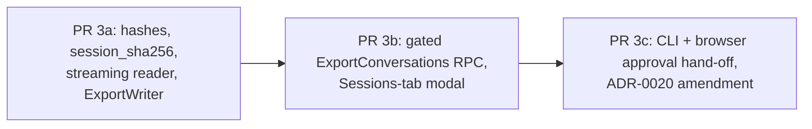
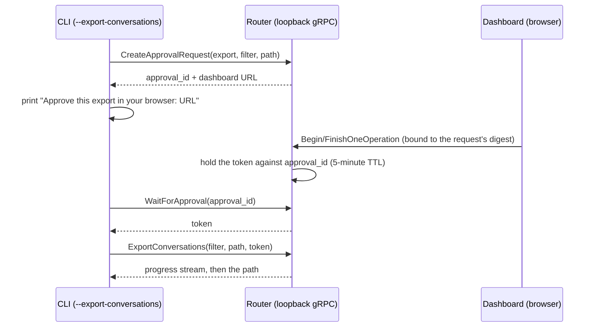

# Plan: #165 phase 3 — Export conversations as a zip

**Status:** Draft, awaiting David's sign-off per `docs/router/standing-rules.md`. No implementation until then.

**Issue:** [#165](https://github.com/davidpizon/TotallyHot-ArcRouter/issues/165). **Parent plan:** [`docs/plans/issue-165-export-import-history.md`](docs/plans/issue-165-export-import-history.md) §1 and §5 phase 3 (approved 2026-10-08). 
**ADR-0008:** no `ManagementFacade` change, no smell work. The proxy hot path is not touched. `SessionStore`'s capture write path gains hashing (PR 3a), so the golden-path smoke is re-run once.

## Context

Phases 1 and 2 are merged. Every captured turn lives in an encrypted per-session file (`SessionStore`, `SessionFile`, indexed by `session_files` / `session_turns` in `transcripts.db`), and `transcripts.db` holds no text. Nothing can read those files out yet except `SessionStore.ReadBodies`, which is for tests. Phase 3 adds the zip writer, the gated gRPC export, the CLI flag, and an Export-only modal on the Sessions tab. Import is phase 4.

**Exit criterion (parent plan):** a fixture corpus exports to the layout in §1 of the parent plan and the manifest hashes match.

## Decisions made with David (this session)

| # | Decision |
|---|---|
| 1 | **CLI gate: option A, browser hand-off.** `--export-conversations` starts the export, prints an approval link, David approves with his passkey in the dashboard, and the CLI then writes the zip. Same flow on Windows, macOS and Linux. Needs a short **ADR-0020 amendment** (it currently says the CLI refuses on macOS/Linux). |
| 2 | **Add the `session_sha256` index column now**, updated on every append (not computed only at export). |
| 3 | **`turns.jsonl` carries the capture-time snapshot only.** No score, scorer version or judge flag (they are not in the `TurnMetadata` frame; the parent plan §10 already lists them as not covered). |
| 4 | **Zip is written to a path on the router machine**; the RPC streams progress. The Export-only modal goes on the **current** Sessions tab and moves with #176 later. |

## Findings from CodeGraph that shape the design

- `SessionStore.ReadBodies` / `SessionFile.ReadAllBodies` return a `List` of every decrypted frame in a session. That is unbounded memory for a multi-GB session, so export needs a **per-turn streaming reader**. The index already stores `first_frame_ordinal`, `frame_count` and `end_offset` per turn, so a turn can be read without scanning the whole file.
- Bodies are Brotli-compressed, in chunks of up to 64 KiB of compressed bytes, with the frame position in each chunk's authenticated data. `SessionRecordCodec.Decompress` takes a whole `byte[]`, so a streaming decompress path is new.
- `SessionStore.TryReadExtracts` is the existing pattern for "scan a file for one frame kind". Filters on harness/provider/model need the `TurnMetadata` frame, and the index does not carry those, so that pattern is generalized.
- The `TurnMetadata` snapshot already has `content_encoding`, `translated`, `harness`, `provider`, models, tokens, cost, status, latency and `created_at_utc`. It has **no `secrets_obscured`** and no body hashes.
- `ContentGateHooks.RequireExport(gate, token)` and `GatedOperation.Export` exist. `ExportParameters()` is empty today, which means one approval would authorize any export. This plan binds it (see PR 3b).
- Existing patterns to copy: server-stream RPC `UsageAdminGrpcService.ExportUsageRollup`; one-shot CLI dispatch via `ExtractFlag` in `Program.cs` (`ShredConversationsCommand` is the closest analog); `.tmp` files in the session folder are already swept by `SessionStore.DeleteOrphanFiles`.
- `PasskeyAdminGrpcService` already has `BeginOneOperation` / `FinishOneOperation`, and `OneOperationAuthorizationTable` holds the token (see `telemetry.proto`).

## Delivery: three stacked draft PRs

Per the standing rules each PR is opened as a **draft**, iterated with a local `/code-review`, then marked ready once (one Copilot review). Each links this plan.

### PR 3a — storage and the zip writer (no transport, no UI)

1. **Body hashes in the index.** New table `session_bodies (archive_turn_id, kind, sha256, length, missing, obscured)`. The SHA-256 and length are of the stored plaintext (after obscuring), computed in the same pass that obscures it:
   - in-memory path: in `SessionStore.AppendLocked`;
   - spooled path: incrementally in `SessionBodySpool` as obscured bytes are produced.

   The rows are inserted in the same transaction as the turn's `session_turns` row, so the commit order of ADR-0019 is unchanged. `obscured` records whether the obscurer changed anything; it feeds `secrets_obscured`. **Verify first** that `StreamingSecretObscurer` / `SecretObscurer` can report that. If not, `secrets_obscured` is exported as `null`, not guessed.
2. **`session_sha256` column on `session_files`.** SHA-256 over the session's turns in `turn_sequence` order. Each turn contributes its `archive_turn_id` (16 bytes) and, for each exchange kind in the fixed order `ClientRequest, ClientResponse, ProviderRequest, ProviderResponse`, one byte for the kind plus either the body's 32-byte SHA-256 or 32 zero bytes if the body is missing or absent. It excludes `TurnMetadata`, `Extracts` and every timestamp, so `import-time` cannot change it (parent plan §2). The update runs in `AppendTurn`'s index transaction, via a `SessionIndex` method that recomputes from `session_bodies`.
3. **Backfill for sessions captured before this PR.** They have no hash rows. A one-time, lazy backfill when export (or a startup maintenance pass, to be decided in review) first meets a session without them: stream-decrypt, hash, write the rows and the checksum, then continue. Backfill runs under the session gate, and a failure leaves the session with `hashes_unavailable` and exports it with `content_fidelity` set accordingly rather than failing the export.
4. **Streaming turn reader.** `SessionFile.ReadTurn(startOffset, firstFrameOrdinal, frameCount)` yields frames one at a time, with each body exposed as a `Stream` (chunk-by-chunk decrypt, streaming Brotli). `SessionStore.OpenTurn(archiveSessionId, archiveTurnId)` wraps it, taking `_rotationLock` (read) and the session gate **per turn only**, never for the whole export, so a long export cannot block appends or deletion for hours. A turn start offset is the previous turn's `end_offset`, or `DataStart` for the first.
   - Generalize `TryReadExtracts` into `TryReadBodies(kinds, wantedTurnIds)` for the harness/provider/model filter.
5. **`ConversationExportWriter`** (new, `src/TotallyHotArcRouter/Sessions/Export/`). Pure library: takes a filter, an output path, an `IProgress`, and a cancellation token.
   - Resolve candidate sessions from the index (date window from `session_turns.created_at_utc`; `--session` matches `archive_session_id` or `client_session_id`). Apply metadata filters by reading the small `TurnMetadata` frame only.
   - Write `<path>.partial` in `ZipArchiveMode.Create`, Deflate. For each turn, write each present body as a zip entry streamed from the reader while hashing. Compare the hash against the stored one and, on mismatch, **fail that turn** (counted, listed in the manifest as `corrupt`) instead of exporting wrong bytes.
   - Accumulate `turns.jsonl` lines in a `.tmp` file in the session folder (no body text in it; swept by recovery if the process dies).
   - Finish with `turns.jsonl`, then `manifest.json`, both hashed on write, then flush and rename `.partial` to the final name. A cancelled or failed export leaves no zip: it is complete or absent.
   - `turns.jsonl` order: `(client session_id, archive_session_id, turn_sequence)`. This satisfies the parent plan's `(session_id, turn_number)` and stays deterministic when client ids collide.
   - Per line: `archive_turn_id`, `archive_session_id`, the snapshot **nested under `metadata`** (so a future snapshot key cannot clash), `origin`, `secrets_obscured`, `content_fidelity: "full-body"` (or the real level), and for each body its relative path, SHA-256 and length. No score fields (decision 3). Missing body: the file is absent and `content_fidelity` says why, never an empty file.
   - Manifest: everything in parent plan §1 (`schema_version: 1`, `exported_at_utc`, router version, filter, counts, hash of `turns.jsonl`, hash per body, each session's `session_sha256`), plus `incomplete: true` on a session whose file vanished mid-export (deleted by retention or Clear). The entries already written stay valid.
   - **Free space:** refuse before writing unless free space exceeds the sum of body lengths (an upper bound, since the zip compresses) plus the same reserve import will use (the larger of 1 GiB and 10% of the volume).
   - Single flight: a second export while one runs gets `FailedPrecondition`.
   - Destination must be absolute, must not exist (no silent overwrite), and must not be under the data directory or the session folder.
6. **Tests (all under 5 s).** See "Test strategy" below.

### PR 3b — gated RPC and the Sessions-tab modal

1. **Proto.** New `ConversationAdminService` in `src/Protos/` with `ExportConversations(ExportConversationsRequest) returns (stream ExportProgress)` (filter fields, destination path, `authorization_token`; progress carries turns written, bytes written, then a terminal result with path, counts and missing/corrupt/incomplete totals). Not a `ManagementFacade` method and not an `ExportUsageRollup` change (parent decision 7). Register it beside the other loopback admin services.
2. **Gate.** The service calls `ContentGateHooks.RequireExport` before any file I/O. Change `GatedOperation.ExportParameters` to take the canonical filter and destination and return their SHA-256, so the dashboard's approval is bound to exactly what will be written. An approval for one export cannot run another. Update `ContentGateHooksTests` and `GatedOperation` docs.
3. **Modal.** An "Export / Import" button at the top of the Sessions tab opens a modal built on `DialogShell` (`Title`, `CloseAriaLabel`, `OnClose`). The modal shows whether capture is on, session and turn counts, bytes on disk and the Sample Size, then a filter row (from/to, session, harness, provider, model) and a destination-path field (a path on the router machine). Export runs the existing dashboard one-operation passkey ceremony (reuse the component the management-token copy uses; locate it with CodeGraph when starting), then shows progress and the result path. Import and the imports list are visible-but-disabled or absent until phase 4; the title still says "Export / Import" only if the Import half exists, otherwise "Export" (decide at implementation, no dead controls).
   - Put the client call in `TotallyHotArcRouter.Gui.Telemetry` beside `PersistedSessionsClient`, throwing `GrpcAdminException` like the other clients.
   - Add the button to the current layout in the smallest way; #176's redesign will relocate it.
4. **bUnit test** of the modal and one manual click against a local router (parent plan §6).

### PR 3c — CLI with browser hand-off, and the ADR amendment

The CLI cannot run a passkey ceremony on macOS/Linux, so it asks the dashboard to do it.

1. **ADR-0020 amendment** (via the `adr-writer` skill): the CLI on every platform hands off to the dashboard instead of refusing. Record the threat analysis. Another local app can create a pending request, but the dashboard shows the destination and filter and needs the operator's gesture; flooding is the already-accepted denial of service; the token stays in the router and the CLI only receives it for one call and for the digest it was bound to.
2. **Router side.** An in-memory pending-approval table (TTL 5 minutes, bounded count) with `CreateApprovalRequest` / `WaitForApproval` on `PasskeyAdminService`; the dashboard gets an approval view that lists pending requests and runs the existing ceremony for one of them.
3. **CLI.** `--export-conversations <path>` plus `--from`, `--to`, `--session`, `--harness`, `--provider`, `--model`, dispatched with `ExtractFlag` in `Program.Main` before host build, like `--shred-conversations`. It is a gRPC client of the **running** router, not a reader of the files, so there is one code path and the gate cannot be bypassed. It prints progress and exits non-zero on denial, timeout, router unreachable, or a refused export. Authentication to the loopback gRPC (how the CLI gets the admin token without the gated management-token RPC) must be settled by reading ADR-0012 and ADR-0020 before coding; it is the main open item below.
4. **Exit codes and messages** are documented in `README.md` next to the other host flags.

## Test strategy

A small test fixture builds a store with real `SessionStore` files (fake master key store, as `SessionStoreTests` does), several sessions, translated and untranslated turns, one missing body, and one secret-bearing body.

- **Hashes and checksum (3a).** `session_bodies` rows match SHA-256 of the stored plaintext for in-memory and spooled bodies. `session_sha256` changes when a body changes and does **not** change when only `created_at_utc` or metadata changes. A second session with the same client id has its own checksum.
- **Backfill (3a).** A session written without hash rows gets them on first export and produces the same checksum as a freshly captured copy of the same content.
- **Streaming reader (3a).** Reading turn N does not decrypt other turns (count chunk reads). Memory stays bounded: a 20 MiB response exports without building a 20 MiB array (assert on the stream path, not on process memory). A tampered chunk fails that turn only.
- **Layout (3a, exit criterion).** Fixture corpus gives exactly the parent plan's layout; every body entry's SHA-256 equals both the `turns.jsonl` value and the manifest value; `turns.jsonl` hash matches; session directories are `archive_session_id`; a colliding client `session_id` yields two directories.
- **Fidelity.** A request containing whitespace, non-ASCII, `<>&'+` and invalid UTF-8 exports byte-identical to what was stored. A missing body has no file and a real `content_fidelity`.
- **Secrets.** Each planted shape (parent plan §3) is absent from every zip entry, `turns.jsonl`, and the manifest. This repeats the capture test against the export, as the parent plan requires.
- **Filters.** Date window, session id (both kinds), harness, provider and model select the right turns; the manifest records the filter; a metadata filter reads only metadata frames.
- **Complete or absent.** A cancelled export, a mid-export failure and a full disk leave no final zip and no `.partial`. A session deleted mid-export is flagged `incomplete` and its already-written entries verify.
- **Concurrency.** An append to a session during export neither blocks for the whole export nor appears in a manifest generated from an earlier snapshot of that session; a rotation during export does not break the next turn's read.
- **Gate (3b).** No token, a spent token, and a token for different filter or path are each rejected (`ContentGateTests` pattern); no passkey enrolled gives `FailedPrecondition` with the enrollment message.
- **Path rules (3b).** Relative path, existing file, path under the data directory or session folder are refused before any I/O.
- **Modal (3b).** bUnit: shows capture state and counts; Export disabled without a destination; error from `GrpcAdminException` is displayed; closing runs `OnClose`.
- **CLI hand-off (3c).** A fake router asserts the order create-request, wait, export; timeout and denial give distinct exit codes; the CLI never reads the session folder (assert no file access with a read-only temp dir).
- **Golden-path smoke (3a only).** Re-run the existing smoke from `docs/plans/issue-165-export-import-history.md` §10: capture still byte-exact, now with hash rows written; no change in client-visible behavior.

## Gates (every PR)

- Builds with no warnings or errors; `TreatWarningsAsErrors` and `CS1591` apply, so all new public types need accurate XML docs (`<inheritdoc/>` for overrides, no own `
` beside it).
- Static Serilog message templates only; never log paths with user content, body bytes or tokens.
- Unit tests pass, each under 5 s, coverage stays at or above 80%.
- Mermaid for any new diagram in docs; README and `docs/HANDBOOK.md` updated for the new flag and RPC.
- Draft PR, local `/code-review` until clean, then ready once. No re-request of Copilot.

## Risks and open items

1. **CLI authentication to loopback gRPC** (3c). How does the CLI get a credential for the admin API without the gated management-token RPC, on all three platforms? Read ADR-0012/0014/0020 before 3c; if it needs a new local channel, that gets its own ADR (the elevated pipe in ADR-0020 is the precedent).
2. **Backfill timing.** Lazy-at-export (planned) vs a startup pass. Lazy is simpler and costs one decrypt per old session; a startup pass delays boot on large stores. Revisit if exports of old data are slow in practice.
3. **`secrets_obscured` plumbing.** Depends on the obscurer reporting "changed". Fallback is `null` in the schema, with no guess.
4. **Extracts are not exported.** The newest-user-message and reply-text extracts are derivable from the request and response, so the zip omits them. Phase 4 must regenerate them with `RequestTextExtractor` / `ResponseTextExtractor` on import, which also means imported turns get extracts in the current extractor's shape. Confirm this is wanted before phase 4.
5. **Hash cost on the capture path.** Hashing the obscured plaintext adds CPU on the pump thread. The parent plan §10 says no hot-path measurement exists; take one in 3a with a large streamed body, and keep the work on the pump's worker, never the relay.
6. **Hold-open time for the lock.** Per-turn locking means a very large single turn holds the session gate while one body streams. Acceptable: appends to that one session wait, other sessions do not.
7. **Reserve value.** The 1 GiB / 10% reserve is taken from the import rules; if that is too strict for export on small disks, make it an option with the same default.

## Verification (end to end)

1. `dotnet build src/TotallyHotArcRouter.slnx` — no warnings; run each test host (see the repo notes on `dotnet test`).
2. Isolated router smoke per `reference_router_isolated_smoke` (scratch data dir, upstream stub): capture two sessions including a >4 MiB streamed reply, then run the export through the dashboard modal.
3. Unzip the result: check the layout, recompute SHA-256 of every body with `sha256sum` and compare to `turns.jsonl` and the manifest; check a planted key is absent.
4. Run `--export-conversations` from the CLI: approve in the browser, confirm the zip appears only after approval, and that a refusal or an expired approval writes nothing.
5. Re-run the golden-path smoke after PR 3a.
