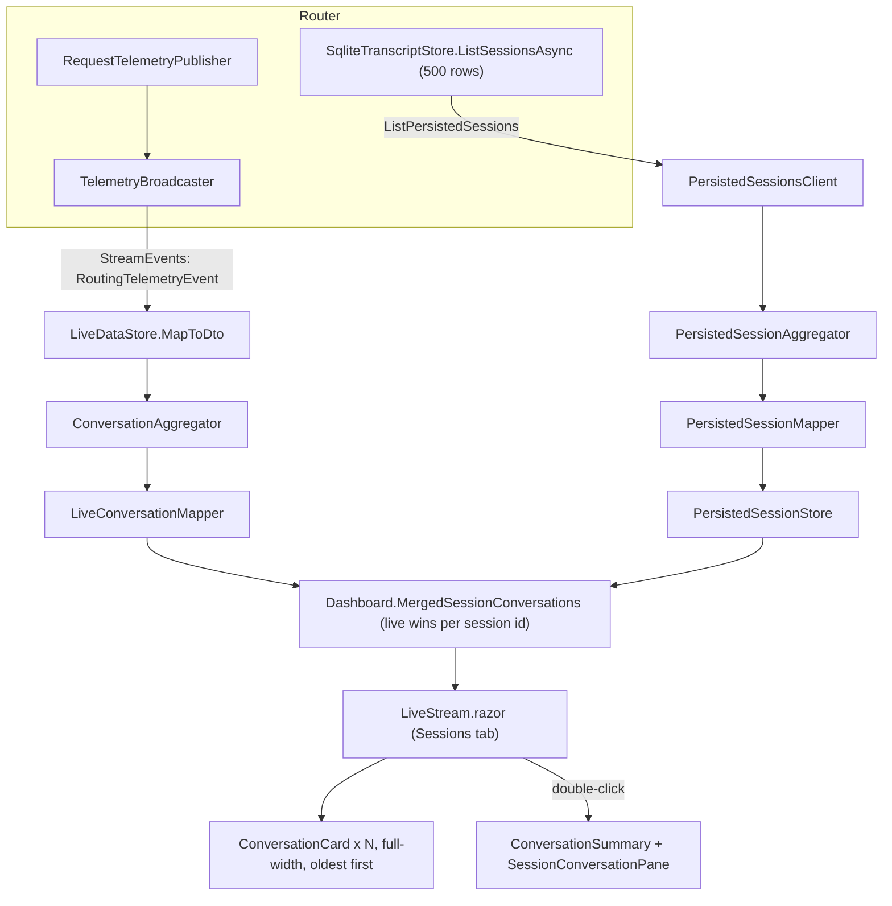
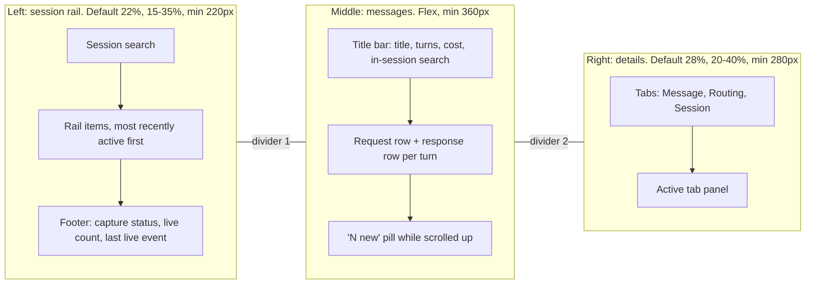
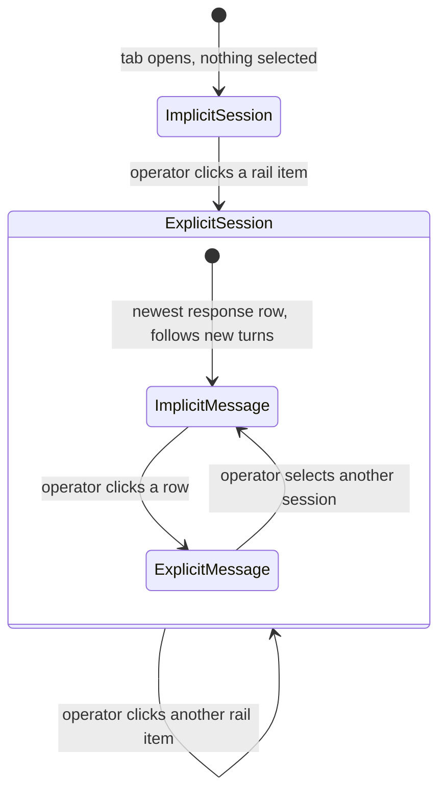

# Plan: Sessions tab three-pane chat layout (#176)

**Status:** Proposed. Awaiting David's approval. No implementation in this change.
**Issue:** [#176](https://github.com/davidpizon/TotallyHot-ArcRouter/issues/176) — "Sessions tab: three-pane chat layout (session rail · messages · details)".
**Design reference:** [HTML/CSS implementation of HipChat redesign](https://codepen.io/CucuIonel/pen/yLaLGL) (CodePen; LESS, Font Awesome 4, jQuery jScrollPane). This plan borrows its **structure only**. No markup, CSS, fonts, icons, or scripts are copied. None of its three libraries may be loaded (`DESIGN.md` §4.3; `dashboard.md` §Stack).
**Related:** [`dashboard.md`](../gui/dashboard.md) (the live Sessions-tab contract), [`DESIGN.md`](../gui/DESIGN.md), [`MOTION.md`](../gui/MOTION.md), [`telemetry.md`](../router/telemetry.md). [#165](https://github.com/davidpizon/TotallyHot-ArcRouter/issues/165)'s conversation archive is a separate store. This plan does not read it.
**ADR-0008 Amendment 1:** Binding. This plan is a feature, not a smell refactor. It does not touch `ProxyMiddleware`, `RequestInterceptor`, or `ManagementFacade`. The router changes are small, and Phase 2 starts with an ADR for them (§5.2):

- two read-only RPCs on `TelemetryService`;
- two `ITranscriptStore` queries and one `ITaxonomyComparisonStore` overload;
- one DI registration in `ProxyServer`.

David's request, exact words:

> Read the HTML and CSS code in this codepen example: https://codepen.io/CucuIonel/pen/yLaLGL. Create a detailed plan to use this three pane "text message" style to display the transaction history in the "Sessions" tab. The leftmost pane is to select the session, the middle pane is to show the actual messages, the right pane will show message metadata and details.

## Decisions made in planning (2026-09-29)

| # | Question | Decision |
|---|---|---|
| 1 | Palette | Dark tokens, CodePen layout. `DESIGN.md` stays dark-only. No light island. |
| 2 | Entry UX | Always three panes. The card grid, the double-click gesture, and "Back to Sessions" are removed. |
| 3 | Message rows | Two rows per turn: a request row and a response row. Each row is selectable on its own. |
| 4 | Data scope | Go beyond `ConversationTurn`: persisted `request_transcripts` columns reach the GUI. |
| 5 | Freshness | An on-demand detail RPC, not a wider `ListPersistedSessions`. |
| 6 | Fetch scope | Per session, cached, re-fetched after new live turns. |
| 7 | Fields | Every transcript column, plus the turn's `taxonomy_comparisons` row. |
| 8 | Right pane | Three icon tabs: Message, Routing, Session. |
| 9 | Pane sizing | Two draggable dividers. |
| 10 | Left rail | Status dot, title, badges, meta line. Most recently active first. Status footer. |
| 11 | Long text | Clamp with Show more. A truncated live text is swapped for the persisted full text. |
| 12 | Sender column | "Client" for requests. The routed model for responses. |
| 13 | Input bar | Removed. In-session search sits in the title bar. |
| 14 | Defaults | Newest message selected. Stick to the bottom only when already there. Widths and tab remembered. |
| 15 | Process | Issue #176 plus this plan PR. |

**One deviation from the Q&A, recorded here.** Decision 11 said the full text comes "from the detail RPC". Instead it comes from a second RPC, `GetTurnTexts` (§5.2), which returns the text of up to 50 turns at a time.

- The GUI's gRPC client runs at `Grpc.Net.Client`'s default 4 MB receive cap. Nothing in `src/` raises `MaxReceiveMessageSize`.
- A long agent session's full prompt and response text can exceed that cap.
- Keeping the per-session RPC metadata-only bounds each page at roughly 1 MB, even at the 2,000-turn page limit.

**Review round 1 (Copilot on PR #178).** Nine findings changed the plan:

1. Show more is measured, not estimated, so a clamped row is never unexpandable (§4.3).
2. Per-turn token counts stay `null` when unreported (§5.1).
3. The untracked flag is "unknown" for persisted-only sessions (§5.1).
4. Live and persisted history merge per turn, not per session (§5.1).
5. The details RPC pages with a keyset cursor (§5.2).
6. The comparison message carries the whole `taxonomy_comparisons` row (§5.2).
7. The router's metadata query never reads text bodies (§5.3).
8. Truncation is detected from the live marker, and capped text stays marked (§5.6).
9. An ADR is required before Phase 2 (§5.2).

## 1. What exists today

Traced with CodeGraph (`codegraph_explore`) on 2026-09-29.



- **The tab today.** `LiveStream.razor` is the Sessions tab. It starts as an oldest-first card list. Double-clicking a card opens a two-panel split with one divider (`split-pane.js`, clamped 20–65%).
- **State resets on every tab switch.**
  - `Dashboard.razor` renders the active tab under `@key="_activeTab"`, so the Sessions tab is torn down and rebuilt each time.
  - Only `_selectedConversationId` survives today. It lives in `Dashboard` and is shared with Cost Analytics' `InitialSessionId`.
  - Anything this plan must remember across a tab switch goes in a singleton or in `localStorage`.
- **No agent name exists.** `ConversationTurn.Agent` holds the resolved model on both paths: `ConversationAggregator` and `PersistedSessionMapper` both copy the model into it. No harness or agent name is captured anywhere.
- **Live wins per session, not per turn.** `Dashboard.MergedSessionConversations()` drops a persisted conversation whenever the same session id has any live turn. After a GUI restart, one new live turn therefore hides every earlier persisted turn of that session. §5.1 merges per turn instead.
- **Unknown token counts become `0`.** `RoutingTelemetryEventDto`'s prompt, completion, and cache counts are nullable. `ConversationAggregator` coalesces all four to `0`, and `PersistedSessionMapper` does the same for `input_tokens` / `output_tokens`. §5.1 keeps them `null` per turn.
- **The untracked flag is live-only.** A synthesized session id is a plain `Guid.NewGuid().ToString("N")` (`MessageHistoryContinuityMatcher`), and `request_transcripts` has no column for the flag. So a persisted-only session cannot be told apart from one whose client supplied its id.

**Data the GUI receives today and drops:**

| Field | Arrives in | Dropped at |
|---|---|---|
| `Provider`, `IsStreaming`, `TotalDurationMs`, `StatusCode`, `RouterTokens`, `RouterCostUsd` | `RoutingTelemetryEventDto` | `ConversationAggregator` (no such fields on `LiveConversationTurn`) |
| `CacheCreationTokens`, `CacheReadTokens` | `LiveConversationTurn` | `LiveConversationMapper` (folded into `CacheHitRate`) |
| `IsSessionSynthesized` | `LiveConversation` | `LiveConversationMapper` (used only for the title) |

**Data the router stores but never serves.** `ListPersistedSessions` sends 11 columns (`PersistedTranscript` in `telemetry.proto`). These never reach the GUI:

- **Transcript columns:** `request_transcripts.dimension`, `difficulty`, `language`, `is_utility`, `score`, `is_exploratory`, `propensity`, `dim_best_model`, `scorer_version`, `is_judge_scored`, `untrained_baseline_model`, `untrained_baseline_predicted_score`.
- **Comparison rows:** the whole `taxonomy_comparisons` row per transcript: baseline model and cost, estimated net savings, regret, observed and predicted scores.

**Fields with no source stay out of the new panes.** They are not rendered as a made-up `0`:

- `ConversationTurn.ToolExecutionSteps` and `ContextBufferPercent`.
- For persisted turns, every live-only field: TTFT, cache, status, duration, provider.
- `RoutingRoi` stays `0` on the model, but the Sessions tab stops reading it. It uses §5.5's estimated ROI instead. [`backlog.md`](../gui/backlog.md) already records `RoutingRoi` as unsourced.

**Blast radius (CodeGraph):**

| Symbol | Production callers | Tests |
|---|---|---|
| `LiveStream` | `Dashboard.razor` | `LiveStreamTests`, `DashboardTests` |
| `ConversationCard` | `LiveStream` | `ConversationCardTests` |
| `ConversationSummary` | `LiveStream` | `ConversationSummaryTests` |
| `SessionConversationPane` | `LiveStream` | `SessionConversationPaneTests` |
| `ConversationTurn` | 10: `LiveConversationMapper`, `PersistedSessionMapper`, `SessionConversationPane`, `DashboardData` | 5 files, including `CostAnalyticsTests` |
| `ConversationTurn.PromptTokens` / `CompletionTokens` (becoming `int?`) | `CostAnalytics.razor` (chart points, lines 362–363), `ConversationSummary`'s sparkline | `CostAnalyticsTests`, mapper tests |
| `Dashboard.MergedSessionConversations` | The Sessions tab only. Cost Analytics reads `LiveDataStore.Conversations` directly | `DashboardTests` |
| `LiveConversationTurn` | 9: `ConversationAggregator`, `LiveConversationMapper` | `LiveConversationMapperTests` |
| `RoutingTelemetryEventDto` | 8: `LiveDataStore`, `ConversationAggregator` | `ConversationAggregatorTests`, `LiveDataStoreTests` |
| `IPersistedSessionsClient` | `PersistedSessionStore` | Two `FakePersistedSessionsClient` doubles must implement the new methods |
| `ITranscriptStore` | `TelemetryGrpcService` and the transcript background services | `FakeTranscriptStore` doubles. The new method is a default interface member, like `ListSessionsAsync`, so they compile unchanged |
| `ITaxonomyComparisonStore` | `TaxonomyComparisonService`, `ManagementReportingService` | Fakes compile unchanged: the new overload is a default interface member |
| `TelemetryGrpcService` | `ProxyServer` (mapped unconditionally) | `TelemetryGrpcServiceTests` |

## 2. The CodePen, and what each part becomes

The pen is a fixed 780 px window with three absolutely positioned panes. Its colors are light.

| CodePen element | What it does there | Sessions tab equivalent |
|---|---|---|
| `.window-title` (traffic-light dots, title, expand) | Fake window chrome | Dropped. The tab bar is the chrome |
| `.conversation-list` (176 px, `#505d71`) | Conversation rail | **Session rail** (left pane) |
| `li > a` + `.online` / `.idle` / `.offline` icon | One conversation with presence | Rail item with a status dot: live and active, live but idle, history only |
| `li.active` (`#445166`) | Selected conversation | Selected session (`aria-selected`), accent left edge |
| `.fa-times` per item | Close a conversation | Dropped. Sessions are not closable |
| "Dashboard" item at the top | Navigation | Session search box |
| `.my-account` footer | Signed-in user and availability | Rail footer: transcript capture on/off, live session count, last live event |
| `.chat-area .title` + `.fa-search` | Conversation title and search | Title bar: session title, turns, cost, in-session search toggle |
| `.chat-list li` rows | Messages | Message rows, two per turn |
| `.name` (100 px, right-aligned, bold) | Sender column | Sender column: "Client", or the routed model with its color dot |
| `.message` (left border) | Message cell | Body cell, clamped to 6 lines |
| `.msg-time` (top right, 9 px) | Timestamp | Timestamp; request rows also show `#turn` |
| `li.me` (`#e4eaee`) | Own messages tinted | Request ("Client") rows tinted |
| `.blue-label` | Mention chip | Inline chips: fallback, substituted, trained, truncated |
| `.input-area` (input + Submit) | Compose | Dropped. History is read-only |
| `.right-tabs ul.tabs` (3 icon tabs) | People / files / links | **Details** tabs: Message, Routing, Session |
| `.member-list` (presence, name, time) | People in the room | Session tab "Models used": color dot, model, turns, last used |
| `.fa-cog` | Settings | Dropped. Settings live in System Settings |
| jScrollPane | Custom scrollbars | Dropped. The app's global 4 px scrollbar already applies |
| Absolute positioning and floats | Fixed-size window | Flex layout filling `<main>`. No floats |

## 3. Target layout



- **Scrolling.** The three panes fill `<main>` with `h-full min-h-0`. Each pane scrolls internally. There is no page scroll and no breakpoint (`DESIGN.md` §5).
- **Empty state.** When there are no conversations at all, today's empty state stays exactly as it is: "No conversations yet." plus `ClientDropInPanel`, full width, no panes.

## 4. Visual specification

### 4.1 Token map

Every color comes from an existing token. There is no new hue.

| CodePen | Value | Sessions equivalent | Token / class |
|---|---|---|---|
| Rail background | `#505d71` | Rail surface | `--surface-card` |
| Rail item text | `#bcc3d0` | Rail title | `text-slate-200` |
| Rail active / hover | `#445166` | Hover / selected item | Hover `--surface-elevated-a`. Selected: same plus a 2 px `--accent` inset left edge |
| Rail item separator | 2 px `#586476` | Item separator | 1 px `--border-button` |
| Online / idle / offline | `#82cf85` / `#ffac69` / `#f57e7d` | Live active / live idle / history only | `--color-success` + `.pulse-dot` / `--color-warning` / `--text-muted`. **Not red:** red means CRITICAL (`DESIGN.md` §2) |
| Chat background | `#fff` | Messages surface | `--surface-base` |
| Row separator | `#cfdae1` | Between rows | 1 px `--surface-elevated-a`; at a turn boundary 1 px `--border-button` |
| `li.me` tint | `#e4eaee` | Request rows | `--surface-card` |
| Sender | `#5d7185`, bold | Sender column | `text-slate-400`, `font-semibold` |
| Message text | `#333f4d` | Body | `text-slate-200` |
| `.msg-time` | `#738ba3`, 9 px | Timestamp | 10 px mono, `--text-muted` |
| `.blue-label` | `#6ea0ff` | Chips | Existing `.ds-badge-warning` / `.ds-badge-success`; muted outline for "truncated" |
| Tab strip | `#eef2f8`, active `#fff` | Details tabs | Inactive `--surface-interactive` + `--text-muted`. Active `--surface-card` + `--accent` |
| Member status | presence colors | Model dot | `ChartPalette.ColorFor(model)`, passed as `--agent-color` (the sanctioned data-driven inline exception, `DESIGN.md` §7) |
| — | — | Selected message | `--surface-elevated-b` + 2 px `--accent` inset left edge |

### 4.2 Rail item

```text
● Session 1a2b3c4d                ⚠ 🎓
  10:42 · 14 turns · $0.012345
```

- **Dot.** The dot is `.ls-status-dot` plus one state class. Only the live-and-active dot pulses. `.pulse-dot` is a sanctioned liveness loop (`MOTION.md` §7).
  - **Live and active:** the session is in `LiveDataStore` and its last turn is under 5 minutes old.
  - **Live but idle:** in `LiveDataStore`, last turn 5 minutes or older.
  - **History only:** in `PersistedSessionStore` only.
- **Title.** `text-xs font-semibold`, ellipsized. ⚠ (fallback) and 🎓 (used for training) keep today's badges and tooltips.
- **Meta line.** `text-xs font-mono text-slate-500`. It shows the last-active time (`HH:mm` today, `MMM d` before today), then turns, then cost. Cost uses `F6`, as today's card does.
- **Sort.** Most recently active first, by each conversation's newest turn `TimestampUtc`. This replaces today's oldest-first sort.

### 4.3 Message row

```text
│   Client │ refactor the parser to use spans…         #3 · 10:01:12 │  ← tinted
│ ● sonnet │ [⇄ substituted] Here's a refactor that…        10:01:19 │
```

- **Sender column.** 120 px, right-aligned, ellipsized, full value in a `data-tip`.
  - Request rows read **Client**, with tooltip "Requested model: {RequestedModel}".
  - Response rows show the **routed model**, prefixed by its `--agent-color` dot. The CodePen used 100 px; model ids are longer.
- **Body cell.**
  - 1 px `--border-button` left border, like the CodePen's `.message`.
  - `text-xs leading-5`, `white-space: pre-wrap`, `word-break: break-word`.
  - Clamped to 6 lines (`.ls-msg-clamp`).
- **Show more.** Every row the clamp actually cuts gets a toggle, and no row is left clipped without one.
  - **Measured, not estimated.** `chat-scroll.js` checks each clamped body once (`scrollHeight > clientHeight`):
    - after each render that adds or changes rows;
    - whenever the list's width changes, through a `ResizeObserver` that also covers divider drags.

    It reports the set of overflowing row keys to .NET in one call, and only when the set changes. Blazor renders the toggle for exactly that set.
  - **Conservative fallback.** Until a row's first measurement arrives, or if interop fails, any text over 150 characters or with more than 5 line breaks shows the toggle. 150 characters is about six lines at the narrowest body: a 360 px pane, minus the 120 px sender column and padding, leaves roughly 200 px at 12 px. The fallback can briefly show a toggle with nothing to expand. It can never hide text without one.
  - Expand and collapse are instant, not animated. Line-clamp is not interpolable, and `MOTION.md` §6 forbids animating `height`.
- **Placeholders.** An empty side renders today's muted copy: "No request captured" / "No response captured".
- **Chips.** Chips sit before the body text, like the CodePen's `.blue-label`:
  - `⚠ fallback` — the turn used fallback routing;
  - `⇄ substituted` — a visible substitution reason;
  - `🎓` — `memory_entry_id` is set (Phase 2);
  - `truncated` — the live text was cut at 2,000 characters and no full text is loaded.

### 4.4 Details pane

- **Tab strip.**
  - Three equal-width tabs, like the CodePen's `33.3%` `li`s. Each shows a 20 px icon and a short label.
  - The strip follows `MOTION.md` §6 "Tab Chrome Crossfade": the border is reserved in both states and only color channels transition.
- **Context line.** Below the tabs: for example "Response · Turn 3 of 14".
- **Actions.** A copy button for the correlation id, using the existing `copy` icon and `IClipboardService`. From Phase 2, a refresh button using the existing `refresh` icon.
- **Sections.**
  - Each section header is an `.ls-stat-label` (10 px, uppercase).
  - Beneath it is a key/value grid, `.ls-kv-grid` (`grid-template-columns: max-content 1fr`). Numeric values are mono.
- **Missing values.** A value with no source renders a muted "—" with a `data-tip` saying why, for example "Persisted history does not record latency". It never renders a fabricated zero.
- **Routing steps.** The Routing tab's step log revives the retired `.ds-step-warning` / `.ds-step-info` tones. `DESIGN.md` §2 recorded their values "in case a routing-decision view returns". This is that view.
- **New icons.** Three Heroicons Solid 24 glyphs are added verbatim to `Icon.razor`, each with a new `DESIGN.md` §4.3 table row:
  - `chat-bubble-left-right` (Message);
  - `arrows-right-left` (Routing);
  - `queue-list` (Session).

### 4.5 CSS in `app.css`

- **Added.** One new "Sessions tab (three-pane)" section, following the existing `ls-` naming:
  - `.ls-sessions-layout`, `.ls-sessions-rail`, `.ls-rail-item`, `.ls-rail-item-selected`
  - `.ls-status-dot` with `.ls-status-live` / `-idle` / `-history`; `.ls-rail-footer`
  - `.ls-chat-pane`, `.ls-chat-title`, `.ls-chat-list`
  - `.ls-msg` with `.ls-msg-request` / `-response` / `-selected`; `.ls-msg-sender`, `.ls-msg-body`, `.ls-msg-time`, `.ls-msg-clamp`, `.ls-msg-chip`
  - `.ls-jump-latest`
  - `.ls-details-pane`, `.ls-details-tab` with `.active` / `.inactive`; `.ls-kv-grid`
  - `.row-enter-append` (§9)
- **Revived.** `.ds-step-warning` and `.ds-step-info`, with `DESIGN.md` §2's recorded values.
- **Kept.** `.ls-divider` (gains `:focus-visible`), `.row-enter`, `.sparkline-line`, `.ls-stat-label`, `.ls-truncate`.
- **Deleted.** These become orphaned; unused CSS rots, per `MOTION.md` §6's note:
  - `.ls-left`, `.ls-livestream-right-panel`
  - `.ls-sessions-grid`, `.ls-sessions-detail-pane`, `.ls-sessions-back-btn`
  - `.ls-chat-turn-separator`, `.ls-chat-bubble-user`, `.ls-chat-bubble-model`
  - `.card-selected`, `.card-unselected`, `.card-fallback`, `.card-selected.card-fallback` — `ConversationCard` is their only consumer.
- **Layout rules.** Every spacing value that is not in `DESIGN.md` §5.1's available-utility table becomes a class. Nothing new is inline except `--agent-color` and the `--i` stagger index.

## 5. Data

### 5.1 Live fields, nullability, and the per-turn merge (Phase 1, GUI only)

**New live fields.**

- **`LiveConversationTurn` gains** `Provider`, `IsStreaming`, `TotalDurationMs`, `StatusCode`, `RouterTokens`, and `RouterCostUsd`, all with defaults so existing call sites compile. `ConversationAggregator` copies them from `RoutingTelemetryEventDto`.
- **`ConversationTurn` gains** nullable `Provider`, `IsStreaming`, `TotalDurationMs`, `StatusCode`, `CacheCreationTokens`, `CacheReadTokens`, `RouterTokens`, and `RouterCostUsd`.
  - They are trailing optional parameters, like the record's existing `CostConfidence` / `RequestedModel` additions.
  - `LiveConversationMapper` fills them. `PersistedSessionMapper` leaves them `null`, meaning "not captured".
- **No contract change.** Every field above is already on `RoutingTelemetryEvent`.

**Unknown stays unknown.**

- **Token counts become nullable per turn.** `LiveConversationTurn.PromptTokens`, `CompletionTokens`, `CacheCreationTokens`, and `CacheReadTokens` become `int?`. So do `ConversationTurn.PromptTokens` and `CompletionTokens`.
  - `ConversationAggregator` stops coalescing per turn. `PersistedSessionMapper` passes `InputTokens` / `OutputTokens` through as they are.
  - Aggregates coalesce with `?? 0` only where they add up: the `Total*` sums, the Session tab sparkline, and `CostAnalytics.razor`'s chart points.
  - `CacheHitRate` keeps its type and value for Cost Analytics. The details pane computes cache-hit % from the nullable counts itself, and shows "—" when any of them is unknown.
- **`Conversation` gains `IsLive` (`bool`) and `IsSessionSynthesized` (`bool?`).**
  - `LiveConversationMapper` sets `IsLive = true` and copies the live flag.
  - A persisted-only session gets `IsSessionSynthesized = null`. The flag is not persisted, and a synthesized id cannot be recognized after a restart (§1). The Session tab shows "Unknown (not persisted)". Persisting the flag is a follow-up, outside this plan.
  - The Message tab uses `IsLive` to decide which live-only fields exist. Persisted turns carry `0`, not `null`, in `TimeToFirstTokenMs` and `CacheHitRate`.

**Per-turn merge.** A new pure function, `SessionMerger.Merge(live, persisted)` in `Gui.Components/Services`, replaces the body of `Dashboard.MergedSessionConversations()`.

- **One source.** A session found in only one source passes through unchanged.
- **Both sources.** A session found in both becomes one conversation whose turns are the union by turn number. After a GUI restart, persisted turns 1–5 and new live turn 6 render as turns 1–6. The router's persistent turn tracker continues the numbering across the restart.
- **Same turn in both.**
  - The live turn wins for every metric.
  - Its text is replaced by the persisted text when the live summary is truncated (§5.6) or missing. Turns inside the persisted window therefore already show full text in Phase 1.
- **Conversation-level values** are recomputed over the union:
  - totals, unpriced count, the fallback flag, and the first and last timestamps;
  - `IsLive` is true;
  - `IsSessionSynthesized` comes from the live side, and `IsUsedForTraining` from the persisted side.
- **Older turns.** Turns older than both windows (the live buffer and the 500-row persisted load) come from the details RPC in Phase 2 (§6.2).

### 5.2 Two new RPCs on `TelemetryService` (Phase 2)

Both are additive: new RPCs and new messages only. No existing field is renumbered or reused. Both live on `TelemetryService` next to `ListPersistedSessions`, so they sit behind the same `TelemetryAuthInterceptor` (ADR-0012) and the same gRPC-Web `DefaultEnabled` mapping.

```proto
// One newest-first page of a session's persisted request_transcripts rows, each joined with its
// taxonomy_comparisons row when one exists. Metadata only: no prompt or response text, so a page
// stays far below gRPC's 4 MB default message size. Older pages are reached with before_transcript_id.
rpc GetSessionTurnDetails (GetSessionTurnDetailsRequest) returns (GetSessionTurnDetailsResponse);

// Prompt and response text for up to 50 persisted turns, by transcript row id. Each side is capped, and
// so is the response as a whole: entries past the response budget come back omitted, to be asked for again.
rpc GetTurnTexts (GetTurnTextsRequest) returns (GetTurnTextsResponse);

message GetSessionTurnDetailsRequest {
  string session_id = 1;
  int32 limit = 2;                                // 0 -> 500; clamped to [1, 2000]
  optional int64 before_transcript_id = 3;        // absent -> newest page; else only rows with id < this
}

message GetSessionTurnDetailsResponse {
  bool transcript_capture_enabled = 1;            // false -> turns is empty because capture is off
  repeated SessionTurnDetail turns = 2;           // newest first
  optional int64 next_before_transcript_id = 3;   // set only when older rows exist; send it back for the next page
}

message SessionTurnDetail {
  int64 transcript_id = 1;
  string correlation_id = 2;
  int32 turn_number = 3;                          // parsed server-side from correlation_id
  google.protobuf.Timestamp created_at_utc = 4;
  string requested_model = 5;
  string routed_model = 6;
  optional string dimension = 7;
  optional string difficulty = 8;
  optional string language = 9;
  bool is_utility = 10;
  optional double score = 11;
  optional string cost_usd = 12;                  // decimal-as-string, like PersistedTranscript.cost_usd
  bool is_exploratory = 13;
  double propensity = 14;
  optional int32 input_tokens = 15;
  optional int32 output_tokens = 16;
  optional int64 memory_entry_id = 17;
  optional string dim_best_model = 18;
  optional string scorer_version = 19;
  bool is_judge_scored = 20;
  optional string untrained_baseline_model = 21;
  optional double untrained_baseline_predicted_score = 22;
  optional int32 prompt_text_length = 23;         // stored length in characters; displayed, never compared (§5.6)
  optional int32 response_text_length = 24;
  optional BaselineComparison comparison = 25;
}

message BaselineComparison {
  google.protobuf.Timestamp compared_at_utc = 1;
  double observed_score = 2;
  optional double dimension_predicted_score = 3;
  optional double cluster_predicted_score = 4;
  optional double dimension_abs_error = 5;
  optional double cluster_abs_error = 6;
  bool is_clustered = 7;
  optional string baseline_model = 8;
  optional string actual_cost_usd = 9;            // decimal-as-string
  optional string baseline_estimated_cost_usd = 10;
  optional string estimated_net_savings_usd = 11;
  optional double baseline_predicted_score = 12;
  optional double estimated_regret = 13;
  optional double baseline_tokenizer_ratio = 14;
  optional bool baseline_tokenizer_ratio_measured = 15;
  // The frozen cost ingredients, stored so a baseline cost is auditable and reproducible from its own row.
  optional double baseline_input_tokens = 16;
  optional double baseline_output_tokens = 17;
  optional string baseline_input_price_per_million = 18;   // decimal-as-string
  optional string baseline_output_price_per_million = 19;  // decimal-as-string
}

message GetTurnTextsRequest {
  repeated int64 transcript_ids = 1;              // 1 to 50 ids
}

message GetTurnTextsResponse {
  bool transcript_capture_enabled = 1;
  repeated TurnText texts = 2;                    // one per requested id, in request order
}

message TurnText {
  int64 transcript_id = 1;
  bool found = 2;
  bool omitted = 3;                               // response budget reached; ask for this id again
  optional string prompt_text = 4;                // capped at 262,144 characters per side
  optional string response_text = 5;
  bool prompt_truncated = 6;                      // the stored text is longer than the cap
  bool response_truncated = 7;
}
```

**Response sizes.**

- **Details pages.** A `SessionTurnDetail` is roughly 250–500 bytes, so a 2,000-turn page stays under 1 MB.
- **Per-side cap.** `GetTurnTexts` caps each side at 262,144 characters, at most 1 MiB of UTF-8. A stored `response_text` can come from a capture buffer of up to 4 MiB, so an uncapped side could be far larger.
- **Response budget.** It adds an entry only while the running total of text stays within 2 MiB, and marks the rest `omitted`. The first entry always goes in, because one entry is at most 2 MiB. So a response never carries more than about 2 MiB, well under the 4 MB cap.
- **Omitted comparison columns.** Three `taxonomy_comparisons` columns repeat the transcript row's own values: `session_id`, `is_exploratory`, and `routed_model`. The comparison message leaves those out and carries every other column.

**ADR first (mandatory).** `AGENTS.md`'s "Fold, don't fork" rule requires a new ADR before a transport or public-surface change, and two new RPCs change the gRPC contract. The #163 plan settled the same question the same way for a single additive proto field.

Phase 2 therefore starts with an ADR drafted with the `adr-writer` skill. It records both RPCs and the text caps, and notes that they serve no new kind of data: `ListPersistedSessions` already serves prompt and response text under the same auth. David approves it before any proto, router, or GUI change of Phase 2.

### 5.3 Router implementation (Phase 2)

- **`ITranscriptStore.ListSessionTurnMetadataAsync(string sessionId, int limit, long? beforeTranscriptId, CancellationToken)`.**
  - Returns `IReadOnlyList<SessionTurnMetadata>`. This is a new record next to `SessionTranscript`. It carries every §5.2 column **but no text**; it has `PromptTextLength` and `ResponseTextLength` instead.
  - **Its own projection.** It does not reuse `GetTranscriptAsync`'s column list or the `ReadTranscriptRecord` materializer: `TranscriptRecord` carries both text bodies. It selects `length(prompt_text)` and `length(response_text)`, so SQLite never hands a body to .NET.
  - **Paging.** `WHERE session_id = $sessionId AND ($before IS NULL OR id < $before) ORDER BY id DESC LIMIT $limit + 1`. When the extra row comes back, it is dropped, and the last returned id becomes `next_before_transcript_id`. `ix_request_transcripts_session_id` already exists.
  - **Default and gating.** The default interface implementation returns `[]`, exactly like `ListSessionsAsync`. The SQLite implementation is gated on `TranscriptOptions.Enabled` and calls `EnsureSchema()` as `ListSessionsAsync` does.
- **`ITranscriptStore.ListTurnTextsAsync(IReadOnlyList<long> transcriptIds, int maxCharacters, CancellationToken)`.**
  - A second projection. It selects only `id`, `substr(prompt_text, 1, $max)`, `substr(response_text, 1, $max)`, and the two `length()`s, so a capped side is cut inside SQLite.
  - It looks rows up by primary key, at most 50 ids per call.
  - It is also a default interface member.
- **Comparisons.** A new overload, `ITaxonomyComparisonStore.LoadForSessionAsync(sessionId, minTranscriptId, maxTranscriptId)`, loads each page's comparisons. Its filter is `session_id` (index `ix_taxonomy_comparisons_session`) plus the page's id range, so a page never re-reads the whole session. It is a default interface member, like the transcript additions, and reuses `SqliteTaxonomyComparisonStore`'s own `Read` materializer.
  - `TelemetryGrpcService` joins comparisons in memory on `TranscriptId == Id`.
  - This keeps each store owning its own table, as `ITaxonomyComparisonStore`'s remarks require. There is no cross-table SQL inside `SqliteTranscriptStore`.
- **`TelemetryGrpcService` takes a new optional constructor parameter, `ITaxonomyComparisonStore? comparisonStore = null`.**
  - If it is absent, `comparison` is simply unset. Existing test construction and hosts without a management API keep working.
  - Implements `GetSessionTurnDetails`: an empty `session_id` returns `InvalidArgument`, and the limit is clamped as in §5.2.
  - Implements `GetTurnTexts` via `ListTurnTextsAsync`, applying the 2 MiB response budget. A request with no ids, or with more than 50, gets `InvalidArgument`.
  - If capture is off, both return `transcript_capture_enabled = false` without querying, as `ListPersistedSessions` does.
- **`ProxyServer`.** Where it already builds `ManagementReportingService` from `managementApi.TaxonomyComparisonStore`, it also runs `services.AddSingleton(comparisons)` when that store is non-null, so the web host can inject it. `ITranscriptStore` reaches `TelemetryGrpcService` today through the admin modules' registrations; this adds the matching path for the comparison store.

### 5.4 GUI client and store (Phase 2)

- **Client.** `IPersistedSessionsClient` gains two methods:
  - `GetSessionTurnDetailsAsync(string sessionId, int limit, long? beforeTranscriptId, CancellationToken)`;
  - `GetTurnTextsAsync(IReadOnlyList<long> transcriptIds, CancellationToken)`.

  `PersistedSessionsClient` implements both through `GrpcAdminClientBase`'s `Wrap` rule (ADR-0010's shared seam). Decimals are parsed with `CultureInfo.InvariantCulture`, as today.
- **DTOs.** New in `Gui.Telemetry`: `SessionTurnDetailsResult`, `SessionTurnDetailDto`, `BaselineComparisonDto`, `TurnTextsResult`, and `TurnTextDto`.
- **Store.** `SessionDetailsStore : AdminStoreBase<IPersistedSessionsClient>` is a singleton registered in `Gui.Web/Program.cs`.
  - **Snapshots.** It keeps one snapshot per session id, holding:
    - the loaded turns by turn number;
    - the capture flag and the paging cursor (`next_before_transcript_id`);
    - the loaded-at time;
    - a state: `Loading`, `Loaded`, `CaptureOff`, `Unreachable`, or `Failed`.
  - **Paging.** `LoadEarlierAsync(sessionId)` fetches the next older page and adds it to the snapshot.
  - **Bounds.** Snapshots form a bounded LRU of 16 sessions. The per-transcript text cache holds 256 entries. Ids that come back `omitted` are asked for again in the next batch.
  - **Cancellation.** A load for a newly selected session cancels the previous session's in-flight load.
- **Refresh policy.** Persisted rows lag the live stream:
  - the transcript is written after the response completes;
  - the comparison and the judge score land later still.

  The store therefore re-fetches:
  - when a session is selected and its snapshot is missing or older than 30 seconds;
  - 2 seconds after the last new live turn for the selected session (debounced, driven by `LiveDataStore.Changed`);
  - on the details pane's refresh button.

  There is no timer polling. A comparison written minutes later appears on the next refresh.
- **Joining.** The GUI joins persisted details to a turn by `(SessionId, TurnNumber)`, not by `ConversationTurn.Id`. The live mapper's id is `{session}-t{n}`, while the persisted id is the correlation id `{session}:{n}`.

### 5.5 Estimated ROI and savings

`ConversationSummary`'s current "Avg ROI" averages a field that is always `0`, so it shows "—". The Session tab replaces it, and every figure below is labeled an estimate in its tooltip:

- **Per turn:** `estimated_net_savings_usd / baseline_estimated_cost_usd × 100`, only when both are present and the baseline is above 0. Otherwise "—".
- **Per session:** Est. savings is `Σ estimated_net_savings_usd`. Est. ROI is `Σ savings / Σ baseline cost × 100` over compared turns. That is cost-weighted rather than an average of percentages, so small turns do not dominate. Coverage is shown as "n of m turns compared".
- **Methodology.** The tooltip links [`score-delta-methodology.md`](../score-delta-methodology.md), as Cost Analytics' Routing ROI chart does.

### 5.6 Truncation and full text

- **How to tell a live text was truncated.**
  - `TextTruncator` returns a text of 2,000 UTF-16 characters or fewer unchanged. A longer one becomes its first 2,000 characters plus "…", which is 2,001 characters (`telemetry.md`).
  - So a live summary is truncated **exactly when it is longer than 2,000 characters**. That test needs no stored length.
  - Comparing lengths would miss a stored text of exactly 2,001 characters: its truncated preview is also 2,001 characters long.
- **Phase 1.** `SessionMerger` swaps in the persisted text for truncated live summaries of turns inside the persisted window (§5.1). Any other truncated row expands the text it has and keeps its "truncated" chip.
- **Phase 2.**
  - Show more on a truncated row that has no persisted text calls `GetTurnTexts` for that turn, then expands.
  - `prompt_text_length` / `response_text_length` add a note such as "2,000 of 18,432 characters". They are SQLite character counts, so they are only displayed, never compared.
- **Capped text stays marked.** When `GetTurnTexts` sets `prompt_truncated` or `response_truncated`, the expanded row keeps a "truncated at 262,144 characters" chip. The row never claims to show the full text.
- **No persisted row** (capture off, adaptive routing off, or not yet written). The chip reads "truncated at 2,000 characters; the full text was not persisted".

## 6. Interaction

### 6.1 Selection



- **Sessions.**
  - The tab shows `SelectedId` (Dashboard's shared selection) when it is set and still present.
  - Otherwise it shows the most recently active session **without calling `OnSelect`**. Implicit selection must not re-scope Cost Analytics, which today defaults to All Sessions until a session is actually chosen. Only a click calls `OnSelect`.
  - If the selected session disappears (evicted from `LiveDataStore` beyond `MaxRetainedSessions = 500` and not persisted), the view falls back to the newest session.
- **Messages.**
  - Implicit selection is the newest response row. It moves as new live turns arrive while the list is pinned to the bottom.
  - A click makes the selection explicit, and it stays until another click or a session change.
  - A selection is `(SessionId, TurnNumber, Side)`, where `Side` is `Request` or `Response`.
- **What the right pane shows.**
  - The Message tab shows the selected side's metadata (§7).
  - The Routing tab shows the selected turn, whichever side is selected.
  - The Session tab ignores the message selection.

### 6.2 Scrolling and follow

- **Opening a session** scrolls to the bottom.
- **New rows for the open session.** Arriving rows keep the list pinned only if it was already within 24 px of the bottom. Otherwise the list stays where it is, and an "N new ↓" pill (`.ls-jump-latest`) appears. The pill is absolutely positioned inside the messages pane, outside its scroll container, so it never escapes the pane (`DESIGN.md` §5.4). Clicking it scrolls to the bottom.
- **New JS: `wwwroot/js/chat-scroll.js`.**
  - A passive, rAF-throttled `scroll` listener reports `OnAtBottomChanged(bool)` to .NET only when the value changes.
  - `scrollToBottom` pins the list.
  - `scrollIntoView(id)` keeps a keyboard-selected row visible.
  - `observeOverflow(list, dotNetRef)` runs §4.3's clamp measurement, re-running on a `ResizeObserver` callback.
  - It is loaded from `Gui.Web/wwwroot/index.html`.
  - `console-scroll.js` is left alone: its wheel-only disengage fits a log, not a selectable list.
- **Large sessions.** The newest 200 turns (400 rows) render first, with a "Show earlier turns" button at the top that adds 200 more. Blazor `Virtualize` is not used: variable row heights, the clamp toggle, and sticky-bottom follow fight its fixed-size assumptions.
- **History beyond what is loaded (Phase 2).**
  - When "Show earlier turns" runs past the oldest turn the merged sources hold, it fetches the next `GetSessionTurnDetails` page with `before_transcript_id`.
  - A turn known only from that page renders as a metadata row. Its text arrives through `GetTurnTexts`, in batches of up to 50 as rows are revealed, and the row shows a muted "Loading text…" until then.
  - Entries that come back `omitted` are requested again.

### 6.3 Search

- **Rail search.** Keeps today's semantics: title, session id, agent, or model, case-insensitive.
- **In-session search.**
  - The title bar's magnifier toggles an input that filters rows by body text or model name.
  - The title bar then shows "n of m messages".
  - Escape clears and closes it.
  - The selection stays even when the selected row is filtered out, so the right pane never goes blank under the operator.

### 6.4 Dividers

`split-pane.js` generalizes to `splitPane.init(container, divider, panel, options)`, where `options` is `{ edge: "left" | "right", minPct, maxPct, defaultPct, storageKey }`. `LiveStream` is its only caller today, so the signature change is contained.

- **Right-edge math.** For the right-edge panel, the width percentage is `(rect.right - clientX) / rect.width`.
- **Defaults and clamps.** Left defaults to 22% within 15–35%. Right defaults to 28% within 20–40%. CSS `min-width`s protect the rail (220 px), the messages pane (360 px), and the details pane (280 px).
- **Persistence.** Widths persist in `localStorage` (`arcrouter.sessions.leftPct` / `rightPct`), with every read and write in `try/catch`. They are restored on init, which runs on every remount after a tab switch.
- **Keyboard.**
  - Each divider gets `role="separator"`, `aria-orientation="vertical"`, `aria-valuenow`/`min`/`max`, and `tabindex="0"`.
  - ArrowLeft and ArrowRight resize by 2%. Home and End jump to the clamps.
  - Today's divider has no keyboard path at all.
- **Motion.** The idempotent `dataset.splitInit` guard and the pointer-capture drag are unchanged. The drag stays direct manipulation: 1:1 and unanimated (`MOTION.md` §5).

### 6.5 State that survives a tab switch

| State | Lives in |
|---|---|
| Selected session | `Dashboard._selectedConversationId` (unchanged) |
| Message selection, active details tab, rail search, in-session filter | New `SessionsViewState` singleton (`Gui.Components/Services`) |
| Divider widths | `localStorage` via `split-pane.js` |
| Persisted details | `SessionDetailsStore` singleton |

### 6.6 Edge states

| Situation | Shows |
|---|---|
| No conversations at all | Today's empty state, unchanged |
| Rail search matches nothing | "No sessions match '…'". The middle and right panes keep the current session |
| Transcript capture off | Rail footer "Transcript capture off". Persisted sections: one muted line naming System Settings › Transcription Capture |
| Router unreachable for details | Muted "Router not reachable — showing live fields only", plus the refresh button |
| Turn has no persisted row | "No persisted record for this turn" (adaptive routing off, not yet written, or past retention) |
| Details loading | Muted "Loading…" text. No shimmer: `MOTION.md` §1 allows no decorative loops |
| Untracked (synthesized) session | Live: the title "Untracked session (…)" as today, and "Untracked" in the Session tab. Persisted-only: "Unknown (not persisted)", because the flag is live-only (§5.1) |
| Turn older than the loaded history (Phase 2) | A metadata row from the next details page, then its text through `GetTurnTexts` (§6.2) |
| Token count the telemetry did not report | "—" with a reason, never `0` (§5.1) |

## 7. What each details tab shows

**Message tab, request row selected** ("Request · Turn n of m"):

| Field | Live source | Persisted source (Phase 2) |
|---|---|---|
| Turn, correlation id (copyable) | `TurnNumber`, `{session}:{turn}` | `turn_number`, `correlation_id` |
| Timestamp (full local date and time) | `TimestampUtc` | `created_at_utc` |
| Requested model | `RequestedModel` | `requested_model` |
| Prompt tokens | `PromptTokens` | `input_tokens` |
| Cache read / creation tokens, cache-hit % | `CacheReadTokens`, `CacheCreationTokens`, `CacheHitRate` | — (not persisted) |
| Text length, truncated | Summary length plus the 2,000-character marker | `prompt_text_length` |
| Classification: dimension, difficulty, language, utility | — | `dimension`, `difficulty`, `language`, `is_utility` |

**Message tab, response row selected** ("Response · Turn n of m"):

| Field | Live source | Persisted source (Phase 2) |
|---|---|---|
| Routed model, resolved model if different, provider | `RoutedModel`, `Model`, `Provider` | `routed_model` |
| HTTP status, streaming | `StatusCode`, `IsStreaming` | — |
| Latency to headers (TTFT), total duration | `TimeToFirstTokenMs`, `TotalDurationMs` | — |
| Completion tokens | `CompletionTokens` | `output_tokens` |
| Cost and confidence (≥ when unpriced) | `TotalCost`, `CostConfidence` | `cost_usd` |
| Fallback, substitution reason | `IsFallback`, `SubstitutionReason` | — |
| Quality: score, judge-scored, scorer version | — | `score`, `is_judge_scored`, `scorer_version` |
| Used for live training | — | `memory_entry_id` |
| Text length, truncated | Summary length plus marker | `response_text_length` |

**Routing tab** (the selected turn):

| Section | Fields |
|---|---|
| Decision | Requested → routed, visible substitution reason, fallback. Exploratory with propensity. Dim-best model. Untrained-baseline model and its predicted score |
| Baseline comparison | Baseline model, actual cost, baseline estimated cost with its ingredients (baseline input and output token estimates, input and output price per million), estimated net savings, est. ROI % (§5.5), observed score, baseline predicted score, estimated regret, dimension / cluster predicted scores with absolute errors, clustered, tokenizer ratio (measured or assumed). "Not compared yet" when absent |
| Router overhead | `RouterTokens`, `RouterCostUsd` (live only; `0` means the router spent nothing, per `telemetry.md`) |
| Steps | The existing `RoutingStep` log, in the revived `.ds-step-*` tones |

**Session tab:**

| Section | Fields |
|---|---|
| Identity | Title, session id (copyable), status (active / idle / history), untracked (yes, no, or unknown for persisted-only sessions), used for training, first → last turn (full dates) |
| Totals | Total cost (with `≥` and the unpriced count, as in today's summary), prompt and completion tokens, turns, fallback turns, Est. savings and Est. ROI with coverage (§5.5), token Trend sparkline (reusing `TokenCompoundingSeries` + `SparklineLayout`) |
| Models used | The CodePen's member list: one line per distinct routed model with its color dot, turn count, cost share, and last-used time. Most recent first |

## 8. Accessibility

- **Rail.**
  - `role="listbox"` with `aria-label="Sessions"`. Items are `role="option"` with `aria-selected` and a roving `tabindex`.
  - Up, Down, Home, and End move the selection, and moving is selecting, as today's single click is.
  - Each item's `aria-label` restates the status dot in words, so the dot is never color-only, plus the badges and the meta line. This matches `ConversationCard`'s `AriaLabel` today.
- **Messages.**
  - `role="list"`. Each row is a `role="listitem"` holding a select button (`aria-pressed`, labeled "{Client or model}, turn n, {time}") and, when present, a **sibling** Show more button (`aria-expanded`).
  - They are siblings, not nested. `dashboard.md` already records nested interactive content as the anti-pattern to avoid.
  - Clicking anywhere on a row selects it. Show more stops propagation.
  - Up and Down on a focused select button move to the adjacent row.
- **Details.**
  - `role="tablist"`, `tab` (`aria-selected`, `aria-controls`), and `tabpanel`. ArrowLeft and ArrowRight switch tabs.
  - Icon-plus-label tabs need no extra `aria-label`.
- **Dividers.** `role="separator"` with keyboard resizing (§6.4).
- **Tooltips.** Every `data-tip` outside a button carries `tabindex="0"` and `aria-describedby="ls-tooltip"`, following the existing `tooltips.js` contract.

## 9. Motion

| Where | Pattern | Notes |
|---|---|---|
| Rail item appearing live | Row Enter (`.row-enter`, `translateY(-4px)`) | The rail prepends, as the old card list did. Stagger on first mount only, capped at 8, as `ConversationCard` does today |
| Message row appending live | New **`.row-enter-append`** (`translateY(4px) → 0`) | Rows append at the bottom, so they rise into place. `MOTION.md` §2's "move toward the resting position" gets its mirror; `MOTION.md` §6 gains the variant, marked Proposed. Live arrivals are never staggered (§6 Row Enter) |
| Switching sessions | Panel Crossfade (`.panel-enter`) on the messages and details panes, keyed by session id | Its transient `transform` is safe: nothing detached lives inside these panes, and `.ls-tooltip` is body-level (`DESIGN.md` §5.5) |
| Details tab buttons | Tab Chrome Crossfade | Becomes the fifth selected-one-of-N family in `MOTION.md` §6 |
| Selection highlight | `transition-colors`, `--dur-fast` | Colors only. Never `transition: all` |
| Show more | None (instant) | Line-clamp cannot interpolate. `MOTION.md` §6 forbids animating `height` |
| Live-and-active dot | `.pulse-dot` | Sanctioned liveness loop |

Reduced motion is already handled by `app.css`'s global `prefers-reduced-motion` block.

## 10. Files

**New:**

| File | Purpose |
|---|---|
| `Gui.Components/Components/SessionRail.razor` | Search, listbox, footer |
| `Gui.Components/Components/SessionRailItem.razor` | One rail entry |
| `Gui.Components/Components/SessionMessagesPane.razor` | Title bar, in-session search, message list, follow pill, "Show earlier turns" |
| `Gui.Components/Components/SessionMessageRow.razor` | One request or response row, with clamp and chips |
| `Gui.Components/Components/SessionDetailsPane.razor` | Tab strip, context line, active tab |
| `Gui.Components/Components/MessageDetailsTab.razor`, `RoutingDetailsTab.razor`, `SessionOverviewTab.razor` | §7's three tabs |
| `Gui.Components/Services/SessionsViewState.cs` | §6.5's singleton |
| `Gui.Components/Services/SessionMerger.cs` | §5.1's per-turn merge |
| `Gui.Components/Services/SessionDetailsStore.cs` (Phase 2) | §5.4's cache |
| `Gui.Telemetry/SessionTurnDetailDto.cs` (Phase 2) | The DTOs in §5.4 |
| `docs/adr/NNNN-…md` (Phase 2, first) | §5.2's ADR |
| `Gui.Web/wwwroot/js/chat-scroll.js` | §4.3's overflow measurement and §6.2's follow |

**Changed:**

- `LiveStream.razor` becomes the three-pane host. It keeps its name and its `Conversations` / `SelectedId` / `OnSelect` parameters, and gains `TranscriptCaptureEnabled`.
- `Dashboard.razor` passes `TranscriptCaptureEnabled`, and `MergedSessionConversations()` calls `SessionMerger`.
- `DashboardData.cs`, `ConversationAggregator.cs`, `LiveConversationMapper.cs`, `PersistedSessionMapper.cs` (§5.1).
- `CostAnalytics.razor` coalesces the now-nullable token counts where it builds chart points. Its behavior does not change.
- `Icon.razor` (three glyphs), `split-pane.js`, `app.css`, `index.html`, `Gui.Web/Program.cs` (two singletons).
- Phase 2 adds: `telemetry.proto`, `ITranscriptStore.cs`, `SqliteTranscriptStore.cs`, `ITaxonomyComparisonStore.cs`, `SqliteTaxonomyComparisonStore.cs`, `TelemetryGrpcService.cs`, `ProxyServer.cs`, `IPersistedSessionsClient` / `PersistedSessionsClient.cs`.

**Deleted** (orphaned by decision 2, per the precedent `TurnCard` set):

- `ConversationCard.razor` and `ConversationCardTests.cs`.
- `SessionConversationPane.razor` and `SessionConversationPaneTests.cs`.
- `ConversationSummary.razor` and `ConversationSummaryTests.cs`. Its stat logic and tests move to `SessionOverviewTab`.
- The CSS listed in §4.5.

Every new or changed type and member gets accurate XML docs. `CS1591` is an error in these projects.

## 11. Phases

Each phase is a full vertical slice and ships on its own. Every phase ends warning-free under `TreatWarningsAsErrors`, with all tests passing and coverage at 80% or higher.

1. **Phase 1 — Three-pane Sessions tab on today's data (GUI only).**
   - Everything in §3, §4, §6, §8, and §9.
   - All of §5.1: the live-field plumbing, nullable token counts, the unknown untracked state, and `SessionMerger`.
   - The Message tab with live fields, the Routing tab's decision / overhead / steps sections, and the Session tab without Est. savings or ROI.
   - The deletions in §10.
   - Docs: `dashboard.md` Sessions section and data model; `DESIGN.md` §1, §2 (revived step tones), §4, §4.3, §5 (two dividers replace the split-pane bullet), §7; `MOTION.md` §6 (Row Enter consumers, `.row-enter-append`, the fifth tab family) and §10.

   **Exit criteria:**
   - Live and persisted sessions both render in three panes. Every §6.6 state renders.
   - After a GUI restart and one new live turn, a session shows its persisted turns and the new one.
   - Every row the clamp cuts has a Show more toggle.
   - Both dividers drag, respond to the keyboard, and survive a tab switch.
   - Implicit selection never calls `OnSelect`.
   - A manual pass in a browser against a local router confirms follow, the pill, and Show more (§12).
2. **Phase 2 — Persisted turn details (router, contract, GUI).**
   - **First, the ADR (§5.2).** David approves it before any proto, router, or GUI change in this phase.
   - §5.2 through §5.6, including paging and the batched text RPC.
   - Persisted rows in the Message tab, the Routing tab's Baseline comparison, and the Session tab's Est. savings and ROI with coverage.
   - The full-text swap for truncated live text, and the refresh button.
   - Docs: `telemetry.md` (both RPCs, the capture gate, size caps), `dashboard.md`, and `backlog.md` (per-turn estimated ROI is now sourced for transcripted turns).

   **Exit criteria:**
   - A live session shows classification, score, and comparison once persisted, without a GUI reload.
   - Capture off, unreachable, and no-row each render their §6.6 state.
   - A 2,000-turn details page stays under 1 MB, and a `GetTurnTexts` response under 4 MB (both asserted in tests).
   - Paging walks a 2,500-turn session with no gap and no duplicate.

## 12. Test strategy

All unit and bUnit tests, each well under the 5-second ceiling. JS has no engine in the test projects (`LiveStreamTests` already runs `JSInterop` in Loose mode), so JS behavior gets a manual checklist.

**Phase 1**

- **`LiveStreamTests` (rewritten).**
  - The empty state is unchanged.
  - Three panes render.
  - The rail is sorted most recently active first, replacing `Sorts_the_card_list_oldest_first`.
  - Implicit selection is the newest session and does not invoke `OnSelect`.
  - Clicking a rail item invokes `OnSelect`.
  - Rail search filters.
  - Status-dot class per state, using a fake `TimeProvider` at the 5-minute boundary.
  - Footer capture on / off.
  - Fallback when the selected session disappears.
- **`SessionMessagesPaneTests`.**
  - Two rows per turn, in turn order.
  - "Client" with its requested-model tooltip; routed model with its dot.
  - Placeholders.
  - Row click selects `(turn, side)` and sets `aria-pressed`.
  - Show more renders for exactly the keys the overflow callback reports. Before any report, the 150-character / 5-line-break fallback applies. A short text never gets a toggle.
  - Chips for fallback and substitution.
  - The in-session filter and its count.
  - Newest response row implicitly selected.
  - "Show earlier turns" paging.
- **`SessionDetailsPaneTests`.**
  - Tab switching by click and arrow keys.
  - Request-side versus response-side field sets.
  - Persisted conversations show "—" with a reason for live-only fields, never `0`. So does any turn whose token counts are `null`.
  - The untracked row reads yes, no, or "Unknown (not persisted)".
  - Routing steps render.
  - Session totals, the unpriced `≥`, the sparkline, and the models-used list.
- **Mapper tests.**
  - `ConversationAggregatorTests` and `LiveConversationMapperTests` pass through every §5.1 field.
  - `ConversationAggregatorTests` keeps unreported token counts `null` per turn and coalesces them only in the totals.
  - `PersistedSessionMapperTests` sets `IsLive = false` and `IsSessionSynthesized = null`, passes `null` token counts through, and leaves the live-only fields `null`.
- **`SessionMergerTests`.**
  - A session in only one source passes through unchanged.
  - The restart case: persisted turns 1–5 plus live turn 6 give turns 1–6.
  - The same turn in both: live metrics win; persisted text replaces a truncated or missing live summary.
  - Totals, unpriced count, fallback flag, timestamps, `IsSessionSynthesized`, and `IsUsedForTraining` come from the right side.
- **`CostAnalyticsTests`.** Unknown token counts still plot as `0`, as today.
- **`DashboardTests`.** Persisted-only sessions still render. A rail click still sets Cost Analytics' initial session.
- **`SessionsViewStateTests`.** State survives a re-render of a fresh `LiveStream`, simulating the `@key` teardown.

**Phase 2**

- **`SqliteTranscriptStoreTests`.**
  - The metadata query filters by session, newest first, and reads `scorer_version`.
  - It returns the stored text lengths, and `SessionTurnMetadata` has no text property: a multi-megabyte body is never materialized.
  - Paging walks a 2,500-row session with no gap and no duplicate. The cursor is absent on the last page.
  - `ListTurnTextsAsync` cuts each side at the cap and reports `truncated` from the stored length.
  - Capture off returns empty and creates no file.
- **`SqliteTaxonomyComparisonStoreTests`.** `LoadForSessionAsync` returns only that session's rows inside the id range.
- **`TranscriptStoreDefaultMemberTests`.** The new default members return `[]`.
- **`TelemetryGrpcServiceTests`.**
  - Every field is mapped, including decimal strings and unset optionals.
  - Every `TaxonomyComparisonRecord` field is mapped except `TranscriptId` (the join key) and the three duplicates. That includes the four cost ingredients.
  - Comparisons are joined by transcript id; unmatched rows get no comparison.
  - No comparison store means no comparisons, without throwing.
  - Capture off answers without querying.
  - An empty session id returns `InvalidArgument`. So do zero or more than 50 transcript ids.
  - The limit is clamped, and the cursor round-trips.
  - `GetTurnTexts` covers found, not found, capture off, the per-side cap, and `omitted` past the 2 MiB budget.
  - A 2,000-row page serializes under 1 MB, and a worst-case `GetTurnTexts` response under 4 MB.
- **`PersistedSessionsClientTests`.** DTO mapping and `Wrap`: `Unavailable` gives `IsUnavailable`; any other status gives the server detail.
- **`SessionDetailsStoreTests`**, using a fake `TimeProvider` and a fake client.
  - The per-session cache and the 30-second staleness rule.
  - The 2-second debounce on live turns.
  - A superseded load is cancelled.
  - `LoadEarlierAsync` appends the next page and stops when the cursor is absent.
  - `omitted` text ids are requested again.
  - The LRU bound.
  - Unreachable sets flags without throwing.
  - `Changed` fires once per load.
- **Tab tests with persisted details.**
  - Classification, score, training, and the comparison section.
  - ROI arithmetic, which is cost-weighted, and its coverage text.
  - A live text longer than 2,000 characters counts as truncated. That includes the preview of a stored text of exactly 2,001 characters, which has the same length as its source.
  - Show more on such a row calls `GetTurnTexts` once, then renders the stored text.
  - A capped result keeps its "truncated at 262,144 characters" chip after expansion.
  - Metadata-only rows from an older page load their text in batches.

**Manual checklist (each phase, local router, Chrome or Edge):**

- Drag both dividers, switch tabs, and return: widths are kept.
- Keyboard-resize both dividers.
- Scroll up during live traffic: the pill appears and nothing jumps. Click the pill: the list pins again.
- Show more and Show less.
- Reduced-motion OS setting.
- Nothing renders outside the window (`DESIGN.md` §5.4).

## 13. Risks

| Risk | Mitigation |
|---|---|
| gRPC's 4 MB default receive cap | The session RPC is metadata-only and paged. Text comes from `GetTurnTexts`, which caps each side and each response (§5.2). **Pre-existing and out of scope:** `ListPersistedSessions` sends full text for up to 500 rows and could hit the same cap on a heavy history. Worth a separate tracked item |
| Per-tab-switch teardown loses view state | §6.5 |
| Render cost of long sessions | §6.2's 200-turn window plus "Show earlier turns" |
| Persisted fields lag the live stream | §5.4's debounced re-fetch and refresh button. The tab says "Not compared yet" instead of guessing |
| Synthesized session ids flood the rail with one-turn sessions | Behavior unchanged from today. Grouping untracked sessions is out of scope |
| The idle threshold needs a clock | A 30-second `PeriodicTimer` in `SessionRail`, disposed with the component. It changes a color class, not an animation, so it doesn't break `MOTION.md` §1 rule 1 |

## 14. Out of scope

- Composing or replaying messages.
- Closing or hiding sessions.
- A harness or agent name. None is captured; see #165 and tracked-todos #8.
- The #165 archive.
- Raising the client's `MaxReceiveMessageSize`.
- Virtualized rendering.
- A light theme.
- Changing Cost Analytics' behavior. It only coalesces the now-nullable token counts (§5.1).
- Persisting the untracked flag. It needs a transcript column, and is a follow-up (§5.1).

## 15. Decisions for David at review

Each has a default that this plan already assumes.

1. **Host file name.** Keep `LiveStream.razor` (default) to limit churn, or rename it to `SessionsTab.razor` in Phase 1.
2. **Details tab labels.** Icon plus short label (default), or icon-only as in the CodePen.
3. **Thresholds.**
   - The Show more fallback, used only before measurement: more than 150 characters or more than 5 line breaks (§4.3).
   - An initial window of 200 turns.
   - Details pages of 500 turns (at most 2,000).
   - `GetTurnTexts` caps: 262,144 characters per side, 2 MiB per response, 50 ids per call.
4. **Idle threshold.** 5 minutes.
5. **ADR scope.** The ADR itself is required before Phase 2 (§5.2), so the only open question is its scope. Default: one ADR covering both RPCs and their size caps.
6. **Full text** comes from the batched `GetTurnTexts` RPC (the deviation recorded above) rather than the session RPC.
7. **Implicit selection** never calls `OnSelect`, which preserves Cost Analytics' All Sessions default.
8. **History-only dot** is muted grey, not the CodePen's red.
9. **Divider defaults.** 22% and 28%, clamped to 15–35% and 20–40%.
