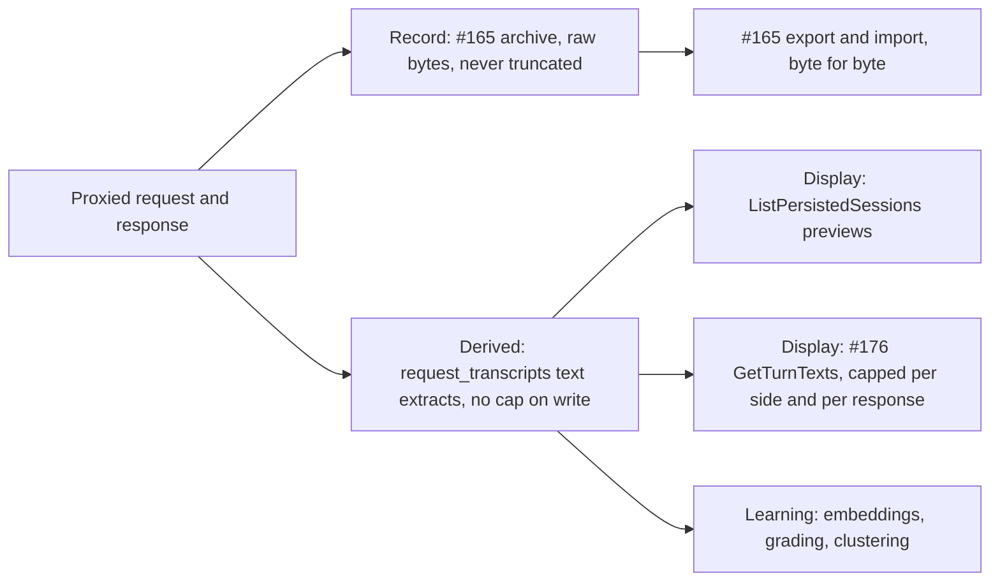
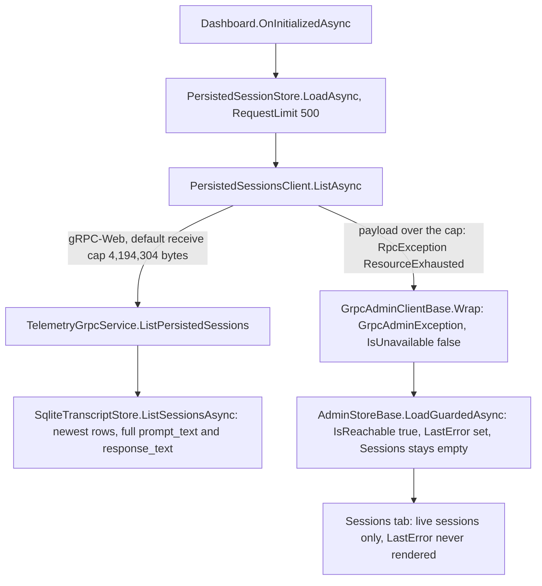

# Plan: Keep the persisted-session list under the GUI's 4 MiB gRPC receive cap (#179)

**Status:** Proposed. Awaiting David's approval. No production code changes in this change.
**Issue:** [#179](https://github.com/davidpizon/TotallyHot-ArcRouter/issues/179) — "Sessions tab: persisted history silently fails to load above gRPC's 4 MiB receive cap".
**Related:**
- [#176](https://github.com/davidpizon/TotallyHot-ArcRouter/issues/176) (three-pane Sessions tab). Its plan's §13 names this risk as "pre-existing and out of scope … worth a separate tracked item". This plan is that item.
- ADR-0019 (the storage direction), proposed in [PR #181](https://github.com/davidpizon/TotallyHot-ArcRouter/pull/181) as `docs/adr/0019-store-conversation-text-in-encrypted-per-session-files.md`.
  - **Merge dependency:** this plan's storage direction, its end state, and its #165 references assume #181 merges first.
  - On `main`, #165's plan still describes the earlier archive design, which #181 amends.
- [`dashboard.md`](../gui/dashboard.md) (Sessions tab data sources).
**ADR-0008 Amendment 1:** This is a defect fix with reproducing tests, not a smell refactor. It does not touch `ProxyMiddleware`, `RequestInterceptor`, or `ManagementFacade`.

David's requirement, 2026-09-30, exact words:

> Important: I want the application to store the full session text. When the application imports or exports transaction history (https://github.com/davidpizon/TotallyHot-ArcRouter/issues/165), it must always import and export the full, unadulterated, transaction text. However, the application does not need to display the conversation in the "Sessions" tab, a truncated or load-on-demand version of the task text is permissible and actually preferred to remain performant.

## Summary

- The Sessions tab loads persisted history with one `ListPersistedSessions` call for the newest 500 `request_transcripts` rows, full prompt and response text included.
- The GUI's gRPC client rejects any message over 4,194,304 bytes. The load fails once those 500 rows average more than **8,244 bytes of prompt plus response text per row**. One 4 MiB prompt fails it at any row limit.
- The failure is invisible. The tab shows live sessions only, and nothing renders the error.
- **Proposed fix.** The router sends 2,000-character previews, the same cap live telemetry already uses. Each row also carries truncation flags, its stored text lengths, and its row id. A hard response budget of 3 MiB sets `has_more` when it cuts the list. The GUI then shows load failures instead of hiding them.
- **Storage is untouched.** Only what the Sessions tab is sent gets shorter. Every stored row keeps its full text, and #165's export and import never read through this RPC.

## Where truncation is allowed

David's requirement splits the data into three tiers. Text may only get shorter on its way to the screen.



1. **Only display paths truncate.** That means display RPCs and GUI rendering. Every truncated value says so, with a "…" marker and its full length, or a `truncated` flag.
2. **No write path truncates.** This plan changes no write path. A guard test pins that the store round-trips text over 4 MiB exactly (§7).
3. **Export and import use only the record tier.** They never read a display RPC or a GUI DTO, so no display cap can reach a zip. The `request_transcripts` extracts are not the transaction text either. They keep only the newest user message's text parts and the reply's text parts, and the reply is extracted from a capture capped at 4 MiB (#165's plan, "What is stored today").
4. **The Sessions tab prefers load-on-demand.** The list carries previews now, which fixes the defect on today's tab. Once #176's per-turn text RPC exists, the list can carry metadata only (option E, decision 8).

**Storage direction (David, 2026-09-30).** Conversation text is moving out of SQLite.
- Each session becomes one encrypted file. It holds the session's full transaction bodies and its per-turn text extracts, with secrets obscured at write.
- SQLite keeps only an index, with no conversation text.
- This plan fixes today's storage in the meantime.
- Once session files exist, `ListPersistedSessions` sends metadata only, and the Sessions tab reads a session's text from its file when the session is opened.

## 1. What happens today



| Step | Where | Fact |
|---|---|---|
| Row limit | `PersistedSessionStore.cs:28` | `RequestLimit = 500`, requested once per page load (`Dashboard.razor:187`). |
| Server | `TelemetryGrpcService.cs:90-105` | Passes `request.Limit` to the store unvalidated and copies full text onto every row (`ToContract`, lines 108-132). |
| Store | `SqliteTranscriptStore.cs:364-405` | `SELECT … prompt_text, response_text … ORDER BY id DESC LIMIT $limit`. A limit of 0 throws, so a client that omits `limit` gets `StatusCode.Unknown`. |
| Server send cap | `ProxyServer.cs:275,279` | `AddGrpc` sets no `MaxSendMessageSize`, so the default applies: unlimited. The router sends the whole message. |
| Client receive cap | `WasmRouterChannelProvider.cs:37-40`, `TelemetryChannelFactory.cs:49-51,103-105` | No `MaxReceiveMessageSize`, so `Grpc.Net.Client`'s default applies: 4,194,304 bytes. |
| Failure | `GrpcAdminClientBase.cs:81-88` | `ResourceExhausted` is not `Unavailable`, so the result is a rejection: `IsUnavailable = false`. |
| Swallow | `AdminStoreBase.cs:176-189` | `IsReachable` stays true and `LastError` is set. `Sessions` keeps its initial empty list, and `TranscriptCaptureEnabled` keeps its default `false`. |
| UI | `Dashboard.razor:239-251` | Reads only `PersistedSessionStore.Sessions`. Nothing reads `LastError`, `IsReachable`, or `TranscriptCaptureEnabled`. |

### What bounds one row's text

- **`prompt_text`** is the newest user message's text parts, verbatim (`RequestInterceptor.cs:388`, `RequestTextExtractor`, `MessageContentTextExtractor`). Nothing caps it. Only Kestrel's default 30,000,000-byte request body limit bounds it, and nothing in `src/` lowers that limit.
- **`response_text`** is the assistant text extracted from the response capture, which is head-capped at 4 MiB (`UpstreamResponseWriter.MaxCapturedResponseBytes`, line 105).
- **Rejected prompts are persisted too.** `ProxyMiddleware.cs:732` publishes telemetry for every response relayed to the client, including a provider's final error. A prompt the provider refuses as too long is still stored in full.
- **Live telemetry is already capped.** `RequestSummary` and `ResponseSummary` go through `TextTruncator.Truncate`: 2,000 characters plus "…" (`RequestTelemetryPublisher.cs:604-607`). Persisted rows skip that cap.
- **Agent loops repeat the prompt.** An OpenAI-shaped agent client such as Copilot sends tool results as role `"tool"` messages, which `RequestTextExtractor` skips. So every tool-call iteration captures the same newest user message, attachments and all, into a new row.

## 2. Measurements

The investigation added tests that pin each step. All of them pass today.

- **Serialized size at 500 rows.** `TelemetryGrpcServiceTests.cs:254-316`, through the real `ListPersistedSessions` mapping, with metadata shaped like the sampled database. Per-row overhead is about 144 bytes.

| Text per row (prompt + response, UTF-8 bytes) | Serialized response | Share of the cap | Result |
|---|---|---|---|
| 362 + 76, this machine's `transcripts.db` mean (82 rows, sampled 2026-09-30) | 290,322 | 6.9% | Loads |
| 500 + 2,000, chat style | 1,321,822 | 31.5% | Loads |
| 2,000 + 4,000, agentic with long answers | 3,071,822 | 73.2% | Loads |
| **8,244 total, the break-even** | 4,193,822 | 99.99% | Loads |
| 8,245 total | 4,194,322 | over | **Fails** |
| 12,000 + 1,000, Copilot-style agent loop | 6,571,822 | 156.7% | **Fails** |
| One row with a 4 MiB prompt (`limit = 1`) | over 4,194,304 | over | **Fails** |

- **Non-ASCII text.** The break-even is in bytes. Text in the U+0800–U+FFFF range is 3 bytes per character in UTF-8, CJK for example. For such text the load fails from about 2,750 characters per row.
- **Client boundary.** `PersistedSessionsClientTests.cs:140-171` runs a real `GrpcChannel` built like `WasmRouterChannelProvider`'s, with a `GrpcWebHandler` and no size override. A 4,194,304-byte response is received. A 4,194,305-byte one throws `GrpcAdminException` with `IsUnavailable = false`, an inner `RpcException` of `ResourceExhausted`, and the message "Could not read persisted sessions: Received message exceeds the maximum configured message size."
- **Store.** `PersistedSessionStoreTests.cs:92` checks that exception after a load: `IsReachable` is true, `LastError` holds the message, `Sessions` is empty, and `TranscriptCaptureEnabled` is `false`.
- **Field status.** Not yet observed in the field. This machine's database holds 82 small rows. The failure needs realistic agentic traffic, not a pathological input.

## 3. Options

| Option | Change | Bounds the message? | Trade-offs |
|---|---|---|---|
| **A. Server previews plus a byte budget (recommended now)** | Router truncates each row's text to 2,000 characters, reports truncation flags, stored lengths and the row id, and stops adding rows at a 3 MiB budget with `has_more`. | **Yes, for any text and any limit.** | Additive contract change. A persisted turn over 2,000 characters can't be expanded in the GUI until #176's `GetTurnTexts` ships. Live turns already have that limit, and David prefers truncated display. |
| B. Lower `RequestLimit` | One constant in the GUI. | No | Break-even rises to about 20,800 bytes per row at 200 rows, or 41,800 at 100. One large row still fails. Everyone loses history, including users who never hit the cap. |
| C. Paginate (`before_id`, `next_page_token`) | Contract, service, and a GUI paging loop. | Only with a per-page byte budget, which is option A anyway. | More round trips and GUI code. Still transfers full text the tab mostly doesn't show. Can be layered on A later. |
| D. Raise `MaxReceiveMessageSize` | One line in `WasmRouterChannelProvider` and `TelemetryChannelFactory`. | No. Any finite cap can be exceeded, and `null` means tens of MB per page load. | The browser downloads and deserializes the whole history on its UI thread on every load, and holds it as UTF-16, double the bytes. The cap also rises for every RPC on the shared invoker. #176 §14 lists it as out of scope. |
| **E. Metadata-only list (recommended end state)** | Drop text from the list, and load it on demand for the selected session. | Yes | Breaks today's Sessions tab, which renders turn text from the list, until #176 Phase 2 lands. It then fits David's load-on-demand preference best: the list shrinks to roughly 75 KB. The selected session's text then needs its own bounded RPC (decision 8). |
| F. Server-streaming list | New RPC with one row per message. | Only with a per-row cap. | A new RPC plus a streaming GUI consumer, for little gain over A. |

**Why A needs both layers.** With 2,000-character previews, ASCII rows come to about 4.2 KB, so 500 rows are about 2.1 MB, half the cap. A character cap alone is not a byte guarantee: 2,000 CJK characters per side is about 12.2 KB per row, or 6.1 MB at 500 rows. The byte budget closes that gap exactly. It also holds if the limit, the metadata, or the field set grows.

## 4. Proposed change

### 4.1 Contract (`telemetry.proto`, additive only)

```proto
message PersistedTranscript {
  // ... fields 1-11 unchanged. prompt_text (6) and response_text (7) become previews: at most
  // TextTruncator.DefaultMaxLength (2,000) UTF-16 code units, plus "…" when cut - the same preview the
  // live RoutingTelemetryEvent carries.
  int64 transcript_id = 12;                 // request_transcripts.id, what #176's GetTurnTexts takes
  optional int32 prompt_text_length = 13;   // stored length in characters (SQLite count); displayed, never compared
  optional int32 response_text_length = 14;
  bool prompt_truncated = 15;               // the preview was cut
  bool response_truncated = 16;
}

message ListPersistedSessionsResponse {
  bool transcript_capture_enabled = 1;
  repeated PersistedTranscript transcripts = 2;
  bool has_more = 3;                        // older rows exist that the limit or the byte budget left out
}
```

The length fields reuse the names and meaning of #176's `SessionTurnDetail` fields 23 and 24: SQLite character counts, which are displayed but never compared. Truncation is reported by the explicit flags instead, so a mismatch between SQLite's character count and .NET's UTF-16 length can never misreport it.

### 4.2 Router: `TelemetryGrpcService.ListPersistedSessions`

- **Clamp the limit.** 0 becomes 500. Anything else is clamped to [1, 2,000], as #176 §5.2 does for its session RPC. This removes today's `StatusCode.Unknown` for an unset limit.
- **Detect `has_more`.** Ask the store for `limit + 1` rows.
- **Map previews.** Apply `TextTruncator.Truncate` to both texts. Send each preview's truncated flag, the SQLite character counts, and the row id. `SessionTranscript.Id` is already read (`SqliteTranscriptStore.cs:390`) but not sent today.
- **Where the counts come from.** They come from SQL, never from `string.Length`, whose UTF-16 count differs for emoji and other surrogate pairs.
  - `SqliteTranscriptStore.ListSessionsAsync` also selects `length(prompt_text)` and `length(response_text)`.
  - `SessionTranscript` gains `PromptTextLength` and `ResponseTextLength` (`int?`, null when the text is null), and `ToContract` copies them.
  - `TokenCalibrationService`, the method's other caller, ignores the new fields.
- **Enforce the budget.** `MaxListResponseBytes = 3 * 1024 * 1024`, three quarters of the client's default cap. Add rows newest first, keeping a running total.
  - The total starts at the size of the response's own fields: `transcript_capture_enabled` and `has_more`, 2 bytes each when set.
  - It then adds 1 tag byte plus `CodedOutputStream.ComputeMessageSize(row)` per row.
  - So the serialized response never exceeds the budget.

  When the next row would exceed the budget, set `has_more` and stop, so the result is always the newest contiguous rows. A preview row is about 4.2 KB for ASCII text and about 12.2 KB for CJK text. Its metadata strings (`requested_model`, `session_id`) are client-supplied and not truncated. The budget bounds the message regardless.
- **Log the cut.** Take an optional `ILogger<TelemetryGrpcService>`. When the budget, not the limit, cuts the list, log at Information with a static template: `"ListPersistedSessions returned {Returned} of {Requested} rows: the {BudgetBytes}-byte response budget was reached."`
- **Read cost (decision 9).** Text is truncated in C#, so the router still reads each row's full text. That is today's cost, and typically a few MB per page load. Selecting `substr(prompt_text, 1, 2001)` in SQL would bound the read, and `TextTruncator` gives the identical preview from that prefix. The catch is that SQLite's `length` counts code points while the GUI counts UTF-16 units, so truncation would then need explicit flags. Either way, this changes only what is read for display. Nothing written to `request_transcripts` changes.

### 4.3 GUI client and store

- `PersistedTranscriptDto` gains `TranscriptId`, `PromptTextLength`, `ResponseTextLength`, `PromptTruncated`, and `ResponseTruncated` as trailing optional parameters. `PersistedSessionsResult` gains `HasMore`, and `PersistedSessionsClient.ToDto` maps them.
- `PersistedSessionStore` exposes `HasMore`.
- `PersistedSessionMapper` already maps the text into `RequestSummary` and `ResponseSummary`, the fields live turns fill with 2,000-character previews (`PersistedSessionMapper.cs:66-67`). Persisted turns therefore render exactly like live turns. No other GUI code reads the full text.

### 4.4 GUI: make failures visible

- When `PersistedSessionStore.IsLoaded` is true and `LastError` is not null, the Sessions tab shows one muted line: "Persisted history couldn't be loaded: {LastError}". This covers any failed load, not only an oversized one. Today every load failure is silent.
- When `HasMore` is true, show one muted line: "Showing the newest {n} persisted turns."
- **#176 coordination.** #176 plans a rail footer that renders "Transcript capture off" from `TranscriptCaptureEnabled` (its §6.6 and §10). After a failed load that flag is `false`, so the footer would give a wrong reason. That footer must require a successful load (`LastError is null`) before it claims capture is off. If this plan lands after #176 Phase 1, the notice above goes into its footer instead of today's `LiveStream`.

## 5. Sequencing with #176

- **Independent of #176.** Phase 1 works on today's Sessions tab.
- **On-demand text follows #176.** #176 Phase 2's `GetTurnTexts` loads turns' text on demand, capped for display at 262,144 characters per side and 2 MiB per response. `transcript_id` lets its Show more call it directly. Until then, a persisted turn over 2,000 characters shows its preview only, which is what live turns show today. Neither is the full transaction text: that is #165's export, from the record tier.
- **Merge overlap.** Both plans add to `telemetry.proto`, `TelemetryGrpcService`, `PersistedSessionsClient`, and `PersistedTranscriptDto`, in different messages and members. Whichever lands second rebases. This plan is smaller, so landing it first is the cheaper order.

## 6. Phases

Each phase is a full vertical slice that ships on its own: warning-free under `TreatWarningsAsErrors`, all tests passing, coverage at 80% or higher.

1. **Phase 1: bounded list (router, contract, client mapping).**
   - §4.1, §4.2, and the DTO and store parts of §4.3.
   - Docs: the proto comments, `dashboard.md` (persisted history is previews under a budget), and `telemetry.md` (the preview cap, the budget, and `has_more`).
   - **Exit criteria:** a 500-row history at 13 KB per row, and one row with a 4 MiB prompt, both load over a default-options gRPC-Web channel. Previews match live summaries character for character.
2. **Phase 2: visible failures (GUI).**
   - §4.4.
   - **Exit criteria:** a rejected load and an unreachable router each render the notice. `has_more` renders its line.

## 7. Test strategy

All tests stay under the 5-second ceiling. The 4 MiB cases already run in well under a second.

- **`TelemetryGrpcServiceTests`.** The investigation's characterization tests assert today's overflow. Phase 1 inverts them:
  - For every profile in §2, including the single 4 MiB-prompt row, the serialized response, flag fields included, is at most `MaxListResponseBytes`. A case sized to land exactly on the budget proves the accounting is exact.
  - Lengths for text with emoji equal SQLite's character counts, not `string.Length`.
  - Previews equal `TextTruncator.Truncate` of the stored text.
  - The truncated flags are set exactly when a preview was cut.
  - The lengths equal SQLite's character counts.
  - 500 rows of 2,000-character CJK previews are cut by the budget, with `has_more` true and every returned row whole.
  - The limit is clamped (0, 1, 2,000, 5,000), and the store is asked for `limit + 1`.
  - `transcript_id` is mapped.
- **`SqliteTranscriptStoreTests` (storage guard).** A `prompt_text` and a `response_text` over 4 MiB each round-trip through `InsertAsync` and `GetTranscriptAsync` exactly. This pins rule 2 of "Where truncation is allowed": the display fix must never leak into storage.
- **`ProxyServerWebInterfaceTests` (integration).** A real `ProxyServer` serves a heavy history over gRPC-Web to a client with default options. This is the end-to-end regression test for the defect. `BuildServer` gains an optional `ITranscriptStore`.
- **`PersistedSessionsClientTests`.** The new fields and `HasMore` map. The receive-cap tests stay as they are, because they pin the client library's behavior, not ours.
- **`PersistedSessionStoreTests`.** `HasMore` passes through. The rejection test stays.
- **bUnit (Phase 2).** The notice renders for a rejected load and for an unreachable router, and not after a successful load. The `has_more` line renders.

## 8. Risks

| Risk | Mitigation |
|---|---|
| A persisted turn over 2,000 characters can't be expanded before #176 Phase 2 | David's requirement accepts truncated display. It is the same limit live turns have today, and `transcript_id` plus the truncation flags make #176's Show more a direct call. |
| Someone later points export at this RPC, or at `request_transcripts` text | Rule 3 of "Where truncation is allowed", stated in the proto comment and in `telemetry.md`. #165's export reads only its archive. |
| In-session search (#176 §6.3) only sees preview text for persisted turns | Same as live turns. Full-text search is out of scope for both plans. |
| The budget hides rows on non-ASCII-heavy histories | `has_more` plus the §4.4 line. At the worst case of 3 bytes per character, about 258 rows still fit. |
| Contract drift with #176 | Same field names and meaning. Additive on both sides. |

## 9. Out of scope

- Raising `MaxReceiveMessageSize` (option D), as #176 §14 also says.
- Paging to older history (option C). It can be added later as an additive `before_id`.
- Any change to what is stored. David's requirement is that storage keeps the full text.
- #165's export and import. They use the lossless archive, never this RPC. What that archive needs to meet the requirement belongs in #165's plan.
- Kestrel's request body limit.

## 10. Decisions for David

Each item has a default that this plan already assumes.

1. **Preview length.** 2,000 characters (default), matching `TextTruncator.DefaultMaxLength` and the live previews. The alternative is 600, #176's Show more threshold. It cuts the largest ASCII list, where every text exceeds the preview, from about 2.1 MB to about 0.7 MB. That suits David's performance preference, but persisted turns would then show less than live ones until #176.
2. **Budget.** 3 MiB (default), or 3.5 MiB.
3. **Fields 6 and 7.** Keep them with preview semantics (default). The GUI and router always ship together, since the router serves the WASM app. The alternative is new preview fields beside them.
4. **`transcript_id`.** Add it now (default), or rely on #176's per-session join.
5. **`has_more` line.** Show it (default), or omit it.
6. **ADR.** None by default, for the same reason as #176 §5.2: an additive change to a read-only loopback RPC. The alternative is an ADR before Phase 1, if the preview semantics on fields 6 and 7 count as a public-surface change.
7. **Characterization tests.** Keep the investigation's tests until Phase 1 inverts them (default), or drop them now.
8. **End state.** Settled by the storage direction under "Where truncation is allowed": the list becomes metadata-only once session files exist (option E). The selected session's previews then come from its file through a bounded per-session RPC. #176 plans its `GetSessionTurnDetails` as metadata only. It would need previews under the same byte budget and `has_more`, since 2,000 turns of CJK previews exceed 4 MiB.
9. **Where to truncate.** In C# (default): full rows are read, then cut. The alternative is a SQL prefix, which bounds the read and yields the same previews and flags. It must be a new display-only query, because `ListSessionsAsync` also feeds `TokenCalibrationService`, which counts tokens on the stored prompt text (`TokenCalibrationService.cs:144`).
