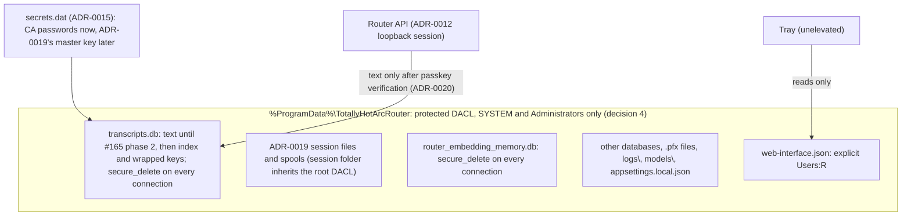

# Plan: Protect the router's data directory and make deletion final (#184)

**Status:** Proposed. Awaiting David's approval. No production code changes in this change.
**Issue:** [#184](https://github.com/davidpizon/TotallyHot-ArcRouter/issues/184) — "Protect the router's data directory and make deletion final".
**Related:**
- [ADR-0019](../adr/0019-store-conversation-text-in-encrypted-per-session-files.md) (proposed) moves conversation text into encrypted per-session files. Under "Found during the investigation, tracked separately" it lists: "Transcript data sits under default permissions, and deleted rows persist." **This plan is that item.**
- [#165 plan](issue-165-export-import-history.md) (amended 2026-09-30 to follow ADR-0019), [#179 plan](issue-179-persisted-sessions-list-size.md), and [#176](https://github.com/davidpizon/TotallyHot-ArcRouter/issues/176).
- [ADR-0012](../adr/0012-loopback-session-auth-and-token-in-secret-store.md) (loopback sessions) and [ADR-0015](../adr/0015-machine-scoped-protection-for-the-shared-secret-store.md) (the admin-only secret store).
- [ADR-0020](../adr/0020-require-passkey-verification-for-conversation-content.md) (proposed) gates conversation content behind passkey verification. It is the API-side companion to this plan, and is tracked in [#185](https://github.com/davidpizon/TotallyHot-ArcRouter/issues/185).

**ADR-0008 Amendment 1:** This is a security and privacy fix with observed evidence, not a smell refactor. It does not touch `ProxyMiddleware`, `RequestInterceptor`, or `ManagementFacade`.
**ADR first.** It changes a security boundary (who can read and write the machine-shared directory), so AGENTS.md requires an ADR before code (§5, phase 0; decision 2).

## Summary

- **Readable by any local account.** Every file in `%ProgramData%\TotallyHotArcRouter` except `secrets.dat` can be read by any local account. That includes `transcripts.db` and its `-wal`, which hold prompt and response text, and the log files, which by default hold request and response excerpts.
- **Writable by any local account.** Any local account can create files and folders in that directory, and the `LocalSystem` service then trusts them. The worst case is `appsettings.local.json`. It is optional, it is reloaded on change, and it does not exist on a default install.
- **Deletes don't remove data.** Rows deleted by retention or by Clear stay readable. In a disposable copy of the router's schema and pragmas, all 150 purged rows were still in the WAL. After Clear and a restart, 298 of 300 rows were still in `transcripts.db`.
- **What ADR-0019 already covers, once built:**
  - conversation text leaves SQLite;
  - each session gets its own key, and the master key is rotated after deletions;
  - the session folder is administrator-only and checked at startup;
  - wrapped keys get `secure_delete`;
  - the old text is removed on upgrade.
- **What this plan adds:**
  1. **Protect the whole directory**, not only the session folder. Fixed file names, the logs, and the configuration all sit outside it (F3–F5, F9).
  2. **The deletion rules ADR-0019 depends on**, backed by tests: `secure_delete` must be set on every connection, `ON` is needed rather than `FAST`, the WAL must be truncated, and pages freed before the change need a `VACUUM`.
  3. **An interim fix for today's `transcripts.db`**, which holds text until ADR-0019's text move ships.
  4. **Log hygiene.**
  5. **An uninstall option.**
- **API access is gated separately, by ADR-0020.** David's requirement (2026-09-30): exporting session data must not be open to any application that can make an HTTP call. Today any local process can mint a loopback session (ADR-0012) and read text through the router's own API (F10).
  - David chose passkeys, and extended the gate to import. Clear and lowering Sample Size stay ungated (decision 1).
  - #165's export and import must not ship before it.

## 1. Verified findings (2026-09-30, THEATRE-PC)

**Method.**
- **Real folder.** Only metadata was read: `icacls`, names, sizes, and owners. No database or log file was opened or copied.
- **Behavior** was tested with a throwaway harness in two places, both disposable:
  - the session scratchpad;
  - a probe folder, `C:\ProgramData\TotallyHotArcRouter-AclProbe-20260930`, beside the real folder and removed afterwards.

  The harness used the router's pinned packages (Microsoft.Data.Sqlite 10.0.12, SQLitePCLRaw.bundle_e_sqlite3 3.0.5, SQLite 3.53.4).
- **Account.** The shell ran as `THEATRE-PC\david`, unelevated, with Administrators marked deny-only. That is the same kind of token the tray runs with.
- **Install state.** The service is not installed on this machine. A dev-run router created the folder, so its owner is `david`. A folder created by the service inherits the same ACEs, with `SYSTEM` as owner.

| # | Finding | Evidence |
|---|---|---|
| F1 | The folder inherits `%ProgramData%`'s ACL unchanged: `Users:(OI)(CI)(RX)`, `Users:(CI)(WD,AD,WEA,WA)`, and `CREATOR OWNER:(OI)(CI)(IO)(F)`. | `icacls` on the real folder. The probe shows that a plain `Directory.CreateDirectory` gets the same ACL, and so does a new subfolder such as ADR-0019's session folder. |
| F2 | `BUILTIN\Users:(I)(RX)` is on all of these: `transcripts.db`, `-wal`, `-shm`, `agent_telemetry.db`, `router_embedding_memory.db`, `router-ca.pfx`, `router-leaf.pfx`, `telemetry-cert.pfx`, `appsettings.local.json`, `web-interface.json`, and `secrets.dat.pre-adr0014-backup`. Only `secrets.dat` carries ADR-0015's protected ACL. | `icacls` on each file |
| F3 | Users can add entries to the root, to `logs\`, and to `models\`, all of which the `LocalSystem` service reads. | F1's `(CI)(WD,AD)` ACE, which both subfolders inherit |
| F4 | `appsettings.local.json` is loaded with `optional: true, reloadOnChange: true` (`Program.cs:205-207`). The router never writes it. On a default install it does not exist, so a standard user can create it, own it, and have the service load it. That file controls everything configuration controls, including Serilog sinks and bind addresses. | Code and F3. Not exploited: this machine already has the file (933 B, owned by `david`). |
| F5 | **A per-file ACL does not protect SQLite's side files.** SQLite deletes `-wal` and `-shm` on last close and re-creates them on the next open. They come back with the folder's ACL, `Users:(I)(RX)`, even when `transcripts.db` carries the ADR-0015 ACL. A folder created with a protected, inheritable DACL fixes it: its `-wal` inherits only `SYSTEM`, `Administrators`, and the owner. | Probe |
| F6 | An unelevated process of an administrator is **denied** a file granted only to `SYSTEM` and `Administrators`. The tray runs unelevated and reads `web-interface.json` from this folder (`TrayDiscoveryReader`). | Probe (`UnauthorizedAccessException`) and code |
| F7 | Deleted rows stay recoverable. See the residue table below. | Scratchpad harness |
| F8 | **Pragmas are per connection.** `synchronous=NORMAL`, set once in `EnsureCreated`, reads back as `2` (FULL) on a new physical connection. `secure_delete` set the same way leaves 298 of 300 cleared rows recoverable (s5). Only `journal_mode=WAL` persists in the file. | Harness, s0 and s5 |
| F9 | The shipped `appsettings.json` sets Serilog's `MinimumLevel.Default` to `Debug`. At Debug, four templates write conversation text to `logs\arcrouter-*.log`: - `[INTERCEPTOR] Intercepted agent request message` and `... response message`, which log the first 4,000 characters of each body (`RequestInterceptor`, `ProxyMiddleware`); - `[INTERCEPTOR] Newest user message` (`RequestInterceptor`); - `[INTERCEPTOR] Assembled LLM response text` (`RequestTelemetryPublisher`). The newest 30 files are kept, with daily rolling. `LogRedaction` only strips CR/LF and truncates, so key-shaped strings are logged as they are. Clear does not touch the logs. | Code and config. Log contents were not opened. |
| F10 | ADR-0012's loopback fast path gives a session to "any local account", meaning any process that can make an HTTP call. Session text then leaves through these RPCs, so the file ACL does not change who can read it: - `ListPersistedSessions` returns `prompt_text` and `response_text`: full text today, previews after #179. - `StreamEvents` carries live `request_summary` and `response_summary`, plus `LogLineEvent` lines that contain F9's excerpts. - `GetManagementToken` returns the token to any session, and `RegenerateManagementToken` returns the new one. - Planned: #176's per-turn text, and #165's export and import. No MCP tool and no proxy endpoint returns session data (`/v1/models` is the proxy's only local endpoint). | ADR-0012 Consequences, `telemetry.proto`, and code |
| F11 | `Package.wxs` deliberately never references `%ProgramData%`, so uninstall keeps the folder (comment at lines 37-55). | Code |
| F12 | **Linux, macOS and Docker installs are open the same way.** - **Linux.** `install.sh` creates `/var/lib/totallyhot-arcrouter` and `/var/log/totallyhot-arcrouter` with a plain `mkdir -p`. The unit's `StateDirectory` and `LogsDirectory` set no mode, and the unit sets no `UMask`, so systemd's defaults apply: 0755 directories, and files created under a 022 umask. - **macOS.** `install.sh` creates `/Library/Application Support/TotallyHotArcRouter` (with `logs` inside) and never runs `chmod`. The tree is owned by `_arcrouter:staff`, and the plist sets no `Umask`. - **Docker.** The image creates `/data` with no `chmod` (`Dockerfile:72-75`), so it is `0755`. Every local account can therefore read state and logs. On Linux, the logs also live outside the state root. | `packaging/linux/install.sh`, `totallyhot-arcrouter.service`, `packaging/macos/install.sh`, `com.totallyhot.arcrouter.plist`. Not observed on a machine. |

**Residue.** The harness inserted 300 rows, one connection per insert, as `SqliteTranscriptStore` does. Every 50th row was 24 KB, so it spilled onto overflow pages. Retention then purged ids 1–150 (`DeleteOldestAsync`, then `DeleteBeforeAsync`), and Clear deleted the rest. Each cell counts the deleted rows whose text was still in the file.

| Scenario | After purge, running | After Clear, running | After Clear, stopped |
|---|---|---|---|
| s1, today (no `secure_delete`) | WAL 150/150 | WAL 300/300 | **db 298/300**, overflow 6/6 |
| s2, `secure_delete=ON` on every open + `wal_checkpoint(TRUNCATE)` | 0 | 0 | 0 |
| s3, `ON` with no checkpoint | db 90, WAL 126 | db 240, WAL 244 | 0 |
| s4, `FAST` + `TRUNCATE` | db 146/150 | db 296/300 | db 296/300 |
| s5, `ON` set only in `EnsureCreated` | db 148/150 | db 298/300 | db 298/300 |
| s6, `VACUUM` + `TRUNCATE`, no `secure_delete` | 0 | 0 | 0 |

So `FAST` does not meet the goal, `ON` also needs the WAL truncated, and `-shm` never held text in any scenario.

## 2. Options

| Option | Verdict |
|---|---|
| **A. One protected, inheritable DACL on the whole directory** (owner-only modes on Linux and macOS), created atomically and verified at startup | **Recommended.** It covers: - `-wal` and `-shm` (F5); - every future file and subfolder, including ADR-0019's session folder and spools; - `logs\` (F9), and the separate Linux logs directory (F12); - the squatting in F3 and F4. |
| B. The ADR-0015 per-file ACL on `transcripts.db`, `-wal`, and `-shm` | **Rejected.** The probe shows SQLite re-creates the side files with the folder's ACL (F5). It also leaves F3 and F4 open. |
| C. ADR-0019's scope alone: make only the session folder admin-only | **Partial.** It covers session files and spools but leaves F2–F4 and F9. `transcripts.db` stays readable to all users: its index metadata, plus wrapped keys that become harmless after rotation. A user can also create the session folder before the router does (F1). |
| **D. `secure_delete=ON` in `OpenConnection`, plus `wal_checkpoint(TRUNCATE)` after each purge or clear** | **Recommended.** ADR-0019 already requires `secure_delete` for wrapped keys. This makes it per connection (F8), and applies it to today's `transcripts.db` in the meantime. |
| E. `VACUUM` after each purge | Works (s6), but it rewrites the whole file every 5 minutes, and spills through a temp file unless `temp_store=MEMORY`. Use it for the one-time scrub only. |
| F. Per-session keys (crypto-shredding) | **Decided in ADR-0019** (proposed). Not re-decided here. |
| G. SQLCipher for the whole database | Rejected in ADR-0019. |

## 3. Design

**3.1 Directory DACL (option A).**
- **Rule set.** The DACL is protected, so nothing is inherited from `%ProgramData%`. `SYSTEM` and `Administrators` get full control with `(OI)(CI)`. The writing account gets an ACE under decision 4. Nothing is granted to `Users`, `Authenticated Users`, `Everyone`, or `INTERACTIVE`.
- **Creation.** Create the folder atomically with `DirectoryInfo.Create(DirectorySecurity)`, never create-then-restrict. Today the MSI never references `%ProgramData%` (F11). Creating the folder at install time, with the same rules, is a deliberate change.
- **Pre-host bootstrap.** Verification runs inside `AppDataPaths.ResolveMachineSharedDirectory`, before its write probe (`AppDataPaths.cs:150-159`). That makes it precede every other use of the directory, including `Program.CreateHostBuilder`, which resolves the directory while it registers `appsettings.local.json` (`Program.cs:205-207`). A protected root passes only if all three hold:
  - its owner is `SYSTEM` or `Administrators`. An owner can always rewrite its own DACL, so an individual account may own only the per-user fallback;
  - it is not a reparse point;
  - no broad group, and no individual account, has an ACE.

  **Legacy or squatted.** Any other root is owned by an individual account, which makes it either a legacy root or a squat. The bootstrap tells them apart by the legacy owner:
  - **The legacy owner** is the account that installed the router (the MSI passes the installing user's SID, `UserSID`). On a machine without the MSI, it is the account that runs the explicit, elevated `--migrate-data-directory` command.
  - **A root owned by the legacy owner** is migrated (below). On THEATRE-PC that is `david`'s root.
  - **A root owned by any other account** is a squat. The whole tree is renamed aside untouched, and a fresh protected root is created. Nothing is copied out of it, because its owner may have tampered with anything in it. The log names the quarantined path, which may still hold the operator's data and which an administrator should review and delete.

  **Who acts.**
  - Migration runs only elevated: in the MSI's install or upgrade, before it starts the service, or through `--migrate-data-directory`. On Linux and macOS, `install.sh` runs the same command as root.
  - The service, finding a root that is neither protected nor migrated, fails closed. It does not start, and it logs the command to run. It never re-creates an empty root over a legacy one.
  - An unelevated process does not use an unprotected root. It falls back to the per-user directory, as an unelevated dev run already does.

  **Config overlay.** The bootstrap registers `appsettings.local.json` only after the directory passes verification. Migration never carries an overlay across (below), and once the directory is protected, only an administrator can create one. So a planted file is never loaded.

  **Logging.** The bootstrap runs before the host has built its logger, so it buffers its outcomes. They are logged with static Serilog templates once logging is configured.

  The same helper verifies ADR-0019's session folder, so #165 phase 1's startup check reuses it rather than writing its own.
- **Migration builds a new protected tree.** The old tree was writable by every local account, so migration does not re-secure it in place. Changing a DACL or mode does not revoke a handle opened before the change, whether on a file or on a directory, so a process that held one could keep reading files or creating entries. Instead, migration:
  1. **Creates a new tree.** A randomly named sibling root, and its subdirectories, are created atomically with the protected DACL and `Administrators` as owner. On Linux and macOS they are `0700` and owned by the service account.
  2. **Moves each file that passes these checks:**
     - **No reparse points.** It never follows a junction, symlink, or mount point. The link itself stays behind.
     - **No hard links.** A regular file with more than one link stays behind: it shares its security with the file it points to, so adopting it would change an outside file too. The link count comes from `GetFileInformationByHandle`, or from `st_nlink` on Unix.
     - **No untrusted owner.** A file owned by any account other than `SYSTEM`, `Administrators`, or the legacy owner stays behind.
     - **No open handles.** On Windows, the file is renamed through an exclusive handle that does not follow links, and its owner and ACL are reset through that same handle. If another process holds the file open, the exclusive open fails, and migration fails closed, naming the file. On Linux and macOS, the file is copied into a new `0600` file, so no earlier descriptor reaches it.
     - **Not `appsettings.local.json`.** An application running as the legacy owner could have planted it, and no check can tell. It stays behind, and the router does not load it until an administrator reviews it and copies it into the protected root. On THEATRE-PC, the existing 933-byte overlay stays behind.
  3. **Swaps the trees.** The old root is renamed aside as a quarantine, and the new root is renamed into place. If a process holds the old root open so that it cannot be renamed, migration fails closed and says so.

  A directory handle opened before migration still points at an old directory, now inside the quarantine, so it cannot create entries in the live tree. Model files under `models\` are re-verified against their published checksums before their first load, which `LlmRouterModelSyncService` already fetches at sync. A file that fails is quarantined and downloaded again.

  Everything left behind is logged with its path and owner. Migration cannot tell a file planted by an app running as the legacy owner from that owner's own files, so it moves those and lists them in the log.
- **Linux and macOS (F12).** The same rule becomes owner-only modes:
  - **Linux:** the unit adds `StateDirectoryMode=0700`, `LogsDirectoryMode=0700` and `UMask=0077`, and `install.sh` creates both directories with mode `0700`.
  - **macOS:** `install.sh` sets `0700` on the state tree, which includes `logs`, and the plist gets a `Umask` of `077`.
  - **Startup verification** checks the state directory and the logs directory alike. Each must be owned by the service account (or by the current user, for a dev run's per-user fallback), must not be a symlink, and must have no group or other permission bits.
  - **Migration** copies files into the new `0700` tree, as above. It changes no mode in place, so it never touches a symlink's target or a hard-linked file's inode.
  - **Docker.** The image creates `/data` with `mkdir -p` and `chown`, but no `chmod` (`Dockerfile:72-75`), so it is `0755`, and the documented `-v arcrouter-data:/data` deployment would fail the check above.
    - The image creates `/data` with mode `0700`, and its entrypoint sets `umask 077`.
    - Inside the container the only accounts are root and the non-root service account, which already owns every file in the volume. So for an older named volume the bootstrap removes group and other bits in place, as the owner, with no elevated step. Named volumes live under a host directory only root can read, so no other host account could have planted entries.
    - A bind mount is the operator's responsibility. The docs require it to be owned by the container's UID with mode `0700`, and the bootstrap fails closed otherwise.
- **The public CA certificate.** `router-ca.crt` holds only a public certificate, but `docs/router/client-tls-setup.md` has users read it: Firefox and Chrome-on-Linux imports, `NODE_EXTRA_CA_CERTS`, `SSL_CERT_FILE`, and `curl --cacert`. A `0700` state directory, or an admin-only root, would hide it.
  - The service rewrites it at each start into a public directory that every user can read and only the service and administrators can write:
    - **Windows:** `%ProgramData%\TotallyHotArcRouter-Public\`;
    - **Linux:** a systemd `RuntimeDirectory` with mode `0755`, at `/run/totallyhot-arcrouter/`;
    - **macOS:** `/Library/Application Support/TotallyHotArcRouter-Public/`, owned by root with mode `0755`.
  - `client-tls-setup.md` points there.
  - **The squat checks apply.** That directory holds a trust anchor that users import, so a copy planted by another account would make them trust the attacker's root. The bootstrap applies the same owner and reparse checks as for the root, and rejects a directory it did not create.
- **`web-interface.json`** keeps an explicit `Users:R` ACE in the root, because it holds only a URL and a thumbprint. The tray opens it by its full path, which needs no traverse right on the root, so the tray keeps working (F6).
- **The secret-store writer (decision 4).** `SecureFile.WriteMachineShared` grants the writing account full control (`SecureFile.cs:158-165`; ADR-0015's writing-account rule). So any administrative rewrite of `secrets.dat` would hand that account's unelevated applications read access again.
  - **Machine-wide writes** grant only `SYSTEM` and `Administrators`.
  - **The per-user fallback** keeps `WriteRestricted`'s current-user-only ACL.
  - **No lockout.** Only `SYSTEM`, or an administrator running elevated, writes the machine-wide store, so the writer cannot lock itself out (the risk ADR-0015 noted).
  - **Linux and macOS.** Only the service account writes the store. Tools running as root go through ADR-0020's privileged channel, since a root-owned `0600` file is unreadable to the service.

  This revises an accepted ADR's rule, so the phase-0 ADR records it.
- **The `.pfx` files** lose `Users` read with nothing else changing. Clients trust the CA through the certificate store (`--install-certificate`), not through the `.pfx` files.
- **Operator effects.**
  - Editing `appsettings.local.json` or opening `logs\` by hand now needs elevation. The Console tab still streams the logs.
  - After migration, the operator reviews the overlay left in the quarantine and copies it into the protected root from an elevated prompt. Until then, its settings are not applied.
  - A service-secured folder sends an unelevated dev run to `%LocalAppData%`, as `AppDataPaths` already does.
  - Deleting the folder by hand after uninstall, as `docs/router/packaging-and-distribution.md` describes, needs elevation.

**3.2 Secure deletion (option D).**
- **Every connection.** `OpenConnection` runs `PRAGMA secure_delete=ON` on every connection, not once in `EnsureCreated` (F8). This applies to `transcripts.db` now, and to the index and wrapped keys after ADR-0019. It also applies to `router_embedding_memory.db`, because ADR-0019 deletes `memory_entries` with their session. Embedding vectors can be partly inverted back to text, for example by vec2text.
- **Truncate after each delete.** `DeleteOldestAsync`, `DeleteBeforeAsync`, and `DeleteAllAsync` end with `PRAGMA wal_checkpoint(TRUNCATE)`, and check its `busy` result.
  - **Purge.** If `busy` is non-zero, the next 5-minute retention cycle retries, and the retry is logged.
  - **Clear.** Clear cannot rely on that cycle. `TranscriptRetentionService.ExecuteAsync` exits at startup when capture is disabled, while `DeleteAllAsync` deliberately runs either way. So Clear retries the checkpoint itself, a few times over a few seconds. If the checkpoint is still busy, Clear reports, in an additive response field, that the deletion is not yet final.
  - **Startup.** The router runs `TRUNCATE` once at startup, before anything else opens the database. That finishes any deletion left pending.
  - **Embedding memory.** `router_embedding_memory.db` runs in WAL mode too (`RouterMemoryDatabase.cs:288`). Its deletes get the same `TRUNCATE`, busy handling, and startup checkpoint. Today they come from capacity eviction in `EmbeddingMemory`, and ADR-0019 adds deleting entries with their session.
    - **Batched.** `TrimToCurrentCapacityAsync` calls `DeleteAsync` once per evicted row (`EmbeddingMemory.cs:211-212`). A checkpoint inside `DeleteAsync` would therefore run once per row: 19,500 times when capacity drops from 20,000 to 500.
    - So the store gains a bulk delete. It removes one eviction batch in a single transaction, then checkpoints once.
  - ADR-0019's whole-session retention later takes the same path.
- **One-time scrub.** `secure_delete` zeroes content only when it is freed, so it cannot clean pages freed before it was turned on (s1). The scrub runs once, now on upgrade and again when ADR-0019 deletes the old text: `VACUUM` with `temp_store=MEMORY`, then `TRUNCATE`. It is the mechanism behind #165 phase 2's exit criterion, "neither do its freed pages".
- **`synchronous=NORMAL`** has the same per-connection defect. Moving it into `OpenConnection` changes write durability and speed, so it is decision 8, not a silent fix.

**3.3 Logs (F9).**
- Ship `MinimumLevel.Default: Information`.
- Put all four conversation-bearing templates (F9) behind their own opt-in switch, and write them to their own files (for example `logs\bodies-*.log`). Clear and uninstall can then remove them without touching the diagnostic logs.
- The four templates carry a marker property (ADR-0020). It selects their lines for the body files, and it lets `StreamEvents` drop them for sessions without a content grant.
- Pass their text through the same secret obscuring ADR-0019 uses for storage.
- **Clear** first closes the body sink, which flushes and releases its file. It then deletes every body file and reopens the sink. Deleting under an open sink would not work: Windows refuses to delete the open file, and elsewhere the sink would keep writing to the unlinked file.
- **Pre-upgrade logs.** Files written before the upgrade still hold unobscured excerpts, and would otherwise linger until the newest-30 limit rolls them off.
  - On the first start after the upgrade, the router rewrites each `arcrouter-*.log` without any line from the four F9 templates, and replaces the original with the rewrite.
  - A file it cannot rewrite is deleted.
  - The old disk blocks are not overwritten. That is the same remnant ADR-0019 leaves to BitLocker.

Today these logs break two of ADR-0019's privacy drivers: "no readable conversation text at rest outside a protected store", and "no secret ever written to disk".

**3.4 Notes for ADR-0019's deletion path.** The design is ADR-0019's. The harness adds three implementation rules:
- delete the wrapped key on a connection that has `secure_delete` set (F8);
- truncate the WAL afterwards (s3);
- treat `busy` as "not yet final", and retry it.

The master-key rotation rewrites `secrets.dat` through `WriteAtomically`, a temp file and a rename. It runs in the service, and with §3.1's writer change the new file grants only `SYSTEM` and `Administrators`. The rename frees the old file's disk blocks without overwriting them, which is the secret-store remnant ADR-0019 already leaves to BitLocker.

**3.5 Uninstall (F11).** A best-effort custom action runs on a genuine uninstall only, using `UninstallCertificate`'s condition: `REMOVE~="ALL" AND NOT UPGRADINGPRODUCTCODE`. Once ADR-0019's master key exists, it:
- deletes only that master-key entry from `secrets.dat`, which leaves every session file undecryptable;
- removes the session folder;
- deletes the body-excerpt log files (§3.3);
- keeps the spend databases.

Until then, it can run the one-time scrub after clearing `request_transcripts` (decision 7).

## 4. Coordination

- **David's 2026-09-30 decisions.**
  - Full text is stored, and export and import are never truncated. This plan protects and erases data; it never shortens it.
  - Secrets are obscured at write. The Debug log excerpts (F9) are a second, unobscured copy of text, and §3.3 brings them under the same rule.
- **ADR-0019 and #165 phase 1.**
  - #165 phase 1 owns "the admin-only folder, checked at startup" for ADR-0019's session folder.
  - **Recommended:** this plan's phase 1 lands first. The session folder then inherits the root DACL, and #165 reuses the verification helper.
  - If #165 phase 1 lands first, this plan extends its helper to the root instead (decision 10).
  - Either way, ADR-0019's random file names and junction refusal still apply inside the folder.
- **#165 phase 2** ("text moves off `transcripts.db`"). Its exit criterion requires the freed pages to be clean too. §3.2's one-time scrub is how that is met, and s1 shows it is not met today.
- **#165 export and import paths.**
  - #165 §1 has the `LocalSystem` service write the zip to a caller-supplied path, and §2 reads it from one. Under ADR-0012, any local account can make that call. That turns it into a SYSTEM-privileged write or read at any path.
  - **Recommended:** stream the zip to the client, which writes it with its own rights.
  - Otherwise, accept only a router-owned `exports\` folder inside the protected root.
  - Either way, export and import also sit behind ADR-0020's passkey gate. Moving the bytes fixes the SYSTEM-privileged write and read, but not who may export.
  - **Import binds to the bytes** (ADR-0020). #165's import stages the archive first, into a router-owned spool in the protected root, and the passkey challenge binds the staged file's SHA-256. The router then imports exactly that staged file. Approving a path instead would let an application running as the operator swap the zip between the ceremony and the read.
  - **Staging is bounded** (ADR-0020), because it happens before the passkey check:
    - one stage at a time;
    - the declared length is checked against free space minus #165's reserve before any data is written;
    - an unclaimed stage expires after 10 minutes, and every stage is deleted at startup.

    #165's own free-space and compression-bomb checks run after staging, so they don't cover this.
- **#165's CLI flag.** `--export-conversations` runs as whoever launches it. Once the store is protected, it needs an elevated prompt, and #165's docs should say so.
- **#179** sends previews instead of full text. Previews are still text, so F10 applies to them too.

## 5. Phasing

0. **ADR.** It records:
   - the directory boundary, the `Users:R` exception for `web-interface.json`, and the public CA directory;
   - secure deletion;
   - the uninstall behavior;
   - that conversation text over the API is gated by ADR-0020;
   - that machine-wide secret writes drop ADR-0015's writing-account ACE.

   Either a new ADR or an amendment to ADR-0019 while it is still proposed (decision 2).
1. **Directory DACL.**
   - the verification helper and atomic creation;
   - the legacy-owner rule, and the migration into a new protected tree with its quarantine;
   - the elevated `--migrate-data-directory` command, run by the MSI and `install.sh` on install and upgrade;
   - the `web-interface.json` `Users:R` exception;
   - the secret-store writer change;
   - the MSI folder creation;
   - the Linux, macOS and Docker mode changes;
   - the public CA certificate directory, with `client-tls-setup.md` updated to match.
2. **Secure delete.**
   - `secure_delete` in `OpenConnection` for `transcripts.db` and `router_embedding_memory.db`;
   - `TRUNCATE` after purge, Clear, and each batch of `memory_entries` deletes (with the new bulk delete), plus Clear's own retry and the startup checkpoint;
   - the one-time scrub.
3. **Logs.**
   - the Information default;
   - the separate opt-in body files, with obscuring;
   - the one-time rewrite of pre-upgrade logs.
4. **Uninstall** custom action. Its master-key step waits for ADR-0019.

Phases 1–3 do not depend on ADR-0019 and can ship first. Phase 1 should precede #165 phase 1 (decision 10).

**Phase 1 is a hard prerequisite of ADR-0020's gate (#185).** That gate relies on only `SYSTEM` and `Administrators` being able to change the secret store. Until phase 1 migrates the existing store and changes the writer, an unelevated application of the store's last writer could add its own passkey credential.

## 6. Tests

All tests stay under the 5-second ceiling. ACL tests are Windows-only, marked `[SupportedOSPlatform("windows")]`. Mode tests are Unix-only. Each set is skipped elsewhere.

- The directory is created with the protected rule set, and a new file inherits no `Users` ACE.
- A SQLite `-wal` created after a close and reopen inherits the protected ACL (F5's probe, as a test).
- Each kind of root is handled as designed:
  - a root owned by an account other than the legacy owner is quarantined untouched, and a fresh root is created;
  - the legacy owner's root is migrated;
  - the service fails closed on a root that is neither protected nor migrated;
  - a reparse-point root is never followed.
- A directory handle opened before migration, on the old root or on `logs\`, cannot create a file in the live tree afterwards.
- Migration renames aside a planted child junction that points outside the root, and the target's ACL is unchanged. It also renames aside a child owned by another account rather than adopting it.
- Migration renames aside a planted hard link to a file outside the root. The outside file's owner and ACL (on Unix, its mode) are unchanged.
- A file that another process holds open with a writable handle from before migration:
  - on Windows, makes the bootstrap fail closed and name the file;
  - on Unix, does not see writes made after migration through the pre-opened descriptor.
- On Linux and macOS, verification fails a state or logs directory that has group or other bits, or that is a symlink. A new file is created with mode `0600`.
- `web-interface.json` keeps `Users:R`, and `TrayDiscoveryReader` still reads it.
- On every platform, an ordinary user can read `router-ca.crt` from the public directory. A public directory created by another account is rejected.
- In Docker, an older named volume at mode `0755` is tightened in place by its owner. A bind mount with the wrong owner or mode makes the bootstrap fail closed.
- A fresh **non-pooled** connection from `OpenConnection` returns 1 for `PRAGMA secure_delete` (F8).
- Canary rows are absent from the db and the WAL after `DeleteOldestAsync`, after `DeleteBeforeAsync`, and after `DeleteAllAsync`. This is s2 as a test, sized to stay under 5 s.
- Canary vectors are absent from `router_embedding_memory.db` and its WAL after a batched eviction, and the batch runs exactly one checkpoint.
- The one-time scrub removes canaries that were deleted before `secure_delete` was on (s1, then scrub).
- A `busy` result from `TRUNCATE` is handled and logged.
- With capture disabled and a reader holding the WAL:
  - Clear retries, then reports that the deletion is not final;
  - the next startup truncates the WAL.
- A key-shaped string in a logged body is obscured.
- The pre-upgrade rewrite removes a planted line of each of the four F9 templates, and keeps every other line. A file it cannot rewrite is deleted.
- The bootstrap sets aside a planted `appsettings.local.json` before host configuration can load it, including one owned by the root's own owner. It also rejects a machine-wide root owned by an individual account.
- A model file that fails its published checksum after migration is quarantined, not loaded.
- Rewriting a machine-wide secret as an elevated administrator leaves an ACL of only `SYSTEM` and `Administrators`, with no ACE for the writer. The per-user fallback still grants only the current user.
- Clear deletes the body-excerpt files while the body sink is open and writing, and the sink keeps working afterwards.

ADR-0019's own deletion test ("a copy of its file cannot be decrypted") stays in #165's plan.

## 7. Decisions for David

1. **API boundary (F10).** **Decided (David, 2026-09-30):**
   - **Requirement:** "I don't want to leave it open to any application that can make an HTTP call."
   - **Mechanism:** passkeys, meaning WebAuthn user verification.
   - **Scope:** export and import, plus every RPC that returns conversation text.
   - **Not gated:** Clear, deleting a session or an import, and lowering Sample Size. They destroy history rather than disclose it.
   - **Recorded in** [ADR-0020](../adr/0020-require-passkey-verification-for-conversation-content.md) (proposed), tracked in [#185](https://github.com/davidpizon/TotallyHot-ArcRouter/issues/185). ADR-0020 holds the design, its limits, and the options it rejected.
   - **Also decided:**
     - conversation text stays hidden until a passkey is enrolled;
     - the read window defaults to 15 minutes;
     - synced passkeys are allowed.
2. **ADR form.** Recommended: a new ADR for the directory boundary, because it covers files beyond conversations: `.pfx` files, configuration, logs, and the other databases. The alternative is to amend ADR-0019 while it is still proposed.
3. **Scope.** The whole directory (A, recommended), or ADR-0019's session folder only (C)?
4. **The writing account's ACE on dev machines.** Recommended, under decision 1's requirement: **no ACE for any individual account.** With one, any app running as that account reads the files directly.
   - A dev run must be elevated, or it uses the existing per-user fallback, `%LocalAppData%`. That fallback cannot meet the requirement, because every app of that user can read it.
   - On a service install, the writing account is `SYSTEM` anyway.
5. **Report the `appsettings.local.json` squatting (F4) separately**, as a higher-priority security issue in case phase 1 slips? Recommended: yes.
6. **`secure_delete` on every database, or only on stores derived from text?** Recommended: every database. It is one line in each `OpenConnection`, and the cost is a few extra writes.
7. **Uninstall.** Three choices:
   - keep everything (today);
   - crypto-shred conversations only (recommended);
   - add a checkbox.
8. **`synchronous=NORMAL` on every connection** (F8). It is a small durability trade. Recommended: yes, noted in the ADR.
9. **Remove `secrets.dat.pre-adr0014-backup`** once David confirms it is no longer needed? It is a stale copy of the secret store that every user can read. It is sealed to `david` (CurrentUser DPAPI), so other accounts cannot decrypt it.
10. **Order against #165 phase 1.** Recommended: this plan's phase 1 first, so the session folder inherits the protected root.
