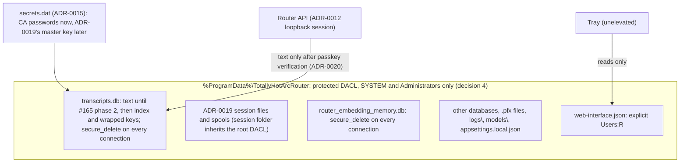

# Plan: Protect the router's data directory and make deletion final (#184)

**Status:** Approved by David on 2026-10-03 ([sign-off on #184](https://github.com/davidpizon/TotallyHot-ArcRouter/issues/184#issuecomment-5976893257)). Every §7 decision is now settled; see §7.
**Issue:** [#184](https://github.com/davidpizon/TotallyHot-ArcRouter/issues/184) — "Protect the router's data directory and make deletion final".
**Related:**
- [ADR-0019](../adr/0019-store-conversation-text-in-encrypted-per-session-files.md) (accepted 2026-10-07) moves conversation text into encrypted per-session files. Under "Found during the investigation, tracked separately" it lists: "Transcript data sits under default permissions, and deleted rows persist." **This plan is that item.**
- [#165 plan](issue-165-export-import-history.md) (amended 2026-09-30 to follow ADR-0019), [#179 plan](issue-179-persisted-sessions-list-size.md), and [#176](https://github.com/davidpizon/TotallyHot-ArcRouter/issues/176).
- [ADR-0012](../adr/0012-loopback-session-auth-and-token-in-secret-store.md) (loopback sessions) and [ADR-0015](../adr/0015-machine-scoped-protection-for-the-shared-secret-store.md) (the admin-only secret store).
- [ADR-0020](../adr/0020-require-passkey-verification-for-conversation-content.md) (proposed) gates conversation content behind passkey verification. It is the API-side companion to this plan, and is tracked in [#185](https://github.com/davidpizon/TotallyHot-ArcRouter/issues/185).

**ADR-0008 Amendment 1:** This is a security and privacy fix with observed evidence, not a smell refactor. It does not touch `ProxyMiddleware`, `RequestInterceptor`, or `ManagementFacade`.
**ADR first.** It changes a security boundary (who can read and write the machine-shared directory), so AGENTS.md requires an ADR before code (§5, phase 0; decision 2).

## Summary

- **Readable by any local account.** Every file in `%ProgramData%\TotallyHotArcRouter` except `secrets.dat` can be read by any local account. That includes `transcripts.db` and its `-wal`, which hold prompt and response text, and the log files, which by default hold request and response excerpts.
- **Writable by any local account.** Any local account can create files and folders in that directory, and the `LocalSystem` service then trusts them. The worst case is `appsettings.local.json`. It is optional, it is reloaded on change, and it does not exist on a default install.
- **Deletes don't remove data.** Rows deleted by retention or by Clear stay readable. In a disposable copy of the router's schema and pragmas, all 150 purged rows were still in the WAL. After Clear and a restart, 298 of 300 rows were still in `transcripts.db`.
- **What ADR-0019 already covers, once built:**
  - conversation text leaves SQLite;
  - each session gets its own key, and the master key is rotated after deletions;
  - the session folder is administrator-only and checked at startup;
  - wrapped keys get `secure_delete`;
  - the old text is removed on upgrade.
- **What this plan adds:**
  1. **Protect the whole directory**, not only the session folder. Fixed file names, the logs, and the configuration all sit outside it (F3–F5, F9).
  2. **The deletion rules ADR-0019 depends on**, backed by tests: `secure_delete` must be set on every connection, `ON` is needed rather than `FAST`, the WAL must be truncated, and pages freed before the change need a `VACUUM`.
  3. **An interim fix for today's `transcripts.db`**, which holds text until ADR-0019's text move ships.
  4. **Log hygiene.**
  5. **An uninstall option** on Windows, Linux and macOS.
- **API access is gated separately, by ADR-0020.** David's requirement (2026-09-30): exporting session data must not be open to any application that can make an HTTP call. Today any local process can mint a loopback session (ADR-0012) and read text through the router's own API (F10).
  - David chose passkeys, and extended the gate to import. Clear and lowering Sample Size stay ungated (decision 1).
  - #165's export and import must not ship before it.

## 1. Verified findings (2026-09-30, THEATRE-PC)

**Method.**
- **Real folder.** Only metadata was read: `icacls`, names, sizes, and owners. No database or log file was opened or copied.
- **Behavior** was tested with a throwaway harness in two places, both disposable:
  - the session scratchpad;
  - a probe folder, `C:\ProgramData\TotallyHotArcRouter-AclProbe-20260930`, beside the real folder and removed afterwards.

  The harness used the router's pinned packages (Microsoft.Data.Sqlite 10.0.12, SQLitePCLRaw.bundle_e_sqlite3 3.0.5, SQLite 3.53.4).
- **Account.** The shell ran as `THEATRE-PC\david`, unelevated, with Administrators marked deny-only. That is the same kind of token the tray runs with.
- **Install state.** The service is not installed on this machine. A dev-run router created the folder, so its owner is `david`. A folder created by the service inherits the same ACEs, with `SYSTEM` as owner.

| # | Finding | Evidence |
|---|---|---|
| F1 | The folder inherits `%ProgramData%`'s ACL unchanged: `Users:(OI)(CI)(RX)`, `Users:(CI)(WD,AD,WEA,WA)`, and `CREATOR OWNER:(OI)(CI)(IO)(F)`. | `icacls` on the real folder. The probe shows that a plain `Directory.CreateDirectory` gets the same ACL, and so does a new subfolder such as ADR-0019's session folder. |
| F2 | `BUILTIN\Users:(I)(RX)` is on all of these: `transcripts.db`, `-wal`, `-shm`, `agent_telemetry.db`, `router_embedding_memory.db`, `router-ca.pfx`, `router-leaf.pfx`, `telemetry-cert.pfx`, `appsettings.local.json`, `web-interface.json`, and `secrets.dat.pre-adr0014-backup`. Only `secrets.dat` carries ADR-0015's protected ACL. | `icacls` on each file |
| F3 | Users can add entries to the root, to `logs\`, and to `models\`, all of which the `LocalSystem` service reads. | F1's `(CI)(WD,AD)` ACE, which both subfolders inherit |
| F4 | `appsettings.local.json` is loaded with `optional: true, reloadOnChange: true` (`Program.cs:205-207`). The router never writes it. On a default install it does not exist, so a standard user can create it, own it, and have the service load it. That file controls everything configuration controls, including Serilog sinks and bind addresses. | Code and F3. Not exploited: this machine already has the file (933 B, owned by `david`). |
| F5 | **A per-file ACL does not protect SQLite's side files.** SQLite deletes `-wal` and `-shm` on last close and re-creates them on the next open. They come back with the folder's ACL, `Users:(I)(RX)`, even when `transcripts.db` carries the ADR-0015 ACL. A folder created with a protected, inheritable DACL fixes it: its `-wal` inherits only `SYSTEM`, `Administrators`, and the owner. | Probe |
| F6 | An unelevated process of an administrator is **denied** a file granted only to `SYSTEM` and `Administrators`. The tray runs unelevated and reads `web-interface.json` from this folder (`TrayDiscoveryReader`). | Probe (`UnauthorizedAccessException`) and code |
| F7 | Deleted rows stay recoverable. See the residue table below. | Scratchpad harness |
| F8 | **Pragmas are per connection.** `synchronous=NORMAL`, set once in `EnsureCreated`, reads back as `2` (FULL) on a new physical connection. `secure_delete` set the same way leaves 298 of 300 cleared rows recoverable (s5). Only `journal_mode=WAL` persists in the file. | Harness, s0 and s5 |
| F9 | The shipped `appsettings.json` sets Serilog's `MinimumLevel.Default` to `Debug`. At Debug, four templates write conversation text to `logs\arcrouter-*.log`: - `[INTERCEPTOR] Intercepted agent request message` and `... response message`, which log the first 4,000 characters of each body (`RequestInterceptor`, `ProxyMiddleware`); - `[INTERCEPTOR] Newest user message` (`RequestInterceptor`); - `[INTERCEPTOR] Assembled LLM response text` (`RequestTelemetryPublisher`). The newest 30 files are kept, with daily rolling. `LogRedaction` only strips CR/LF and truncates, so key-shaped strings are logged as they are. Clear does not touch the logs. | Code and config. Log contents were not opened. |
| F10 | ADR-0012's loopback fast path gives a session to "any local account", meaning any process that can make an HTTP call. Session text then leaves through these RPCs, so the file ACL does not change who can read it: - `ListPersistedSessions` returns `prompt_text` and `response_text`: full text today, previews after #179. - `StreamEvents` carries live `request_summary` and `response_summary`, plus `LogLineEvent` lines that contain F9's excerpts. - `GetManagementToken` returns the token to any session, and `RegenerateManagementToken` returns the new one. - Planned: #176's per-turn text, and #165's export and import. No MCP tool and no proxy endpoint returns session data (`/v1/models` is the proxy's only local endpoint). | ADR-0012 Consequences, `telemetry.proto`, and code |
| F11 | `Package.wxs` deliberately never references `%ProgramData%`, so uninstall keeps the folder (comment at lines 37-55). The Linux and macOS `uninstall.sh` scripts also keep the state and logs on purpose, and print the commands that would delete them (header comments). | Code: `Package.wxs`, `packaging/linux/uninstall.sh`, `packaging/macos/uninstall.sh` |
| F12 | **Linux, macOS and Docker installs are open the same way.** - **Linux.** `install.sh` creates `/var/lib/totallyhot-arcrouter` and `/var/log/totallyhot-arcrouter` with a plain `mkdir -p`. The unit's `StateDirectory` and `LogsDirectory` set no mode, and the unit sets no `UMask`, so systemd's defaults apply: 0755 directories, and files created under a 022 umask. - **macOS.** `install.sh` creates `/Library/Application Support/TotallyHotArcRouter` (with `logs` inside) and never runs `chmod`. The tree is owned by `_arcrouter:staff`, and the plist sets no `Umask`. - **Docker on a Linux host.** The image creates `/data` with no `chmod` (`src/TotallyHotArcRouter/Dockerfile:72-75`), so it is `0755`, and Docker copies that mode and owner onto a new named volume. The documented `-v arcrouter-data:/data` volume (`src/README.md:271`) is `/var/lib/docker/volumes/arcrouter-data/_data`. Docker Engine makes `/var/lib/docker` `0711`, and both `volumes` and each volume's own directory `0701`. Other accounts cannot list those directories, but they can pass through them. The volume name and the file names are fixed, so any host account can open `transcripts.db` by its full path. - **Not exposed:** Docker Desktop keeps volumes inside its VM, and rootless Docker keeps them in the user's home directory. A bind mount takes the host directory's own owner and mode. So on Linux and macOS, and on a Linux host running Docker Engine, every local account can read the state and logs. Only `secrets.dat` (`0600`) and its key ring (`0700`) are already closed. On Linux, the logs also live outside the state root. | `packaging/linux/install.sh`, `totallyhot-arcrouter.service`, `packaging/macos/install.sh`, `com.totallyhot.arcrouter.plist`, `SecureFile.WriteMachineShared`. Docker's modes: moby's `daemon/daemon_unix.go` (`setupDaemonRoot`) and `daemon/volume/local/local.go`. Not observed on a machine. |

**Residue.** The harness inserted 300 rows, one connection per insert, as `SqliteTranscriptStore` does. Every 50th row was 24 KB, so it spilled onto overflow pages. Retention then purged ids 1–150 (`DeleteOldestAsync`, then `DeleteBeforeAsync`), and Clear deleted the rest. Each cell counts the deleted rows whose text was still in the file.

| Scenario | After purge, running | After Clear, running | After Clear, stopped |
|---|---|---|---|
| s1, today (no `secure_delete`) | WAL 150/150 | WAL 300/300 | **db 298/300**, overflow 6/6 |
| s2, `secure_delete=ON` on every open + `wal_checkpoint(TRUNCATE)` | 0 | 0 | 0 |
| s3, `ON` with no checkpoint | db 90, WAL 126 | db 240, WAL 244 | 0 |
| s4, `FAST` + `TRUNCATE` | db 146/150 | db 296/300 | db 296/300 |
| s5, `ON` set only in `EnsureCreated` | db 148/150 | db 298/300 | db 298/300 |
| s6, `VACUUM` + `TRUNCATE`, no `secure_delete` | 0 | 0 | 0 |

So `FAST` does not meet the goal, `ON` also needs the WAL truncated, and `-shm` never held text in any scenario.

## 2. Options

| Option | Verdict |
|---|---|
| **A. One protected, inheritable DACL on the whole directory** (owner-only modes on Linux and macOS), created atomically and verified at startup | **Recommended.** It covers: - `-wal` and `-shm` (F5); - every future file and subfolder, including ADR-0019's session folder and spools; - `logs\` (F9), and the separate Linux logs directory (F12); - the squatting in F3 and F4. |
| B. The ADR-0015 per-file ACL on `transcripts.db`, `-wal`, and `-shm` | **Rejected.** The probe shows SQLite re-creates the side files with the folder's ACL (F5). It also leaves F3 and F4 open. |
| C. ADR-0019's scope alone: make only the session folder admin-only | **Partial.** It covers session files and spools but leaves F2–F4 and F9. `transcripts.db` stays readable to all users: its index metadata, plus wrapped keys that become harmless after rotation. A user can also create the session folder before the router does (F1). |
| **D. `secure_delete=ON` in `OpenConnection`, plus `wal_checkpoint(TRUNCATE)` after each purge or clear** | **Recommended.** ADR-0019 already requires `secure_delete` for wrapped keys. This makes it per connection (F8), and applies it to today's `transcripts.db` in the meantime. |
| E. `VACUUM` after each purge | Works (s6), but it rewrites the whole file every 5 minutes, and spills a full copy of the database through a temp file. Use it for the one-time scrub only, with that temp file in the protected root (§3.2). |
| F. Per-session keys (crypto-shredding) | **Decided in ADR-0019** (accepted 2026-10-07). Not re-decided here. |
| G. SQLCipher for the whole database | Rejected in ADR-0019. |

## 3. Design

**3.1 Directory DACL (option A).**
- **Rule set.** The DACL is protected, so nothing is inherited from `%ProgramData%`. `SYSTEM` and `Administrators` get full control with `(OI)(CI)`. The writing account gets an ACE under decision 4. Nothing is granted to `Users`, `Authenticated Users`, `Everyone`, or `INTERACTIVE`.
- **Creation.** Create the folder atomically with `DirectoryInfo.Create(DirectorySecurity)`, never create-then-restrict. Today the MSI never references `%ProgramData%` (F11). Creating the folder at install time, with the same rules, is a deliberate change.
- **Pre-host bootstrap.** Verification runs inside `AppDataPaths.ResolveMachineSharedDirectory`, before its write probe (`AppDataPaths.cs:150-159`). That makes it precede every other use of the directory, including `Program.CreateHostBuilder`, which resolves the directory while it registers `appsettings.local.json` (`Program.cs:205-207`). A protected root passes only if all three hold:
  - its owner is `SYSTEM` or `Administrators`. An owner can always rewrite its own DACL, so an individual account may own only the per-user fallback;
  - it is not a reparse point;
  - no broad group, and no individual account, has an ACE.

  **Legacy or squatted.** Any other root is unprotected, and the bootstrap classifies it by owner:
  - **Owned by `SYSTEM` or `Administrators`, with the old broad DACL.** This is a pre-phase-1 root that the installed service or an elevated run created (the normal installed case). The owner authenticates it, because no standard account can make `SYSTEM` or `Administrators` an owner. It is migrated (below).
  - **Linux and macOS: owned by root or the configured service account** (`arcrouter`, `_arcrouter`, or the container's `arcrouter`). This is the normal installed case there, because systemd and `install.sh` make the service account the owner of the state and logs directories. No standard user can create a directory owned by either account, so the owner authenticates it. It is migrated by `install.sh`, which runs as root, and the new tree keeps the service account as its owner.
  - **Owned by the legacy owner.** The legacy owner is the account that installed the router (the MSI passes the installing user's SID, `UserSID`). On a machine without the MSI, it is the account that runs the explicit, elevated `--migrate-data-directory` command. On Linux and macOS that command runs as root, so the legacy owner is the invoking user behind `sudo` (`SUDO_UID`), never root itself. This root is migrated too. On THEATRE-PC that is `david`'s root.
  - **Owned by any other account.** This is a squat. The whole tree is renamed aside untouched, and a fresh protected root is created. Nothing is copied out of it, because its owner may have tampered with anything in it. The log names the quarantined path, which may still hold the operator's data and which an administrator should review and delete.

  **Who acts.**
  - Migration runs only elevated: in the MSI's install or upgrade, before it starts the service, or through `--migrate-data-directory`. On Linux and macOS, `install.sh` runs the same command as root.
  - The service, finding a root that is neither protected nor migrated, fails closed. It does not start, and it logs the command to run. It never re-creates an empty root over a legacy one.
  - An unelevated process does not use an unprotected root. It falls back to the per-user directory, as an unelevated dev run already does.

  **Migration needs a stopped router.** On Windows, the exclusive open (below) already fails closed on any file that another process holds. On Linux and macOS, migration copies each file and unlinks the original, and a copy cannot see a writer. A router still running would keep writing to the unlinked original, so those writes would be lost, and a database copied mid-write could disagree with its WAL. So:
  - **The installers stop ignoring a failed stop.** Today both do (`packaging/linux/install.sh:46`, `packaging/macos/install.sh:58`). The stop still tolerates a service that does not exist yet. Afterwards, `install.sh` checks that the service is not running (`systemctl is-active` on Linux, `launchctl print system/<label>` on macOS). If it is, the script aborts before migration and names the service.
  - **The command checks for itself, after it locks the tree.** However it is run, `--migrate-data-directory` first blocks new access, then looks for writers. A check made while the tree is still open would leave a gap: on a root owned by the legacy user, any of that user's applications could open a file for writing after the check and before its copy.
    1. **Lock.** It makes every directory in the old tree owned by root with mode `0700`. It reaches each directory through a descriptor opened with `O_DIRECTORY | O_NOFOLLOW` from its parent, and changes only directories, so it never follows a symlink or touches a hard-linked file. A lookup checks a directory's current mode, so from then on no other account can open a file in the tree. That holds even through a directory descriptor or working directory it opened earlier.
    2. **Look for writers.** Only a writer that already holds access remains, so the command now checks for one. It aborts before copying anything if any process holds a file in the tree open for writing, or has one mapped shared and writable, and names the process and the file.
       - **Linux:** it reads each process's `/proc/<pid>/fdinfo` flags for descriptors, and `/proc/<pid>/maps` for shared writable mappings. A mapping keeps its file writable after its descriptor closes, so the descriptor scan alone would miss it.
       - **macOS:** it reads descriptors' access mode from `lsof`. `lsof` shows no access mode for a mapping, so any mapping of a file in the tree blocks migration there.
    3. **Abort leaves the tree locked.** The service fails closed on it, as on any unmigrated root, and the next elevated run starts again from step 1.

    A descriptor open only for reading does not block migration, so another account that holds a file open cannot stall it. The copy already cuts that reader off from later writes.
  - **No restart mid-migration.** The installers copy the new binaries before they migrate. A router started in the meantime runs the new binary, which fails closed on an unmigrated root (above).
  - **Docker.** The in-place migration (below) runs in the bootstrap, before the router opens any file, so its own container has no other writer. Another container on the same volume would be out of its view. The Docker docs therefore say one container per volume, which two routers sharing one database already need.

  **Config overlay.** The bootstrap registers `appsettings.local.json` only after the directory passes verification. Migration never carries an overlay across (below), and once the directory is protected, only an administrator can create one. So a planted file is never loaded.

  **Logging.** The bootstrap runs before the host has built its logger, so it buffers its outcomes. They are logged with static Serilog templates once logging is configured.

  The same helper verifies ADR-0019's session folder, so #165 phase 1's startup check reuses it rather than writing its own.
- **Migration builds a new protected tree.** The old tree was writable by every local account, so migration does not re-secure it in place. Changing a DACL or mode does not revoke a handle opened before the change, whether on a file or on a directory, so a process that held one could keep reading files or creating entries. Instead, migration:
  1. **Creates a new tree.** A randomly named sibling root, and its subdirectories, are created atomically with the protected DACL and `Administrators` as owner. On Linux and macOS they are `0700` and owned by the service account.
  2. **Moves each file that passes these checks:**
     - **No reparse points.** It never follows a junction, symlink, or mount point. The link itself stays behind.
     - **No hard links.** A regular file with more than one link stays behind: it shares its security with the file it points to, so adopting it would change an outside file too. The link count comes from `GetFileInformationByHandle`, or from `st_nlink` on Unix.
     - **No untrusted owner.** A file owned by any account other than `SYSTEM`, `Administrators`, or the legacy owner stays behind.
     - **No open handles.** On Windows, the file is renamed through an exclusive handle that does not follow links, and its owner and ACL are reset through that same handle. If another process holds the file open, the exclusive open fails, and migration fails closed, naming the file. On Linux and macOS, the file is copied into a new `0600` file, so no earlier descriptor reaches it.
     - **Not `appsettings.local.json`.** An application running as the legacy owner could have planted it, and no check can tell. It stays behind, and the router does not load it until an administrator reviews it and copies it into the protected root. On THEATRE-PC, the existing 933-byte overlay stays behind.
  3. **Swaps the trees.** The old root is renamed aside as a quarantine, and the new root is renamed into place. If a process holds the old root open so that it cannot be renamed, migration fails closed and says so.
  4. **Closes the quarantine.** It sets the quarantine root to `SYSTEM` and `Administrators` only, or to mode `0700` on Linux and macOS.
     - **Linux and macOS:** that is enough. Every lookup needs search permission on each directory in the path, so ordinary accounts cannot reach what was left behind.
     - **Windows: the root's ACL is not enough.** Standard accounts hold `SeChangeNotifyPrivilege`, which skips the traverse check on parent directories; `web-interface.json` relies on that (below). A rejected file keeps its own broad ACL, so anyone who knows its path, such as `appsettings.local.json` or a log, could still open it. So migration leaves no old object in the quarantine:
       - **A regular file with one link** is copied into a new file in a new quarantine folder, which inherits only `SYSTEM` and `Administrators`. Migration reads it through a handle opened with `FILE_FLAG_OPEN_REPARSE_POINT`, so it never follows a link, then deletes the original entry. The copy stays for an administrator to review, as with `appsettings.local.json` (above).
       - **A hard link** (more than one link) has its name in the tree deleted. Its content lives on under its other names, so nothing is copied, and the outside file is not changed.
       - **A junction or symlink** is deleted itself, through the same non-following handle. Its target is never opened or changed. The log records where it pointed.
       - **Directories.** Their structure is recreated inside the new quarantine folder, and each old directory is removed once it is empty. A directory handle opened before migration then refers to a deleted directory.
       - **If an entry cannot be deleted**, because another process holds it open without delete sharing, migration fails closed and names it, as it does for accepted files.
     - **A squatted tree** (owned by another account) is not processed this way. Its owner can rewrite its ACLs at will, so no change by migration would keep that account out.

  **Unlinked sources.** On Linux and macOS, each source file is unlinked as soon as its copy is verified and flushed. Accepted files therefore leave nothing in the quarantine, and only rejected entries stay. On Windows, a file is moved rather than copied, so nothing is left behind.

  **Crash safety.** Migration can stop at any step: an open file can fail it, and a crash can land between the two renames. So every step is idempotent, and startup recovers before it selects or creates any root.
  - **Finding the new tree.** The new tree's name is random, so recovery finds it by its name prefix. It accepts the tree only if it is owned by `Administrators` with the protected DACL (on Linux and macOS, owned by the service account with mode `0700`). No standard account can create one that passes, so a planted directory cannot steer recovery.
  - **A journal in the new tree** records each step: files moved or copied, then the two renames. It is flushed before each step, and each per-file step is a rename, or a copy, flush and rename, so it is atomic.
  - **Old root still live, new tree found.** Migration resumes where the journal stops.
  - **No live root, quarantine and new tree found.** The swap is completed.
  - **Who resumes.** Elevated runs resume. The service fails closed, naming the command, as long as any of these states exists. Startup never creates an empty root while a new tree or a quarantine with a journal exists.

  A directory handle opened before migration still points at an old directory, now inside the quarantine, so it cannot create entries in the live tree.

  **Model files.** The router loads its model files, so migration must not adopt one that another application planted.
  - **`llm_router` models.** Their files under `models\` are re-verified against their published checksums before their first load, which `LlmRouterModelSyncService` already fetches at sync. A file that fails is quarantined and downloaded again.
  - **The BGE embedding model.** `model.onnx` and `tokenizer.json`, under `models\bge-large-en-v1.5`, have no such check today. `OnnxEmbeddingClient` loads any file that already exists (`OnnxEmbeddingClient.cs:185-200,218`).
    - `EmbeddingOptions` gains a pinned SHA-256 for each file, set for the shipped `ModelUrl` and `TokenizerJsonUrl`.
    - Migration adopts an embedding file only if its hash matches. Otherwise the file stays behind, and the router downloads it again.
    - Every download is checked against the same hash before it is renamed into place, and a mismatch is deleted and logged.
    - **A changed URL.** An operator who points either URL elsewhere sets the matching hash. With no hash configured, migration adopts no existing file, and the router downloads afresh and trusts that download as it does today.
    - After migration only administrators can write the tree, so the router does not re-hash the files at every start.

  Everything left behind is logged with its path and owner. Migration cannot tell a file planted by an app running as the legacy owner from that owner's own files, so it moves those and lists them in the log.
- **Linux and macOS (F12).** The same rule becomes owner-only modes:
  - **Linux:** the unit adds `StateDirectoryMode=0700`, `LogsDirectoryMode=0700` and `UMask=0077`, and `install.sh` creates both directories with mode `0700`.
  - **macOS:** `install.sh` sets `0700` on the state tree, which includes `logs`, and the plist gets a `Umask` of `077`.
  - **Startup verification** checks the state directory and the logs directory alike. Each must be owned by the service account (or by the current user, for a dev run's per-user fallback), must not be a symlink, and must have no group or other permission bits.
  - **Migration** copies files into the new `0700` tree, as above. It changes no file's mode in place, so it never touches a symlink's target or a hard-linked file's inode. The only modes it changes in place are the old tree's directories, when it locks them before copying (above).
  - **Docker.** The image creates `/data` with `mkdir -p` and `chown`, but no `chmod` (`Dockerfile:72-75`), so it is `0755`, and the documented `-v arcrouter-data:/data` deployment would fail the check above.
    - The image creates `/data` with mode `0700`, and its entrypoint sets `umask 077`.
    - **An older named volume** is migrated in place by the bootstrap, as its owner, with no elevated step. Inside the container the only accounts are root and the non-root service account, which already owns every file in the volume. No other host account can have planted entries: nothing on the host path to the volume gives others a write bit (F12).
      - **Not just a mode change.** Other host accounts could open files by path (F12), and a descriptor opened before a mode change keeps working. So the bootstrap copies each file into a new `0600` file and renames the copy over the original, as Linux migration does, and an earlier descriptor keeps only the old, unlinked inode.
      - Migration's link checks apply. A symlink, or a file with more than one hard link, is renamed aside into a `0700` quarantine folder instead of being copied.
      - Last, it sets `/data` and every subdirectory to `0700`. A lookup checks a directory's current mode, so a directory descriptor opened earlier can no longer open anything through it.
      - `/data` is the mount point, so it cannot be swapped like the other platforms' trees. Each per-file rename is atomic instead, and a partial copy left by a crash is deleted at the next start.
    - A bind mount is the operator's responsibility. The docs require it to be owned by the container's UID with mode `0700`, and the bootstrap fails closed otherwise.
- **The public CA certificate.** `router-ca.crt` holds only a public certificate, but `docs/router/client-tls-setup.md` has users read it: Firefox and Chrome-on-Linux imports, `NODE_EXTRA_CA_CERTS`, `SSL_CERT_FILE`, and `curl --cacert`. A `0700` state directory, or an admin-only root, would hide it.
  - The service rewrites it at each start into a public directory that every user can read and only the service and administrators (root, on Linux and macOS) can write:
    - **Windows:** `%ProgramData%\TotallyHotArcRouter-Public\`;
    - **Linux:** a systemd `RuntimeDirectory` at `/run/totallyhot-arcrouter/`, with `RuntimeDirectoryMode=0755` set explicitly. systemd makes the service account its owner, so the service can write it;
    - **macOS:** `/Library/Application Support/TotallyHotArcRouter-Public/`, created by `install.sh`, owned by the service account `_arcrouter`, with mode `0755`. A root-owned `0755` directory would not let the service write the file;
    - **Docker:** `/public`, which the image creates beside `/data`, owned by `arcrouter` with mode `0755`. There is no systemd in the container, and its non-root user cannot create a directory under `/run`.
  - **The file's mode is set explicitly.** The new `UMask=0077` (Linux), `Umask` of `077` (macOS) and the entrypoint's `umask 077` (Docker) would make a newly written certificate `0600`. So the service writes it to a temporary file, sets mode `0644` on that file, and renames it into place. On Windows the file inherits the directory's `Users:R`.
  - **Reaching it in Docker.** `/public` is inside the container. The Docker docs show `docker cp <container>:/public/router-ca.crt .`, or mounting a host directory at `/public` that the operator owns. Either way the certificate leaves the container without opening `/data`.
  - `client-tls-setup.md` points there.
  - **The squat checks apply.** That directory holds a trust anchor that users import, so a copy planted by another account would make them trust the attacker's root. The bootstrap applies the same owner and reparse checks as for the root, and rejects a directory it did not create.
- **`web-interface.json`** keeps an explicit `Users:R` ACE in the root, because it holds only a URL and a thumbprint. The tray opens it by its full path, which needs no traverse right on the root, so the tray keeps working (F6).
- **The secret-store writer (decision 4).** `SecureFile.WriteMachineShared` grants the writing account full control (`SecureFile.cs:158-165`; ADR-0015's writing-account rule). So any administrative rewrite of `secrets.dat` would hand that account's unelevated applications read access again.
  - **Machine-wide writes** grant only `SYSTEM` and `Administrators`.
  - **The per-user fallback** keeps `WriteRestricted`'s current-user-only ACL.
  - **No lockout.** Only `SYSTEM`, or an administrator running elevated, writes the machine-wide store, so the writer cannot lock itself out (the risk ADR-0015 noted).
  - **Linux and macOS.** Only the service account writes the store. Tools running as root go through ADR-0020's privileged channel, since a root-owned `0600` file is unreadable to the service.

  This revises an accepted ADR's rule, so the phase-0 ADR records it.
- **The `.pfx` files** lose `Users` read with nothing else changing. Clients trust the CA through the certificate store (`--install-certificate`), not through the `.pfx` files.
- **Operator effects.**
  - Editing `appsettings.local.json` or opening `logs\` by hand now needs elevation. The Console tab still streams the logs.
  - After migration, the operator reviews the overlay left in the quarantine and copies it into the protected root from an elevated prompt. Until then, its settings are not applied.
  - A service-secured folder sends an unelevated dev run to `%LocalAppData%`, as `AppDataPaths` already does.
  - Deleting the folder by hand after uninstall, as `docs/router/packaging-and-distribution.md` describes, needs elevation.

**3.2 Secure deletion (option D).**
- **Every connection.** `OpenConnection` runs `PRAGMA secure_delete=ON` on every connection, not once in `EnsureCreated` (F8). This applies to `transcripts.db` now, and to the index and wrapped keys after ADR-0019. It also applies to `router_embedding_memory.db`, because ADR-0019 deletes `memory_entries` with their session. Embedding vectors can be partly inverted back to text, for example by vec2text.
- **Truncate after each delete.** `DeleteOldestAsync`, `DeleteBeforeAsync`, and `DeleteAllAsync` end with `PRAGMA wal_checkpoint(TRUNCATE)`, and check its `busy` result.
  - **Purge.** If `busy` is non-zero, the next 5-minute retention cycle retries, and the retry is logged.
  - **Clear.** Clear cannot rely on that cycle. `TranscriptRetentionService.ExecuteAsync` exits at startup when capture is disabled, while `DeleteAllAsync` deliberately runs either way. So Clear retries the checkpoint itself, a few times over a few seconds. If the checkpoint is still busy, Clear reports, in an additive response field, that the deletion is not yet final.
  - **Startup.** The router runs `TRUNCATE` once at startup, before anything else opens the database. That finishes any deletion left pending.
  - **Embedding memory.** `router_embedding_memory.db` runs in WAL mode too (`RouterMemoryDatabase.cs:288`). Its deletes get the same `TRUNCATE`, busy handling, and startup checkpoint. Today they come from capacity eviction in `EmbeddingMemory`, and ADR-0019 adds deleting entries with their session.
 A busy checkpoint after a memory delete is logged, as for transcripts.
    - **Batched.** `TrimToCurrentCapacityAsync` calls `DeleteAsync` once per evicted row (`EmbeddingMemory.cs:211-212`). A checkpoint inside `DeleteAsync` would therefore run once per row: 19,500 times when capacity drops from 20,000 to 500.
    - So the store gains a bulk delete. It removes one eviction batch in a single transaction, then checkpoints once.
  - ADR-0019's whole-session retention later takes the same path.
- **One-time scrub.** `secure_delete` zeroes content only when it is freed, so it cannot clean pages freed before it was turned on (s1). The scrub runs once, now on upgrade and again when ADR-0019 deletes the old text: `VACUUM`, then `TRUNCATE`. It is the mechanism behind #165 phase 2's exit criterion, "neither do its freed pages".
  - **Bounded.** `transcripts.db` holds uncapped prompts, so it may be large. `VACUUM` builds a full copy of the database, then writes it back through the WAL, so it needs about twice the database's size on top of the file.
    - **The copy goes to disk, in the protected root.** The scrub uses `temp_store=FILE` and points SQLite's temp directory at a folder in the protected root. The transient copy then never sits in RAM, and never in a temp directory that other accounts can read. `temp_store=MEMORY` could hold a copy as large as the database in memory.
    - **Preflight.** Before it starts, the scrub checks free space on that volume for twice the database's size plus #165's reserve (the larger of 1 GiB and 10% of the volume). Short of that, it does not start.
    - **Deferred, not skipped.** A scrub that cannot start is recorded as pending, logged as a warning with the space it needs, and tried again at each start. The rest of the hardening does not wait for it: the directory protection, `secure_delete` and `TRUNCATE` all apply anyway. Only pages freed before the upgrade stay uncleaned until the scrub runs.
- **`synchronous=NORMAL`** has the same per-connection defect. Moving it into `OpenConnection` changes write durability and speed, so it is decision 8, not a silent fix.

**3.3 Logs (F9).**
- Ship `MinimumLevel.Default: Information`.
- Put all four conversation-bearing templates (F9) behind their own opt-in switch, and write them to their own files (for example `logs\bodies-*.log`). Clear and uninstall can then remove them without touching the diagnostic logs.
- The four templates carry a marker property (ADR-0020). It selects their lines for the body files, and it lets `StreamEvents` drop them for sessions without a content grant.
- **Marked events go nowhere else.** Serilog sends every event to every sink (`Program.cs:208-229`): the Console sink from `appsettings.json`, the `arcrouter-*.log` file sink, and the telemetry sink. So both the diagnostic file sink and the Console sink filter marked events out. Otherwise, turning on body logging would leave a second copy that Clear and uninstall never remove, and on Linux systemd would also copy the Console output into the journal.
- Pass their text through the same secret obscuring ADR-0019 uses for storage.
- **Clear** first closes the body sink, which flushes and releases its file. It then deletes every body file and reopens the sink. Deleting under an open sink would not work: Windows refuses to delete the open file, and elsewhere the sink would keep writing to the unlinked file.
- **Pre-upgrade logs.** Files written before the upgrade still hold unobscured excerpts, and would otherwise linger until the newest-30 limit rolls them off.
  - The rewrite replaces each `arcrouter-*.log` with a copy that has no line from the four F9 templates.
  - **It runs while the router is stopped.** The elevated upgrade command, `--migrate-data-directory`, runs it once, and a marker in the protected root records that it ran. The MSI and `install.sh` run that command only after the router has stopped (§3.1).
    - **Not at the router's first start.** By then launchd has opened `launchd-stdout.log` as the router's own stdout. Replacing that file would send the rest of the console output to an unlinked inode. A pre-upgrade router that failed to stop would likewise keep writing to the replaced files.
    - **Docker.** The bootstrap runs the rewrite before the logger opens any file.
  - A file it cannot rewrite is deleted.
  - The old disk blocks are not overwritten. That is the same remnant ADR-0019 leaves to BitLocker.
  - **Platform copies of the console output.** Until now the Console sink also received these lines, and some platforms kept that output:
    - **macOS:** the plist sends stdout and stderr to `launchd-stdout.log` and `launchd-stderr.log` in `logs` (`com.totallyhot.arcrouter.plist:28-31`). The same rewrite covers both files.
    - **Linux:** systemd sends the console output to the journal. journald cannot delete one unit's entries, so the router cannot scrub it. The upgrade notes tell an operator who ran at the `Debug` level to rotate and vacuum the journal. Otherwise those entries age out under journald's own retention.
    - **Docker:** container stdout lives in the host's log driver, which the router cannot reach. The notes say to recreate the container, which drops its logs, or to rely on the driver's rotation.
    - **Windows:** the service has no console, so nothing was kept.

    After the upgrade, marked events never reach the Console sink (above), so no new copies appear anywhere.

Today these logs break two of ADR-0019's privacy drivers: "no readable conversation text at rest outside a protected store", and "no secret ever written to disk".

**3.4 Notes for ADR-0019's deletion path.** The design is ADR-0019's. The harness adds three implementation rules:
- delete the wrapped key on a connection that has `secure_delete` set (F8);
- truncate the WAL afterwards (s3);
- treat `busy` as "not yet final", and retry it.

The master-key rotation rewrites `secrets.dat` through `WriteAtomically`, a temp file and a rename. It runs in the service, and with §3.1's writer change the new file grants only `SYSTEM` and `Administrators`. The rename frees the old file's disk blocks without overwriting them, which is the secret-store remnant ADR-0019 already leaves to BitLocker.

**3.5 Uninstall (F11).** The cleanup is one router command, `--shred-conversations`, so every platform runs the same code. Once ADR-0019's master key exists, it:
- deletes only that master-key entry from `secrets.dat`, which leaves every session file undecryptable;
- removes the session folder;
- deletes the body-excerpt log files (§3.3), wherever the logs directory is;
- keeps the spend databases.

Until then, it can run the one-time scrub after clearing `request_transcripts` (decision 7).

Each platform calls it from its own uninstall path:
- **Windows:** a best-effort MSI custom action, on a genuine uninstall only, using `UninstallCertificate`'s condition: `REMOVE~="ALL" AND NOT UPGRADINGPRODUCTCODE`.
- **Linux and macOS:** `uninstall.sh` runs it after stopping the service, and before removing the binaries that contain it.
  - It runs as the service account (`runuser -u arcrouter` on Linux, `sudo -u _arcrouter` on macOS). Run as root, it would leave a root-owned `secrets.dat` that the service cannot read after a reinstall (§3.1, the secret-store writer).
  - On Linux the script sets `STATE_DIRECTORY` and `LOGS_DIRECTORY` as the unit does. Without them, `AppDataPaths` would look for the logs under the state directory instead of `/var/log/totallyhot-arcrouter`.
  - The closing message says what was removed and what was kept.
- **Docker** has no uninstall step. Removing the container keeps the volume, and `docker volume rm` deletes everything in it. The Docker section of `src/README.md` says so.

Decision 7 sets the default for all three. If David picks the checkbox, the scripts take a `--shred-conversations` flag in its place.

## 4. Coordination

- **David's 2026-09-30 decisions.**
  - Full text is stored, and export and import are never truncated. This plan protects and erases data; it never shortens it.
  - Secrets are obscured at write. The Debug log excerpts (F9) are a second, unobscured copy of text, and §3.3 brings them under the same rule.
- **ADR-0019 and #165 phase 1.**
  - #165 phase 1 owns "the admin-only folder, checked at startup" for ADR-0019's session folder.
  - **Recommended:** this plan's phase 1 lands first. The session folder then inherits the root DACL, and #165 reuses the verification helper.
  - If #165 phase 1 lands first, this plan extends its helper to the root instead (decision 10).
  - Either way, ADR-0019's random file names and junction refusal still apply inside the folder.
- **#165 phase 2** ("text moves off `transcripts.db`"). Its exit criterion requires the freed pages to be clean too. §3.2's one-time scrub is how that is met, and s1 shows it is not met today.
- **#165 export and import paths.**
  - #165 §1 has the `LocalSystem` service write the zip to a caller-supplied path, and §2 reads it from one. Under ADR-0012, any local account can make that call. That turns it into a SYSTEM-privileged write or read at any path.
  - **Recommended:** stream the zip to the client, which writes it with its own rights.
  - Otherwise, accept only a router-owned `exports\` folder inside the protected root.
  - Either way, export and import also sit behind ADR-0020's passkey gate. Moving the bytes fixes the SYSTEM-privileged write and read, but not who may export.
  - **Import binds to the bytes** (ADR-0020). #165's import stages the archive first, into a router-owned spool in the protected root, and the passkey challenge binds the staged file's SHA-256. The router then imports exactly that staged file. Approving a path instead would let an application running as the operator swap the zip between the ceremony and the read.
  - **Staging is bounded** (ADR-0020), because it happens before the passkey check:
    - one stage at a time;
    - the declared length is checked against free space minus #165's reserve before any data is written;
    - an unclaimed stage expires after 10 minutes, and every stage is deleted at startup.

    #165's own free-space and compression-bomb checks run after staging, so they don't cover this.
- **#165's CLI flag.** `--export-conversations` talks to the running service through the same endpoints as the GUI, so ADR-0020's passkey gate applies to it too. It never reads the protected store itself, so running it elevated is no way around the gate. An administrator can still read the store directly; that is ADR-0015's boundary, not a path this plan adds.
- **#179** sends previews instead of full text. Previews are still text, so F10 applies to them too.

## 5. Phasing

0. **ADR.** It records:
   - the directory boundary, the `Users:R` exception for `web-interface.json`, and the public CA directory;
   - secure deletion;
   - the uninstall behavior;
   - that conversation text over the API is gated by ADR-0020;
   - that machine-wide secret writes drop ADR-0015's writing-account ACE.

   Either a new ADR or an amendment to ADR-0019 while it is still proposed (decision 2).
1. **Directory DACL.**
   - the verification helper and atomic creation;
   - the legacy-owner rule, and the migration into a new protected tree with its quarantine;
   - the elevated `--migrate-data-directory` command, run by the MSI and `install.sh` on install and upgrade, with its open-writer check;
   - the `install.sh` check that the service has stopped;
   - the pinned SHA-256 for the BGE embedding files, checked at migration and on download;
   - the `web-interface.json` `Users:R` exception;
   - the secret-store writer change;
   - the MSI folder creation;
   - the Linux, macOS and Docker mode changes;
   - the public CA certificate directory, with `client-tls-setup.md` updated to match.
2. **Secure delete.**
   - `secure_delete` in `OpenConnection` for `transcripts.db` and `router_embedding_memory.db`;
   - `TRUNCATE` after purge, Clear, and each batch of `memory_entries` deletes (with the new bulk delete), plus Clear's own retry and the startup checkpoint;
   - the one-time scrub, with its free-space preflight and deferral.
3. **Logs.**
   - the Information default;
   - the separate opt-in body files, with obscuring;
   - the one-time rewrite of pre-upgrade logs, run by `--migrate-data-directory`.
4. **Uninstall.**
   - the `--shred-conversations` command;
   - the MSI custom action that runs it;
   - the Linux and macOS `uninstall.sh` steps that run it;
   - the Docker note.

   Its master-key step waits for ADR-0019.

Phases 1–3 do not depend on ADR-0019 and can ship first. Phase 1 should precede #165 phase 1 (decision 10).

**Phase 1 is a hard prerequisite of ADR-0020's gate (#185).** That gate relies on only `SYSTEM` and `Administrators` being able to change the secret store. Until phase 1 migrates the existing store and changes the writer, an unelevated application of the store's last writer could add its own passkey credential.

## 6. Tests

All tests stay under the 5-second ceiling. ACL tests are Windows-only, marked `[SupportedOSPlatform("windows")]`. Mode tests are Unix-only. Each set is skipped elsewhere.

- The directory is created with the protected rule set, and a new file inherits no `Users` ACE.
- A SQLite `-wal` created after a close and reopen inherits the protected ACL (F5's probe, as a test).
- Each kind of root is handled as designed:
  - a root owned by an account other than the legacy owner is quarantined untouched, and a fresh root is created;
  - the legacy owner's root is migrated;
  - the service fails closed on a root that is neither protected nor migrated;
  - a reparse-point root is never followed;
  - a pre-phase-1 root owned by `SYSTEM`, with the old broad DACL, is migrated on upgrade;
  - on Linux and macOS, pre-phase-1 state and logs directories owned by the service account are migrated by `install.sh` running as root, not quarantined.
- After migration on Linux and macOS, an ordinary account cannot open a migrated database or log through the quarantine path, and accepted sources are gone from it.
- After migration on Windows, an ordinary account cannot open a rejected file through its known quarantine path, such as `appsettings.local.json`, even with `SeChangeNotifyPrivilege`. Its protected copy stays for review. A planted junction and a planted hard link in the old tree are gone, and their targets' ACLs are unchanged. A directory handle opened before migration finds its directory deleted.
- Killing migration after some files have moved, and again between the two renames, leaves a state that the next elevated run completes. Meanwhile the service fails closed, and no empty root is ever created.
- A directory handle opened before migration, on the old root or on `logs\`, cannot create a file in the live tree afterwards.
- Migration renames aside a planted child junction that points outside the root, and the target's ACL is unchanged. It also renames aside a child owned by another account rather than adopting it.
- Migration renames aside a planted hard link to a file outside the root. The outside file's owner and ACL (on Unix, its mode) are unchanged.
- Migration leaves behind an embedding `model.onnx` or `tokenizer.json` whose SHA-256 does not match the pinned hash, and the router downloads it again. A download whose hash does not match is never renamed into place.
- A file that another process holds open from before migration:
  - on Windows, with any handle, makes the bootstrap fail closed and name the file;
  - on Unix, open for writing, makes `--migrate-data-directory` abort before it copies anything. It names the process and the file. No file has been copied or unlinked, and the tree stays locked;
  - on Unix, mapped shared and writable after its descriptor was closed, makes migration abort the same way;
  - on Unix, open only for reading, does not stop migration, and the reader does not see writes made after migration.
- On Unix, once migration has locked the old tree, another account cannot open a file in it, either by path or through a directory descriptor it opened earlier. The lock changes no file's mode, and leaves a symlink's target and a hard-linked file's mode unchanged.
- `install.sh` aborts before migration, naming the service, when the service is still running after the stop.
- The pre-upgrade log rewrite runs once, in `--migrate-data-directory`, and never at the router's start. On macOS, console output written after the upgrade appears in `launchd-stdout.log`.
- On Linux and macOS, verification fails a state or logs directory that has group or other bits, or that is a symlink. A new file is created with mode `0600`.
- `web-interface.json` keeps `Users:R`, and `TrayDiscoveryReader` still reads it.
- On every platform, an ordinary user can read `router-ca.crt` from the public directory. On Linux, macOS and Docker it is mode `0644` even under the service's `077` umask. A public directory created by another account is rejected.
- In Docker, the non-root service writes `router-ca.crt` into `/public`, and `docker cp` retrieves it.
- In Docker, the bootstrap migrates an older named volume at mode `0755` in place, as its owner. Every file ends at `0600` and every directory at `0700`, and a descriptor opened before the migration does not see later writes. A bind mount with the wrong owner or mode makes the bootstrap fail closed.
- A fresh **non-pooled** connection from `OpenConnection` returns 1 for `PRAGMA secure_delete` (F8).
- Canary rows are absent from the db and the WAL after `DeleteOldestAsync`, after `DeleteBeforeAsync`, and after `DeleteAllAsync`. This is s2 as a test, sized to stay under 5 s.
- Canary vectors are absent from `router_embedding_memory.db` and its WAL after a batched eviction, and the batch runs exactly one checkpoint.
- The one-time scrub removes canaries that were deleted before `secure_delete` was on (s1, then scrub).
- With free space below twice the database's size plus the reserve, the scrub does not start. It is recorded as pending and runs at a later start once the space exists. Its transient copy is written under the protected root, never to the system temp directory.
- A `busy` result from `TRUNCATE` is handled and logged.
- With capture disabled and a reader holding the WAL:
  - Clear retries, then reports that the deletion is not final;
  - the next startup truncates the WAL.
- A key-shaped string in a logged body is obscured.
- The pre-upgrade rewrite removes a planted line of each of the four F9 templates, and keeps every other line. A file it cannot rewrite is deleted. On macOS, `launchd-stdout.log` and `launchd-stderr.log` get the same treatment.
- The bootstrap sets aside a planted `appsettings.local.json` before host configuration can load it, including one owned by the root's own owner. It also rejects a machine-wide root owned by an individual account.
- A model file that fails its published checksum after migration is quarantined, not loaded.
- Rewriting a machine-wide secret as an elevated administrator leaves an ACL of only `SYSTEM` and `Administrators`, with no ACE for the writer. The per-user fallback still grants only the current user.
- Clear deletes the body-excerpt files while the body sink is open and writing, and the sink keeps working afterwards.
- `--shred-conversations` removes the session folder and the body-excerpt files, and keeps the spend databases. On Linux and macOS, run as the service account, it leaves `secrets.dat` owned by that account with mode `0600`. On Linux, it finds body files in `LOGS_DIRECTORY`.
- With body logging on, a marked event reaches only the body files. Neither `arcrouter-*.log` nor the console output contains it.
- On macOS, the service can write `router-ca.crt` into the public directory, and every user can read it.

ADR-0019's own deletion test ("a copy of its file cannot be decrypted") stays in #165's plan.

## 7. Decisions for David

1. **API boundary (F10).** **Decided (David, 2026-09-30):**
   - **Requirement:** "I don't want to leave it open to any application that can make an HTTP call."
   - **Mechanism:** passkeys, meaning WebAuthn user verification.
   - **Scope:** export and import, plus every RPC that returns conversation text.
   - **Not gated:** Clear, deleting a session or an import, and lowering Sample Size. They destroy history rather than disclose it.
   - **Recorded in** [ADR-0020](../adr/0020-require-passkey-verification-for-conversation-content.md) (proposed), tracked in [#185](https://github.com/davidpizon/TotallyHot-ArcRouter/issues/185). ADR-0020 holds the design, its limits, and the options it rejected.
   - **Also decided:**
     - conversation text stays hidden until a passkey is enrolled;
     - the read window defaults to 15 minutes;
     - synced passkeys are allowed.
2. **ADR form.** **Decided (David, 2026-10-03): a new ADR** for the directory boundary, because it covers files beyond conversations: `.pfx` files, configuration, logs, and the other databases.
3. **Scope.** **Decided (David, 2026-10-03): the whole directory** (option A).
4. **The writing account's ACE on dev machines.** **Decided (David, 2026-10-03): no ACE for any individual account.** With one, any app running as that account could read the files directly.
   - A dev run must be elevated, or it uses the existing per-user fallback, `%LocalAppData%`. That fallback cannot meet the requirement, because every app of that user can read it.
   - On a service install, the writing account is `SYSTEM` anyway.
5. **Report the `appsettings.local.json` squatting (F4) separately.** **Decided (David, 2026-10-03): yes.** Filed as [#193](https://github.com/davidpizon/TotallyHot-ArcRouter/issues/193).
6. **`secure_delete` on every database, or only on stores derived from text?** **Decided (David, 2026-10-03): every database.**
7. **Uninstall.** **Decided (David, 2026-10-03): crypto-shred conversations only**, applied alike to the MSI and both `uninstall.sh` scripts (§3.5). There is no checkbox and no `--shred-conversations` opt-in flag in the scripts.
8. **`synchronous=NORMAL` on every connection** (F8). **Decided (David, 2026-10-03): yes**, noted in the ADR.
9. **Remove `secrets.dat.pre-adr0014-backup`.** **Decided (David, 2026-10-03): it is no longer needed.** David removes it by hand from THEATRE-PC, so no code change is needed. Elsewhere, phase 1's migration moves any such file into the protected root like any other.
10. **Order against #165 phase 1.** **Decided (David, 2026-10-03): this plan's phase 1 first**, so the session folder inherits the protected root.

## 8. Implementation notes (phases 0 and 1)

Phase 0 is [ADR-0024](../adr/0024-protect-the-machine-shared-data-directory-and-make-deletion-final.md). Phase 1 is in `src/TotallyHotArcRouter/Hosting/DataDirectory/`. It differs from §3.1 in these places:

- **Windows copies rather than moves.** §3.1 renames each accepted file through its handle, then resets its owner and ACL. The implementation copies the file through the same exclusive handle into the new tree, then deletes the original through that handle. A file created inside the protected tree is born with the right owner and inherited DACL. That removes the question of whether a handle-based reset recomputes inheritance from the new parent, at the cost of transient disk space for one file at a time.
- **Directories are pinned during the walk.** Not in §3.1. Each directory is held open, without delete sharing, while its children are processed. Without this, an account that created a subdirectory in the old tree could swap it for a junction between enumeration and recursion, and the `SYSTEM`-run migration would copy and delete files elsewhere on the machine.
- **The filesystem is the journal.** §3.1 describes a journal file. Each step is already atomic and recognizable on disk: an adopted file exists only in the new tree once its original is gone, a partial copy carries `.migrating`, and the staging, retired and quarantine trees are found by name. Recovery accepts a staging tree only if it passes the root's own protection check, so a planted look-alike is ignored (tested).
- **Where rejected files go.** On Windows, into `quarantine\migration-<time>\` inside the new protected root. On Linux and macOS, they stay in the old tree, which is renamed to `<root>.quarantine-<time>` and left root-owned and `0700`, as §3.1 says.
- **Model files are discarded, not quarantined.** Any file under `models/` other than the two pinned BGE files is deleted, not copied. The router downloads model files again on first use (`OnnxTextGenerationClient` re-fetches a missing `llm_router` file; `llm_router` sync verifies against published checksums), so nothing of the operator's is lost, and multi-gigabyte copies are not duplicated into the quarantine. §3.1's "re-verified before first load" for `llm_router` files is met this way: an unverified file never reaches the new tree.
- **BGE URLs stay on `main`.** The pinned hashes match `Xenova/bge-large-en-v1.5` at commit `dfeef607`. The default URLs still say `resolve/main`, because changing them would change `OnnxEmbeddingClient.ModelIdentity` and invalidate every stored embedding and cluster artifact. If upstream `main` ever changes, downloads fail their hash check and say which setting to update (`Embeddings:ModelSha256`, `Embeddings:TokenizerJsonSha256`).
- **A marker on Linux, macOS and Docker.** systemd's `StateDirectoryMode=0700` sets that mode on every start, so `0700` alone cannot show that a tree was migrated. Migration writes `.protected-data-directory`, and startup requires it there. Only root and the service account can write into a `0700` directory, so the marker cannot be planted.
- **Containers.** `TOTALLYHOT_ARCROUTER_CONTAINER=1`, set by the image, permits the in-place migration, and points the public certificate at `/public`. A container never falls back to a per-user or last-resort directory: those vanish with the container, so it fails closed instead.
- **The per-user fallback on Linux and macOS** is tightened to `0700` when this process owns it. It still cannot meet decision 1's requirement.
- **Command-line flags that read the service's state** (`--print-management-token`, `--export-ca`, `--install-certificate`, `--uninstall-certificate`) refuse to run when the process could not use the service's directory. Otherwise they would quietly create and print a separate per-user token or CA.
- **Reporting a fail-closed start.** The service has no console, and its file log lives in the directory that failed verification. So the refusal, and any blocked migration, is also written to the Application event log under the source `TotallyHotArcRouter`.
- **The MSI** runs `--migrate-data-directory --legacy-owner-sid=[UserSID]` as a deferred `SYSTEM` action on every install, upgrade and repair, with `Return="check"`. A blocked migration rolls the install back, leaving the previous version in place. That one command also creates the root on a fresh install, so the MSI declares no folder of its own.
- **Linux runtime directory.** The unit sets `RuntimeDirectoryPreserve=yes`, so `/run/totallyhot-arcrouter/router-ca.crt` survives service restarts and a client's `NODE_EXTRA_CA_CERTS` path stays valid.

**Verification.**
- **Windows:** the full router suite, plus new tests that run the real ACL code unelevated (a test policy adds the current account). They include SQLite's `-wal` inheriting the protected DACL, junctions and hard links in the old tree, a file held open, crash recovery, a planted staging look-alike, a read-only file, and a file standing where the root should be. The squat test needs an elevated run and is skipped otherwise.
- **Linux:** a throwaway `mcr.microsoft.com/dotnet/sdk:10.0` container.
  - The unit tests passed as root, including the full Unix migration and the writer scanner, and as an ordinary account.
  - An end-to-end CLI run passed. It covered:
    - the service failing closed on an unmigrated `0755` tree;
    - a migration blocked by another account's open writer, leaving the tree locked `root 700`;
    - a completed migration: rejects in a root-only quarantine, `/etc/shadow` and a hard-link target untouched, the overlay not adopted;
    - the service starting;
    - an idempotent rerun;
    - a root-run flag against the service's tree;
    - an ordinary account refused;
    - container in-place migration.
  - **Bug the run found:** the first scanner skipped processes whose `/proc/<pid>/fd` it could not read, which fails open, and container root lacks `CAP_SYS_PTRACE`. It now reports them as possible writers.
- **macOS:** built, not run. The `lsof` parser is unit-tested, and the rest shares the Linux code apart from `lstat`'s entry point.

## 9. Implementation notes (phase 2)

Phase 2 is in `src/TotallyHotArcRouter/Storage/` (`SqliteHardening`, `SqliteScrub`). It differs from §3.2 in these places:

- **One helper opens every database.** `SqliteHardening.Open` sets `secure_delete=ON` and `synchronous=NORMAL` on every connection, and `BenchmarkDatabase`, `PriceCatalogDatabase`, `RouterMemoryDatabase` and `TranscriptDatabase` all call it from `OpenConnection` (decisions 6 and 8). `EnsureCreated` now sets only `journal_mode=WAL`, the one pragma that persists.
- **The checkpoint does not wait.** Microsoft.Data.Sqlite gives each connection a 30-second busy timeout, and `wal_checkpoint(TRUNCATE)` waits out a reader for all of it. `TruncateWal` sets `busy_timeout=0` for the call, restores it, and reports `busy` so the caller retries.
- **Clear reports finality through `ITranscriptStore.FinalizeDeletionAsync`**, a default-implemented member (so the test fakes need no change) that retries five times, one second apart. `ClearTranscriptsResponse` gains `deletion_final`, and the GUI's Clear message adds "Deleted text may remain on disk until the router restarts." when it is false. (A new GUI against an old router reads the proto default `false` and shows that warning; the two ship together.)
- **The scrub runs in a child process, not in the host.** `PRAGMA temp_store_directory` is process-wide and SQLite documents changing it under concurrent use as unsafe, and the host's other services use SQLite while the scrub runs. `TranscriptScrubHostedService` instead starts a child copy of the router (`--scrub-database <db> <marker>`, dispatched at the top of `Program.Main`) with `TMP`, `TEMP`, `TMPDIR` and `SQLITE_TMPDIR` set to `scrub-temp` in the protected directory, so the transient `VACUUM` copy lands there and the live host never touches the setting. (The bundled build's `sqlite3_win32_set_directory` returns `SQLITE_ERROR`.) Stopping the host kills the child and SQLite rolls the rebuild back, so shutdown no longer waits on it. The host skips the child when the marker exists or there is no database.
- **The scrub covers `transcripts.db` only**, as §3.2 describes. It runs in the background after startup, not in `StartAsync`: a multi-GB `VACUUM` would otherwise hold the proxy back from binding and could trip a service-start timeout. It therefore runs beside the other transcript services, so the rebuild's write lock can make a best-effort capture insert time out and be dropped. Startup itself only truncates the log (no wait, safe beside them). The scrub runs regardless of `Transcripts:Enabled` and records completion in `transcripts.db.scrubbed`.
- **Embedding memory.** `IMemoryEntryStore.DeleteManyAsync` (default: loop over `DeleteAsync`) deletes an eviction batch in one transaction and one checkpoint; `EmbeddingMemory.TrimToCurrentCapacityAsync` uses it. `RouterMemoryDatabase.EnsureCreated` truncates the log at startup.
- **A busy log after the rebuild still counts as done.** The marker is written once `VACUUM` succeeds, because the rebuilt file is clean and repeating the rebuild would not help; the log is truncated by the startup checkpoint, Clear or the next purge.

## 10. Implementation notes (phase 3)

Phase 3 is in `src/TotallyHotArcRouter/Logging/` (`BodyExcerptOptions`, `SecretObscurer`, `ConversationBodyLogging`, `BodyLogController`, `PreUpgradeLogRewrite`). It differs from §3.3 in these places:

- **Opt-in switch.** `Logging:BodyExcerpts:Enabled` (default `false`) gates the four F9 templates. When off they emit nothing; when on they emit at Information with the Serilog property `ConversationBody=true`, so they fire under the shipped Information default without relying on Debug.
- **Sinks in code.** Console moved out of `appsettings.json` into `Program.CreateHostBuilder` beside the diagnostic File sink and `TelemetryLogEventSink`. All three exclude `ConversationBody`. The body File sink (`bodies-.log`, daily roll, same logs directory) is `BodyLogController`, resolved through `DeferredBodyLogSink` the same way telemetry uses `DeferredTelemetryPublisher`.
- **Secret obscuring.** `SecretObscurer` replaces common key-shaped spans (`sk-`, Slack/GitHub/Google tokens, `Bearer …`, long base64-ish runs) with `[REDACTED]` after truncate/sanitize. ADR-0019 storage can reuse it later; there is no look-back window yet because body excerpts are already whole capped lines.
- **Clear.** `RouterSettingsAdminGrpcService.ClearTranscripts` calls `IBodyLogController.ClearBodyFiles` after transcript delete/finalize: close the body sink, delete every `bodies*.log`, reopen when still enabled. Diagnostic `arcrouter-*.log` files are untouched.
- **Pre-upgrade rewrite.** `PreUpgradeLogRewrite` runs from `--migrate-data-directory` (after a successful protect/migrate) and from the Docker bootstrap when the container uses the protected volume. Marker: `.pre-upgrade-logs-rewritten` in the data root. It never runs at a normal service start. Linux journal and Docker host log-driver copies are documented for the operator; the router cannot scrub them.
- **ADR-0020.** Marked events are dropped from `TelemetryLogEventSink` for now. The property name is stable so the passkey gate can re-admit them later for sessions with a content grant.

## 11. Implementation notes (phase 4, interim)

Phase 4 is `src/TotallyHotArcRouter/Storage/ShredConversationsCommand.cs`, wired into `Package.wxs`, `packaging/linux/uninstall.sh` and `packaging/macos/uninstall.sh`. ADR-0019 was accepted on 2026-10-07, but its per-session files and master key are not built yet (they arrive with #165), so this is the interim form from §3.5. It differs from §3.5 in these places:

- **Interim steps only.** It deletes every `request_transcripts` row, truncates the log, rebuilds `transcripts.db` and deletes `bodies-*.log`. The master-key deletion and the session-folder removal are not implemented; there is nothing to remove yet. Add them when #165 phase 1 creates the key and folder.
- **It always rebuilds.** It removes `transcripts.db.scrubbed` first, so the `VACUUM` runs even if the one-time scrub already did. An uninstall can afford the time, and the outcome no longer depends on the file's history.
- **Own process, own temp folder.** It sets `TMP`, `TEMP`, `TMPDIR` and `SQLITE_TMPDIR` to `scrub-temp` in the data directory before any SQLite call, and removes that folder afterwards.
- **Configuration.** It binds the `Storage` section from `appsettings.json`, `appsettings.local.json` and the environment, so a moved `TranscriptDatabasePath` is honoured.
- **Result file.** The MSI action has no console, so every run also writes `shred-conversations.result` (timestamp, exit code, reason) next to `transcripts.db`; the scripts point to it on failure. It also truncates the log again after the rebuild, because the scrub tolerates a busy log and an uninstall has no later checkpoint.
- **No rollback.** The MSI action has no rollback: deleted text cannot be restored, so a rolled-back uninstall leaves the product without its old transcripts.
- **Exit codes.** `0` when nothing was left behind, `1` when something may remain (busy log, full disk, undeletable body log). The MSI action is `Return="ignore"` and the scripts print a warning, so a failure never strands the uninstall.
- **Docker** needs no change: `src/README.md` already says `docker volume rm` deletes everything.
- **Not run for real.** The command was verified by unit tests against a scratch directory only; running it against a live data directory would delete that machine's transcripts. The MSI action and the two scripts are untested end to end (no installer or Linux/macOS host here).
