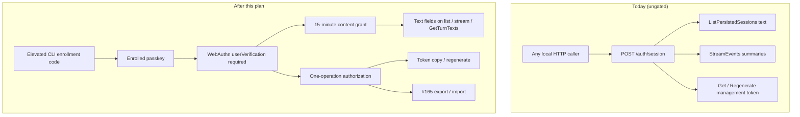
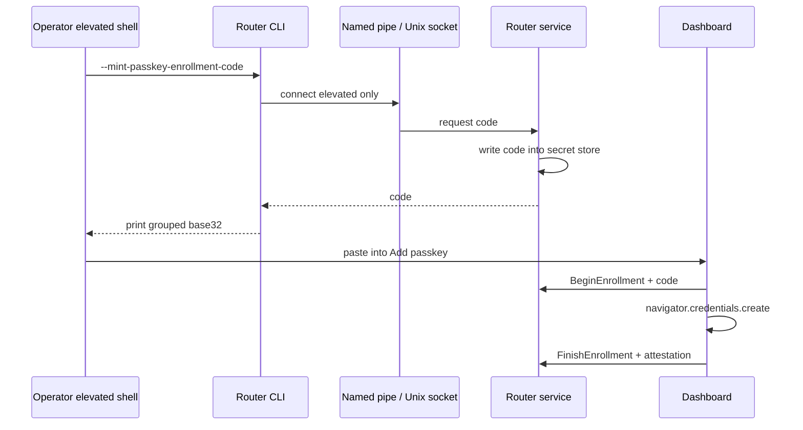
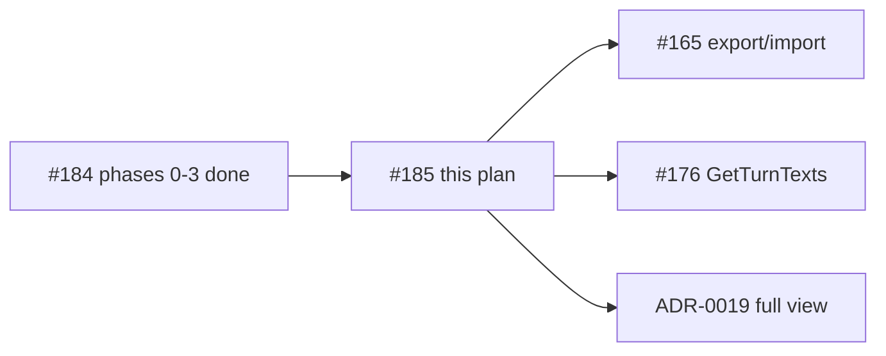

# Plan: Require passkey verification before conversation content leaves the router (#185)

**Status:** Approved by David on 2026-10-07 ([sign-off on #185](https://github.com/davidpizon/TotallyHot-ArcRouter/issues/185#issuecomment-6045535337)). §7 decisions accepted as recommended.
**Issue:** [#185](https://github.com/davidpizon/TotallyHot-ArcRouter/issues/185) — "Require passkey verification before conversation content leaves the router".
**ADR:** [ADR-0020](../adr/0020-require-passkey-verification-for-conversation-content.md) (proposed) is the source of truth for the security decision. This plan turns that ADR into phased work and settles the items ADR-0020 left to the plan.
**Related:**
- [#184](https://github.com/davidpizon/TotallyHot-ArcRouter/issues/184) / [plan](issue-184-transcript-data-protection.md) / [ADR-0024](../adr/0024-protect-the-machine-shared-data-directory-and-make-deletion-final.md) — data-directory protection (prerequisite; **closed**, phases 0–3 shipped).
- [ADR-0012](../adr/0012-loopback-session-auth-and-token-in-secret-store.md) — loopback sessions that today admit any local HTTP caller.
- [ADR-0015](../adr/0015-machine-scoped-protection-for-the-shared-secret-store.md) — secret store ACL.
- [#165 plan](issue-165-export-import-history.md), [#176 plan](issue-176-sessions-three-pane.md), [#179 plan](issue-179-persisted-sessions-list-size.md), [ADR-0019](../adr/0019-store-conversation-text-in-encrypted-per-session-files.md).

**ADR-0008 Amendment 1:** This is a security boundary change with observed evidence (any loopback session can read conversation text and lift the management token). It is not a smell refactor. It does not change `ManagementFacade`'s public method set. Hot-path files (`ProxyMiddleware`, `RequestInterceptor`) are touched only where #184 already marked conversation-body log lines; the gate does not alter routing.

**Serena skipped.** Dual-engine survey for this plan used CodeGraph MCP (`user-codegraph` / `codegraph_explore`) only. Serena MCP (`plugin-serena-serena`) failed live tool discovery and `mcp_auth` timed out twice in the planning session; classification below is therefore agent-only on CodeGraph evidence.

## Summary

Under ADR-0012, `POST /auth/session` gives a management session to any process that can make a loopback HTTP call. That session can today:

- read stored previews through `ListPersistedSessions` (`prompt_text` / `response_text`);
- read live text through `StreamEvents` (`request_summary` / `response_summary`);
- fetch the management token through `GetManagementToken` and `RegenerateManagementToken`.

David's requirement (2026-09-30): conversation content must not be open to any application that can make an HTTP call. ADR-0020 chooses WebAuthn passkeys with user verification required. This plan implements that gate.



## 1. Verified findings (CodeGraph, 2026-10-07)

| # | Finding | Evidence |
|---|---|---|
| F1 | `ManagementTokenAdminGrpcService` returns `_tokenProvider.CurrentToken` / `Regenerate()` with no credential beyond the ADR-0012 session. | `ManagementTokenAdminGrpcService.cs:26-39` |
| F2 | `ListPersistedSessions` maps full stored text into wire previews via `TextTruncator` with no grant check. | `TelemetryGrpcService.ToContract` (`:186-224`) |
| F3 | `StreamEvents` forwards every `TelemetryEvent` unchanged; no per-event redaction. | `TelemetryGrpcService.StreamEvents` (`:97-117`) |
| F4 | `ManagementAuthEndpoints` issues a session cookie to any loopback caller with no credential. | `ManagementAuthEndpoints.HandleSessionAsync` |
| F5 | Session tickets carry only token generation; every ticket in a generation is identical. | `ManagementSessionTicketService.IssueTicket` |
| F6 | `#184` phase 1 landed: `SecureFile.WriteMachineShared` grants only `LocalSystem` and `Administrators`, with `Administrators` as owner — no writing-account ACE. | `SecureFile.RestrictToMachineAccountsWindows` (`:133-166`); test `WriteMachineShared_GrantsOnlyLocalSystemAndAdministrators_NotTheWriter` |
| F7 | `#184` phase 3 marked conversation-body log lines with Serilog property `ConversationBody`. `TelemetryLogEventSink` **drops** those events entirely today; ADR-0020 needs them re-admitted only when a content grant is present (as `content_bearing` on the wire). | `ConversationBodyLogging.PropertyName`; `TelemetryLogEventSink` drop; #184 plan §10 |
| F8 | Clear stays ungated by design: `ClearTranscripts` deletes without a content check. | `RouterSettingsAdminGrpcService.ClearTranscripts` |
| F9 | GUI token row copies/regenerates through `ManagementTokenAdminStore` with only a confirm dialog for regenerate — no passkey. | `SettingsModal.razor`, `ManagementTokenAdminStore` |
| F10 | GUI clients share `IRouterChannelProvider.CallInvoker`; no `x-content-grant` header path exists yet. | `GrpcAdminClientBase`, `PersistedSessionsClient`, `LiveDataStore` |
| F11 | No named-pipe or Unix-socket enrollment channel exists in production code. | CodeGraph: no `NamedPipe` / `UnixDomainSocket` symbols under `src/` |
| F12 | Prerequisite satisfied: #184 is closed (completed); PR #194 shipped phases 0–1; later phases are on `main` (F6, F7). | GitHub issue #184 `state_reason: completed` |

**Smell classification (agent, Serena skipped).** The ungated surfaces are a **security boundary gap**, not a classic code smell. Observed cost: any local process can disclose conversation text and the management token (David's requirement). Blast radius for the gate: `TelemetryGrpcService`, `ManagementTokenAdminGrpcService`, `TelemetryAuthInterceptor` / channel metadata, `TelemetryLogEventSink`, GUI stores/clients, new passkey services — **not** `ManagementFacade` collaborators as independently injectable services.

## 2. What ADR-0020 already decided

Do not re-litigate these. They are fixed in ADR-0020:

- WebAuthn with `userVerification: "required"`; synced passkeys allowed; no attestation required.
- Relying-party ID `localhost`; only origin `https://localhost:<web port>`.
- Enrollment via elevated CLI → single-use code → GUI "Add passkey"; remove via same channel.
- Closed until enrolled.
- One operation per verification for export, import, `GetManagementToken`, `RegenerateManagementToken`.
- Content grant for reads (15 minutes default); Lock / restart / failed content RPC clears GUI state.
- Grant and one-operation authorizations are bearer tokens: opaque, hashed at rest in memory, header-carried (`x-content-grant`), never cookies.
- Clear, delete session/import, lowering Sample Size: **not gated**.
- Challenge store: global, bounded (32), 2-minute TTL, token-bucket issuance; DoS by flood accepted.
- Import binds to staged archive SHA-256 (when #165 lands).
- Libraries: `Fido2` (router), `DSInternals.Win32.WebAuthn` (Windows tray/CLI only).
- macOS/Linux CLI and Windows 10 1809 CLI: refuse ceremony, send operator to dashboard.
- Ship before #165 export/import, #176 `GetTurnTexts`, ADR-0019 full view.

## 3. Design (implementation shape)

### 3.1 New packages and types (router)

Prefer a focused folder under `src/TotallyHotArcRouter/Proxy/Auth/Passkey/` (or `ContentGate/`) rather than growing `ManagementFacade`:

| Type | Role |
|---|---|
| `PasskeyCredentialStore` | Read/write enrolled credentials in `ProtectedSecretStore` (JSON map under a namespaced key, e.g. `passkey.credentials.v1`). |
| `EnrollmentCodeService` | Mint / validate / invalidate single-use codes (128-bit CSPRNG, grouped base32, 10-minute TTL, 5 wrong attempts). |
| `ElevatedEnrollmentChannel` | Windows named pipe (ACL: SYSTEM + Administrators) and Unix socket in the protected state directory (peer must be root or service account). Pipe-squatting check: CLI verifies server process is the service. |
| `WebAuthnCeremonyService` | Wraps `Fido2`: create options, verify registration, get options, verify assertion. Consumes challenges atomically (remove first). |
| `ChallengeStore` | Global bounded pending challenges + token bucket. |
| `ContentGrantTable` / `OneOperationAuthorizationTable` | In-memory tables keyed by SHA-256 of the presented token; grant TTL 15 minutes; one-op TTL 2 minutes; compare-and-remove before use. |
| `ContentGate` | Shared checks: store ACL OK, at least one passkey, grant/authorization valid for this RPC. |
| `PasskeyAdminGrpcService` | New gRPC service: list credentials, begin/finish enrollment, begin/finish verification, revoke grant ("Lock"), recent approvals. |
| `SecretStoreAclProbe` | Startup check from ADR-0020: Windows — no individual-account ACE on `secrets.dat`; Unix — owner is service account, mode `0600`. Fail closed for enrollment and gated ops when probe fails. |

`ManagementTokenAdminGrpcService` and `TelemetryGrpcService` call `ContentGate`; they do not implement WebAuthn themselves.

### 3.2 Wire protocol

Additive proto changes in `telemetry.proto` (or a sibling `passkey.proto` mapped on the same loopback TLS endpoint):

- **New RPCs** on a `PasskeyAdminService` (names illustrative):
  - `GetPasskeyGateStatus` — enrolled?, store ACL OK?, grant active?, grant expires at.
  - `ListPasskeys` — id, name, created, BE/BS sync flags.
  - `BeginEnrollment` / `FinishEnrollment` — registration ceremony; begin requires enrollment code.
  - `BeginContentUnlock` / `FinishContentUnlock` — assertion → content grant (+ expiry).
  - `BeginOneOperation` / `FinishOneOperation` — assertion bound to operation enum + parameters → one-op authorization token.
  - `LockContent` — revoke current grant.
  - `ListRecentApprovals` — audit list for the GUI.
- **Header** `x-content-grant` on content-bearing RPCs (gRPC metadata). One-operation RPCs take the authorization token in the request message (or a dedicated header `x-content-authorization`) so binding can be checked against the request body.
- **`LogLineEvent`**: add optional `bool content_bearing = N`. `TelemetryLogEventSink` stops dropping `ConversationBody` events; instead it publishes them with `content_bearing=true`. `StreamEvents` omits those events (and clears `request_summary` / `response_summary`) when the stream's call lacks a valid grant. Check **per event**, so expiry mid-stream stops text from then on.
- **`ListPersistedSessions`**: without a grant, omit `prompt_text` / `response_text` (and truncation flags that imply text was sent); keep metadata, lengths, ids. With a grant, today's preview behavior.

Do not change ADR-0012 session issuance.

### 3.3 Enrollment channel



- **Windows pipe name:** `\\.\pipe\TotallyHotArcRouter-Enrollment` (first instance created by the service at start).
- **Unix socket path:** `<machine-shared>/enrollment.sock` mode `0600`, owned by the service account; accept only peer uid 0 or the service uid.
- **CLI flag:** `--mint-passkey-enrollment-code` (and `--revoke-passkey <id>` over the same channel). Refuse when not elevated / not root.
- **Why not gRPC for minting:** every loopback app can reach gRPC; the elevated channel is the privilege proof.

### 3.4 Credential storage format

JSON array in `ProtectedSecretStore` under `passkey.credentials.v1`:

```json
[
  {
    "id": "<base64url credential id>",
    "publicKey": "<base64url COSE key>",
    "signCount": 0,
    "name": "Windows Hello",
    "createdAtUtc": "2026-10-07T00:00:00Z",
    "backupEligible": true,
    "backupState": false
  }
]
```

`BS` updates on every successful assertion. Enrollment code lives under `passkey.enrollment-code.v1` with `{ "codeHash", "expiresAtUtc", "failures" }` — store only a hash of the code (SHA-256), never the plaintext, so a leaked store dump does not mint a registration. (The code is shown once by the CLI; the service keeps the hash.)

### 3.5 Challenge and rate limits (defaults; see §7)

| Knob | Default | Configurable? |
|---|---|---|
| Challenge TTL | 2 minutes | No (decision 1) |
| Max pending challenges | 32 | No |
| Challenge issuance bucket | 10/min, burst 5 | Yes under `Passkey:ChallengeIssuancePerMinute` / `Burst` |
| One-op authorization TTL | 2 minutes | No |
| Content grant TTL | 15 minutes | Yes under `Passkey:ContentGrantMinutes` (min 1, max 60) |
| Enrollment code TTL | 10 minutes | No |
| Enrollment wrong attempts | 5 | No |

### 3.6 GUI

All new dialogs use `DialogShell` ([`DESIGN.md`](../gui/DESIGN.md) §4.1).

| Surface | Behavior |
|---|---|
| Sessions tab locked state | Metadata list visible; text panes show a single unlock CTA naming the enrollment command when none enrolled, else "Unlock with passkey". |
| Unlock flow | `BeginContentUnlock` → `navigator.credentials.get({ userVerification: "required" })` → `FinishContentUnlock` → hold grant in a scoped DI service (`ContentGrantStore`, memory only). |
| Lock control | Header control; calls `LockContent`, clears grant + every conversation text field in `PersistedSessionStore` / `LiveDataStore` / message panes, re-renders metadata only. |
| Grant expiry | Timer from response expiry; on fire, same clear path as Lock. On content RPC `Unauthenticated`/`FailedPrecondition` for grant, same clear path. On stream reconnect after router restart, clear. |
| Add / remove passkey | System Settings section; Add uses enrollment code + WebAuthn create; Remove asks for elevated revoke code path or a one-op "revoke passkey" verification (prefer elevated channel for remove, matching ADR-0020). |
| Sync badges | List shows "can sync" (BE) and "synced" / "not synced" (BS). |
| Token copy / regenerate | Replace today's free copy and confirm-only regenerate with one-op passkey ceremonies bound to `get_management_token` / `regenerate_management_token`. |
| Recent approvals | Small list in Settings (operation, credential name, time, outcome). |
| IP literal | Redirect `https://127.0.0.1:<web>` → `https://localhost:<web>` before any ceremony (ADR-0020). |

`IRouterChannelProvider` (or a thin `ContentGrantCallInvoker` decorator) attaches `x-content-grant` when a grant is held. Clients must not put the grant in `localStorage` / cookies / `sessionStorage`.

### 3.7 Tray / CLI (Windows)

- Gate `GetManagementToken`-equivalent CLI (`--print-management-token`) behind a `webauthn.dll` ceremony when the API exists; otherwise print the "use the dashboard" message.
- 1809 / missing API: refuse with dashboard redirect message.
- macOS / Linux CLI: same refuse path for gated ops; enrollment minting still works over the Unix socket when root.

### 3.8 Startup fail-closed

On service start, after the data-directory probe:

1. Run `SecretStoreAclProbe` on `secrets.dat`.
2. If it fails: log the fix (static Serilog template), set gate status `StoreUnprotected`, refuse enrollment and all gated ops (`FailedPrecondition`).
3. If it passes but zero passkeys: gate status `ClosedUntilEnrolled` — metadata RPCs work; text omitted; one-op and unlock return `FailedPrecondition` naming `--mint-passkey-enrollment-code`.

### 3.9 Audit logging

Static Serilog templates only, for example:

- `"Passkey challenge issued for {Operation}"`
- `"Passkey verification {Outcome} for {Operation} with credential {CredentialName}"`
- `"Content grant {Action}"` (`issued` / `revoked` / `expired`)
- `"Gated operation {Operation} {Outcome}"`
- Coalesced: `"Passkey challenge issuance refused {Count} times in the last minute"` (one line per minute)

Never log conversation text, grant token values, authorization token values, or enrollment codes.

## 4. Phasing

| Phase | Deliverable | Exit criteria |
|---|---|---|
| **0** | Accept ADR-0020 (status → `accepted`); add forward link from ADR-0012; this plan approved. | David sign-off on this plan; ADR status flip in the same docs PR or the first impl PR. |
| **1** | Core gate services + store ACL probe + enrollment channel + credential store + WebAuthn register/assert (no GUI polish). Gated: token RPCs + metadata-only list/stream. | Unit tests for challenge consume-once, grant hash lookup, ACL probe, enrollment code; token RPCs refuse without ceremony; list/stream omit text without grant. |
| **2** | GUI: unlock/lock, Settings passkey section, token row ceremonies, `localhost` redirect, grant header wiring, clear-on-lock. | bUnit / component tests for locked UI and grant clear; manual smoke on Windows Hello. |
| **3** | `LogLineEvent.content_bearing` + `StreamEvents` per-event filtering; re-admit marked body lines only with grant. | Tests: marked line absent without grant, present with grant; Console tab still gets unmarked diagnostics when locked. |
| **4** | Windows tray/CLI WebAuthn for `--print-management-token`; 1809/macOS/Linux refuse messages. | Platform-conditional tests; manual smoke where `webauthn.dll` exists. |
| **5** | Hooks for #165 / #176: shared `ContentGate` helpers for one-op export/import and grant-gated `GetTurnTexts` (RPCs themselves still land in those issues' PRs). | Helper tests; #165/#176 plans amended to call the helpers — no export/import shipped here. |

Phases 1–2 are the minimum to close the disclosure hole on today's surface. Phase 3 closes the live log-excerpt hole. Phase 4 is Windows-native parity. Phase 5 unblocks dependents without implementing them.

## 5. Test strategy

All tests ≤ 5 s. WebAuthn crypto tests use `Fido2`'s test helpers / synthetic authenticators; no UI automation in CI.

- Challenge: issue, consume-once, replay fails, eviction at 33rd, bucket `ResourceExhausted`.
- Assertion: wrong origin, missing UV flag, bad signature, counter rollback (when counter ≠ 0), synced counter stuck at 0 still accepts with challenge consume.
- Enrollment: wrong code, fifth failure invalidates, expired code, unelevated pipe connect refused.
- Grant: valid header admits text; missing/expired/unknown omits text; Lock removes; restart empties table.
- One-op: bound parameters mismatch fails and consumes; concurrent double-use → one success.
- ACL probe: file with user ACE → fail closed; clean SYSTEM/Administrators → pass.
- `ListPersistedSessions` / `StreamEvents` contract tests for metadata-only vs full.
- GUI: grant not persisted; Lock clears component state; DialogShell-based dialogs.
- No regression: Clear and Sample Size still work without a grant.

## 6. Dependencies and ship order



- **NuGet:** `Fido2` on the router project; `DSInternals.Win32.WebAuthn` on Windows-only tray/CLI projects (`net10.0-windows`).
- Amend #165 and #176 plans in phase 5 (or earlier in review) so they do not ship text/export without calling `ContentGate`.
- After accept: ADR-0012 gets a short forward link to ADR-0020 for the content exception.

## 7. Decisions for David

Items ADR-0020 explicitly left to this plan, plus a few implementation choices that need a nod:

1. **Challenge issuance rate.** **Recommended:** 10/min with burst 5, configurable under `Passkey:*` as in §3.5. Fixed 2-minute challenge/authorization TTL and 32-entry store stay non-configurable.
2. **Content grant TTL configurability.** **Recommended:** configurable `Passkey:ContentGrantMinutes` default 15, clamped `[1, 60]`.
3. **Enrollment code storage.** **Recommended:** store SHA-256 of the code only (§3.4), not plaintext.
4. **Remove-passkey path.** **Recommended:** elevated channel only (same as add), not a dashboard one-op, so an unlocked session cannot delete the last passkey without elevation.
5. **Proto layout.** **Recommended:** new `PasskeyAdminService` in `telemetry.proto` (same port/auth interceptor) rather than a new `.proto` file — fewer hosting edits; field numbers additive.
6. **`--print-management-token`.** **Recommended:** require passkey on Windows when `webauthn.dll` exists; elsewhere print the dashboard message. Today this flag can print the token to any process that can use the service directory after #184's rules — closing it is in scope for phase 4.
7. **Phase 1 PR scope.** **Recommended:** phase 0 docs + phase 1 server gate in the first implementation PR; phase 2 GUI as a follow-up PR so review stays bounded. Disclosure on API closes after phase 1 even before GUI unlock UX lands (operators use a temporary minimal unlock page or grpcurl only if we ship phase 1 alone — **prefer phase 1+2 together** if that is acceptable).

## 8. Out of scope

- Implementing #165 export/import or #176 `GetTurnTexts` (hooks only).
- Remote (non-`localhost`) WebAuthn origins.
- Raising the Windows minimum from 1809 to 1903.
- Native WebAuthn on macOS/Linux CLI.
- Gating Clear / Sample Size / session delete.
- Changing ADR-0012 for metadata, routing, providers, or MCP (MCP still exposes no conversation content).

## 9. Validation gate (when implementing)

- `TreatWarningsAsErrors` clean build of CI test projects.
- Full unit suite; coverage ≥ 80%.
- Golden-path smoke unchanged for proxy routing (gate is admin/telemetry only).
- Manual: enroll with Windows Hello, unlock Sessions, Lock, confirm token copy prompts, confirm no text without unlock.

## 10. Approval

Approved by David on 2026-10-07 ([sign-off on #185](https://github.com/davidpizon/TotallyHot-ArcRouter/issues/185#issuecomment-6045535337)). §7 decisions accepted as recommended. The implementation PR must link this approved plan.

## 11. Implementation notes

- **Phase 4 CLI print:** `--print-management-token` refuses whenever the gate is active and sends the operator to the dashboard Copy MCP token flow. A native `webauthn.dll` ceremony for the CLI is deferred; ADR-0020 already routes 1809 / macOS / Linux CLI the same way.
- **Serena skipped** during planning (MCP unavailable); CodeGraph-only survey recorded in §1.
- **GUI:** grant is memory-only via `ContentGrantStore`; `ContentGrantClientInterceptor` attaches `x-content-grant`; token Copy/Regenerate run one-op ceremonies before the admin RPCs.
