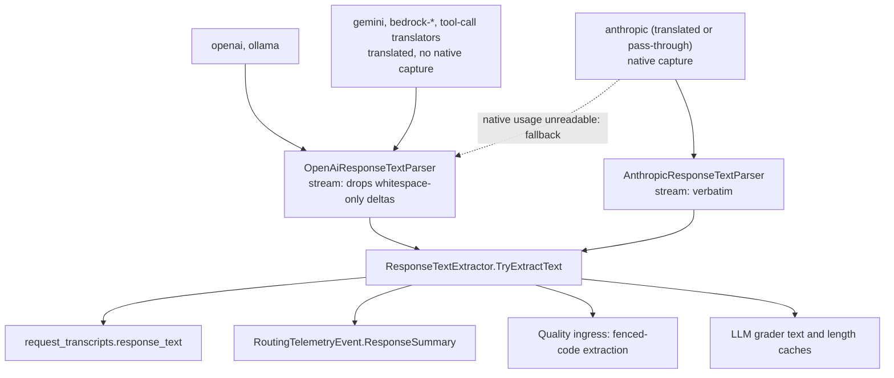

# Plan: Keep whitespace-only deltas in OpenAI-shaped streamed replies (#189)

**Status:** Approved by David on 2026-10-03, in the Claude Code session that drafted it ("approved, start implementing"), with D1–D3 as recorded at the end of this plan. Implemented in [#191](https://github.com/davidpizon/TotallyHot-ArcRouter/pull/191), which merged into the plan branch, so [#190](https://github.com/davidpizon/TotallyHot-ArcRouter/pull/190) carries both the plan and the implementation.
**Issue:** [#189](https://github.com/davidpizon/TotallyHot-ArcRouter/issues/189) — "OpenAI-shaped streamed replies lose whitespace-only deltas in transcripts and telemetry".
**Standing rule:** [Approved plan before coding](../router/standing-rules.md#approved-plan-before-coding). The implementation pull request must link this plan once approved.
**Related:** [ADR-0019](../adr/0019-store-conversation-text-in-encrypted-per-session-files.md) (accepted 2026-10-07) lists this bug under "Found during the investigation, tracked separately". This plan is that item. The fix does not depend on where text is stored: under ADR-0019 the per-session files hold the same per-turn reply extract, produced by the same parser. See also the [#165](issue-165-export-import-history.md) and [#179](issue-179-persisted-sessions-list-size.md) plans.
**ADR-0008 Amendment 1:** This is a defect fix with reproducing tests, not a smell refactor. The observed cost is lossy stored text. It does not touch `ProxyMiddleware`, `RequestInterceptor`, `ManagementFacade`, or `RequestTelemetryPublisher` (tests only).
**No ADR:** there is no proto, schema, config, or transport change. `ResponseSummary` and `response_text` stay strings; only their content becomes faithful.

## Goal

Keep every whitespace-only delta in OpenAI-shaped replies, within the existing bounds. Whitespace-only deltas are content: paragraph breaks, indentation, and the spaces between words. Prompt extraction does not change. The existing limits stay: `response_text` is still head-capped by the 4 MiB response capture, and `ResponseSummary` is still truncated to 2,000 characters by `TextTruncator` (`RoutingTelemetryEvent.cs:66-69`). This plan removes neither.

## What exists today (from CodeGraph, verified against `main` on 2026-10-03)



**Root cause.** `MessageContentTextExtractor.ExtractText` is a prompt-shaped contract:

- a blank string becomes `null`;
- in arrays, blank parts are dropped and the rest are joined with `' '`.

Its XML doc says "non-empty", but the code rejects whitespace-only strings (`MessageContentTextExtractor.cs:14-21,33`). The OpenAI streaming loop applies it to each delta (`OpenAiResponseTextParser.cs:59-60`), and each delta is a fragment of one string.

**Callers of `MessageContentTextExtractor.ExtractText`:** CodeGraph finds 12, which are 4 production and 8 tests.

| Caller | Side | Relies on blank → `null`? |
|---|---|---|
| `RequestTextExtractor.ExtractNewestUserMessage` (`RequestTextExtractor.cs:34`) | prompt | Yes, via its callers (below) |
| `OpenAiResponseTextParser.TryExtractFromStreamingBuffer` (`:59`) | response | **The bug.** Applied per delta |
| `OpenAiResponseTextParser.TryExtractFromNonStreamingBody` (`:35`) | response | Blank whole reply → `false`. Array parts are also filtered and space-joined |
| `AnthropicResponseTextParser.TryExtractFromNonStreamingBody` (`:30`) | response | Tool-only → `false`. Blocks are filtered and space-joined |
| `MessageContentTextExtractorTests` (8 tests) | tests | Pin the current contract |

**Callers of `ExtractNewestUserMessage`:**

- `RequestInterceptor.cs:424`. `taskText` gates `routingSignals` at `:444`, which does not re-check for whitespace. The embedding call re-checks at `:676-677`.
- `HeuristicRequestClassifier.cs:78`, which falls back to `""`.
- `RequestTelemetryPublisher.cs:603-604`, which sets `RequestSummary`. `GraderQuestionText.IsPresent` re-checks for whitespace.
- The transcript `prompt_text`, through `resolution.TaskText`.

**Not a caller.** `PayloadTranslationHelpers.ExtractText` is a separate internal method with the same name and is used for request translation. It already returns text verbatim. Unaffected.

**Non-streaming OpenAI path.**

- **String content:** OpenAI's shape, and what `AnthropicPayloadTranslator.cs:176` and `GeminiPayloadTranslator.cs:431` emit. It is returned whole, so interior whitespace is kept. **Not affected.**
- **Array content:** from some OpenAI-compatible servers. It loses blank parts and gains synthetic spaces. The same class of bug on a rare shape; fixed by the same change.

## Design decisions (recommendations; flag any you disagree with)

1. **Two contracts in one class.** Add `MessageContentTextExtractor.ExtractVerbatimText(JsonNode?)`:
   - a string is returned unchanged;
   - an array returns the concatenation of every `type: "text"` part in order, with no separator and no part dropped;
   - `null` is returned only when there is no text at all.

   It uses `TryGetValue` throughout, because telemetry must never throw. Reusing `PayloadTranslationHelpers.ExtractText` was rejected: its `GetValue<string>()` throws on a non-string `type`, and it returns `""` for an array with no text part. A separate method is preferred over a boolean flag, so each call site names its contract.
2. **The whitespace filter stays on prompt extraction only.** `ExtractText` keeps its name, behavior, and tests. Only its doc is corrected to say "blank" and to describe the space join. The reasons:
   - `RequestInterceptor.cs:444` treats a `null` task text as "no routing signals".
   - The space join stops adjacent text parts from fusing into one word in classifier and embedding input.
   - The byte-exact prompt belongs to #165's raw-body archive, not to this extract.

   Note: `prompt_text` is therefore not verbatim for multi-part messages. The #179 plan says it is (`issue-179-persisted-sessions-list-size.md:76`).
3. **Both OpenAI paths use `ExtractVerbatimText`.** In streaming, it is applied per delta. In non-streaming, it is applied to `message.content`.
4. **A blank whole reply is still "no text" (D1).** The check runs once, on the assembled text, in all four response paths, through one shared helper. This keeps today's non-streaming rule and `ResponseSummary`'s documented "no extractable text (e.g. a tool-only response)". It is also what stops a tool-call turn that streams only `"\n"` from becoming a blank transcript row. One edge case changes: a whitespace-only Anthropic stream is recorded verbatim today and becomes `false`.
5. **Anthropic non-streaming joins blocks verbatim (D2).** Today it joins with `' '` (`AnthropicResponseTextParserTests.cs:20`). The verbatim join matches the Anthropic stream parser and `AnthropicPayloadTranslator.cs:151`, so the same reply is stored identically whether it was streamed, translated, or not. With citations, which split one sentence across blocks, the space join also inserts spurious spaces.
6. **No history repair.** Only the extract is stored, not the stream, and no column records the parser shape or streaming. Pre-fix rows stay as they are. Do not bump the scorer version, because a rescan re-reads the same lossy text.

## Phase 1: failing tests, then the fix (one phase; ends green)

**Step 1: tests that fail today.** They use existing public APIs only, so the build stays warning-free. Build SSE from a delta list with `JsonObject.ToJsonString()` so that `\n` is escaped correctly.

- `OpenAiResponseTextParserTests.TryExtractFromStreamingBuffer_WhitespaceOnlyDeltas_RoundTripExactly` is a `[Theory]`:
  - `"Hello","\n\n","World","\n","    ","x = 1"` → `Hello\n\nWorld\n    x = 1`;
  - `"The"," ","answer"` → `The answer`;
  - `"```python","\n","def f():","\n","    ","return 1","\n","```"` → exact;
  - `"a","\t","b","\r\n","c"` → exact;
  - each sequence also has a role-only delta and `[DONE]`.
- `OpenAiResponseTextParserTests.TryExtractFromNonStreamingBody_ArrayContent_ConcatenatesPartsVerbatim`.
- `RequestTelemetryPublisherTests.PublishAsync_TranslatedStreamWithWhitespaceOnlyDeltas_PersistsExactResponseText`:
  - route `gemini`, shape `openai`, no native bytes;
  - assert `CapturingTranscriptStore.LastInserted.ResponseText` and the event's `ResponseSummary`;
  - copy the harness of `PublishAsync_WritesUntrainedBaselineModelToTheTranscriptStore`.
- With D1: `AnthropicResponseTextParserTests.TryExtractFromStreamingBuffer_OnlyWhitespaceDeltas_ReturnsFalse`.
- With D2: `AnthropicResponseTextParserTests.TryExtractFromNonStreamingBody_MultipleTextBlocks_ConcatenatesVerbatim` replaces `..._ConcatenatesWithSpace`.

Run the four affected test classes and paste the output into the PR. It must show every Step 1 test failing. Some of those tests have no "Whitespace" in their names, so a name filter would miss them; filtering by class does not.

```bash
dotnet test --project src/TotallyHotArcRouter.Tests/TotallyHotArcRouter.Tests.csproj --filter-class "*OpenAiResponseTextParserTests" --filter-class "*AnthropicResponseTextParserTests" --filter-class "*RequestTelemetryPublisherTests" --filter-class "*MessageContentTextExtractorTests"
```

**Step 2: guard tests that pass before and after.**

- OpenAI stream made only of whitespace → `false`.
- OpenAI non-streaming string with interior whitespace → unchanged.
- OpenAI non-streaming whitespace-only string → `false`.
- Anthropic stream that mixes text with whitespace-only deltas → exact. A stream made only of whitespace is D1's case and is covered by the Step 1 test.
- A publisher test for translated `anthropic` with native bytes. The text comes from the native capture, which pins the correction in the issue.
- All `RequestTextExtractorTests` and the existing `ExtractText` tests stay unchanged and green.

**Step 3: the fix.**

- Add `ExtractVerbatimText` plus its tests in `MessageContentTextExtractorTests`:
  - string, including blank;
  - array with blank parts;
  - non-text parts skipped;
  - no text part → `null`;
  - `null` → `null`;
  - non-string scalar → `null`.
- Switch the three response call sites to `ExtractVerbatimText` (D2 decides the Anthropic one), and add the blank-reply check (D1).
- Correct the XML docs on `MessageContentTextExtractor`, both parsers, and `IResponseTextExtractor.TryExtractText`.

**Exit criterion:** `dotnet build src/TotallyHotArcRouter.slnx` is warning-free, and the full suite and `--coverage --coverage-settings coverage.runsettings` are green with at least 80% coverage. Every test stays well under the 5 s ceiling.

## Phase 2: docs and proof

- `docs/router/telemetry.md:227-230` currently says `MessageContentTextExtractor` is "shared" with one behavior. Replace that with the two contracts. Add "or whitespace-only" to the `ResponseSummary` row (`:48`).
- PR body: the red output from Step 1, the green run, and a link to this plan.

## Risks

- **More text per row.** Rows become slightly longer. That is correct, and the text is still head-capped by the 4 MiB capture.
- **Verbosity-skew baselines shift up for OpenAI-shaped providers.** The shift is correct: they were undercounted before.
- **Quality scores may change for OpenAI-shaped providers.** Code blocks that used to be dropped or mis-indented now parse, so live-learning memory moves toward their true scores. Worth watching after merge; no action is planned.

## Decisions (David, 2026-10-03)

1. **D1: blank whole reply → "no text"** in all four response paths. Taken as recommended.
2. **D2: Anthropic non-streaming joins text blocks verbatim**, with no separator, matching the stream path and the translator. Taken as recommended. `TryExtractFromNonStreamingBody_MultipleTextBlocks_ConcatenatesWithSpace` is replaced as Step 1 describes.
3. **D3: wait for #176.** This plan makes no GUI change. The Sessions tab bubbles keep collapsing whitespace until #176 renders message bodies with `white-space: pre-wrap`.
