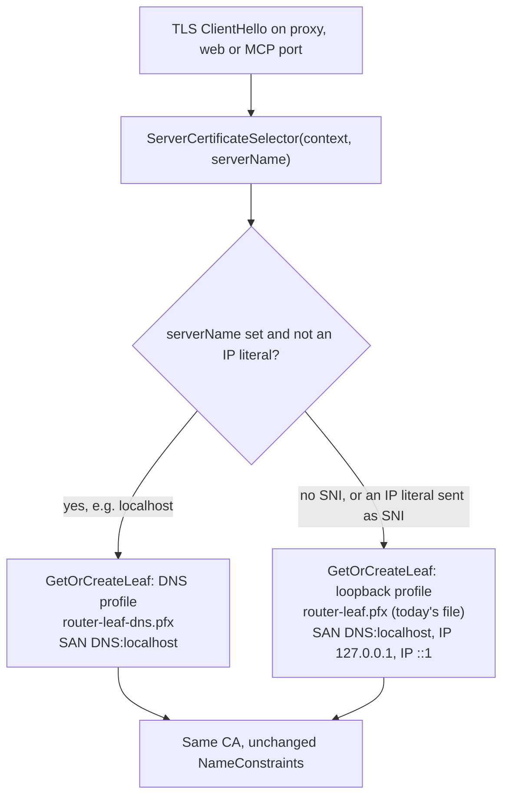

# Plan: Serve a certificate that Bun and BoringSSL clients accept on the HTTPS ports (#TBD)

**Status:** Approved and implemented. David replied "Fix it" to this plan on 2026-10-02, which takes the recommended option 1. Implemented on branch `fix/boringssl-https-leaf`; see §8 for where the implementation differs from the plan.
**Issue:** not filed yet. Rename this file to `issue-<N>-https-leaf-for-boringssl-clients.md` once it is.
**Found by:** the PR [#186](https://github.com/davidpizon/TotallyHot-ArcRouter/pull/186) smoke on 2026-10-02 (#163 Phase 2c). The #163 plan's "Transport" note says this failure is "tracked separately"; this plan is that item.
**Related:**
- [ADR-0013](../adr/0013-name-constrained-local-ca-for-router-tls.md), the name-constrained local CA. Its consequence "name constraints … are honored by every mainstream OS/browser trust-store implementation targeted here" does not hold for BoringSSL.
- [ADR-0020](../adr/0020-require-passkey-verification-for-conversation-content.md), which redirects `https://127.0.0.1:<web port>` to `https://localhost:<web port>`. That redirect needs the TLS handshake on the IP literal to succeed first.
- [Client TLS setup, Bun and BoringSSL clients](../router/client-tls-setup.md#bun-and-boringssl-clients) and the [Claude Code harness page](../install/harnesses/claude-code.md#unsupported_constraint_type-on-the-https-port), which document the fix and the workaround for older builds.

**ADR-0008 Amendment 1:** this is a defect fix with a reproduction, not a smell refactor. It does not touch `ProxyMiddleware`, `RequestInterceptor` or `ManagementFacade`. On `ProxyServer` and `McpServer` it changes only the certificate-selector lambdas.

## Summary

- **Symptom.** The native Claude Code build cannot reach any HTTPS port of the router. `claude -p` prints `API Error: Unable to connect to API (UNSUPPORTED_CONSTRAINT_TYPE)`, and the `--debug` log says only `Connection error.` The router logs nothing.
- **Root cause.** Bun verifies certificates with BoringSSL. BoringSSL's name-constraint matcher (`nc_match_single` in `crypto/x509/v3_ncons.cc`) has no case for IP addresses. Our CA permits `127.0.0.1/32` and `::1/128`, and our leaf carries both as IP-address SANs. BoringSSL meets an IP SAN under an IP constraint, returns `X509_V_ERR_UNSUPPORTED_CONSTRAINT_TYPE`, and fails the chain. This happens whichever host name the client dialled.
- **Not the cause.** HTTP/2 via ALPN, IPv6 resolution, and how the CA is supplied are all ruled out. Kestrel negotiated HTTP/1.1 over TLS 1.3 with Bun on `::1` and `127.0.0.1`. The `router-ca.crt` missing trailing newline is a separate, already-worked-around nuisance.
- **Proposed fix (option 1).** Choose the leaf by SNI. A handshake that names a host (`localhost`) gets a new leaf with `DNS:localhost` only. A handshake with no SNI, which is what an IP-literal URL produces, gets today's leaf with the IP addresses. The CA does not change, so nobody re-trusts anything.
- **Docs.** The client docs now tell Bun clients to dial `localhost`, never an IP literal. The loopback plain-HTTP listener (`Proxy:PlainHttp:Enabled=true`) stays documented as the workaround for router builds without this fix.

## 1. Reproduction

Run on 2026-10-02 without the router and without touching `%ProgramData%`. A standalone Kestrel server copied the router's listener settings (`ListenLocalhost`, `Http1AndHttp2`, `UseHttps` with a `ServerCertificateSelector`). It minted its certificates with a copy of `LocalCertificateAuthority`'s code, with switches for the variants. Claude Code ran with a scratch `CLAUDE_CONFIG_DIR`, every inherited `CLAUDE*`/`ANTHROPIC*`/`NODE_*` variable stripped, and `NODE_EXTRA_CA_CERTS` set to the variant's CA.

| CA constraint | Leaf SANs | Claude Code 2.1.246 and 2.1.286 (Bun) | Node 26, .NET 10, Schannel curl |
|---|---|---|---|
| `localhost`, `127.0.0.1/32`, `::1/128` (shipped) | `localhost`, `127.0.0.1`, `::1` (shipped) | `UNSUPPORTED_CONSTRAINT_TYPE` via `localhost` and via `127.0.0.1` | Works via `localhost` and `127.0.0.1` |
| shipped | `localhost` only | Works via `localhost`. Host-name mismatch via `127.0.0.1` | Works via `localhost`. Host-name mismatch via `127.0.0.1` |
| `localhost` only | shipped | Works via `localhost` and `127.0.0.1` | Works via `localhost` and `127.0.0.1` |
| none | shipped | Works | Works |

Two side facts from the same runs:

- Bun sends SNI `localhost` for `https://localhost:…` and no SNI for `https://127.0.0.1:…`. Kestrel's selector sees an empty string in the second case.
- Schannel curl fails `--cacert` against this CA with "revocation status unknown" unless given `--ssl-no-revoke`. That predates this plan and is outside its scope.

## 2. Options

| Option | Bun via `localhost` | Bun via IP literal | Other clients via IP literal | Re-trust needed | ADR-0013's blast radius |
|---|---|---|---|---|---|
| **1. SNI-selected leaf (recommended)** | Works | Fails, as today | Unchanged, works | No | Unchanged |
| 2. One `DNS:localhost`-only leaf for every handshake | Works | Fails (name mismatch) | **Breaks** | No | Unchanged |
| 3. Drop the IP subtrees from the CA's constraint | Works | Works | Works | **Yes, on every machine and client bundle** | **Wider**: the CA key could sign for any IP address |
| 4. Docs only: Bun clients stay on plain HTTP | n/a | n/a | Unchanged | No | Unchanged |

- **Option 2** is the smallest change: two lines removed, plus re-minting a persisted leaf that still carries IPs. But it breaks every `https://127.0.0.1:…` and `https://[::1]:…` URL for every client. That includes the dashboard URLs `WebInterfaceOptions.AllowedHosts` admits and ADR-0020's redirect.
- **Option 3** fixes every client on every loopback name. It costs a new CA, so every machine re-runs `--install-certificate` and every `NODE_EXTRA_CA_CERTS` bundle, NSS database and Python bundle is rebuilt. It also gives up ADR-0013's IP limit, its main security property. Rejected.
- **Option 4** leaves Claude Code, the main harness, on plaintext loopback for good.

## 3. Design (option 1)

1. **`LocalCertificateAuthority`.**
   - Add a public `GetOrCreateLeaf(string? serverName)`. It picks the DNS profile when `serverName` is non-empty and `IPAddress.TryParse` rejects it. Otherwise it picks the loopback profile. RFC 6066 forbids IP literals in SNI, but a non-conforming client that sends one still gets the leaf that names it.
   - Keep the parameterless `GetOrCreateLeaf()` as the loopback profile, so existing callers and tests do not change.
   - Factor issuance into one private method that takes a profile: file name, password-secret name, and whether to add the IP SANs. Both profiles share `RenewalLock`, `LeafValidity`, `LeafRenewalWindow` and `PersistAndReload`, so renewal and the concurrency guarantee stay identical.
   - New persisted names: `router-leaf-dns.pfx` and secret `router-leaf-dns:cert-password`. `router-leaf.pfx` keeps its name and contents.
2. **Selectors.** In `ProxyServer` (proxy port and web port) and `McpServer`, change `(_, _) => LocalCertificateAuthority.GetOrCreateLeaf()` to `(_, serverName) => LocalCertificateAuthority.GetOrCreateLeaf(serverName)`.
3. **Startup fail-fast.** Both hosts already call `GetOrCreateLeaf()` once before binding, to fail loudly if issuance is broken. Replace that call with a new `LocalCertificateAuthority.EnsureLeaves()`, which loads or issues every profile's leaf and disposes it.
4. **Upgrade.** The first start of the new build mints `router-leaf-dns.pfx` and adds one secret to `secrets.dat`. Nothing else in the machine-shared directory changes, and no client re-trusts.
5. **ADR.** Add **ADR-0013 Amendment 1** in the implementation PR. It records that BoringSSL does not implement IP-address name constraints, which makes the "Neutral" consequence false for Bun clients. It also records the SNI split, and why options 2 and 3 were not taken.

Expected size: about 60 production lines added and 10 removed, mostly the profile parameter, plus about 150 test lines.

## 4. Tests

All in `TotallyHotArcRouter.Tests`, using the existing temp-path and `ProtectedSecretStore` overloads, so no test touches `%ProgramData%`. Each runs well under the 5-second cap.

1. `GetOrCreateLeaf_WithServerName_IssuesADnsOnlyLeaf`: the SAN extension holds exactly `DNS:localhost` and no IP address. The leaf is signed by the CA and builds a chain under `CustomRootTrust`.
2. `GetOrCreateLeaf_WithoutServerName_KeepsTheLoopbackAddresses`: `null` and `""` both return the leaf with `localhost`, `127.0.0.1` and `::1`. This pins today's behaviour for IP-literal clients.
3. `GetOrCreateLeaf_WithIpLiteralServerName_ReturnsTheLoopbackLeaf`: `"127.0.0.1"` and `"::1"`.
4. `GetOrCreateLeaf_Profiles_PersistAndRenewIndependently`: each profile returns the same thumbprint on a second call. Forcing one profile into its renewal window re-mints only that file.
5. `ServerCertificateSelector_ChoosesTheLeafBySni`: Kestrel on port 0 with the real selector. `SslStream` with `TargetHost = "localhost"` sees no IP SAN. With `TargetHost = "127.0.0.1"`, which sends no SNI, it sees both IPs, and both handshakes validate under `CustomRootTrust`.
6. **BoringSSL invariant**, as a named test: whenever the CA carries an iPAddress subtree, no leaf served on an SNI handshake carries an iPAddress SAN. This is the rule BoringSSL needs, written so a later edit that re-adds IPs to the DNS profile fails with an explanation.

There is no BoringSSL in the .NET test run. The manual smoke below covers the real client.

## 5. Validation

- `dotnet build` with `TreatWarningsAsErrors` clean. Full test run green, and coverage stays at or above 80%.
- **Real-client smoke** (branch build, isolated per the usual env overrides):
  - Claude Code 2.1.286 (native) with `ANTHROPIC_BASE_URL=https://localhost:<proxy port>` and the CA in `NODE_EXTRA_CA_CERTS`. Pass means the TLS handshake completes and the router logs the request. With David's routing gate off, the router's 503 "Routing is currently disabled" is enough proof, so the gate does not need flipping.
  - Node, .NET and Schannel curl (`--ssl-no-revoke`) via `https://localhost` and `https://127.0.0.1`, on the proxy and web ports.
  - A Chromium browser and Firefox on `https://localhost:<web port>` and `https://127.0.0.1:<web port>`, which also checks ADR-0020's redirect.

## 6. Decisions for David

1. **Option.** Answered: option 1 ("Fix it", 2026-10-02).
2. **Issue.** Open. May I file the GitHub issue, so this plan gets its number and the #163 plan's "tracked separately" note can link it? This file and ADR-0013 Amendment 1 link `issue-TBD-…` until then.
3. **Writes to real data.** Overtaken; see §8.3. A local test run of this branch has already written `router-leaf-dns.pfx` and one `secrets.dat` entry into `%ProgramData%\TotallyHotArcRouter`. Open: keep that state, which is what the fixed router creates on its first start anyway, or have it reverted?
4. **Docs.** Answered by implementing: the docs land with the fix, on this branch, and describe the fixed behaviour. The plain-HTTP workaround stays documented for router builds without the fix.

## 7. Docs shipped with the fix

- `client-tls-setup.md`: a "Bun and BoringSSL clients" section. It covers the cause, the per-SNI table, "Bun clients must dial `localhost`", the plain-HTTP workaround for older builds, and the `CERT_SIGNATURE_FAILURE` case from §8.4.
- `claude-code.md`: keep `localhost` in the base URL, and an `UNSUPPORTED_CONSTRAINT_TYPE` troubleshooting section with the same older-build workaround.
- ADR-0013 Amendment 1.

## 8. Implementation notes (2026-10-02)

### 8.1 Where the code differs from §3 and §4

- **Overloads.** `GetOrCreateLeaf(string? serverName)` is the selector entry point. The parameterless `GetOrCreateLeaf()` was removed once both hosts called `EnsureLeaves()` and the SNI overload instead, because nothing called it any more (Qodana flagged it on the PR). Tests use `GetOrCreateLeaf(LeafProfile, directory, store)`, and the path-based overload takes an optional `LeafProfile` (default `Loopback`), so the existing tests did not change. `LeafProfile` is an internal enum nested in `LocalCertificateAuthority`.
- **Test 5** is a real TLS handshake over loopback with `SslStream` on both ends, not Kestrel with the production selector. The production selector resolves the real machine-shared directory, which a test must not use. The test drives the same `SelectLeafProfile` plus directory overload that the public `GetOrCreateLeaf(serverName)` composes, and the client's SNI is whatever .NET actually sends.
- **Test 6** is folded into test 1 (`GetOrCreateLeaf_DnsOnlyProfile_CarriesNoIpAddress`). The "CA carries IP subtrees" condition is constant in this code, so the conditional form only added parsing. The test's failure message explains the BoringSSL rule instead.
- **Tests as shipped:** `GetOrCreateLeaf_DnsOnlyProfile_CarriesNoIpAddress`, `GetOrCreateLeaf_LoopbackProfile_KeepsBothLoopbackAddresses`, `SelectLeafProfile_PicksDnsOnlyExactlyWhenTheClientNamedAHost` (null, empty, `127.0.0.1`, `::1`, `localhost`, `LOCALHOST`), `GetOrCreateLeaf_Profiles_PersistSeparatelyAndRenewIndependently` and `Handshake_PicksTheLeafByTheClientsSni` (`localhost`, `127.0.0.1`). The slowest takes 0.8 s.

### 8.2 Validation run

- `dotnet build src/TotallyHotArcRouter.slnx`: clean, no warnings.
- Final local run, 2026-10-03, after the §8.4 AKI change: every test project in `src/TotallyHotArcRouter.slnx`, 4,123 passed, 0 failed. Five classes were excluded because they start real listeners against the machine-shared directory: `ProxyServerTests`, `ProxyServerAuthTests`, `ProxyServerWebInterfaceTests`, `ProxyHostedServiceTests` and `McpHostedServiceTests` (see §8.3 for why the last one joined the list). Those five classes and coverage have not been run locally; CI runs them.
- An earlier run on 2026-10-02, before the AKI change, covered `TotallyHotArcRouter.Tests` only: 3,004 passed with the first four classes excluded. `McpHostedServiceTests` was not excluded then, which is the write §8.3 describes.
- **Real clients against the branch's own code.** A scratch Kestrel host referenced this branch's router assembly and served `LocalCertificateAuthority`'s leaves through the same selector shape as `ProxyServer`. It used a scratch data directory and secret store, `ListenLocalhost` and `Http1AndHttp2`.

  | Client | `https://localhost:…` | `https://127.0.0.1:…` |
  |---|---|---|
  | Claude Code 2.1.286 and 2.1.246 (Bun) | Works: `HEAD /api/hello` and the streamed `POST /v1/messages` both reached the host | `UNSUPPORTED_CONSTRAINT_TYPE`, as designed |
  | Node 26, .NET 10, Schannel curl | Works | Works |

  The Claude Code runs used `CLAUDE_CODE_CERT_STORE=bundled`; §8.4 explains why.
- **Not yet run:** the router-itself smoke from §5 (proxy, web and MCP ports, browsers, ADR-0020's redirect).

### 8.3 Unplanned write to `%ProgramData%`

The local test run in §8.2 excluded the four `ProxyServer`/`ProxyHostedService` classes to keep `%ProgramData%\TotallyHotArcRouter` untouched. `McpHostedServiceTests.StartAsync_WhenThePortIsAlreadyInUse_LogsOneWarningWithoutTheStack` also starts a real `McpServer`, and `McpServer` now calls `EnsureLeaves()` against the real machine-shared directory. A before/after snapshot shows exactly two changes, both at 2026-10-02 23:56:52 local time:

- `router-leaf-dns.pfx` was created (2,590 bytes).
- `secrets.dat` grew from 470 to 534 bytes: one new entry, `router-leaf-dns:cert-password`. The store loads the whole map and writes it back with the new entry; the existing entries have not been decrypted to confirm.

Nothing else in the directory changed. The installed router ignores both, and the fixed router would create the same pair on its first start. The underlying test-isolation gap predates this branch: on `main` the same tests already load the CA and leaf from the real directory, but they only read. Making them write is new.

### 8.4 Found during validation: no Authority Key Identifier on the leaves

David's real router CA is trusted in `LocalMachine\Root` and `CurrentUser\Root`. The scratch CA in §8.2 has the same subject, `CN=TotallyHot Arc Router Local CA`. With Claude Code's default trust (bundled plus system store), both Claude Code builds failed on `localhost` with `CERT_SIGNATURE_FAILURE`. Restricting Claude Code to `CLAUDE_CODE_CERT_STORE=bundled` fixed it.

The router's leaves carry no Authority Key Identifier, so BoringSSL picks the issuer by subject name alone and verified against the wrong key. Real machines can hit this too, for example when an old router CA stays in the OS store after a reinstall that minted a new one. `client-tls-setup.md` documents the symptom.

**Deviation, added 2026-10-03:** this branch now fixes it rather than leaving it for a separate change. Both leaf profiles carry an AKI (key identifier only, from the CA's SKI) and their own SKI. A saved leaf is reused only when its AKI names the current CA's key. So a leaf saved without an AKI is re-issued once on first use, under the same CA, with no re-trust. A leaf left over from an earlier CA is re-issued too; before, it was served until its own renewal window. Renewal timing and `RenewalLock` are unchanged. Tests are in `LocalCertificateAuthorityTests`. The fix is not yet checked against a live Bun client with two same-named CAs trusted.
