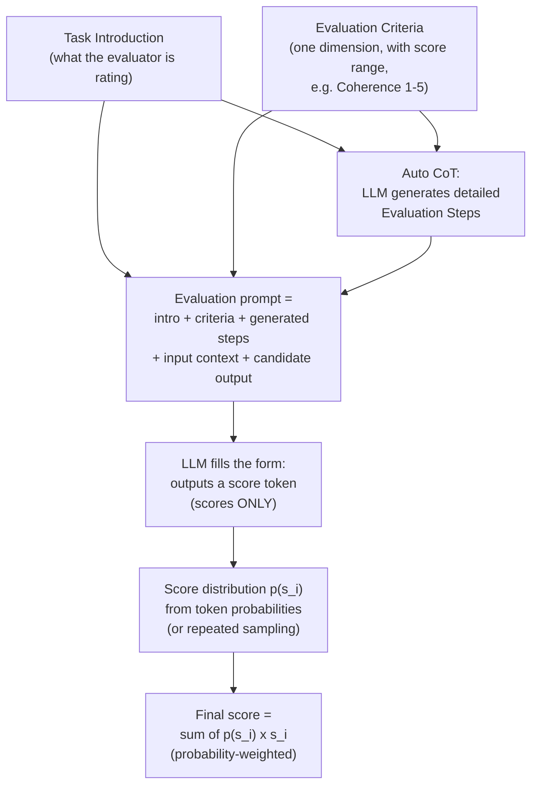

# G-Eval: NLG Evaluation Using GPT-4 with Better Human Alignment

> **Source:** Liu, Iter, Xu, Wang, Xu, Zhu (Microsoft Cognitive Services Research), arXiv:2303.16634v3 (May 2023). Original PDF: [2303.16634v3.pdf](2303.16634v3.pdf). Code: <https://github.com/nlpyang/geval>
>
> **Purpose of this file:** agent-optimized digest. Everything needed to *implement or apply* the G-Eval technique is here; citation-level prose and the references list are omitted — consult the PDF for those.

## TL;DR

G-Eval is a **reference-free, prompt-based LLM evaluator** for natural language generation quality. It combines three ideas:

1. A prompt containing the **task introduction** and **evaluation criteria** for one quality dimension.
2. **Auto chain-of-thought (CoT):** the LLM itself generates the detailed evaluation steps from the criteria — no hand-written rubric steps needed.
3. A **probability-weighted score:** instead of taking the single integer the model outputs, take the expected value over the output-token probabilities of each allowed score.

With GPT-4 as backbone it reached **0.514 Spearman correlation with humans on summarization (SummEval)**, beating all prior evaluators (best previous: UniEval at 0.474). Key caveat: **G-Eval prefers LLM-generated text over human-written text** even when human judges prefer the human text — a self-reinforcement risk if used as a reward signal.

## Method

### Pipeline



### 1. Prompt

Natural-language definition of the evaluation task plus the criteria for **one dimension at a time** (coherence, consistency, fluency, relevance, engagingness, ...). Example task introduction for summarization:

> You will be given one summary written for a news article. Your task is to rate the summary on one metric.
> Please make sure you read and understand these instructions carefully. Please keep this document open while reviewing, and refer to it as needed.

Example criteria block (coherence, aligned with the DUC quality question):

> Coherence (1-5) - the collective quality of all sentences. We align this dimension with the DUC quality question of structure and coherence whereby "the summary should be well-structured and well-organized. The summary should not just be a heap of related information, but should build from sentence to sentence to a coherent body of information about a topic."

### 2. Auto chain-of-thought

Append `Evaluation Steps:` to the prompt and let the LLM generate the step list **once per task/dimension**; reuse the generated steps in every evaluation call. Example auto-generated steps for coherence:

1. Read the news article carefully and identify the main topic and key points.
2. Read the summary and compare it to the news article. Check if the summary covers the main topic and key points of the news article, and if it presents them in a clear and logical order.
3. Assign a score for coherence on a scale of 1 to 5, where 1 is the lowest and 5 is the highest based on the Evaluation Criteria.

### 3. Scoring function

The evaluator is called with prompt + CoT + input context + candidate text, ending in a **form-filling cue** (`Evaluation Form (scores ONLY): - Coherence:`). Direct integer scoring has two failure modes:

- **Score collapse:** one digit (e.g. 3 on a 1–5 scale) dominates, giving low variance and low correlation with humans.
- **Ties:** LLMs output integers even when asked for decimals, so many candidates tie and subtle quality differences are lost.

Fix: for the predefined score set `S = {s_1, ..., s_n}`, obtain each score's probability `p(s_i)` from the model and report the expectation:

```
score = Σ_{i=1..n} p(s_i) × s_i
```

**Implementation details from the paper:**

- GPT-3.5 (`text-davinci-003`): temperature 0; token logprobs available directly.
- GPT-4: token probabilities were not exposed, so they **sampled 20 times** with `n = 20, temperature = 1, top_p = 1` and used the empirical score frequencies as `p(s_i)`.
- `G-EVAL-4` = GPT-4 backbone; `G-EVAL-3.5` = GPT-3.5 backbone.

## Benchmarks used (meta-evaluation)

| Benchmark | Task | Human-rated dimensions | Correlation reported |
|---|---|---|---|
| SummEval (CNN/DailyMail) | Summarization | coherence, consistency, fluency, relevance | summary-level Spearman ρ, Kendall-Tau τ |
| Topical-Chat | Knowledge-grounded dialogue response | naturalness, coherence, engagingness, groundedness | turn-level Pearson r, Spearman ρ |
| QAGS (CNN + XSum) | Summarization hallucination/consistency | factual consistency | Pearson r, Spearman ρ, Kendall-Tau τ |

## Results

### SummEval (summary-level ρ / τ)

| Metric | Coherence ρ/τ | Consistency ρ/τ | Fluency ρ/τ | Relevance ρ/τ | AVG ρ/τ |
|---|---|---|---|---|---|
| ROUGE-1 | 0.167/0.126 | 0.160/0.130 | 0.115/0.094 | 0.326/0.252 | 0.192/0.150 |
| ROUGE-2 | 0.184/0.139 | 0.187/0.155 | 0.159/0.128 | 0.290/0.219 | 0.205/0.161 |
| ROUGE-L | 0.128/0.099 | 0.115/0.092 | 0.105/0.084 | 0.311/0.237 | 0.165/0.128 |
| BERTScore | 0.284/0.211 | 0.110/0.090 | 0.193/0.158 | 0.312/0.243 | 0.225/0.175 |
| MoverScore | 0.159/0.118 | 0.157/0.127 | 0.129/0.105 | 0.318/0.244 | 0.191/0.148 |
| BARTScore | 0.448/0.342 | 0.382/0.315 | 0.356/0.292 | 0.356/0.273 | 0.385/0.305 |
| UniEval | 0.575/0.442 | 0.446/0.371 | 0.449/0.371 | 0.426/0.325 | 0.474/0.377 |
| GPTScore | 0.434/– | 0.449/– | 0.403/– | 0.381/– | 0.417/– |
| G-EVAL-3.5 | 0.440/0.335 | 0.386/0.318 | 0.424/0.347 | 0.385/0.293 | 0.401/0.320 |
| G-EVAL-3.5 −Probs | 0.359/0.313 | 0.361/0.344 | 0.339/0.323 | 0.327/0.288 | 0.346/0.317 |
| **G-EVAL-4** | **0.582**/0.457 | **0.507**/0.425 | **0.455**/0.378 | **0.547**/0.433 | **0.514**/0.418 |
| G-EVAL-4 −Probs | 0.560/0.472 | 0.501/0.459 | 0.438/0.408 | 0.511/0.444 | 0.502/0.446 |
| G-EVAL-4 −CoT | 0.564/0.454 | 0.493/0.413 | 0.403/0.334 | 0.538/0.427 | 0.500/0.407 |

Caution from the paper: the `−Probs` rows' higher τ is an artifact — direct integer scoring produces many ties, which Kendall-Tau counts as neither concordant nor discordant, inflating τ without reflecting real evaluation ability. Spearman ρ (rank-based) is the fairer comparison, and there `+Probs` wins.

### Topical-Chat (turn-level Pearson r / Spearman ρ)

| Metric | Naturalness r/ρ | Coherence r/ρ | Engagingness r/ρ | Groundedness r/ρ | AVG r/ρ |
|---|---|---|---|---|---|
| ROUGE-L | 0.176/0.146 | 0.193/0.203 | 0.295/0.300 | 0.310/0.327 | 0.243/0.244 |
| BLEU-4 | 0.180/0.175 | 0.131/0.235 | 0.232/0.316 | 0.213/0.310 | 0.189/0.259 |
| METEOR | 0.212/0.191 | 0.250/0.302 | 0.367/0.439 | 0.333/0.391 | 0.290/0.331 |
| BERTScore | 0.226/0.209 | 0.214/0.233 | 0.317/0.335 | 0.291/0.317 | 0.262/0.273 |
| USR | 0.337/0.325 | 0.416/0.377 | 0.456/0.465 | 0.222/0.447 | 0.358/0.403 |
| UniEval | 0.455/0.330 | 0.602/0.455 | 0.573/0.430 | 0.577/0.453 | 0.552/0.417 |
| G-EVAL-3.5 | 0.532/0.539 | 0.519/0.544 | **0.660**/**0.691** | **0.586**/**0.567** | 0.574/0.585 |
| **G-EVAL-4** | **0.549**/**0.565** | **0.594**/**0.605** | 0.627/0.631 | 0.531/0.551 | **0.575**/**0.588** |

G-EVAL-3.5 ≈ G-EVAL-4 here; the authors read this as the benchmark being relatively easy for G-Eval.

### QAGS hallucination benchmark (Pearson r / Spearman ρ / Kendall-Tau τ)

| Metric | QAGS-CNN r/ρ/τ | QAGS-XSum r/ρ/τ | Average r/ρ/τ |
|---|---|---|---|
| ROUGE-2 | 0.459/0.418/0.333 | 0.097/0.083/0.068 | 0.278/0.250/0.200 |
| ROUGE-L | 0.357/0.324/0.254 | 0.024/−0.011/−0.009 | 0.190/0.156/0.122 |
| BERTScore | 0.576/0.505/0.399 | 0.024/0.008/0.006 | 0.300/0.256/0.202 |
| MoverScore | 0.414/0.347/0.271 | 0.054/0.044/0.036 | 0.234/0.195/0.153 |
| FactCC | 0.416/0.484/0.376 | 0.297/0.259/0.212 | 0.356/0.371/0.294 |
| QAGS | 0.545/–/– | 0.175/–/– | 0.375/–/– |
| BARTScore | 0.735/0.680/0.557 | 0.184/0.159/0.130 | 0.459/0.420/0.343 |
| CTC | 0.619/0.564/0.450 | 0.309/0.295/0.242 | 0.464/0.430/0.346 |
| UniEval | 0.682/0.662/0.532 | 0.461/0.488/0.399 | 0.571/0.575/0.465 |
| G-EVAL-3.5 | 0.477/0.516/0.410 | 0.211/0.406/0.343 | 0.344/0.461/0.377 |
| **G-EVAL-4** | 0.631/**0.685**/**0.591** | **0.558**/**0.537**/**0.472** | **0.599**/**0.611**/**0.525** |

G-EVAL-3.5 fails on the abstractive QAGS-XSum subset while G-EVAL-4 excels — factual-consistency judging is sensitive to backbone capability.

## Analysis findings (ablations and caveats)

- **Bias toward LLM-generated text (the headline caveat).** On a dataset where freelance writers produced high-quality human summaries and annotators compared them to GPT-3.5 summaries, G-EVAL-4 tracked human preference directionally but **always scored the GPT-3.5 summaries higher than human-written ones — even in the subset where human judges preferred the human summaries.** Proposed explanations: (1) high-quality outputs are inherently hard to judge (inter-annotator Krippendorff's alpha was only 0.07 on this data); (2) evaluator and generator may share the same internal notion of quality. Consequence: **using an LLM-based evaluator as a reward signal for training/tuning an LLM risks self-reinforcement** — overfitting to the model's own criteria rather than true task quality.
- **CoT helps.** G-EVAL-4 with auto-CoT beats G-EVAL-4 without it on every SummEval dimension, most on fluency (0.455 vs 0.403 ρ).
- **Probability weighting helps on rank correlation.** Higher Spearman ρ; the apparent τ regression is the tie artifact explained above. It also yields continuous scores that break ties between near-equal candidates.
- **Model size matters for hard dimensions.** GPT-4 > GPT-3.5 nearly everywhere, with the biggest gaps on consistency and relevance (harder judgments); GPT-3.5 was only competitive on engagingness/groundedness in dialogue.

## How to reproduce a G-Eval evaluator (recipe)

1. Pick one quality dimension and write: task introduction + criteria definition + score range.
2. One-time call: ask the LLM to produce `Evaluation Steps:` from the criteria; cache the steps.
3. Per candidate: send intro + criteria + steps + source/context + candidate, ending with `Evaluation Form (scores ONLY): - <Dimension>:`.
4. Obtain the distribution over score tokens (logprobs if the API exposes them, otherwise ~20 samples at temperature 1) and report `Σ p(s_i)·s_i`.
5. Evaluate each dimension with a separate prompt/call; do not bundle dimensions into one form.
6. Do not use the resulting score as a training reward for the same model family without accounting for self-preference bias.

## Appendix: full example prompts from the paper

### Coherence — summarization (1–5 scale)

```text
You will be given one summary written for a news article.

Your task is to rate the summary on one metric.

Please make sure you read and understand these instructions carefully. Please keep this
document open while reviewing, and refer to it as needed.

Evaluation Criteria:

Coherence (1-5) - the collective quality of all sentences. We align this dimension with the DUC
quality question of structure and coherence whereby "the summary should be well-structured and
well-organized. The summary should not just be a heap of related information, but should build
from sentence to sentence to a coherent body of information about a topic."

Evaluation Steps:

1. Read the news article carefully and identify the main topic and key points.
2. Read the summary and compare it to the news article. Check if the summary covers the main
   topic and key points of the news article, and if it presents them in a clear and logical order.
3. Assign a score for coherence on a scale of 1 to 5, where 1 is the lowest and 5 is the highest
   based on the Evaluation Criteria.

Example:

Source Text:

{{Document}}

Summary:

{{Summary}}

Evaluation Form (scores ONLY):

- Coherence:
```

### Engagingness — dialogue generation (1–3 scale)

```text
You will be given a conversation between two individuals. You will then be given one potential
response for the next turn in the conversation. The response concerns an interesting fact, which
will be provided as well.

Your task is to rate the responses on one metric.

Please make sure you read and understand these instructions carefully. Please keep this
document open while reviewing, and refer to it as needed.

Evaluation Criteria:

Engagingness (1-3) Is the response dull/interesting?
- A score of 1 (dull) means that the response is generic and dull.
- A score of 2 (somewhat interesting) means the response is somewhat interesting and could
  engage you in the conversation (e.g., an opinion, thought)
- A score of 3 (interesting) means the response is very interesting or presents an interesting fact

Evaluation Steps:

1. Read the conversation, the corresponding fact and the response carefully.
2. Rate the response on a scale of 1-3 for engagingness, according to the criteria above.
3. Provide a brief explanation for your rating, referring to specific aspects of the response and
   the conversation.

Example:

Conversation History:

{{Document}}

Corresponding Fact:

{{Fact}}

Response:

{{Response}}

Evaluation Form (scores ONLY):

- Engagingness:
```

### Hallucination check — summarization (binary)

```text
Human Evaluation of Text Summarization Systems:

Factual Consistency: Does the summary untruthful or misleading facts that are not supported by
the source text?

Source Text:

{{Document}}

Summary:

{{Summary}}

Does the summary contain factual inconsistency?

Answer:
```

## Key related systems referenced (for lookup only)

| System | One-line description |
|---|---|
| GPTScore (Fu et al. 2023) | Scores text by the LLM's conditional generation probability of the target — generation-probability framing, vs. G-Eval's form-filling framing. |
| UniEval (Zhong et al. 2022) | T5-based unified evaluator framing dimensions as QA; strongest pre-G-Eval baseline. |
| BARTScore (Yuan et al. 2021) | Average likelihood under pretrained BART. |
| BERTScore / MoverScore | Embedding-similarity metrics vs. a reference. |
| FactCC / QAGS | Factual-consistency evaluators (BERT classifier / QA-based). |
| ROUGE / BLEU / METEOR | N-gram overlap metrics; >60% of recent NLG papers relied solely on ROUGE/BLEU despite poor human correlation. |
