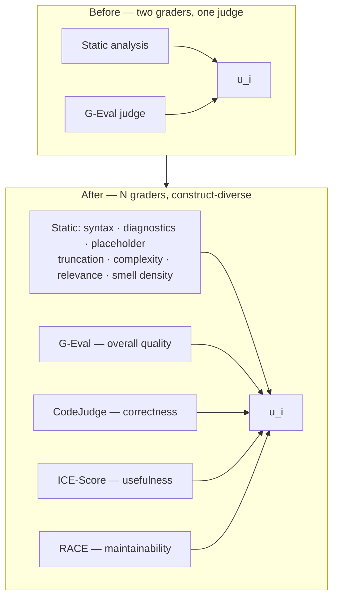

# Empirical Quality Metrics for Model Selection — Research Assessment

**Purpose:** decide which published code-quality and LLM-as-a-judge methods should feed Arc Router's
unified score `u_i`, and record why each was adopted or rejected so the assessment is not re-derived.

**Scope:** the router learns which model is best at which dimension from `u_i` alone
([`quality-verifier-architecture.md`](../router/quality-verifier-architecture.md)). Anything that changes
`u_i` changes routing, so every candidate here is judged on **published empirical validation** — measured
correlation against human judgment or execution-verified correctness — not on plausibility.

**Companion notes:** [`paper-notes.md`](paper-notes.md) (the routing paper) ·
[`2303.16634v3.md`](2303.16634v3.md) (G-Eval, the judge already shipped).

---

## 1. Executive summary

Three findings drove the implementation plan, and two of them contradict what the naive reading of this
literature would suggest.

1. **Both graders evaluate the answer without the question.** `QualityRequest` and `JudgeScoreRequest`
   carry no prompt text, so a complete, warning-free snippet answering a *different* question scores 1.0.
   Every strong method below scores code *against a stated requirement*, so this blocked all of them.
2. **The judge is weakest at exactly what it is weighted most for.** Measured agreement between LLM judges
   and ground-truth code correctness is Cohen's κ ≈ 0.10–0.21 — *slight* agreement. The judge axis is
   weighted 0.60 on `algorithm_design` and 0.45 on `bug_fixing`.
3. **Self-preference is not the main bias risk here; verbosity is.** The code-specific audit measured
   self-enhancement as weak and inconsistent (+2.55 pp) while verbosity moved accuracy by −30.63 pp.

The response is a **portfolio of concurrent graders selected for construct diversity** rather than one
better judge — which is itself the literature's recommended mitigation for single-judge unreliability.

---

## 2. Reliability: what LLM judges actually achieve on code

The single most important numbers in this assessment, from Crupi et al. (TSE 2025). Cohen's κ between LLM
judgment and test-verified correctness:

| Judge | Java | Python |
|---|---|---|
| GPT-4-turbo | **0.21** | **0.10** |
| GPT-3.5-turbo | 0.16 | 0.09 |
| CodeLlama 34B | 0.21 | 0.03 |
| CodeLlama 13B | 0.13 | 0.05 |
| DeepSeek 33B | 0.15 | 0.05 |

GPT-4 misjudged **50% (Java) / 35% (Python)** of wrong implementations as correct. Smaller LLMs "with
parameters of a few billion tend to fail in ~15% of cases" at simply understanding the judging task.

Code **summarization** judging is much stronger — GPT-4 reaches Krippendorff α 0.58–0.63 on content
adequacy — but collapses for smaller models (GPT-3.5: 0.17–0.18; CodeLlama: negative).

**Two consequences, pointing different ways:**

- This is the strongest argument **for** structured fault-taxonomy judging (CodeJudge): it exists precisely
  because unstructured correctness judging is this weak, and its τ = 0.612 is the improvement over exactly
  this baseline.
- It is an argument **against** re-weighting `Quality:DimensionWeights` from the literature. Crupi finds
  summary judging strongest; Wang et al. finds code summarization *weakest* of their three tasks (Pearson
  26.19). The field is genuinely inconsistent about where judge reliability peaks — so the weights must be
  tuned from local measurement, not from a paper.

Because Arc Router's judge backbone **must be a free Providers-screen model**
([`geval-shadow-scoring-plan.md`](../router/geval-shadow-scoring-plan.md) §1a), the small-model failure
rate above is not a footnote. Every LLM grader carries a per-grader capability probe and abstains rather
than fabricating.

---

## 3. Method categories: Arc Router is in the winning one

Wang et al. (ISSTA 2025) ranked nine evaluation methods by Pearson correlation with human scores:

| Category | Members | Code translation | Code generation | Code summarization |
|---|---|---|---|---|
| **Output-based** (large LLMs) | Vanilla, **G-Eval**, BatchEval | **81.32** | **68.51** | 26.19 |
| Embedding-based | BERTScore, MoverScore | 34.77 | 47.35 | 29.44 |
| Probability-based | GPTScore, FFLM | 34.77 | 45.42 | **−15.04** |

> **This table is easy to misread, and the misreading would be expensive.** Their *probability-based*
> category scores the **generated text's own likelihood**. It is not the same thing as G-Eval's
> probability-weighted score digit — the paper explicitly classifies **G-Eval as output-based**, because it
> prompts the model to emit a judgment. `GEvalJudgeClient.TryComputeWeightedScore` weights the logprobs *of
> the emitted score token*, which is output-based. **Do not remove the logprob weighting on the strength of
> this table.**

Two consequences recorded here so they are not rediscovered:

- **Embedding-based and probability-based graders are excluded on measurement**, not taste.
- **The CoT deferral is reopened.** Wang et al.'s G-Eval entry is "Chain-of-Thought with sampling";
  `GEvalJudgeClient` deliberately ships static per-dimension criteria without CoT
  ([`../../src/PLAN.md`](../../src/PLAN.md), Settled deferrals). The 2026 bias audit measured CoT swings up
  to +18 pp. That deferral now has evidence against it and is A/B-tested rather than silently carried.

---

## 4. Bias: measured magnitudes, not general warnings

From the code-specific audit (arXiv:2604.16790), which injected twelve controlled biases:

| Bias | Measured magnitude | Arc Router exposure |
|---|---|---|
| **Verbosity / length** | **−30.63 pp** (Qwen2.5-Coder-3B, CodeGen) | ⚠️ **Highest.** The candidate pool varies hugely in verbosity; a verbosity-biased judge misranks whole model families |
| **Misinformation oversight** | Crupi's 50%/35% false-positive rate on wrong code | ⚠️ **High** — systematically inflates plausible-but-wrong answers |
| **Position / order** | reversals **>40 pp** when the gold answer moves A→B | Only under pairwise judging (deferred) |
| **"Refined" label** | +26.94 pp → −27.48 pp on position flip | Not applicable — no provenance labels in the prompt |
| **Self-enhance / egocentric** | +2.55 pp, inconsistent across tasks | Real, but **lower priority than previously assumed** |

`README.md` names self-preference as a known-unmeasured risk, citing G-Eval's own caveat and Panickssery
et al. That remains worth measuring — but the code-specific evidence puts **verbosity skew** ahead of it,
and the §G2 probe is scoped accordingly.

---

## 5. Verdicts

### 5.1 Adopted

| Source | Contribution | Where |
|---|---|---|
| **CodeJudge** — Tong & Zhang, EMNLP 2024 ([arXiv:2410.02184](https://arxiv.org/abs/2410.02184)) | Severity-weighted fault taxonomy; test-free and reference-free. τ **0.612** HumanEval-X (ICE-Score 0.475), **0.354** APPS (prior SOTA 0.224) | Correctness grader |
| **ICE-Score** — Zhuo, Findings of EACL 2024 ([arXiv:2304.14317](https://arxiv.org/abs/2304.14317)) | The `"usefulness"` aspect (0–4, reference-free, behavioural anchors) | Usefulness grader |
| **RACE** — Zheng et al. ([arXiv:2407.11470](https://arxiv.org/abs/2407.11470)) | Readability + maintainability rubric vocabulary | Maintainability grader |
| **CodeAgent** — [arXiv:2402.02172](https://arxiv.org/html/2402.02172v4) | QA-Checker's relevance/drift idea only | Relevance analyzer |
| **Szych & Schwerk** — [arXiv:2605.09059](https://arxiv.org/html/2605.09059) | Smell density `(findings / LOC) × 100` | Static analyzer |
| **Li et al.** survey ([arXiv:2411.16594](https://arxiv.org/abs/2411.16594)) | Multi-agent judging + **cascade** as the mitigation for single-judge unreliability | Portfolio rationale, capability gates |
| **Bias audit** ([arXiv:2604.16790](https://arxiv.org/html/2604.16790v1)) | Repeated-run consistency (CR) | Per-grader confidence multiplier |

**CodeJudge's scoring rule**, implemented verbatim:

```
deduction: negligible = 0 · small = 5 · major = 50 · fatal = 100
score = 1 − min(100, Σ deductions) / 100
```

| Severity | Fault types |
|---|---|
| Negligible | Alternative · Dependency · Error Handling · Efficiency |
| Small | Input Handling |
| Major | Logic Error |
| Fatal | Declaration · Incompletion |

**ICE-Score:** only the `"usefulness"` aspect is taken. Its `"functional correctness"` aspect's criteria
explicitly requires "all possible unit tests, and comparison of reference code" — neither of which exists
for live traffic — and CodeJudge dominates it regardless.

### 5.2 Evidence, not implementation

| Source | Contribution |
|---|---|
| **CodeJudgeBench** — Jiang et al. ([arXiv:2507.10535](https://arxiv.org/abs/2507.10535)) | Confirms keeping the **full raw response** (comments + reasoning) beats cleaned code — Arc Router already does this, recorded so it is not "optimized" into passing extracted code |
| **Crupi et al.** — TSE 2025 ([arXiv:2507.16587](https://arxiv.org/abs/2507.16587)) | §2's reliability numbers |
| **Wang et al.** — ISSTA 2025 ([arXiv:2502.06193](https://arxiv.org/abs/2502.06193)) | §3's category ranking |
| **Automating Code Review: A SLR** — Tufano & Bavota ([arXiv:2503.09510](https://arxiv.org/abs/2503.09510)) | Task taxonomy and metric vocabulary; a map, not a method |

### 5.3 Rejected

| Source | Reason |
|---|---|
| **BLEU / CodeBLEU / chrF / RUBY** | Require reference solutions live traffic does not have; both ICE-Score and CodeJudge measure them as weakly correlated with correctness |
| **Embedding-based** (BERTScore, MoverScore) | Measured below output-based on every task (§3) |
| **Probability-based** (GPTScore, FFLM) | Measured worst, including **−15.04** on summarization (§3) |
| **CodeAgent's 6-role pipeline** | Six LLM calls per graded response; the off-path budget will not carry it. Its Edit Progress metric also needs ground truth |
| **CodeReviewer** — Li et al., ESEC/FSE 2022 ([arXiv:2203.09095](https://arxiv.org/abs/2203.09095)) | BLEU + Exact Match need ground truth. Its **dataset** is retained as a possible offline probe corpus |
| **Pairwise judging + Bradley–Terry** | The literature contradicts itself — CodeJudgeBench finds pairwise beats pointwise, Wang et al. recommends "individual scoring over pairwise." Also carries the >40 pp position-bias exposure. Deferred on evidence, not caution |
| **ICDIS '25 Copilot system** — Shao, Luo & Xia ([10.1145/3772326.3774728](https://dl.acm.org/doi/10.1145/3772326.3774728)) | See below |
| Medium — *Utilising LLM-as-a-Judge…* | Secondary synthesis of CodeJudge / ICE-Score / G-Eval; superseded by its own sources |

**On the ICDIS paper.** It *is* a code-quality-assessment paper — it fuses Copilot's code understanding
with traditional static analysis and reports **87% evaluation accuracy on 500,000 lines of code**. It is
not adoptable: ACM blocks automated retrieval of even its own CC-BY PDF, so the "multi-dimensional feature
extraction model and adaptive quality evaluation algorithm" is not recoverable; "evaluation accuracy" has
no stated ground truth; the domain is EDA and circuit-design libraries rather than general coding tasks; it
depends on a proprietary product a free backbone cannot call; and it is five pages with fifteen references
at a non-software-engineering venue.

**Its value is corroboration, and that is worth stating.** An independent team converged on precisely Arc
Router's architecture — LLM code understanding *fused with* traditional static analysis rather than
replacing it. That is a supporting data point for the two-grader design the verifier already had, and for
the N-grader portfolio replacing it.

---

## 6. What this changes



The selection rule is **construct diversity, not more correctness judges**: judge failure modes correlate
within a construct, so a second correctness judge buys far less than a first usefulness judge. Each grader
abstains independently, and the scorer's drop-rather-than-zero rule means an absent grader costs nothing.

Implementation phases, capability gates, and the local measurement that must precede any re-weighting are
specified in [`../router/quality-verifier-architecture.md`](../router/quality-verifier-architecture.md) and
[`../../src/PLAN.md`](../../src/PLAN.md).

---

## 7. Honest limits of this assessment

- **The ICDIS paper was assessed from metadata and its verbatim abstract only.** ACM returned HTTP 403 to
  every retrieval route including the download link its own CC-BY licence implies. The verdict would not
  change on reading it — the objections are venue, domain, ground-truth definition, and the proprietary
  dependency — but the method itself is unread.
- **The Medium article was recovered indirectly** via search summaries rather than fetched. It is not cited
  for any claim; it is recorded because it pointed to CodeJudgeBench.
- **None of these metrics prove correctness.** Every one is a proxy. `docs/how-it-learns.md`'s "Honest
  gaps" section remains accurate: for live traffic there is no ground truth, and a portfolio of better
  proxies is still a portfolio of proxies.
- **The correlations quoted here were measured on the papers' judge models and datasets, not on this
  router's free backbone and live traffic.** They justify *trying* a method; only the §G2-successor probe
  justifies *weighting* it.
