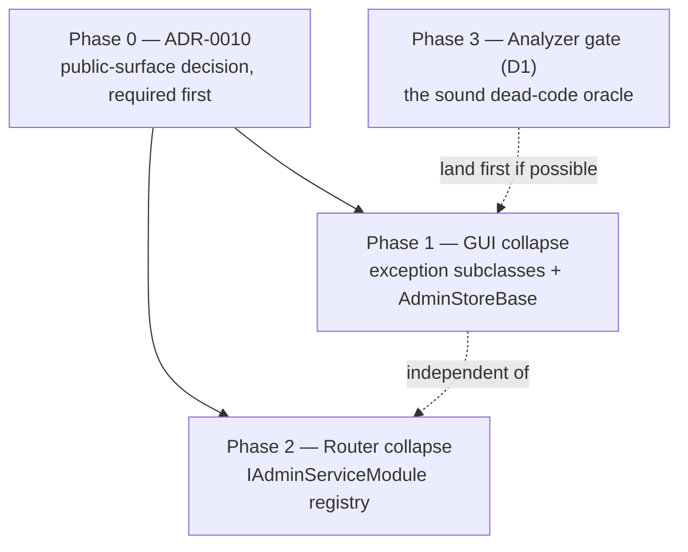

# Admin-Slice Consolidation Plan

**Status:** Phase 0 complete ([ADR-0010](../adr/0010-collapse-the-per-feature-admin-slice-onto-shared-seams.md),
proposed). Phases 1-3 in progress.

**End condition (stated up front, per [ADR-0008 Amendment 1](../adr/0008-codegraph-serena-dual-engine-code-smell-pipeline.md#amendment-1-2026-09-02-stop-rules)
rule 4):** this document closes when Phases 0-3 have shipped **and one subsequent admin knob has been
added through the new seams** — that addition is the only real proof the marginal cost actually fell.
Findings after that start a new document rather than extending this one.

**Engine note:** this survey ran **CodeGraph-only. Serena MCP was unreachable** (cached connection
failure). Per ADR-0008 step 2 the Critical/Major/Minor classification below is **the agent's own and
not a dual-engine result** — do not read this catalog as one.

**Trigger:** maintainer-reported pain — "the application keeps growing and growing" — not a cadence
or a phase boundary, per ADR-0008 step 3.

**Scope surveyed:** production only (`TotallyHotArcRouter`, `.Quality`, `.Gui`, `.Gui.Admin`,
`.Gui.Charts`, `.Gui.Console`, `.Gui.Telemetry`). `Installer` and all `*.Tests` projects excluded —
tests are the regression net, not the catalog.

---

## The finding

Growth in this repo is not diffuse. It has **one dominant mechanism**, and the existing
[code-smell refactoring plan](code-smell-refactoring-plan.md) never looked at it: every Governance
admin knob is the same **six-file vertical slice across three assemblies**, and that slice now exists
**11 times**.

| Layer | Count | Lines | Consolidated? |
|---|---|---|---|
| `*AdminGrpcService` (router) | 11 | 1,783 | No |
| `*AdminClient` + `I*AdminClient` (`Gui.Telemetry`) | 11 | 2,666 | **Half** — `GrpcAdminClientBase` took the channel/dispose/wrap scaffolding |
| `*AdminException` subclasses | 11 | ~150 | No — every one adds **zero** behavior over `GrpcAdminException` |
| `*Store` (`Gui/Services`) | 13 of 16 | ~2,400 | No — all share `IsLoaded`/`IsReachable`/`LastError`/`Changed`, the owned-vs-injected constructor pair, and swallow-and-flag `LoadAsync` |
| `ProxyServer` ctor + endpoint blocks | 11 | ~200 | No |

`ProxyServer.cs`'s 351-line constructor is 11 copies of one block, and its own comments say
*"Same reasoning again"* four times ([`ProxyServer.cs:223`](../../src/TotallyHotArcRouter/Proxy/ProxyServer.cs),
`:234`, `:248`, `:261`). The code was already telling us it is a pattern.

### Observed cost (Amendment 1 rule 1)

Rule 1 requires a real cost, and rejects line count and blast radius as the cost itself. This item
has one, measured:

- **`d2dca10` (judge calibration) cost 42 files and +3,171 lines** for a single read-only panel.
  ~630 production and ~420 test lines of that were pure transport plumbing.
- The slice forces edits to the same shared files every time: `ProxyServer.cs`,
  `ProxyServerDependencies.cs`, `MauiProgram.cs`, `Governance.razor`,
  `ProxyServiceCollectionExtensions.cs`, `telemetry.proto`. That is the Shotgun Surgery signature, on
  the same evidence basis that justified **A2**.
- The maintainer named the cost directly. This survey exists because of that, not despite it.

**Honest framing (rule 3):** this is a **marginal-cost** fix more than a total-size fix. Phases 1 and
3 delete lines; Phase 2 is roughly line-neutral and is argued on edit-set size, not volume. The PR
descriptions should say so rather than claim a large deletion.

---

## What was checked and rejected

Kept to the existing plan's convention — a survey that finds only work is a survey that was not
honest about its misses.

- **Performance was not measured, and no performance problem was found.** The prior audit recorded 0
  `async void` and 0 `Thread.Sleep`; C7's nine sync-over-async sites are off the hot path. Nothing
  here is a runtime optimization — "optimization" in this document means structural. If runtime cost
  is the real question, that is a profiling exercise and a different document.
- **A hand-rolled dead-code sweep produced 36 candidates; 35 were false positives.** Static-class call
  sites and JSON DTO graphs — `ChatChoice`/`ChoiceLogprobs`/`TopLogprobCandidate`,
  `FencedCodeBlockParser`, `DelimiterBalance`, `GateCheck`, `KnownPriceSource`,
  `*ServiceCollectionExtensions` — all read as unreferenced to a text scan and are live. This is
  direct empirical confirmation of **D1**'s claim that the compiler is the only sound oracle here,
  and it is why Phase 3 turns the oracle on instead of shipping a hand-made list.
- **`ProviderAdminException` is out of scope.** It derives from `Exception`, not `GrpcAdminException`
  — it belongs to the HTTP client kept on HTTP by
  [ADR-0007](../adr/0007-provider-admin-client-stays-on-http.md). Its 8 catch sites are untouched.
- **`src/TotallyHotArcRouter.Sandbox{,.Tests}`** hold only `bin/`+`obj/`, are **untracked**, and are
  absent from `TotallyHotArcRouter.slnx`. Local disk litter, not a repo change.
- **`TaxonomyPromotionCriterion` is dark but deliberate — keep it.** 100 production + 97 test lines
  with **zero callers**, confirmed via `codegraph callers`. It implements Phase T4 of
  [`self-organizing-classification-plan.md`](self-organizing-classification-plan.md) and is built
  ahead of its consumer, not abandoned. **Recorded here so a future audit does not re-flag it as
  dead code.**

---

## Phases

### Phase 0 — ADR-0010. **Complete.**

Deleting 11 `public` types from `Gui.Telemetry` and adding a registration interface to
`ProxyServerDependencies` are public-surface changes, which AGENTS.md's dual-engine rule 4 and the
existing plan's "Constraints carried forward" both gate behind an ADR.

### Phase 1 — GUI collapse (`Gui.Telemetry` + `Gui`)

**1a — Delete the 11 `*AdminException` subclasses.** `GrpcAdminClientBase<TGeneratedClient,
TException>` simplifies to `GrpcAdminClientBase<TGeneratedClient>`, throwing `GrpcAdminException`
directly; each client's `CreateException` override goes with it.

> **The one behavioral risk in this phase.** Widening `catch (XxxAdminException)` to
> `catch (GrpcAdminException)` is safe only because **no `try` block spans two different admin
> clients**. That was enumerated across all 33 catch sites and confirmed. `BenchmarkData.razor.cs`
> catches two types but in two separate wrapper methods (`:329`, `:412`) — whose comments
> (*"Same wrapper shape as PriceSourcesAdmin's"*) are themselves further evidence of the duplication.
> Re-confirm before committing.

**1b — Introduce `AdminStoreBase<TClient, TException>`** (Template Method) owning what all 13 stores
repeat: the four status properties, `Changed`, `Dispose`, the owned-vs-injected constructor pair, and
a `RunAsync` helper that swallows the transport exception into `IsReachable`/`LastError` and
**always** raises `Changed`.

Generic over the exception so **ADR-0007's transport split survives in the type system**: gRPC stores
bind `GrpcAdminException`, `ProviderAdminStore`/`UsageStore` bind `ProviderAdminException`.

Preserve exactly: the `disposeHandler: false` ownership subtlety recorded in the existing plan's
C3/C4 note. Copying that pattern naively introduces the opposite bug.

**1c** — ship 1a and 1b as two separate commits so a regression bisects cleanly.

### Phase 2 — Router collapse (`ProxyServer`)

This **re-scopes C5**. That item recorded `ProxyServer`'s constructor as a long-method smell and
prescribed one `Configure<Group>` method per feature; that would have relocated 11 copies into 11
methods and left the duplication intact. The measurement says the cause is a missing **registry**.

`IAdminServiceModule` (`Register(IServiceCollection)` + `Map(IEndpointRouteBuilder)`) implemented by
the 10 `*AdminDependencies` records that already hold exactly the collaborators each block registers.
`ProxyServer` iterates instead of enumerating.

**Keep explicit, do not fold in:** `TelemetryGrpcService`, `RoutingModeAdminGrpcService`,
`UpdateAdminGrpcService`, `RoutingGateAdminGrpcService` map **unconditionally**, and
`RoutingModeAdminGrpcService` carries a deliberate `RoutingOptions` fallback
([`ProxyServer.cs:243-246`](../../src/TotallyHotArcRouter/Proxy/ProxyServer.cs)). Folding them into
the conditional loop would change *when* they map.

### Phase 3 — Turn on the dead-code oracle (D1)

Confirmed still open: `src/Directory.Build.props` sets **only** `TreatWarningsAsErrors`, and the repo
has **no `.editorconfig` at all**. Because warnings are already errors repo-wide, any analyzer
warning is an instant build break across ~125k lines — so stage it:

**3a** — land the enablement with everything silent (a green, zero-risk commit):
`EnableNETAnalyzers` / `AnalysisLevel` / `EnforceCodeStyleInBuild` in `Directory.Build.props`, plus
`dotnet_analyzer_diagnostic.severity = silent` in a new `src/.editorconfig`.

**3b** — escalate one rule per commit, fixing its fallout in that same commit:

| Rule | Finds | Note |
|---|---|---|
| `IDE0005` | unused usings | Reports at build only where `GenerateDocumentationFile` is set — true for 7 projects, not all |
| `IDE0051` / `IDE0052` | unused / unread private members | **this is the actual dead-code report** |
| `CA1823` | unused private fields | |
| `CA2000` | dispose before losing scope | would have caught C3/C4 for free |
| `CA1849` | sync-over-async | fires on C7's 9 known-benign sites — fix, or suppress **with the documented justification AGENTS.md requires** |

Whatever `IDE0051`/`IDE0052` report **is** the dark-code answer. Do not pre-write a list.

---

## Validation gate

The existing plan's gate applies unchanged, plus two additions specific to this work.

1. `dotnet build` — zero warnings, zero errors (`TreatWarningsAsErrors` is repo-wide).
2. Every touched member's XML doc re-read for **staleness**. Extraction moves code between classes;
   `CS1591` catches a *missing* doc, never a wrong one.
3. All tests pass; both non-GUI assemblies hold ≥80% line coverage.
4. No unusually heavy test exceeds 5 seconds.
5. Serilog message templates stay static string literals; extracted code carries its log statements
   to the new home rather than dropping them.
6. **Phase 2 — manual golden-path smoke through a running proxy, exercising every one of the 11
   Governance panels, not a sample.** `ProxyServer` owns the Kestrel host and gRPC mapping, and a
   registration mistake surfaces as a service that maps and then throws on its first RPC
   ([`ProxyServer.cs:90`](../../src/TotallyHotArcRouter/Proxy/ProxyServer.cs) documents exactly this
   failure mode). A module that silently fails to register is invisible to the unit suite.
7. **Phase 1 — the bUnit suites** (`ProvidersAdminTests`, `SettingsModalTests`, `BenchmarkDataTests`,
   `PriceSourcesAdminTests`) plus the `Gui.Telemetry` client tests are the regression net for the
   exception collapse. Confirm each store's "unreachable router" degraded state still renders.

**New tests this work should add:**

- `AdminStoreBase.RunAsync` raises `Changed` **even on failure** — currently re-implemented 13 times,
  and the behavior that keeps the UI off a permanent "loading" state when the router is down.
- After Phase 2, every non-null `AdminModule` maps an endpoint — cheap insurance against the exact
  silent-unmapped-service failure item 6 smoke-tests for.
