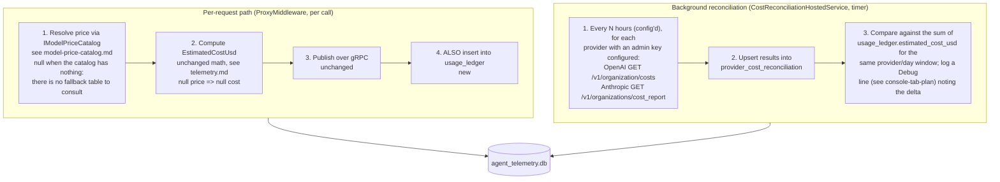

# Agent Cost Tracking: Persistent Ledger, Auto-Refreshed Pricing, and Provider Reconciliation

> **Status: Proposed — not yet implemented.** No SQLite dependency, no `model_prices`/`usage_ledger`
> tables, and no provider cost/usage API client exist anywhere in `src/TotallyHotArcRouter/` today. Nor is
> there any price data: as described in [`telemetry.md`](telemetry.md#pricing), the hand-maintained
> `Pricing` section that used to supply placeholder rates has been deleted, so `EstimatedCostUsd` is
> `0` for a free provider (`ProviderOptions.IsFree`) and `null` for everything else. That number is
> broadcast once over gRPC (SignalR at the time this doc was written - see
> [`grpc-migration.md`](grpc-migration.md)) and never persisted anywhere. Everything below is a
> proposed design, not current behavior, until this banner is removed.

## Why this exists

Asked directly, the honest current answer is: **no, this project does not pull cost from providers.**
`EstimatedCostUsd` on every `RoutingTelemetryEvent` is `0` when the resolved route's provider is
flagged free (`ProviderOptions.IsFree`) and `null` for everything else — never a number reported by
OpenAI/Anthropic/etc.'s own billing. Two separate gaps follow from that:

1. **There is no price data at all.** TotallyHotArcRouter used to carry a hand-maintained `Pricing`
   dictionary in `appsettings.json`, re-edited by hand whenever a provider changed prices, whose own
   `_comment` admitted the values were unverified placeholders. It was **deleted** rather than
   maintained (see [`pricing-seed-removal.md`](pricing-seed-removal.md)), because a fabricated cost is
   indistinguishable from a real one at the point someone reads it. So a paid model reports no cost
   today, honestly, rather than a wrong one.
2. **Nothing is persisted.** `RoutingTelemetryEvent`s are broadcast live over the telemetry hub (see
   [`telemetry.md`](telemetry.md)) and then gone - there's no historical ledger, so there's no way to
   answer "how much has this model cost over the last 24 hours" without having kept every GUI session
   open the whole time.

**This design closes gap 2 only.** Gap 1 is closed by
[`model-price-catalog.md`](model-price-catalog.md), which this document consumes rather than
re-specifies (see §3.2) — and which is a **prerequisite** for a cost number existing at all, not an
upgrade to an estimate that already works. Until it lands, this design's ledger would persist a column
of `null`s for every paid model. On top of gap 2, this design adds a third capability the estimate-only
approach can never provide on its own:

3. **Reconciliation against real provider-reported spend.** OpenAI and Anthropic both expose
   organization-level Costs/Usage APIs that report their own actual billed spend. Periodically
   fetching that and comparing it against the accumulated local estimate turns "we think this cost
   ~$X" into "we know this cost $X, and our estimate was off by $Y" - a genuine answer to the
   original question, not just a better-maintained version of the same estimate.

## Architecture boundary: everything here lives in the proxy, not the GUI

**The GUI only ever talks to the TotallyHotArcRouter proxy** (see
[`telemetry.md`](telemetry.md#gui-consumption)'s architecture principle) - it never calls a provider
directly and never reads proxy-side storage directly. Every piece of this design runs inside the
`TotallyHotArcRouter` proxy process:

- The SQLite database (`model_prices`, `usage_ledger`, `provider_cost_reconciliation`) is opened and
  owned exclusively by the proxy. `TotallyHotArcRouter.Gui` never opens `agent_telemetry.db` itself, even
  though both processes typically run on the same machine as the same user and doing so would be
  technically possible - it reaches this data only through whatever the proxy chooses to expose (see
  [`../gui/governance-model-cards.md`](../gui/governance-model-cards.md) for the first proposed
  GUI-facing surface built on top of this ledger).
- The provider reconciliation calls (section 3.5, calling OpenAI's/Anthropic's real cost APIs with an
  Admin API key) happen from this document's own background service (`CostReconciliationHostedService`,
  mirroring `ProxyHostedService`'s existing pattern). The pricing-catalog refresh is a **separate**
  proxy-side service owned by [`model-price-catalog.md`](model-price-catalog.md) (see its D4 for why
  the two don't share a timer). The GUI has no network path to any pricing aggregator or any provider's
  cost API, and must not be given one - it doesn't hold, and should never be given, the Admin API keys
  those calls require.

These three pieces are independent and can ship separately, but are described together here since
they share the same storage layer.

---

## 1. System topology

Two mostly-independent subsystems, sharing one local SQLite database (`agent_telemetry.db`):



> The price-resolution step (1) is owned by [`model-price-catalog.md`](model-price-catalog.md), which
> runs its own separate ingestion service on its own cadence — see that doc's D4. The reconciliation
> job below is this document's.

Both subsystems read/write the same SQLite file; the per-request path never blocks on network I/O
for pricing (a stale-cache refresh is a background concern, not inline with request forwarding - see
"Never block the hot path" below), and the reconciliation job runs entirely independently on its own
timer.

---

## 2. Database schema

Adapted from the reference blueprint's SQLite schema, with two changes: `agent_id` is renamed
`model_identifier` throughout (this codebase has no "agent" concept separate from "which model was
selected" - see `telemetry.md`'s "Agent = Model" note - so introducing a second identity concept here
would be inventing a distinction the rest of the pipeline doesn't have), and a third table is added
for reconciliation data that the reference blueprint didn't cover.

> **The price tables are not defined here.** This document previously declared a flat `model_prices`
> table; that has moved, in fuller form, to [`model-price-catalog.md`](model-price-catalog.md) Phase 1 —
> a `providers` / `models` / `model_aliases` / `aggregator_sources` / `model_prices` /
> `multimodal_prices` set. See that doc's **D3** for how it is keyed and **D2** for its USD-per-million
> units. It lives in the same `agent_telemetry.db` file and follows the same `snake_case` conventions as
> the tables below. The two schemas join on `model_identifier` (the client-facing
> `ModelRouting:ModelList[].ModelName`).

```sql
-- Immutable per-request log, populated alongside (not instead of) the existing gRPC broadcast.
-- model_identifier = RoutingTelemetryEvent.RequestedModel (the client-facing ModelRouting:ModelList[].ModelName),
-- NOT ResolvedModel - matches how the price catalog is keyed (see model-price-catalog.md's D3) and is
-- the stable identity across a provider's own model-id changes. See
-- docs/gui/governance-model-cards.md section 3.2 for why this matters.
CREATE TABLE IF NOT EXISTS usage_ledger (
    id INTEGER PRIMARY KEY AUTOINCREMENT,
    session_id TEXT NOT NULL,
    turn_number INTEGER NOT NULL,
    model_identifier TEXT NOT NULL,
    provider TEXT NOT NULL,
    prompt_tokens INTEGER,
    completion_tokens INTEGER,
    estimated_cost_usd REAL,
    timestamp_unix INTEGER NOT NULL
);
CREATE INDEX IF NOT EXISTS idx_usage_ledger_provider_time ON usage_ledger (provider, timestamp_unix);

-- New: periodic snapshots of each provider's own reported spend, for reconciliation against the
-- sum of usage_ledger.estimated_cost_usd over the same window. Not in the reference blueprint.
CREATE TABLE IF NOT EXISTS provider_cost_reconciliation (
    id INTEGER PRIMARY KEY AUTOINCREMENT,
    provider TEXT NOT NULL,
    window_start_unix INTEGER NOT NULL,
    window_end_unix INTEGER NOT NULL,
    provider_reported_cost_usd REAL NOT NULL,
    local_estimated_cost_usd REAL NOT NULL,
    fetched_at_unix INTEGER NOT NULL
);
```

`usage_ledger` intentionally mirrors `RoutingTelemetryEvent`'s already-computed fields - this is
**persisting what the proxy already calculates**, not a second, separate cost computation. It does
not duplicate `RequestSummary`/`ResponseSummary` (see [`telemetry.md`](telemetry.md#requestresponse-text-extraction)) -
this ledger is for cost/budget queries, not a transcript store, and keeping prompt/response text out
of a long-lived on-disk database is a deliberately smaller exposure than the live-only gRPC
broadcast that text already goes over (see [`signalr-hub-security.md`](signalr-hub-security.md), whose
concerns still apply to the current transport despite its SignalR-era name and code samples).

---

## 3. C# implementation blueprint

New folder: `src/TotallyHotArcRouter/Telemetry/CostTracking/`. Uses `Microsoft.Data.Sqlite` (a new
dependency - nothing in this codebase uses a database today; `Router/JsonRouterMemoryStore.cs` is the
closest existing precedent, and it uses a plain JSON file, not a DB - see "Known limitations" for why
SQLite is still the right call here anyway).

### 3.1 Schema initialization

```csharp
namespace TotallyHotArcRouter.Telemetry.CostTracking;

/// <summary>
/// Creates the cost-tracking SQLite schema if it doesn't already exist. Safe to call on every
/// startup - CREATE TABLE IF NOT EXISTS / CREATE INDEX IF NOT EXISTS are idempotent.
/// </summary>
public sealed class CostTrackingSchema
{
    public static async Task EnsureCreatedAsync(SqliteConnection connection, CancellationToken cancellationToken = default)
    {
        // The three CREATE TABLE / CREATE INDEX statements from section 2, executed as one batch.
        await using var command = connection.CreateCommand();
        command.CommandText = SchemaSql;
        await command.ExecuteNonQueryAsync(cancellationToken);
    }

    private const string SchemaSql = "...";  // the SQL block in section 2
}
```

### 3.2 Auto-refreshing price catalog

> **Moved to [`model-price-catalog.md`](model-price-catalog.md).** This section used to sketch a
> single-source catalog: one hard-coded `PricingCatalogUrl` pointing at LiteLLM's public pricing JSON,
> one parser bound to LiteLLM's key names, and a single point of failure whose only backstop was the
> static `appsettings.json` table this feature existed to replace (that table has since been deleted
> outright — see [`telemetry.md`](telemetry.md#pricing)). That design has been superseded by a
> multi-aggregator one — sources ranked by an explicit `priority_score` (deferred: see that doc's
> current scope — LiteLLM ships alone first), cascade failover, a schema
> carrying batch/cached/multimodal rates, stale-data retention, and a WAL + in-memory read path — and
> the sketch is not reproduced here, because two versions of the same interface in two files is exactly
> the drift this reconciliation removed.
>
> **What the rest of this document needs to know:** `IModelPriceCatalog` returns a price for a
> `model_identifier` or `null`, never blocks on network I/O, and never throws — the interface and its
> full contract are defined in
> [`model-price-catalog.md`](model-price-catalog.md#phase-4-runtime-querying--cache-layer)'s Phase 4,
> not here. There is no fallback table behind it: `null` means the price is genuinely unknown, and both
> cost display and the routing policy are expected to say so rather than substitute a number. The one
> price that doesn't come from the catalog is a free provider's zero (`ProviderOptions.IsFree`), which
> is a known price rather than a guessed one — see [`telemetry.md`](telemetry.md#pricing).

### 3.3 Usage ledger

```csharp
namespace TotallyHotArcRouter.Telemetry.CostTracking;

public interface IUsageLedger
{
    /// <summary>
    /// Persists one already-computed <see cref="RoutingTelemetryEvent"/> to the usage ledger. Called
    /// alongside <see cref="ITelemetryPublisher.PublishAsync"/> in <c>ProxyMiddleware</c>, not instead
    /// of it - the live gRPC broadcast is unchanged. Must never throw (same fault-isolation
    /// contract as the rest of the telemetry pipeline - see <c>ITelemetryPublisher</c>'s remarks).
    /// </summary>
    Task LogAsync(RoutingTelemetryEvent telemetryEvent, CancellationToken cancellationToken = default);

    /// <summary>
    /// Sums <c>estimated_cost_usd</c> for <paramref name="modelIdentifier"/> over the trailing
    /// <paramref name="window"/> (i.e. now minus <paramref name="window"/> through now) - the query
    /// backing a budget check like <see cref="IsWithinBudgetAsync"/> (section 5), where "how much has
    /// this model cost recently" always means a fixed duration ending right now.
    /// </summary>
    Task<decimal> GetAccumulatedCostAsync(string modelIdentifier, TimeSpan window, CancellationToken cancellationToken = default);

    /// <summary>
    /// Sums <c>estimated_cost_usd</c> for every model, each bucketed by <c>model_identifier</c>, over
    /// an arbitrary, explicit <paramref name="from"/>/<paramref name="to"/> range - not necessarily
    /// ending at "now." This is the query
    /// <see href="../gui/governance-model-cards.md">governance-model-cards.md</see>'s date-range
    /// picker needs (a user can pick any historical range) and
    /// <see href="grpc-migration.md">grpc-migration.md</see>'s <c>GetModelSpend</c> RPC backs itself
    /// with - deliberately a separate method from <see cref="GetAccumulatedCostAsync"/> above rather
    /// than overloading it, since "trailing window from now" and "arbitrary historical range" are
    /// different queries with different callers, not the same operation in two forms.
    /// </summary>
    Task<IReadOnlyDictionary<string, decimal>> GetAccumulatedCostByModelAsync(
        DateTimeOffset from, DateTimeOffset to, CancellationToken cancellationToken = default);
}
```

`LogAsync` is a straightforward `INSERT` mapping `RoutingTelemetryEvent`'s fields onto `usage_ledger`
(see the schema in section 2) - there is deliberately no separate cost-computation logic here, unlike
the reference blueprint's `calculate_and_log_agent_spend`, which both computes *and* logs. This
codebase already computes `EstimatedCostUsd` in `ProxyMiddleware.PublishTelemetryAsync` via
`ModelPrice.EstimateCost` (see [`telemetry.md`](telemetry.md#pricing)); duplicating that math in a
second place would risk the two silently drifting apart. The catalog should instead supply the
`ModelPrice` that the *existing* `EstimateCost` computation consumes, rather than growing a parallel
one — which is exactly how the free-provider zero already works today
(`ModelPrice.Free.EstimateCost(...)`).

### 3.4 Provider cost reconciliation

New `IHostedService`, mirroring `ProxyHostedService`'s existing pattern of a background service
registered via `services.AddHostedService(...)` in `ServiceCollectionExtensions.cs`:

```csharp
namespace TotallyHotArcRouter.Telemetry.CostTracking;

public sealed class CostReconciliationHostedService : BackgroundService
{
    // Polls each provider with a configured admin key (see section 4) on a timer (default: hourly -
    // configurable; both providers' cost data is bucketed no finer than daily anyway, per their APIs'
    // own bucket_width limits, so polling much more often than hourly buys nothing).
    protected override async Task ExecuteAsync(CancellationToken stoppingToken)
    {
        // For each configured provider reconciler (see 3.5):
        //   1. Fetch the provider's own reported cost for [yesterday's window] (a full day already
        //      closed out, to avoid comparing against a partial in-progress day).
        //   2. Sum usage_ledger.estimated_cost_usd for the same provider/window.
        //   3. Insert one provider_cost_reconciliation row with both numbers.
        //   4. Log the delta at Debug (or Warning if it exceeds a configurable percentage threshold -
        //      a persistently large gap likely means the local price table is wrong for that
        //      provider's models, not that anything is broken).
    }
}
```

### 3.5 Per-provider cost reconcilers

Only OpenAI and Anthropic have documented, stable, organization-level cost-reporting APIs among this
repo's seven configured providers (`openai`, `anthropic`, `alibaba`, `zhipu`, `moonshot`, `minimax`,
`ollama` - see `appsettings.json`'s `ModelRouting:Providers`). Alibaba/Zhipu/Moonshot/MiniMax
billing-API availability is unresearched; they're out of scope for `IProviderCostReconciler` until
someone verifies one exists, and simply have no reconciler registered (their `usage_ledger` rows still
exist from the per-request path - only the "compare against provider-reported truth" step is
unavailable). `ollama` is a local runtime with no billing at all: it has no cost API by nature, not by
omission, and needs no reconciler ever.

```csharp
public interface IProviderCostReconciler
{
    string Provider { get; }  // "openai" or "anthropic" - matches ModelRouting:Providers keys

    Task<decimal> GetReportedCostAsync(DateOnly day, CancellationToken cancellationToken = default);
}
```

- **`OpenAiCostReconciler`**: `GET https://api.openai.com/v1/organization/costs`, with
  `start_time`/`end_time` (Unix seconds, the requested day) and `bucket_width=1d` (the only value
  currently supported). Requires an **Admin API key** - a different, more privileged credential than
  the per-provider inference key already configured via `ModelRouting:Providers:openai:ApiKeyEnvVar`
  (generated separately, at https://platform.openai.com/settings/organization/admin-keys).
- **`AnthropicCostReconciler`**: `GET https://api.anthropic.com/v1/organizations/cost_report`, with
  `starting_at`/`ending_at` and optional `group_by[]`. Also requires a separate **Admin API key**.
  Anthropic's own docs note usage/cost data typically appears within ~5 minutes of a request
  completing, though delays can occasionally be longer - another reason reconciliation targets
  yesterday's fully-closed window rather than "right now."

Both are genuinely optional at the config level (see section 4) - if no admin key is configured for a
provider, its reconciler simply isn't registered and that provider's rows in
`provider_cost_reconciliation` never get written. The per-request estimate/ledger path (section 3.3,
plus the catalog in [`model-price-catalog.md`](model-price-catalog.md)) works identically with or
without any reconciler configured.

---

## 4. Configuration additions

New `appsettings.json` sections, alongside the existing `ModelRouting` and `SpendTracking` sections
(there is no `Pricing` section to sit beside — it was deleted; see the banner above).
`CostTracking` covers the **ledger and reconciliation** only; `Storage` is shared with the catalog (see
below). The catalog's own tunables live in its `PriceCatalog` section, specified in
[`model-price-catalog.md`](model-price-catalog.md) — a single scalar `PriceCatalogUrl` only ever made
sense for a single upstream, which is the shape that doc replaced with three independently togglable
sources.

```json
{
  "Storage": {
    "DatabasePath": "%LOCALAPPDATA%\\TotallyHotArcRouter\\agent_telemetry.db"
  },
  "CostTracking": {
    "Reconciliation": {
      "PollIntervalHours": 1,
      "Providers": {
        "openai": { "AdminApiKeyEnvVar": "OPENAI_ADMIN_API_KEY" },
        "anthropic": { "AdminApiKeyEnvVar": "ANTHROPIC_ADMIN_API_KEY" }
      }
    }
  }
}
```

**`Storage:DatabasePath` is deliberately not under `CostTracking`.** The SQLite file is shared
infrastructure, not this feature's property: [`model-price-catalog.md`](model-price-catalog.md)'s
catalog tables live in the same file, and per its D4 the catalog must work for a user who has
configured no admin keys and no reconciliation at all — the common case, and the one that ships first.
A path owned by `CostTracking` would force that user to configure the billing feature's section to tell
the catalog where its own database is. Both features bind this one shared section instead, which also
makes it structurally impossible for them to open two different files and silently break the
`model_identifier` join between the two schemas.

`Reconciliation:PollIntervalHours` (1) and the catalog's 4–12h ingestion poll are **different jobs on
different services** — see [`model-price-catalog.md`](model-price-catalog.md)'s D4 for why they stay
separate: reconciliation needs Admin API keys and the catalog needs no credentials at all.

`Storage:DatabasePath` defaults to the same per-user `%LOCALAPPDATA%` convention already established in
[`signalr-hub-security.md`](signalr-hub-security.md) for the certificate/token files, for the same
reason: filesystem ACLs restrict the database (which will contain real cost/token data, and
transitively whatever `provider_cost_reconciliation` reveals about actual spend) to the same OS user
running the proxy, without inventing a new access-control mechanism.

`AdminApiKeyEnvVar` follows the existing `ApiKeyEnvVar` naming convention from
`ModelRouting:Providers`, but is a **separate** environment variable from the inference key - an
Admin API key is a distinct, more privileged credential class (org-wide read access to
usage/billing) that should not be the same secret already deployed for routing traffic, and should
not be required for the feature's core (per-request estimate + ledger) to work.

---

## 5. Operational: budget checks

Equivalent to the reference blueprint's `check_agent_budget_status`, backed by
`IUsageLedger.GetAccumulatedCostAsync` (section 3.3):

```csharp
public async Task<bool> IsWithinBudgetAsync(string modelIdentifier, decimal dailyBudgetCapUsd, CancellationToken cancellationToken = default)
{
    var accumulated = await _usageLedger.GetAccumulatedCostAsync(modelIdentifier, TimeSpan.FromHours(24), cancellationToken);
    return accumulated < dailyBudgetCapUsd;
}
```

This is the real data source the GUI's Governance tab needs - see
[`../gui/backlog.md`](../gui/backlog.md)'s Governance item ("Budget Cap input is editable today but
purely client-side... needs a real place to write to"). Once this ledger exists, Governance's spend
tracking and Cost Analytics' cumulative-savings chart both have a genuine historical data source to
read from, instead of `MockData`. Wiring the GUI to actually call this is separate follow-on work, not
covered by this document - see [`../gui/governance-model-cards.md`](../gui/governance-model-cards.md)
for a proposed (also not yet implemented) design that consumes both `model_prices` and `usage_ledger`
to add per-model pricing/spend cards to the Governance tab.

---

## 6. Known limitations

- **New dependency.** `Microsoft.Data.Sqlite` is not used anywhere in this codebase today (the
  closest existing precedent, `Router/JsonRouterMemoryStore.cs`, persists to a plain JSON file). A
  queryable, indexed, growing usage ledger with time-window aggregation is a much better fit for SQL
  than hand-rolled JSON scanning, which is why this design still recommends it over following the
  JSON-file convention.
- **Estimates and provider-reported reality will legitimately diverge.** Cached-token discounts,
  promotional credits, negotiated enterprise pricing, and simple placeholder-price staleness (before
  the catalog auto-refresh existed, or for a model no aggregator reports) can all cause the
  local estimate and the provider's real number to disagree without either being "wrong" in the sense
  of a bug. `provider_cost_reconciliation` surfaces the delta; it doesn't auto-correct historical
  `usage_ledger` rows, which stay immutable.
- **Provider API reporting delay and granularity.** OpenAI's Costs API currently only supports
  `bucket_width=1d`; Anthropic's cost data typically lands within ~5 minutes but isn't guaranteed to.
  Reconciliation therefore targets yesterday's fully-closed day, not live "right now" spend - this is
  not a real-time reconciliation feature.
- **Admin API keys are a new, more sensitive credential class.** Org-wide read access to billing is a
  bigger blast radius than a single provider's inference key; where/how these are stored deserves the
  same scrutiny as the shared-secret/token work in
  [`signalr-hub-security.md`](signalr-hub-security.md), not just an environment variable pointer.
- **Only 2 of 7 configured providers have a known cost-reporting API.** Alibaba, Zhipu, Moonshot, and
  MiniMax reconcilers don't exist in this design because their billing-API availability hasn't been
  researched - their per-request estimates still get logged to `usage_ledger`, just never reconciled
  against provider-reported truth. (`ollama` is the seventh and is local-only: no billing exists to
  reconcile against.)
- **This document does not cover GUI wiring.** Making Governance/Cost Analytics actually query this
  ledger (rather than `MockData`) is real follow-on work with its own design questions (a new
  GUI-facing query endpoint or hub method, presumably), not specified here.

