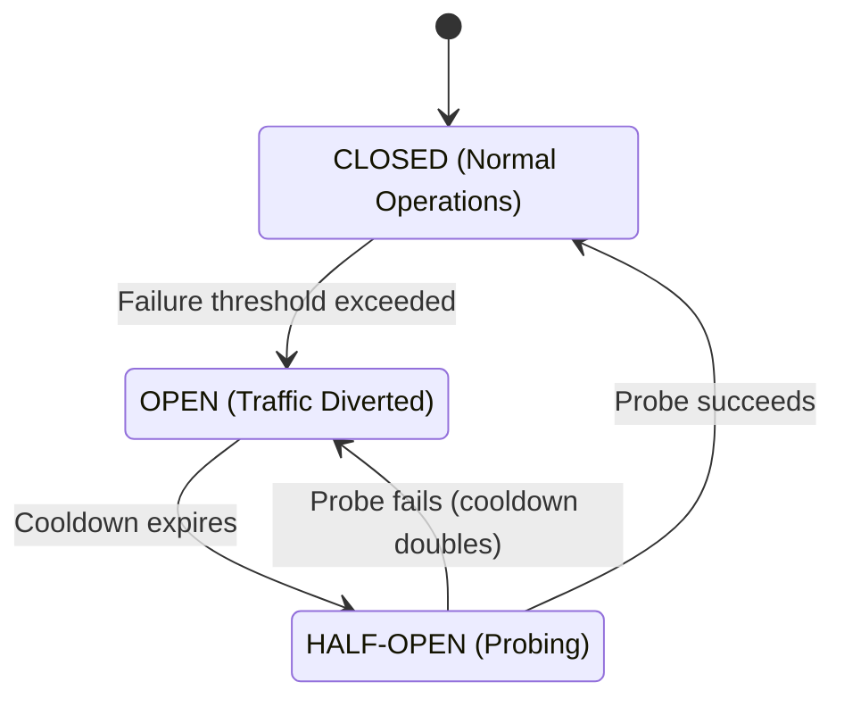
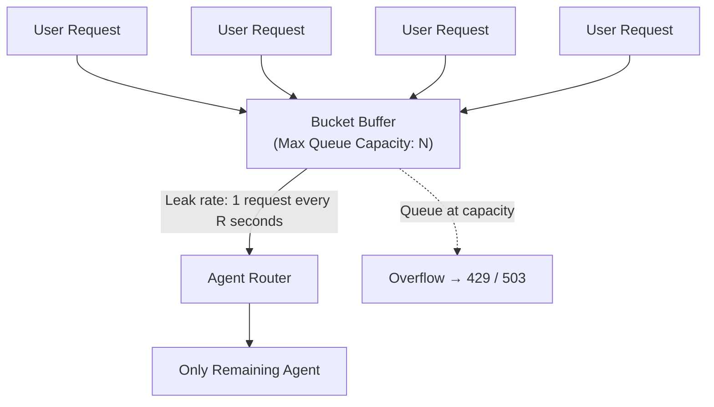

# Agentic Router Resilience Strategies

> **Status: Circuit Breaker (pattern 1) IMPLEMENTED 2026-07-25; Leaky Bucket (pattern 2) not yet built.**
> `ModelRouteEntry.Fallbacks` — the static, hand-configured per-model backup list that
> `RequestInterceptor.ResolveModelRouteAsync` / `ProxyMiddleware.InvokeAsync` used to implement (the
> "Simple Local Fallbacks" parity goal, closed 2026-07-23) — **has been removed** and replaced by the Circuit
> Breaker below: there is no hardcoded fallback list anymore. A target agent (keyed per concrete upstream -
> provider + base URL + provider model id, `TotallyHotArcRouter.Proxy.CircuitBreakerTargetKey`, not per
> client-facing model name) is tracked by `TotallyHotArcRouter.Proxy.CircuitBreaker`; when one trips OPEN, the
> next-best agent is selected instead - ranked by `RouterMemory` score via
> `RequestInterceptor.RankEligibleModels`, reusing the exact same ranking mechanism as
> [`utility-model-routing.md`](utility-model-routing.md)'s unresolved-model fallback
> (`TryAgenticallyRouteUnresolvedModel`), not a separate mechanism. Tuning knobs
> (`FailureThreshold`/`BaseCooldown`/`MaxCooldown`) are configurable via the `CircuitBreaker` appsettings
> section (`TotallyHotArcRouter.Models.CircuitBreakerOptions`), registered as one DI singleton shared by
> `RequestInterceptor` and `ProxyMiddleware` (see `ServiceCollectionExtensions`) since the latter is what
> records successes/failures the former reads back when ranking candidates. Tests:
> `CircuitBreakerTests.cs` (state machine), `RequestInterceptorTests.cs`
> (`ResolveModelRouteAsync_PrimaryCircuitOpen_*`, `_EveryCandidateCircuitOpen_*`),
> `ProxyMiddlewareFallbackTests.InvokeAsync_TargetTripped_SubsequentRequestBypassesWithoutNetworkCall`
> (end-to-end, shared circuit breaker across requests). The Queue-Based Leaky Bucket (pattern 2, for
> single-agent environments) remains a proposed design only - no request queue or leak-rate worker exists
> in code today.
>
> **Refinement (2026-07-25): 401 is a *provider-wide* outage, not a per-target one.** A 401 almost always
> means an invalid/expired credential, which identically breaks every model configured on that provider -
> not just the one the client happened to ask for. `ICircuitBreaker` therefore tracks health at two
> granularities: per-target (`CircuitBreakerTargetKey` - provider + base URL + provider model id, for
> timeouts/5xx/429) and per-provider (a bare provider key string, for 401). `RecordProviderFailure` trips
> **immediately** on a single 401 - unlike the per-target path, it does not wait for `FailureThreshold`
> occurrences, since one bad credential is already decisive. A provider-wide trip is checked everywhere a
> per-target one is (`RequestInterceptor.RankEligibleModels`'s eligibility filter and primary-substitution
> check; `ProxyMiddleware`'s pre-attempt bypass gate), and a successful call clears both the target's and
> its provider's state (`ICircuitBreaker.RecordSuccess`). Failover to a 401'd target's own provider is
> still refused (a same-provider backup shares the identical bad credential); only a *different*-provider
> backup is tried - which required widening the failover lookahead
> (`ProxyMiddleware.InvokeAsync`'s `nextProviderDiffers`) from "is the immediate next candidate a different
> provider" to "is *any* remaining candidate a different provider," since a same-provider sibling can now
> sit between the failing model and a genuine cross-provider backup in the fully-dynamic candidate list.
> Tests: `CircuitBreakerTests.RecordProviderFailure_*`, `ProxyMiddlewareFallbackTests.InvokeAsync_Primary401_*`.
>
> **Refinement (2026-07-26): 404 is a per-target outage, unconditionally retriable.** A 404 means the
> candidate's configured `ProviderModelId` doesn't exist (deleted/renamed/misconfigured) on that
> provider - a fact specific to *that one candidate*, not a shared-fate signal like 401's bad
> credential or 429's shared quota. `IsOutageStatus` now counts 404 as a per-target circuit-breaker
> failure (`RecordFailure`, not `RecordProviderFailure` - a broken model id on one provider says
> nothing about that provider's other models). `IsRetriableOutageStatus` now treats 404 as always
> retriable whenever a candidate remains, *without* the 401/429 same-provider exclusion: since
> `RankEligibleModels` already ranks the full configured pool, the next candidate is frequently a
> different model on the same or a different provider, and a wrong-model-id failure on the current
> hop says nothing about whether that next candidate exists. Previously 404 was misclassified as a
> `RecordSuccess` (health signal) and as a non-retriable client-fault status (cascade behavior),
> silently ending the cascade and returning 404 to the client even when eligible candidates remained.
> Tests: `ProxyMiddlewareFallbackTests.InvokeAsync_Primary404_FailsOverToNextCandidate`,
> `ProxyMiddlewareFallbackTests.InvokeAsync_Repeated404_TripsPerTargetCircuit_NotProviderWide`.
>
> **Refinement (2026-07-26): 403 is a *provider-wide* outage, like 401/405.** Previously classified as an
> ordinary client-fault status (alongside 400/422) that never failed over - but in production this ended a
> cascade at a healthy backup still available, on a status that is almost always a permission/API-key-scope
> problem (API not enabled for this key, region lock, tier restriction) rather than something specific to
> the one model requested. Treated exactly like 401/405: `ProxyMiddleware.InvokeAsync`'s circuit-breaker
> health-signal block now trips `RecordProviderFailure` (not the per-target `RecordFailure`) on a single
> 403, and `IsRetriableOutageStatus` now includes 403 alongside 401/405/429 in the `nextBackupIsDifferentProvider`-gated
> group - a same-provider backup shares the identical credential/permission scope and is still refused;
> only a genuinely different-provider backup is tried. 400/422 remain the only true non-retriable
> client-fault statuses. Tests: `ProxyMiddlewareFallbackTests.InvokeAsync_Primary403_DifferentProviderBackup_FailsOver`,
> `InvokeAsync_Primary403_SameProviderBackup_DoesNotFailOver`,
> `InvokeAsync_Primary403_TripsWholeProvider_SubsequentRequestBypassesADifferentModel_OnSameProvider`.
>
> **Refinement (2026-07-26): a Bedrock candidate is no longer terminal - the cascade now continues past
> it.** Previously `ProxyMiddleware.InvokeAsync` called `InvokeBedrockAsync` and unconditionally `return`ed
> right after, regardless of outcome - a documented gap where a Bedrock failure always ended the whole
> request even when healthy backups remained, unlike every HTTP-forwarded provider. Two things landed
> together to close it: first, `AmazonClientException` (a client-side AWS SDK failure that never reaches
> AWS at all - in production, `DefaultAWSTokenIdentityResolver` unable to resolve a bearer token, i.e. no
> usable credential) was previously **uncaught entirely**, since the existing `catch
> (AmazonBedrockRuntimeException ex)` only matches AWS *service*-level errors - `AmazonServiceException`
> (and its Bedrock-specific subtype) turns out to be a *sibling* of `AmazonClientException`, not a
> subtype, so a credential-resolution failure escaped as an unhandled exception with no client envelope at
> all. It now has its own `catch (AmazonClientException ex)` block, treated like the HTTP path's 401
> handling: `RecordProviderFailure` (provider-wide - a missing/invalid credential breaks every model on
> that Bedrock provider identically), logged at Error, and reported to the client as 401 rather than the
> generic 502 other Bedrock failures get. Second, `InvokeBedrockAsync` now returns `bool` instead of
> `void` - `true` once it has actually written a response (success, or a failure with nothing left worth
> trying), `false` when the SDK call failed before writing anything and a next candidate should be tried,
> mirroring the "nothing committed yet" invariant the HTTP path already relies on. The caller
> (`ProxyMiddleware.InvokeAsync`'s Bedrock branch) `return`s on `true` and `continue`s its candidate loop
> on `false`. The two exception types get different retry semantics, matching their HTTP-status
> counterparts: `AmazonClientException` (401-equivalent) only retries when `nextProviderDiffers` (a
> same-provider backup shares the identical broken credential); `AmazonBedrockRuntimeException` (generic -
> throttling, unknown model id, region misconfiguration, etc.) retries unconditionally whenever a
> candidate remains, per-target `RecordFailure` rather than provider-wide, mirroring the HTTP path's plain
> 5xx/outage handling. Tests: `BedrockProviderTests.Claude_GenericSdkFailure_FailsOverToNextCandidate_OnSameProvider`,
> `Claude_CredentialFailure_DifferentProviderBackup_FailsOver`,
> `Claude_CredentialFailure_SameProviderBackup_DoesNotFailOver`.

## TODO: socket refusal surfaced to the client as HTTP 403 (unconfirmed, needs repro)

Observed 2026-07-26 in production logs (transcribed below): a fully-exhausted cascade — every
candidate either provider-wide-401'd or unreachable — ended with the client seeing a `403`, even though
`WriteUpstreamErrorResponseAsync` (`ProxyMiddleware.cs:784-786`) unconditionally sets
`StatusCodes.Status502BadGateway` on this path. A `SocketException` (`ECONNREFUSED`, "target machine
actively refused it") reaching `ProxyMiddleware.InvokeAsync` as the *last* candidate should therefore
never produce a 403 by reading the code alone — this needs to be reproduced under a debugger/test harness
to find out where the 403 actually comes from (a downstream middleware rewriting `context.Response
.StatusCode` after `ProxyMiddleware` returns? something in `RequestInterceptor`? a misread of the log?)
before it can be called a real bug.

**Log excerpt to keep for the repro (do not discard until this is resolved):**

```
[06:13:46 WRN] Upstream provider zhipu returned 405 for model glm-5; failing over to the next backup.
[06:13:51 ERR] Upstream provider moonshot returned 401 Unauthorized for model kimi-k2.5; treating as a provider-wide outage (likely an invalid or expired credential) and bypassing every model on this provider until it recovers.
[06:13:51 WRN] Upstream provider moonshot returned 401 for model kimi-k2.5; failing over to the next backup.
[06:13:52 ERR] Upstream provider minimax returned 401 Unauthorized for model minimax-m2.7; treating as a provider-wide outage (likely an invalid or expired credential) and bypassing every model on this provider until it recovers.
[06:13:52 WRN] Upstream provider minimax returned 401 for model minimax-m2.7; failing over to the next backup.
[06:13:57 WRN] Upstream provider ollama unreachable for model llama3; failing over to the next backup.
System.Net.Http.HttpRequestException: No connection could be made because the target machine actively refused it. (localhost:11434)
 ---> System.Net.Sockets.SocketException (10061): No connection could be made because the target machine actively refused it.
   at System.Net.Sockets.Socket.AwaitableSocketAsyncEventArgs.ThrowException(SocketError error, CancellationToken cancellationToken)
   at System.Net.Sockets.Socket.AwaitableSocketAsyncEventArgs.System.Threading.Tasks.Sources.IValueTaskSource.GetResult(Int16 token)
   at System.Net.Http.HttpConnectionPool.ConnectToTcpHostAsync(String host, Int32 port, HttpRequestMessage initialRequest, Boolean async, CancellationToken cancellationToken)
   --- End of inner exception stack trace ---
   at System.Net.Http.HttpConnectionPool.ConnectToTcpHostAsync(String host, Int32 port, HttpRequestMessage initialRequest, Boolean async, CancellationToken cancellationToken)
   at System.Net.Http.HttpConnectionPool.ConnectAsync(HttpRequestMessage request, Boolean async, CancellationToken cancellationToken)
   at System.Net.Http.HttpConnectionPool.CreateHttp11ConnectionAsync(HttpRequestMessage request, Boolean async, CancellationToken cancellationToken)
   at System.Net.Http.HttpConnectionPool.InjectNewHttp11ConnectionAsync(QueueItem queueItem)
   at System.Threading.Tasks.TaskCompletionSourceWithCancellation`1.WaitWithCancellationAsync(CancellationToken cancellationToken)
   at System.Net.Http.HttpConnectionPool.SendWithVersionDetectionAndRetryAsync(HttpRequestMessage request, Boolean async, Boolean doRequestAuth, CancellationToken cancellationToken)
   at System.Net.Http.DiagnosticsHandler.SendAsyncCore(HttpRequestMessage request, Boolean async, CancellationToken cancellationToken)
   at System.Net.Http.RedirectHandler.SendAsync(HttpRequestMessage request, Boolean async, CancellationToken cancellationToken)
   at System.Net.Http.HttpClient.<SendAsync>g__Core|83_0(HttpRequestMessage request, HttpCompletionOption completionOption, CancellationTokenSource cts, Boolean disposeCts, CancellationTokenSource pendingRequestsCts, CancellationToken originalCancellationToken)
   at TotallyHotArcRouter.Proxy.ProxyMiddleware.InvokeAsync(HttpContext context, RequestDelegate next) in C:\git\ArcRouter\src\TotallyHotArcRouter\Proxy\ProxyMiddleware.cs:line 374
[06:13:57 INF] [INTERCEPTOR] Intercepting response for /v1/chat/completions with status 403
[06:13:57 DBG] No session id found on request to /v1/chat/completions, and no tracked conversation's message history matched; started tracking new session a109fd37117e4a52914a50303cf488c7. Request header names: [Accept, Accept-Encoding, Accept-Language, Connection, Content-Length, Content-Type, Host, sec-fetch-mode, User-Agent]. Top-level body keys: [model, messages, stream, stream_options, tools, tool_choice].
[06:13:57 INF] [SPEND] model=gpt-5.4 cost=unknown runningTotal=$0.000000 requests=1
```

Note the trace's own `[SPEND] model=gpt-5.4` line right after: the request that logged the 403 apparently
still ended up completing successfully on `gpt-5.4`, which is inconsistent with a terminal 403/502 for
*this* request — another reason to suspect the 403 belongs to a different request interleaved in the log
(concurrent requests share this log stream) rather than being this cascade's actual outcome. Confirm which
before assuming a bug.

**Action items:**
- [ ] Add unit tests asserting the transport-outage-with-no-remaining-candidate path always yields 502, to
  prove/disprove code-level correctness independent of the log ambiguity above:
  - `ProxyMiddlewareFallbackTests.InvokeAsync_LastCandidateUnreachable_Returns502NotOther4xx` — drive an
    `HttpMessageHandler` stub that throws a `SocketException`-wrapped `HttpRequestException` for the final
    candidate, assert `context.Response.StatusCode == 502` and the JSON body's `error.code == "502"`.
  - `ProxyMiddlewareFallbackTests.InvokeAsync_AllCandidatesUnreachable_Returns502` — same, but every
    candidate in the route list throws, to mirror the multi-provider cascade in the log above.
  - A regression test that greps/asserts no code path in `ProxyMiddleware.cs` sets `StatusCodes
    .Status403Forbidden` on the outage branches, so a future edit can't silently introduce one.
- [ ] If a repro under concurrent/interleaved requests reproduces a genuine 403, capture request
  correlation (session/request id) in the `[INTERCEPTOR]` log line so cascade failures can't be confused
  with unrelated concurrent requests again.
- [ ] Once root-caused, fold the finding back into this doc as a dated refinement entry (matching the
  401/404 refinements above) and close this TODO.

When orchestrating AI agents, network or model failures can quickly degrade the user experience. Because
Large Language Model (LLM) inference takes seconds to complete, traditional network retry loops can cause
system threads to hang.

When the agentic router cannot communicate with a target agent, it should back off for a duration and
pass along the request to the next best target agent.

Below are two architecture patterns designed to handle agent degradation: the **Circuit Breaker with
Exponential Cooldown** (for multi-agent environments) and the **Queue-Based Leaky Bucket** (for
single-agent environments).

## 1. Multi-Agent Strategy: Circuit Breaker with Exponential Cooldown

When alternative agents are available, the router should avoid backing off individual requests. Instead,
it should isolate the failing agent globally using a stateful circuit breaker.

### System Architecture States

The router maintains a state machine for each individual agent:



- **CLOSED**: The agent is healthy. All assigned requests are routed to it normally.
- **OPEN**: The agent is unhealthy. The router bypasses this agent entirely, instantly sending all
  inbound requests to a fallback agent without making a network call.
- **HALF-OPEN**: The cooldown timer has expired. The router allows a single "probe" request to hit the
  agent to test its health.

### The Backoff Logic

When an agent triggers the OPEN state, it is penalized with an isolation period. To prevent the router
from continuously probing a completely dead agent, the isolation time scales exponentially with each
consecutive failure cycle.

$$\text{Isolation Cooldown} = \min\left(\text{Max Cooldown}, \; \text{Base Cooldown} \times 2^{\text{Consecutive Trips} - 1}\right)$$

### Step-by-Step Execution

1. **Track Failures**: The router counts consecutive errors (timeouts, 429 Too Many Requests, 5xx Server
   Errors) for Agent A.
2. **Trip the Circuit**: If failures exceed the threshold (e.g., 3 failures), change Agent A's state to
   OPEN.
3. **Calculate Cooldown**: If this is the first trip, lock Agent A for Base Cooldown (e.g., 10 seconds).
4. **Reroute**: For the next 10 seconds, any request targeting Agent A is instantly mutated to target
   Agent B.
5. **Probe (Half-Open)**: After 10 seconds, send the next incoming task to Agent A.
   - If it succeeds, reset Consecutive Trips to 0 and return to CLOSED.
   - If it fails, trip the circuit again. The new cooldown doubles to 20 seconds.

## 2. Single-Agent Strategy: Queue-Based Leaky Bucket

If your architecture has no fallback agents left, you cannot divert traffic. Dropping requests
immediately results in a poor user experience, while spamming the agent results in cascading failures.

The optimal approach is to buffer incoming user requests into a First-In, First-Out (FIFO) queue and
release them to the single remaining agent at a strict, sustainable rate using a Leaky Bucket algorithm.

### The Analogy

Imagine a bucket with a small hole at the bottom:

- Water entering the bucket represents unpredictable, bursting user requests.
- The capacity of the bucket represents your router's memory buffer queue.
- Water leaking out of the hole represents requests being dispatched to the agent at a smooth, constant
  rate.
- Overflowing water represents rejected requests once the system is at max capacity.



### Deep Dive Mechanics

The Leaky Bucket enforces a deterministic processing speed, completely decoupling client request spikes
from the downstream agent's ingestion rate.

#### 1. The Request Buffer (The Bucket Capacity)

The router initializes a thread-safe queue with a fixed capacity N.

- If a user sends a request and the queue size is < N, the request is appended to the queue, and the
  client connection is held open (showing a loading state).
- If the queue size is ≥ N, the bucket overflows. The router instantly rejects the request with an HTTP
  429 Too Many Requests or 503 Service Unavailable error to protect system memory.

#### 2. The Leak Rate (The Processing Interval)

The router runs a background worker loop that "leaks" jobs from the queue at a fixed interval (R).

- If the agent typically takes 3 seconds to process a token batch or handle a turn, you configure the
  leak rate to dispatch 1 request every 3 seconds.
- Even if 50 users hit the router at the exact same millisecond, the agent only receives them
  sequentially at the specified interval.

#### 3. Handling Agent Failures Within the Bucket

If the single agent returns an error or times out while processing a leaked request, the router must
temporarily freeze the leak mechanism:

1. **Pause the Leak**: Stop pulling items from the queue.
2. **Re-queue the Failed Task**: Put the failed request back at the front (head) of the queue so it
   retains its priority.
3. **Apply a Local Sleep**: Put the background worker loop to sleep for a brief period (e.g., 5 seconds)
   to give the agent hosting environment time to recover, clear memory, or reset rate limits.
4. **Resume**: Wake up the worker loop and attempt to process the head item again.

### Structural Tradeoffs

- ➕ **Guaranteed Rate Limiting**: Downstream agents will never be overwhelmed by spikes; traffic is
  completely flattened.
- ➖ **Increased Client Latency**: Users at the back of the queue will experience long wait times while
  waiting for previous requests to "leak" out.
- ➖ **Memory Footprint**: Holding open hundreds of user connections while they wait in the queue
  consumes router memory and socket handles.

