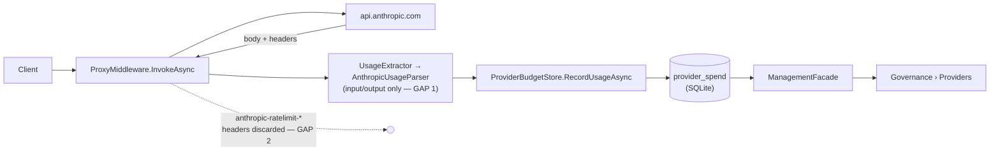

# Accurate Provider Usage & Budget Tracking — Anthropic (non-enterprise) first

> **Status: revised plan, not yet implemented.** Supersedes the earlier "Anthropic Reported Usage
> card" draft (which only added a `last_usage_at` timestamp and a relabeled GUI section) and revises
> [`../gui/backlog.md`](../gui/backlog.md) item #3's blocked enterprise-only approach. Other
> providers (OpenAI `x-ratelimit-*`, Gemini, …) follow as a future feature; the storage and seams
> below are deliberately provider-agnostic so that extension is additive.

## 1. Goal

Programmatically track **accurate** usage and budget data for a non-enterprise Anthropic provider,
using only **workable, non-invasive** data sources — nothing that requires third-party tools,
undocumented endpoints, or credentials the operator doesn't already have. The proxy already sits on
the wire; everything in this plan is derived from traffic it already carries plus price feeds it
already ingests.

## 2. What research established (why the plan changed)

### 2.1 Verified Anthropic data sources for a non-enterprise account

| Source | Auth needed | Verdict |
|---|---|---|
| `usage` object on every Messages API response (`input_tokens`, `output_tokens`, `cache_creation_input_tokens`, `cache_read_input_tokens`) | The provider's own key — already intercepted | ✅ **Use.** Already parsed, but cache fields are currently dropped (see §2.2). |
| `anthropic-ratelimit-*` **response headers** on every Messages API response: `-requests-`, `-input-tokens-`, `-output-tokens-`, `-tokens-` × `limit`/`remaining`/`reset` (RFC 3339) | Standard API key — already intercepted | ✅ **Use.** Authoritative, server-reported numbers the proxy currently discards. |
| `anthropic-ratelimit-unified-*` headers (`-status`, `-reset`, `-5h-status`, `-5h-remaining`, `-5h-reset`, `-representative-claim`, weekly variants) | Claude Pro/Max subscription OAuth token — already intercepted when such traffic is proxied | ✅ **Use.** The 5-hour/weekly window data the earlier draft believed was UI-only actually rides response headers. |
| [Usage & Cost Admin API](https://platform.claude.com/docs/en/manage-claude/usage-cost-api) | Org **Admin API key** | ❌ Rejected — same blocker as backlog #3; unavailable to individual accounts. |
| [Rate Limits API](https://platform.claude.com/docs/en/build-with-claude/rate-limits-api) (`/v1/organizations/rate_limits`) | Org **Admin API key** | ❌ Rejected — admin-gated; and it returns configured limits only, not usage. |
| Undocumented `api.anthropic.com/api/oauth/usage` polling | Subscription OAuth | ❌ Rejected — unofficial, and community reports it now answers "OAuth authentication is currently not supported". Fragile by construction. |
| Scanning local tool transcripts (`~/.claude/projects/*.jsonl` etc.) | Filesystem | ❌ Rejected — invasive, tool-specific, and redundant: the proxy already sees the same traffic first-hand. |

**Key accuracy fact** (from Anthropic's [rate-limits doc](https://platform.claude.com/docs/en/api/rate-limits)):
`input_tokens` only counts tokens **after the last cache breakpoint**. True input is:

```text
total_input_tokens = input_tokens + cache_creation_input_tokens + cache_read_input_tokens
```

With a 200k-token cached document and a 50-token question, the current parser records `50` input
tokens. Both the token ledger and the cost estimate are therefore understated whenever a client uses
prompt caching — Claude Code traffic caches aggressively, so this is the common case, not an edge.

### 2.2 Current pipeline and its two gaps



- **Gap 1 — cache tokens:** `Telemetry/AnthropicUsageParser.cs` reads only
  `input_tokens`/`output_tokens`; `Telemetry/UsageInfo.cs` has no cache fields;
  `Telemetry/ModelPrice.cs.EstimateCost` prices only two dimensions — even though
  `PriceCatalog/Sources/LiteLlmPriceSourceClient.cs` already ingests
  `cache_read_input_token_cost` into `NormalizedPrice.CachedInputPrice`, which
  `PriceCatalogRepository.GetFreshPrice` then drops on the way to `ModelPrice`.
- **Gap 2 — server-reported data:** the upstream `HttpResponseMessage`'s
  `anthropic-ratelimit-*` headers are never read.

### 2.3 Influences from the reviewed projects

| Project | Technique adopted here |
|---|---|
| [tokscale](https://github.com/junhoyeo/tokscale), [claude-usage-tracker](https://github.com/658jjh/claude-usage-tracker) | Separate accounting of input / output / cache-read / cache-write tokens; LiteLLM as the pricing source (already this repo's active source). |
| [cccost](https://github.com/badlogic/cccost) | Intercept the wire, not the tool's transcript — the proxy position is the accurate one. Per-model "last request" data → our `last_usage_at`. |
| [TokenTracker](https://github.com/mm7894215/TokenTracker) | Time-bucketed history to bound growth (we bucket rate-limit history per minute); "no published price ⇒ show tokens, not a guessed $" (matches this repo's D7 rule). |
| [token-monitor](https://github.com/Javis603/token-monitor) | Read session/weekly window state from **rate-limit response headers** rather than polling; archive observed values locally so history survives upstream resets. |
| [anthropic-usage-receiver](https://github.com/honeycombio/anthropic-usage-receiver) | What the Admin-API path looks like when an Admin key exists — kept as the future enterprise path (backlog #3), not this plan. |

All are influence only — **no third-party runtime dependency is added.**

## 3. Decisions (confirmed with the operator)

1. **Design for both auth types.** Standard `x-api-key` providers surface the
   `anthropic-ratelimit-{requests,input-tokens,output-tokens,tokens}-*` family; subscription OAuth
   traffic surfaces the `anthropic-ratelimit-unified-*` family. Capture is generic over the
   `anthropic-ratelimit-` prefix, so whichever family (or both) appears is recorded without
   per-account configuration.
2. **Snapshot + history** for server-reported data: latest values per provider for the GUI card,
   plus a pruned, minute-bucketed history table for future trend charts.
3. **Full cache-aware cost**: parse and price cache tokens; extend the spend schema.
4. **Keep the GUI deliverable**: the Governance › Providers "Anthropic Usage" card section ships in
   Phase 3, backed by the new data layer, with the backend-stored "last updated" timestamp.

## 4. Phase 1 — Cache-aware usage accuracy (estimated side)

Each phase must end with a clean build (`TreatWarningsAsErrors`), a green test suite, ≥80% coverage,
and accurate XML docs on every touched member (per `AGENTS.md`).

### 4.1 Telemetry parsing

- **`src/TotallyHotArcRouter/Telemetry/UsageInfo.cs`** — extend the positional record with
  `int CacheCreationTokens = 0, int CacheReadTokens = 0` (defaults keep the OpenAI parser and every
  existing call site compiling unchanged). Add a computed `TotalInputTokens` property implementing
  the formula in §2.1, documented as the *only* place that definition lives.
- **`src/TotallyHotArcRouter/Telemetry/AnthropicUsageParser.cs`**
  - Non-streaming: also read `cache_creation_input_tokens` and `cache_read_input_tokens` from the
    top-level `usage` object (absent ⇒ 0, never a failure — older responses simply lack them).
  - Streaming: read both cache fields from `message_start`'s `message.usage`; when the final
    `message_delta`'s `usage` also carries them (newer API versions send cumulative full usage
    there), prefer the `message_delta` values — they are final, `message_start`'s are initial.
- **OpenAI parity note (future feature, not this plan):** OpenAI reports
  `usage.prompt_tokens_details.cached_tokens`; the `UsageInfo` shape above already has a home for it
  when that provider is done.

### 4.2 Pricing

- **`src/TotallyHotArcRouter/PriceCatalog/Sources/LiteLlmPriceSourceClient.cs`** — additionally
  ingest `cache_creation_input_token_cost` (LiteLLM publishes it; e.g. Anthropic's 5-minute cache
  write is 1.25× input). New `NormalizedPrice.CacheWriteInputPrice` field
  (`Sources/IPriceSourceClient.cs`), `null` where unpublished — absent is not zero (D7).
  `OpenRouterPriceSourceClient` maps nothing new (OpenRouter publishes `input_cache_write` — wire it
  if trivially available, else leave `null`).
- **`src/TotallyHotArcRouter/PriceCatalog/PriceCatalogDatabase.cs` / `PriceCatalogRepository.cs`** —
  persist the new column (additive `Migrate*` following the `MigrateEnabledColumn` pattern);
  `GetFreshPrice` stops dropping the cache rates: `ModelPrice` gains
  `decimal? CacheReadPerMillionTokens` and `decimal? CacheWritePerMillionTokens`.
- **`src/TotallyHotArcRouter/Telemetry/ModelPrice.cs`** — `EstimateCost` gains a cache-aware
  overload taking a `UsageInfo`. Pricing rule, in order:
  1. Cache tokens priced at their catalog rate when present.
  2. When a cache rate is `null`, fall back to the **standard input rate** for those tokens — a
     deliberate, documented *conservative overestimate* (cache reads really cost ~10% of input).
     Overestimating keeps budget enforcement safe; hardcoding Anthropic's multipliers would recreate
     the hand-maintained price table this repo explicitly refuses (`ModelPrice` remarks).

### 4.3 Spend ledger

- **`PriceCatalogDatabase.SchemaSql`** — `provider_spend` gains
  `cache_creation_tokens INTEGER NOT NULL DEFAULT 0`, `cache_read_tokens INTEGER NOT NULL DEFAULT 0`,
  and `last_usage_at TEXT NULL` (carried over from the earlier draft), each via its own additive
  migration. Existing rows read as 0 / `NULL` ("no usage recorded yet").
- **`PriceCatalogRepository.cs`** — `ProviderSpendRow` and `AddProviderSpend` carry the two cache
  columns (accumulated via SQL `+`, like the existing token columns) and `last_usage_at`
  (the caller passes the UTC instant, matching how other timestamped writes take time as a
  parameter). **`prompt_tokens` keeps storing the raw `input_tokens` value** — raw components are
  stored, totals are derived at read time, so provenance is never destroyed.
- **`ProviderBudgetStore.cs` / `IBudgetEnforcer.cs`** — `RecordUsageAsync` accepts the extended
  usage (cache counts + timestamp); `ProviderBudgetState` gains `CacheTokensUsed` and
  `DateTimeOffset? LastUsageAtUtc`; the in-memory fast-path update in `RecordUsageAsync` sets both
  so the next read matches what was just persisted. **Token-cap semantics:** `TokensUsed` (the value
  compared against `TokenCap`) becomes prompt + completion + cache-creation + cache-read — all real
  tokens processed — documented in the XML docs as a deliberate widening.
- **`ProxyMiddleware.cs`** — the existing `RecordUsageAsync` call sites pass the extended usage;
  cost comes from the new cache-aware `EstimateCost`.

### 4.4 Phase 1 tests

- `AnthropicUsageParserTests`: cache fields present/absent, streaming `message_start` vs final
  `message_delta` precedence, older responses without cache fields.
- `ModelPriceTests`: cache-aware cost with full rates, with missing cache rates (fallback to input
  rate), and the existing two-dimension overload unchanged.
- `LiteLlmPriceSourceClientTests` fixture: `cache_creation_input_token_cost` round-trip.
- `PriceCatalogRepositoryTests`: new columns round-trip; repeated `AddProviderSpend` accumulates
  cache tokens and advances `last_usage_at`.
- `ProviderBudgetStoreTests`: cap breach counts cache tokens; `LastUsageAtUtc` on fast path and
  after `Reload()`.

## 5. Phase 2 — Server-reported rate-limit capture (reported side)

### 5.1 Capture seam

New `Telemetry/IRateLimitHeaderCapture` (mirroring `IUsageExtractor`'s provider-dispatch design):
given the provider key and the upstream response's headers, persist every header whose name starts
with `anthropic-ratelimit-` (case-insensitive), verbatim. Prefix capture — not a hardcoded name
list — is what makes "design for both auth types" free: standard, unified, and any future variant
(e.g. priority-tier or weekly headers) are all recorded without a code change, and the same seam
later dispatches OpenAI's `x-ratelimit-*` per provider type.

Wired into `ProxyMiddleware` as an optional constructor dependency defaulting to a no-op (the
`budgetStore` pattern — existing callers/tests unaffected). Invoked as soon as the upstream
`HttpResponseMessage` arrives (headers precede the body, so this works identically for streaming and
buffered paths), best-effort and never able to fail a request that succeeded upstream — same
contract as `RecordUsageAsync`.

### 5.2 Storage (same SQLite database, additive)

```sql
CREATE TABLE IF NOT EXISTS provider_rate_limit_snapshot (
    provider_key TEXT NOT NULL,
    header_name  TEXT NOT NULL,   -- lowercase, e.g. 'anthropic-ratelimit-input-tokens-remaining'
    header_value TEXT NOT NULL,   -- verbatim; parsing happens at read time
    observed_at  TEXT NOT NULL,   -- round-trip UTC, TimestampFormat
    PRIMARY KEY (provider_key, header_name)
);

CREATE TABLE IF NOT EXISTS provider_rate_limit_history (
    id           INTEGER PRIMARY KEY AUTOINCREMENT,
    provider_key TEXT NOT NULL,
    minute_bucket TEXT NOT NULL,  -- 'yyyy-MM-ddTHH:mm' UTC
    header_name  TEXT NOT NULL,
    header_value TEXT NOT NULL
);
```

- Snapshot: upsert on every captured response — the GUI's "as of" view.
- History: at most one row-set per provider per **minute bucket** (TokenTracker's bounded-growth
  lesson); rows older than 30 days pruned opportunistically on write. Raw values are stored because
  Anthropic rounds `remaining` to the nearest thousand and unified values are opaque strings —
  interpretation belongs at read time, storage stays lossless.
- New tables need no `Migrate*` method (`CREATE TABLE IF NOT EXISTS` in `SchemaSql` suffices).

### 5.3 Typed read model & exposure

- `PriceCatalogRepository` (or a sibling repository if it reads cleaner): return raw snapshot rows.
- A pure, unit-testable `RateLimitSnapshotParser` projects rows into a typed view:
  - Standard family → per dimension (`requests`, `input-tokens`, `output-tokens`, `tokens`):
    `Limit` (long?), `Remaining` (long?), `ResetAt` (RFC 3339 → `DateTimeOffset?`).
  - Unified family → `Status`, `ResetAt`, per-window (`5h`, weekly) `Status`/`Remaining`/`ResetAt`,
    `RepresentativeClaim`. Unparseable values surface as raw strings, never dropped.
- **`Proxy/Management/ManagementFacade.cs`** — `ProviderView` gains
  `DateTimeOffset? UsageLastRecordedAtUtc` (Phase 1's timestamp) and an optional
  `ProviderRateLimitView` (the typed snapshot + `ObservedAtUtc`); `BuildProvidersResponse` populates
  both. Mirrored onto **`Gui.Admin/ProviderAdminModels.cs`**'s `ProviderAdminView` — rides the
  existing `GET /admin/providers` payload; no new route, no `ProviderAdminClient` changes.

### 5.4 Phase 2 tests

- Header capture: prefix filtering (captures standard + unified + unknown variants; ignores
  unrelated headers), no-op default, failure isolation (a storage exception never fails the request).
- Snapshot upsert semantics; history minute-bucket dedupe and 30-day pruning.
- `RateLimitSnapshotParser`: standard family, unified family, mixed, malformed values.
- `ManagementFacadeTests`: both new fields flow through `ListProviders()`.

## 6. Phase 3 — GUI: "Anthropic Usage" card section

**`src/TotallyHotArcRouter.Gui/Components/ProvidersAdmin.razor`** — new read-only card section after
the "Monthly Budget" block, gated on `ProviderType == Anthropic` (no `IsEnterprise` flag — render
for every Anthropic provider). Two clearly-labeled sub-blocks, because estimated and reported data
have different provenance and the GUI must stay honest about which is which:

1. **"Estimated from intercepted traffic"** — the existing `DollarSpent`/`TokensUsed` bars
   (`BudgetBarJson` + `EChart`, same `UtilizationPercent`/`Money2` helpers), now cache-accurate via
   Phase 1; raw numbers still shown when no caps are set. Footer: "Last recorded
   {UsageLastRecordedAtUtc:yyyy-MM-dd HH:mm 'UTC'}" or "No usage recorded yet" when `null`.
2. **"Reported by Anthropic"** — from `ProviderRateLimitView`: for the standard family, one compact
   row per dimension ("Input tokens: {remaining:N0} of {limit:N0} remaining · resets {resetAt}");
   for the unified family, the window status lines ("5-hour window: {status} · resets {resetAt}").
   Footer: "As of {ObservedAtUtc}" — server-reported numbers are trustworthy only as of that
   instant. Hidden entirely (with a one-line "No rate-limit data observed yet") until the first
   captured response.

This is a card section, not a new window — the `SettingsModal` window-shell contract does not apply.
No inputs, no save button. History-backed trend charts are deliberately deferred; the history table
exists so adding them later is a pure GUI change.

**Phase 3 tests** (`Gui.Tests/ProvidersAdminLoadedTests.cs` et al.): section renders for
Anthropic-typed providers only; "No usage recorded yet" and "No rate-limit data observed yet" empty
states; both timestamps rendered from backend values, never the GUI clock.
**`Gui.Admin.Tests/ProviderAdminModelsTests.cs`**: JSON round-trip of the new view fields.

## 7. Multi-provider future (out of scope, kept cheap)

- `provider_rate_limit_*` tables are keyed by provider and store verbatim header names — OpenAI's
  `x-ratelimit-limit-requests`/`-remaining-tokens` etc. land in the same tables with a second
  capture prefix and a second parser branch.
- `UsageInfo`'s cache fields already fit OpenAI's `cached_tokens` and Gemini's
  `cachedContentTokenCount`.
- The enterprise Admin-API path (backlog #3) remains a separate, additive feature for orgs that
  source an Admin key; nothing here conflicts with it.

## 8. Verification (every phase)

1. `dotnet build` — zero warnings/errors (repo-wide `TreatWarningsAsErrors`; new public members need
   accurate XML docs — `GenerateDocumentationFile` is on for every touched project).
2. `dotnet test` — full suite green; ≥80% coverage; no unit test over 5 seconds.
3. Manual end-to-end: run proxy + GUI, send a cache-using completion through an Anthropic provider,
   confirm (a) cache tokens appear in the ledger, (b) the card's reported block shows fresh header
   values, (c) both timestamps advance.
4. Update the docs this plan touches: `../gui/backlog.md` item #3 (point at this plan for the
   non-enterprise path), `model-price-catalog.md` (cache-write price field), `telemetry.md`
   (usage-field provenance table).

## 9. Sources

- [Anthropic rate limits & response headers](https://platform.claude.com/docs/en/api/rate-limits)
- [Anthropic Rate Limits API (Admin-key-gated)](https://platform.claude.com/docs/en/build-with-claude/rate-limits-api)
- [Usage & Cost Admin API](https://platform.claude.com/docs/en/manage-claude/usage-cost-api)
- Unified-header behavior: [claude-code#55333](https://github.com/anthropics/claude-code/issues/55333),
  [claude-code#12829](https://github.com/anthropics/claude-code/issues/12829),
  [openclaw#56047](https://github.com/openclaw/openclaw/issues/56047)
- Reviewed projects: [tokscale](https://github.com/junhoyeo/tokscale) ·
  [cccost](https://github.com/badlogic/cccost) ·
  [claude-usage-tracker](https://github.com/658jjh/claude-usage-tracker) ·
  [TokenTracker](https://github.com/mm7894215/TokenTracker) ·
  [token-monitor](https://github.com/Javis603/token-monitor) ·
  [anthropic-usage-receiver](https://github.com/honeycombio/anthropic-usage-receiver) ·
  [ai-cost-tracking topic](https://github.com/topics/ai-cost-tracking?o=asc&s=updated)
