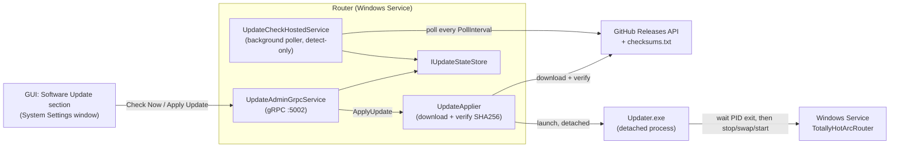

# Auto-Update Plan

Status: **Phases 0-2 shipped.** Phase 0 (versioning source of truth) and Phase 1 (Windows Service
hosting) shipped on an earlier commit (`8d46a7e`) with no design doc of their own — this doc closes that
gap retroactively, in addition to specifying and shipping Phase 2 (the Router's self-update pipeline).
GUI self-update and CI release-publishing automation are unscheduled; see "Deferred/future phases" below.

## Why

TotallyHot ArcRouter is a personal-scale, self-hosted router with no package-manager distribution
channel. An operator who wants a new release today has to notice it exists (via GitHub, manually), stop
the running service, download the zip by hand, and swap files — friction that discourages actually
staying current. This plan gives the Router a way to detect and apply its own updates without the
operator ever running a manual download-and-swap.

## Phase 0 — versioning source of truth (shipped)

`src/Directory.Build.props` sets:

```xml
<Version>1.0.0</Version>
<InformationalVersion>$(Version)</InformationalVersion>
<UpdateGitHubOwner>davidpizon</UpdateGitHubOwner>
<UpdateGitHubRepo>TotallyHot-ArcRouter</UpdateGitHubRepo>
```

`TotallyHotArcRouter.csproj` and `TotallyHotArcRouter.Gui.csproj` each compile
`UpdateGitHubOwner`/`UpdateGitHubRepo` into an `AssemblyMetadataAttribute` pair via an `ItemGroup`, so
both running apps read the owner/repo they check against from `Assembly.GetCustomAttributes<AssemblyMetadataAttribute>()`
instead of a second, independently-maintained value. `InformationalVersion` similarly flows automatically
into `AssemblyInformationalVersionAttribute` (the SDK's default `GenerateAssemblyInfo` behavior), which
`GitHubReleaseCheckClient` (Phase 2, below) reads as the running version.

GitHub Release tags are `v<Version>` (e.g. `v1.0.0`) — bump `Version` in `Directory.Build.props` for
every combined release; the tag is derived, never hand-typed elsewhere.

## Phase 1 — Windows Service hosting (shipped)

`src/TotallyHotArcRouter/Program.cs`'s `CreateHostBuilder` calls
`.UseWindowsService(options => options.ServiceName = "TotallyHotArcRouter")`. This is a no-op outside the
Windows Service Control Manager, so `dotnet run`, `dotnet test`, and every existing `CreateHostBuilder`
test are unaffected.

`scripts/service/Install-RouterService.ps1` and `Uninstall-RouterService.ps1` register/remove the
Windows Service by hand, from a self-contained `win-x64` publish. `TotallyHotArcRouter.csproj` has a
`Service` publish profile that gates `RuntimeIdentifier=win-x64`/`SelfContained=true` behind
`Condition="'$(PublishProfile)' == 'Service'"`, so an ordinary `dotnet build`/CI restore is never forced
onto a win-x64-only graph.

**Canonical install layout**, which Phase 2's `Updater.exe` depends on being able to resolve without any
configuration:

```
%ProgramFiles%\TotallyHotArcRouter\
  Router\    <- TotallyHotArcRouter.exe (this Windows Service)
  Gui\       <- TotallyHotArcRouter.Gui.exe (the MAUI tray app)
  Updater\   <- TotallyHotArcRouter.Updater.exe (Phase 2)
```

## Phase 2 — Router self-update (shipped)

**Scope, stated explicitly (a deliberate, documented narrowing — see AGENTS.md's deviation rule):**
Phase 2 covers **the Router's own self-update only** — check → notify → apply → `Updater.exe` swaps
`...\Router\` → the Windows Service restarts. The GUI's own self-update (swapping `...\Gui\`) is
explicitly **out of scope** for this phase; see "Deferred/future phases" below. In this phase the GUI is
only a *client* that displays the Router's update status and triggers the Router's apply — it never
updates itself.

### Design decisions (settled before implementation; not re-litigated here)

1. **Mechanism.** A separate `Updater.exe` helper console process performs the actual file swap — a
   running process cannot overwrite its own files. The Router downloads and checksum-verifies the
   release asset, then hands off to `Updater.exe` to stop the service, swap the install directory, and
   restart it.
2. **Trigger.** Automatic background polling in the Router (always-on, under the Windows Service) plus a
   manual "Check Now" button in the GUI.
3. **Package + trust.** A GitHub Release zip asset plus a SHA256 checksum, verified before anything is
   touched. See "Checksum-publishing convention" below for exactly how the checksum is published.
4. **Apply policy.** The background poller only *detects* and surfaces "update available" state — it
   never applies unattended. Applying always requires an explicit operator click in the GUI, behind a
   confirmation dialog (applying restarts the Router service).
5. **Poller location.** The poller lives in the Router (`UpdateCheckHostedService`, a `BackgroundService`
   under the Windows Service), not the GUI — matches Phase 1's Windows-Service-first posture and means
   update detection keeps working even when no GUI is open. It pushes state into an in-memory
   `IUpdateStateStore`, read by the GUI over a new `UpdateAdminService` gRPC surface on the existing TLS
   loopback endpoint (port 5002), the same shape as every other admin panel
   (`LlmRouterModelAdminService`, `RouterSettingsAdminService`, etc.).

### Components

- **`GitHubReleaseCheckClient : IReleaseCheckClient`** (`src/TotallyHotArcRouter/Update/`) — calls
  `GET {GitHubApiBaseUrl}/repos/{owner}/{repo}/releases/latest` (owner/repo from the Phase 0 assembly
  metadata; `GitHubApiBaseUrl` overridable via `UpdateOptions` for tests), parses `tag_name` (stripping a
  leading `v`), compares against the running `AssemblyInformationalVersionAttribute` (with the SDK's
  `+<git-sha>` build-metadata suffix stripped — `System.Version` cannot parse it) using `System.Version`
  ordering, and returns a `ReleaseCheckResult` carrying current version, latest version, availability, the
  asset download URL, and its published SHA256. Every failure mode (no releases yet, a malformed tag, a
  missing asset/checksum, a network failure) is a typed `ReleaseCheckUnavailableReason` on the result —
  never an exception, so the poller never needs a defensive `try`/`catch` around this call.

  **Checksum-publishing convention** (the one design choice this plan had to pick, since GitHub Releases
  publishes no checksums itself): a release must publish, alongside the Router zip, one asset named
  exactly `checksums.txt` containing one `<sha256 hex>  <filename>` line per released asset — the
  conventional `sha256sum` output format. The Router zip asset itself is recognized by name: a
  case-insensitive `"router"` substring plus a `.zip` extension (e.g.
  `TotallyHotArcRouter-Router-win-x64.zip`). A release publishing either file incompletely is reported as
  `AssetOrChecksumMissing`, not silently ignored.

  This convention was chosen over a per-asset `.sha256` sidecar file because it needs exactly one extra
  release asset regardless of how many files a release ships (the sidecar approach needs one extra file
  *per* asset), and `sha256sum > checksums.txt` is a single, ordinary shell command a release workflow can
  run with no bespoke tooling.

- **`UpdateOptions`** (bound from the `Update` section) — `Enabled` (default `true`; detection only,
  never auto-apply), `PollInterval` (default 6 hours — frequent enough an operator sees a release within
  a work day, far inside GitHub's unauthenticated 60 req/hour/IP limit), `GitHubApiBaseUrl` (default the
  real API), `ServiceName` (default `"TotallyHotArcRouter"`, matching Phase 1's `UseWindowsService` call).

- **`UpdateCheckHostedService : BackgroundService`** — polls `IReleaseCheckClient` on
  `UpdateOptions.PollInterval`, records every outcome into `IUpdateStateStore` (in-memory —
  `UpdateStateStore` — ephemeral operational state, not data that needs to survive a restart), and logs
  the outcome via Serilog with a static message template. Runs an initial check ~15 seconds after
  startup, not only after the first full interval, mirroring `EmbeddingBackfillService`'s
  `PeriodicTimer` shape.

- **`UpdateAdminService`** gRPC contract (`src/Protos/telemetry.proto`, appended to the existing file
  rather than a new one — every other admin service already lives there) — `GetUpdateStatus` (unary,
  reads the state store), `CheckForUpdatesNow` (unary, forces an immediate re-check), `ApplyUpdate`
  (unary; downloads, verifies, and hands off — see below). Server: `UpdateAdminGrpcService`. Unlike the
  optional per-feature admin services (`LlmRouterModelAdminService`, `ClusterModelAdminService`, …),
  `UpdateAdminGrpcService` is mapped **unconditionally** by `ProxyServer` — matching
  `RoutingModeAdminGrpcService`'s precedent — because update status is core operational state, not an
  optional add-on; when no real dependencies are supplied, harmless `NullReleaseCheckClient`/
  `NullUpdateApplier` fallbacks back it instead of leaving the RPC unmapped.

- **`IUpdateApplier`/`UpdateApplier`** — `ApplyUpdate`'s implementation. Downloads the release asset to a
  temp file, verifies its SHA256 against the checksum `IReleaseCheckClient` already resolved, and — only
  if that succeeds — launches `Updater.exe` as a detached process (via the `IUpdaterProcessLauncher` seam,
  so a unit test never spawns a real process), passing the install directory, the verified zip path, the
  Windows Service name, and this process's own PID. Returns a "handoff succeeded" result immediately: it
  cannot observe anything past that point, because the updater's very next act is to stop the Windows
  Service this RPC is running inside of. A download or checksum failure returns a clear failure without
  touching anything or spawning the updater. `Updater.exe` is resolved as a sibling directory of this
  process's own install directory (`...\Updater\TotallyHotArcRouter.Updater.exe` beside
  `...\Router\`) — not a configurable path — so a broken deployment layout is caught before any download,
  not mid-swap.

- **`TotallyHotArcRouter.Updater`** (new project, `src/TotallyHotArcRouter.Updater/`) — a plain
  `net10.0` console app with **no project reference to `TotallyHotArcRouter`**, so it can run even while
  that app's own files are mid-replacement or momentarily corrupted. Its own tiny Serilog file-sink
  logger (`logs/updater-.log` beside the executable), bridged to `Microsoft.Extensions.Logging.ILogger<T>`
  via `Serilog.Extensions.Logging` so its classes read like every other project's. Argument parsing
  (`ArgumentParser.Parse`, `--install-dir`/`--zip-path`/`--service-name`/`--wait-pid`) and the swap
  sequence (`UpdaterService.RunAsync`) are both separately-testable statics/classes behind three seams
  (`IProcessWaiter`, `IServiceController`, `IUpdateFileSystem`) — no test in
  `TotallyHotArcRouter.Updater.Tests` spawns a real process, touches an installed Windows Service, or
  writes outside a temp directory.

  Sequence: wait for the caller PID to exit (bounded 2-minute timeout, fails loudly and touches nothing
  if it doesn't) → stop the named service (2-minute bound) → rename the install directory aside as a
  timestamped backup → extract the verified zip into a fresh install directory → start the service
  (2-minute bound) → verify it actually reaches Running → delete the backup on success. Any failure from
  the stop step onward rolls back to the backup and attempts to restart the service on the
  pre-swap install, so a failed update leaves a working Router rather than a broken one. Exit code 0 on
  success, 1 on any failure (mirrors `Program.cs`'s `Environment.ExitCode = 1` convention) — no other
  exit code is ever used.

- **GUI: "Software Update" section** in `SettingsModal.razor` (a section within the existing System
  Settings window, per that file's own established multi-section layout — not a new window/modal, so
  AGENTS.md's "new windows copy `SettingsModal.razor`'s shell" rule doesn't apply here). Shows the
  running version, the latest known version with an "update available" indicator, a "Check Now" button,
  and an "Apply Update" button that only appears once an update is known available and, on click, shows a
  restart-confirmation before calling `ApplyUpdate`. `UpdateAdminClient`/`IUpdateAdminClient`
  (`TotallyHotArcRouter.Gui.Telemetry`) mirror `LlmRouterModelAdminClient`'s two-constructor shape (a real
  one over `TelemetryChannelFactory`, and one over a caller-supplied generated client for tests) and its
  `IsUnavailable`-flagged exception convention. `UpdateStore` (`TotallyHotArcRouter.Gui/Services/`)
  mirrors `LlmRouterModelStore`'s singleton-plus-`Changed`-event shape.



### Rollback-on-failure behavior

Rollback is entirely `Updater.exe`'s responsibility, and entirely local to one swap attempt — there is no
cross-process/cross-attempt rollback log. The backup directory is a plain timestamped
sibling (`...\Router.backup-<UTC-yyyyMMddHHmmss>\`) created by renaming, not copying, the current install
directory, so the rollback is a rename back, not a re-download or a diff. The backup is deleted only after
the *new* service has been confirmed `Running` — a failure at any point between the stop and that
confirmation restores it. A failure that occurs before the stop (caller PID never exits) or during the
initial backup rename touches nothing new and simply attempts to restart the service on the still-present,
untouched install.

### Exit criteria (met)

- `dotnet build` on every touched/added project: zero warnings, zero errors.
- Every new public/protected member carries accurate XML docs.
- `GitHubReleaseCheckClient`, `UpdateCheckHostedService`, `UpdateAdminGrpcService`, and
  `TotallyHotArcRouter.Updater`'s argument parser and swap logic are unit-tested against fakes — no real
  network call, no real spawned process, no real installed Windows Service.
- `TotallyHotArcRouter` sits at ~87% line coverage (was ~85.8%; the Update namespace itself is ≥86% per
  class, `UpdateApplier` covered via an injected `IUpdaterProcessLauncher` fake plus a temp-directory
  sibling-executable fixture). `TotallyHotArcRouter.Updater` sits at ~97% with `Program`'s `Main` and
  `WindowsServiceController`'s direct `System.ServiceProcess.ServiceController` calls excluded from the
  coverage functions list in `coverage.runsettings` (mirroring that file's existing generated-code
  exclusion) — both are thin, unavoidably platform-boundary code that would require an actual installed
  Windows Service to exercise for real, which this plan's own testing requirement rules out.
  `TotallyHotArcRouter.Gui.Telemetry` sits at ~97%.
- All tests pass; none exceeds the repo's 5-second cap (the slowest new tests are `UpdateCheckHostedService`'s
  polling tests, bounded to a few hundred milliseconds via `InitialDelayOverride` and a shrunk `PollInterval`,
  never the real multi-hour default).
- Every log call added uses a static Serilog message-template string literal.

## Deferred/future phases (unscheduled, recorded so they aren't lost)

- **GUI self-update** (swapping `...\Gui\`). Explicitly out of scope for Phase 2 (see "Scope" above). The
  GUI in this phase only displays the Router's status and triggers the Router's apply. A future phase
  would need its own detached-swap story — likely reusing `Updater.exe` with a second install-directory
  target, but the GUI is a MAUI Blazor Hybrid tray app with its own process-exit/relaunch concerns
  `Updater.exe`'s current Windows-Service-restart design doesn't address.
- **Code-signing of release assets.** Trust today is HTTPS + GitHub + the SHA256 checksum published
  alongside the release on the same GitHub Release, not a detached cryptographic signature (e.g.
  `minisign`/`sigstore`). An attacker who could edit a GitHub Release's assets could edit both the zip and
  `checksums.txt` together. Unscheduled; would need a signing key and its own key-management story.
- **CI automation to publish the release zip + checksum on tag push.** This phase assumes the asset and
  `checksums.txt` already exist on the GitHub Release by the time `GitHubReleaseCheckClient` looks for
  them. Verified: `.github/workflows/` (`dotnet-ci.yml`, `nuget-dependency-submission.yml`) contains no
  release-publishing step, tag-triggered or otherwise — building a `Service`-profile publish, zipping it,
  hashing it, and creating a GitHub Release is entirely unscheduled, out of scope for this phase, and
  deliberately not built here (Phase 2 is the *consumption* side of the release pipeline, not the
  *production* side).

## Settled deferrals (do not re-open without new evidence)

- **The poller's initial-check delay (15s) and per-operation timeouts (2 minutes each, in `UpdaterService`)
  are hardcoded constants, not configuration.** They are implementation-detail pacing, not operator
  policy the way `PollInterval` is; making them configurable was judged to add surface area without a
  corresponding operator need. Revisit only if a real deployment demonstrates the fixed timeouts are
  wrong for its network/service-startup characteristics.
- **No cross-attempt rollback log / update history.** `Updater.exe` keeps at most one backup directory per
  attempt and deletes it on success; nothing records *that* an update happened or *when*, beyond the
  Router's own Serilog/Windows Event Log entries and the timestamped backup directory name while it
  exists. A structured update-history table was judged unnecessary scope for a personal-scale, single-node
  deployment.

---

## Final Validation Gate

Applies per [`../../AGENTS.md`](../../AGENTS.md):

1. `dotnet build` passes with zero warnings and zero errors on every touched project (`TreatWarningsAsErrors` repo-wide).
2. Every new public/protected type and member carries accurate XML documentation.
3. All unit tests pass; `TotallyHotArcRouter`, `TotallyHotArcRouter.Updater`, and
   `TotallyHotArcRouter.Gui.Telemetry` each hold ≥ 80% line coverage, as `.github/workflows/dotnet-ci.yml`
   measures it (the Updater test project was added to that workflow's `$PROJECTS` list).
4. No unusually heavy test exceeds 5 seconds.
5. Every routing/update decision this phase logs goes through Serilog with a **static** message template.
6. Documentation matches delivered behavior — this document itself, plus `src/PLAN.md`'s pointer table.
7. Deferred items are recorded above, with evidence, per AGENTS.md's deviation rule.
