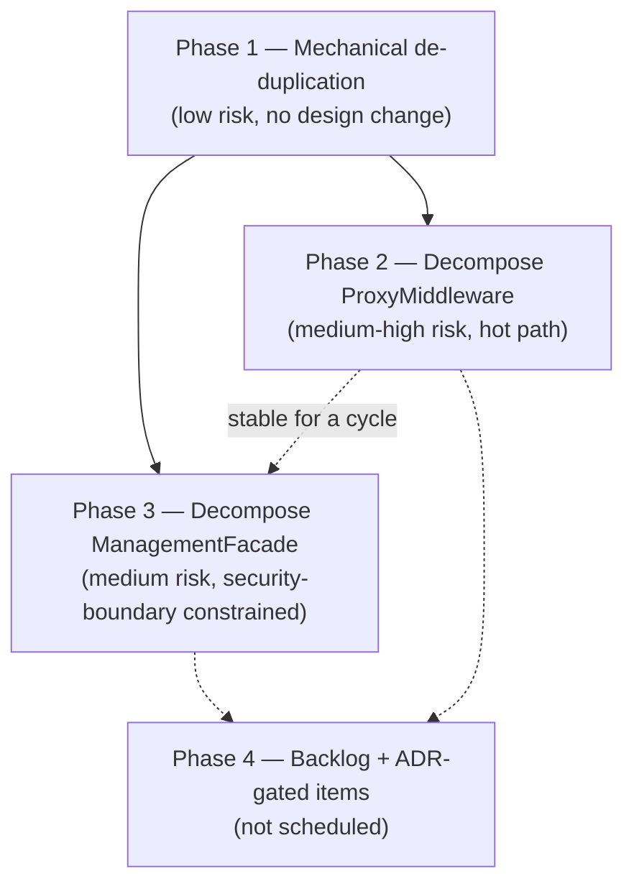
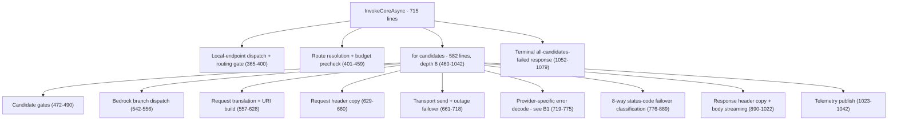
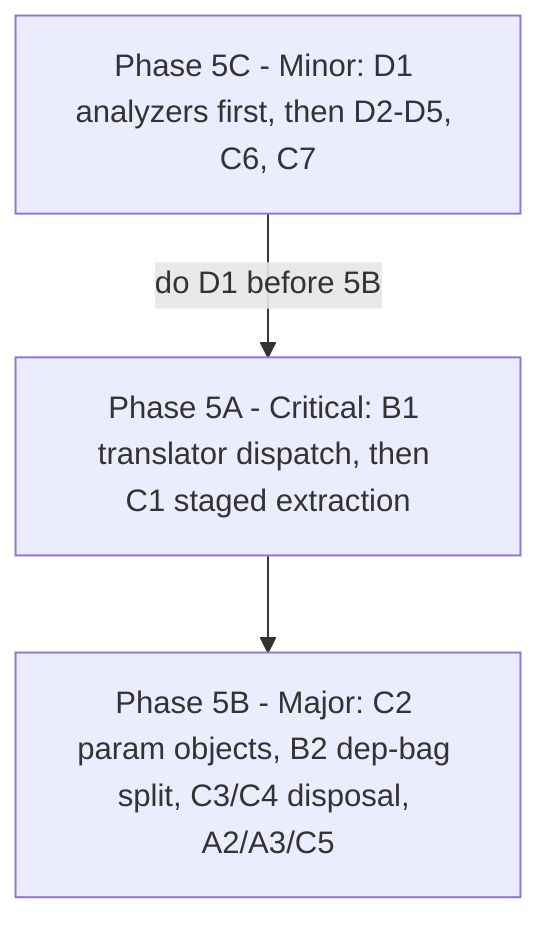

# Code-Smell Refactoring Plan

**Status:** Phase 1 implemented (see [PR #75](https://github.com/davidpizon/TotallyHot-ArcRouter/pull/75)).
Phase 2 (all 5 steps) and Phase 3 steps 1-2 are implemented. The Phase 4 Razor `.razor.cs` code-behind
split is also implemented (`ProvidersAdmin`, `SettingsModal`, `BenchmarkData`, `PriceSourcesAdmin`).

**Phase 5 is open.** A third, blind dual-engine audit (2026-09-02) found 9 new items, 2 of them
Critical — see [Deep code-smell audit](#deep-code-smell-audit--2026-09-02-dual-engine-blind-pass) and
its [prioritized roadmap](#prioritized-roadmap-phase-5). **B1 (the translator dispatch collapse) is
implemented**; its manual golden-path smoke is still outstanding. Most notably the audit found that Phase 2 measured
`ProxyMiddleware`'s **class** size and stopped there: `InvokeCoreAsync` is still a single 715-line
method. The paragraph below, written before that audit, should be read as "everything *this plan and
the brutal-cozy-pascal audit* raised is closed" — not as "the codebase is clean."

A second, independent audit (session "Codebase architectural audit," `~/.claude/plans/act-as-a-brutal-cozy-pascal.md`)
re-surveyed the codebase blind to this document, confirmed both of this plan's still-open items below,
and found 10 additional items this plan missed. Per that audit's own recommendation, its findings are
folded into this document rather than tracked separately. All of its Critical and Moderate items are
now implemented except the two ADR-gated ones and the Gemini cost reconciler:

- **Implemented** (commits on `refactoring`): `PersistedSessionsClient` extended `GrpcAdminClientBase<,>`
  (fixing a regression of the exact smell Phase 1 fixed once already); the four duplicated translator
  helper methods across `AnthropicPayloadTranslator`/`GeminiPayloadTranslator`/Bedrock's translators were
  deduplicated into `PayloadTranslationHelpers`; `ProxyMiddleware.InvokeCoreAsync`'s six per-candidate
  failover gates are now an explicit ordered `CandidateGates` sequence (Phase 2 step 4, previously
  deferred); `ManagementFacade`'s 23 colocated DTO/enum/record types moved to `ManagementFacadeModels.cs`;
  `RequestTelemetryPublisher.PublishAsync` decomposed into 6 named private methods with a new
  characterization-test suite (it previously had none); a `SnapshotCache<T>` now backs
  `ProviderBudgetStore`/`PriceSourceToggleStore`/`ToolCallCapabilityStore`'s lock-and-volatile-swap
  concurrency idiom; `PriceCatalogRepository` split into 6 per-concern repositories (Phase 4's backlog
  item, re-litigated and promoted — see the audit's M3); `RequestInterceptor` split via
  `RequestBodyIntrospection` and `RoutingCandidateBuilder` (Phase 4's other backlog item, likewise
  promoted — see the audit's M4); a shared `DialogShell` component now backs all four Governance dialogs;
  `TrayWindowManager`'s single-UI-thread invariant is documented; a `ProviderRegistration` dispatch table
  now drives `UsageExtractor`/`ResponseTextExtractor` and fixed a real gap (Ollama's response text was
  silently unhandled); several small Quality-assembly and GUI cleanups (deduplicated scoring/word-boundary
  helpers, stale doc-comment fixes, `DashboardData`'s mock fixtures moved to a JSON resource).
- **ADR-approved and implemented:**
  [ADR-0006](../adr/0006-split-managementfacade-along-crud-aggregate-boundaries.md) (accepted) decided
  `ManagementFacade`'s remaining write/security-boundary surface splits into internal collaborators
  along CRUD-aggregate lines (Phase 3 step 3, now complete) — `ManagementFacade.cs` shrank from 1562 to
  ~450 lines, delegating to `ProviderManagementService`, `BudgetAndPriceOverrideService`, and
  `SecretManagementService`, each reachable only through the facade's own public methods. Zero
  public-surface or call-site changes.
  [ADR-0007](../adr/0007-provider-admin-client-stays-on-http.md) (accepted) decides `ProviderAdminClient`
  stays on HTTP rather than migrating to gRPC (the Phase 4 transport item, below) — no migration code is
  planned, closing that item with documentation only.
- **Tracked as an open TODO, not implemented:** a real `IProviderCostReconciler` for Gemini needs new
  external integration surface (GCP Cloud Billing/BigQuery export, a service-account credential) that a
  mechanical refactor pass shouldn't decide the shape of alone — see
  [`tracked-todos.md` #6](tracked-todos.md#6-build-a-real-iprovidercostreconciler-for-gemini). Bedrock and
  Ollama reconcilers were assessed and ruled out permanently (not deferred) — AWS Cost Explorer reports
  account-wide rather than per-model, and Ollama has no billing API at all, being local/free.
  `ProviderRegistration.CostReconciler` is already wired to accept an implementation once one exists.
- **Adopted as a going-forward norm, not swept:** GUI singleton stores (13 of 14) still have no
  interface — extract one when a store is next touched for an unrelated reason, not as a dedicated pass.
- **C1's manual smoke test** (AGENTS.md's "test the golden path… before reporting complete" rule for
  hot-path changes) — streaming, buffered, Bedrock, and local-endpoint (`/v1/models`, `/api/tags`,
  `/api/show`) request paths through the running proxy, after the `CandidateGates` change — complete.

Phase 3 step 3 (further `ManagementFacade` splitting) is complete, implementing ADR-0006's accepted
decision; the HTTP-vs-gRPC transport inconsistency is resolved by ADR-0007 (documented, not migrated).
Every item from both this plan and the brutal-cozy-pascal audit is now either shipped, closed by an
accepted ADR, or tracked as an explicit open TODO — see [`tracked-todos.md` #6](tracked-todos.md#6-build-a-real-iprovidercostreconciler-for-gemini)
for the one remaining piece of work (the Gemini cost reconciler). This document is the output of a
structural survey (CodeGraph + Serena + targeted reads), not an exhaustive line-by-line audit.

**Scope surveyed:** `TotallyHotArcRouter` (router core), `TotallyHot.ArcRouter.Quality`, and all four
GUI assemblies (`TotallyHotArcRouter.Gui`, `.Gui.Admin`, `.Gui.Charts`, `.Gui.Console`,
`.Gui.Telemetry`). `TotallyHotArcRouter.Installer` and all `*.Tests` projects were **not** reviewed.

**Method:** file-size survey to find outliers, CodeGraph structural queries for call paths and blast
radius, an Explore subagent for a method-by-method breakdown of the two largest files, and targeted
`grep`/`Read` passes to confirm or reject each hypothesis before it's listed below (a couple of
suspected duplications turned out, on inspection, to be legitimately different code — those are noted
in [What was checked and rejected](#what-was-checked-and-rejected)).

## Summary

| # | Smell | Location | Size | Phase | Risk |
|---|---|---|---|---|---|
| 1 | Duplicated gRPC exception/constructor/dispose boilerplate | 9 classes in `Gui.Telemetry/*AdminClient.cs` | ~9× ~30 lines | 1 | Low |
| 2 | Duplicated error-envelope boilerplate | `ProxyMiddleware.cs`, 4 `Write*ResponseAsync` methods | 4× ~15 lines | 1 | Low |
| 3 | Triplicated capture-buffer accounting | `ProxyMiddleware.cs`, 3 translate/copy methods | 3× ~20 lines | 1 | Low-Medium |
| 4 | One 700-line method, ~120 DI registrations | `Hosting/ServiceCollectionExtensions.cs` | 800 lines | 1 | Low |
| 5 | God class: 8+ mixed responsibilities, 30-param ctor | `Proxy/ProxyMiddleware.cs` | 2751 lines | 2 | Medium-High |
| 6 | God facade: ~7 sub-APIs, ~14 effective dependencies | `Proxy/Management/ManagementFacade.cs` | 2090 lines | 3 | Medium |
| 7 | Multi-aggregate repository (6 concerns, 1 class) | `PriceCatalog/PriceCatalogRepository.cs` | 1123 lines | 4 (backlog) | Medium-High if touched |
| 8 | Mixed responsibilities, 13-param ctor, 295-line method | `Proxy/RequestInterceptor.cs` | 945 lines | 4 (backlog) | Medium |
| 9 | Inconsistent client transport (HTTP vs. gRPC) | `Gui.Admin/ProviderAdminClient.cs` vs. `Gui.Telemetry/*AdminClient.cs` | — | 4 (ADR) | N/A (observation) |
| 10 | Oversized Razor components with large inline `@code` | `Gui/Components/ProvidersAdmin.razor` + 3 others | 500-987 lines | 4 (optional) | Low-Medium |



## What was checked and rejected

To keep this plan honest, these were investigated as candidate smells and specifically **ruled out**:

- **Per-provider payload translators** (`AnthropicPayloadTranslator`, `GeminiPayloadTranslator`,
  `TitanPayloadTranslator`, …) share method *names* (`AppendUserContent`, `AppendMergedContent`, …) but
  not bodies — each targets a genuinely different wire shape (Anthropic content blocks vs. Gemini
  parts vs. Bedrock Titan). Not duplication.
- **`ManagementFacade.ParseBudgetWindow` vs. `BudgetWindowCodec.Decode`** looked like duplicated
  window-parsing logic at first grep. On reading both bodies they solve different problems:
  `ParseBudgetWindow` validates untrusted request strings and throws `ArgumentException` on bad input;
  `BudgetWindowCodec.Decode` degrades already-persisted, trusted data gracefully. Correctly separate.
- **`ManagementFacade`'s `catch (Exception) → Fail(ManagementErrorType.Internal, …)` pattern** repeats,
  but only **5** times, not across the whole class — noted as a minor cleanup folded into Phase 3, not
  a standalone phase.
- **Project reference graph** (router core → `Quality`; `Gui` → `Gui.Admin`/`.Charts`/`.Console`/
  `.Telemetry`, each a leaf) is clean and acyclic — no coupling smell there.
- **Orchestrator voters** (`DimBestVoter`, `LogRegVoter`, `ClusterBestVoter`, `MemoryKnnVoter`,
  `LlmRouterVoter`) and **Quality's static analyzers** (`ComplexityAnalyzer`, `TruncationAnalyzer`, …)
  are textbook `IRoutingVoter`/`IStaticAnalyzer` polymorphism — appropriately factored, reasonably
  sized files, nothing to flag.
- Broad `catch (Exception)` swallows and `TODO`/`FIXME`/`HACK` markers are rare across the whole
  surveyed scope (a handful of hits, mostly legitimate). This is not a codebase with hygiene rot; the
  smells found here are architectural (size/cohesion/coupling), not sloppiness.

---

## Phase 1 — Mechanical de-duplication (no design change)

Each item here is a pure extract-and-reuse: same observable behavior, same public surface, existing
tests should pass unmodified and are the regression net.

### 1. Duplicated gRPC admin-client boilerplate (9×)

**Location:** `src/TotallyHotArcRouter.Gui.Telemetry/{PriceSource,ClusterModel,LlmRouterModel,
RouterSettings,LogRegModel,BenchmarkData,UpdateAdmin,RoutingGate,RoutingMode}AdminClient.cs`

Every one of these 9 classes independently declares: a same-shaped `XxxAdminException` (message,
inner exception, `IsUnavailable` flag, identical XML doc), the same two-constructor pattern
(owned-channel vs. injected-client-for-tests), the same `private static XxxAdminException Wrap(RpcException
ex, string action)` that special-cases `StatusCode.Unavailable` into a friendlier message, and the same
`Dispose()`. Confirmed by grep: all 9 files match `Wrap(RpcException ex, string action)` and
`StatusCode.Unavailable` with the identical shape.

**Fix:** Extract a shared `GrpcAdminExceptionMapper` (or a `GrpcAdminClientBase<TException>` if a base
class fits the existing interface-per-client design better) that owns the "unavailable → friendly
message, else → server detail" mapping, and a shared `AdminException` base carrying `IsUnavailable`
that each `XxxAdminException` derives from instead of reimplementing. Each concrete client keeps its
own RPC calls and DTO mapping — only the exception/dispose/constructor scaffolding moves.

**Risk: Low.** Every client already has dedicated unit tests (`ClusterModelAdminTests.cs`,
`PriceSourcesAdminTests.cs`, `RouterModelAdminTests.cs`, `RoutingModeAdminTests.cs`, etc.) that exercise
the wrapped-exception behavior via the constructor-injected fake-client seam, so a behavior regression
in the shared mapper would fail loudly and locally.

### 2. Duplicated error-envelope boilerplate in `ProxyMiddleware`

**Location:** `src/TotallyHotArcRouter/Proxy/ProxyMiddleware.cs` —
`WriteModelNotFoundResponseAsync`, `WriteRoutingDisabledResponseAsync`,
`WriteBudgetExhaustedResponseAsync`, `WriteCircuitTripBlockedResponseAsync`.

Four near-identical methods: set status code, set `application/json`, build an anonymous `{ error:
{...} }` envelope, serialize, write.

**Fix:** Extract one `WriteErrorResponseAsync(HttpContext, int statusCode, string code, string
message)` helper; each of the four becomes a one-line call site.

**Risk: Low.** Behavior-preserving; `ProxyMiddlewareFallbackTests.cs` already covers these error paths.

### 3. Triplicated capture-buffer accounting in `ProxyMiddleware`

**Location:** `TranslateAndCaptureBufferedAsync`, `TranslateAndCaptureStreamAsync`,
`CopyAndCaptureAsync` (same file).

All three independently reimplement "cap the captured-response buffer, and once the cap is exceeded,
lazily allocate an `IncrementalUsageScanner` to keep scanning a tail window" — the same accounting
rule, written three times with three call shapes (buffered, streaming, raw copy).

**Fix:** Extract a small `ResponseCaptureAccumulator` (or similar) that owns the cap + lazy-scanner
state machine; each of the three call sites drives it instead of reimplementing it.

**Risk: Low-Medium.** This sits on the streaming hot path (SSE and buffered responses both flow
through it), so unlike #1/#2 this needs the full streaming/translation test suite run — not just
inspection — before and after, since the three call sites currently have subtly different trigger
points (buffered vs. streamed vs. copy-through) that must map onto the extracted accumulator exactly.

### 4. One 700-line composition-root method

**Location:** `src/TotallyHotArcRouter/Hosting/ServiceCollectionExtensions.cs` —
`AddTotallyHotArcRouter`, roughly lines 34-735, ~120 `AddSingleton`/`AddScoped`/`AddTransient`/
`Configure` calls in one method body.

This is a long-method smell more than a cohesion smell — a DI composition root wiring "everything" is
arguably one responsibility by definition — but 700 lines in one method makes it hard to see which
registrations belong to which subsystem, and hard to review a diff that touches it.

**Fix:** Split into private `AddProxy`, `AddRouting`, `AddPriceCatalog`, `AddJudge`, `AddTelemetry`,
`AddTranscripts`, `AddSecrets`, `AddBedrock`, `AddQuality` extension methods (naming TBD to match
existing folder boundaries), chained from the public `AddTotallyHotArcRouter` entry point. Pure move.

**Risk: Low, with one caveat.** Verify no registration relies on call-order side effects before moving
code between methods (e.g., an options binding that a later registration reads eagerly during
construction rather than lazily via `IOptions<T>`). Confirm via `dotnet build` + full test suite, since
a mis-ordered move would likely surface as a DI resolution failure at startup, not a silent bug.

---

## Phase 2 — Decompose `ProxyMiddleware.cs`

**The headline finding.** `ProxyMiddleware` is a single 2751-line class (plus 7 small nested DTO
records) with a **30-parameter constructor** (2 required, 28 optional/nullable). Its two largest
methods are `InvokeCoreAsync` (~777 lines — the request routing/failover/forwarding pipeline) and
`PublishTelemetryAsync` (~417 lines — session resolution, usage/cost extraction, transcript/embedding
hooks, metric emission). At least 8 largely independent concerns share this one class: routing/failover
orchestration, budget enforcement, circuit-breaker gating, HTTP forwarding, AWS Bedrock SDK invocation
(a second, parallel invocation path), streaming translation/capture, session/telemetry publishing, and
three self-contained "answer locally" endpoints (`/v1/models`, `/api/tags`, `/api/show`).

This is the single highest-value target in the survey, and also the highest-risk: it is the literal
request hot path for every proxied call.

**Fix, staged from safest to riskiest — do not attempt this as one PR:**

1. **Extract the three local-endpoint responders** (`/v1/models`, `/api/tags`, `/api/show` and their
   nested DTOs) into a new `LocalEndpointResponder` (or similar) that `ProxyMiddleware` delegates to.
   These branches are read-only, self-contained, and share almost no state with the forwarding path —
   the safest possible cut.
2. **Extract `PublishTelemetryAsync`** into a `RequestTelemetryPublisher` collaborator, injected rather
   than inlined. This is a large, mostly-linear method with a clear single output (telemetry
   side-effects), which makes it a clean second cut.
3. **Extract `InvokeBedrockAsync`** into a `BedrockInvocationHandler`, parallel to the existing HTTP
   forwarding path it mirrors.
4. **Only after 1-3 have shipped and proven stable**, revisit `InvokeCoreAsync`'s failover loop itself
   (budget → provider-enabled → model-enabled → circuit-open checks, 3+ levels of sequential gating per
   iteration). This is the highest-risk piece in the file because it *is* the hot path; consider naming
   the gate sequence explicitly (e.g., a small ordered list of predicate steps) without moving
   orchestration out of the middleware itself.
5. **Once the field list shrinks** from steps 1-3, group the remaining optional collaborators into a
   `ProxyMiddlewareDependencies` bag, mirroring the pattern `ManagementFacade` already uses for its own
   optional collaborators (`ManagementFacadeDependencies`) — replacing most of the 28 optional
   constructor parameters with one object.

**Risk: Medium-High overall (High specifically for step 4).** `ProxyMiddlewareFallbackTests.cs` and
`Integration/ParityRegressionTests.cs` give a regression net, but per AGENTS.md's own rule for GUI/UI
changes this also needs a manual smoke test of the running proxy (start it, send a real request through
each of streaming/buffered/Bedrock/local-endpoint paths) after each step — unit tests verify
correctness, not that the wiring still works end-to-end. Ship steps 1-3 as independent, separately
reviewable changes; treat step 4 as its own follow-up phase gated on 1-3 having run in practice for a
cycle without incident.

---

## Phase 3 — Decompose `ManagementFacade.cs`

**Location:** `src/TotallyHotArcRouter/Proxy/Management/ManagementFacade.cs` (2090 lines: ~1750 lines
of facade class, plus a trivial constants class and 21 request/response/view DTOs colocated in the same
file).

The facade fuses roughly 7 sub-APIs into one class: provider CRUD, model CRUD, capability scanning,
budget configuration, price-override CRUD, usage/rollup/ROI reporting, and rate-limit history/
exhaustion projections — plus secret read/write plumbing. Its constructor takes 3 required
collaborators and a `ManagementFacadeDependencies` bag holding 11 further optional ones (effectively
~14 total, just not all visible in the signature). The class's own doc comment frames it as **"the
single security boundary"** for management operations — a real constraint on how far this can safely
be split, not just a style preference.

**Fix:**

1. **Split the read-only reporting surface out first.** `GetUsageSummary`, `GetUsageRollup`,
   `GetRoutingRoiAsync`, and the rate-limit history/exhaustion projections do not mutate anything and
   are not part of the "security boundary" in the sense that matters (they don't grant capability,
   they report on state). Move these into a new `ManagementReportingService`, leaving
   `ManagementFacade` as the write/security boundary for provider, model, budget, price-override, and
   secret mutations. This alone should cut the class roughly in half.
2. **Fold the minor `catch (Exception) → Fail(ManagementErrorType.Internal, …)` duplication** (5
   occurrences — see [What was checked and rejected](#what-was-checked-and-rejected)) into a small
   `TryExecute` helper while doing the above split, since it's touching the same methods anyway.
3. **Defer further splitting** (e.g., separating provider CRUD from budget CRUD from secret handling)
   to a follow-up phase, and gate it behind a short ADR per `docs/adr/README.md`. AGENTS.md requires
   documenting deliberate deviations, and "what does the security boundary mean after the facade is
   split into N classes" is exactly the kind of decision this repo's ADR process exists to record
   before the code changes, not after.

**Risk: Medium.** The reporting split (step 1) is read-only and comparatively low-risk. Anything
touching provider/budget/secret *write* paths carries real security-review weight, which is why further
splitting is explicitly deferred to an ADR-gated follow-up rather than bundled into this plan.

---

## Phase 4 — Backlog and ADR-gated items (not scheduled in this plan)

These were found and are real, but each has a reason not to schedule a mechanical fix now — either the
blast radius is large relative to the benefit, or the right first step is a design decision (ADR)
rather than code.

### `PriceCatalogRepository.cs` — multi-aggregate repository

**Location:** `src/TotallyHotArcRouter/PriceCatalog/PriceCatalogRepository.cs` (1123 lines).

One repository class backs prices, price sources, provider budgets, provider spend, rate-limit
headers/history, and reported usage — six concerns that would each justify their own repository. It's
already reasonably well-encapsulated behind `Store` facades (`ProviderBudgetStore` wraps it rather than
duplicating its SQL, confirmed by reading the constructor), which is the main reason this is backlog
and not a phase: the caching/business-logic layer is already correctly separated, and only the raw
ADO.NET layer underneath is multi-aggregate. **Risk if attempted: Medium-High** — it's a shared
dependency across routing enforcement, GUI budget bars, and telemetry, and splitting the underlying
SQLite connection/transaction handling without touching every current call site is nontrivial.
**Risk if left alone: Low.** Recommend tracking, not scheduling.

### `RequestInterceptor.cs` — mixed responsibilities

**Location:** `src/TotallyHotArcRouter/Proxy/RequestInterceptor.cs` (945 lines, 13-parameter
constructor, `ResolveModelRouteAsync` ~295 lines).

Mixes interception logging, route resolution/ranking, forced-single-model serving, routing-gate
resolution, embedding-based classification, and raw JSON body introspection
(`CarriesTools`/`CarriesResponseFormat`/`CarriesToolHistory`). **Fix (when scheduled):** extract
`ResolveModelRouteAsync`'s candidate-building/ranking into a `RoutingCandidateBuilder`, mirroring the
`IRoutingVoter` pattern the codebase already uses well in `Router/Orchestrator`. **Risk: Medium** —
verify this class's test coverage specifically (it did not come up in the same test-file grep that
covers `ProxyMiddleware`) before extracting.

### Inconsistent admin-client transport: HTTP vs. gRPC

**Location:** `Gui.Admin/ProviderAdminClient.cs` (raw HTTP + hand-rolled `JsonException` handling) vs.
the 9 gRPC clients in `Gui.Telemetry` (shared `TelemetryChannelFactory`, see Phase 1 item #1).

Same conceptual role — a Governance-panel client talking to the router — implemented two different
ways. This is very likely historical (provider management predates the telemetry gRPC service), but
it's not this survey's place to guess *why* and prescribe a fix. **Recommendation:** write a short ADR
that either (a) schedules migrating `ProviderAdminClient` onto gRPC for consistency, or (b) explicitly
records why it should stay on HTTP (e.g., avoiding a cert/TLS requirement for the management API,
if that's the real reason). **Risk: N/A for the observation itself; a transport migration would be
High risk** — it touches every provider CRUD call site plus the Governance UI's error handling, which
currently branches on `ProviderAdminException` vs. the gRPC clients' `IsUnavailable`-flagged exceptions.

### Oversized Razor components

**Location:** `Gui/Components/ProvidersAdmin.razor` (987 lines, ~543 in `@code`),
`SettingsModal.razor` (703/385), `BenchmarkData.razor` (653/351), `PriceSourcesAdmin.razor` (507/320).

Large components with big inline `@code` blocks. Lowest priority in this whole plan: each already has
dedicated bUnit test coverage (`ProvidersAdminTests.cs`, `SettingsModalTests.cs`,
`BenchmarkDataTests.cs`, `PriceSourcesAdminTests.cs`), and Blazor's convention of colocating component
logic in `@code` is idiomatic rather than automatically a smell — this is a size observation, not a
correctness or maintainability emergency. **Fix, if ever scheduled:** for a component whose `@code`
exceeds ~300 lines, split it into a `.razor.cs` partial code-behind (pure move) and/or extract cohesive
sub-UI into child components with their own `[Parameter]`s — e.g. `ProvidersAdmin.razor`'s per-provider
budget and API-key panels look like natural child components. **Risk: Low** for the partial-class move;
**Low-Medium** for sub-component extraction, and any new dialog/modal split off from these must still
satisfy AGENTS.md's "New GUI windows must match the System Settings window" shell contract
(`docs/gui/DESIGN.md` §4.1) where applicable.

---

## Deep code-smell audit — 2026-09-02 (dual-engine, blind pass)

**Method:** a blind five-phase survey (structural/architectural → OO/design → method-level →
maintainability → roadmap) run without anchoring on the sections above, then reconciled against them.
Engines per [ADR-0008](../adr/0008-codegraph-serena-dual-engine-code-smell-pipeline.md): **CodeGraph MCP**
for call paths, blast radius, and the `ProxyMiddleware`/`RequestTelemetryPublisher`/`ProxyServer` hub
source; **Serena MCP** (project activated, C# language server) for reference-aware verification of
dead-code and single-implementation hypotheses; plus mechanical metrics (a method-length and
parameter-count pass over all 7 production assemblies, and a `git log` co-change analysis over the
last 200–300 commits) to make the size and churn claims measurable rather than impressionistic.
Scope: production only (`TotallyHotArcRouter`, `.Quality`, `.Gui`, `.Gui.Admin`, `.Gui.Charts`,
`.Gui.Console`, `.Gui.Telemetry` — ~75k lines); `Installer` and all `*.Tests` projects excluded, per
ADR-0008's rule that tests are the regression net, not the catalog.

**Headline:** the sections above are accurate about the *classes* they closed, but Phase 2's success
metric was class size, and one method was never actually decomposed. `ProxyMiddleware.cs` did shrink
2751 → 1484 lines; `InvokeCoreAsync` is **715 of those 1484 lines**, and 582 of them are a single
`for`-loop body nested to depth 8. Everything else found below is Major or lower.

### Metrics baseline (production only)

| Metric | Count | Worst offender |
|---|---|---|
| Methods > 50 lines | 138 | `ProxyMiddleware.InvokeCoreAsync` — 715 |
| Parameter lists > 4 | 124 (includes SQL-DDL false positives) | `RequestTelemetryPublisher.PublishTelemetryEventAsync` — 24 |
| Files > 300 lines | 43 | `ProxyMiddleware.cs` — 1484 |
| `async void` | **0** | — (clean) |
| `Thread.Sleep` | **0** | — (clean) |
| `TODO`/`FIXME`/`HACK` markers | **1** | `MsiUpdateApplier.cs:147`, a tracked signing TODO |

### Phase 1 — Structural and architectural

**A1 · Cross-project coupling is clean — verified, no action.** `TotallyHotArcRouter.Gui.csproj` has
**zero** `ProjectReference` to `TotallyHotArcRouter`. The GUI reaches the router only through
generated gRPC contracts (`.Gui.Telemetry`) and HTTP (`.Gui.Admin`), and the reference graph
(`router → Quality`; `Gui → Admin/Charts/Console/Telemetry`, each a leaf) is acyclic. A genuine
architectural strength; recorded so a future audit does not "fix" it.

**A2 · `Hosting/ServiceCollectionExtensions.cs` is a Divergent Change hub. Major.**
Highest-churn production file in the repo — **53 of the last 300 commits** touch it, nearly double the
next file. Its co-change profile is the Shotgun Surgery signature for "add one dependency":

| Co-changed with | Times (last 200 commits) |
|---|---|
| `ProxyServer.cs` | 6 |
| `RoutingOptions.cs` | 5 |
| `ProxyMiddleware.cs` | 4 |
| `ProxyServerDependencies.cs` | 4 |
| `StartupHealthCheckHostedService.cs` | 4 |

1002 lines behind a single public entry point (`AddTotallyHotArcRouter`), with a 139-line
`AddRouterCore`, a 149-line `AddPriceCatalog`, and a 118-line `AddProxyHost`.

**Impact:** every feature addition edits this file plus 2–4 others in lockstep; merge conflicts
concentrate here.
**Fix:** move each feature group's registrations next to the feature (e.g. a
`PriceCatalogServiceCollectionExtensions` in `PriceCatalog/`), leaving `AddTotallyHotArcRouter` as a
chain of `services.AddPriceCatalog().AddOrchestrator()…` calls. Pure move, no behavior change.

**A3 · `Gui/Platforms/Windows/TrayWindowManager.cs` — God Object plus Inappropriate Intimacy. Major.**
777 lines, **every member `static`**, mixing six responsibilities: Win32 P/Invoke interop (~12 `extern`
declarations), tray-icon lifecycle, popup-menu construction, Windows Service Control Manager status
querying (`TryGetServiceStatus`), routing-gate toggling (`ToggleRoutingAsync` — a business action), and
window geometry (`CenterOnWorkArea`). Seven pieces of mutable static state (`_hwnd`, `_isExiting`,
`_trayIconHandle`, `_routingGateStore`, `_dispatcherQueue`, `_originalWndProc`, `_wndProcDelegate`).

This is the GUI's exact analogue of the "logic fused to OS wrappers" smell — and the router side is
clean while the GUI side is not.

**Impact:** untestable by construction (static plus P/Invoke, no seam); the single-UI-thread invariant
is documented but not enforced by any type.
**Fix:** extract `TrayIconInterop` (P/Invoke only), `IRouterServiceStatusProbe` (the SCM query — the one
piece with real logic worth testing), and `TrayMenuBuilder`; leave `TrayWindowManager` as the
instance-scoped coordinator holding the window handle.

**A4 · Blazor thread affinity and view/logic separation are correct — verified, no action.** All ten
off-UI-thread store callbacks correctly marshal through `InvokeAsync(StateHasChanged)`; every bare
`StateHasChanged()` is either inside a UI-thread event handler or already inside an `InvokeAsync`
lambda. No "Fat View" either — business logic lives in `Gui/Services/*Store.cs`, not in components. No
prop drilling: the deepest component takes 8 `[Parameter]`s (`SecretField`) and every other is ≤4.

### Phase 2 — Object-oriented and design

**B1 · Type-test chain on concrete translator classes. CRITICAL — IMPLEMENTED 2026-09-02.**
`ProxyMiddleware.cs:719–746` branched on the *concrete type* of the translator to decide how to decode
a provider's embedded error body:

```csharp
if (statusCode == 400 && translator is GeminiPayloadTranslator)
{
    preReadErrorBody = await responseMessage.Content.ReadAsByteArrayAsync(...);
    if (GeminiPayloadTranslator.TryExtractEmbeddedError(preReadErrorBody, out var s, out var m)) { ... }
}
else if (statusCode == 400 && translator is AnthropicPayloadTranslator)
{
    preReadErrorBody = await responseMessage.Content.ReadAsByteArrayAsync(...);
    if (AnthropicPayloadTranslator.TryExtractEmbeddedError(preReadErrorBody, out _, out var m)) { ... }
}
else if ((statusCode == 400 || statusCode == 429) && translator is null) { ... }
```

`IPayloadTranslator` is otherwise a textbook Strategy — `ShouldTranslate`, `BuildRequestUri`,
`TranslateRequest`, `TranslateResponse`, and `CreateStreamTranslator` all dispatch polymorphically, and
the interface already uses a C# default interface method for `ShouldTranslate`.
`TryExtractEmbeddedError` is the one capability implemented as a **`static` method on each concrete
class**, which is precisely what forces the middleware to type-test.

**Impact:** every new translated provider (the Bedrock family is already growing) must edit
`ProxyMiddleware`'s hot path to be error-classified at all — otherwise its embedded errors are silently
misread. This is the same class of gap that `ProviderRegistration` was introduced to close for
`UsageExtractor`/`ResponseTextExtractor`, where it turned out to be hiding a real Ollama bug.

**Fix:** add a default interface method and delete the chain.

```csharp
// IPayloadTranslator.cs — default returns false, matching today's non-extracting providers.
bool TryExtractEmbeddedError(ReadOnlySpan<byte> body, out string? status, out string? message)
{
    status = null; message = null; return false;
}
```

```csharp
// ProxyMiddleware.cs — the whole chain collapses to:
if (statusCode is 400 or 429)
{
    preReadErrorBody = await responseMessage.Content.ReadAsByteArrayAsync(context.RequestAborted);
    if (translator?.TryExtractEmbeddedError(preReadErrorBody, out var st, out var msg) == true)
    {
        embeddedErrorMessage = msg;
        isGeminiAuthFailure = st is "UNAUTHENTICATED" ||
            (msg?.Contains("API key not valid", StringComparison.OrdinalIgnoreCase) ?? false);
    }
}
```

#### What was actually implemented, and how it differs from the sketch above

The sketch above is **not** behavior-preserving, and the shipped fix corrects it on two points. Both
corrections are worth recording, because both are the kind of detail a "mechanical" collapse loses:

1. **A single blanket `if (statusCode is 400 or 429)` gate changes behavior.** Today's pre-read is
   gated per provider — Gemini@400, Anthropic@400, null-translator@400|429, and *nothing else*. A
   blanket gate would newly buffer bodies for Gemini@429, Anthropic@429, and the Bedrock translators,
   flipping those responses from streamed to buffered forwarding and feeding new bodies to ADR-0004's
   out-of-credits classifier. So the seam needs **two** members, not one: `HandlesEmbeddedErrorAt(int)`
   decides *when* to buffer (a decision that must be made before there are any bytes to parse, and one
   that is externally observable), and `TryExtractEmbeddedError` decides *how* to parse.
2. **`isGeminiAuthFailure` could not stay in the middleware.** Applying Gemini's
   `message.Contains("API key not valid")` rule generically would let an Anthropic error message trip
   a provider-wide circuit break it does not trip today. The verdict moved onto the translator, carried
   by `EmbeddedProviderError.IsAuthFailure`, and the middleware's flag was renamed
   `isProviderAuthFailure`.

Shipped surface (`IPayloadTranslator.cs`), both with default implementations so no existing
implementer — including `IBedrockPayloadTranslator`, `IClientPathTranslator`, and
`IResponseOnlyTranslator` — is forced to change:

```csharp
bool HandlesEmbeddedErrorAt(int statusCode) => false;

bool TryExtractEmbeddedError(byte[] body, out EmbeddedProviderError error)
{
    error = default;
    return false;
}

public readonly record struct EmbeddedProviderError(string Status, string Message, bool IsAuthFailure);
```

`GeminiPayloadTranslator` and `AnthropicPayloadTranslator` implement both, each delegating to its
existing `internal static` extractor — which is left in place, so the direct unit tests in
`AnthropicProviderTests` keep passing unchanged. The middleware's three-branch chain became:

```csharp
var shouldPreReadErrorBody = translator is not null
    ? translator.HandlesEmbeddedErrorAt(statusCode)
    : statusCode == StatusCodes.Status400BadRequest || statusCode == 429;

if (shouldPreReadErrorBody)
{
    preReadErrorBody = await responseMessage.Content.ReadAsByteArrayAsync(context.RequestAborted);
    if (translator is not null && translator.TryExtractEmbeddedError(preReadErrorBody, out var embedded))
    {
        embeddedErrorMessage = embedded.Message;
        isProviderAuthFailure = embedded.IsAuthFailure;
    }
}
```

The passthrough (`translator is null`) rule stays in the middleware deliberately: with no translator to
ask, ADR-0004's 400/429 out-of-credits pre-read is the middleware's own concern, not a provider's.

**Validation:** full solution builds with 0 warnings / 0 errors; router suite 2373 tests, 0 failures
attributable to this change (5 pre-existing `LiteLlmParityTests` failures were confirmed identical on a
stashed clean tree — a LiteLLM sidecar is reachable on `127.0.0.1:4000` but answering 400, so
`Assert.SkipUnless` treats it as up). Two regression tests were added to
`ProxyMiddlewareFallbackTests` covering both halves of the new seam: a third-party translator that opts
in has its message surfaced (and would fail against the old type-test chain), and one that does not opt
in keeps the untouched translated path, proving the defaults are inert.

**Still outstanding:** the validation gate's item 6 — the manual golden-path smoke through a running
proxy (streaming, buffered, Bedrock, local endpoints) — has **not** been run for this change. It
touches the response-handling hot path, so that smoke is still required before this is considered
closed.

**B2 · `ProxyMiddlewareDependencies` — Parameter Object without cohesion. Major.**
The 30-parameter constructor recorded in Summary row 5 was fixed by moving 29 of those parameters into
an optional property bag, every member nullable with a documented inert default. The count is hidden,
not reduced: **29 `init` properties**, and `ProxyMiddleware` still holds 24 fields and 33 methods.

**Impact:** the compiler no longer checks that a caller supplied what a feature needs — a forgotten
`SpendTracker` is a silent no-op at runtime instead of a build error. Every consumer null-checks.
**Fix:** split the bag along cohesion lines that already exist in the code — `TelemetryDeps` (the 20 the
constructor immediately forwards to `RequestTelemetryPublisher` and nowhere else), `FailoverDeps`
(`CircuitBreaker`, `BudgetStore`, `RoutingGate`), and `TranslationDeps` (`Translators`,
`ToolCallNormalizerFactory`, `CapabilityStore`, `ContextWindowStore`). Each group is genuinely
all-or-nothing, which is the same argument `ProxyServerDependencies` already makes for itself in its
own constructor remarks.

**B3 · Single-implementation interfaces are *not* speculative generality — verified, no action.**
Checked 30 `I*` interfaces with one production implementation. Nearly all have test doubles
(`IEmbeddingClient`: 13, `IBudgetEnforcer`: 2) or are live DI seams registered in
`ServiceCollectionExtensions` / `MauiProgram` (`ICircuitBreaker`, `IGuiSettingsStore`). Correctly
factored — no Refused Bequest found either; the codebase favors composition over inheritance
throughout.

### Phase 3 — Implementation and method-level

**C1 · `ProxyMiddleware.InvokeCoreAsync` — 715 lines, depth-8 nesting. CRITICAL.**
The largest maintainability liability in the codebase, and the one item the sections above believe is
closed. Lines 365–1080; the per-candidate `for` loop at line 460 accounts for **582 lines** in one
block, carrying nine distinct responsibilities:



**Impact:** depth-8 nesting on the proxy's hot path means every failover-behavior change is reasoned
about across ~600 lines of interleaved concerns; the 44 `await` points and 4 `using` scopes inside it
make stream-lifetime bugs hard to see. It is also why B1 went unnoticed — the type-test chain is buried
350 lines into a loop.

**Fix (staged; each step behavior-preserving and independently shippable):**

1. Extract D6 + D7 into an `UpstreamFailureClassifier` returning a
   `record CandidateOutcome(bool ShouldFailover, bool TripsProvider, string? EmbeddedMessage, …)`.
   A pure function of `(statusCode, translator, preReadErrorBody)` — fully unit-testable, zero I/O.
2. Extract D3 + D4 into `UpstreamRequestBuilder.Build(route, translator, rewrittenBody, context)`
   returning the `HttpRequestMessage`.
3. Extract D8 into `UpstreamResponseWriter.WriteAsync(...)`.
4. What remains is a ~120-line loop reading as: gate → build → send → classify → write → publish.

Do **not** attempt this as one commit. Run the validation gate's item 6 (manual streaming, buffered,
Bedrock, and local-endpoint smoke) after each step.

**C2 · `RequestTelemetryPublisher` — Data Clump; Extract Method applied without Introduce Parameter
Object. Major.** The notes above record this class as decomposed into 6 named private methods. It was —
but the parameters travelled with the code:

| Member | Params |
|---|---|
| `PublishTelemetryEventAsync` | 24 |
| `PublishAsync` | 23 |
| constructor | 20 |
| `ExtractUsageAndCost` (private) | 19 |
| `ExtractResponseTextAndCachePending` | 15 |
| `PersistTranscriptAsync` | 12 |
| `RecordSpendAndBudgetAsync` | 12 |

`PublishAsync`'s body is 90 lines of nothing but forwarding these six argument lists, and
`ExtractUsageAndCost` returns an 11-element tuple that is destructured and re-passed.

**Impact:** adding one telemetry field is an 8-site edit; the tuple returns defeat naming and make
argument-order mistakes type-compatible.
**Fix:** introduce two records that already exist implicitly —
`record ServedRequest(HttpContext Context, ResolvedModelRoute Route, string RequestedModelName, bool IsFallback, …)`
for the request-shaped half and `record UsageOutcome(int? PromptTokens, …, string UsageShapeProvider)`
for the extracted half. `PublishAsync(ServedRequest, ResponseCapture, CancellationToken)` — three
parameters — and every private method takes one or both.

**C3 · `ProxyMiddleware.Dispose()` leaks a self-owned `HttpClient`. Major.**
The class already solves this exact problem once, for the Bedrock factory, and does not apply the
pattern to the client it also conditionally owns:

```csharp
_httpClient = httpClient ?? new HttpClient(new HttpClientHandler { ... });  // line 284 - owned, untracked
...
if (dependencies?.BedrockClientFactory is null) { _bedrockClientFactory = new ...; _ownsBedrockClientFactory = true; }
...
public void Dispose()
{
    if (_ownsBedrockClientFactory && _bedrockClientFactory is IDisposable d) d.Dispose();
    // _httpClient - never disposed, even when this instance created it
}
```

**Impact:** low in production (`ProxyMiddleware` is a DI singleton, so the handler lives for the process
anyway) but real in the 30+ tests that construct it directly — each leaks a socket handler until GC.
The asymmetry is also a latent trap: the next person to copy the Bedrock ownership pattern will
reasonably assume `_httpClient` is already covered.
**Fix:** mirror the existing pattern — `_ownsHttpClient = httpClient is null;` and dispose in `Dispose()`.

**C4 · GUI stores leak `HttpClient` — same smell, different assembly. Major.**
`Gui/Services/UpdateStore.cs` does this correctly (implements `IDisposable`, disposes
`_ownedHttpClient`). Its two siblings do not: `ProviderAdminStore.cs:58` and `UsageStore.cs:46` each
construct an `HttpClient` and neither class implements `IDisposable`.
**Fix:** copy `UpdateStore`'s ownership pattern verbatim into both.

**C5 · `ProxyServer` constructor — 351 lines. Major.** Second-longest method in the codebase. It is DI
wiring for the inner Kestrel host, structured as one feature-group null-check per block. Same remedy
shape as A2: one `Configure<Group>` private method per feature group.

**C6 · Long parameter lists on the failover path. Minor.**
`BedrockInvocationHandler.InvokeAsync` takes **16** parameters and is called with 16 positional
arguments at `ProxyMiddleware.cs:544` — a single-line call spanning ~380 characters, where any two
adjacent same-typed arguments can be silently transposed. `StartupHealthCheckHostedService`'s
constructor takes **20**, with a 209-line `StartAsync`. Both resolve for free once C2's `ServedRequest`
record exists — the Bedrock call site is passing the same clump.

**C7 · Sync-over-async. Minor (verified benign, but under-documented).**
Nine `.GetAwaiter().GetResult()` / `.Wait()` sites. Eight are in gRPC admin progress-reporter callbacks
(`BenchmarkDataAdminGrpcService`, `LlmRouterModelAdminGrpcService`, `ClusterModelAdminGrpcService`,
`LogRegModelAdminGrpcService`) implementing a synchronous `IProgress`-style delegate; one is a startup
migration (`ProviderConfigStore.cs:216`). None is on the request hot path and none runs under a
`SynchronizationContext`, so there is no deadlock risk — but only two of the nine say so in a comment.
**Fix:** either give the reporters an async delegate signature, or add the one-line "why this is safe"
comment the codebase uses everywhere else. Documentation, not a rewrite.

### Phase 4 — Clean code and maintainability

**D1 · Analyzer configuration gap. Minor — highest value-per-minute item in this audit.**
`src/Directory.Build.props` sets `TreatWarningsAsErrors` but sets **none** of `EnableNETAnalyzers`,
`AnalysisLevel`, or `EnforceCodeStyleInBuild`. The repo's strict gate therefore enforces core compiler
warnings and `CS1591` (missing XML docs) — genuinely valuable — but **not** the CA/IDE analyzers,
including `IDE0005` (unused usings), `CA2000` (dispose objects before losing scope, which would have
caught C3 and C4 automatically), and `CA1849` (sync-over-async, C7).

**Impact:** three findings in this audit are things the toolchain could have reported for free.
**Fix:** add to `Directory.Build.props`, then work the fallout in one mechanical pass:

```xml
<EnableNETAnalyzers>true</EnableNETAnalyzers>
<AnalysisLevel>latest</AnalysisLevel>
<EnforceCodeStyleInBuild>true</EnforceCodeStyleInBuild>
```

Expect a non-trivial first-run backlog across 75k lines; stage it by escalating rule severity in
`.editorconfig` rather than enabling everything at error level at once.

*This audit deliberately reports **no** unused-import count. A heuristic scan produced 821 candidates
that spot-checking proved were mostly false positives (it flagged `using Serilog;` in a file using
`Log.`). The compiler is the only sound oracle here — which is exactly the point of this item.*

**D2 · Duplicated chart palette hex codes. Minor.**
`Gui.Charts/ChartPalette.cs` defines a 12-colour named palette. Three other files independently
hardcode overlapping hex values: `ProvidersAdmin.razor.cs:418` (a 6-colour series array duplicating
five of ChartPalette's), `ProvidersAdmin.razor.cs:354` (`#ef4444`/`#f59e0b`/`#10b981` budget
thresholds), and `ModelDistribution.razor:182-183`. `Models/DashboardData.cs:226-231` embeds six more.
**Impact:** a palette change to `ChartPalette` silently misses three call sites, and drifts from
`docs/gui/DESIGN.md`'s token set.
**Fix:** `ChartPalette.Series[n]` for the arrays, and named `ChartPalette.Danger`/`Warning`/`Ok` for the
budget thresholds.

**D3 · Hardcoded default endpoints. Minor, borderline.** Three literal defaults —
`ProviderAdminStore.cs:21` (`http://localhost:5001`), `TelemetryChannelFactory.cs:30`
(`https://localhost:5002`), `ProviderTemplates.cs:151` (`http://localhost:11434/v1`). All three are
`const` and named, which is already most of the way correct. The residual smell is that the router's
own port defaults live separately in `ProxyServer`'s signature (`port = 5001`,
`grpcPort = DefaultGrpcPort`), so the two sides of the contract can drift without a compile error.
**Fix:** a shared `DefaultEndpoints` constant class — or consciously accept and document the
duplication, since the GUI assemblies deliberately do not reference the router.

**D4 · Vestigial interception hooks. Minor — not dead code.**
`RequestInterceptor.InterceptRequestAsync` logs and increments a counter; `InterceptResponseAsync` logs
and returns `Task.CompletedTask`. Both are `Task`-returning with no async work. Serena confirms both
are live (called at `ProxyMiddleware.cs:399` and `:1017`, asserted in three test files), so this is
**not** dead code — but the names promise an extension seam that does not exist.
**Fix:** none required. If touched for another reason, either make them real (an `IRequestObserver`
seam) or rename to what they do (`RecordRequestObserved`).

**D5 · `ConfigureAwait` inconsistency. Minor, behaviorally inert.**
`ProxyMiddleware` uses it on 0 of 44 awaits; `RequestTelemetryPublisher` on 7 of 8. ASP.NET Core has no
`SynchronizationContext`, so this changes nothing at runtime — it is purely a consistency question.
Recorded for completeness; the recommendation is to pick one convention and state it in `AGENTS.md`,
not to make a sweeping edit.

### Reconciliation with the sections above

| Finding | Status vs. existing plan |
|---|---|
| C1 `InvokeCoreAsync` 715 lines | **NEW** — Phase 2 measured class size (2751→1484) and stopped; the method was never decomposed |
| B1 translator type-test chain | **NEW** — same smell class as the `ProviderRegistration` fix, missed on the translator seam |
| B2 `ProxyMiddlewareDependencies` 29-property bag | **NEW** — introduced *by* the Phase 2 fix for Summary row 5 |
| C2 `RequestTelemetryPublisher` data clump | **NEW** — the recorded 6-method split moved lines, not parameters |
| C3 / C4 `HttpClient` disposal | **NEW** |
| A2 `ServiceCollectionExtensions` churn hub | **PARTIAL** — Summary row 4 flagged its *size*; the churn/co-change evidence and the "move registrations to features" fix are new |
| A3 `TrayWindowManager` God Object | **PARTIAL** — recorded above only as "single-UI-thread invariant is documented"; the testability finding is new |
| C5 `ProxyServer` constructor 351 lines | **NEW** |
| D1 analyzer configuration gap | **NEW** |
| Cross-project coupling clean (A1) | **CONFIRMS** the existing "project reference graph … clean and acyclic" rejection |
| Single-impl interfaces (B3) | **CONFIRMS** the existing voter/analyzer polymorphism rejection, extended to all 30 |
| Razor `@code` block sizes | **CONFIRMS** Phase 4 item 10 — unchanged, still lowest priority |

### Prioritized roadmap (Phase 5)



**Critical / high impact — do first**

1. ~~**B1** — the translator dispatch collapse.~~ **Implemented 2026-09-02**; see B1 above for the
   shipped surface and the two ways it had to diverge from the original sketch. Manual golden-path
   smoke still outstanding.
2. **C1** — `InvokeCoreAsync`, in the four staged steps above. `ProxyMiddleware` has 95 callers and 19+
   test files exercising `InvokeAsync`; the regression net is adequate, but the manual smoke in the
   validation gate is mandatory per step.

**Medium impact**

3. **C2** — `ServedRequest`/`UsageOutcome` records. Resolves C6 for free.
4. **B2** — split `ProxyMiddlewareDependencies` into three cohesive groups.
5. **C3 + C4** — `HttpClient` ownership, four sites, ~20 lines total.
6. **A2** — relocate DI registrations to their features.
7. **A3** — extract `TrayIconInterop` / `IRouterServiceStatusProbe` from `TrayWindowManager`.
8. **C5** — `ProxyServer` constructor into per-group `Configure*` methods.

**Low impact**

9. **D1** — enable the analyzers *before* items 3–8, so the mechanical work is checked as it lands.
10. **D2, D3, D5, C7, D4** — palette consolidation, endpoint constants, `ConfigureAwait` convention,
    sync-over-async comments, and the vestigial-hook rename (opportunistic only).

**Constraints carried forward:** none of the above changes `ManagementFacade`'s public method set or
registers its internal collaborators as independently injectable services (ADR-0006), and none alters
transport (ADR-0007). B1 changes `IPayloadTranslator`'s surface by adding a **default** interface
method — additive, so no implementer is forced to change — but if it is instead made abstract, that is
a public-surface change and needs an ADR first.

---

## Validation gate (applies after every phase, per AGENTS.md)

1. `dotnet build` passes with zero warnings and zero errors (`TreatWarningsAsErrors` is on repo-wide).
2. Every touched public/protected member's XML doc is re-read for staleness — extraction moves code
   between classes, and a doc comment that referenced "this class" or an old parameter list needs to
   move or be rewritten, not just compile.
3. All unit tests pass; both non-GUI assemblies hold ≥80% line coverage per assembly.
4. No unusually heavy test exceeds 5 seconds.
5. Every routing decision remains logged through Serilog with a static message template — extractions
   in Phase 2 must carry the existing log statements to their new home, not drop them.
6. For Phase 2 specifically: manually run the proxy and smoke-test streaming, buffered, Bedrock, and
   local-endpoint (`/v1/models`, `/api/tags`, `/api/show`) request paths after each staged step, per
   AGENTS.md's "test the golden path and edge cases … before reporting complete" rule for anything
   touching request handling.
7. Any deferred item (everything in Phase 4) is recorded with its evidence in this document — done
   above — and, where an ADR is called for, that ADR is written before the corresponding code change.
