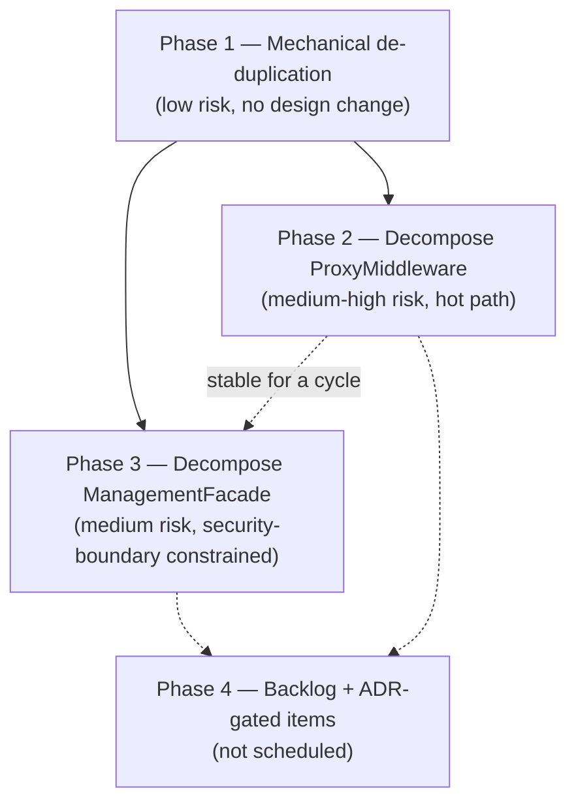

# Code-Smell Refactoring Plan

**Status:** Phase 1 implemented (see [PR #75](https://github.com/davidpizon/TotallyHot-ArcRouter/pull/75)).
Phase 2 (all 5 steps) and Phase 3 steps 1-2 are implemented. The Phase 4 Razor `.razor.cs` code-behind
split is also implemented (`ProvidersAdmin`, `SettingsModal`, `BenchmarkData`, `PriceSourcesAdmin`).

A second, independent audit (session "Codebase architectural audit," `~/.claude/plans/act-as-a-brutal-cozy-pascal.md`)
re-surveyed the codebase blind to this document, confirmed both of this plan's still-open items below,
and found 10 additional items this plan missed. Per that audit's own recommendation, its findings are
folded into this document rather than tracked separately. All of its Critical and Moderate items are
now implemented except the two ADR-gated ones and the Gemini cost reconciler:

- **Implemented** (commits on `refactoring`): `PersistedSessionsClient` extended `GrpcAdminClientBase<,>`
  (fixing a regression of the exact smell Phase 1 fixed once already); the four duplicated translator
  helper methods across `AnthropicPayloadTranslator`/`GeminiPayloadTranslator`/Bedrock's translators were
  deduplicated into `PayloadTranslationHelpers`; `ProxyMiddleware.InvokeCoreAsync`'s six per-candidate
  failover gates are now an explicit ordered `CandidateGates` sequence (Phase 2 step 4, previously
  deferred); `ManagementFacade`'s 23 colocated DTO/enum/record types moved to `ManagementFacadeModels.cs`;
  `RequestTelemetryPublisher.PublishAsync` decomposed into 6 named private methods with a new
  characterization-test suite (it previously had none); a `SnapshotCache<T>` now backs
  `ProviderBudgetStore`/`PriceSourceToggleStore`/`ToolCallCapabilityStore`'s lock-and-volatile-swap
  concurrency idiom; `PriceCatalogRepository` split into 6 per-concern repositories (Phase 4's backlog
  item, re-litigated and promoted — see the audit's M3); `RequestInterceptor` split via
  `RequestBodyIntrospection` and `RoutingCandidateBuilder` (Phase 4's other backlog item, likewise
  promoted — see the audit's M4); a shared `DialogShell` component now backs all four Governance dialogs;
  `TrayWindowManager`'s single-UI-thread invariant is documented; a `ProviderRegistration` dispatch table
  now drives `UsageExtractor`/`ResponseTextExtractor` and fixed a real gap (Ollama's response text was
  silently unhandled); several small Quality-assembly and GUI cleanups (deduplicated scoring/word-boundary
  helpers, stale doc-comment fixes, `DashboardData`'s mock fixtures moved to a JSON resource).
- **ADR-gated, drafted, awaiting sign-off before any further code moves:**
  [ADR-0006](../adr/0006-split-managementfacade-along-crud-aggregate-boundaries.md) records the decision
  to split `ManagementFacade`'s remaining write/security-boundary surface along CRUD-aggregate lines
  (Phase 3 step 3, below) — its class-split has **not** shipped yet, only the DTO move.
  [ADR-0007](../adr/0007-provider-admin-client-stays-on-http.md) records the decision to leave
  `ProviderAdminClient` on HTTP rather than migrate it to gRPC (the Phase 4 transport item, below) — no
  migration code is planned regardless of the ADR's outcome, since a migration was independently assessed
  as High risk by both audits.
- **Explicitly deferred:** a real `IProviderCostReconciler` for Gemini (would need GCP Cloud Billing/
  BigQuery export integration — new external credential surface, paused pending an operator decision on
  configuration). Bedrock and Ollama reconcilers were assessed and ruled out — AWS Cost Explorer reports
  account-wide rather than per-model, and Ollama has no billing API at all being local/free.
- **Adopted as a going-forward norm, not swept:** GUI singleton stores (13 of 14) still have no
  interface — extract one when a store is next touched for an unrelated reason, not as a dedicated pass.

Phase 3 step 3 (further `ManagementFacade` splitting) remains ADR-gated and unimplemented pending sign-off
on ADR-0006; the HTTP-vs-gRPC transport inconsistency is resolved by ADR-0007 (documented, not migrated).
This document is the output of a structural survey (CodeGraph + Serena + targeted reads), not an
exhaustive line-by-line audit.

**Scope surveyed:** `TotallyHotArcRouter` (router core), `TotallyHot.ArcRouter.Quality`, and all four
GUI assemblies (`TotallyHotArcRouter.Gui`, `.Gui.Admin`, `.Gui.Charts`, `.Gui.Console`,
`.Gui.Telemetry`). `TotallyHotArcRouter.Installer` and all `*.Tests` projects were **not** reviewed.

**Method:** file-size survey to find outliers, CodeGraph structural queries for call paths and blast
radius, an Explore subagent for a method-by-method breakdown of the two largest files, and targeted
`grep`/`Read` passes to confirm or reject each hypothesis before it's listed below (a couple of
suspected duplications turned out, on inspection, to be legitimately different code — those are noted
in [What was checked and rejected](#what-was-checked-and-rejected)).

## Summary

| # | Smell | Location | Size | Phase | Risk |
|---|---|---|---|---|---|
| 1 | Duplicated gRPC exception/constructor/dispose boilerplate | 9 classes in `Gui.Telemetry/*AdminClient.cs` | ~9× ~30 lines | 1 | Low |
| 2 | Duplicated error-envelope boilerplate | `ProxyMiddleware.cs`, 4 `Write*ResponseAsync` methods | 4× ~15 lines | 1 | Low |
| 3 | Triplicated capture-buffer accounting | `ProxyMiddleware.cs`, 3 translate/copy methods | 3× ~20 lines | 1 | Low-Medium |
| 4 | One 700-line method, ~120 DI registrations | `Hosting/ServiceCollectionExtensions.cs` | 800 lines | 1 | Low |
| 5 | God class: 8+ mixed responsibilities, 30-param ctor | `Proxy/ProxyMiddleware.cs` | 2751 lines | 2 | Medium-High |
| 6 | God facade: ~7 sub-APIs, ~14 effective dependencies | `Proxy/Management/ManagementFacade.cs` | 2090 lines | 3 | Medium |
| 7 | Multi-aggregate repository (6 concerns, 1 class) | `PriceCatalog/PriceCatalogRepository.cs` | 1123 lines | 4 (backlog) | Medium-High if touched |
| 8 | Mixed responsibilities, 13-param ctor, 295-line method | `Proxy/RequestInterceptor.cs` | 945 lines | 4 (backlog) | Medium |
| 9 | Inconsistent client transport (HTTP vs. gRPC) | `Gui.Admin/ProviderAdminClient.cs` vs. `Gui.Telemetry/*AdminClient.cs` | — | 4 (ADR) | N/A (observation) |
| 10 | Oversized Razor components with large inline `@code` | `Gui/Components/ProvidersAdmin.razor` + 3 others | 500-987 lines | 4 (optional) | Low-Medium |

## What was checked and rejected

To keep this plan honest, these were investigated as candidate smells and specifically **ruled out**:

- **Per-provider payload translators** (`AnthropicPayloadTranslator`, `GeminiPayloadTranslator`,
  `TitanPayloadTranslator`, …) share method *names* (`AppendUserContent`, `AppendMergedContent`, …) but
  not bodies — each targets a genuinely different wire shape (Anthropic content blocks vs. Gemini
  parts vs. Bedrock Titan). Not duplication.
- **`ManagementFacade.ParseBudgetWindow` vs. `BudgetWindowCodec.Decode`** looked like duplicated
  window-parsing logic at first grep. On reading both bodies they solve different problems:
  `ParseBudgetWindow` validates untrusted request strings and throws `ArgumentException` on bad input;
  `BudgetWindowCodec.Decode` degrades already-persisted, trusted data gracefully. Correctly separate.
- **`ManagementFacade`'s `catch (Exception) → Fail(ManagementErrorType.Internal, …)` pattern** repeats,
  but only **5** times, not across the whole class — noted as a minor cleanup folded into Phase 3, not
  a standalone phase.
- **Project reference graph** (router core → `Quality`; `Gui` → `Gui.Admin`/`.Charts`/`.Console`/
  `.Telemetry`, each a leaf) is clean and acyclic — no coupling smell there.
- **Orchestrator voters** (`DimBestVoter`, `LogRegVoter`, `ClusterBestVoter`, `MemoryKnnVoter`,
  `LlmRouterVoter`) and **Quality's static analyzers** (`ComplexityAnalyzer`, `TruncationAnalyzer`, …)
  are textbook `IRoutingVoter`/`IStaticAnalyzer` polymorphism — appropriately factored, reasonably
  sized files, nothing to flag.
- Broad `catch (Exception)` swallows and `TODO`/`FIXME`/`HACK` markers are rare across the whole
  surveyed scope (a handful of hits, mostly legitimate). This is not a codebase with hygiene rot; the
  smells found here are architectural (size/cohesion/coupling), not sloppiness.

---

## Phase 1 — Mechanical de-duplication (no design change)

Each item here is a pure extract-and-reuse: same observable behavior, same public surface, existing
tests should pass unmodified and are the regression net.

### 1. Duplicated gRPC admin-client boilerplate (9×)

**Location:** `src/TotallyHotArcRouter.Gui.Telemetry/{PriceSource,ClusterModel,LlmRouterModel,
RouterSettings,LogRegModel,BenchmarkData,UpdateAdmin,RoutingGate,RoutingMode}AdminClient.cs`

Every one of these 9 classes independently declares: a same-shaped `XxxAdminException` (message,
inner exception, `IsUnavailable` flag, identical XML doc), the same two-constructor pattern
(owned-channel vs. injected-client-for-tests), the same `private static XxxAdminException Wrap(RpcException
ex, string action)` that special-cases `StatusCode.Unavailable` into a friendlier message, and the same
`Dispose()`. Confirmed by grep: all 9 files match `Wrap(RpcException ex, string action)` and
`StatusCode.Unavailable` with the identical shape.

**Fix:** Extract a shared `GrpcAdminExceptionMapper` (or a `GrpcAdminClientBase<TException>` if a base
class fits the existing interface-per-client design better) that owns the "unavailable → friendly
message, else → server detail" mapping, and a shared `AdminException` base carrying `IsUnavailable`
that each `XxxAdminException` derives from instead of reimplementing. Each concrete client keeps its
own RPC calls and DTO mapping — only the exception/dispose/constructor scaffolding moves.

**Risk: Low.** Every client already has dedicated unit tests (`ClusterModelAdminTests.cs`,
`PriceSourcesAdminTests.cs`, `RouterModelAdminTests.cs`, `RoutingModeAdminTests.cs`, etc.) that exercise
the wrapped-exception behavior via the constructor-injected fake-client seam, so a behavior regression
in the shared mapper would fail loudly and locally.

### 2. Duplicated error-envelope boilerplate in `ProxyMiddleware`

**Location:** `src/TotallyHotArcRouter/Proxy/ProxyMiddleware.cs` —
`WriteModelNotFoundResponseAsync`, `WriteRoutingDisabledResponseAsync`,
`WriteBudgetExhaustedResponseAsync`, `WriteCircuitTripBlockedResponseAsync`.

Four near-identical methods: set status code, set `application/json`, build an anonymous `{ error:
{...} }` envelope, serialize, write.

**Fix:** Extract one `WriteErrorResponseAsync(HttpContext, int statusCode, string code, string
message)` helper; each of the four becomes a one-line call site.

**Risk: Low.** Behavior-preserving; `ProxyMiddlewareFallbackTests.cs` already covers these error paths.

### 3. Triplicated capture-buffer accounting in `ProxyMiddleware`

**Location:** `TranslateAndCaptureBufferedAsync`, `TranslateAndCaptureStreamAsync`,
`CopyAndCaptureAsync` (same file).

All three independently reimplement "cap the captured-response buffer, and once the cap is exceeded,
lazily allocate an `IncrementalUsageScanner` to keep scanning a tail window" — the same accounting
rule, written three times with three call shapes (buffered, streaming, raw copy).

**Fix:** Extract a small `ResponseCaptureAccumulator` (or similar) that owns the cap + lazy-scanner
state machine; each of the three call sites drives it instead of reimplementing it.

**Risk: Low-Medium.** This sits on the streaming hot path (SSE and buffered responses both flow
through it), so unlike #1/#2 this needs the full streaming/translation test suite run — not just
inspection — before and after, since the three call sites currently have subtly different trigger
points (buffered vs. streamed vs. copy-through) that must map onto the extracted accumulator exactly.

### 4. One 700-line composition-root method

**Location:** `src/TotallyHotArcRouter/Hosting/ServiceCollectionExtensions.cs` —
`AddTotallyHotArcRouter`, roughly lines 34-735, ~120 `AddSingleton`/`AddScoped`/`AddTransient`/
`Configure` calls in one method body.

This is a long-method smell more than a cohesion smell — a DI composition root wiring "everything" is
arguably one responsibility by definition — but 700 lines in one method makes it hard to see which
registrations belong to which subsystem, and hard to review a diff that touches it.

**Fix:** Split into private `AddProxy`, `AddRouting`, `AddPriceCatalog`, `AddJudge`, `AddTelemetry`,
`AddTranscripts`, `AddSecrets`, `AddBedrock`, `AddQuality` extension methods (naming TBD to match
existing folder boundaries), chained from the public `AddTotallyHotArcRouter` entry point. Pure move.

**Risk: Low, with one caveat.** Verify no registration relies on call-order side effects before moving
code between methods (e.g., an options binding that a later registration reads eagerly during
construction rather than lazily via `IOptions<T>`). Confirm via `dotnet build` + full test suite, since
a mis-ordered move would likely surface as a DI resolution failure at startup, not a silent bug.

---

## Phase 2 — Decompose `ProxyMiddleware.cs`

**The headline finding.** `ProxyMiddleware` is a single 2751-line class (plus 7 small nested DTO
records) with a **30-parameter constructor** (2 required, 28 optional/nullable). Its two largest
methods are `InvokeCoreAsync` (~777 lines — the request routing/failover/forwarding pipeline) and
`PublishTelemetryAsync` (~417 lines — session resolution, usage/cost extraction, transcript/embedding
hooks, metric emission). At least 8 largely independent concerns share this one class: routing/failover
orchestration, budget enforcement, circuit-breaker gating, HTTP forwarding, AWS Bedrock SDK invocation
(a second, parallel invocation path), streaming translation/capture, session/telemetry publishing, and
three self-contained "answer locally" endpoints (`/v1/models`, `/api/tags`, `/api/show`).

This is the single highest-value target in the survey, and also the highest-risk: it is the literal
request hot path for every proxied call.

**Fix, staged from safest to riskiest — do not attempt this as one PR:**

1. **Extract the three local-endpoint responders** (`/v1/models`, `/api/tags`, `/api/show` and their
   nested DTOs) into a new `LocalEndpointResponder` (or similar) that `ProxyMiddleware` delegates to.
   These branches are read-only, self-contained, and share almost no state with the forwarding path —
   the safest possible cut.
2. **Extract `PublishTelemetryAsync`** into a `RequestTelemetryPublisher` collaborator, injected rather
   than inlined. This is a large, mostly-linear method with a clear single output (telemetry
   side-effects), which makes it a clean second cut.
3. **Extract `InvokeBedrockAsync`** into a `BedrockInvocationHandler`, parallel to the existing HTTP
   forwarding path it mirrors.
4. **Only after 1-3 have shipped and proven stable**, revisit `InvokeCoreAsync`'s failover loop itself
   (budget → provider-enabled → model-enabled → circuit-open checks, 3+ levels of sequential gating per
   iteration). This is the highest-risk piece in the file because it *is* the hot path; consider naming
   the gate sequence explicitly (e.g., a small ordered list of predicate steps) without moving
   orchestration out of the middleware itself.
5. **Once the field list shrinks** from steps 1-3, group the remaining optional collaborators into a
   `ProxyMiddlewareDependencies` bag, mirroring the pattern `ManagementFacade` already uses for its own
   optional collaborators (`ManagementFacadeDependencies`) — replacing most of the 28 optional
   constructor parameters with one object.

**Risk: Medium-High overall (High specifically for step 4).** `ProxyMiddlewareFallbackTests.cs` and
`Integration/ParityRegressionTests.cs` give a regression net, but per AGENTS.md's own rule for GUI/UI
changes this also needs a manual smoke test of the running proxy (start it, send a real request through
each of streaming/buffered/Bedrock/local-endpoint paths) after each step — unit tests verify
correctness, not that the wiring still works end-to-end. Ship steps 1-3 as independent, separately
reviewable changes; treat step 4 as its own follow-up phase gated on 1-3 having run in practice for a
cycle without incident.

---

## Phase 3 — Decompose `ManagementFacade.cs`

**Location:** `src/TotallyHotArcRouter/Proxy/Management/ManagementFacade.cs` (2090 lines: ~1750 lines
of facade class, plus a trivial constants class and 21 request/response/view DTOs colocated in the same
file).

The facade fuses roughly 7 sub-APIs into one class: provider CRUD, model CRUD, capability scanning,
budget configuration, price-override CRUD, usage/rollup/ROI reporting, and rate-limit history/
exhaustion projections — plus secret read/write plumbing. Its constructor takes 3 required
collaborators and a `ManagementFacadeDependencies` bag holding 11 further optional ones (effectively
~14 total, just not all visible in the signature). The class's own doc comment frames it as **"the
single security boundary"** for management operations — a real constraint on how far this can safely
be split, not just a style preference.

**Fix:**

1. **Split the read-only reporting surface out first.** `GetUsageSummary`, `GetUsageRollup`,
   `GetRoutingRoiAsync`, and the rate-limit history/exhaustion projections do not mutate anything and
   are not part of the "security boundary" in the sense that matters (they don't grant capability,
   they report on state). Move these into a new `ManagementReportingService`, leaving
   `ManagementFacade` as the write/security boundary for provider, model, budget, price-override, and
   secret mutations. This alone should cut the class roughly in half.
2. **Fold the minor `catch (Exception) → Fail(ManagementErrorType.Internal, …)` duplication** (5
   occurrences — see [What was checked and rejected](#what-was-checked-and-rejected)) into a small
   `TryExecute` helper while doing the above split, since it's touching the same methods anyway.
3. **Defer further splitting** (e.g., separating provider CRUD from budget CRUD from secret handling)
   to a follow-up phase, and gate it behind a short ADR per `docs/adr/README.md`. AGENTS.md requires
   documenting deliberate deviations, and "what does the security boundary mean after the facade is
   split into N classes" is exactly the kind of decision this repo's ADR process exists to record
   before the code changes, not after.

**Risk: Medium.** The reporting split (step 1) is read-only and comparatively low-risk. Anything
touching provider/budget/secret *write* paths carries real security-review weight, which is why further
splitting is explicitly deferred to an ADR-gated follow-up rather than bundled into this plan.

---

## Phase 4 — Backlog and ADR-gated items (not scheduled in this plan)

These were found and are real, but each has a reason not to schedule a mechanical fix now — either the
blast radius is large relative to the benefit, or the right first step is a design decision (ADR)
rather than code.

### `PriceCatalogRepository.cs` — multi-aggregate repository

**Location:** `src/TotallyHotArcRouter/PriceCatalog/PriceCatalogRepository.cs` (1123 lines).

One repository class backs prices, price sources, provider budgets, provider spend, rate-limit
headers/history, and reported usage — six concerns that would each justify their own repository. It's
already reasonably well-encapsulated behind `Store` facades (`ProviderBudgetStore` wraps it rather than
duplicating its SQL, confirmed by reading the constructor), which is the main reason this is backlog
and not a phase: the caching/business-logic layer is already correctly separated, and only the raw
ADO.NET layer underneath is multi-aggregate. **Risk if attempted: Medium-High** — it's a shared
dependency across routing enforcement, GUI budget bars, and telemetry, and splitting the underlying
SQLite connection/transaction handling without touching every current call site is nontrivial.
**Risk if left alone: Low.** Recommend tracking, not scheduling.

### `RequestInterceptor.cs` — mixed responsibilities

**Location:** `src/TotallyHotArcRouter/Proxy/RequestInterceptor.cs` (945 lines, 13-parameter
constructor, `ResolveModelRouteAsync` ~295 lines).

Mixes interception logging, route resolution/ranking, forced-single-model serving, routing-gate
resolution, embedding-based classification, and raw JSON body introspection
(`CarriesTools`/`CarriesResponseFormat`/`CarriesToolHistory`). **Fix (when scheduled):** extract
`ResolveModelRouteAsync`'s candidate-building/ranking into a `RoutingCandidateBuilder`, mirroring the
`IRoutingVoter` pattern the codebase already uses well in `Router/Orchestrator`. **Risk: Medium** —
verify this class's test coverage specifically (it did not come up in the same test-file grep that
covers `ProxyMiddleware`) before extracting.

### Inconsistent admin-client transport: HTTP vs. gRPC

**Location:** `Gui.Admin/ProviderAdminClient.cs` (raw HTTP + hand-rolled `JsonException` handling) vs.
the 9 gRPC clients in `Gui.Telemetry` (shared `TelemetryChannelFactory`, see Phase 1 item #1).

Same conceptual role — a Governance-panel client talking to the router — implemented two different
ways. This is very likely historical (provider management predates the telemetry gRPC service), but
it's not this survey's place to guess *why* and prescribe a fix. **Recommendation:** write a short ADR
that either (a) schedules migrating `ProviderAdminClient` onto gRPC for consistency, or (b) explicitly
records why it should stay on HTTP (e.g., avoiding a cert/TLS requirement for the management API,
if that's the real reason). **Risk: N/A for the observation itself; a transport migration would be
High risk** — it touches every provider CRUD call site plus the Governance UI's error handling, which
currently branches on `ProviderAdminException` vs. the gRPC clients' `IsUnavailable`-flagged exceptions.

### Oversized Razor components

**Location:** `Gui/Components/ProvidersAdmin.razor` (987 lines, ~543 in `@code`),
`SettingsModal.razor` (703/385), `BenchmarkData.razor` (653/351), `PriceSourcesAdmin.razor` (507/320).

Large components with big inline `@code` blocks. Lowest priority in this whole plan: each already has
dedicated bUnit test coverage (`ProvidersAdminTests.cs`, `SettingsModalTests.cs`,
`BenchmarkDataTests.cs`, `PriceSourcesAdminTests.cs`), and Blazor's convention of colocating component
logic in `@code` is idiomatic rather than automatically a smell — this is a size observation, not a
correctness or maintainability emergency. **Fix, if ever scheduled:** for a component whose `@code`
exceeds ~300 lines, split it into a `.razor.cs` partial code-behind (pure move) and/or extract cohesive
sub-UI into child components with their own `[Parameter]`s — e.g. `ProvidersAdmin.razor`'s per-provider
budget and API-key panels look like natural child components. **Risk: Low** for the partial-class move;
**Low-Medium** for sub-component extraction, and any new dialog/modal split off from these must still
satisfy AGENTS.md's "New GUI windows must match the System Settings window" shell contract
(`docs/gui/DESIGN.md` §4.1) where applicable.

---

## Validation gate (applies after every phase, per AGENTS.md)

1. `dotnet build` passes with zero warnings and zero errors (`TreatWarningsAsErrors` is on repo-wide).
2. Every touched public/protected member's XML doc is re-read for staleness — extraction moves code
   between classes, and a doc comment that referenced "this class" or an old parameter list needs to
   move or be rewritten, not just compile.
3. All unit tests pass; both non-GUI assemblies hold ≥80% line coverage per assembly.
4. No unusually heavy test exceeds 5 seconds.
5. Every routing decision remains logged through Serilog with a static message template — extractions
   in Phase 2 must carry the existing log statements to their new home, not drop them.
6. For Phase 2 specifically: manually run the proxy and smoke-test streaming, buffered, Bedrock, and
   local-endpoint (`/v1/models`, `/api/tags`, `/api/show`) request paths after each staged step, per
   AGENTS.md's "test the golden path and edge cases … before reporting complete" rule for anything
   touching request handling.
7. Any deferred item (everything in Phase 4) is recorded with its evidence in this document — done
   above — and, where an ADR is called for, that ADR is written before the corresponding code change.
