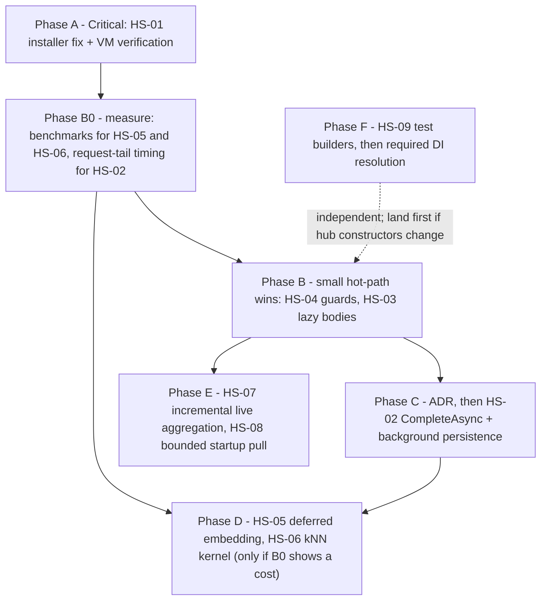

# Codebase Health Survey — 2026-09-28

A whole-repository survey for code smells and inefficiencies, run against `code-review` at `22539fc`
(identical to `main`). It is a **new document**, not an extension of
[`code-smell-refactoring-plan.md`](code-smell-refactoring-plan.md): that plan's own end condition is
reached, and [ADR-0008 Amendment 1](../adr/0008-codegraph-serena-dual-engine-code-smell-pipeline.md#amendment-1-2026-09-02-stop-rules)
rule 4 says later findings start a new document with a stated end condition.

## Deliberate deviations from ADR-0008 Amendment 1

Two stop rules are knowingly waived for this survey. The maintainer chose both, and they are recorded
here so this document is not later read as rule-compliant:

1. **No pain trigger (rule 3).** This is a general health check requested by the maintainer, not a
   response to a bug cluster or a blocked feature.
2. **Critical and Major findings are scheduled without an observed cost (rule 1).** The maintainer
   directed that every Critical/Major item become a plan item. Where an item *does* have an observed or
   measurable cost, its entry says so. Where the cost is estimated rather than measured, the entry says
   that too, and its first step is to measure. An item whose measurement comes back negligible is
   withdrawn, not shipped anyway.

Minor findings are **not** scheduled. They are recorded in [Observed, not scheduled](#observed-not-scheduled-minor).

## Scope and method

| | |
|---|---|
| **Scope** | All of `src/`: 11 production assemblies, 8 test projects, and `TotallyHotArcRouter.Installer`. This is the first survey to include the test projects and the Installer, which ADR-0008's pipeline ordinarily leaves out. |
| **Structural engine** | CodeGraph (`codegraph_explore`, 1,083 indexed files): call paths, blast radius, and interface dispatch for every hot-path and GUI finding below. |
| **Cognitive engine** | **Serena partial.** The Serena project was activated. One `find_referencing_symbols` query succeeded (`LiveDataStore.Changed`); the remaining Serena queries were blocked by transient permission-classifier failures. Severity classification is therefore the agent's own, applying ADR-0008's matrix. **This is not a full dual-engine result.** |
| **Supporting checks** | Pattern counts across production and test code, a line-count baseline, and targeted reads to confirm or reject each hypothesis. |
| **Lens** | Commonly accepted .NET practice: async all the way down, `IsEnabled` guards around expensive log arguments, lazy evaluation on hot paths, bounded caches, Blazor render coalescing and virtualization, idiomatic WiX sequencing, and test-data builders. |
| **Inefficiency focus** | Hot-path runtime, GUI render cost, and startup/DI cost. Build/test runtime was explicitly out of scope. |

### Metrics baseline

| Project | Files | Lines |
|---|---:|---:|
| `TotallyHotArcRouter` | 438 | 60,036 |
| `TotallyHotArcRouter.Tests` | 334 | 56,757 |
| `TotallyHotArcRouter.Gui.Components` | 61 | 10,587 |
| `TotallyHotArcRouter.Gui.Components.Tests` | 45 | 7,773 |
| `TotallyHotArcRouter.Quality` | 45 | 3,725 |
| `TotallyHotArcRouter.Gui.Telemetry` (+ tests) | 33 (+18) | 3,504 (+3,718) |
| All other projects | 43 | 6,766 |

Hub drift since the [2026-09-02 catalog](../adr/0008-codegraph-serena-dual-engine-code-smell-pipeline.md#live-codegraph-catalog-2026-09-02-production-src-only):

| File | 2026-09-02 | Now | Note |
|---|---:|---:|---|
| `Proxy/ProxyMiddleware.cs` | 1,345 | 1,062 | Shrinking: C1 landed |
| `Proxy/Management/ProviderManagementService.cs` | 889 | 1,036 | **Grew by 147 lines.** S3 (Major, not scheduled) |
| `Proxy/RequestTelemetryPublisher.cs` | 799 | 843 | S4 |
| `Proxy/RequestInterceptor.cs` | 670 | 761 | **Grew by 91 lines.** S2 |
| `Gui/Platforms/Windows/TrayWindowManager.cs` | 688 | — | **Deleted** by the WinForms-tray migration (P9); A3 is obsolete |

Pattern counts in production code: 0 `async void`, 0 `Thread.Sleep`, 0 empty `catch`,
0 `BuildServiceProvider`, 5 `TODO`/`FIXME`/`HACK`, 118 `catch (Exception` (almost all of them
documented best-effort telemetry and background boundaries). This matches the earlier plan's verdict:
**the codebase shows no hygiene rot.** Everything below is about where work happens, not sloppiness.

## Summary

| ID | Severity | Area | Finding | Cost evidence |
|---|---|---|---|---|
| [HS-01](#hs-01--the-installer-leaves-the-local-root-ca-trusted-after-uninstall) | **Critical** (security defect, *plausible*) | Installer | The uninstall CA-removal action runs after its own exe has been deleted, so the root CA stays machine-trusted | Needs a VM uninstall to confirm |
| [HS-02](#hs-02--request-completion-waits-on-synchronous-sqlite-telemetry-writes) | **Critical** (hot-path contract; ADR first) | Proxy | The client's response isn't complete until three synchronous SQLite writes finish | Structural; latency to be measured |
| [HS-03](#hs-03--every-failover-candidate-re-serializes-the-full-request-body-eagerly) | Major | Proxy | Every configured model re-serializes the whole request body eagerly, even though usually only one is attempted | O(models × body) allocation per request |
| [HS-04](#hs-04--debug-log-arguments-decode-and-sanitize-full-payloads-at-every-log-level) | Major | Proxy | Debug-log arguments decode and sanitize up to 4 MB per request even with Debug off | Up to ~4 full-size copies of the body per request |
| [HS-05](#hs-05--the-embedding-is-computed-inline-for-requests-that-never-route-on-it) | Major | Proxy | Explicit-model requests wait (up to a 250 ms budget, serialized behind the inference semaphore) for an embedding their routing never reads | Estimated; measure first |
| [HS-06](#hs-06--memory_knn-retrieval-copies-scores-and-sorts-the-whole-working-set-per-vote) | Major | Routing | kNN copies up to 20k entries, scores them in scalar code, and fully sorts them to take the top 10 | Estimated; benchmark first |
| [HS-07](#hs-07--the-live-dashboard-re-aggregates-its-entire-history-on-every-event) | Major | GUI | Every telemetry event re-aggregates the entire unbounded history: O(n²) work and unbounded memory | Grows with uptime (tray-resident GUI) |
| [HS-08](#hs-08--router-port-binding-waits-on-a-sequential-network-price-pull) | Major | Startup | The proxy doesn't bind its port until a sequential price pull finishes (default 100 s timeout per source) | Up to N×100 s on a black-holed network |
| [HS-09](#hs-09--hub-constructors-are-built-by-hand-at-256-test-sites-with-silent-production-defaults) | Major | Tests / DI | Hub constructors are built by hand at 256 test sites, and the production constructors silently default any missing dependency | Measurable: 26 files for one `RequestInterceptor` parameter |
| HS-10 … HS-21 | Minor | various | See [Observed, not scheduled](#observed-not-scheduled-minor) | — |

---

## Scheduled findings

### HS-01 — The installer leaves the local root CA trusted after uninstall

**Severity:** Critical. This is graded on impact (a security defect), not on the matrix's "needs an ADR"
axis; the fix itself is local. **Verdict: plausible.** It follows from standard Windows Installer
sequencing, but has not been reproduced.

**Evidence.**
- [`Package.wxs:256-261`](../../src/TotallyHotArcRouter.Installer/Package.wxs) defines
  `UninstallCertificate` as a deferred `FileRef="RouterServiceExe"` action.
- [`Package.wxs:268`](../../src/TotallyHotArcRouter.Installer/Package.wxs) schedules it
  `After="InstallFiles"`. In the standard `InstallExecuteSequence`, `RemoveFiles` (3500) runs before
  `InstallFiles` (4000). So on a genuine uninstall, `TotallyHotArcRouter.exe` has already been removed
  when this action runs, and the action cannot launch.
- `Return="ignore"` swallows that failure, and the install log is the only trace.
- The CA's key material is deliberately left behind: `router-ca.pfx` plus its ProtectedSecretStore
  password live in `%ProgramData%\TotallyHotArcRouter\`, which the package preserves on uninstall
  ([`Package.wxs:37-55`](../../src/TotallyHotArcRouter.Installer/Package.wxs),
  [`LocalCertificateAuthority.cs:32-46`](../../src/TotallyHotArcRouter/Telemetry/LocalCertificateAuthority.cs)).
  The result is a root CA that stays trusted machine-wide after the product is gone, with its private
  key still on disk.
- **Secondary:** the comment at `Package.wxs:250-254` says `REMOVE="ALL"` is false during
  MajorUpgrade's internal `RemoveExistingProducts` pass. It is not. The old package's uninstall session
  sets `REMOVE=ALL`, and `UPGRADINGPRODUCTCODE` is what tells the two apart. Today the sequencing bug
  masks this, because the action never runs. Fixing the sequencing alone would start un-trusting the CA
  on every upgrade.

**Fix.**
1. Schedule `UninstallCertificate` `Before="RemoveFiles"`.
2. Condition it `REMOVE~="ALL" AND NOT UPGRADINGPRODUCTCODE`.
3. Correct the comment.
4. Keep `Return="ignore"`, but log the outcome.

**Validation.** In a clean VM: install, confirm the CA is in `certlm.msc`, uninstall, confirm it is gone.
Then install vN, upgrade to vN+1, and confirm the CA stays trusted throughout. Record the MSI verbose log
excerpt in the PR.

### HS-02 — Request completion waits on synchronous SQLite telemetry writes

**Severity:** Critical under ADR-0008's matrix. It changes a hot-path contract: the ordering and
durability of spend, ledger, and transcript writes relative to the client seeing its response.
**Write an ADR before step 2.**

**Evidence.**
- [`ProxyMiddleware.cs:693-716`](../../src/TotallyHotArcRouter/Proxy/ProxyMiddleware.cs) awaits
  `RequestTelemetryPublisher.PublishAsync` inside the request pipeline. Nothing in `Proxy/` calls
  `Response.CompleteAsync`. For chunked or SSE responses, Kestrel sends the terminating chunk only when
  the middleware returns. A client that reads to EOF (the OpenAI and Anthropic SDKs do) therefore sees
  its stream end only after persistence finishes.
- The awaited work is synchronous I/O wearing an async signature:
  - `SqliteTranscriptStore.InsertAsync` runs ADO.NET synchronously and returns `Task.FromResult`
    ([`SqliteTranscriptStore.cs:42-70`](../../src/TotallyHotArcRouter/Transcripts/SqliteTranscriptStore.cs)).
  - `ProviderBudgetStore.RecordUsageAsync` calls the synchronous `AddProviderSpend` under an async
    mutex ([`ProviderBudgetStore.cs:167-177`](../../src/TotallyHotArcRouter/PriceCatalog/ProviderBudgetStore.cs)).
  - `UsageLedger.RecordAsync` also calls a rollup forward pass.

  That is at least three separate connection/commit round trips per request, each blocking a
  thread-pool thread.
- The comment at `RequestTelemetryPublisher.cs:125-126` ("the response has already been fully sent to
  the client by this point") is true for the bytes, but not for completion of the response.

**Fix.**
1. *(No ADR needed.)* After `_upstreamResponseWriter.WriteAsync` commits, call
   `await context.Response.CompleteAsync()` before telemetry. Check the effect on `InFlightRequestGauge`:
   its scope should still span persistence, since background work pauses on it.
2. *(ADR.)* Move the durable writes onto a bounded `Channel<T>`-backed writer. The codebase already has
   this shape in `RateLimitHeaderCapture`'s consumer loop (`RateLimitHeaderCapture.cs:74`). The ADR must
   state the new guarantees:
   - a crash between completion and drain loses rows;
   - budget enforcement lags by the drain latency;
   - the shutdown drain deadline.

   This is also the natural landing point for the open **C2** data clump. The 25-parameter
   `PublishAsync` call at `ProxyMiddleware.cs:703-716` becomes one `ServedRequest` record on the channel.

**Validation.** Measure time from the client's last `data:` frame to EOF, before and after, on a
streaming request. Then run the golden-path smoke (streaming, buffered, Bedrock, `/v1/models`,
`/api/tags`, `/api/show`) and the existing `ProxyMiddlewareCaptureRecoveryTests` and
`RequestTelemetryPublisherTests`.

### HS-03 — Every failover candidate re-serializes the full request body eagerly

**Severity:** Major (hot path, internal change only).

**Evidence.**
- Every other currently eligible configured model becomes a failover candidate
  ([`RoutingCandidateBuilder.cs:161-177`](../../src/TotallyHotArcRouter/Proxy/RoutingCandidateBuilder.cs)).
- For each one, `RequestBodyIntrospection.BuildCandidate` mutates the shared `JsonObject["model"]`, runs
  `ToJsonString()`, UTF-8 encodes it, and re-walks `messages` for `CarriesToolHistory`
  ([`RequestBodyIntrospection.cs:25-35`](../../src/TotallyHotArcRouter/Proxy/RequestBodyIntrospection.cs)).
- The common case attempts only candidate 0. With a 200 KB agentic request and 15 configured models,
  that is about 3 MB of garbage and 15 full serializations per request, almost all discarded.
- The three `Carries*` flags don't depend on the route, but they are recomputed per candidate.
- The body is consumed in only two places: `ProxyMiddleware.cs:435` at attempt time, and
  `ModelRouteResolutionResult.RewrittenBody` (`ModelRouteResolutionResult.cs:153`).

**Fix.**
- Compute the `Carries*` flags once per request.
- Give `RouteCandidate` the route plus a lazily produced body, rewritten on first access.
- Stop mutating the shared `JsonObject` in place: clone it, or rewrite only the `model` property on a
  per-attempt copy.

**Validation.** `RequestInterceptorTests`, `ProxyMiddlewareFallbackTests` (cross-provider failover must
still send each backup its own model id), and an allocation comparison with `dotnet-counters` or a
BenchmarkDotNet micro-benchmark.

### HS-04 — Debug-log arguments decode and sanitize full payloads at every log level

**Severity:** Major (hot path; smallest fix in this plan).

**Evidence.**
- [`ProxyMiddleware.cs:683-685`](../../src/TotallyHotArcRouter/Proxy/ProxyMiddleware.cs) builds its
  argument as `LogRedaction.Truncate(LogRedaction.Sanitize(Encoding.UTF8.GetString(capturedResponseBytes)))`.
  The capture holds up to 4 MB (`UpstreamResponseWriter.MaxCapturedResponseBytes`, line 105).
- The arguments are evaluated before `LogDebug` checks the level. So every request pays for:
  - a full UTF-16 decode (about 2× the byte size),
  - two full-length `Replace` copies,

  and only then truncates.
- [`RequestInterceptor.cs:351-352`](../../src/TotallyHotArcRouter/Proxy/RequestInterceptor.cs) does the
  same thing to the request body, sanitizing before truncating. Agentic system prompts routinely exceed
  100 KB.

**Fix.**
- Wrap both calls in `if (_logger.IsEnabled(LogLevel.Debug))`.
- Truncate the bytes (or the string) *before* sanitizing. The result is the same, because `Truncate`
  keeps a prefix.
- Keep the message templates static literals (AGENTS.md).

**Validation.** Existing log-capture tests; a unit test asserting that `LogRedaction.Sanitize` is not
reached when Debug is disabled.

### HS-05 — The embedding is computed inline for requests that never route on it

**Severity:** Major (hot path; changes where a routing signal is produced).

**Evidence.**
- [`RequestInterceptor.cs:398`](../../src/TotallyHotArcRouter/Proxy/RequestInterceptor.cs) awaits
  `TryComputeEmbeddingAsync` for every request, *before* the model name is even read (line 410).
- The budget is `EmbeddingBudgetMs = 250` ([`RoutingOptions.cs:181`](../../src/TotallyHotArcRouter/Models/RoutingOptions.cs)),
  and `OnnxEmbeddingClient` serializes inference behind a semaphore (`RoutingOptions.cs:175-178`), so
  concurrent requests queue.
- Only the auto-select, unresolved, and stopped-model branches pass `routingSignals` to a policy
  ([`CompositeRoutingPolicy.cs:17-22`](../../src/TotallyHotArcRouter/Router/CompositeRoutingPolicy.cs)
  confirms that an explicitly named, servable model never reaches a policy). On the explicit path, the
  vector is consumed only downstream, by telemetry and memory writes (`resolution.TaskEmbedding`).

**Fix.**
1. Resolve the model first.
2. On the explicit path, start the embedding as a `Task<EmbeddingResult?>` and let the telemetry
   publisher await it after the response. After HS-02 step 1, that is after completion.
3. Keep the policy paths exactly as they are.
4. Memory rows must be byte-identical: same vector and same `routerTokens` accounting.

**First step: measure.** Record the p50/p95 of the embedding call under realistic prompt sizes. If a
warm pass really is single-digit milliseconds with no semaphore queueing at the intended concurrency,
withdraw this item and say so here.

### HS-06 — memory_kNN retrieval copies, scores, and sorts the whole working set per vote

**Severity:** Major (auto-select routing path).

**Evidence.** [`EmbeddingMemory.FindNearest`](../../src/TotallyHotArcRouter/Router/EmbeddingMemory.cs)
(lines 259-297), with a capacity of 20,000 entries (`RoutingOptions.cs:72`):
1. It copies the entire working set under the lock (lines 267-271).
2. It filters that copy into a second list (lines 273-277).
3. It computes cosine similarity in scalar `double` arithmetic, recomputing the query's magnitude for
   every entry (lines 304-321), even though the doc says the vectors are already unit-normalized.
4. It fully sorts every entry that clears the threshold, and only then applies the judge-row filter and
   `Take(10)` (lines 290-296).

At 1,024 dimensions, the scoring pass is roughly 60M scalar multiply-adds per vote.

**Fix.**
- Replace the per-call copy with a copy-on-write immutable array, swapped on append/trim (writes are
  rare next to reads).
- Precompute the query norm.
- Use `System.Numerics.Tensors.TensorPrimitives.Dot` for SIMD.
- Apply the judge-row filter before scoring.
- Keep a bounded top-k with `PriorityQueue<,>` instead of a full sort.

The results must be identical, including tie order: document the tie-break and add a test for it.

**First step: benchmark.** BenchmarkDotNet at 20k × 1,024. Withdraw the item if the current code is
already under about 2 ms.

### HS-07 — The live dashboard re-aggregates its entire history on every event

**Severity:** Major (GUI render cost and unbounded memory).

**Evidence.**
- [`LiveDataStore.cs:273-282`](../../src/TotallyHotArcRouter.Gui.Components/Services/LiveDataStore.cs)
  appends to an unbounded `_events` list, then runs `ConversationAggregator.Aggregate(_events)` over the
  whole history: a `GroupBy`, a per-group `OrderBy`, and a full view-model re-map
  ([`ConversationAggregator.cs:84-137`](../../src/TotallyHotArcRouter.Gui.Telemetry/ConversationAggregator.cs),
  [`LiveConversationMapper.cs:64-108`](../../src/TotallyHotArcRouter.Gui.Components/Services/LiveConversationMapper.cs)).
  That is O(n) per event and O(n²) over a session, in a tray-resident GUI meant to run all day.
- Each event raises `Changed` → `Dashboard.StateHasChanged`
  ([`Dashboard.razor:178`](../../src/TotallyHotArcRouter.Gui.Components/Components/Dashboard.razor)).
  Every render then rebuilds `MergedSessionConversations` (lines 238-250) and `LiveStream.Filtered`.
- The aggregator's remarks call full re-aggregation a deliberate simplicity choice. It is recorded here
  as a deviation.

**Fix.**
- Aggregate incrementally: a per-session builder keyed by `SessionId`, updating only the touched
  conversation and re-sorting the session list by one key.
- Cap retained live events. Sessions older than the cap are already served from `PersistedSessionStore`.
- Coalesce `Changed` into at most one notification per ~100-250 ms.

**Validation.** `LiveDataStoreTests`, `DashboardTests`, `LiveConversationMapperTests`, and a new test
that 10k synthetic events produce the same `Conversations` as today's full aggregation.

### HS-08 — Router port binding waits on a sequential network price pull

**Severity:** Major (startup cost).

**Evidence.**
- `StartupHealthCheckHostedService.StartAsync` awaits `PriceCatalogIngestionService.RunCycleAsync`
  ([`StartupHealthCheckHostedService.cs:180-184`](../../src/TotallyHotArcRouter/Hosting/StartupHealthCheckHostedService.cs)).
- The host starts hosted services in registration order, and `ProxyHostedService` is registered after
  this one ([`ServiceCollectionExtensions.cs:203-207`](../../src/TotallyHotArcRouter/Hosting/ServiceCollectionExtensions.cs)),
  so Kestrel binds only after the pull finishes.
- The pull is sequential across sources
  ([`PriceCatalogIngestionService.cs:173-185`](../../src/TotallyHotArcRouter/PriceCatalog/PriceCatalogIngestionService.cs)).
- The named `HttpClient` sets no `Timeout`
  ([`PriceCatalogServiceCollectionExtensions.cs:195-200`](../../src/TotallyHotArcRouter/PriceCatalog/PriceCatalogServiceCollectionExtensions.cs)),
  so each source can take the default 100 s.
- On a black-holed network (a captive portal or corporate proxy), agents can't connect for up to
  N × 100 s. Cost estimation already degrades honestly to `null` when prices are missing, so the wait
  buys little.

**Fix.**
- Bound the startup cycle with a linked `CancellationTokenSource` and a startup budget (for example
  `PriceCatalog:StartupFetchBudgetSeconds = 10`), letting the poll loop finish the pull.
- Fetch sources concurrently while keeping `UpsertPrices` serialized, since it writes `model_prices`.
- Set an explicit per-client timeout.
- Keep the zero-fresh-prices error semantics unchanged.

**Validation.** `StartupHealthCheckHostedServiceTests` (a fake source that hangs must not block `StartAsync`
past the budget), and `PriceCatalogIngestionHostedServiceTests`.

### HS-09 — Hub constructors are built by hand at 256 test sites, with silent production defaults

**Severity:** Major. This is the one item with a **measurable** cost: adding one `RequestInterceptor`
constructor parameter touches 26 files.

**Evidence.**
- The hub constructors are called directly across the tests:
  - `new RequestInterceptor(`: 158 call sites in 26 test files;
  - `new ProxyMiddleware(`: 98 sites in 23 files;
  - `new ManagementFacade(`: 20 sites in 13 files.
- Private fixture helpers are redefined per file: `CreateContext` in 20 files, `NewContext` in 15,
  `BuildMiddleware` in 4. `TestSupport/` holds only two shared helpers. There are 63 raw
  `Path.GetTempPath`/`GetTempFileName` uses.
- This has shaped production code. `RequestInterceptor` takes 14 optional constructor parameters, and
  both hubs silently construct private defaults (`circuitBreaker ?? new CircuitBreaker()`,
  `TelemetryPublisher(new TelemetryBroadcaster())`, …)
  ([`RequestInterceptor.cs:181-213`](../../src/TotallyHotArcRouter/Proxy/RequestInterceptor.cs),
  [`ProxyMiddleware.cs:227-262`](../../src/TotallyHotArcRouter/Proxy/ProxyMiddleware.cs)).
- Production resolves the breaker with a null-tolerant `sp.GetService<ICircuitBreaker>()`
  ([`ProxyServiceCollectionExtensions.cs:214`](../../src/TotallyHotArcRouter/Proxy/ProxyServiceCollectionExtensions.cs)).
  If that registration were ever lost, the middleware would record failures on a private breaker that
  the interceptor never reads. The failure would be silent: no startup error, just no circuit breaking.
- The earlier plan's **B2** records the same pressure from the other direction: the 29-property
  `ProxyMiddlewareDependencies` bag was introduced to stop constructor churn.

**Fix.**
1. Add `TestSupport/` builders — `RequestInterceptorBuilder`, `ProxyMiddlewareBuilder`,
   `HttpContextFactory`, and a `TempDirectory` fixture — with the same fake defaults the constructors
   use today.
2. Migrate the four largest proxy test files (`ProxyMiddlewareFallbackTests`, `ProxyMiddlewareTests`,
   `RequestInterceptorTests`, `ProviderEditDialogTests`); migrate the rest when they are next touched.
3. Then switch production wiring to `GetRequiredService` for `ICircuitBreaker`. Add a DI smoke test
   asserting that `ProxyMiddleware` and `RequestInterceptor` share one breaker instance.

Changing the hubs' optional parameters to required ones is **not** in scope. That is B2's decision.

---

## Observed, not scheduled (Minor)

These are recorded so a future survey doesn't re-derive them. None is scheduled. Two are trivial
correctness or accuracy fixes (HS-10, HS-11) worth doing the next time their file is touched.

| ID | Finding | Evidence | Remedy when touched |
|---|---|---|---|
| HS-10 | **Stale XML doc.** It says the live `CompositeRoutingPolicy` does not override the `RoutingSignals` overload; it does. AGENTS.md treats stale docs like missing ones. | `RequestInterceptor.cs:629-633` vs. `CompositeRoutingPolicy.cs:72-109` | Rewrite the `<param name="signals">` paragraph |
| HS-11 | `InterceptedRequestCount++` is a non-atomic increment on a singleton, so the count drifts under concurrency | `RequestInterceptor.cs:242` | `Interlocked.Increment` |
| HS-12 | The Console tab re-renders the whole buffer per log line: an interpolated `@key` string and a `Format` call for every line on every render, plus one JS scroll per line | `ConsoleTab.razor:46-55, 75-96` | Coalesce renders, key on a sequence number, `<Virtualize>`. Only costs while the tab is open, hence Minor |
| HS-13 | The sync-over-async `IProgress<T>` → gRPC stream bridge is duplicated across 5 admin services. Each copy is documented as safe | `BenchmarkDataAdminGrpcService.cs:202,248`; `LlmRouterModelAdminGrpcService.cs:196,241`; `ClusterModelAdminGrpcService.cs:168`; `LogRegModelAdminGrpcService.cs:184`; `RegretHarnessAdminGrpcService.cs:132` | One generic `Channel<T>`-backed progress adapter |
| HS-14 | `ClusterBestVoter` takes a `SemaphoreSlim` on every vote after load, and `Reload` blocks on `Wait()`. The three voters use three different lazy-load idioms | `ClusterBestVoter.cs:163,187`; `LogRegVoter.cs:206-216` | Volatile snapshot fast path, one shared idiom |
| HS-15 | Orchestrator voters are awaited sequentially, so routing latency is the sum of voter latencies | `OrchestratorRoutingPolicy.cs:185-190` | `Task.WhenAll`, then aggregate in voter order (keeps the logs deterministic) |
| HS-16 | FIFO trim deletes evicted rows one round trip at a time: lowering capacity by 19k means 19k sequential `DELETE`s | `EmbeddingMemory.cs:211-212` | One transaction, or `DELETE … WHERE id <= @maxEvicted` |
| HS-17 | Four copies of the SQLite bootstrap (open, WAL pragma, directory creation) | `PriceCatalogDatabase.cs:398-427`; `RouterMemoryDatabase.cs:266-288`; `TranscriptDatabase.cs:100-122`; `BenchmarkDatabase.cs:138-164` | Shared `SqliteDatabaseBase` |
| HS-18 | Parallel live and persisted mapping stacks duplicate `BuildTitle`/`ShortId`/`FormatTimestamp` | `LiveConversationMapper.cs:131-149`; `PersistedSessionMapper.cs:74-90` | Shared static helper |
| HS-19 | Tray exit blocks the WinForms UI thread on async disposal. It's safe only because every await in `RouterConnectionSupervisor` uses `ConfigureAwait(false)`, and that invariant isn't documented | `TrayApplicationContext.cs:216`; `RouterConnectionSupervisor.cs:85-151` | Document the invariant, or make the exit path async |
| HS-20 | `SqliteTranscriptStore.InsertAsync` calls `EnsureSchema()` on every insert | `SqliteTranscriptStore.cs:49` | Verify it's a cached flag; if not, gate it once |
| HS-21 | 9 production `DateTime.UtcNow` reads instead of an injected `TimeProvider` | `LocalCertificateAuthority.cs:139,185`; `BenchmarkSyncService.cs:267,276`; … | Opportunistic |

Still-open items from the earlier plan that this survey re-observed: **B2** (the dependency bag) and
**C2** (the `PublishAsync` data clump — HS-02 step 2 is its natural home). **S2** and **S3** are growing
again (+91 and +147 lines), but neither shows an observed cost, so both stay unscheduled.

## Checked and rejected

- **`HttpClient` per attempt** (`ProxyMiddleware.cs:522`): `IHttpClientFactory.CreateClient` inside a
  `using` is the documented pattern. The handler is pooled, not disposed.
- **Unbounded response capture:** capture is already capped at 4 MB (`UpstreamResponseWriter.cs:105`).
  HS-04 is about the *log decode*, not the capture.
- **SQLite durability settings:** all four databases already run `journal_mode=WAL; synchronous=NORMAL`.
- **Double budget walk and `candidates.Skip(i+1).Any`** (`ProxyMiddleware.cs:387, 460`): n is the
  number of configured models, so this is negligible and kept for readability.
- **`IProgress` bridges as a deadlock risk:** there is none. Kestrel has no synchronization context and
  reports are sequential, as each copy documents. They are kept only as HS-13's duplication note.
- **`EmbeddingMemory` locking correctness:** taking the snapshot under the lock is correct. HS-06 is
  purely about cost.
- **Test-project structure beyond construction:** test file sizes (1,700-line suites) track the
  behavior surface they cover, and aren't a smell by themselves.

## End condition

This document **closes** when each of HS-01 … HS-09 has been:
- shipped,
- closed by an ADR, or
- withdrawn with its measurement recorded in its section. This applies to HS-05, HS-06, and any item
  whose first step is to measure.

Minor items (HS-10 … HS-21) do not keep it open. New findings start a new document.

## Validation gate

The same gate as [`code-smell-refactoring-plan.md` § Validation gate](code-smell-refactoring-plan.md#validation-gate-applies-after-every-phase-per-agentsmd):
- a zero-warning build;
- accurate XML docs after every move;
- all tests passing, with ≥80% line coverage per non-GUI assembly;
- no test over 5 seconds;
- static Serilog templates carried to their new homes;
- the golden-path smoke for anything under `ProxyMiddleware`, `RequestInterceptor`, `CandidateGates`,
  or `RequestTelemetryPublisher` (HS-02 through HS-05, and HS-09 step 3).

HS-01 adds its VM install/uninstall/upgrade check.

---

## Implementation status (branch `code-cleanup`)

| ID | Status | Notes |
|---|---|---|
| HS-01 | Done, **not VM-verified** | `UninstallCertificate` now runs `Before="RemoveFiles"` with `REMOVE~="ALL" AND NOT UPGRADINGPRODUCTCODE`; comment corrected. Installer builds. The install/uninstall/upgrade VM check in the plan is still owed. Outcome logging was not added. |
| HS-02 | Step 1 done; step 2 **proposed** | `Response.CompleteAsync()` now precedes telemetry. Step 2 (bounded channel writer) is [ADR-0018](../adr/0018-persist-request-telemetry-off-the-request-path-via-a-bounded-channel.md), status `proposed`; no code yet. Client-visible EOF latency was not measured. |
| HS-03 | Done | Failover candidates share the primary's flags and rewrite their body lazily from the primary's serialized snapshot. No allocation benchmark run. |
| HS-04 | Done | `IsEnabled(Debug)` guards; truncate-before-sanitize; response decode limited to a byte prefix. |
| HS-05 | **Not done** | Measure-first item; needs the ONNX model and a benchmark harness. |
| HS-06 | Partly done | Single pass, no intermediate lists, query magnitude precomputed, judge filter before scoring. Results are bit-identical. **Not done:** SIMD (`TensorPrimitives`), copy-on-write snapshot, top-k heap, and the BenchmarkDotNet baseline. |
| HS-07 | Partly done | Per-session incremental aggregation; retention capped at 500 sessions. **Not done:** `Changed` coalescing, and the `Dashboard.razor` per-render rebuilds. |
| HS-08 | Partly done | Startup price pull bounded by `PriceCatalog:StartupFetchBudgetSeconds` (default 10) and continues in the background; explicit 30 s client timeout. **Not done:** concurrent source fetching. |
| HS-09 | Partly done | `RequestInterceptorBuilder`, `HttpContextFactory`, `TempDirectory` added; 82 of 159 interceptor sites migrated; `ICircuitBreaker` now `GetRequiredService` with a DI sharing test. **Not done:** `ProxyMiddlewareBuilder`, migration of the remaining sites. |
