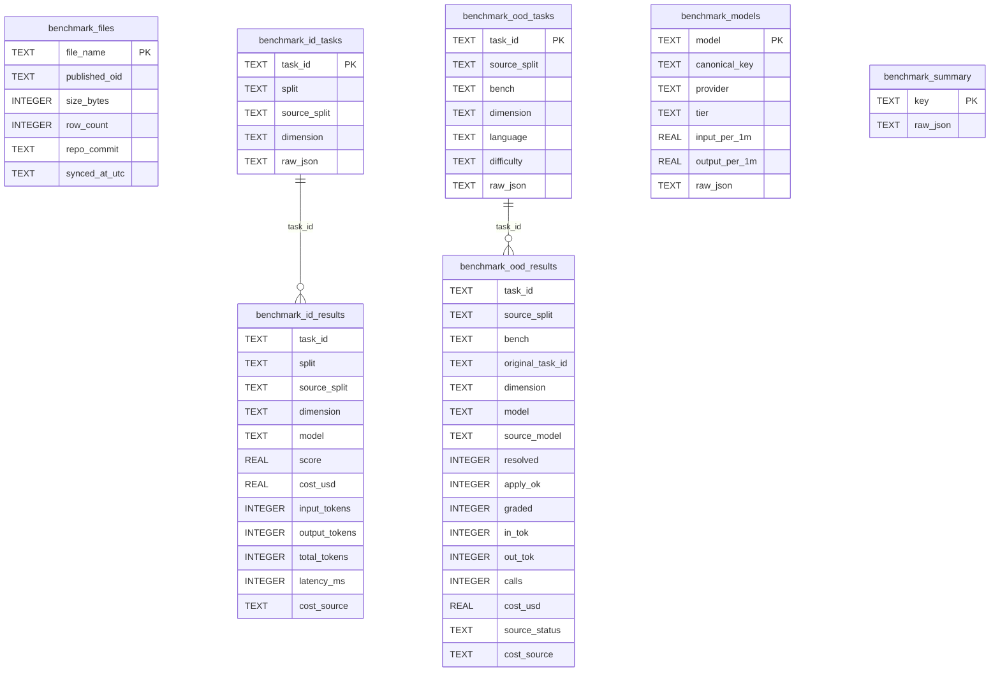

# CodeRouterBench SQLite Migration Plan

Replaces the on-disk `data/coderouterbench/` CSV/JSONL corpus (PLAN.md Phase K) with a local SQLite
database, synchronized on demand from the published Hugging Face dataset and kept honest by a
checksum comparison run at every application start.

**Status:** shipped - all six phases complete. **Ordering:** implemented *before* PLAN.md Phase L, as
planned - Phase L's `dim_best` voter and Phase N's regret harness are this data's intended consumers,
and retargeting them at a file-on-disk loader first would have meant writing the same wiring twice.

## Why

`scripts/fetch-coderouterbench.sh` (now removed) restored the corpus as loose files into a gitignored
directory. That worked, but it put the router's benchmark ground truth outside the application's own
storage: there was no in-app way to see whether the data was present, no way to tell whether it was
current, and no way to refresh it without dropping to a shell. Moving the corpus into SQLite makes it
queryable, makes staleness visible and actionable from the Governance tab, and removes a bash dependency
from a Windows-first application.

## Ground rules (apply to every phase)

- **The database is the only source.** Once this lands, nothing reads `data/coderouterbench/`.
  `CodeRouterBenchCsvReader` survives, but as the parser for freshly downloaded *bytes*, not as a
  file-path loader.
- **"Checksum" means git blob SHA-1, never MD5.** See [Checksums](#checksums-what-we-compare-and-why).
  Name every column, field, log message, and UI label accordingly — nothing in this feature may say
  "md5".
- **Fail open at startup.** The checksum probe is a network call. It follows the existing convention in
  `Hosting/StartupHealthCheckHostedService.cs`: log and continue, never block the proxy from binding
  its port.
- **Fail loudly on import.** A downloaded file whose recomputed checksum or row count disagrees with
  the published value is rejected, leaving the previous table and its recorded checksum untouched. This
  mirrors what the now-removed `fetch-coderouterbench.sh` used to do with its row-count assertions.
- Repository conventions apply as always: no build warnings, XML documentation on every public and
  protected member, Serilog with static message templates, structured logging of every sync outcome,
  tests alongside behavior changes, ≥80% coverage, no individual test over 5 seconds.

## Checksums: what we compare, and why

The original specification called for MD5. **Neither Hugging Face nor GitHub publishes MD5 for these
files**, and obtaining one requires downloading the full ~12 MB corpus — which costs exactly as much as
the sync the check is meant to avoid.

What *is* published, free and for every file in a single HTTP call, is the **git blob SHA-1**. This was
verified end to end against the live dataset:

| | `ood176_results_long.csv` (244,395 bytes) |
|---|---|
| Locally computed git blob SHA-1 | `ac74df13c0b582e12c92507c40e54a57ca0db65a` |
| Hugging Face tree API `oid` | `ac74df13c0b582e12c92507c40e54a57ca0db65a` ✅ |
| MD5 | `e248d14b94ecaf3667e550d99c57fa73` — published nowhere |

The blob SHA-1 is content-derived, changes whenever the file changes, and is recomputable locally from
raw bytes as `SHA1("blob " + length + "\0" + bytes)`. One `GET` of
`https://huggingface.co/api/datasets/Lance1573/CodeRouterBench/tree/main` returns it for every file at
once, so the startup probe costs a single request regardless of file count.

Hugging Face is canonical for both the checksum probe and the downloads, continuing what the
now-removed `fetch-coderouterbench.sh` used to do. (The mirror at
`github.com/LanceZPF/agent-as-a-router/tree/main/data/coderouterbench` carries byte-identical files with
identical blob SHA-1s, and is a viable fallback if HF availability ever becomes a problem.)

## Derived files: what we do *not* download

Two of the published files are exact unions of two others. Both derivations were verified against the
live data — set-equal, multiset-equal, and row counts matching — and upstream's own `summary.json`
documents the same structure:

| Derived file | Equals | Discriminator | Verification |
|---|---|---|---|
| `id_results_long.csv` (79,992 rows) | `id_probing_results_long.csv` (56,640) ∪ `id_test_results_long.csv` (23,352) | `split` column: `probing` / `id_test` | sorted-equal ✅, set-equal ✅ |
| `id_tasks.jsonl` (9,999 lines) | `id_probing_tasks.jsonl` (7,080) ∪ `id_test_tasks.jsonl` (2,919) | `split` field | sorted-equal ✅, set-equal ✅ |

Only row *order* differs; no row is present in one side and absent from the other.

Neither derived file is downloaded or stored. The three ID-schema splits share one table discriminated
by `split`, so `id_results_long` is `SELECT * FROM benchmark_id_results` with no predicate — a query,
not a copy. This drops the transfer from ~21.5 MB across 10 files to **~11.7 MB across 8**, and stored
result rows from ~171k to ~91k.

**The trade-off:** because the derived files are never fetched, their published checksums cannot be used
to verify our reconstruction. The derivation invariant is asserted instead — probing + test row counts
must sum to 79,992 and 9,999 respectively, and the `split` column must partition cleanly — and an
opt-in deep-verify path may download the derived files to compare directly. Deliberately manual: it
doubles the transfer to prove something already proven here.

## Files synchronized

| File | Bytes | Target table |
|---|---|---|
| `id_probing_results_long.csv` | 6,426,347 | `benchmark_id_results` (`split='probing'`) |
| `id_test_results_long.csv` | 2,636,159 | `benchmark_id_results` (`split='id_test'`) |
| `ood176_results_long.csv` | 244,395 | `benchmark_ood_results` |
| `id_probing_tasks.jsonl` | 794,063 | `benchmark_id_tasks` |
| `id_test_tasks.jsonl` | 325,650 | `benchmark_id_tasks` |
| `ood176_tasks.jsonl` | 1,886,257 | `benchmark_ood_tasks` |
| `models.json` | 1,417 | `benchmark_models` |
| `summary.json` | 1,389 | `benchmark_summary` |

The upstream `README.md` is prose, not data, and is not synchronized.

## Schema

A **separate database file**, `coderouterbench.db`, following the `Router/RouterMemoryDatabase.cs`
pattern rather than extending `PriceCatalog/PriceCatalogDatabase.cs`. The reasoning: the price-catalog
file holds operational, incrementally-mutated, backup-worthy state — prices, budgets, the
retention-swept usage ledger, provider spend — while this corpus is read-only, bulk, and freely
re-downloadable. A sync is a delete-and-replace of ~91k rows; in the shared file that would hold the
single WAL writer lock against a usage ledger being written on the request path, and would add ~25 MB
of re-downloadable data to every backup of the operational database. In its own file, "wipe and re-pull"
is deleting a file.



Notes on the shape:

- **ID and OOD results are separate tables.** They are not two splits of one schema — the ID tables carry
  12 columns, the OOD table 16 largely different ones (`resolved`, `apply_ok`, `graded`, `calls`,
  `source_status`). Forcing them together would produce a table that is mostly NULL either way.
- **Task rows keep key columns *plus* verbatim JSON.** `task_id`/`split`/`dimension` are indexed so they
  join to result rows; `raw_json` preserves the original record intact. OOD task records carry a ~3 KB
  `prompt` field and eleven keys today; nothing in the codebase reads them yet, so pinning a typed
  column set now would be speculative *and* brittle to upstream drift.
- **`benchmark_models.canonical_key`** is populated through `Models/ModelNameCanonicalizer.cs` on ingest,
  matching how `DimensionModelScoreMatrix` already canonicalizes on both ingest and lookup. The released
  spellings (`MiniMax-M2.7`, `claude-opus-4-6`) differ from the router's configured `ModelName`
  vocabulary, and this is what lets a lookup in either spelling resolve. Canonicalization normalizes
  *spelling* only — a dated snapshot such as `claude-opus-4.6-20250929` stays distinct from its rolling
  base model rather than merging into one score cell; see
  [`model-identity-canonicalization.md`](model-identity-canonicalization.md).
- **Indexes:** `benchmark_id_results(dimension, model)` for the `dim_best` matrix build,
  `benchmark_id_results(split)` for split-scoped reads, and `(task_id)` on both result tables.
- **No migration framework.** `EnsureCreated()` runs `CREATE TABLE IF NOT EXISTS`, with additive column
  migrations written as explicit `PRAGMA table_info` checks — the convention established by
  `PriceCatalogDatabase.MigrateEnabledColumn`.

## Phase map

| Phase | Deliverable | Status |
|---|---|---|
| 1 | `coderouterbench.db`, schema, and the checksum ledger | shipped |
| 2 | Checksum probe + sync service (download, verify, import) | shipped |
| 3 | Startup wiring and sync state | shipped |
| 4 | gRPC admin surface | shipped |
| 5 | Governance → Benchmark Data pane | shipped |
| 6 | Retarget consumers, MCP tool, CLI, and remove the CSV path | shipped |

---

## Phase 1 — Database, schema, and checksum ledger — shipped

- `CodeRouterBench/BenchmarkDatabase.cs` — connection string, `EnsureCreated()`, WAL +
  `synchronous=NORMAL`, modeled on `RouterMemoryDatabase`.
- `StorageOptions.BenchmarkDatabasePath`, defaulting to
  `%LOCALAPPDATA%\TotallyHot.ArcRouter\coderouterbench.db` and resolved through the existing
  `ResolveDatabasePath` logic (environment-token expansion, separator normalization, Linux fallback).
- All six data tables plus `benchmark_files` per the schema above.
- `BenchmarkFileLedger` — read/write the per-file checksum rows.
- DI registration.

**Exit:** `EnsureCreated()` is idempotent on a second call; the ledger round-trips a row; a temp-file
test helper exists for the suite (the benchmark database needs its own, since `TempDatabase` wraps
`PriceCatalogDatabase`).

## Phase 2 — Checksum probe and sync service — shipped

- `BenchmarkChecksumProbe` — one `GET` of the HF tree API, parsed into `{file_name → (oid, size)}`,
  plus the `X-Repo-Commit` of the resolved ref. Typed `HttpClient` via `IHttpClientFactory`, matching
  how the price-source clients are registered.
- `GitBlobHash` — computes `SHA1("blob " + length + "\0" + bytes)`. Small, pure, exhaustively tested
  against the known-good vector in this document.
- `BenchmarkSyncService` — per file: download → recompute blob SHA-1 → compare to published `oid` →
  parse → import in one transaction → write the ledger row. Any step failing aborts *that file only*,
  leaving its table and ledger row untouched, and is reported in the outcome.
- Importers: `CodeRouterBenchCsvReader` gains a stream/text overload so it parses downloaded bytes
  without a temp file; a JSONL importer and JSON importers for `models.json` / `summary.json`.
- Row-count assertions retained from the now-removed `fetch-coderouterbench.sh`: 56,640 / 23,352 / 1,408 / 7,080 / 2,919
  / 176, plus the derivation invariant (56,640 + 23,352 = 79,992; 7,080 + 2,919 = 9,999).
- Progress reporting via `IProgress<BenchmarkSyncProgress>` (file name, stage, bytes, rows) so Phase 4
  can stream it.

**Exit:** a fake `HttpMessageHandler` drives a full sync against fixture bytes in under 5 seconds; a
checksum mismatch, a truncated file, and a row-count mismatch each leave prior state intact.

## Phase 3 — Startup wiring and sync state — shipped

- `EnsureCreated()` called from `StartupHealthCheckHostedService.StartAsync`, alongside the existing
  `RouterMemoryDatabase` block and guarded the same way.
- The probe runs, compares published `oid`s against `benchmark_files`, and computes one of three states:

| State | Condition | Button |
|---|---|---|
| `Current` | every file's published `oid` matches its ledger row | "Current", disabled |
| `Update` | any ledger row is missing or mismatched | "Update", enabled |
| `CheckFailed` | the probe could not reach Hugging Face | "Check Failed", enabled, reason on hover |

- `CheckFailed` logs a warning and startup continues. A probe failure must never prevent the proxy from
  starting, and must never be silently reported as `Current` — a machine that has genuinely drifted
  would then look fine.
- Result cached in memory for the GUI to read, and re-probed on demand.

**Exit:** all three states are reachable in tests with a faked probe; a probe that throws does not fail
`StartAsync`.

## Phase 4 — gRPC admin surface — shipped

The GUI is MAUI/Blazor and reaches the proxy only over gRPC — it has no SQLite access — so the sync must
be exposed as a service. New in `src/Protos/telemetry.proto`, mirroring `PriceSourceAdminService`:

```
service BenchmarkDataAdminService {
  rpc GetBenchmarkStatus (GetBenchmarkStatusRequest) returns (BenchmarkStatusResponse);
  rpc RecheckBenchmarkData (RecheckBenchmarkDataRequest) returns (BenchmarkStatusResponse);
  rpc SyncBenchmarkData (SyncBenchmarkDataRequest) returns (stream BenchmarkSyncProgress);
}
```

`SyncBenchmarkData` streams so the pane can show per-file progress rather than sitting silent through a
~12 MB download. Messages carry per-file name, stage, bytes-transferred, rows-imported, and a terminal
per-file outcome, plus the aggregate state.

**Exit:** service tests cover the status, recheck, and streaming-sync paths, including a sync that fails
on one file and succeeds on the rest.

## Phase 5 — Governance → Benchmark Data pane — shipped

- `Components/BenchmarkData.razor`, added as a fifth `GovView` in `Components/Governance.razor`
  (`Providers`, `Models`, `Price Sources`, `Price Overrides`, **`Benchmark Data`**).
- `Services/BenchmarkDataStore.cs` in the GUI, mirroring `PriceSourceStore`: load, recheck, sync,
  `IsRefreshing`, and the router-unreachable state `PriceSourcesAdmin` already renders.
- Layout follows `PriceSourcesAdmin.razor`: a header row carrying the single action button, and a card
  per file below showing its stage, size, row count, and last-synced time.
- The button reflects the Phase 3 state directly — "Current" (disabled) / "Update" / "Check Failed" —
  and becomes "Updating…" and disabled during a sync, exactly as "Pull Now" becomes "Pulling…".
- Per-file progress updates in place as the stream arrives. No modal: the rest of the app stays usable.
- Styling per `docs/gui/DESIGN.md`; any dialog introduced here must copy the `SettingsModal.razor` shell
  (backdrop, panel classes, header bar, close-as-`EventCallback`) per the repository's window contract.

**Exit:** bUnit tests cover each button state, the in-progress state, per-file progress rendering, and
the unreachable state.

## Phase 6 — Retarget consumers, extra surfaces, and removal — shipped

- `DimensionModelScoreMatrix` gains a database-backed source; `CodeRouterBenchCsvReader`'s file-path
  entry point is removed once nothing calls it.
- `CodeRouterBenchTable10ReconciliationTests` changes its skip trigger from "`data/coderouterbench/` is
  absent" to "the benchmark tables are empty", preserving the self-skipping contract that
  `Integration/LiteLlmParityTests.cs` established. It reads the probing split as
  `WHERE split='probing'`.
- **MCP tool** — `Mcp/Tools/BenchmarkDataMcpTools.cs`, alongside `PriceSourceMcpTools` and
  `TelemetryMcpTools`: report sync state and trigger a sync.
- **CLI** — a `--sync-benchmark-data` flag on the existing host, following the `--model` extraction
  pattern in `Program.cs`, which runs one sync and exits. This is what replaces the shell script for
  headless and CI machines; no new project.
- **Removals:** `scripts/fetch-coderouterbench.sh`, the `data/coderouterbench/` directory itself, and
  the directory's role in the build. The `data/coderouterbench/` entry in `.gitignore` is deliberately
  **kept** - an earlier revision of this plan called for dropping it, but with the corpus no longer
  tracked the entry is the guard that stops a stray local fetch from being committed back in.
- **Documentation:** `data/README.md` rewritten around the database (keeping its "Known data-fidelity
  limit" evidence, which is about the released data and remains true); `src/PLAN.md` Phase K annotated
  as superseded here; `docs/HANDBOOK.md` and `docs/README.md` reconciled.

**Exit:** no source file outside documentation references `data/coderouterbench/`; the full suite passes
with the tables empty *and* with them populated; coverage ≥80%.

## Deliberately out of scope

- **Automatic sync on startup.** Drift makes the button actionable; it does not trigger a ~12 MB
  download without consent.
- **Pinning to a dataset commit by default.** The sync tracks `main`, as the now-removed
  `fetch-coderouterbench.sh` used to, and records the resolved `X-Repo-Commit` per file for traceability. A configuration key to pin a
  specific ref is provided, replacing the script's `CODEROUTERBENCH_REF`.
- **`outputs/`, `agentic-artifacts/`, and `raw_matrices/`.** Still unrestored, for the reasons Phase K
  settled: nothing in Phases K, L, or N reads them.
- **Deep-verify of the derived files by default.** Available as an explicit opt-in; not run
  automatically, since it doubles the transfer to re-prove an invariant verified here.
- **Migrating existing on-disk CSVs into the database.** A first sync downloads them; there is no
  import-from-local-directory path. The corpus is gitignored and re-downloadable, so a migration path
  would be code written once and run never.
