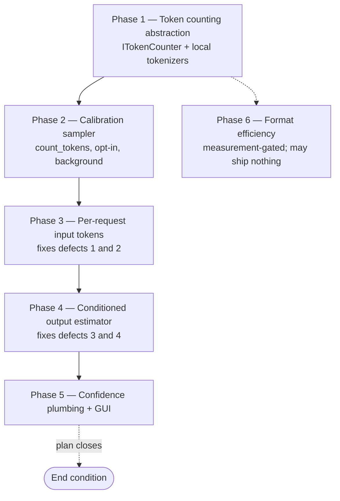

# Counterfactual Token Estimation Plan

> **Status: Phases 0-3 implemented; Phases 4-6 outstanding.** The phase-by-phase execution plan for
> [ADR-0009](../adr/0009-per-request-counterfactual-token-estimation.md), which decided to price the
> Routing ROI counterfactual from the request's own prompt instead of a global per-model token average.
> **End condition:** this plan closes when Phase 5 ships the GUI confidence surfacing. Findings after
> that start a new document rather than extending this one.

**Builds on:** [`self-organizing-classification-plan.md`](self-organizing-classification-plan.md)
Phase T4 (shipped) and [`routing-roi-regret-plan.md`](routing-roi-regret-plan.md) (shipped), which
together introduced and extended `TaxonomyComparisonService`.
**Does not touch:** [`token-tracking-implementation-plan.md`](token-tracking-implementation-plan.md)'s
six shipped phases. `UsageLedger`, `UsageRollupStore`, `PriceCatalog`, `CostConfidence`, and
`CostReconciliationService` are all retained unchanged. Nothing in this plan replaces token *monitoring*;
it improves token *estimation* for the one figure that was never measured.

## The defect

`TaxonomyComparisonService.EstimateCounterfactual` prices the baseline model from
`ITranscriptStore.LoadObservedTokenAveragesAsync`, an all-time unweighted global mean per model. Four
consequences, in descending severity:

| # | Defect | Effect on the ROI chart |
|---|---|---|
| 1 | Estimate is unconditioned on the request | A 500-token turn and a 150,000-token turn get the **same** baseline. Per-turn bars carry near-zero per-turn information. |
| 2 | Cache tokens dropped | Baseline systematically under-estimated versus the actual, which *is* priced cache-aware. Biases ROI toward "routing lost". |
| 3 | `null` for never-routed models | The cold-start case the counterfactual exists for produces no answer at all. |
| 4 | No dimension conditioning, no recency window | A model's behavior six months ago dominates today's estimate. |

## Ground rules (apply to every phase)

- **Phase completion criteria** (from `AGENTS.md`): zero build warnings/errors (repo-wide
  `TreatWarningsAsErrors`), full test suite green, ≥80% coverage, no unit test over 5 seconds, accurate
  XML docs on every touched member (`GenerateDocumentationFile` + `CS1591`).
- **Nothing lands on the proxy hot path.** `request_transcripts` already persists `prompt_text`,
  `dimension`, and `input_tokens`, and `TaxonomyComparisonService` already drains under the
  `InFlightRequestGauge` hard pause. `ProxyMiddleware` and `RequestTelemetryPublisher` are not modified
  by any phase in this plan.
- **Offline-first.** Every estimate must be computable with no network. Provider APIs are a calibration
  signal, never a runtime dependency.
- **Never invent a number.** The existing contract — *"a caller states 'no estimate' instead of pricing
  an invented token count"* — is preserved verbatim. Every new rung that degrades accuracy degrades the
  reported `CostConfidence` with it.
- **Money is never `REAL`** in new columns: invariant-culture decimal strings in `TEXT`, matching
  `PriceCatalogRepositoryBase`. Timestamps are round-trip UTC ISO 8601.
- **Schema migrations** use the guarded `ALTER TABLE ... ADD COLUMN` pattern `TranscriptDatabase`
  already uses for `session_id`, `scorer_version`, and `dim_best_model`.
- **Proto changes are additive only**: new `optional` fields with fresh field numbers.
- **Logging** is Serilog structured logging with static message templates, per `AGENTS.md`.
- **No new GUI window.** Phase 5 extends the existing Cost Analytics tooltip, so the `DialogShell`
  contract is not triggered.

## Phase map



Phases 1→5 are strictly ordered: each consumes the previous phase's data layer. Phase 6 depends only on
Phase 1's tokenizer and is independently abandonable.

---

## Phase 1 — Token counting abstraction and local tokenizers

New folder `src/TotallyHotArcRouter/Telemetry/Tokenization/`.

| Type | Responsibility |
|---|---|
| `ITokenCounter` | `bool TryCountPromptTokens(string text, ModelKey key, out int tokens, out TokenCountSource source)`. Never throws; returns `false` rather than guessing. |
| `TokenCountSource` | `ProviderExact`, `LocalCalibrated`, `LocalUncalibrated`, `Heuristic`, `Unavailable`. Deliberately parallel to `CostConfidence` so Phase 5 maps one onto the other. |
| `TiktokenTokenCounter` | Wraps `Microsoft.ML.Tokenizers`. `o200k_base` for the GPT-4o family, `cl100k_base` otherwise. |
| `CalibratedTokenCounter` | Decorates a local counter with the Phase 2 per-model factor. Reports `LocalCalibrated` when a trusted factor exists, `LocalUncalibrated` otherwise. |
| `HeuristicTokenCounter` | The `ceil(chars / 4)` floor for models with no encoder. Reports `Heuristic` so it can never be mistaken for a measurement. |
| `TokenCounterRegistry` | Resolves a `ModelKey` to its counter. |

Notes:

- Encoders are expensive to construct and thread-safe once built. Cache one per encoding in a
  `static readonly Lazy<>`, following `OnnxEmbeddingClient`'s double-checked lazy-init pattern.
- Model-spelling normalization goes through the existing `ModelNameCanonicalizer.Canonicalize`. Do not
  add a second normalization path.
- Packages (per-csproj — the repo has no `Directory.Packages.props`): add `Microsoft.ML.Tokenizers`,
  `Microsoft.ML.Tokenizers.Data.Cl100kBase`, and `Microsoft.ML.Tokenizers.Data.O200kBase` to
  `TotallyHotArcRouter.csproj`. Encoding data is embedded in these packages, so unlike the ONNX
  artifacts there is no download and no first-run latency.

**Tests:** encoder selection per model family; canonicalization round-trip; heuristic fallback for an
unknown model; `Unavailable` on null/empty input; the same text counted twice returns the same number.

## Phase 2 — Calibration sampler

| Type | Responsibility |
|---|---|
| `AnthropicTokenCountClient` | `POST /v1/messages/count_tokens`. Modeled directly on `AnthropicUsageReportClient`: same `anthropic-version: 2023-06-01` header, same `CostReconciliationRetryPolicy.SendWithRetryAsync`, same tolerance for an evolving response shape. Uses a **routed provider API key, not the Admin key**. |
| `TokenCalibrationStore` | New `model_token_calibration` table in `PriceCatalogDatabase`: `model`, `provider`, `factor`, `sample_count`, `updated_at_utc`. |
| `TokenCalibrationService` | `BackgroundService`. Samples a bounded number of recent transcripts per cycle, counts each locally and via the provider, updates the factor as an exponentially-weighted mean so one outlier cannot swing it. |
| `TokenizationOptions` | `CalibrationEnabled` (**default `false`**), `MaxSamplesPerCycle`, `MinSamplesForTrust`, `CycleInterval`. |

- The service runs only while `InFlightRequestGauge.Count == 0`, reusing the hard pause
  `TaxonomyComparisonService` established — calibration must never contend with served traffic.
- A factor below `MinSamplesForTrust` is stored but **not** applied; `CalibratedTokenCounter` reports
  `LocalUncalibrated` until the threshold is met.

**Tests:** stubbed `HttpMessageHandler` following `AnthropicUsageReportClientTests`; factor convergence
under repeated samples; outlier resistance; **disabled-by-default asserted explicitly, with no HTTP call
made when off** (the ADR's central safety claim); no sampling while requests are in flight.

## Phase 3 — Per-request counterfactual input tokens

The phase where the ROI number actually changes. Fixes defects 1 and 2.

- Extend `ITranscriptStore` with `LoadCounterfactualInputsAsync`, returning `prompt_text` alongside the
  fields the comparison already reads, so the service can tokenize the real prompt.
- Rewrite `EstimateCounterfactual` to count the **baseline model's own** tokenization of this
  transcript's prompt, replacing the global average on the input side.
- Price through `ModelPrice.EstimateCost(UsageInfo, out bool usedCacheRateFallback)` — the cache-aware
  overload. **Superseded during implementation** — see deviation 3: the baseline model never served this
  session, so it would have met a *cold* prompt cache, and the standard input rate is the correct
  per-turn counterfactual. Cache usage is deliberately never passed to the baseline.
- When the turn recorded no input usage at all, fall back to the observed average rather than returning
  nothing.

**Tests:** two turns with the same baseline model whose observed input usage differs ~100× now produce
materially different baselines; two turns with *identical* prompt text but different observed usage
still price differently (guarding against re-anchoring on the text fragment); a turn with no recorded
usage still prices from the average; unknown baseline model still yields `null`.

## Phase 4 — Conditioned output estimator

Fixes defects 3 and 4. Counterfactual output tokens remain an estimate — a model that never ran produced
no output — but a far better conditioned one.

- Replace `ModelTokenAverage` with `ConditionedTokenAverage`, keyed
  `(model, dimension, promptSizeBucket)`.
- Buckets are fixed log-scale boundaries — `<1K`, `1–4K`, `4–16K`, `16–64K`, `>64K` — so they are
  reproducible across restarts, the same reproducible-bucket discipline `UsageRollupStore` applies to
  its pinned timezone.
- Widen the SQL to `GROUP BY routed_model, dimension, <bucket expression>` and add a recency window.
- **Back-off ladder**, each rung degrading reported confidence:

  ```mermaid
  flowchart LR
      A["(model, dimension, bucket)"] -->|thin or absent| B["(model, dimension)"]
      B -->|thin or absent| C["(model)"]
      C -->|never routed to| D["CodeRouterBench prior<br/>DimensionModelScoreMatrix / LoadPriorMatrix"]
      D -->|corpus not synced| E["null — no estimate"]
  ```

  The CodeRouterBench rung is the cold-start fix for defect 3.
- Require a minimum `ObservationCount` per cell before trusting it, falling to the next rung otherwise —
  a bucket with two samples is noise, not an average.

**Tests:** each ladder rung in isolation; bucket boundary values (exactly 1K, exactly 64K); thin cells
falling through; recency window excluding stale rows; the prior rung serving a never-routed model.

## Phase 5 — Confidence plumbing and GUI

- Add `baseline_token_source` and `baseline_confidence` columns to `taxonomy_comparisons`, plus matching
  fields on `TaxonomyComparisonRecord`.
- Map `TokenCountSource` → `CostConfidence`, so the baseline half of ROI is labeled by the same ladder
  that already governs the actual half.
- `CostChartBuilder.BuildRoi` currently renders `"Baseline ({name}): {money} — estimate"` and
  `"Net saving: … — estimate"`. Extend `MetricTurnPoint` with the confidence and replace the bare word
  *estimate* with the actual basis — e.g. *"measured prompt, calibrated"* versus *"observed average"*.
- Proto: additive `optional` fields with fresh numbers only.

**Tests:** `CostChartBuilderTests` / `ChartJsonTests` for the new tooltip basis; store round-trip for the
new columns; an old client still parses the widened proto.

**On completion, this plan closes.**

## Phase 6 — Format efficiency (measurement-gated, may correctly ship nothing)

The only part genuinely derived from TokenMeter, and deliberately last and optional.

Arc Router is a proxy and **must** pass user prompts through byte-for-byte — re-encoding a caller's
prompt would corrupt the request. Format work therefore applies *only* to payloads Arc Router itself
authors: principally the grader/judge prompts under `src/TotallyHotArcRouter.Quality/Grading/`
(`QualityGrader` and the G-Eval / CodeJudge / ICE-Score / RACE portfolio), which are structured and
repetitive.

1. **Measure first.** A test-only `PayloadTokenProfiler` reports, for representative grader payloads,
   token count as-authored versus as TOON. Report the delta.
2. **Confirm and drop the binary formats.** BSON, MessagePack, CBOR, Avro, and Protobuf are near-certain
   losses once base64-encoded for a text API. Measure once to confirm, then drop them. Only a text
   format that removes key repetition can win.
3. **Ship only if it clears a stated bar** — proposed: **≥15% reduction on a real grader payload**. Per
   [ADR-0008 Amendment 1](../adr/0008-codegraph-serena-dual-engine-code-smell-pipeline.md#amendment-1-2026-09-02-stop-rules),
   *"file nothing" is a valid outcome*: a measured 3% saving does not justify a hand-written C# TOON
   encoder plus a new prompt-format failure mode. If the bar is not cleared, record the measurement here
   and close the phase.

Do **not** port TokenMeter's converters wholesale — nine of the ten are irrelevant to this use, and the
repository publishes no LICENSE file, so its code is not safely reusable regardless.

---

## Deviations from the plan as written (recorded during implementation)

Eight things turned out differently once the code was in front of us; three came out of PR review. All are deliberate; none change the
decision recorded in ADR-0009.

1. **No `ITranscriptStore` change was needed for Phase 3.** The plan called for a new
   `LoadCounterfactualInputsAsync`. Unnecessary: `EstimateCounterfactual` already receives the full
   `TranscriptRecord`, which carries `PromptText`. The prompt was in hand the whole time.
2. **No `ITranscriptStore` change was needed for Phase 2 either.** `ListSessionsAsync` already returns
   recent rows carrying both `PromptText` and `RoutedModel` — exactly the pair a calibration sample needs
   — so the sampler reuses it rather than adding a query. Together with (1), this removes the largest
   mechanical cost the plan anticipated: the five-plus test-fake updates never had to happen.
3. **Defect 2 (cache tokens) resolves differently than planned, and mostly dissolves.** The plan said to
   carry the actual turn's `CacheReadTokens`/`CacheCreationTokens` into the baseline via the cache-aware
   `EstimateCost` overload. That would be wrong: the baseline model never served this session, so it would
   have met a **cold** prompt cache on this turn. Pricing the counted prompt at the standard input rate is
   the correct per-turn counterfactual. (Two supporting facts: the previous under-estimate came from the
   cache-blind *average*, which per-request counting already replaces; and cache-token columns live on
   `usage_ledger`, not `request_transcripts`, so they were never reachable from here anyway.) Modelling a
   warm baseline cache would mean replaying the whole session against the baseline — a materially larger
   question, deliberately not in scope. Documented in the method's own `<remarks>`.
4. **The per-request figure is anchored on observed usage, not on the captured prompt text.** Raised in
   PR review: `TranscriptRecord.PromptText` holds only the newest user message
   (`RequestTextExtractor.ExtractNewestUserMessage`), so pricing it as the whole input would omit
   conversation history, the system prompt, tool definitions, and tool results — most of a request on the
   agentic traffic this router proxies. That would bias every baseline low and so *overstate* routing
   savings. The estimator now scales the turn's own observed `input_tokens` (the provider's count of the
   full billable input) by the two models' tokenizer ratio, measured on the text the row does retain.
   Tokenization still does real work; it just supplies the model-to-model ratio rather than the scale.

5. **The tokenizer ratio carries its own provenance.** Raised after review: different models genuinely
   tokenize the same text differently, but the counter only ships two tiktoken encodings, so Claude,
   Gemini, and Mistral all fall back to `cl100k_base`. A ratio between any two of them is `1.0` *by
   construction* — and `1.0` is indistinguishable from the correct answer for two models that really do
   share a tokenizer. Anthropic's own Opus 4.7+ tokenizer runs roughly 1×–1.35× its predecessor, so even
   a Claude-to-Claude ratio can be materially wrong while looking ordinary.

   `TokenCountSource` now distinguishes `LocalNative` (the model's own tokenizer) from `LocalProxy` (a
   stand-in), and `TokenizerRatio` calls a ratio *measured* only when both sides are `LocalCalibrated` or
   better. The value and its provenance are persisted on `taxonomy_comparisons`
   (`baseline_tokenizer_ratio`, `baseline_tokenizer_ratio_measured`), so a stored savings figure can be
   audited for whether the two models were actually compared. Calibration remains the mechanism that
   turns a proxy into something comparable — which is a further reason it is worth enabling.

6. **Calibration re-checks the in-flight gauge every iteration.** Also from review: the original cycle
   checked once before the loop, so traffic arriving mid-cycle still met outbound calls. The hard pause is
   worth nothing if it only holds for the instant the cycle began.

7. **Calibration takes its own credential.** Rather than borrowing a key the router already holds for
   proxying, `TokenizationOptions.ApiKeyEnvVar` names the environment variable holding an ordinary
   inference key. Enabling the feature and naming the credential it may spend are two separate operator
   acts. ADR-0009's consequences section was updated to match.
8. **A transitive vulnerability had to be pinned out.** `Microsoft.ML.Tokenizers` 2.0.0 pulls
   `Microsoft.Bcl.Memory` 9.0.4, which carries GHSA-73j8-2gch-69rq and fails the repo's `NU1903`
   warnings-as-errors audit. Resolved with a direct pin to 10.0.11, the same technique and comment style
   the existing `SQLitePCLRaw.bundle_e_sqlite3` pin uses.

### What Phase 3 actually changed, measured

Two turns against the same baseline model, differing only in how much input they actually consumed
(`model-b` priced at $100/MTok both ways, averaging 50 output tokens in the fixture):

| | 500-token turn | 150,000-token turn |
|---|---|---|
| **Before** (one global average) | `$0.015` | `$0.015` |
| **After** (per-request) | `$0.055` | `$15.005` |

Both rows are pinned by exact assertions in `RunCycle_PricesLargeAndSmallTurnsDifferently`. The residual
`$0.005` in each "after" figure is the output half, which stays an average until Phase 4 — visible here
as the part that does *not* move with the turn.

### Phase completion evidence (Phases 0-3)

| Gate | Result |
|---|---|
| Build warnings/errors (`src/TotallyHotArcRouter.slnx`) | 0 / 0 |
| Test suite | 2590 passed, 0 failed, 1 skipped (integration, disabled by design) |
| Coverage — `TotallyHotArcRouter.dll` overall | **82.4%** (gate: 80%) |
| Coverage — ADR-0009 new types | **90.8%** (337/371 blocks) |
| Slowest new test class | 0.6s for all 75 tokenization tests (ceiling: 5s each) |

The "before" row is not hypothetical — it is asserted by the companion test
`RunCycle_WithoutATokenCounter_StillPricesFromTheObservedAverage`, which keeps the fallback path covered.

## Blast radius (re-verify with CodeGraph before editing)

- `LoadObservedTokenAveragesAsync` has stub implementations in at least five test files —
  `RequestTelemetryPublisherTests`, `ClusterModelAdminGrpcServiceTests`, `ClusterTrainingServiceTests`,
  `RouterSettingsAdminGrpcServiceTests` — all of which must move with the interface in Phase 4.
- `ModelPrice.EstimateCost` has 13 production callers; Phase 3 changes which overload the comparison
  service calls, not the method itself.
- Do not alter `ManagementFacade`'s public method set, and do not register the new collaborators as
  independently injectable services beyond what the composition root needs (AGENTS.md §5).

## Reuse (do not rebuild)

`ModelNameCanonicalizer.Canonicalize` · `ModelPrice.EstimateCost(UsageInfo, out bool)` ·
`CostConfidence` · `CostReconciliationRetryPolicy.SendWithRetryAsync` · `InFlightRequestGauge` ·
`DimensionModelScoreMatrix` + `TaxonomyComparisonService.LoadPriorMatrix` ·
`PriceCatalogRepositoryBase.TimestampFormat` · `ChartPalette.ColorFor`.

## Validation gate

1. `dotnet build src/TotallyHotArcRouter.slnx` — zero warnings.
2. Run the **built test executables directly**; `dotnet test` reports "Zero tests ran" under this repo's
   xUnit v3 setup. Coverage via `dotnet-coverage`, ≥80%.
3. Phase 3's acceptance test (prompts differing ~100× produce proportionally different baselines).
4. Phase 2's egress check (`CalibrationEnabled` defaults false; no HTTP call when off).
5. Golden-path smoke: proxy a request end to end and confirm the Cost Analytics ROI chart still renders
   with populated tooltips and **unchanged actual-cost figures** — only the baseline half may move.
