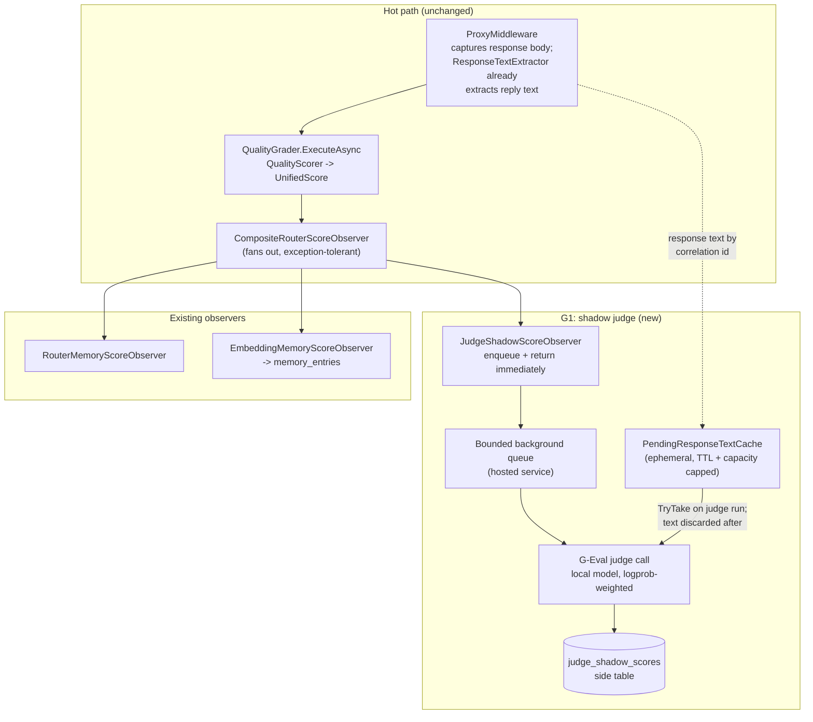

# G-Eval Shadow Scoring and Judge-Verifier Plan

Status: **G1 shipped** (shadow judge observer, ephemeral response-text cache, `judge_shadow_scores` side
table, `is_judge_scored` provenance columns). **G2/G3 proposed**, gated on accumulated shadow data.
**Ordering** (per `src/PLAN.md`'s "Remaining work, in order"): G1 lands after the
`self-organizing-classification-plan.md` T phases and *before* PLAN.md Phase N — the shadow table costs
nothing on the hot path and G2's gate needs volume, so agreement data accumulates passively while the
harness is built. G2 and G3 follow Phase N, gated on that accumulated data.

This plan adds an LLM-as-judge scorer, built on the G-Eval recipe
([docs/research/2303.16634v3.md](../research/2303.16634v3.md)), to the router's scoring pipeline in
two deliberately separated stages:

1. **Shadow mode (G1/G2)** — the judge scores requests *in parallel* with the existing
   `QualityScorer`, records its opinion in a side table, and influences nothing. This measures, on
   this operator's real traffic, how often the judge agrees with execution-grounded scores before it
   is trusted with anything.
2. **Alternate verifier for non-executable dimensions (G3)** — gated on G2's results, the judge
   becomes the scorer of record *only* for dimensions the sandbox cannot execute, where today's
   score collapses to a syntax check.

> **Status note.** Step 1 shipped. Step 2 was **superseded** — code execution was removed from the
> project entirely, which made *every* dimension non-executable and turned the judge into a permanent
> co-grader rather than a fallback. See [`quality-verifier-architecture.md`](quality-verifier-architecture.md),
> and Phase G3 below for what shipped instead and what is still outstanding.

Two cross-cutting requirements apply from the first phase:

- **Raw response text is preserved only until the judge has evaluated it** (ephemeral by default;
  see §Raw-text preservation).
- **Every judge-graded score carries a provenance marker** (`is_judge_scored`) so the learning
  layers can weight, discount, or exclude judge-graded rows later (see §Provenance).

## Why

- **The Verifier is blind on non-executable content.** `QualityScorer.Score`
  (`src/TotallyHotArcRouter.Quality/Scoring/QualityScorer.cs`) folded the execution weight into the
  syntax weight when `result.Executed` was false, so a prose answer — an algorithm explanation, a
  design review, any non-coding dimension — was scored on syntax validity alone. A brilliant answer
  and a useless one received the same `u_i`. *This argument has since become the argument for the judge
  generally, not just for prose: with execution removed, the static grader is never more than parsing
  plus heuristics on any dimension.*
- **Naive LLM-as-judge is measurably noisy.** `src/PLAN.md`'s Settled deferrals (full evidence in
  `data/README.md`'s "Known data-fidelity limit" section) document per-cell
  divergences up to 0.32 in the judge-scored CodeRouterBench dimensions (`algorithm`,
  `test_generation`), attributed to run-to-run LLM-as-Judge noise baked into the released CSV.
  G-Eval's probability-weighted scoring exists precisely to reduce that quantization/variance noise
  and yields a continuous score that maps directly onto the `u_i ∈ [0,1]` shape every downstream
  consumer (`EmbeddingMemory`, `DimensionModelScoreMatrix`, the logreg heads) already expects.
- **Judge bias is real and already has a standing rule here.** G-Eval's own analysis shows LLM
  judges systematically over-score LLM-generated text even against human preference.
  `regret-evaluation-harness-plan.md`'s ground rule ("no fabricated training data" extends to
  fabricated *evaluation* data) is why shadow mode comes first and why provenance is mandatory: a
  judge-graded row must never be indistinguishable from an execution-grounded one.

## Ground rules

- **The routing hot path never blocks on judging.** The judge runs seconds per score; the observer
  chain must hand it work through a bounded background queue and return immediately (the same
  posture `self-organizing-classification-plan.md` sets for all learning writes).
- **Dollar-free is not cost-free.** The judge backbone is a locally served model (no paid backends
  for evaluation — the standing constraint from `regret-evaluation-harness-plan.md`), but local
  inference still costs compute and wall-clock; the queue is bounded and sheds load rather than
  backing up.
- **Shadow mode influences nothing.** Until G3, the judge's score never touches
  `QualityResult.UnifiedScore`, never reaches `memory_entries.score`, and never feeds any voter.
- **Judge scores are never a training reward without provenance.** Any layer that consumes
  `memory_entries` must be able to filter on `is_judge_scored`.
- **Raw text does not outlive its purpose.** The router's memory must not become a transcript store
  (the standing decision in `live-feedback-learning-plan.md`); response text held for judging is
  discarded the moment the judge scores it or its TTL expires.
- Repository conventions apply throughout: zero build warnings, XML docs on every public member,
  Serilog with static message templates, ≥80% coverage, no test over 5 seconds, Mermaid diagrams.

## Architecture

The seam is `IQualityScoreObserver`: `CompositeRouterScoreObserver`
(`src/TotallyHotArcRouter/Router/CompositeRouterScoreObserver.cs`) already fans a scored
`QualityResult` out to each registered observer and swallows individual failures, so a third,
best-effort observer is additive — no existing type changes shape.

## Raw-text preservation (hybrid)

**Requirement:** the agent's raw response text must survive from response completion until the
judge has had a chance to evaluate it — and no longer.

**Default path — ephemeral cache.** A new `PendingResponseTextCache` mirrors
`PendingTaskEmbeddingCache`'s design exactly: keyed by correlation id, TTL-bounded, capacity-bounded,
`TryTake` consumes the slot. It is populated in `ProxyMiddleware` at the same point
`ResponseTextExtractor.TryExtractText` already runs over the buffered response body (the text is
already in hand there — this adds retention, not parsing). The judge's background worker `TryTake`s
the text when it dequeues the job; whether judging succeeds, fails, or the entry ages out, the text
is gone from process memory afterward. Nothing is written to disk. A missing entry (TTL expiry,
capacity eviction, capture raced) is a lost judging opportunity, not an error — logged and dropped,
matching every other best-effort observation path.

**Gated on the judge actually being on.** `ProxyMiddleware` retains nothing unless
`JudgeOptions.Enabled` is true *at that moment*, read from `IOptionsMonitor` rather than captured at
construction. Since that flag is toggleable from the System Settings window, and since it is precisely
what authorizes holding raw response text in memory at all, switching the judge off has to stop retention
immediately rather than at the next restart. Same live-gate posture as T6's `EnableAdaptiveRouting` gate
on transcript writes, a few lines below it in the same method.

**Bounded memory:** worst case is (in-flight unjudged responses × capped text size). The cache caps
per-entry text at a configurable byte limit (default aligned with
`QualityOptions.MaxCapturedOutputBytes`'s philosophy) and total entries at a configurable capacity,
so the ceiling is a few MB regardless of traffic.

**Secondary path — transcript backfill (only when T1 is enabled).** When
`self-organizing-classification-plan.md` Phase T1's opt-in transcript capture exists and is enabled,
the judge worker may additionally read `prompt_text`/`response_text` from `transcripts.db` to score
rows whose ephemeral entry was missed, and to backfill judge scores for recent historical rows. This
path is strictly optional: G1 works with transcript capture off, and this plan adds no new
persistence of raw text anywhere.

## Provenance: `is_judge_scored`

A new boolean column, following the additive-migration convention `RouterMemoryDatabase` and
`PriceCatalogDatabase.MigrateEnabledColumn` already use:

- **`memory_entries.is_judge_scored`** (INTEGER 0/1, default 0). Existing rows backfill as 0 —
  every row written before this plan is execution-grounded by construction. `MemoryEntry` gains the
  matching property; `EmbeddingMemory.AddEntryAsync` threads it through.
- **Transcript row `is_judge_scored`** (when T1's `transcripts.db` exists) — same semantics, set on
  score backfill.

Semantics: `1` means the `score` on this row was produced by the LLM judge rather than by
`QualityScorer`'s structural/execution signals. In G1/G2 no row ever has `is_judge_scored = 1`
(shadow scores live only in the side table); the column lands early anyway so that every learning
consumer (`MemoryKnnVoter`, `EmbeddingLogRegTrainer`, T2's clustering, T4's comparison) can be
written/updated against the final schema once, and can weight, discount, or exclude judge-graded
rows from the day G3 first writes one.

Sibling precedent: this is exactly the pattern T1 already sets for `IsExploratory` — a per-row
provenance bit that exists so later consumers can separate populations instead of discovering too
late that they can't.

## Phase map

| Phase | Deliverable | Depends on | Status |
|---|---|---|---|
| G1 | Shadow judge observer, `PendingResponseTextCache`, `judge_shadow_scores` side table, `is_judge_scored` columns (always 0) | none (T1 optional) | **Shipped** |
| G2 | Agreement/calibration analysis surface over the shadow table; go/no-go criteria for G3 | G1 + accumulated shadow data | Proposed |
| G3 | Judge as scorer of record for non-executable dimensions; first `is_judge_scored = 1` rows | G2 gate passed | Proposed |

---

## Phase G1 — Shadow judge observer

> **Correction (see [`judge-join-deadlock-fix-plan.md`](judge-join-deadlock-fix-plan.md)):** the
> "shipped" status block and §1c below describe `JudgeShadowScoreObserver` as an `IQualityScoreObserver`
> triggered from the write-time observer fan-out. That trigger point deadlocked once
> `QualityScoreAggregator` (Phase N3) started holding a result open for a judge grade instead of writing
> it immediately: an observer that only fires once a held result is written can never start the judge
> that write is waiting on. The type is now `JudgeShadowScoreDispatcher`, an `IAsyncGraderDispatcher`
> started by `QualityScoreAggregator.SubmitAsync` at hold-time, and is no longer part of the observer
> fan-out at all. The narrative below is left as written for history; treat every mention of
> `JudgeShadowScoreObserver` as `JudgeShadowScoreDispatcher` under the corrected design.

> **Status: shipped.** `TotallyHot.ArcRouter.Judge` (`src/TotallyHotArcRouter/Judge/`): `JudgeOptions`
> (off by default; **not bound from `appsettings.json`** — see §1a), `JudgeModelSelector` (resolves a free
> Providers-screen model per call), `PendingResponseTextCache`
> (TTL + capacity + per-entry char cap, mirroring `PendingTaskEmbeddingCache`), `GEvalJudgeClient`
> (`IJudgeClient` over the selected provider's OpenAI-compatible chat-completions endpoint,
> probability-weighted 1-5 scoring from `logprobs`/`top_logprobs` with a single-sample fallback),
> `JudgeShadowScoreObserver`
> (`IQualityScoreObserver`, enqueues onto a bounded `JudgeShadowScoreQueue` and returns immediately - shed,
> never block, on a full channel), `JudgeShadowScoreDrainService` (a `BackgroundService` draining the
> channel continuously, `TryTake`s the cached response text, calls the judge, writes one
> `judge_shadow_scores` row, always drains the cache slot), and `JudgeShadowScoreRetentionService` (5-minute
> `PeriodicTimer` purge, mirroring `TranscriptRetentionService`). `judge_shadow_scores` and
> `memory_entries.is_judge_scored` are additive migrations on `RouterMemoryDatabase` (its existing
> `judge_shadow_scores` table is unconditionally created; only the observer that would ever write to it is
> conditionally registered). Wired into `ProxyMiddleware` (a new optional `pendingResponseTextCache`
> parameter, populated at the same point `responseSummary` is already computed) and
> `ServiceCollectionExtensions` (mirroring the `TranscriptScoreObserver` conditional-registration pattern
> exactly). Covered by `src/TotallyHotArcRouter.Tests/Judge/*` - cache TTL/capacity/truncation, queue
> shed-on-full, observer enqueue/skip/full-channel, G-Eval logprob-weighted and fallback parsing, SQLite
> store CRUD + migration idempotency, drain-service text-always-consumed behavior, retention purge, and an
> explicit byte-identical-`memory_entries`-with-and-without-the-judge-observer test proving shadow mode
> never influences routing.
>
> **Two scoped-down deviations from this section's original text**, both explicitly allowed by this plan's
> own "acceptable G1 minimum, per the plan's own allowance for iteration" language and recorded in
> `src/PLAN.md`'s Settled deferrals:
> 1. **Auto-CoT is a static per-dimension prompt constant, not generated-and-cached.** §1a below describes
>    "cached auto-CoT steps ... generated once per dimension and cached with the artifact conventions the
>    codebase already uses." `GEvalJudgeClient.DimensionCriteria` is instead a hardcoded dictionary of
>    per-dimension G-Eval criteria authored directly in code. `JudgeOptions.PromptVersion` still exists and
>    is stamped on every shadow row, so a future move to generated-and-cached CoT is a version bump, not a
>    schema change.
> 2. **The n-sample estimation fallback is a single best-effort numeric parse**, not the paper's full
>    n-sample estimation, when the backbone exposes no logprobs at all. `GEvalJudgeClient` parses the first
>    1-5 digit in the message content and normalizes it; there is no repeated sampling or averaging.

**1a. Judge backbone.** *(Revised after G1 shipped — see the revision note below.)* A configurable,
locally served OpenAI-compatible endpoint (LM Studio /
llama.cpp / Ollama — the operator chooses; the plan assumes only "local and free"). Prefer token
logprobs for G-Eval's probability weighting — one inference call per score; fall back to the paper's
n-sample estimation only when the serving stack exposes no logprobs, with the sample count
configurable and defaulting low. Prompts follow the G-Eval recipe verbatim (task introduction +
per-dimension criteria + cached auto-CoT steps + form-filling cue); the auto-CoT is generated once
per dimension and cached with the artifact conventions the codebase already uses (embedding-model
and prompt-version guards, mirroring the trained-artifact guards in
`self-organizing-classification-plan.md`).

> **Revision — the backbone is a Providers-screen model, not a hardcoded endpoint.** As originally
> shipped, §1a was two `JudgeOptions` defaults: `BaseUrl = http://localhost:1234/api/v1/chat` and
> `Model = qwen2.5-7b-instruct`. Nothing validated either, and that default path does not match LM Studio's
> OpenAI-compatible route (`/v1/chat/completions`) — a misconfiguration indistinguishable from "no traffic
> yet", since the drain worker swallows failures. Both properties are **removed**. `JudgeModelSelector`
> instead resolves a route from the operator's own provider configuration on every call, and
> `GEvalJudgeClient` reaches it with the forwarding path's own primitives
> (`ProviderUrlBuilder.BuildPassthroughUrl`, `ResolvedModelRoute.ExtraHeaders`). Eligibility is: provider
> flagged `IsFree` (a *known* zero — judging runs on every scored request, so an accidentally-paid backbone
> would bill continuously), provider and model both enabled, and **not** a Bedrock route, which is not
> OpenAI-shaped and cannot be reached without the SigV4 SDK client. The judge deliberately does **not** loop
> back through our own proxy: a judge call re-entering `ProxyMiddleware` would itself be graded and would
> enqueue a further judging job. With no eligible model the judge **abstains** — no row, no fabricated
> score — matching `LogRegVoter`/`ClusterBestVoter`'s no-placeholder posture. The operator picks a specific
> backbone, or leaves it automatic, from the System Settings window; an ineligible pick falls back to the
> first eligible model and the substitution is logged.
>
> **Configuration moved out of `appsettings.json` entirely.** `JudgeOptions.Enabled` and the new
> `JudgeOptions.ModelName` are `router_settings` rows layered on by `JudgeSettingsConfigureOptions` — the
> `JudgeOptions` counterpart of T6's `RouterSettingsConfigureOptions`, with `RouterSettingsReloadToken` now
> serving both options types so one Save reloads both. `Enabled` is therefore **live**: the observer joins
> the fan-out unconditionally and gates per call, the drain worker and retention loop gate per job/tick
> rather than exiting at startup, and — see §Raw-text preservation — `ProxyMiddleware` reads the flag from
> the monitor before retaining any response text.

**1b. `PendingResponseTextCache`.** As specified in §Raw-text preservation. Registered in DI beside
`PendingTaskEmbeddingCache`; populated in `ProxyMiddleware` where response text is already
extracted; options for TTL, capacity, and per-entry byte cap under a new `JudgeOptions` section,
all off unless `JudgeShadowEnabled` is true (default **false** — enabling the judge is a deliberate
choice, the same posture as T1's capture toggle).

**1c. `JudgeShadowScoreObserver`.** An `IQualityScoreObserver` registered as a third element of the
`CompositeRouterScoreObserver` list. `ObserveAsync` does two cheap things and returns: snapshot the
fields it needs from the `QualityResult` (correlation id, dimension, model, `UnifiedScore`), and
enqueue onto a bounded channel. When the channel is full, the job is dropped with a debug log —
shed, never block. A hosted service drains the channel: `TryTake` the response text, run the G-Eval
call against the configured backbone, write one row to the side table, discard the text.

**1d. `judge_shadow_scores` side table.** Own SQLite table (in the router-memory database, additive
migration): `id`, `correlation_id`, `created_at_utc`, `dimension`, `model`, `verifier_score`,
`judge_score`, `judge_model`, `judge_prompt_version`, `judge_latency_ms`, `used_logprobs` (0/1),
`executed` (0/1 — whether the verifier's score was execution-grounded or Tier-0-only, the single
most important split for G2). Retention: same startup-plus-periodic purge pattern as T1e, bounded
by `RetentionDays`/`MaxRows`.

> **Schema revised.** `verifier_score` was renamed `static_score` and `executed` was dropped when code
> execution was removed — a grade can no longer be execution-grounded, and a column that must read 0
> forever preserves the shape of a fact while discarding its meaning. `RouterMemoryDatabase`
> migrates existing databases in place (rename + drop column); historical rows are kept, since their
> score column still means "the non-judge grade for this request".

**1e. `is_judge_scored` columns.** As specified in §Provenance — landed here, always written 0.

**Exit:** with `JudgeShadowEnabled`, one scored request produces at most one shadow row and
`UnifiedScore`/`memory_entries` are byte-identical to a run with the judge disabled (asserted by
test); with it disabled (default), no cache, no queue, no table writes; response text is
demonstrably absent from the cache after judging and after TTL expiry; a full channel sheds without
affecting routing latency; all migrations are additive and re-runnable.

## Phase G2 — Calibration analysis and the G3 gate

Runs after G1 has accumulated shadow data on real traffic (minimum row count configurable; no fixed
calendar time).

> **Revised.** This phase was designed around an `executed` flag that split execution-grounded rows from
> Tier-0-only ones. Code execution has since been removed entirely (see
> [`quality-verifier-architecture.md`](quality-verifier-architecture.md)), the column is dropped, and
> `verifier_score` is now `static_score`. Every split below that keyed on `executed` is replaced by
> `syntax_authoritative` — whether a real parser or a heuristic produced the static grade — which is the
> nearest remaining proxy for "how much do we trust the non-judge number".

- **Agreement analysis**, split by dimension and by whether the static grade was authoritative: rank
  correlation (Spearman) and mean absolute difference between `judge_score` and `static_score` where both
  are meaningful, plus score-distribution shape (is the judge collapsing to one value? G-Eval's known
  failure without probability weighting).
- **Self-preference probe**: per-model mean judge score vs. per-model mean static score — a judge that
  systematically inflates one model family relative to its static grades exhibits exactly the bias the
  paper warns about, quantified on local traffic.
- **Surface**: a read-only admin/gRPC status view (following the trainer-status precedent in
  `self-organizing-classification-plan.md` T5), not a GUI build-out — numbers first.

**Segment on `judge_model`.** The backbone is now whichever free Providers-screen model the selector
resolved for each row (§1a's revision note), and automatic fallback can change it mid-accumulation when a
provider is toggled. Every analysis above must therefore group by `judge_model` rather than assume one
backbone across the table — a mixed sample would otherwise blend two models' calibration into one
meaningless correlation. `used_logprobs` deserves the same treatment: rows scored through the
single-sample fallback carry exactly the quantization noise probability weighting exists to remove, so
they are not comparable with logprob-weighted rows.

**The G3 gate is moot as written.** Its first condition — "on *executed* rows, judge rank-correlates
with the verifier at or above a configured floor" — was the whole point of the gate: prove the judge
reproduces ground truth *where ground truth exists*, before letting it stand in where it does not. There
are no execution-grounded rows any more, so that condition can never be evaluated. This is an honest loss,
not a technicality: the judge was promoted (see below) without the calibration evidence this phase was
designed to demand.

Conditions (2) non-degenerate score distribution and (3) self-preference skew below a ceiling remain
measurable against `static_score` and are still worth running as a standing regression check.

## Phase G3 — Judge as alternate verifier for non-executable dimensions — **SUPERSEDED**

> **Superseded and overtaken.** G3 proposed letting the judge score *only* results the sandbox could not
> execute, keeping execution authoritative everywhere else. Removing execution made every dimension
> non-executable, so the narrow carve-out this phase describes became the whole surface — and the
> implementation went further than G3 did: rather than the judge *replacing* the score on eligible rows,
> both grades are now blended into one via `QualityScoreAggregator`, and the judge defaults to **on**
> whenever a free backbone resolves.
>
> The design below is retained because its learning-layer requirements were the right ones and are still
> outstanding — see the note at the end of this section.

The original scope: **only dimensions/results where the sandbox produced no execution signal**
(`result.Executed == false` and the dimension is configured judge-eligible). Executable dimensions keep
`QualityScorer` unconditionally — where ground truth is available, an opinion never replaces it.

- A judge-eligible, non-executed result's `u_i` becomes the G-Eval score (normalized to `[0,1]`),
  written through the existing observer path with `is_judge_scored = 1` on the `memory_entries` row
  (and the transcript row when present).
- The shadow table keeps recording in parallel — G2's analysis becomes a permanent regression check
  rather than a one-time gate.
- Learning-layer handling lands in the same phase, not later: `MemoryKnnVoter` and the logreg/
  clustering trainers gain a configurable policy for judge-graded rows — include, exclude, or
  down-weight (default: **down-weight**, weight configurable) — so the first `is_judge_scored = 1`
  row that exists is already handled deliberately by every consumer.

**Exit:** a non-executable, judge-eligible request produces a `memory_entries` row whose score came
from the judge and whose `is_judge_scored` is 1; an executable request is provably untouched by the
judge path; every learning consumer honors the configured judge-row policy under test; disabling
the judge cleanly reverts non-executable dimensions to today's Tier-0 behavior.

### What actually shipped, and what is still owed

Shipped: the judge contributes to `u_i` on every graded request, blended with the static score rather than
replacing it, with exactly-once write semantics and graceful static-only degradation.

**Still owed from this phase, and tracked as outstanding:**

- **`is_judge_scored` provenance is not being set on blended rows.** The column exists and the plumbing
  is there, but with every row now potentially judge-influenced, the flag needs a definition — "the judge
  contributed at all" or "the judge contributed more than X of the weight" — before it means anything.
- **The learning-layer policy was never implemented.** `MemoryKnnVoter` and the logreg/clustering trainers
  still have no include/exclude/down-weight policy for judge-influenced rows. G3 was explicit that this
  should land in the same phase as the promotion, precisely so the first such row was already handled
  deliberately. It did not.

## Non-goals

- Judge scores as a training reward for any model tuning — out of scope permanently, per the
  regret plan's ground rule.
- Any paid or remote judging backend.
- Persisting raw prompt/response text anywhere new — the only persistent text store remains T1's
  opt-in `transcripts.db`, owned by that plan.
- Replacing `QualityScorer` on executable dimensions, in any phase.

## Key references

- [docs/research/2303.16634v3.md](../research/2303.16634v3.md) — the G-Eval recipe, its
  probability-weighted scoring, and the self-preference bias analysis this plan's gates encode.
- `docs/router/self-organizing-classification-plan.md` — T1 transcript capture (optional secondary
  text source; `IsExploratory` provenance precedent), trainer/artifact conventions.
- `docs/router/regret-evaluation-harness-plan.md` — the no-fabricated-evaluation-data ground rule
  and the no-paid-backend constraint.
- `src/TotallyHotArcRouter.Quality/Scoring/QualityScorer.cs` — now the three-axis
  syntax/analysis/judge blend; the non-executed fold this plan's G3 addressed is gone.
- `src/TotallyHotArcRouter.Quality/Grading/QualityScoreAggregator.cs` — the join that makes the judge a
  co-grader without double-counting.
- `src/TotallyHotArcRouter/Router/CompositeRouterScoreObserver.cs` — the observer seam G1 plugs
  into.
- `src/TotallyHotArcRouter/Telemetry/ResponseTextExtractor.cs` and
  `src/TotallyHotArcRouter/Proxy/ProxyMiddleware.cs` — where response text already exists in hand
  for the ephemeral cache.
- `src/PLAN.md` Settled deferrals + `data/README.md`'s "Known data-fidelity limit" — the measured
  LLM-as-Judge noise motivating probability weighting.
