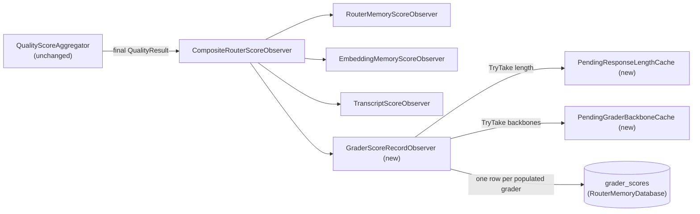

# Phase Q4: Grader Reliability Measurement

Status: **shipped, CLI surface only — the gRPC/Governance-panel surface below is deliberately deferred.**
Scoped in response to `src/PLAN.md`'s "Remaining work, in order" item 1: Q0–Q3 are shipped (three-grader
portfolio registered, `ExtraWeights` set to modest, not-yet-tuned starting values); Q4 measures
per-dimension, per-grader agreement, verbosity skew, and self-preference skew *before* Q5 touches any weight
(`docs/research/code-quality-metrics-assessment.md` §5.1,
`docs/router/quality-verifier-architecture.md`'s Q3 status note).

> **What actually shipped.** The `grader_scores` table, `GraderScoreRecordObserver`'s capture (unconditional
> in the fan-out), `PendingResponseLengthCache`/`PendingGraderBackboneCache`, `GraderScoreRetentionService`,
> `IGraderReliabilityAnalyzer`/`GraderReliabilityAnalyzer` (Spearman agreement, verbosity skew,
> self-preference skew, all suppressed below `MinimumSampleSize`), and the `--run-grader-reliability-report`
> CLI flag — all exactly as designed below. **Deferred, deliberately**: the `GraderReliabilityAdminService`
> gRPC surface and the Governance panel tab under "Surfacing it". The analyzer is pure SQL-plus-math with no
> live-provider dependency, so it is fully exercisable and testable via the CLI alone; the gRPC/GUI layer
> adds a proto surface, a GUI client, and a Blazor panel with no additional measurement value over the CLI,
> and is a separable, independently-shippable follow-up rather than something this phase's exit criterion
> requires. One implementation deviation from the design below: rather than adding a `GraderBackboneModels`
> map to `QualityResult` (which would have touched `IQualityScoreAggregator`'s join contract), the shipped
> code threads backbone identity through a new side cache, `PendingGraderBackboneCache`, populated by
> `JudgeShadowScoreDrainService`/`PortfolioGraderDrainService` at score time and read once by
> `GraderScoreRecordObserver` — strictly more additive than the original proposal, since it leaves
> `QualityResult`, `QualityScoreAggregator`, and every existing grader-join test untouched.

**Q4 produces numbers. It changes no code path that scores a live request.** `DimensionWeightOptions`,
`QualityScorer`, and `QualityScoreAggregator`'s blend logic are all read-only from this phase's
perspective. Whether and how to act on Q4's findings is Q5's decision, gated on Q4's report existing.

## Why this needs new persistence first

Today, once a request is scored, only the **blended** `QualityResult.UnifiedScore` survives:

- `RouterMemoryScoreObserver` folds it into `RouterMemory`'s running `(dimension, model)` sum/count.
- `TranscriptScoreObserver` backfills the same single number onto a transcript row (when transcript
  capture is on).
- `QualitySignalEvent` carries the three named axes (`SyntaxValid`, `AnalysisScore`, `JudgeScore`) to the
  live dashboard tile, but that is a fire-and-forget telemetry publish, not a queryable store, and it does
  not carry `QualityResult.GraderScores` (the Q3 portfolio) at all.

None of that is enough to ask "does CodeJudge agree with the judge on `bug_fixing`?" or "does RACE score
verbose answers higher regardless of quality?" — those questions need every grader's **individual** score
for the **same** request, not the number they collapsed into. Q4's first deliverable is therefore a new
table, not a report.

## Ground rules

- **Additive only.** A new observer, a new table, a new read-only analysis service. Nothing in
  `QualityScoreAggregator`, `QualityScorer`, or any existing observer changes behavior.
- **No new transcript store.** `live-feedback-learning-plan.md`'s standing decision stands: this phase
  records *scores* and a *response length integer*, never raw response text. The existing
  "ephemeral until judged" rule for response text is unaffected — Q4 reads a length, not the text itself,
  and that length is recovered the same hold-time-cache way `PendingResponseTextCache` already works,
  not by extending that cache's lifetime.
- **Bounded and disposable, like `judge_shadow_scores`.** Same FIFO/TTL retention shape
  (`JudgeShadowScoreRetentionService`'s pattern), same "costs nothing on the hot path" posture — one
  `INSERT` per grader that actually produced a score, off the request's critical path.
- **Missing is not zero.** A grader that abstained contributes no row for that request, exactly like
  `GraderScores` already drops rather than zeroes a missing axis. Q4's statistics must never treat an
  absent grader as a score of 0.
- **No fabricated agreement.** A correlation computed from too few paired observations is noise, not
  signal — the report must suppress (not zero-fill) any per-dimension/per-grader-pair statistic below a
  minimum sample size, and say so explicitly rather than showing a misleadingly precise number.
- Repository conventions apply throughout: zero build warnings, XML docs on every public member, Serilog
  with static message templates, ≥80% coverage, no test over 5 seconds, Mermaid diagrams.

## New persistence: `grader_scores`

One row per `(request, grader)` pair — i.e. a request graded by four graders produces up to four rows,
not one. Lives in `RouterMemoryDatabase` alongside `judge_shadow_scores` (same file, same
no-raw-text-so-no-opt-in-creation reasoning `SqliteJudgeShadowScoreStore`'s doc comment already gives).

```sql
CREATE TABLE IF NOT EXISTS grader_scores (
    id INTEGER PRIMARY KEY AUTOINCREMENT,
    correlation_id TEXT NOT NULL,
    created_at_utc TEXT NOT NULL,
    dimension TEXT NOT NULL,
    model TEXT NOT NULL,              -- the graded candidate model
    grader_key TEXT NOT NULL,         -- GraderKeys.{Analysis,Judge,CodeJudge,IceScore,Race}; syntax excluded (boolean, not a [0,1] score)
    score REAL NOT NULL,
    grader_backbone_model TEXT NULL,  -- resolved backbone for judge/portfolio graders; null for the static analyzer
    response_length_chars INTEGER NULL
);
CREATE INDEX IF NOT EXISTS ix_grader_scores_correlation_id ON grader_scores (correlation_id);
CREATE INDEX IF NOT EXISTS ix_grader_scores_dimension_grader ON grader_scores (dimension, grader_key);
```

`grader_key` uses the existing `GraderKeys` constants, so no new vocabulary is introduced.
`Syntax` is excluded — it is a boolean structural verdict, not a `[0,1]` opinion, and correlating a bool
against continuous scores answers a different question than this phase asks. `Analysis` (the composed
static-analysis score) *is* included: it is the one non-LLM grader in the portfolio and the natural
baseline every LLM grader's agreement should be measured against.

## Capturing backbone identity and response length

Two small additive pieces, mirroring shapes that already exist:

1. **`PendingResponseLengthCache`** — same `Dictionary` + `Queue` + `TimeProvider` TTL/capacity shape as
   `PendingResponseTextCache`, storing an `int` character count instead of the text. Populated at the same
   call site `PendingResponseTextCache` already is; read via `TryTake` by the new observer at write time -
   unlike the response text (peeked by up to four independent graders while scoring is still in flight),
   the length is consumed exactly once, by the single final write, so a removing take is correct here.
   Storing a count instead of extending the text cache's own retention keeps the "response text is
   ephemeral" guarantee exactly as tight as it is today.
2. **Grader backbone on the result.** `GEvalJudgeClient` and `PortfolioGraderClientBase` both already
   resolve a backbone via `JudgeModelSelector` per call (`SqliteJudgeShadowScoreStore`'s existing
   `judge_model` column proves the judge path already threads this through). Q4 needs the same identity
   available per portfolio grader, not just the judge. Proposed: a small
   `IReadOnlyDictionary<string, string> GraderBackboneModels` on `QualityResult`, keyed by grader key,
   populated by each grader client alongside its `GraderScores` entry — additive to `QualityResult`,
   touching no scorer or aggregator logic.

## Capturing the rows: `GraderScoreRecordObserver`

A new `IQualityScoreObserver`, added to `CompositeRouterScoreObserver`'s fan-out unconditionally (it is as
cheap as `RouterMemoryScoreObserver` and does not depend on transcript capture being enabled). For each
final `QualityResult`, it writes one row per populated score:

- `AnalysisScore` (when not null) → `grader_key = GraderKeys.Analysis`, `grader_backbone_model = null`.
- `JudgeScore` (when not null) → `grader_key = GraderKeys.Judge`, backbone looked up from
  `PendingGraderBackboneCache`'s accumulated map (see the deviation noted in the status block above).
- Each `GraderScores` entry → same shape, backbone from the matching entry in that same map.

`response_length_chars` is the same value on every row for a given `correlation_id` (one `TryTake` per
`ObserveAsync` call, not per grader) — duplicated across rows deliberately, so a query never needs a join
back to a separate per-request table to compute the verbosity correlation.



## The measurement: `IGraderReliabilityAnalyzer`

A read-only analysis over `grader_scores`, run on demand — same posture as
`RegretHarnessRunner`/`IRegretHarnessRunner`: no live API calls, no mutation, safe to re-run at will.

For each dimension present in the data:

1. **Inter-grader agreement.** For every unordered pair of grader keys that both scored the *same*
   `correlation_id` within the dimension, compute Pearson (or Spearman, since these are bounded `[0,1]`
   opinions rather than necessarily-linear measurements — pick one and document why in the implementing
   PR) correlation over the paired scores. Suppressed below a minimum sample size (proposed: 30 paired
   observations; tune once real volume is visible).
2. **Verbosity skew.** For each grader key, correlation between its score and `response_length_chars`
   across all its rows in the dimension. Same suppression floor.
3. **Self-preference skew.** For each grader key with a non-null `grader_backbone_model`, split its rows
   by `model == grader_backbone_model` vs `model != grader_backbone_model`; report the mean-score delta
   between the two groups. Reported as **undefined** (not zero) when a grader's backbone never appears as
   a graded candidate in the data — that is a fact about the operator's model pool, not evidence of zero
   bias.

Output shape mirrors `RegretComparisonReportBuilder`'s report-building convention: a plain data record
(`GraderReliabilityReport`) the CLI/gRPC/GUI layers all render from, not a layer that formats its own
output.

## Surfacing it

Mirrors N6's on-demand pattern exactly, since it is the same shape of problem (a report over
accumulated data, re-run on demand, never touching the live path):

- `IGraderReliabilityAnalyzer`/`GraderReliabilityAnalyzer` — the computation itself.
- `--run-grader-reliability-report` CLI flag — headless re-run, same posture as
  `--run-regret-harness`.
- A `GraderReliabilityAdminService` gRPC surface + a Governance panel (a new tab alongside
  `RegretHarnessAdmin`, `ClusterModelAdmin`, etc. in `Governance.razor`) for interactive use, following
  `docs/gui/DESIGN.md`'s window/panel conventions.

## Exit criteria

1. ~~`grader_scores` fills passively from live traffic once the new observer is registered~~ — **shipped**,
   verified by `ServiceCollectionExtensionsTests`' composite-fan-out assertion including
   `GraderScoreRecordObserver`, plus `GraderScoreRecordObserverTests` covering one-row-per-populated-axis,
   the no-model no-op, and the cached length/backbone attaching correctly.
2. ~~`IGraderReliabilityAnalyzer` produces the three statistics... and correctly suppresses...~~ —
   **shipped**, verified by `GraderReliabilityAnalyzerTests` against synthetic fixtures with known
   correlations (perfect agreement, perfect disagreement, below-threshold suppression, verbosity tracking,
   self-preference delta, and the "backbone never a candidate → undefined, not zero" case).
3. **The CLI flag renders a report end-to-end without needing a live provider connection** — **shipped and
   smoke-tested** (the analysis is pure SQL + math over already-collected rows). **The Governance panel is
   deferred** (see the status note above) — not part of this ship.
4. ~~No weight changes~~ — **true by construction**: this phase never reads or writes
   `DimensionWeightOptions`/`QualityScorer`/`QualityScoreAggregator`'s blend logic at all, so there is
   nothing for a byte-identical-output test to guard that isn't already guarded by every pre-existing
   `QualityScorer`/`QualityScoreAggregator` test continuing to pass unmodified.
5. Final Validation Gate (`AGENTS.md`): zero warnings/errors, XML docs on every new public member, all
   tests passing (2510 in `TotallyHotArcRouter.Tests` alone, plus the Quality/Gui suites, all green), no
   test over 5 seconds, Serilog static templates throughout, this doc kept current with what actually
   ships.

## Decisions made while implementing

- **Spearman, not Pearson**, for both agreement and verbosity correlation (`GraderReliabilityAnalyzer`'s
  `SpearmanCorrelation`/`Rank` helpers) — more robust to a grader's non-linear score-shaping, e.g.
  ICE-Score's discrete 0–4 rubric collapsing scores onto five fixed rungs.
- **Minimum sample size stayed 30** (`IGraderReliabilityAnalyzer.MinimumSampleSize`) — still a starting
  guess, not a measured threshold; revisit once real `grader_scores` volume is visible.
- **Retention lives on `JudgeOptions`** (`GraderScoreRetentionDays`/`GraderScoreMaxRows`), not a new options
  class — `grader_scores` is judge/portfolio-adjacent enough, and the sibling table's own retention fields
  already live there, that a new `GraderScoreOptions` class would only have duplicated
  `JudgeOptions`'s shape for no isolation benefit. `GraderScoreRetentionService` has **no enabled gate**,
  unlike `JudgeShadowScoreRetentionService` — `grader_scores` fills from `GraderKeys.Analysis` regardless of
  which (if any) LLM grader is live, so its purge must always run.
