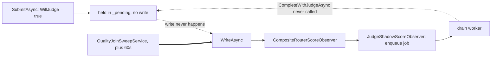
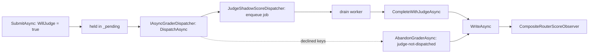

# Judge-join deadlock: dispatching asynchronous graders at hold-time

> **Status: in progress.** Owns the correctness fix for the judge promotion shipped in `04be10f`.
> Corrects [`geval-shadow-scoring-plan.md`](geval-shadow-scoring-plan.md) §1c and
> [`quality-verifier-architecture.md`](quality-verifier-architecture.md) §5, both of which describe
> the write-time trigger this document replaces.

## The defect

Commit `04be10f` ("Phase N3") introduced `QualityScoreAggregator` and promoted the G-Eval judge from
a shadow observer to a real contributor to the routed score. It updated `JudgeShadowScoreDrainService`
to call `CompleteWithJudgeAsync`/`AbandonJudgeAsync`, and added `IJudgeAvailability` so the aggregator
knows to *hold* a static verdict open for a judge grade. **It never moved the trigger that starts the
judge.**

`JudgeShadowScoreObserver` remained an `IQualityScoreObserver`, so it only fired from
`QualityScoreAggregator.WriteAsync` → `CompositeRouterScoreObserver.ObserveAsync` — that is, at the
**final write**. Under the hold-based aggregator, a result needing judgment is not written until the
judge resolves it, so the trigger sat downstream of the very write it was supposed to unblock:



The only thing breaking the cycle was the timeout sweep:

| Symbol | Value |
| --- | --- |
| `QualityOptions.JudgeJoinTimeoutMs` | `60_000` |
| `QualityJoinSweepService` sweep interval | 5 s |
| `JudgeOptions.CacheTtlSeconds` | `300` — response text outlives the timeout |

### Why this was worse than "slow", and why it survived review

1. Every quality observation was delayed ~60–65 s and written with
   `DegradedReason = "judge-join-timeout"`.
2. `QualityResult.JudgeScore` was **never** populated, so `QualityScorer` always dropped the judge
   axis (`DimensionWeightOptions.Judge`, default `0.4`). The promotion contributed nothing to routing.
3. Because the response-text cache TTL (300 s) outlives the join timeout (60 s), the post-timeout
   write *did* fire the observer, the judge backbone *was* called, and a row *was* written to
   `judge_shadow_scores` — after which `CompleteWithJudgeAsync` found nothing and logged *"arrived
   after the join closed; discarding it."*

So the `judge_shadow_scores` table filled normally and the judge appeared healthy from every operator
surface, while no judge grade ever reached router memory.

No test caught it. `JudgeShadowScoreObserverTests` and `JudgeShadowScoringExitCriteriaTests` were both
G1-era and constructed `CompositeRouterScoreObserver` by hand; nothing anywhere wired the real
`JudgeAvailability` and the real `QualityScoreAggregator` together.

Observed cost per [ADR-0008](../adr/0008-codegraph-serena-dual-engine-code-smell-pipeline.md)
Amendment 1: a shipped feature that does not function.

## The fix

A new seam fires the asynchronous grader at **hold-time** rather than at write-time, mirroring
`IJudgeAvailability`'s shape — a seam declared in `TotallyHot.ArcRouter.Quality`, implemented by the
host, with a safe default so the assembly stays usable standalone. `IQualityScoreObserver` returns to
meaning exactly one thing: the final write.



### Why the dispatcher acknowledges what it accepted

`DispatchAsync` returns the subset of pending grader keys it actually handed off, and the aggregator
immediately abandons the rest. Without that acknowledgement there are four remaining paths back to
the same 60-second stall:

- `IJudgeAvailability.WillJudge` and the dispatcher's own `JudgeOptions.Enabled` check are two
  independent live `IOptionsMonitor` reads; an operator toggling the judge off between them leaves an
  entry held for a grader nobody will run.
- `IJudgeShadowScoreQueue.TryEnqueue` sheds on a full queue, by design — the routing path must never
  block on judging.
- The result carries no correlation id the dispatcher can key on.
- The host forgets to register a real dispatcher, and `NoAsyncGraderDispatcher` silently reproduces
  the original bug as the default.

With the acknowledgement, each of those degrades to an immediate static-only write stamped
`judge-not-dispatched` — the honest outcome, and the same reasoning `AbandonJudgeAsync` already
documents: *"Waiting out the full join timeout would produce the same score, just a minute later."*

## Changes

### 1. New seam — `TotallyHotArcRouter.Quality/Grading/IAsyncGraderDispatcher.cs`

```csharp
Task<IReadOnlySet<string>> DispatchAsync(
    QualityResult result,
    IReadOnlySet<string> pendingGraderKeys,
    CancellationToken cancellationToken = default);
```

Plus `NoAsyncGraderDispatcher`, the safe default, returning an empty set.

### 2. `QualityScoreAggregator` — dispatch after the entry is stored

- Takes `IAsyncGraderDispatcher` in the constructor.
- `SubmitAsync` snapshots the requested keys **before** taking the lock: `pendingGraders` is the same
  `HashSet` instance handed to `Entry.PendingGraderKeys` and is mutated in place under `_lock`, so
  iterating the live instance after releasing the lock would be a race.
- Dispatch happens **outside** the lock (`_lock` is a `System.Threading.Lock`, which cannot be held
  across an `await`) and **after** the entry is in `_pending` — that ordering is what lets a fast
  judge's `CompleteWithJudgeAsync` find the entry rather than racing it into existence.
- Dispatch is skipped when `TrimToCapacityLocked` evicted this same correlation id.
- Every requested key absent from the returned set is abandoned with reason `-not-dispatched` appended
  to the grader key.
- A throwing dispatcher degrades to "nothing accepted" and never escapes into `QualityGradingService`.

### 3. `JudgeShadowScoreObserver` → `JudgeShadowScoreDispatcher`

Renamed, because it is no longer an `IQualityScoreObserver` and is deliberately absent from
`CompositeRouterScoreObserver`'s fan-out. The enqueue body is unchanged; it now returns a set
containing the judge grader key on success and an empty set when it declines.

### 4. Second stall — `JudgeShadowScoreDrainService.ProcessAsync`

Its catch-all exception branch logged and returned without releasing the join, so a judge backbone
failure pinned the entry for the full 60 s as well. It now abandons with reason `judge-failed`.
The cancellation branch is left alone: that is shutdown, and the process is going away.

## Exit criteria

- A held result reaches the observer carrying a `JudgeScore`, with `DegradedReason` null, **without
  the join sweep running** — asserted by a host-project test that wires the real aggregator, the real
  `JudgeAvailability`, the real dispatcher and queue, and `JudgeShadowScoreDrainService.ProcessAsync`,
  and never advances its clock. That last condition is what makes the test fail against the old code.
- A dispatcher that declines produces an immediate static-only write stamped `judge-not-dispatched`,
  again without advancing the clock.
- A judge backbone failure produces an immediate static-only write stamped `judge-failed`.
- The DI graph resolves `IAsyncGraderDispatcher` to `JudgeShadowScoreDispatcher`, and the composite
  observer fan-out no longer contains it.
