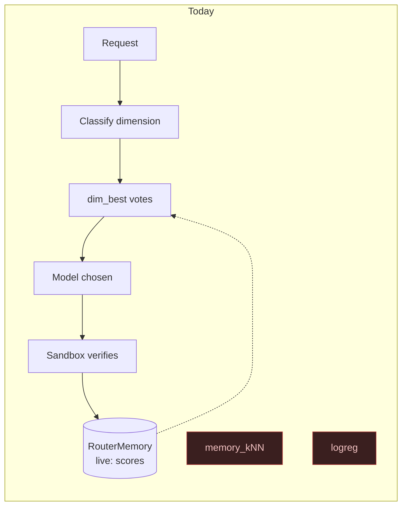
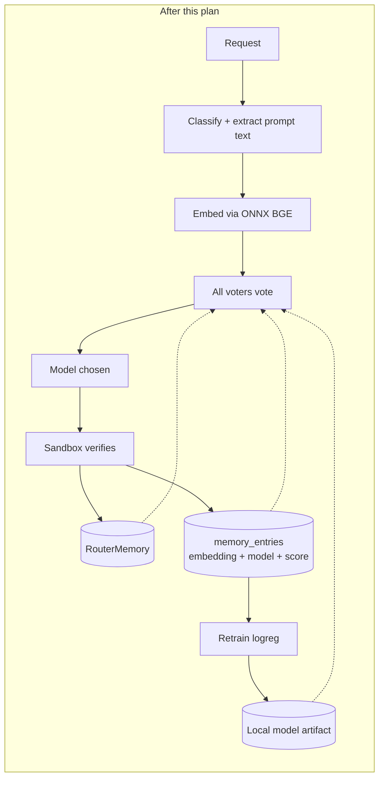

# Live Feedback Learning Plan

Makes the router actually learn from its own traffic. Today exactly one of four Orchestrator voters
participates in a live routing decision; the other three abstain on every real request because the
data they need is never computed. This plan wires the feedback capture that was designed but never
connected, then rebuilds the `logreg` voter around it so the router improves from what it has already
served rather than from a frozen artifact.

**Status:** proposed — no phase started. **Ordering:** before PLAN.md Phase N. Phase N's regret harness
measures voter quality; measuring voters that structurally cannot fire would produce a benchmark of
`dim_best` wearing an ensemble's name.

## Why

`docs/router/coderouterbench-sqlite-migration-plan.md` shipped the corpus into SQLite so Phase L's
voters would have ground truth to read. Phase L then shipped three of four voters. Both are accurate
about what they built. Neither noticed that the production entry point never passes those voters their
inputs:

```csharp
// OrchestratorRoutingPolicy.cs:88 - the IRoutingPolicy method RequestInterceptor actually calls
var decision = await DecideAsync(context, taskEmbedding: null, taskText: null, cancellationToken);
```

Both arguments are hardcoded `null`. `DecideAsync`'s own documentation describes itself as the entry
point for "tests and any future caller that has a task embedding/text" — the wiring was left as
future work and no consumer arrived.

| Voter | Needs | Live status today |
|---|---|---|
| `dim_best` | `RouterMemory` scores | **Working** — `RouterMemoryScoreObserver` writes `live:`-prefixed scores through the sandbox |
| `memory_kNN` | `VotingContext.TaskEmbedding` | **Always abstains** — embedding is always `null` |
| `logreg` | `VotingContext.TaskText` | **Always abstains** — text is always `null` |
| `llm_router` | — | Deferred stub (Phase L, by agreement) |

The gap compounds: `EmbeddingMemory.AddEntryAsync` — the only writer of the `memory_entries` table —
**has no production caller at all**. `IEmbeddingClient` is registered in DI
(`Hosting/ServiceCollectionExtensions.cs:51`) and injected into nothing. So the router's per-task
memory is always empty outside tests, which means `memory_kNN` would abstain even if it *were* handed
an embedding.

That is the real reason `logreg` has never had a trained model — more fundamental than the missing
upstream prompt text documented in Phase L's deferral note. There is no observation loop to train
from, because nothing observes.

## What we are actually able to train on

Two independent findings constrain every design below. Both were verified against the live dataset and
the synced local database, not inferred.

**1. CodeRouterBench publishes no task text for the ID splits.** `id_probing_tasks.jsonl` and
`id_test_tasks.jsonl` records carry exactly four keys — `task_id`, `split`, `source_split`,
`dimension` — across all 9,999 rows. No `prompt`, no instruction, nothing embeddable. Upstream's own
dataset card confirms the asymmetry: it documents `id_tasks.jsonl` as "ID task metadata with split and
dimension" while describing `ood176_tasks.jsonl` as "OOD176 task prompts and metadata." This is a
permanent property of the release, not a sync failure.

**2. The OOD split is the only benchmark text that exists — and it is full-feedback.**

| Source | Tasks | Text? | Feedback | Usable as |
|---|---|---|---|---|
| `benchmark_ood_tasks` + `benchmark_ood_results` | 176 | **yes** (~3 KB `prompt` each) | **full** — all 8 models scored on every task (1,408 rows) | Cold-start bootstrap |
| `benchmark_id_results` | 9,999 | no | full (79,992 rows) | `dim_best` matrix only |
| `memory_entries` (live) | grows | n/a (vector) | **partial** — only the chosen model is scored | Continual refinement |

The distinction between full and partial feedback drives the model's shape (Phase 4). Offline you know
what every model would have scored, so "which model wins" is directly observable. Live you only ever
learn the outcome of the model you actually picked — the classic bandit condition. The existing 5%
epsilon-greedy exploration (`RoutingOptions.ExplorationRate`) is what keeps a confident-but-wrong
router from starving the alternatives it stopped choosing.





## Ground rules (apply to every phase)

- **Never fabricate training data.** No synthetic prompts, no simulated scores, no placeholder weights
  presented as trained. A voter with no real model **abstains**; abstention is a correct, designed
  outcome (`VoterVote.Abstain`), and an honestly-abstaining voter is strictly better than a
  confidently-wrong one. This rule is why the current placeholder artifact is deleted rather than
  regenerated.
- **The routing hot path must never block on learning.** Embedding computation, memory writes, and
  retraining are all subject to timeouts or run off the request path. A failure in any of them degrades
  that request to today's behavior (voter abstains) and is logged — never a failed request.
- **The trained model is per-installation and never committed.** It is derived from the operator's own
  traffic and their own synced corpus. Nothing under `%LOCALAPPDATA%` enters the repository.
- **Partial feedback is labeled as such.** Any metric, log line, or UI element reporting model quality
  distinguishes observations from exploration versus exploitation, because the two have different
  selection bias.
- Repository conventions as always: no build warnings, XML documentation on every public and protected
  member, Serilog with static message templates, structured logging of every training and routing
  outcome, tests alongside behavior changes, ≥80% per-assembly coverage, no individual test over 5
  seconds.

## Phase map

| Phase | Deliverable | Depends on |
|---|---|---|
| 1 | Fix two importer defects; repair affected rows in place | — |
| 2 | Wire feedback capture: prompt text, embeddings, `memory_entries` writes | — |
| 3 | Embedding-backed `logreg` voter reading a local artifact | 2 |
| 4 | Training: OOD bootstrap + continual retrain from memory | 1, 3 |
| 5 | gRPC admin surface + Governance pane + CLI flag | 4 |
| 6 | Relocate TF-IDF machinery to the Phase N harness; delete the placeholder | 3 |

---

## Phase 1 — Fix the two importer defects

Two bugs in the shipped SQLite migration silently corrupt imported data. Both were found by comparing
stored rows against the published files; neither is caught by the existing row-count assertions.

**1a. `models.json` imports 1 garbage row instead of 8 models.** The published file is shaped
`{"models": [ … 8 objects … ]}`. `BenchmarkModelsJsonImporter.EnumerateModels` handles a bare
object-keyed map or a bare array, but not this wrapper, so the object branch yields a single
pseudo-entry named `models` whose `raw_json` is the entire array and whose `provider`, `tier`,
`input_per_1m`, and `output_per_1m` are all `NULL`.

This destroys the per-model pricing Phase N needs for the cost term κ in `R_ij = ε₁·s_ij + ε₂·κ_ij`.

- Unwrap a single-key `{"models": [...]}` (and the symmetric `{"models": {...}}`) envelope before
  enumerating.
- Add a row-count assertion for `models.json` (**8**) and `summary.json` (**5**). Their absence is why
  this passed silently, and the migration plan's own "fail loudly on import" ground rule requires it.

**1b. `benchmark_id_tasks.source_split` stores the wrong field.**
`BenchmarkIdTasksJsonlImporter.cs:85` reads the JSON's `"split"` property into the DB's `source_split`
column, so every row records `probing`/`id_test` where upstream says `train`/`val`/`test`. The
train/validation distinction is lost. `BenchmarkOodTasksJsonlImporter.cs:91` reads `"source_split"`
correctly, so the two importers disagree on the same concept.

- Read `"source_split"`, falling back to the importer's split argument only when the field is absent.

**Repair without re-download.** Both tables preserve the upstream bytes in `raw_json`, so both defects
are correctable in place — no ~12 MB re-sync required. Add a `PRAGMA`-guarded repair to
`EnsureCreated()`, following the additive-migration convention
`PriceCatalogDatabase.MigrateEnabledColumn` established: detect the bad state (a `benchmark_models` row
whose `model = 'models'`; a `benchmark_id_tasks` row whose `source_split` is not one of
`train`/`val`/`test`), re-derive the correct columns from `raw_json`, and rewrite. Log a single
structured summary of what was repaired.

**Exit:** a fixture reproducing the real `models.json` envelope imports 8 rows with pricing populated;
`benchmark_id_tasks.source_split` round-trips `train`/`val`/`test`; the repair path converts a database
in the old broken state without network access and is a no-op on a correct one; row-count assertions
cover all eight synced files.

## Phase 2 — Wire feedback capture

The prerequisite everything else rests on. Split into three independent pieces so each can land and be
verified alone.

**2a. Thread prompt text to the policy.** `RequestInterceptor.ResolveModelRouteAsync` already parses
the request body into `jsonObject` and hands it to `_requestClassifier.Classify(jsonObject)`, but does
not pass it to `ResolveAgenticRouteAsync`. Extract the user-turn text (the same content the classifier
already inspects, so no new parsing rules) and thread it through.

`IRoutingPolicy.SelectModelAsync` has no parameter for this. Add an optional
`RoutingSignals` record (`TaskText`, `TaskEmbedding`) as a second parameter with a default of `null`,
so every existing implementation and caller keeps compiling; `OrchestratorRoutingPolicy` forwards it to
`DecideAsync` in place of the hardcoded nulls. Preferred over having `RequestInterceptor` type-test for
`OrchestratorRoutingPolicy`, which would put policy-specific knowledge in the interceptor.

**2b. Compute the embedding on the request path, under a budget.** Inject `IEmbeddingClient` into the
interceptor. BGE-large-en-v1.5 at 512 tokens is a local ONNX forward pass — single-digit milliseconds
warm — but the first call downloads ~1.3 GB of model artifacts and `OnnxEmbeddingClient` serializes
inference behind a semaphore.

- A configurable timeout (`RoutingOptions.EmbeddingBudgetMs`, default 250) bounds the wait. On timeout
  or any failure: log at warning, pass `null`, and let the embedding-dependent voters abstain. Routing
  proceeds on `dim_best` exactly as today.
- Never trigger the cold download synchronously on a request. Artifact warm-up moves to
  `StartupHealthCheckHostedService`, following the existing fail-open convention there; until warm,
  embedding is skipped rather than awaited.

**2c. Write `memory_entries` when the score arrives.** The embedding is computed at request time; the
verifier score arrives later and asynchronously, carrying only `SandboxResult.RequestCorrelationId`.
Bridge them with a bounded, TTL'd `PendingTaskEmbeddingCache` (correlation id → embedding) that the
interceptor populates and a new `EmbeddingMemoryScoreObserver` drains, calling
`EmbeddingMemory.AddEntryAsync` with the embedding, chosen model, score, and cost.

Chosen over carrying the vector through `SandboxResult` because that type lives in
`TotallyHot.ArcRouter.Sandbox` and threading a routing concern through the sandbox's public surface
couples two projects that are currently independent. The cost is a cache with eviction semantics; the
benefit is that the Sandbox project is untouched. Cache misses (score arrived after TTL, or embedding
was skipped) are logged and dropped — a missing memory entry is a lost learning opportunity, not an
error.

Also register the observer so **both** it and the existing `RouterMemoryScoreObserver` receive each
result; today `IRouterScoreObserver` resolves to a single implementation.

**Exit:** with a fake embedding client, a routed request writes exactly one `memory_entries` row
carrying the right model and score; `memory_kNN` returns a non-abstain vote on a second, similar
request; an embedding client that times out or throws leaves routing working and writes no row; the
pending cache evicts on TTL and under its size bound; no test exceeds 5 seconds.

## Phase 3 — Embedding-backed `logreg` voter

`logreg` keeps its research-doc identity (`VoterNames.LogReg`, one of the canonical four) and changes
its feature space from TF-IDF-over-text to the task embedding.

- **`EmbeddingLogRegModelArtifact`** — per-model weight vectors over the embedding dimension plus a
  bias, the embedding dimension it was trained at, a `TrainedFrom` provenance string, and per-source
  counts (bootstrap tasks, memory entries). At 8 models × (1024 + 1) that is 8,200 doubles, ~130 KB of
  JSON — comfortably a file, and unlike the TF-IDF artifact it carries no vocabulary or IDF table.
- **Dimension guard.** The artifact records its training dimension and the voter refuses to score a
  differently-sized embedding, abstaining with a warning rather than throwing. Changing
  `EmbeddingOptions.EmbeddingDimension` or the model URL invalidates a trained artifact, and a silent
  index mismatch would be far worse than an abstention.
- **`LogRegVoter` rewritten** to score `context.TaskEmbedding` — a dense dot product per candidate
  instead of the sparse TF-IDF walk — restricted to `VotingContext.Candidates`, canonicalized through
  `ModelNameCanonicalizer` on both training and lookup exactly as today, softmax over the restricted
  candidate scores for confidence. Abstains when the embedding is null, when no local artifact exists,
  or when no candidate has weights.
- **Local artifact location.** `%LOCALAPPDATA%\TotallyHot.ArcRouter\logreg_voter_model.json`, resolved
  through `StorageOptions` with the same environment-token expansion `ResolveBenchmarkDatabasePath`
  uses. **Not** an embedded resource, not checked in. The voter loads it lazily and reloads it after a
  retrain.

**Exit:** the voter abstains cleanly with no artifact present, with a null embedding, and on a
dimension mismatch; given a small hand-constructed artifact it selects the expected candidate and
restricts to the candidate set; artifact round-trips through its serializer with validation rejecting
malformed weight vectors, non-finite values, and dimension disagreements.

## Phase 4 — Training: bootstrap and continual retrain

**The model form: per-model score regression, not multiclass classification.** Live rows only ever
carry the score of the model actually chosen, so a multiclass "which of 8 won" label is not
constructible from them. One regression head per model — *given this embedding, what score do I expect
from model m?* — trains from exactly the rows where m was chosen, and argmax at inference recovers the
routing decision. The same form consumes the full-feedback bootstrap rows without modification (every
task simply contributes to all eight heads), so one trainer serves both sources.

**4a. Bootstrap from OOD (first train, local).** Embed the 176 `benchmark_ood_tasks` prompts through
the same `IEmbeddingClient` the request path uses, join to `benchmark_ood_results` for all eight
models' scores, and train. Runs on the operator's machine against their synced corpus and writes the
local artifact; nothing is committed. 176 tasks is a small but genuine signal — and it is full-feedback,
which live data never is. Requires a synced corpus; without one, this path reports "corpus not synced"
and the voter continues to abstain.

Embedding 176 prompts of ~3 KB is a one-time serialized ONNX pass — budget it explicitly and report
progress, since it is far slower than a single request-path embedding.

**4b. Continual retrain from `memory_entries`.** Same trainer, rows drawn from live memory. Because
`EmbeddingMemory` enforces a 20,000-entry FIFO bound, this is inherently a sliding recency window — the
model adapts if a model's quality changes, and "trained on all history" is never true. Say so in the
provenance string rather than implying otherwise.

Blend both sources when both exist, weighting live observations above bootstrap rows (live traffic is
the distribution actually being served; OOD is a prior). Expose the weight as configuration rather than
burying a constant.

**4c. Triggers.** All three requested, sharing one guarded entry point:
- `--retrain-logreg` CLI flag, following the `--sync-benchmark-data` extraction pattern in `Program.cs`.
- A Governance button (Phase 5).
- **Automatic threshold** — retrain once `RoutingOptions.LogRegRetrainThreshold` (default 500) new
  memory entries have accumulated since the last run. Runs on a background hosted service, never on the
  request path, never concurrently with itself, and hot-swaps the artifact only after the new model
  validates. Log every automatic retrain at information level with its row counts and provenance: a
  model that changes routing behavior without a human present must at minimum leave an audit trail.

**Guard against degenerate training sets.** With few rows, or rows covering only one model, the fit is
meaningless. Require a configurable minimum (rows overall, and models represented) before writing an
artifact; below it, decline and leave the previous artifact in place — the same "reject rather than
install something worse" posture the benchmark sync takes on a checksum mismatch.

**Exit:** bootstrap produces a non-placeholder artifact from fixture OOD rows; memory training produces
one from fixture memory rows; blending honors the weight; a degenerate set is declined with the prior
artifact intact; the threshold trigger fires once and only once per threshold crossing; a retrain
running concurrently with routing does not block a request; no test exceeds 5 seconds (fixture
embeddings, not real ONNX inference).

## Phase 5 — Admin surface

Mirrors `BenchmarkDataAdminService`, which this repository already established as the pattern for
"expose a long-running local operation to a GUI that only speaks gRPC."

```
service RouterModelAdminService {
  rpc GetLogRegModelStatus (GetLogRegModelStatusRequest) returns (LogRegModelStatusResponse);
  rpc RetrainLogRegModel (RetrainLogRegModelRequest) returns (stream LogRegRetrainProgress);
}
```

Status reports whether an artifact exists, its provenance, row counts by source, training timestamp,
embedding dimension, and entries accumulated since the last retrain. Retrain streams progress
(embedding the bootstrap set is the slow stage worth showing) and a terminal outcome.

GUI: a **Router Model** pane in Governance, following `PriceSourcesAdmin.razor`'s layout — a header row
carrying the single action button, cards below for status. Button states mirror the benchmark pane's
vocabulary: "Train" / "Retrain" / "Training…" (disabled), plus the router-unreachable state
`PriceSourcesAdmin` already renders. Any dialog copies the `SettingsModal.razor` shell per the
repository's window contract (`docs/gui/DESIGN.md` §4.1).

**Exit:** service tests cover status, streaming retrain, and a retrain that declines on insufficient
data; bUnit tests cover each button state, in-progress rendering, and the unreachable state.

## Phase 6 — Relocate the TF-IDF machinery; delete the placeholder

`LogRegTrainer`, `LogRegTextTokenizer`, `LogRegModelArtifact`, and `LogRegModelArtifactSerializer` stop
serving the live voter but remain the natural implementation of Phase N's static LogReg comparison
baseline (research-doc Table 4). Move them into a Phase-N-facing namespace rather than deleting and
re-implementing later.

- Delete `CodeRouterBench/Resources/logreg_voter_model.json` and its `EmbeddedResource` entry in the
  csproj. The hand-built placeholder has no remaining consumer, and leaving a fake model in the tree
  invites someone to trust it.
- `LogRegTrainer.TryExtractPrompt`'s `prompt`-field assumption is corrected to reflect reality: ID task
  rows have no text, so the trainer's only viable text source is the OOD split.
- `LogRegTrainerReconciliationTests` currently **throws** rather than skipping on a fully-synced corpus,
  because its guard checks `benchmark_id_results` for probing rows while the failure is missing text in
  `benchmark_id_tasks`. Retarget it at whatever corpus the relocated baseline actually trains from, and
  make the guard test the condition that actually gates the run.

**Recorded deferral — the paper's LogReg baseline is not exactly reproducible.** Table 4's LogReg is
TF-IDF over probing-split task text; that text is not published. The honest reconstruction trains on
the 176 OOD prompts instead and is labeled as such wherever its numbers appear. Per the repository's
standard, publish what was obtained and name the deviation rather than implying parity.

**Exit:** no live routing code references the TF-IDF path; the placeholder resource is gone from the
tree and the csproj; the reconciliation test skips or passes but never throws on either a synced or
unsynced corpus; full suite passes with `memory_entries` empty *and* populated.

## Deliberately out of scope

- **Replacing epsilon-greedy with a contextual bandit.** LinUCB/LinTS are Phase N comparison baselines;
  promoting one to the live selection policy is a separate decision with its own evaluation, and this
  plan deliberately does not pre-empt Phase N's finding.
- **Retraining `memory_kNN` or `dim_best`.** Both are non-parametric and already update continuously
  once Phase 2 lands — kNN gains entries, `dim_best` gains `live:` scores. Neither has a model to train.
- **Storing prompt text in `memory_entries`.** The table deliberately holds only the embedding. Adding
  raw prompts would turn the router's memory into a transcript store with retention and privacy
  obligations it does not currently carry. The embedding is sufficient for everything this plan needs.
- **Sharing or syncing trained models between installations.** Per-install by design; a fleet-wide model
  raises data-governance questions well outside this plan.
- **Re-downloading the corpus to fix Phase 1's defects.** Both are repairable in place from `raw_json`.
- **`outputs/`, `agentic-artifacts/`, `raw_matrices/`.** Still unrestored, for the reasons Phase K
  settled and the SQLite migration reaffirmed.
