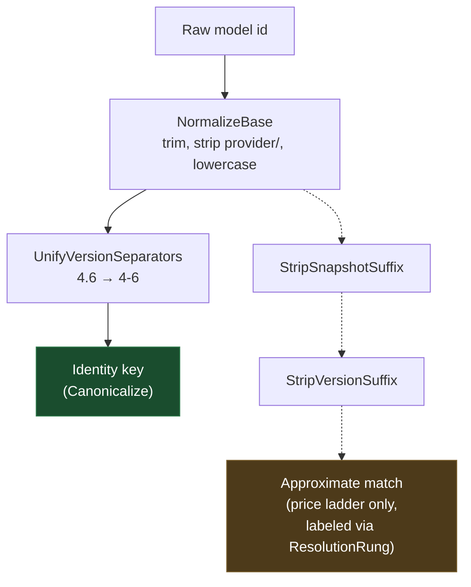

# Model Identity Canonicalization: Spelling vs. Identity

> **Status: implemented.** `ModelNameCanonicalizer.Canonicalize` normalizes *spelling* only. Snapshot and
> version/tier stripping remain available as individual stages, reserved for the one caller that labels
> the approximation it introduces — the price-resolution ladder in
> [`d3-alias-resolution.md`](d3-alias-resolution.md).

## Why this exists

Model ids reach this router under several spellings at once: the operator's configured
`ModelRouting:ModelList[].ModelName`, a provider's public model id, a price aggregator's key, a benchmark
dataset's column, and — since Phase L — a routing voter's own pick. `ModelNameCanonicalizer` is the single
place that answers "do these two strings name the same model?"

Answering that requires drawing a line between two kinds of difference, and the whole design turns on
where that line sits.

## The distinction

| Kind | Example | Same model? | Canonicalizer |
|---|---|---|---|
| **Cosmetic spelling** | `Claude-Opus-4.6` vs `claude-opus-4-6` | Yes | Collapsed by `Canonicalize` |
| **Provider qualifier** | `anthropic/claude-sonnet-4-6` vs `claude-sonnet-4-6` | Yes | Collapsed by `Canonicalize` |
| **Dated snapshot** | `claude-opus-4.6-20250929` vs `claude-opus-4.6` | **No** | Kept distinct |
| **Version/tier suffix** | `gpt-4o-latest` vs `gpt-4o` | **No** | Kept distinct |

Case and `.`/`-` version punctuation are *typography*: the operator writes `claude-opus-4.6` while the
dataset ships `claude-opus-4-6`, and both name one indivisible thing. A dated snapshot is *not* typography.
`claude-opus-4.6-20250929` pins one immutable release; `claude-opus-4.6` is a rolling pointer that will
move to a different set of weights. Their benchmark scores, prices, and routing suitability can all differ.

## The governing principle

> An approximation that is **labeled** is acceptable. An approximation that is **silent** is not.

The price-resolution ladder may strip a snapshot, because it records *which stage was needed* as a
`ResolutionRung` and marks the resulting price `is_approximate`. An operator reading a cost figure can see
that it came from the base model's rate rather than the pinned release's.

Nothing comparable exists on the identity path. `DimensionModelScoreMatrix` keys its averages by
canonicalized model name; `OrchestratorRoutingPolicy` matches a voter's pick against the candidate list the
same way. If a snapshot collapsed onto its base there, two models' scores would merge into one cell and
every lookup would silently return a blend — with no rung, no flag, and no log line to reveal it.

## Evidence this costs nothing

The stripping was originally in `Canonicalize` on the assumption that the benchmark path needed it to
reconcile dataset ids with configured `ModelName`s. Checked against the actual data, it does not:

- **All eight CodeRouterBench dataset ids** reach their configured `ModelName` under spelling
  normalization alone. The only differences that need bridging are case (`MiniMax-M2.7` →
  `minimax-m2.7`, `Qwen3-Max` → `qwen3-max`) and version punctuation (`claude-opus-4-6` →
  `claude-opus-4.6`). No dataset id carries a snapshot or a version/tier suffix.
- **All 19 configured `ModelName`s** yield 19 distinct keys under spelling normalization — the same count
  as under the old stripping pipeline. Switching changed no key, so the stored
  `benchmark_models.canonical_key` values are unaffected and no corpus resync was required.
- The one configured `ModelName` that *does* carry a snapshot, `claude-haiku-4-5-20251001`, is not among
  the benchmark's eight models. Stripping it produced `claude-haiku-4-5` — a key no model in the system
  actually has.

So the stripping did no work on the path it was justified by, while carrying a latent merge hazard.
`ModelNameCanonicalizerTests.EveryConfiguredModelName_CanonicalizesToADistinctKey` guards the *config*
side of that hazard by reading the real `appsettings.json`; nothing guards the *dataset* side, which is
the second reason to keep snapshots distinct.

## Consequences

- **A dataset revision that starts shipping snapshotted ids will make `dim_best` abstain** for those
  models rather than silently score them against the wrong release. That is the intended failure
  direction, and matches [`d3-alias-resolution.md`](d3-alias-resolution.md)'s standing rule: leave a
  model unresolved rather than approximately mapped. It surfaces as a lookup miss, so it is worth
  watching the abstention logs after a corpus sync.
- **`StripSnapshotSuffix` and `StripVersionSuffix` stay public.** They are not dead code — the price
  ladder calls them stage by stage. They are simply off-limits to any caller that cannot label the
  approximation it thereby introduces.
- **New callers comparing model ids should call `Canonicalize`** and store the *matched candidate's own
  configured name*, never the canonicalized key. The key is a comparison artifact; it is not guaranteed
  to equal any name in the configuration.

## Related

- [`d3-alias-resolution.md`](d3-alias-resolution.md) — the price-resolution ladder and its rungs
- [`coderouterbench-sqlite-migration-plan.md`](coderouterbench-sqlite-migration-plan.md) — where
  `benchmark_models.canonical_key` is populated on ingest
- `src/TotallyHotArcRouter/Models/ModelNameCanonicalizer.cs`
- `src/TotallyHotArcRouter/Router/Orchestrator/OrchestratorRoutingPolicy.cs`
