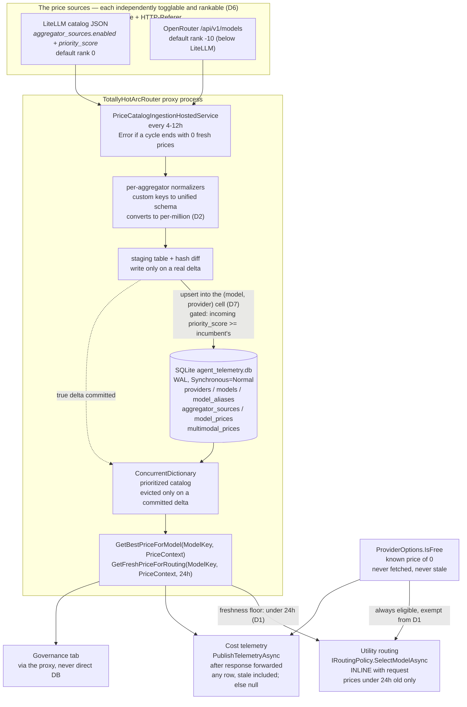

# Model Price Catalog: Multi-Aggregator Ingestion, Resolution, and Runtime Cache

> **Status: Phases 1–3 implemented, including multi-source; Phase 4 is still design.** The SQLite
> dependency, the six catalog tables, the LiteLLM and OpenRouter clients, the priority-ordered upsert
> gate, the ingestion worker, and the startup health checks all exist in `src/TotallyHotArcRouter/PriceCatalog/`.
> So does the Governance → Price Sources panel, which owns the D6 toggle, can pull on demand, and can
> reorder the two sources' rank. **Phase 4 does not exist**: there is no `ConcurrentDictionary` cache, no
> `IModelPriceCatalog`, no `GetBestPriceForModel`/`GetFreshPriceForRouting`, and no staging table or hash
> diff. Nothing consumes catalog prices for routing yet — `PriceCatalogRepository.GetFreshPrice` is
> written and tested but has no caller. Sections still describing unbuilt work are marked inline.
>
> **There is no price data today, and that is deliberate.** The hand-maintained `Pricing` section in
> `appsettings.json` that used to supply placeholder rates has been **deleted**, not fenced off — its
> own `_comment` admitted the values were *"Illustrative placeholder values, not verified against
> current provider price sheets,"* and a fabricated cost is indistinguishable from a real one at the
> point someone reads it. Until this catalog lands, `EstimatedCostUsd` is `0` for a provider flagged
> free (`ProviderOptions.IsFree` — a known zero, not a guess) and `null` for everything else. See
> [`telemetry.md`](telemetry.md#pricing).
>
> Two consequences for whoever builds this: the fallback layer that earlier drafts of this doc kept
> designing around **no longer exists**, and "unknown" is now the system's honest, load-bearing default
> rather than a degraded state to be papered over.

> ### Current scope: LiteLLM and OpenRouter
>
> **The aggregator set is LiteLLM and OpenRouter**, both live, both seeded, both pollable. OpenRouter's
> endpoint was verified 2026-07-16 (see [Still open](#still-open--needs-verification-before-building)) and
> its client (`OpenRouterPriceSourceClient`) shipped alongside the `priority_score` gate in the same
> change — deliberately together, because a second source with no gate is exactly the "confidently wrong
> number" failure mode D7 exists to prevent (see [D7](#d7-price-is-keyed-by-model-provider--never-by-model-alone) and the gate's
> own description under [Phase 3](#phase-3-resolution-failover--write-logic)). **OpenPipe was investigated
> and dropped from the set entirely** — it publishes no machine-readable pricing and holds no independent
> prices for the models this router targets; see [Still open](#still-open--needs-verification-before-building)
> for the evidence.
>
> **What is still future work, marked `[FUTURE: multi-source]` where it appears below:** cascade failover
> (a 5xx from one source promoting the next) and assigning real relative-quality rankings between more
> than two sources. Both were originally scoped as "everything multi-source", but with two real sources now
> live, the parts that had concrete design questions - what does rank mean, does it gate writes or order
> polling - are answered and built (see [D6](#d6-each-source-is-independently-enableddisabled-and-the-database-owns-the-toggle)'s
> amendment). What remains has no second data point to design against yet: cascade failover needs a source
> whose failure mode is worth routing around rather than just logging, and a numeric ranking scheme beyond
> "the operator's own ordering" needs a third source to make relative judgments about at all.

**This is the single canonical plan for model price data.** It supersedes
[`agent-cost-tracking.md`](agent-cost-tracking.md) §2's `model_prices` table and §3.2's price-catalog
sketch, both of which are now pointers here. That doc retains the `usage_ledger` and provider
reconciliation halves, which are unaffected. Where any doc disagrees with this one about price data,
this one wins.

> ### ⚠️ Two rules that constrain every design decision below
>
> 1. **Price data must NEVER be exposed via a public API.** This is a **licensing** constraint on
>    aggregated third-party pricing, not a security preference — it cannot be traded away for
>    convenience by a later design. Local use and storage are fine; serving it outward is not. See
>    [D5](#d5-price-data-must-never-be-exposed-via-a-public-api--licensing) for exactly which surfaces
>    that rules in and out.
> 2. **Every outbound request identifies this application** via the `X-Title` and `HTTP-Referer`
>    headers, so a user's local polling reads as legitimate application traffic rather than anonymous
>    scraping. See [Phase 2](#phase-2-ingestion--aggregator-normalization).

> **Phase numbering is local to this document.** "Phase 1–4" below are the catalog's own build stages;
> they are unrelated to [`../../PLAN.md`](../../PLAN.md)'s Phase 0–8 migration numbering.

## The three consumers

The catalog is a shared component, which is why it gets its own plan rather than living inside any one
consumer's doc. Each consumer reads it differently, and Phase 4's design is driven by the fact that
**one of them reads it inline with a live request**:

| Consumer | Call site | Timing | Needs |
|---|---|---|---|
| **Cost telemetry** ([`telemetry.md`](telemetry.md#pricing)) | `ProxyMiddleware.PublishTelemetryAsync` | *After* the response is forwarded | A price for display; shows nothing when the catalog has nothing |
| **Utility routing** ([`utility-model-routing.md`](utility-model-routing.md) §B3) | `IRoutingPolicy.SelectModelAsync` | **Inline with the request**, before forwarding | A *trustworthy* price; must treat an unpriced model as unpriced rather than guess |
| **Governance tab** ([`../gui/governance-model-cards.md`](../gui/governance-model-cards.md)) | Proxy-side query, GUI-facing | On demand | Per-model price cards, joined to spend history |

These two facts about the routing consumer shape the whole design, and are the easiest things to get
wrong:

1. **It reads inline.** Telemetry reads after the response is already out the door, so a slow lookup
   there costs a thread, not latency. Routing reads *before* forwarding — a blocking lookup there is
   latency the user feels. This is why Phase 4's in-memory cache is not an optimization; it is what
   makes the routing read viable at all. **No catalog read on any path may await network I/O.**
2. **It must be able to tell "cheap" from "unknown."** `utility-model-routing.md` is normative that a
   model with no catalog price is *unpriced* — excluded from cost ranking, reachable only via
   exploration. Its test plan asserts this directly ("it is the whole point of the constraint"). Any
   design that hands the router a fabricated price for every model breaks this silently. There is no
   fallback table left to leak one in through; the remaining way to break it would be a *stale* price
   the router mistakes for a current one, which is what [D1](#d1-auto-selection-requires-a-price-fetched-within-the-last-24-hours) governs.

## Resolved design decisions

These were open contradictions across the price docs; each is now settled and the phases below
reflect them.

### D1. Auto-selection requires a price fetched within the last 24 hours

A model whose newest aggregator-sourced price row is **older than 24 hours, or absent, MUST NOT be an
auto-selected routing target.** Prices change at most daily; a price the system hasn't been able to
confirm within that window is not a fact it can rank on.

**This binds the router's own selection only** — `AgentAsARouter` and the planned
`UtilityRoutingPolicy`. It explicitly does **not** bind `ModelRouteResolver.TryResolve`: a client that
names a model gets that model, forwarded normally, just with no cost estimate attached. The catalog is
a **cost oracle, not an allowlist**; the allowlist is `ModelRouting:ModelList`. Conflating the two
would turn a price-feed outage into a proxy outage, which is a far worse failure than a routing
decision made without a cost term.

**Exception — free providers.** A model routed to a provider flagged `IsFree` (`ProviderOptions.IsFree`)
has a known price of 0 that no fetch can staleness-invalidate — it isn't fetched at all. It is always
eligible for auto-selection. Without this carve-out `llama3` (local Ollama) would be permanently
unroutable by the router's own selection, which is exactly backwards: the free local model is the one
option whose cost we are *most* certain of.

**Surface this as its own query** — `GetFreshPriceForRouting(key, context, maxAge: 24h)` — rather than a
`staleness` flag hanging off the general lookup. A flag is something a caller can forget to check; a
separate method is something they have to choose. Note the deliberate asymmetry with Phase 3's stale
retention: **telemetry serves a stale price** (a stale cost display beats a blank one), while
**routing refuses it** (a stale cost decision is worse than no cost term). Same row, different answer,
because the two consumers are asking different questions.

### D2. Units are USD per 1,000,000 tokens, everywhere

`agent-cost-tracking.md`'s SQL sketch stored `input_cost_per_token`; the shipped
`ModelPrice(InputPerMillionTokens, OutputPerMillionTokens)` and
[`telemetry.md`](telemetry.md#pricing) both use per-million. **Per-million wins** — it matches the code
that exists and keeps `ModelPrice.EstimateCost`'s math and `ModelPriceTests` unchanged. Aggregators
that publish per-token (LiteLLM's JSON does) convert **inside their own normalizer** (Phase 2), so the
unit boundary is crossed exactly once, at ingest, in a unit-tested place. A silent mix of the two is a
10⁶ error in a dollar figure that no test would catch by inspection.

### D3. An internal model registry decouples aggregator naming from the router key

> **Implementation plan: [`d3-alias-resolution.md`](d3-alias-resolution.md)** — auto-match implemented;
> explicit overrides + UI still open. `ConfigModelIdentityResolver` now resolves each source's naming onto
> the configured `ModelName` at ingest, so cost resolves for models whose `ProviderModelId` matches the
> aggregator's public model id, and two sources naming one model differently finally collide into one cell
> (first real exercise of the priority gate). What remains is the explicit-override layer for divergent
> names and a UI to manage it. No schema migration was needed.

Each aggregator names models its own way, and
[`../gui/governance-model-cards.md`](../gui/governance-model-cards.md) §163-168 already flags the
resulting ambiguity as an open question (try `ProviderModelId` first, then `ModelName`?).

**Resolution:** `models` holds an internal surrogate id plus the client-facing `model_identifier`
(= `ModelRouting:ModelList[].ModelName`, the same key `usage_ledger` and `RoutingTelemetryEvent` already use,
chosen deliberately because it survives a provider renaming its own model id). A `model_aliases` table
maps each aggregator's own naming onto that surrogate id. Prices hang off **(that surrogate id, provider)**
— see [D7](#d7-price-is-keyed-by-model-provider--never-by-model-alone), which amends this decision: the
same model served by two providers is two prices, not one. The router and the ledger still join on
`model_identifier`. This delivers Phase 1's "decouple upstream aggregator naming from internal routing
keys" literally, and **resolves** governance-model-cards.md's lookup-order question rather than
inheriting it: the alias table is the answer.

### D4. Ingestion is its own hosted service, on its own cadence

`agent-cost-tracking.md` §3.4's `CostReconciliationHostedService` polls hourly and requires Admin API
keys. Catalog ingestion polls every 4–12h and requires no credentials at all. **They stay separate
services**: the catalog must work for a user who has configured no admin keys (the common case), and
coupling a credential-free public-data poll to a privileged billing-API poll would make the former
hostage to the latter. Both are registered in `ServiceCollectionExtensions.AddTotallyHotArcRouter`, mirroring
`ProxyHostedService`'s existing pattern.

The two time windows are distinct and deliberately so:

| Window | Value | Meaning |
|---|---|---|
| Poll interval | 4–12h | How long after the last cycle *finished* the next one is due |
| Staleness trigger | 24h | Catalog older than this ⇒ next poll is due; prices change at most daily. **Also the routing floor** — past this, a price is no longer rankable ([D1](#d1-auto-selection-requires-a-price-fetched-within-the-last-24-hours)) |

**The interval runs from the last cycle, not on a fixed cadence.** Any completed cycle re-anchors it —
the poll loop's own, the startup check's, or one the operator triggered from Governance → Price Sources
(Pull Now, a toggle, a reorder). So a manual pull buys a full interval rather than being followed minutes
later by a scheduled poll that refetches what it just fetched. `PriceCatalogIngestionService` owns the
anchor (`ScheduleAnchorUtc`); `PriceCatalogIngestionHostedService` reads it each pass instead of holding a
`PeriodicTimer`, which by construction cannot be rescheduled by an event outside itself.

The anchor moves on a cycle's **completion, not its success**, and is seeded at construction so that
"no cycle has ever run" — reachable on a router with every source disabled, which skips the startup cycle
— does not read as "overdue". Both rules exist so a persistently failing feed is retried once per
interval rather than in a tight loop.

The 24h row does double duty on purpose: the reason prices are refetched daily and the reason a
day-old price can't drive a decision are the same reason — that is how often the underlying numbers can
move. Two separate constants would invite them to drift apart.

**There is deliberately no third "stale alert" window.** An earlier draft carried a 36h threshold past
which a row was "flagged Stale" — but nothing ever defined what flagged meant: no column in Phase 1's
schema, no query reading it, no surface showing it, and no alert firing on it, since alerting is
already fully covered by the per-cycle Warning/Error ladder below. Age is not lost with it: every row
carries `last_updated_utc`, telemetry serves stale rows regardless of age ([D1](#d1-auto-selection-requires-a-price-fetched-within-the-last-24-hours)),
and [`../gui/governance-model-cards.md`](../gui/governance-model-cards.md) renders the exact age ("as of
3h ago") rather than a boolean. A constant no code reads is drift waiting to happen, so it is gone
rather than left as a number someone might one day implement two different ways.

#### Zero-fresh-prices is an Error, not silence

When a poll cycle **completes** and the resolved catalog holds **zero** prices that are both
aggregator-sourced and fresher than 24h, the ingestion service MUST log at **`Error`** (Serilog
structured, per AGENTS.md's conventions), naming each source attempted and how it failed.

This is per *cycle*, not per source, and the severity ladder is deliberate:

| Condition | Level | Why |
|---|---|---|
| One source fails, another succeeds | `Warning` | Redundancy did its job — that is what several sources are for. Reachable since OpenRouter shipped (2026-07-16): with two sources, one failing no longer forces the cycle-level Error |
| Every source fails, stale rows remain | `Error` | Nothing is fresh: telemetry is serving aging data and the router has no cost term |
| Every source fails, catalog is empty | `Error` | The same blindness, with nothing to display either |

Without this line the failure is **completely silent**: every cost renders as "unavailable" and every
auto-selection quietly runs on quality alone, which looks like a system with no traffic rather than a
system that has lost its price feed. An operator cannot debug what nothing reports. Note this is the
one place the catalog is allowed to be noisy on a schedule — it fires once per cycle (every 4–12h), so
it cannot flood a log, and if it fires at all it is describing a condition someone needs to fix.

### D5. Price data must NEVER be exposed via a public API — licensing

**This is a licensing constraint, not a security preference, and it is not negotiable by a later
design.** The catalog aggregates third-party pricing data under terms that permit local use. Re-serving
that data outward — to any caller beyond this machine's own user — is redistribution, and it is
forbidden regardless of how convenient the endpoint would be.

**The harm this names, stated plainly: TotallyHotArcRouter must not publish price information in a manner that
mimics a public price data source itself.** That is the line. Consuming a feed locally is permitted;
becoming one is not. Communication between the proxy and its own GUI, for that user's own consumption, is
**permissive** — the user reading their own catalog on their own machine is not redistribution, and it is
why the panel and the model cards are allowed to exist at all. What is forbidden is any surface where
TotallyHotArcRouter starts *serving* prices onward to other callers, because at that point it has become an
aggregator republishing someone else's aggregation.

Concretely, for a proxy that already runs an OpenAI-compatible HTTP surface on port 5001:

| Surface | Price data allowed? | Why |
|---|---|---|
| `GET /v1/models` (`RequestInterceptor.ListAvailableModels`) | ❌ **Never** | This is the proxy's public-shaped API. Any IDE, extension, or script that can reach :5001 reads it. Adding a price field here republishes the catalog. |
| Any new proxy HTTP endpoint | ❌ **Never** | Same reasoning. There is no "internal-only" HTTP endpoint on a listening port. |
| Local telemetry channel → `TotallyHotArcRouter.Gui` | ✅ | Loopback, same machine, same OS user — this is the user reading their own catalog, not redistribution. Must stay loopback-bound (see [`signalr-hub-security.md`](signalr-hub-security.md), whose concerns apply to the current gRPC transport). |
| Governance model cards | ✅ | Same local channel; the display surface [`../gui/governance-model-cards.md`](../gui/governance-model-cards.md) specifies. |
| `PriceSourceAdminService` (Governance → Price Sources) | ✅ | Same loopback gRPC channel, and it carries **no price values at all** — only feed metadata: source name, enabled flag, rank, row counts, error strings, and the poll schedule (interval + anchor) the panel's countdown renders. Permitted because it is operator control over the user's own ingestion, not price distribution. **Not a licence to add a price field**: "the transport happens to be local" is not the test — see the rule above. |
| The SQLite file on disk | ✅ | Local storage, ACL'd to the running user (see [`agent-cost-tracking.md`](agent-cost-tracking.md) §4's shared `Storage:DatabasePath` and its `%LOCALAPPDATA%` convention). |

This also means the catalog **must not** become a feature of the proxy's OpenAI-compatible surface even
if a client would find it useful, and any future "expose pricing to the IDE" request has to be refused
on licensing grounds rather than weighed on merit. Whoever implements Phase 4's `GetBestPriceForModel`
should treat "who can reach this caller" as part of the API contract, not an ambient property.

**The derived-value edge — settled 2026-07-16 by the project owner.** `EstimatedCostUsd` on a
`RoutingTelemetryEvent` is *derived* from catalog data (one model, one request, one number) rather than
being the catalog itself, and it already flows over the local telemetry channel today. Earlier drafts left
this open, correctly noting it belonged to whoever owns the licensing relationship rather than to an
engineer reading the table. **Ruling: a derived per-request cost may be surfaced outward.** It does not
mimic a price data source — a caller cannot reconstruct the catalog from it, cannot query it by model, and
receives an arithmetic result about their own request rather than a rate sheet. This is a ruling about
*derived per-request values only*; it does not loosen any ❌ row above, and a field that lets a caller read
rates — even one model's, even indirectly — is republication and stays forbidden.

This also means the catalog **must not** become a feature of the proxy's OpenAI-compatible surface even
if a client would find it useful, and any future "expose pricing to the IDE" request has to be refused
on licensing grounds rather than weighed on merit. Whoever implements Phase 4's `GetBestPriceForModel`
should treat "who can reach this caller" as part of the API contract, not an ambient property.

### D6. Each source is independently enabled/disabled, and the database owns the toggle

Every source is individually switchable from **Governance → Price Sources**, backed by
`aggregator_sources.enabled`. Disabling one takes it out of the catalog entirely: **it is neither polled
nor served.**

> **Amended 2026-07-16 — the toggle moved from configuration to the database.** It was
> `PriceCatalog:Sources:<name>:Enabled`, read **once** in `PriceSourceRegistry`'s constructor, which meant
> changing it required restarting the proxy. That is untenable for a control the operator is expected to
> reach for: the likely reasons to disable a source (a licensing concern, distrust of its numbers) are
> exactly the reasons you would not want to wait for a restart. `PriceSourceToggleStore` now owns the flag,
> `PriceSourceRegistry.EnabledClients` filters against it per cycle, and the config key is **gone** — a
> leftover `Enabled` key is a hard startup error, not an ignored one, because the options binder silently
> drops properties it doesn't recognize and an operator upgrading with `"Enabled": false` would otherwise
> find their source quietly polling again.

**Why this doesn't contradict "the source set lives in the table, not config."** That earlier rule
replaced a single scalar `PriceCatalogUrl`, and it still holds for the source *set*: config cannot
**add** a source, because each one needs a hand-written normalizer (Phase 2) — sources are code, not
data, and an entry naming an unknown source is a configuration error, not a new integration. The split
is by role:

| Lives in | What | Why |
|---|---|---|
| `aggregator_sources` **table** | Identity, `priority_score`, `enabled`, FK target for every price row's lineage | It must outlive any toggle — price rows reference it, so a disabled source's row cannot be deleted without orphaning history. The toggle lives here too so it can change at runtime and survive a restart |
| `appsettings.json` **config** | `PollIntervalHours`, and a per-source `Url` override | Facts an operator sets once, not policy they flip while the app is running |

**Every source with a client is seeded a row at startup.** `PriceCatalogDatabase.EnsureCreated` inserts one
per entry in `PriceCatalogOptions.KnownSources` (`litellm` and `openrouter` today, both enabled), using
`ON CONFLICT DO NOTHING` so a restart never clobbers an operator's choice. This exists because rows were
previously created only by a *successful* `UpsertPrices` — which left a fresh install with an empty panel
and no way to switch a source off before the startup pull fired.

**The seed list is sources-with-clients, not sources-in-the-design.** A seeded row appears in the panel as
something the user can switch on, so listing a source that has no client would produce exactly the failure
this decision's validation rule exists to prevent: a source that reads as enabled and polls nothing.
OpenRouter joined the list in the same commit that added its client, not before — proven the other
direction too, by `openpipe` staying rejected at the config-validation layer (D6 above [Still
open](#still-open--needs-verification-before-building)) precisely because it never got a client.

**Disabled means the rows stop counting, not just the polling.** Its rows remain in the table for audit
and lineage, but are excluded from the resolved catalog and the Phase 4 cache. A model priced only by a
disabled source therefore becomes **unpriced** — exploration-reachable, never cost-ranked, the same
answer [D1](#d1-auto-selection-requires-a-price-fetched-within-the-last-24-hours) gives for data we
can't stand behind. This is the conservative reading and the one that matches the likely reasons for
disabling a source (a licensing concern, or distrust of its numbers): a source you switched off must
stop influencing routing the moment you switch it off, not 24 hours later. The alternative — keep
serving cached rows until they age out — was considered and rejected: it would leave a disabled source
quietly steering decisions, which is a genuinely hard bug to see.

Re-enabling is not special-cased: rows become visible again immediately, and the next poll refreshes
them like any other stale data.

**Implemented, including the "not served" half.** `GetFreshPrice` and `CountFreshPrices` both join
`aggregator_sources` on `enabled = 1`, so a disabled source's rows are excluded from reads rather than
merely skipped by the poll. Filtering `CountFreshPrices` matters as much as the other: without it, a
disabled source's rows would suppress the
[zero-fresh-prices Error](#zero-fresh-prices-is-an-error-not-silence), reporting a healthy feed while
nothing usable was being served.

**Disabling also cancels an in-flight fetch.** `PriceSourceToggleStore` holds a `CancellationTokenSource`
per source and trips it on disable; the ingestion loop links it with the caller's token. The two
cancellations must stay distinguishable — the caller's token means the host is shutting down and
propagates, while a source's own token means the operator switched it off and is recorded as a
`"disabled during fetch"` outcome so the *rest* of the cycle still runs. A fetch that finishes before it
notices the cancellation is caught by a re-check before the upsert, so a source switched off mid-pull never
gets a fresh `last_updated_utc` written for it. This is what makes "the moment you switch it off" literal
rather than "from the next cycle."

**Every source disabled is a coherent state, but not a quiet one.** The catalog then holds no prices at
all: utility routing degrades to its documented cold-start/exploration path, and cost telemetry shows
nothing for every paid model. Log it at **Warning** on startup — it is a legitimate thing to configure,
but almost never what someone meant to. Note that this state also trips the
[zero-fresh-prices error](#zero-fresh-prices-is-an-error-not-silence) after the first poll cycle, and
should: an operator who disabled every source and an operator whose sources are all failing are in the
same position — flying blind — and both deserve to be told.

With two sources this now requires disabling both, not one — `litellm` disabled alone leaves `openrouter`
still polling ([Current scope](#current-scope-litellm-and-openrouter)), and D1's routing floor and D4's
zero-fresh-prices Error both key off whether *any* enabled source has something fresh, not a specific one.
The Warning still matters most in the single-source-remaining state: one source failing while the other is
disabled is the same "flying blind" position as both being disabled, with less redundancy left to catch it.

### D7. Price is keyed by (model, provider) — never by model alone

**The same model costs different amounts depending on who serves it.** `llama-3-70b` via Groq, Together,
Bedrock, and Fireworks is one model at four prices; an aggregator publishes it as a **matrix**, not a
row. A catalog keyed on the model alone cannot represent that data at all — it can only pick one
provider's number arbitrarily and discard the rest, or let whichever source polled last overwrite the
others. Both produce a confidently wrong number, which is the failure mode this entire document exists
to prevent.

So `model_prices` is keyed **(model, provider)** at minimum, plus `aggregator_source_id` for lineage.
Two providers reporting different prices for the same model are not in conflict; they are two facts, and
the key keeps both. Only two *sources* describing the same (model, provider) cell is a disagreement —
which is what the `priority_score` gate under [Phase 3](#phase-3-resolution-failover--write-logic) exists
to settle, *within* a cell and never across providers. The gate is now live and real code, not future
work — but **it is not yet exercised by real collisions**: LiteLLM stores `gpt-4o` while OpenRouter stores
`openai/gpt-4o` for the same real model, so today they land in different `models` rows and never actually
contest the same cell (verified: 0 real collisions against a production database as of 2026-07-16). That
gap closes only once [D3](#d3-an-internal-model-registry-decouples-aggregator-naming-from-the-router-key)'s
alias resolution lands and both sources' names resolve onto one internal id — at which point this gate is
what stops the collision from becoming a confidently wrong number. The `providers` table already exists in
[Phase 1](#phase-1-architecture--schema) for the model registry — this makes it an FK target for every
price row as well. `multimodal_prices` is keyed the same way.

**This amends [D3](#d3-an-internal-model-registry-decouples-aggregator-naming-from-the-router-key),
which said "prices hang off the surrogate id."** D3's *alias* mechanism is unaffected and still correct:
each aggregator's own naming still resolves onto an internal model id at ingest. What changes is what a
price attaches to once resolved — the (model, provider) pair, not the model.

#### Price has four dimensions, and three of them are provider facts

Phase 1's nullable columns already carry these. D7 is why they cannot collapse into a model-keyed row:

| Dimension | Column(s) | Why it varies by provider |
|---|---|---|
| **Direction** | `standard_input_price` / `standard_output_price` | Reading and generating are never priced equally — output typically costs several times input. Two numbers, never one blended rate. |
| **Prompt caching** | `cached_input_price` | Repeating the same context or instructions across calls earns steep discounts (often 50%+) — **where it is offered at all.** A host without prompt caching charges full price on every single call. |
| **Batch** | `batch_input_price` / `batch_output_price` | Deep discounts for work submitted to run off-peak, when the task isn't time-sensitive. Also not universal. |

The caching and batch rows are the strongest argument for the composite key, not merely two more
columns: **whether a discount exists at all is a fact about the provider, not the model.** The same
model is cache-discounted on one host and full-price on another. `NULL` is load-bearing exactly as
Phase 1 says — absent ≠ zero, it means *this provider does not offer this* — and a null can only be
correct if the row it sits in names a provider. Keyed on the model alone, "no batch pricing" is
unanswerable: it is true of some hosts and false of others simultaneously.

> **A batch turnaround is not [D1](#d1-auto-selection-requires-a-price-fetched-within-the-last-24-hours)'s
> 24h.** Batch jobs commonly return within ~24 hours; D1's freshness floor is also 24h. These are
> unrelated numbers that happen to collide — one is a provider's delivery SLA, the other is how often the
> underlying prices can move. Do not derive one from the other or share a constant between them.

#### Token *consumption* is comparable across providers; *billed* tokens are not

D7 keys **price** on (model, provider) because the *rate* differs by host. The *token count* for a given
task, to a first approximation, does **not** — and that asymmetry is what makes cross-provider cost
comparison meaningful at all. The tokenizer belongs to the **model**, not the provider (Llama 3's
tokenizer is Llama 3's wherever it runs), so an identical prompt yields an identical **input**-token count
on Groq, Together, Bedrock, or a local runtime. Output counts are close but not identical: the inference
stack varies by host (vLLM vs SGLang vs TensorRT-LLM, FP16 vs INT8 quantization, differing stop/repetition
settings), so one open-ended generation may stop at ~250 tokens on one host and ~280 on another.

Three provider-side effects break the "same tokens billed" assumption even when the caller's text is
identical, and each is already a fact this design models rather than papers over:

- **Injected system text.** A gateway or managed platform may prepend its own chat template, safety
  guardrails, or a default system prompt before the model sees the request, adding input tokens the caller
  never wrote.
- **Inference-engine output variance** (above) — a fact about the host's software stack, not the model.
- **Prompt caching.** Where a provider offers it, a large repeated context is billed in full on the first
  turn and at a steep discount thereafter — the same 10k-token document costs 10k input tokens once, then
  a fraction. This is exactly the per-(model, provider) `cached_input_price` column, with its `NULL`
  meaning "not offered here" (above).

**Design consequence.** The token counts this system records are the provider's **own reported usage**
(`IUsageExtractor` reads the response's `usage` object), never a locally recomputed estimate — so whatever
the provider actually billed, injected system tokens and cache discounts included, is what is recorded,
rather than a count computed here that could disagree with the bill. The per-provider variable in the cost
formula is therefore the **price**, keyed (model, provider); the token count is the request's, and the
`PriceContext` flags (`RepeatsCachedContext`, `IsBatchRequest`) select which rate tier that request is
billed at rather than blending an average. The cost comparison utility routing makes across candidates
([`utility-model-routing.md`](utility-model-routing.md) §B3) is valid precisely because token consumption
is comparable; it is the *rate* D7 keeps straight.

#### The composite key is a type, not a convention

Callers pass a **`ModelKey(string ModelName, string Provider)`** record — not two loose strings, and not
a bare `ModelName` the catalog re-resolves internally. See [Phase 4](#phase-4-runtime-querying--cache-layer)
for the signatures.

It is a type for the same reason [D1](#d1-auto-selection-requires-a-price-fetched-within-the-last-24-hours)
made freshness a separate method rather than a `bool`: a rule a caller can forget is a rule that gets
forgotten. Two adjacent `string` parameters are transposable at every call site and the compiler cannot
help; a composite key you cannot half-supply is one you cannot silently get wrong. All three consumers
already hold both halves — the router iterates `IModelRouteResolver.ListModels()` entries, telemetry has
the `ResolvedModelRoute`, governance cards iterate `ModelList` — so nothing has to go looking for the
provider.

**Why not resolve the provider inside the catalog?** It would work today: `ModelRoutingOptions.EnsureValid()`
rejects duplicate `ModelName`s, so each maps to exactly one `ModelRouting:ModelList` entry and therefore
one provider. But that is an assumption about *this config's shape*, not a property of the price data. It
would couple the catalog to live-reloadable routing config, and it forecloses pricing one `ModelName`
across two providers — which is the comparison this decision exists to make possible.

**Why not carry the provider in the context parameter?** Because the axes don't match. A `PriceContext`
describes **one request**; the router then evaluates **N candidates against it, each with a different
provider**. At selection time "the provider" is not yet a fact — it is the thing being chosen. The
context carries request modality; `ModelKey` carries identity. Collapsing them would break the one
consumer [D1](#d1-auto-selection-requires-a-price-fetched-within-the-last-24-hours) exists to protect.

> **`PriceContext` is not [`utility-model-routing.md`](utility-model-routing.md)'s `RoutingContext`.**
> That one is the `RequestClassifier`'s output (`dimension`, `isUtility`) and feeds
> `IRoutingPolicy.SelectModelAsync`. This one selects a rate tier. They were briefly the same name for
> two different types; the catalog's is named for what it does, because **two of this interface's three
> consumers aren't routing at all** — telemetry reads after the response is forwarded, and a governance
> card has no request in hand and passes `PriceContext.Standard`. A routing policy builds a
> `PriceContext` from its own `RoutingContext`; nothing flows the other way.

---

## Architecture



---

## Phase 1: Architecture & schema

Table and column naming stays `snake_case`, matching the SQL already established in
[`agent-cost-tracking.md`](agent-cost-tracking.md) §2 (`usage_ledger`, `provider_cost_reconciliation`)
— this schema shares that database file, so it shares its conventions.

- **Provider & model registry.** `providers` (openai, anthropic, …) and `models` (`gpt-4o`,
  `claude-3-5-sonnet`, …) decouple upstream aggregator naming from internal routing keys, plus
  `model_aliases` mapping each aggregator's own name onto the internal id — see [D3](#d3-an-internal-model-registry-decouples-aggregator-naming-from-the-router-key).
- **Source registry & hierarchy lookup.** `aggregator_sources` — the FK target every price row's
  lineage points at, so the table is needed from day one regardless of how many sources exist. It
  carries an explicit integer `priority_score` so the system can deterministically favor the most
  trusted source when several report the same (model, provider) pair
  ([D7](#d7-price-is-keyed-by-model-provider--never-by-model-alone) — two *providers* reporting
  different prices is not a disagreement to resolve, it is two facts to keep). The ranking logic is now
  live (see the gate under [Phase 3](#phase-3-resolution-failover--write-logic)): LiteLLM defaults to 0,
  OpenRouter to -10, and both are reorderable from Governance → Price Sources. See
  [Current scope](#current-scope-litellm-and-openrouter).
- **Nuanced metrics schema.** `model_prices` is keyed **(model, provider)** — an FK to `models` and an
  FK to `providers`, never the model alone ([D7](#d7-price-is-keyed-by-model-provider--never-by-model-alone)) —
  and avoids a flat per-token pair, using specific nullable columns, all **USD per 1,000,000 tokens**
  ([D2](#d2-units-are-usd-per-1000000-tokens-everywhere)):
  - `standard_input_price` / `standard_output_price`
  - `cached_input_price`
  - `batch_input_price` / `batch_output_price`

  Nullable is load-bearing: absent ≠ zero. A model with no `batch_input_price` **on that provider**
  doesn't offer batch pricing there; it is not free. That qualifier is why the row must name a provider:
  the same model is batch-discounted on one host and not on another, so the null is only meaningful
  per-provider ([D7](#d7-price-is-keyed-by-model-provider--never-by-model-alone)). (The one genuine zero
  in the system comes from `ProviderOptions.IsFree`, which never touches this table — see
  [D1](#d1-auto-selection-requires-a-price-fetched-within-the-last-24-hours).)
- **Multimodal dimension table.** `multimodal_prices`, keyed **(model, provider)** for the same reason
  ([D7](#d7-price-is-keyed-by-model-provider--never-by-model-alone)), tracking image generation and
  vision execution via `resolution_tier` (Low, High), `per_step_cost`, `base_image_cost`.
- **Metadata & lineage.** Every price row carries `last_updated_utc`, `aggregator_source_id`, and
  `source_raw_payload` — auditing exactly when a price changed and which source supplied it.
  `last_updated_utc` is not merely audit data: it is what
  [D1](#d1-auto-selection-requires-a-price-fetched-within-the-last-24-hours)'s 24h freshness floor
  reads on every routing decision, which makes it load-bearing rather than informational.

**Retention.** `source_raw_payload` on every row is unbounded growth on a local file — the same concern
`PLAN.md` already tracks for router memory ("Memory Growth"). Keep the raw payload for the **current**
row per (model, provider, source) only; history lives in the price-change record, not a payload archive.

## Phase 2: Ingestion & aggregator normalization

- **The sources.** Price data comes from **LiteLLM**'s public catalog and **OpenRouter** — no others.
  LiteLLM is a first-class source here, not merely the fallback it was when the design was single-source.
  Each is **independently enabled or disabled from Governance → Price Sources** — see
  [D6](#d6-each-source-is-independently-enableddisabled-and-the-database-owns-the-toggle). (OpenPipe was in
  this set and has been removed on evidence; see [Still open](#still-open--needs-verification-before-building).)

  **Both LiteLLM and OpenRouter are active today** (see
  [Current scope](#current-scope-litellm-and-openrouter)). OpenRouter's client landed as a new class added
  to the registry, not a redesign — the seam this design built for exactly that. `OpenRouterPriceSourceClient`
  fetches `GET /api/v1/models`, whose `pricing` values are decimal **strings** in USD per token (not JSON
  numbers, unlike LiteLLM's fields), and derives the provider from the `provider/model` id's prefix. It
  publishes no batch rates, so those columns are always `null` from this source (D7's "not offered" meaning).
- **Multi-client registry.** One dedicated HTTP client per source endpoint, resolved through a registry
  so a source can be added or disabled without touching the ingestion loop. The registry yields only
  *enabled* clients; the ingestion loop never learns which sources exist but are switched off.
- **Identify the application on every outbound request.** Every client sends the optional `X-Title` and
  `HTTP-Referer` headers, naming this software to the data provider. This is not decoration: it is what
  makes a user's local requests read as legitimate application traffic rather than anonymous automated
  scraping, which is how unidentified pollers get rate-limited or blocked. Set them centrally on the
  registry's shared handler so a new source client cannot forget them, rather than per-call.

  ```csharp
  // Applied once, to every price-source client - not left to each client to remember.
  client.DefaultRequestHeaders.Add("X-Title", "TotallyHot Arc Router");
  client.DefaultRequestHeaders.Add("HTTP-Referer", "https://github.com/davidpizon/TotallyHot-ArcRouter");
  ```

  Both headers are sent to every source. They originate as OpenRouter's documented attribution
  convention, which is the header pair's namesake reading them for real; whether LiteLLM's endpoint reads
  them is still unconfirmed, but sending them costs nothing and identifying ourselves to every source is
  the right default regardless of who happens to parse them. Setting them centrally on the registry's
  shared handler paid off exactly as intended: `OpenRouterPriceSourceClient` inherited both headers for
  free from the same `HttpClient` LiteLLM's client shares, with no second place to remember them.
- **Decoupled normalization.** Isolated parsing per aggregator, mapping its custom JSON keys
  (`prompt_tokens`, `input_fee`, …) onto the unified schema — **and converting to per-million at this
  boundary** ([D2](#d2-units-are-usd-per-1000000-tokens-everywhere)). Unknown model names resolve
  through `model_aliases` ([D3](#d3-an-internal-model-registry-decouples-aggregator-naming-from-the-router-key));
  an unmappable name is skipped and logged, never guessed.
- **Cron-based polling.** `PriceCatalogIngestionHostedService` (`IHostedService`, separate from
  reconciliation per [D4](#d4-ingestion-is-its-own-hosted-service-on-its-own-cadence)) pulls every 4–12h
  — prices change at most once per 24h, so this is near-realtime without provoking rate limits.
- **Staging & diff verification.** Load into a staging table first, then hash or value-diff against
  live rows to confirm a real change before writing. This is what makes Phase 4's cache eviction rare
  and meaningful rather than firing on every poll.

### Configuration

The `PriceCatalog` section in `appsettings.json`, alongside the existing `ModelRouting` and
`SpendTracking` sections, and the top-level `Storage` section
([`agent-cost-tracking.md`](agent-cost-tracking.md) §4). (There is no `Pricing` section to sit beside: it
was deleted, per this doc's banner.) Bound with the options pattern, per AGENTS.md's .NET conventions:

```json
{
  "PriceCatalog": {
    "PollIntervalHours": 6
  }
}
```

That is the whole of it in a default install. **`Enabled` is not a configuration key** — the toggle lives
in `aggregator_sources.enabled` and is managed from Governance → Price Sources
([D6](#d6-each-source-is-independently-enableddisabled-and-the-database-owns-the-toggle)). A leftover
`Sources:<name>:Enabled` is a **hard startup error** telling the operator where the toggle went, rather
than a key that binds to nothing: the options binder ignores properties it doesn't recognize, so deleting
it outright would have silently re-enabled a source that someone had deliberately switched off.

The optional `Sources` dictionary carries **only** a per-source endpoint override, for pointing a client at
a mirror or a commit-pinned copy without a code change:

```json
{
  "PriceCatalog": {
    "PollIntervalHours": 6,
    "Sources": {
      "litellm": { "Url": "https://mirror.example/model_prices.json" },
      "openrouter": { "Url": "https://mirror.example/openrouter-models.json" }
    }
  }
}
```

`litellm` and `openrouter` are the recognized keys today. Naming any other (a typo, or `openpipe` -
rejected as a source entirely) is a **hard error**, not a silent no-op: an operator who configures a
source with no client and gets no polling has been misled, which is precisely the failure this
validation exists to prevent.

`Sources` is a dictionary keyed by source name, matching the shape `ModelRouting:Providers` already
uses — same lookup convention, same `OrdinalIgnoreCase` semantics, nothing new to learn.
`PollIntervalHours` must land in the documented 4–12h band ([D4](#d4-ingestion-is-its-own-hosted-service-on-its-own-cadence)).

**The database path is not here.** The catalog's tables share `agent_telemetry.db` with
[`agent-cost-tracking.md`](agent-cost-tracking.md)'s ledger, and the file's location is configured once
in the shared top-level `Storage:DatabasePath` (see that doc's §4), which both features bind. It is
deliberately not a `PriceCatalog` setting and deliberately not a `CostTracking` one: two settings for
one file could disagree, and either feature owning it would make the other's storage hostage to a
section it has no other reason to configure — the catalog in particular must work for a user who has
configured no admin keys and no reconciliation at all ([D4](#d4-ingestion-is-its-own-hosted-service-on-its-own-cadence)).

```csharp
public sealed class PriceCatalogOptions
{
    public const string SectionName = "PriceCatalog";

    public int PollIntervalHours { get; init; } = 6;

    /// <summary>
    /// Per-source configuration, keyed by source name. Carries only the optional endpoint override; the
    /// enable/disable toggle lives in aggregator_sources.enabled (D6), not here. Today the only
    /// recognized key is "litellm"; naming any other is a hard error until its client exists (see
    /// EnsureValid).
    /// </summary>
    public Dictionary<string, PriceSourceOptions> Sources { get; init; } = new(StringComparer.OrdinalIgnoreCase);

    public void EnsureValid();  // see below
}

public sealed class PriceSourceOptions
{
    /// <summary>Optional endpoint override; null means "use the client's built-in canonical URL".</summary>
    public string? Url { get; init; }

    /// <summary>
    /// The retired toggle. Bound only so EnsureValid can reject its presence - never read as a toggle.
    /// </summary>
    public bool? Enabled { get; init; }
}
```

**Validation** (`EnsureValid`, mirroring `ModelRoutingOptions.EnsureValid()`'s existing eager-validation
pattern — fail at startup, not on the first poll):

- An entry naming a source with no registered client (a typo, or `openpipe` — rejected as a source
  entirely, see [Still open](#still-open--needs-verification-before-building)) is a **hard error**.
  Silently ignoring `"openpip": { "Url": "…" }` would leave an operator believing they had configured a
  source that is, in fact, not polling at all — the failure mode this validation exists to prevent.
  `openrouter` no longer exercises this path: it is exactly as recognized as `litellm` now that
  `OpenRouterPriceSourceClient` exists.
- A present `Enabled` key is a **hard error**, naming Governance → Price Sources as the toggle's new home.
  The options binder ignores unknown properties, so deleting the key outright would have silently
  re-enabled a source an operator had switched off — the same "misled by their own configuration" failure
  the rule above exists to prevent, which is why it gets the same treatment rather than a log line.
- `PollIntervalHours` outside 4–12 is a **hard error**.
- Every source disabled is **valid**, logged at Warning (see [D6](#d6-each-source-is-independently-enableddisabled-and-the-database-owns-the-toggle)).
  The check reads the database, not config, and now requires *both* `litellm` and `openrouter` to be off -
  disabling one alone leaves the other polling. Both disabled trips the same Warning and, after the first
  poll cycle, the same [zero-fresh-prices Error](#zero-fresh-prices-is-an-error-not-silence).

**Not in scope for this setting:** `priority_score` stays in the `aggregator_sources` table
([D6](#d6-each-source-is-independently-enableddisabled-and-the-database-owns-the-toggle)'s split) — it is a
runtime value the Governance panel's reorder control writes, not something `appsettings.json` seeds beyond
the one-time defaults in [D6](#d6-each-source-is-independently-enableddisabled-and-the-database-owns-the-toggle).
Neither is `ProviderOptions.IsFree` — that is a per-provider fact configured under
`ModelRouting:Providers` and edited in the Governance → Providers pane, not a price source this catalog
polls.

## Phase 3: Resolution, failover & write logic

- **Upsert pipeline.** Writes run in an explicit SQLite transaction using `INSERT … ON CONFLICT`.
  "Incumbent" means the current row for that **(model, provider)** cell
  ([D7](#d7-price-is-keyed-by-model-provider--never-by-model-alone)) — the conflict target is the
  composite key, so a cheaper price on a different provider is never a candidate to clobber.

  **The `priority_score` gate — implemented 2026-07-16, alongside the OpenRouter client.** The rule:
  update only when the incoming row's source has a `priority_score` **≥** the incumbent row's — equal
  scores let a source refresh its own data, lower scores can't clobber a better source. In SQL this is a
  `WHERE` clause on the `ON CONFLICT ... DO UPDATE`, comparing two subqueries against
  `aggregator_sources.priority_score` (the incoming row's source and the current row's source); a rejected
  write is silent at the SQL level, so `UpsertPriceRow` returns the number of rows actually affected (0 or
  1) rather than the number attempted, and `UpsertPrices`' return value sums that - not a fixed "all of
  them." **Landed together with OpenRouter, not before it**: a second source with no gate is exactly the
  D7 "confidently wrong number" failure this whole document exists to prevent, so the gate could not ship
  as a follow-up - it had to exist before a second source could poll for real. Default ranking: LiteLLM 0,
  OpenRouter -10 (see [D6](#d6-each-source-is-independently-enableddisabled-and-the-database-owns-the-toggle)),
  user-reorderable via `ReorderPriceSources`.
- **Cascade failover stays `[FUTURE: multi-source]` — and this document's earlier draft contradicted
  itself about what it would even mean.** One passage described a *cascade*: a failing source's rung is
  skipped and the next-ranked **enabled** source is tried in its place, framing `priority_score` as a
  polling order. Another passage - the upsert gate above - assumes every enabled source is polled every
  cycle regardless of rank, and uses `priority_score` only to arbitrate a cell two sources both answered.
  These cannot both be the design: a cascade polls at most one source per cycle in the common case, poll-all
  polls every enabled source every cycle. **Resolved in favor of poll-all**, matching what
  `PriceCatalogIngestionService.RunCycleCoreAsync` has done since the first source existed
  (`foreach (var client in _registry.EnabledClients)`, unconditionally) and what the gate above requires to
  do anything at all — a gate has nothing to arbitrate if only one source was ever tried. Rank therefore
  means **"whose number do I trust when both answered,"** never **"who do I ask first."** A source that
  fails is caught, logged as a Warning, and the loop continues to the *next enabled source in the loop*,
  not to a priority-ordered fallback — this already works, for the same reason [D6](#d6-each-source-is-independently-enableddisabled-and-the-database-owns-the-toggle)'s
  "one source fails, another succeeds" rung does. What remains genuinely future work, and has no second
  data point to design against with only two sources: whether a *specific* failure (a 5xx vs. an empty
  response vs. a timeout) should ever change polling behavior for that cycle, as opposed to just being
  logged and left to the next scheduled poll like every other failure today.
- **Stale data retention, for display only.** If every enabled source fails, fall back to the existing
  catalog. Rows are **still served to telemetry at any age** — a stale cost display beats a blank one,
  and each row's `last_updated_utc` travels with it so a display surface can show how old it is. They
  are **not** served to the router, which stopped trusting them at 24h
  ([D1](#d1-auto-selection-requires-a-price-fetched-within-the-last-24-hours)); a stale cost *decision*
  is worse than no cost term. Note this applies to a source that *failed*, not one that was *disabled*:
  failure means "we still trust this data, we just couldn't refresh it," while disabled means "stop
  using this data" (D6). The two must not collapse into one code path. A cycle that ends here also logs
  the [zero-fresh-prices Error](#zero-fresh-prices-is-an-error-not-silence).
- **No fallback seeding.** Earlier drafts seeded an empty database from an embedded baseline JSON of
  hand-maintained prices, so a cold offline boot had something to show. That is gone: it was the same
  fabricated data as the deleted `appsettings.json` `Pricing` table, just compiled in, and it required a
  whole provenance mechanism to keep it away from the router. **A cold offline boot has no prices, and
  says so.** The only price available before the first successful poll is a free provider's zero, which
  needs no seed because it was never fetched.

## Phase 4: Runtime querying & cache layer

- **Read-heavy optimization.** `Journal Mode = WAL`, `Synchronous = Normal` — concurrent reads while
  ingestion writes.
- **In-memory lookups.** The final, prioritized catalog is cached in a `ConcurrentDictionary`. Per
  [the consumers table](#the-three-consumers) this is a **correctness enabler, not a perf tweak**: the
  routing read is inline with a live request, so it must be an in-memory hit. No read path awaits
  network I/O; refresh is always the background service's job.
- **Eviction signal.** Invalidate only when Phase 2's diff proves a true delta and Phase 3 commits it.
- **Two queries, because there are two questions.** `IModelPriceCatalog` is the catalog's entire read
  surface — the seam [`utility-model-routing.md`](utility-model-routing.md) §B3a,
  [`agent-cost-tracking.md`](agent-cost-tracking.md) §3.2, and
  [`../gui/governance-model-cards.md`](../gui/governance-model-cards.md) §3.1 all consume. It is defined
  here because this is the doc that owns price data; those three reference it, none of them re-specify
  it.

  ```csharp
  /// <summary>
  /// Identifies one priced thing: a model *as served by a particular provider*. Both halves are
  /// required - the same model costs different amounts on different providers, and whether it offers
  /// cached or batch rates at all is a provider fact (D7). This is a record rather than two string
  /// parameters so a caller cannot supply half of it or transpose the two.
  /// </summary>
  /// <param name="ModelName">
  /// The client-facing <c>ModelRouting:ModelList[].ModelName</c> - never an aggregator's own naming,
  /// which the catalog resolves at ingest via <c>model_aliases</c> (D3).
  /// </param>
  /// <param name="Provider">The <c>ModelRouting:Providers</c> key, e.g. "openai".</param>
  public readonly record struct ModelKey(string ModelName, string Provider);

  /// <summary>
  /// Which rate tier applies - standard, cached, or batch. A pricing concern, not a routing one:
  /// telemetry and the governance cards both read prices without routing anything, so this is
  /// deliberately NOT <c>utility-model-routing.md</c>'s <c>RoutingContext</c> (that one carries
  /// <c>dimension</c> and <c>isUtility</c> for the selection policy, and a card has neither). A
  /// routing policy builds one of these from its own context; a card passes <see cref="Standard"/>.
  ///
  /// Deliberately carries no provider - that is identity, and it lives in <see cref="ModelKey"/>.
  /// One context describes one request, while the router evaluates many candidate providers against
  /// it (D7).
  /// </summary>
  /// <param name="IsBatchRequest">
  /// The caller accepts a delayed, off-peak turnaround, so <c>batch_*</c> rates apply where the
  /// provider publishes them.
  /// </param>
  /// <param name="RepeatsCachedContext">
  /// This request repeats context or instructions a previous one already sent, so
  /// <c>cached_input_price</c> applies where the provider publishes it. A fact about the *request*,
  /// not the provider: whether caching is offered at all is already expressed by that column being
  /// null (D7).
  /// </param>
  public readonly record struct PriceContext(bool IsBatchRequest, bool RepeatsCachedContext)
  {
      /// <summary>Full standard rates: no batch discount, no cache reuse. The honest default for a
      /// caller that has no request in hand, e.g. a governance price card.</summary>
      public static PriceContext Standard { get; } = new(false, false);
  }

  /// <summary>
  /// The price catalog's read surface. Every method is an in-memory read against Phase 4's cache:
  /// it never awaits network I/O and never throws. A source outage is the ingestion service's
  /// problem (Phase 3), never a caller's - which is what makes the inline routing read viable.
  /// </summary>
  public interface IModelPriceCatalog
  {
      /// <summary>
      /// "What did this cost?" - display. Serves stale rows at any age; see Phase 3's retention rule.
      /// </summary>
      /// <returns><see langword="null"/> when the catalog has no row for this key at all.</returns>
      ModelPrice? GetBestPriceForModel(ModelKey key, PriceContext context);

      /// <summary>
      /// "Can I rank this model on cost?" - decisions. Applies D1's 24h floor. Takes the same
      /// <paramref name="context"/> as its display sibling, so a batch-eligible request ranks
      /// candidates at batch rates rather than silently comparing everything at standard rates.
      /// </summary>
      /// <returns>
      /// <see langword="null"/> when the newest row is older than <paramref name="maxAge"/> or absent
      /// entirely. Both mean *unpriced*, and callers must treat them identically.
      /// </returns>
      ModelPrice? GetFreshPriceForRouting(ModelKey key, PriceContext context, TimeSpan maxAge);
  }
  ```

  **A free provider's zero does not come from here.** `ProviderOptions.IsFree` is a fact about the
  deployment, not a fetched row: it never enters `model_prices`, so this interface returns `null` for
  `llama3` and its caller is responsible for the `IsFree` carve-out
  ([D1](#d1-auto-selection-requires-a-price-fetched-within-the-last-24-hours)). An implementation that
  "helpfully" returned `ModelPrice.Free` here would collapse the known-zero and unknown cases this whole
  design keeps apart.

  Both evaluate the `PriceContext` flags (`IsBatchRequest`, `RepeatsCachedContext`) to pick the
  applicable column set.
  They are **separate methods rather than one method with a `bool`**: the freshness floor is the kind of
  rule a caller silently forgets, and the two callers genuinely want different answers from the same row
  ([D1](#d1-auto-selection-requires-a-price-fetched-within-the-last-24-hours)). Returning `null` is
  meaningful in both — it is the *unpriced* signal `utility-model-routing.md` §B3 depends on, and must
  not be papered over inside either method.

### Impact on the shipped `ModelPrice` type

`Telemetry/ModelPrice.cs` currently defines:

```csharp
public sealed record ModelPrice(decimal InputPerMillionTokens, decimal OutputPerMillionTokens)
{
    public static ModelPrice Free { get; } = new(0m, 0m);
}
```

with `EstimateCost(promptTokens, completionTokens)`, pinned by `Telemetry/ModelPriceTests.cs`. Its only
production call site today is the free-provider path in `ProxyMiddleware.PublishTelemetryAsync`
(`ModelPrice.Free.EstimateCost(...)`) — the catalog is what will give it a second one. The catalog's
price shape is wider (batch/cached variants, nullable). **Recommended:** extend `ModelPrice` with
nullable `CachedInputPerMillionTokens` / `BatchInputPerMillionTokens` / `BatchOutputPerMillionTokens`
and keep the existing two-arg `EstimateCost` overload delegating to standard rates, so no existing call
site or test changes; the query methods select *which* rates populate the record. Per [D2](#d2-units-are-usd-per-1000000-tokens-everywhere)
the units already match, so this is additive.

Per [`agent-cost-tracking.md`](agent-cost-tracking.md) §3.3, cost math must not be duplicated: the
catalog feeds the *existing* `EstimateCost` computation rather than growing a parallel one.
`ModelPrice.Free` is not a catalog row and must not be overwritten by one — a provider flagged
`IsFree` costs nothing regardless of what any aggregator publishes about the model it serves.

---

## Still open — needs verification before building

- **Endpoints verified 2026-07-16. The source set is now LiteLLM and OpenRouter; OpenPipe is out.**
  `artificialanalysis.ai` was already excluded. Both remaining endpoints were checked rather than guessed,
  with the rigor this section asked for:
  - **LiteLLM — live.** `model_prices_and_context_window.json`, the one source with a known-good shape
    (`agent-cost-tracking.md` §3.2 was written against it).
  - **OpenRouter — verified, and built.** `GET https://openrouter.ai/api/v1/models`, public, no auth.
    Returns `data[]`; each entry carries a `pricing` object whose values are **strings in USD per token**
    (e.g. `"0.000005"`), mapping onto `NormalizedPrice` with no invention: `prompt` → standard input,
    `completion` → standard output, `input_cache_read` → cached input. It publishes **no batch rates**, so
    those columns stay `null` — "not offered", exactly [D7](#d7-price-is-keyed-by-model-provider--never-by-model-alone)'s
    meaning. Provider is the `id` prefix (`anthropic/claude-opus-4` → `anthropic`).
    `OpenRouterPriceSourceClient` shipped 2026-07-16, alongside the priority gate below.
  - **OpenPipe — rejected, not deferred.** Its pricing is published as **prose tables with no
    machine-readable endpoint**, and for third-party models it passes through *"without any additional
    markup,"* billed by the provider at standard rates — so it holds no independent price data for the
    models this router targets. Building it would mean scraping a docs page or compiling in a hand-typed
    table, and the latter is the same fabricated data this doc already deleted once (see
    [No fallback seeding](#phase-3-resolution-failover--write-logic)). This removes it from what was called
    "a decision, not a shortlist" — deliberately, on evidence. Reopen only if OpenPipe publishes a real
    pricing API, and re-check its terms if so.
- **`priority_score` ranking — implemented 2026-07-16, alongside the OpenRouter client.** LiteLLM outranks
  OpenRouter by default (0 vs. -10), and the user can reorder them from Governance → Price Sources; higher
  score wins a contested cell. This was previously deferred as "a judgment to make when both sources are
  real" — OpenRouter is now real, and the default reflects LiteLLM's broader coverage of the providers this
  router targets directly, against OpenRouter's rates being its own resale prices rather than what you pay
  a provider directly. The gate (`UpsertPriceRow`'s `ON CONFLICT DO UPDATE ... WHERE`) landed in the same
  change as the client, not as a follow-up: shipping a second source without it would have let prices flip
  on poll timing, the exact "confidently wrong number" D7 exists to prevent. See the full description under
  [Phase 3](#phase-3-resolution-failover--write-logic).
- **Licensing is settled in the restrictive direction, and D5 is how it's honored.** Local use and
  storage are permitted; outward exposure is not. That constraint is now a design rule
  ([D5](#d5-price-data-must-never-be-exposed-via-a-public-api--licensing)), not an open question. What
  still needs the licensing owner rather than an engineer: the derived-value edge D5 names, and any
  future source added to LiteLLM and OpenRouter — a new source arrives with its own terms and cannot be
  assumed to inherit these.
- **`Microsoft.Data.Sqlite` is a new dependency.** Nothing in this repo uses a database today
  (`Router/JsonRouterMemoryStore.cs` uses a plain JSON file). Flagged as a tradeoff in
  [`agent-cost-tracking.md`](agent-cost-tracking.md) §6. [`utility-model-routing.md`](utility-model-routing.md)
  §B3a documents the escape hatch if that's unacceptable for a first cut: ship the memory-only
  quality-gate path and add the cost term when the catalog lands.
- **Sources cited with the original plan** were bare domains rather than deep links
  (`truefoundry.com`, `medium.com`, `dyad.sh`, `blog.stackademic.com`), so they identify a publication,
  not an article; none was retrieved or verified.

