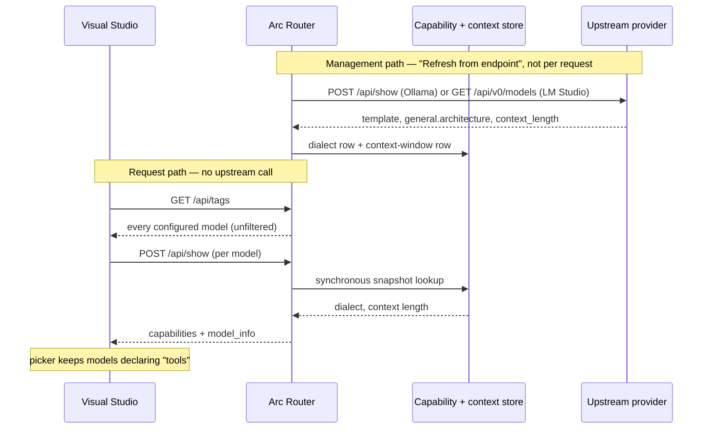

# Ollama `/api/show` capabilities and context length

Makes the router's Ollama-native per-model detail endpoint report what each model can actually do. Today
`POST /api/show` answers with four empty strings, which reads to every capability-filtering client as "this
model supports nothing" — and Visual Studio's Copilot chat filters its model picker on exactly that field,
so no router model is selectable there. This plan sources real tool-calling capability from the dialect
detection the router already performs, sources context length from probe responses it already fetches and
discards, and aggregates both for the synthetic `totallyhot-arcrouter` alias.

**Status: implemented**, all eleven steps. Solution builds with zero warnings; full suite green (2286 tests,
6 pre-existing skips); line coverage 87.97% overall, and 98–100% on every file this change touched. The
facade-level tests were mutation-checked: disabling the persist call in step 6 fails exactly the two tests
that assert it.
One pre-coding check could not be completed and is called out under [Verification](#verification): no local
Ollama was running, so the `/api/show` `capabilities` vocabulary and `model_info` key spelling are
implemented to Ollama's published schema rather than to a captured live response. LM Studio's field names
*were* confirmed against a live instance. **Ordering:** independent — touches the Ollama compatibility handlers and
the tool-call capability store, neither of which is on a PLAN.md phase boundary. Two decisions here are
recorded separately, since both are expensive to reverse once shipped:
[ADR-0002](../adr/0002-store-probed-model-context-windows-in-their-own-table.md) (context windows get their
own table, and no confidence gate) and
[ADR-0003](../adr/0003-declare-tool-support-for-emulated-and-unclassified-models.md) (what `capabilities`
declares for emulated and unscanned models).

## Why

A user added the router to Visual Studio as a custom Ollama provider at `http://localhost:5001`, saw all
configured models listed, and pinned `totallyhot-arcrouter` — then found it absent from the Copilot chat
model picker.

The two lists come from different endpoints, and only the second one filters. The provider dialog is
populated from `GET /api/tags`, an unfiltered dump. The chat picker then calls `POST /api/show` per model
and drops anything that does not declare tool calling, because Copilot chat requires function calling. A
model lacking the declaration is silently excluded rather than shown as disabled.

Captured live from the running router:

```console
$ curl -s -X POST http://localhost:5001/api/show -d '{"model":"totallyhot-arcrouter"}'
{"modelfile":"","parameters":"","template":"","details":{"format":"gguf","family":"","parameter_size":""}}
```

Real Ollama additionally returns `capabilities: ["completion","tools",…]` and
`model_info: {"general.architecture": "…", "<arch>.context_length": N}`. The router emits neither. This is
not specific to the synthetic alias — every configured model is affected, so none of them should be
appearing in the Copilot picker.

`WriteOllamaShowResponseAsync` left these blank deliberately: *"left as ordinary defaults rather than
fabricated"* ([`ProxyMiddleware.cs:2375`](../../src/TotallyHotArcRouter/Proxy/ProxyMiddleware.cs)). That
stance is right for `digest`, `modelfile`, and `template` — the router genuinely has no equivalent. It is
wrong for `capabilities`, which the router *does* know and which a major client gates on.

### Decisions taken

| Question | Decision |
| --- | --- |
| Context-length source | Probe the upstream provider at scan time |
| Synthetic alias aggregation | **Union** of capabilities; **maximum** context length |
| Genuinely unknown values | Omit the field; never fabricate a default |

Probing fits better than it first appears. The existing dialect probes in
[`ModelDialectResolver.cs`](../../src/TotallyHotArcRouter/Proxy/Translation/ToolCalling/ModelDialectResolver.cs)
already fetch the exact JSON documents that carry context length and keep only one field from each: the
Ollama `/api/show` probe (`:288`) parses only `template`, and the LM Studio `/api/v0/models` probe (`:366`)
parses only `arch`. Both discard the rest of a document already in memory. No new round trips.

**Accepted limitation:** hosted OpenAI-shaped and Anthropic endpoints expose no context length, so those
models will report `capabilities` but omit `model_info`. That is sufficient to fix the picker, which gates
on `capabilities` alone.



## Design rationale

### Context length gets its own table, not a column on `ModelToolCapability`

Two corruption paths, both verified against live code, make sharing the row unsafe:

- [`ToolCallObservationRecorder.cs:84`](../../src/TotallyHotArcRouter/Proxy/Translation/ToolCalling/ToolCallObservationRecorder.cs)
  constructs a **fresh** `ModelToolCapability` from the request path with no knowledge of context length,
  and `TryUpsertModelCapability` overwrites the columns it names. The first live tool-call observation
  would null out a probed context length.
- `ToolCallCapabilityStore.ClearModelCapability` issues `DELETE FROM model_tool_capabilities`. An operator
  resetting a dialect override back to automatic would silently destroy an unrelated probed value.

The `(provider, model)` key and the probe are shared; the *write lifecycle* is not, and the write lifecycle
is what decides a table boundary.

A brand-new table also needs **no** additive-column migration. The `MigrateCacheWriteInputPriceColumn`
pattern (`PriceCatalogDatabase.cs:161-171`) exists only because `CREATE TABLE IF NOT EXISTS` cannot add a
column to a table that already exists. A new table has no such blind spot — one `SchemaSql` entry covers
fresh and upgraded databases identically.

### `emulated` and unclassified models must both declare `tools`

`/api/show` describes what *the endpoint at this address* can do with *this name*. The client is talking to
the router, not to the weights.

| Dialect row | Router behavior on a tools request | `tools`? |
| --- | --- | --- |
| `openai-native` | forwarded byte-for-byte; model emits real `tool_calls` | yes |
| `hermes`, `mistral`, `llama3-json`, `function-call` | normalizing translator rewrites the framed region into real `tool_calls` | yes |
| `constrained` | constrained translator sets `response_format` and parses the envelope | yes |
| `emulated` | emulating translator teaches the dialect and reads the reply back | yes |
| unknown name / no row | forwarded natively with the union scanner armed | yes |

**`emulated` is the load-bearing case.** It is the row the router writes *specifically for models that
cannot call tools natively*, after which `ToolCallNormalizerFactory` installs `ToolCallEmulatingTranslator`
— which rewrites the outbound request and normalizes the reply back into real `tool_calls`,
indistinguishable on the wire. Declaring `false` here would make the router's entire emulation feature
invisible to the one client that filters on this field: a strict regression against the bug being fixed.
Ollama's `capabilities` is a static declaration of surface area, not a quality guarantee — real Ollama
declares `tools` for plenty of models whose tool calling is unreliable.

**`null` / no row decides whether the fix works at all.** It is the dominant state: a fresh install has run
no scan, and every hosted provider is unprobeable by construction, since tiers 1 and 2 are gated on
`OllamaNative` / `LmStudioNative`. Omitting `tools` here would filter out exactly the cloud models that
unambiguously support it. It would also misdescribe the router, which reads `null` as "forward natively and
arm the union scanner".

Consequence, stated plainly: **every branch yields `["completion","tools"]` today.** Implement it as an
explicit mapping function anyway — it is the single place a future dialect meaning "cannot express a tool
call at all" has to land, and a `Theory` over `ToolCallDialectRegistry.All` forces that decision to be
conscious rather than inherited.

### The confidence ladder deliberately does not extend to context length

`DetectionConfidence` ranks *how a classification was learned*, so a filename guess cannot overwrite a
template read. Context length has no such ladder to build:

- There is one kind of source — the provider reporting metadata for the model it loaded. Ollama's
  `model_info` and LM Studio's `max_context_length` are peers; neither outranks the other, and nothing
  guesses a context length from a model id.
- A gate would be actively harmful. A model reloaded under a different `num_ctx` genuinely *has* a
  different window; a `>=` gate would freeze the first reading forever.
- The tier-1 branch that returns a **null** capability (template renders tools in an unregistered dialect,
  `ModelDialectResolver.cs:119`) carries no confidence at all, yet its context reading is the most
  authoritative obtainable. A shared ladder would discard the best data on the path that produces it.

So: unconditional upsert, last write wins, with one invariant — **a probe that read nothing writes
nothing**, so a failed re-probe never clears a known value. In-repo precedent is
`ToolCallCapabilityStore.SetProviderCapabilities`, whose remarks make the same argument for the same
reason: *"endpoint flavors are a direct observation of what the server answered, so there is no
weaker-source problem for a confidence gate to solve."*

### Wiring: thread the stores into `ProxyMiddleware`

Its constructor already ends in a long tail of optional, behaviorally-inert dependencies (`budgetStore`,
`circuitBreaker`, `toolCallNormalizerFactory`, `rateLimitCapture`, and more). Appending two more follows
that established pattern, binds automatically from the existing DI singleton registration, and causes
**zero** test churn — every existing construction is
`new ProxyMiddleware(logger, interceptor, new HttpClient(handler))`.

Widening `AvailableModel` and injecting the store into `ModelRouteResolver` was rejected. Beyond breaking
value-equality assertions across six test files, it is **incorrect**: `ModelRouteResolver` rebuilds its
cache only when `_store.Snapshot.Version` advances, and a capability scan does not bump that version, so a
capability carried on `AvailableModel` would serve a stale value indefinitely after every scan.

## Implementation

### 1. Domain record — `Proxy/Translation/ToolCalling/ModelContextWindow.cs` (new)

```csharp
public sealed record ModelContextWindow(
    string ProviderKey, string ModelName, int ContextLength,
    string? Architecture = null, string? Evidence = null, DateTimeOffset DetectedAtUtc = default);
```

`ContextLength` is non-nullable on purpose: the record exists only when a value was actually read, so
"unknown" is the absence of the row rather than a sentinel inside it. That encodes the omit-when-unknown
rule in the type system instead of by convention. Type-level `<param>` docs per the record convention in
`ToolCallCapabilities.cs`.

### 2. Schema — `PriceCatalog/PriceCatalogDatabase.cs`

Add to `SchemaSql` immediately after `model_tool_capabilities` (`:504`), mirroring its `COLLATE NOCASE` key
columns — `ModelCapabilityKey`'s case-insensitive comparer depends on that pairing:

```sql
CREATE TABLE IF NOT EXISTS model_context_windows (
    provider_key    TEXT    NOT NULL COLLATE NOCASE,
    model_name      TEXT    NOT NULL COLLATE NOCASE,
    context_length  INTEGER NOT NULL,
    architecture    TEXT,
    evidence        TEXT,
    detected_at_utc TEXT    NOT NULL,
    PRIMARY KEY(provider_key, model_name)
);
```

No `Migrate*` method, no `EnsureCreated` change. Add a comment saying *why* no migration is needed — every
neighbouring table has one, so its absence would otherwise read as an oversight.

### 3. Repository — `ToolCallCapabilityRepository.cs`

- `GetModelContextWindows()` — mirrors `GetModelCapabilities()` (`:118`); reuse `ParseTimestamp` (`:246`).
  Add a `ReadContextLength(long)` in the spirit of `ReadObservationCount` (`:230`): SQLite INTEGER is
  64-bit, so a hand-edited row can hold a value no `int` represents. **Skip** rows that are `<= 0` or
  `> int.MaxValue` rather than clamping — an unusable number must read as "unknown", not as a fabricated
  one.
- `UpsertModelContextWindow(window)` — plain `INSERT … ON CONFLICT … DO UPDATE` with **no** `WHERE` gate,
  structurally mirroring `UpsertProviderCapabilities` (`:66`) rather than `TryUpsertModelCapability`
  (`:175`). The remarks should state why the gate is absent, referencing the ladder argument above.

### 4. Store — new `IModelContextWindowStore`, implemented by the existing `ToolCallCapabilityStore`

`IToolCallCapabilityStore` is documented as the surface *"the request path uses to decide how — or whether
— to normalize a model's tool calls"*. A context window is not that, and three translators depending on
that interface would gain a member they never call. A separate one-method interface on the same concrete
class keeps the narrow contract while reusing the `Reload()` snapshot swap, the `Changed` event, the
`StartupHealthCheckHostedService` reload, and the repository — and `ManagementFacade` already holds the
concrete type, so the write path needs no new dependency.

On `ToolCallCapabilityStore`: add a third `volatile` snapshot dictionary beside `_modelSnapshot` and
`_providerSnapshot` (`:42-46`); extend `Reload()` (`:66-78`) to build all three under the one `_gate`; add
`GetModelContextWindow` mirroring `:81-91` including the blank-key guard; add a concrete-only
`SetModelContextWindow` that validates with `ArgumentOutOfRangeException.ThrowIfNegativeOrZero`, stamps
`DetectedAtUtc` when `default`, upserts, calls `Reload()`, logs structurally with `SanitizeForLog` on both
key halves, and raises `Changed`. Keep the setter off the read interface, for the same reason
`SetProviderCapabilities` and `ClearModelCapability` are concrete-only. Update the class `<summary>`, which
currently says "the two tool-call capability tables".

### 5. Probe — `ModelDialectResolver.cs`

`ResolveAsync` returns a new, always-non-null
`ModelMetadataProbeResult(ModelToolCapability? Capability, ModelContextWindow? ContextWindow)`; either
member may be null.

Five of the six exits currently discard the whole probe result. Every path must now carry the window:

| Exit | Line | Condition | Today |
| --- | --- | --- | --- |
| A | `:109` | tier 1, template matched a dialect | returns capability |
| B | `:120` | tier 1, no match but `RendersTools` | **returns `null` — total discard** |
| C | `:121` | tier 1, no match and no `.Tools` | returns `emulated` |
| D | `:132` | tier 2, architecture mapped | returns capability |
| — | `:140` | tier 2, architecture **unmapped** | falls through; arch already read, then dropped |
| E | `:146` | tier 3, model-id token hit | returns capability |
| F | `:144` | tier 3, no hit | **returns `null` — total discard** |

Additionally, the `null` return inside `TryReadOllamaTemplateAsync` when `template` is absent or non-string
(`:320-324`) discards the entire parsed document, including a perfectly good `model_info`. **Parse
`model_info` independently of whether `template` parsed.**

Restructure to accumulate before each decision:

```csharp
ModelContextWindow? window = null;

if (endpointCapabilities?.OllamaNative == true) {
    var show = await TryReadOllamaShowAsync(...);       // (Template, Architecture, ContextLength)
    window ??= BuildWindow(providerKey, modelName, show.Architecture, show.ContextLength,
                           "Ollama /api/show model_info.");
    if (show.Template is not null) { /* exits A / B / C, each returning `window` */ }
}

if (endpointCapabilities?.LmStudioNative == true) {
    var lm = await TryReadLmStudioModelAsync(...);      // (Architecture, ContextLength)
    window ??= BuildWindow(..., "LM Studio /api/v0/models.");
    /* exit D returns; an unmapped architecture falls through with `window` retained */
}

var heuristic = MatchModelId(upstreamId) ?? MatchModelId(modelName);
return new(heuristic is null ? null : Capability(...), window);   // exits E / F
```

`??=` gives Ollama precedence when both probes run. `BuildWindow` returns `null` for a missing or
non-positive length, keeping "absent, not zero" in one place.

Probe changes:

- Rename `TryReadOllamaTemplateAsync` to `TryReadOllamaShowAsync`, returning
  `(string? Template, string? Architecture, int? ContextLength)`. Key resolution: read
  `model_info["general.architecture"]`, then `model_info["{arch}.context_length"]`. If
  `general.architecture` is missing, scan `model_info` for the first property whose name ends in
  `".context_length"` with a numeric value and take its prefix as the architecture. Range-guard so a
  garbage value never throws. Keep the existing `ReadCappedAsync` and exception filter untouched.
- Rename `TryReadLmStudioArchitectureAsync` to `TryReadLmStudioModelAsync`, returning
  `(string? Architecture, int? ContextLength)`. **Prefer `loaded_context_length` over
  `max_context_length`** when present and positive: `max` is the trained ceiling, `loaded` is what the
  runtime will actually accept. Under-reporting truncates early; over-reporting causes hard upstream
  failures.
- Update `<returns>` and the type-level remarks, which currently say "an unresolved model writes no row at
  all" — still true of the *dialect*, but must now be scoped to it.

### 6. Persist — `ManagementFacade.cs`

`TryResolveDialectsAsync` (`:447`) is the single funnel for all four scan entry points (`:174`, `:327`,
`:418`, `:953`). Change its body to record both results, and rename it to `TryResolveModelMetadataAsync`
(with `DialectResolutionBudget` becoming `ModelProbeBudget`), updating the four call sites and the remarks.
No new round trips: both fields come out of documents the existing probes already fetch and parse, entirely
inside the existing 10-second budget.

### 7. DI — one line beside `ServiceCollectionExtensions.cs:501`

```csharp
services.AddSingleton<IModelContextWindowStore>(sp => sp.GetRequiredService<ToolCallCapabilityStore>());
```

Nothing else. `ProxyServerDependencies` and `ManagementApiDependencies` are untouched, and
`StartupHealthCheckHostedService` already calls `Reload()`, which now covers the third snapshot.

### 8. Capability mapping — `OllamaModelCapabilities` (new, internal)

`ForDialect(string? dialectName)` implementing the table above, resolving via
`ToolCallDialectRegistry.TryGet`, plus `Union(...)` emitting a **deterministic canonical order**
(`completion` first, then a fixed array) rather than `HashSet` enumeration order — so the JSON is stable
across runs and across test assertions. Internal, so tests reach it through the existing
`InternalsVisibleTo`; document it per AGENTS.md regardless.

### 9. `/api/show` — `ProxyMiddleware.cs`

- Two optional parameters appended after `routingGate`, with `<param>` docs matching the surrounding style:
  behaviorally inert when defaulted — every model reads as unclassified and `model_info` is omitted,
  exactly as today.
- Widen `OllamaShowResponse` (`:2380`):

  ```csharp
  [property: JsonPropertyName("model_info")]
  [property: JsonIgnore(Condition = JsonIgnoreCondition.WhenWritingNull)]
  IReadOnlyDictionary<string, JsonNode>? ModelInfo,
  [property: JsonPropertyName("capabilities")] IReadOnlyList<string> Capabilities
  ```

  `JsonSerializer.Serialize(...)` is called here with no options, so default behavior writes nulls — the
  per-property `JsonIgnore` is what makes the omit-when-unknown rule hold without introducing a shared
  options object. Both namespaces are already imported. `Capabilities` is non-nullable and never empty,
  the honest encoding of "`completion` is always true".
- **Always emit `general.architecture` and `{arch}.context_length` together, or neither.** Clients resolve
  context by indirection — read the architecture, then key off it — so a bare `.context_length` with no
  matching architecture breaks the standard read path.
- Identify the synthetic alias by **provider key** (`"totallyhot"`, documented as deliberately not a real
  provider), not by model name: a user could legitimately configure a model named `totallyhot-arcrouter`.
  Requires making `RouterModelProvider` (`RequestInterceptor.cs:50`) `internal`.
- Add a private `DescribeModel(AvailableModel)` returning the capabilities and optional `model_info`:
  - **Router alias:** iterate `ListAvailableModels()`, skip the alias itself, and skip any model failing
    `IsProviderEnabled(m.Provider)` **or** `IsModelEnabled(m.ModelName)`. Note `ListAvailableModels()`
    performs no enablement filtering today, so this gate is genuinely new behavior at this call site. Union
    the capabilities; take `Max` of the known context lengths; key `model_info` under the constant
    `"arcrouter"` — deliberately *not* a real GGUF architecture name, so a client keying behavior off the
    architecture falls back to generic handling rather than trusting a plausible-but-wrong `"llama"`. This
    is the same judgment `TryMapArchitecture`'s remarks already make about `llama`. With zero eligible
    models the answer is `["completion"]` and no `model_info` — honest, and the alias is correctly filtered
    out, since it could not serve a tool request anyway.
  - **Real model:** `GetModelCapability(m.Provider, m.ModelName)` into `ForDialect(...)`, and
    `GetModelContextWindow(...)` into the probed architecture (else `"arcrouter"`) plus context length.
    Omit `model_info` entirely when the window is null.

  This is the same in-memory-snapshot join `ManagementFacade.cs:1067` already performs to populate
  `ModelAdminView` — cite it in the comment.
- The 404 path (`:2340-2357`) is untouched.

### 10. `/api/tags` — no capabilities

Real Ollama emits `capabilities` and `model_info` on `/api/show` only; both were added there and nowhere
else. The premise of these three handlers is to be indistinguishable from Ollama, and the flow Visual
Studio actually drives is tags, then show-per-model. Emitting the field on `/api/tags` buys nothing for the
target client and creates divergence for every other one. A test pins this decision so nobody
"helpfully" adds it later.

### 11. Docs

Update `docs/router/tool-call-normalization.md` §3.2: tiers 1 and 2 now also read a context window, the
store gained a third table, and the confidence ladder deliberately does not extend to it. Record the
operational caveat from risk 1 below wherever the Visual Studio / Ollama integration is described.

## Verification

### Pre-coding checks — results

| # | Check | Result |
| --- | --- | --- |
| 1 | Ollama `/api/show` `capabilities` strings and `model_info` key spelling | **Not done** — no local Ollama running. Implemented to the published schema. See the open risk below. |
| 2 | What Visual Studio filters on (`/api/show` vs `/api/tags`) | **Not done** — needs a Fiddler capture against the live picker. |
| 3 | LM Studio `/api/v0/models` field names | **Confirmed** against a live instance on `localhost:1234`: entries carry `arch`, `max_context_length`, and `loaded_context_length` exactly as assumed. |
| 4 | DI fills the two new optional constructor parameters | **Confirmed**: `ProxyMiddleware` is container-constructed (`AddSingleton<ProxyMiddleware>()`), and both `IToolCallCapabilityStore` and `IModelContextWindowStore` are registered singletons. |

Checks 1 and 2 remain genuinely open and are the first thing to do with a live Ollama and a Fiddler
session. Neither blocks the change: the `capabilities` names used (`completion`, `tools`) are the ones
Ollama's own documentation shows, and if check 2 reveals Visual Studio reads `/api/tags` instead, step 10
flips and the array moves — the values it declares would not change.

### Tests

Extend, do not replace. The existing `InvokeAsync_PostOllamaShow_*` tests assert only status codes and the
`template` / `details` fields, so they keep passing unmodified.

- **`Proxy/ProxyMiddlewareTests.cs`** (Ollama block `:774-872`): declares completion and tools; an
  `emulated` model still declares tools; an unclassified model still declares tools; context length is
  keyed by the probed architecture; **an unknown context omits `model_info` entirely** — assert
  `Assert.False(root.TryGetProperty("model_info", out _))`, absent rather than null, which is the test that
  catches a regression to default serialization; the router alias unions capabilities and takes the
  maximum; the alias ignores a disabled model and a model on a disabled provider, asserted separately; the
  alias with no eligible models declares completion only; `/api/tags` declares no capabilities.
- **`FakeToolCallCapabilityStore`** — also implement `IModelContextWindowStore` and add
  `SeedContextWindow(...)`. Roughly ten lines, and the only test-double change needed.
- **`ModelRouteResolverTestFactory`** — add `CreateWithModelEntries(params ModelRouteEntry[])`;
  `CreateWithModelList` cannot express `Enabled=false` or `PresentUpstream=false`, which the governance
  tests need. Purely additive; all 28 existing construction sites untouched.
- **`ModelDialectResolverTests`** — mechanical `Assert.Null(result)` becomes
  `Assert.Null(result.Capability)`. New cases named for the return path each protects: a template matching
  nothing still records the context length (**exit B**); an unmapped LM Studio architecture still records it
  (tier-2 fall-through); a model-id heuristic miss still records it (**exit F**); a response without
  `model_info` records no window; a response without `general.architecture` still finds the length via the
  suffix scan; a value too large for `int32` is ignored rather than throwing; `loaded_context_length` wins
  over `max_context_length`.
- **`ToolCallCapabilityStoreTests`** — the separation invariants that are the whole architectural argument:
  recording a dialect observation does not disturb the context window; `ClearModelCapability` leaves it
  intact; last write wins with no confidence gate; lookups are case-insensitive on both key halves.
- **`Proxy/Management/ModelDialectDetectionTests`** — end to end through the facade: a scan persists the
  context window alongside the dialect, and a scan that learns no dialect still persists the window.
- **New `OllamaModelCapabilitiesTests`** — a `Theory` over every `ToolCallDialectRegistry.All` name plus
  `null` and an unknown name, plus an exhaustiveness assertion so that adding a registry entry fails the
  build until someone decides its capability. Plus union-ordering determinism.

Gates per AGENTS.md: zero warnings (`TreatWarningsAsErrors`), XML docs on every public member (`CS1591`),
at least 80% coverage, and no test over 5 seconds. Only the store and facade tests touch SQLite, adding
roughly two writes each — well inside the budget given the existing fixtures.

### End to end

Rebuild, restart the router, then re-run the two commands used to diagnose this and confirm `capabilities`
and `model_info` now appear:

```bash
curl -s -X POST http://localhost:5001/api/show -H "Content-Type: application/json" -d '{"model":"totallyhot-arcrouter"}'
```

Then run "Refresh from endpoint" for a local Ollama or LM Studio provider, confirm the context window
appears for its models, re-open the Visual Studio Copilot chat picker, and confirm `totallyhot-arcrouter`
is selectable and answers a tool-using prompt.

## Risks

1. **The fix ships partly inert.** `ResolveAsync` runs only from the four `ManagementFacade` scan entry
   points, so a user who upgrades and does nothing gets `capabilities` — which alone fixes the picker — but
   no `model_info` until they press "Refresh from endpoint". Document it; consider a GUI hint. **Do not
   probe from the request path:** `/api/show` is answered by middleware for a picker that polls, and an
   inline probe to a cold local model can trigger a multi-second model load.
2. **Ollama's `{arch}.context_length` is the trained maximum, not the served `num_ctx`.** Ollama commonly
   serves a 131,072-context model with `num_ctx=4096`. Advertising the trained value causes hard upstream
   failures on long prompts. Real Ollama has the same discrepancy in its own `/api/show`, so mirroring it
   is defensible — but the router is the thing whose prompts get rejected. Consider parsing the
   `parameters` string for a `num_ctx` line and preferring it when present.
3. **Maximum for the router alias over-advertises by construction.** The alias may route a maximum-length
   prompt to a model with a smaller window. This is the chosen behavior; document that minimum is
   safe-by-construction while maximum shifts the failure into the routing path.
4. **Non-chat models get declared tool-capable.** Model reconciliation auto-adds every id a provider lists,
   including embedding and reranker models, which would now report `["completion","tools"]`. The real fix
   is the follow-up below.
5. **`MaxShowResponseBytes`** (512 KB, `ModelDialectResolver.cs:39`) already makes the template unreadable
   for a model whose Modelfile carries a large license block. Pre-existing; now inherited by a second
   feature. Worth a comment.
6. **Disabled models are still listed and describable** by `/api/tags` and per-model `/api/show` —
   unchanged from today, since the enablement filter applies only to the alias union. Flagged rather than
   silently changed.

## Follow-up (out of scope)

A real Ollama `/api/show` returns its *own* `capabilities` array, and `TryReadOllamaShowAsync` will be
parsing that document anyway. Passing it through — persisted alongside the context window — would let an
Ollama-backed embedding model honestly report `["embedding"]` instead of `["completion","tools"]`, and
would give `ForDialect` real branches. It helps only Ollama-backed providers, since LM Studio and every
cloud provider still fall back to the derived mapping, so it is strictly additive.
