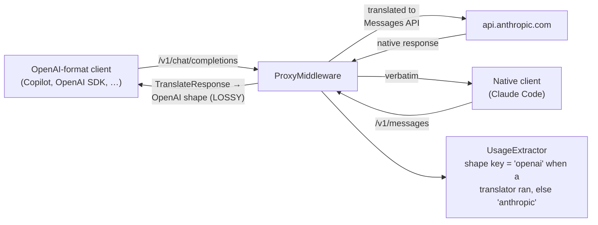

# Accurate Usage for OpenAI-Format Traffic — Anthropic-behind-OpenAI, plus OpenAI provider parity

> **Status: implemented (Phases 1-3 complete).** Extends the implemented
> [`anthropic-reported-usage-plan.md`](anthropic-reported-usage-plan.md) (Phases 1–3 of that plan
> shipped in commit `00ea4ed`). That plan made Anthropic usage cache-aware — but, as verified below,
> only for clients that speak Anthropic's **native** `/v1/messages` shape. This plan closes the gap
> for the far more common case — **OpenAI-format clients routed to the Anthropic provider** — and
> delivers the same usage/rate-limit accuracy for the **actual OpenAI provider**, so both API
> dialects are tracked correctly side by side.

## 1. Problem statement (verified against the code)

The router's unified client-facing API is OpenAI-shaped. When an OpenAI-format request routes to
the Anthropic provider, `AnthropicPayloadTranslator` rewrites it to `/v1/messages`, and the
response is translated *back* to OpenAI shape **before** telemetry captures it:



`ProxyMiddleware` deliberately keys usage parsing on the **shape of the captured bytes**, not the
provider: `telemetryShapeProvider = translator is not null ? "openai" : route.Provider`
(`Proxy/ProxyMiddleware.cs`, the `PublishTelemetryAsync` call site). That design is correct — but
three compounding losses make the translated path inaccurate:

| # | Where | Loss |
|---|---|---|
| 1 | `AnthropicPayloadTranslator.TranslateUsage` | Maps only `input_tokens`/`output_tokens` → `prompt_tokens`/`completion_tokens`; **drops `cache_creation_input_tokens` and `cache_read_input_tokens`** from the non-streaming response. |
| 2 | `AnthropicStreamTranslator.EmitChunk` | The terminal chunk's `usage` emits only prompt/completion — even though the translator's `_usage` state already holds the full native usage object from `message_start`/`message_delta`. |
| 3 | `OpenAiUsageParser` | Reads only `prompt_tokens`/`completion_tokens`; no `prompt_tokens_details.cached_tokens` support — so even an enriched body would be parsed lossily today. |

Consequences, per Anthropic's accounting rule (`input_tokens` counts only tokens **after the last
cache breakpoint**): for OpenAI-format traffic to Anthropic, the ledger's tokens **and** the cost
estimate are understated whenever prompt caching is active — exactly the error class the previous
plan fixed, surviving on this path. Claude-Code-style clients are unaffected only because
`ShouldTranslate` vetoes translation for native `/v1/messages` requests.

A fourth, independent gap affects the **real OpenAI provider**: OpenAI reports cached prompt tokens
in `usage.prompt_tokens_details.cached_tokens` and rate limits in `x-ratelimit-*` response headers.
Neither is parsed/captured today, so OpenAI cost is **overstated** (cached tokens are billed at a
discount but priced here at the full input rate) and OpenAI's server-reported limits are discarded.

### 1.1 The semantics trap: additive vs inclusive

The two dialects disagree about what the headline input number means:

| | Headline field | Cache relationship |
|---|---|---|
| Anthropic | `input_tokens` | **Exclusive** — cache tokens are separate, additive fields. True input = `input + cache_creation + cache_read`. |
| OpenAI | `prompt_tokens` | **Inclusive** — `cached_tokens` is a subset of `prompt_tokens`, broken out in `prompt_tokens_details`. |

`Telemetry/UsageInfo.cs` is canonically **additive** (its `TotalInputTokens` implements the
Anthropic formula). Every parser must therefore normalize to additive at parse time — naively
mapping OpenAI's `cached_tokens` into `CacheReadTokens` without subtracting it from `PromptTokens`
would double-count. This is tokscale's unified-bucket approach (see §3).

## 2. Decisions (confirmed with the operator, 2026-08-07)

1. **Both fixes on the translated path**: a **native telemetry tap** (usage parsed from the
   pre-translation Anthropic body, immune to translation lossiness) **and** an **enriched
   client-visible usage object** in the translated OpenAI-shaped response. Accepted costs: a second
   capped capture buffer on translated streaming requests, and the ledger sourcing from native
   bytes while clients read translated bytes (kept equal by construction via shared tests).
2. **OpenAI semantics in the enriched payload**: translated `prompt_tokens` becomes the inclusive
   total (`input + cache_creation + cache_read`), with `prompt_tokens_details.cached_tokens` broken
   out — an OpenAI client interprets the response exactly as it would a real OpenAI one. The raw
   Anthropic components ride along as extension fields (LiteLLM's convention), so nothing is lost.
3. **OpenAI provider parity is in scope**: `cached_tokens` parsing with correct inclusive→additive
   normalization, and `x-ratelimit-*` header capture through the existing prefix-capture seam.
4. **New document** (this file), cross-referencing the implemented plan rather than rewriting its
   history. No third-party runtime dependency is added anywhere below.

## 3. Influences from the reviewed projects (second pass, OpenAI-format focus)

| Project | Technique adopted here |
|---|---|
| [tokscale](https://github.com/junhoyeo/tokscale) | The unified **additive bucket model** (input / output / cache-read / cache-write): OpenAI's `cached_tokens` normalizes into the cache-read bucket *and is subtracted from input*; Anthropic's fields map 1:1. Also: LiteLLM as primary price source with cache-discount rates — already this repo's active source. |
| [cccost](https://github.com/badlogic/cccost) | Confirms the wire-interception position; Anthropic-only, so its lesson here is the *counter-example*: format support must be per-shape, not per-tool. |
| [claude-usage-tracker](https://github.com/658jjh/claude-usage-tracker) | Four-way token split in the persisted ledger (already shipped in the previous plan). |
| [TokenTracker](https://github.com/mm7894215/TokenTracker) | "No published price ⇒ show tokens, not a guessed $" (repo rule D7); bounded history growth (already shipped). |
| [token-monitor](https://github.com/Javis603/token-monitor) | Rate-limit state from **response headers**, archived locally — extended here to OpenAI's `x-ratelimit-*` family. Its local-file scanning approach is again rejected as invasive. |
| [anthropic-usage-receiver](https://github.com/honeycombio/anthropic-usage-receiver) | Remains the future enterprise Admin-API path (backlog #3); untouched by this plan. |

## 4. Phase 1 — Native telemetry tap for translated Anthropic traffic

Telemetry stops depending on translation fidelity: when the provider's **native** response shape
has a registered parser, usage (and response text) are extracted from the pre-translation bytes.

### 4.1 Capture both shapes

- **`Proxy/ProxyMiddleware.cs`** — introduce a small result record for the capture helpers,
  e.g. `CapturedResponse(byte[] ClientShapeBytes, byte[]? NativeBytes)`:
  - `TranslateAndCaptureBufferedAsync` already materializes the native body
    (`upstream.ToArray()`) before calling `TranslateResponse` — return it (capped at
    `MaxCapturedResponseBytes`) alongside the translated capture. No extra buffering cost.
  - `TranslateAndCaptureStreamAsync` — additionally accumulate the **upstream** SSE bytes into a
    second capped `MemoryStream` as chunks are read, before they enter the stream translator. This
    is the one genuinely new buffer (≤ 4 MB per in-flight translated streaming request) accepted in
    decision 1.
  - `CopyAndCaptureAsync` (pass-through path) is unchanged — captured bytes already *are* native.
- **Gating:** native capture is only useful when `UsageExtractor` can parse that provider's native
  shape. Gate it on a small set (initially `"anthropic"`), expressed as a static
  `UsageExtractor.SupportsNativeShape(string provider)` (or equivalent constant set) so the
  middleware and the extractor cannot drift. Gemini keeps translated-only capture — its native
  shape has no registered parser, and adding one is explicitly out of scope.

### 4.2 Select the native shape for extraction

- **`PublishTelemetryAsync`** — accept the paired capture. Extraction order: when `NativeBytes` is
  present, call `TryExtractUsage(route.Provider, …, NativeBytes)` (the Anthropic parser is already
  cache-aware from the previous plan) and `TryExtractText` the same way; otherwise fall back to
  today's behavior (`telemetryShapeProvider` + `ClientShapeBytes`). The
  `telemetryShapeProvider` computation stays for the fallback and for pass-through traffic.
- **Bedrock note (stretch, not required):** `InvokeBedrockAsync` also has native bytes in hand
  (`response.Body.ToArray()`), and Anthropic-on-Bedrock bodies are Claude-shaped — but Bedrock's
  streaming chunks are not SSE-framed, so the streaming parser doesn't apply. Leave Bedrock on the
  translated path; record the option here for a future phase.

### 4.3 Phase 1 tests

- Middleware-level (mirroring `AnthropicProviderTests`' fixtures): a translated non-streaming and a
  translated streaming Anthropic response with cache fields → ledger records
  `CacheCreationTokens`/`CacheReadTokens` (asserting the native tap, since the translated body
  currently drops them — this test **fails before, passes after**).
- Capture-cap behavior on the new streaming native buffer (oversized upstream truncates the
  capture, never the client copy).
- Pass-through and Gemini paths byte-for-byte unchanged (no native buffer allocated).

## 5. Phase 2 — Enriched translated usage (client-visible)

The OpenAI-shaped response OpenAI-format clients receive becomes accurate under OpenAI semantics.

### 5.1 Shape

Both `AnthropicPayloadTranslator.TranslateUsage` (non-streaming) and
`AnthropicStreamTranslator.EmitChunk` (terminal chunk — its `_usage` state already carries the
fields) emit:

```json
"usage": {
  "prompt_tokens":      /* input + cache_creation + cache_read  (inclusive, per decision 2) */,
  "completion_tokens":  /* output_tokens */,
  "total_tokens":       /* prompt_tokens + completion_tokens */,
  "prompt_tokens_details": { "cached_tokens": /* cache_read */ },
  "cache_creation_input_tokens": /* verbatim passthrough (extension field, LiteLLM convention) */,
  "cache_read_input_tokens":     /* verbatim passthrough (extension field) */
}
```

Absent native cache fields ⇒ omit the details/extension fields and emit today's two-field shape —
older responses and cache-free requests are byte-compatible with current behavior.

### 5.2 Phase 2 tests

- `AnthropicProviderTests` (or a focused translator test): cache-carrying native response →
  enriched usage object, exact field-by-field; cache-free response → unchanged legacy shape;
  streaming terminal chunk parity with the non-streaming shape.
- **Agreement pin (decision 1's drift guard):** one test that runs the same native fixture through
  *both* the native tap (Phase 1) and the enriched-body OpenAI parser (Phase 3's normalization) and
  asserts identical additive `UsageInfo` — the ledger and the client can then never disagree
  without a red test.

## 6. Phase 3 — OpenAI provider parity

### 6.1 Cache-aware parsing with inclusive→additive normalization

- **`Telemetry/OpenAiUsageParser.cs`** — `TryExtractFromUsageContainer` additionally reads
  `prompt_tokens_details.cached_tokens` and (when present, from enriched translated bodies)
  `cache_creation_input_tokens`. Normalization to the additive `UsageInfo` model:

  ```text
  CacheReadTokens     = cached_tokens                                  (0 when absent)
  CacheCreationTokens = cache_creation_input_tokens                    (0 when absent)
  PromptTokens        = max(0, prompt_tokens − CacheReadTokens − CacheCreationTokens)
  ```

  The `max(0, …)` clamp is a malformed-input guard, documented as such. `UsageInfo`'s XML docs gain
  the explicit statement that its fields are **additive** (Anthropic-convention) and that inclusive
  dialects are normalized at parse time — the single place that rule lives.
- **Pricing** — no formula change needed: `ModelPrice.EstimateCost`'s cache-aware overload (previous
  plan §4.2) already prices additive buckets, and LiteLLM publishes `cache_read_input_token_cost`
  for OpenAI models. The conservative fallback (missing cache rate ⇒ input rate) now also correctly
  bounds OpenAI: today's behavior (full input rate on all prompt tokens) becomes the *fallback*
  instead of the only path, so cost estimates can only improve.

### 6.2 `x-ratelimit-*` header capture

- **`Telemetry/RateLimitHeaderCapture.cs`** — generalize the single `anthropic-ratelimit-` prefix
  to a static prefix set: `["anthropic-ratelimit-", "x-ratelimit-"]`. Storage is untouched — the
  `provider_rate_limit_*` tables already store verbatim header names per provider key (the previous
  plan's §5.2 predicted exactly this extension). Capture stays prefix-based and provider-agnostic:
  whatever family a provider answers with is what gets recorded.
- **`PriceCatalog/RateLimitSnapshotParser.cs`** — add the OpenAI family to the typed view:
  `x-ratelimit-{limit,remaining,reset}-{requests,tokens}`. Two format differences from Anthropic,
  handled in the parser (storage stays verbatim):
  - `reset` values are **Go-style durations** (`1s`, `6m0s`, `23h`), not RFC 3339 — parse to a
    relative `TimeSpan` and surface `ResetAt = observed_at + duration` alongside the raw string.
  - No `input-tokens`/`output-tokens` split — just `requests` and `tokens` dimensions.
  Unparseable values continue to surface raw, never dropped.
- **GUI (`Gui/Components/ProvidersAdmin.razor`)** — the existing "Reported by Anthropic" card
  section generalizes to "Reported by {provider}" and renders for OpenAI-typed providers too, using
  the same `ProviderRateLimitView` flow through `ManagementFacade` → `GET /admin/providers`. Card
  section only — the `SettingsModal` window-shell contract does not apply.

### 6.3 Phase 3 tests

- `OpenAiUsageParserTests`: `cached_tokens` present/absent, enriched-body extension fields,
  the subtraction normalization, and the clamp on malformed (cached > prompt) input.
- `RateLimitHeaderCaptureTests`: `x-ratelimit-*` captured, unrelated `x-*` headers ignored, both
  families captured when both appear.
- `RateLimitSnapshotParserTests`: OpenAI family with duration resets (including `6m0s` compound
  form), mixed-family rows, malformed durations surfacing raw.
- GUI tests: card renders for OpenAI-typed providers; Anthropic rendering unchanged.

## 7. Out of scope (recorded so extension stays additive)

- **Gemini**: `usageMetadata.cachedContentTokenCount` normalizes into the same additive model when
  a Gemini native parser (or translated-body enrichment) is built — `UsageInfo` needs no change.
- **Bedrock native tap** (§4.2 note) and Bedrock usage parsing generally.
- **Enterprise Admin-API ingestion** (backlog #3) — unchanged, still additive later.
- Trend charts over `provider_rate_limit_history` — the data accrues; charts remain a pure GUI add.

## 8. Verification (every phase, per `AGENTS.md`)

1. `dotnet build` — zero warnings/errors (`TreatWarningsAsErrors` repo-wide; XML docs on every new
   or touched public member).
2. `dotnet test` — full suite green, ≥ 80 % coverage, no unit test over 5 s.
3. Manual end-to-end: one cache-heavy conversation through each of (a) an OpenAI-format client →
   Anthropic route, (b) a native `/v1/messages` client → Anthropic route, (c) an OpenAI provider
   route. Confirm the ledger's cache columns advance on (a) and (b) identically-shaped, cost on (c)
   drops for cached prompts, and the GUI card shows `x-ratelimit-*` data for (c).
4. Docs touched: `telemetry.md` (usage-provenance table gains the native-tap and normalization
   rules), `model-price-catalog.md` (no schema change, note OpenAI cache pricing now applied),
   `anthropic-reported-usage-plan.md` (one-line pointer to this plan under its §7).

## 9. Sources

- [Anthropic rate limits & response headers](https://platform.claude.com/docs/en/api/rate-limits)
- [OpenAI rate limits & `x-ratelimit-*` headers](https://platform.openai.com/docs/guides/rate-limits)
- [OpenAI prompt caching (`cached_tokens`)](https://platform.openai.com/docs/guides/prompt-caching)
- Reviewed projects: [tokscale](https://github.com/junhoyeo/tokscale) ·
  [cccost](https://github.com/badlogic/cccost) ·
  [claude-usage-tracker](https://github.com/658jjh/claude-usage-tracker) ·
  [TokenTracker](https://github.com/mm7894215/TokenTracker) ·
  [token-monitor](https://github.com/Javis603/token-monitor) ·
  [anthropic-usage-receiver](https://github.com/honeycombio/anthropic-usage-receiver) ·
  [ai-cost-tracking topic](https://github.com/topics/ai-cost-tracking?o=asc&s=updated)
