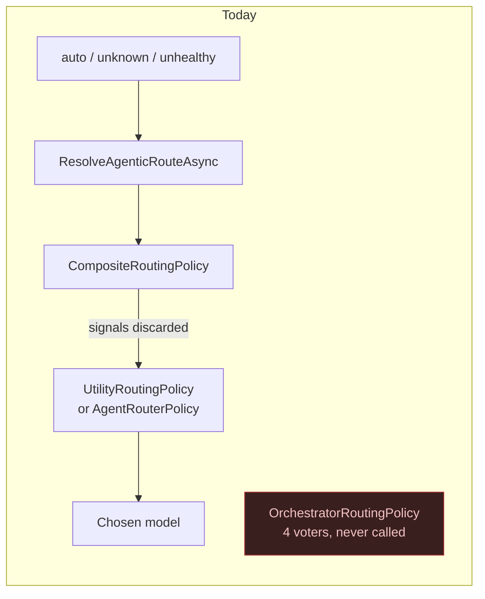
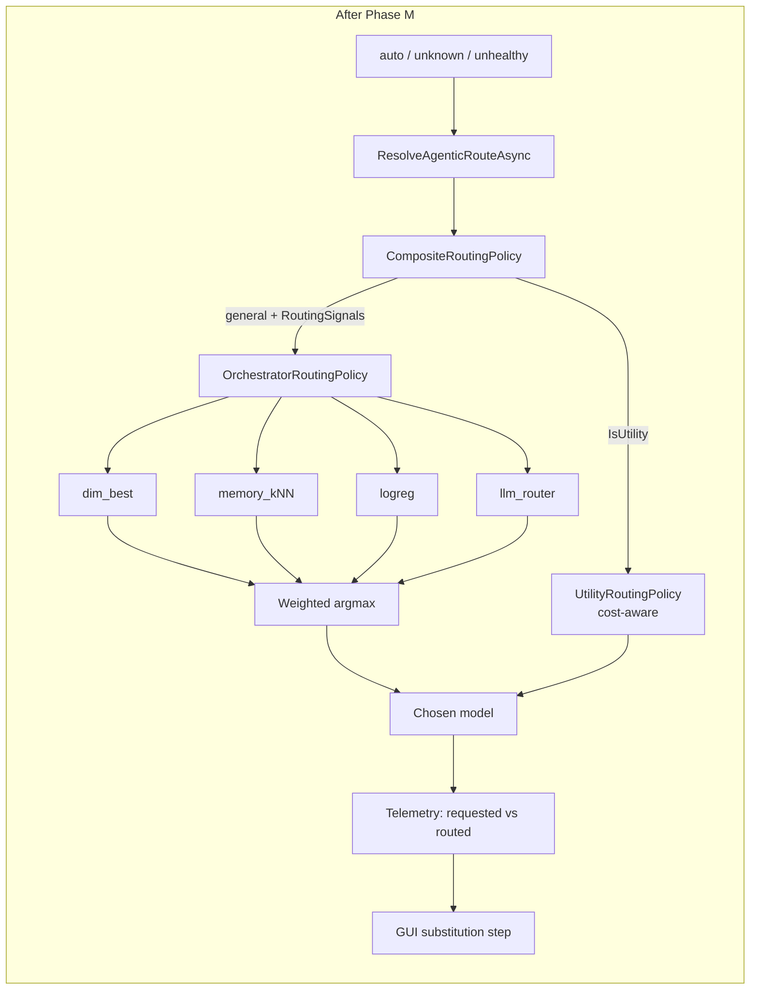

# Orchestrator Live-Path Plan (PLAN.md Phase M)

Puts the Orchestrator ensemble on the live routing path for every request the router actually decides,
and makes every substitution it performs visible in telemetry and the GUI.

**Status:** shipped — all four sub-phases (M1–M4) implemented.
M1: `CompositeRoutingPolicy` dispatches non-utility traffic to `OrchestratorRoutingPolicy` by default
(`RoutingOptions.EnableOrchestratorPolicy` is the kill switch), with exploration lifted into the
Orchestrator. M2: requested-vs-routed telemetry end to end (commit `ffcc8fa`; build order in
[`phase-m2-plan.md`](phase-m2-plan.md)). M3: substitution steps in the GUI decision log plus the
read-only `RoutingModeAdminService`/`RoutingModeAdmin.razor` Governance sub-tab (commit `78650e8`).
M4: docs reconciliation. §M3.2's editable-toggle deferral is partially reopened by
[`self-organizing-classification-plan.md`](self-organizing-classification-plan.md) Phase T6.
**Ordering (historical):** landed after PLAN.md Phase L and `live-feedback-learning-plan.md` Phases 1–3;
before PLAN.md Phase N.

**Owning roadmap entry:** [`../../src/PLAN.md`](../../src/PLAN.md) Phase M. This file carries the
detail; the roadmap carries the ordering and the exit bar.

---

## 1. Scope decision: a named model is a command, not a prior

PLAN.md Phase M was originally written to route **every** request, with an explicitly-named model
demoted to "a strong prior/voter rather than a command" behind a `ModelRouting.HonorRequestedModel`
opt-out. **That is superseded by an explicit product decision: when a client names a model, the router
serves that model.** No vote, no prior, no override.

Consequently the following are **not built**, and this plan does not defer them — it removes them:

- The `requested_model` voter and its weight.
- `ModelRouting.HonorRequestedModel`. An option with one meaningful value is not an option.
- The per-request pin escape (a `pin:` model-name prefix, an `X-ArcRouter-Pin-Model` header). There is
  nothing to pin against.
- `RoutingContext.RequestedModel`. No voter needs it. The client's literal requested name still flows
  to telemetry (M2), but it never enters a routing decision.

`docs/router/utility-model-routing.md`'s locked non-goal — *"Changing how normal, explicitly-named
model requests is out of scope"* — therefore **stands unchanged**. PLAN.md previously recorded that
Phase M would supersede it; that supersession is withdrawn.

### 1.1 What still routes — which is most traffic

**The expected deployment sends `{"model": "auto", ...}` on the majority of requests.** The named-model
carve-out in §1 is therefore a minority path, not the main one, and the Orchestrator decides on most
traffic without ever needing to override anybody.

`auto` and an unrecognized model name are the **same** code path, not merely similar ones: both branches
call `ResolveAgenticRouteAsync(classification, liveDimension, routingSignals, cancellationToken)` with
identical arguments ([`RequestInterceptor.cs:308`](../../src/TotallyHotArcRouter/Proxy/RequestInterceptor.cs:308)
and [`:335`](../../src/TotallyHotArcRouter/Proxy/RequestInterceptor.cs:335)), as
`utility-model-routing.md`'s generalized fallback specifies.

| Path | Trigger | Share |
|---|---|---|
| **Explicit auto-select** | `"model": "auto"` (any casing) — [`:301`](../../src/TotallyHotArcRouter/Proxy/RequestInterceptor.cs:301) | **Majority of traffic** |
| Unknown model name | The name isn't in `ModelList` — [`:323`](../../src/TotallyHotArcRouter/Proxy/RequestInterceptor.cs:323) | Same code path as `auto` |
| Administratively stopped model | `IsModelEnabled` false (operator Stop, or the provider's last scan dropped it) | Same branch |
| Circuit-open or stopped primary | A named model resolves but its target/provider is unhealthy or switched off — [`:378`](../../src/TotallyHotArcRouter/Proxy/RequestInterceptor.cs:378) | Incident-driven |
| Utility-classified traffic | `IsUtility` → `UtilityRoutingPolicy`, cost-aware and quality-gated | Background |
| Failover cascade | The ranked backup list `ProxyMiddleware` walks on an upstream outage | Incident-driven |

### 1.2 What this costs

**Very little, and less than an earlier draft of this plan claimed.** That draft argued the router would
be reduced to observational learning — accumulating `RouterMemory` scores and `memory_entries` rows only
for models clients happened to name, never able to discover that a model nobody asked for is better for
a dimension. **That is wrong for the expected traffic mix.** On an `auto`-majority deployment the router
chooses on most requests, so it both selects and explores on most requests; the interventional loop the
research doc depends on is intact. The concern would only bite in a deployment where clients
predominantly name models — a configuration this plan does not target.

What honoring named models actually costs is narrower: on the minority of requests that name a servable
model, the router cannot substitute a better one, and that request contributes an observation for a
model it did not pick. That is a small, bounded reduction in signal, not a structural break in the loop.

**The real risk is elsewhere, and this plan must not ship it:** the Orchestrator has no exploration at
all. Since `auto` is the majority path, exploration on that path is the router's *primary* mechanism for
sampling models it has not learned about — see M1.2, which is now the most consequential decision in
this plan.

**Phase N is unaffected either way.** Its regret harness is an offline streaming replay over the restored
CodeRouterBench matrices — no live API calls, no dependence on live traffic being routed. The
falsifiable claim it makes (regret *ordering* vs. the baselines) is measured offline regardless.

---

## 2. Why this phase exists

PLAN.md Phase L shipped a four-voter ensemble. `live-feedback-learning-plan.md` Phases 1–3 shipped the
feedback capture those voters read. Neither is reachable from a live request — not because of the
named-model question above, but because of a single DI registration.

### 2.1 Verified in the code today

| Claim | Evidence |
|---|---|
| `CompositeRoutingPolicy`, not `OrchestratorRoutingPolicy`, is the registered `IRoutingPolicy` | [`Hosting/ServiceCollectionExtensions.cs:171`](../../src/TotallyHotArcRouter/Hosting/ServiceCollectionExtensions.cs:171) |
| `CompositeRoutingPolicy` does not override the `RoutingSignals` overload, so the interface default silently discards the task text and embedding the interceptor computed | [`Router/CompositeRoutingPolicy.cs:25`](../../src/TotallyHotArcRouter/Router/CompositeRoutingPolicy.cs:25), [`Router/IRoutingPolicy.cs:30`](../../src/TotallyHotArcRouter/Router/IRoutingPolicy.cs:30) |
| Telemetry's `RequestedModel` is the **post-routing** primary candidate, not the client's literal `model` string — so today's substitutions are already misreported | [`Proxy/ProxyMiddleware.cs:259`](../../src/TotallyHotArcRouter/Proxy/ProxyMiddleware.cs:259) — `candidates[0].Route.ModelName` |
| No telemetry field carries the router-facing *chosen* model name; `ResolvedModel` is the upstream provider's id | [`Telemetry/RoutingTelemetryEvent.cs:21`](../../src/TotallyHotArcRouter/Telemetry/RoutingTelemetryEvent.cs:21), set from `route.ProviderModelId` at [`ProxyMiddleware.cs:1525`](../../src/TotallyHotArcRouter/Proxy/ProxyMiddleware.cs:1525) |
| The GUI's routing-step list flags fallback routing only — there is no substitution step | [`Gui/Services/LiveConversationMapper.cs:86`](../../src/TotallyHotArcRouter.Gui/Services/LiveConversationMapper.cs:86) |
| Epsilon-greedy exploration has exactly one consumer, and it is the policy M1 replaces | [`Router/AgentAsARouter.cs:53`](../../src/TotallyHotArcRouter/Router/AgentAsARouter.cs:53) — `OrchestratorRoutingPolicy` has no exploration |
| `RoutingOptions.PolicyName` (`"hierarchical"`) is **dead configuration** — set in `appsettings.json:22`, read by nothing but its own unit tests | [`Models/RoutingOptions.cs:48`](../../src/TotallyHotArcRouter/Models/RoutingOptions.cs:48), [`Models/RouterConstants.cs:23`](../../src/TotallyHotArcRouter/Models/RouterConstants.cs:23) |

The consequence: in production today, `dim_best` is the only voter that can influence anything, and
only on the §1.1 paths. `memory_kNN`, `logreg`, and `llm_router` abstain on every live request because
the signals they need are discarded one layer above them.





---

## 3. Ground rules

- **A named, servable model is served.** No sub-phase below may change that. It is the premise, not a
  configurable default.
- **Never silently substitute.** When the router *does* decide — the §1.1 paths — the served model must
  be reported alongside the requested one in telemetry, response headers, and the GUI. A substitution
  the operator cannot see is indistinguishable from a bug.
- **`--model` single-model serving still wins unconditionally.** `_forcedModelName` overrides the body's
  `model` before any of this runs ([`RequestInterceptor.cs:291`](../../src/TotallyHotArcRouter/Proxy/RequestInterceptor.cs:291));
  this phase does not touch that ordering.
- **Never hard-fail a routing decision.** A policy that throws, returns an ineligible model, or returns
  one that doesn't resolve already degrades to `RankEligibleModels`
  ([`RequestInterceptor.cs:503–547`](../../src/TotallyHotArcRouter/Proxy/RequestInterceptor.cs:503));
  this phase inherits that contract unchanged.
- Repository conventions: zero build warnings (`TreatWarningsAsErrors` repo-wide), accurate XML docs on
  every public and protected member, Serilog with **static** message templates, ≥80% per-assembly line
  coverage, no individual test over 5 seconds, Mermaid for every diagram.

---

## 4. Phase map

| # | Deliverable | Depends on | Risk | Status |
|---|---|---|---|---|
| M1 | `CompositeRoutingPolicy` dispatches the general path to the Orchestrator and forwards `RoutingSignals`; exploration decision resolved | — | Medium — changes `auto`/unknown/unhealthy routing | **Shipped** |
| M2 | Requested-vs-routed in the response and telemetry, end to end | M1 | Medium — touches the proto and the GUI DTO | **Shipped** |
| M3 | GUI: substitution visible at a glance; routing mode discoverable | M2 | Low | **Shipped** |
| M4 | Docs reconciliation | M1 | Low | **Shipped** |

The high-risk sub-phase from the original plan — routing named models — is gone. Nothing here changes
what a client that names a servable model receives.

---

## M1 — Put the Orchestrator on the live path — **shipped**

`CompositeRoutingPolicy` now dispatches non-utility traffic to `OrchestratorRoutingPolicy` by default,
forwards `RoutingSignals` through, and `RoutingOptions.EnableOrchestratorPolicy` (default `true`) is the
kill switch back to `AgentRouterPolicy`. Exploration was lifted into `OrchestratorRoutingPolicy` per the
decided option 1, gated on `RoutingOptions.EnableExploration`/`ExplorationRate`, restricted to
`context.Candidates`, and flagged on the resulting `RoutingDecision.IsExploratory`.

**A real instance of the M1.2 risk surfaced during implementation, not just in theory.**
`OrchestratorRoutingPolicyTests.DecideAsync_TiedWeightedScores_BreaksTieDeterministicallyByModelName`
constructed `RoutingOptions` without setting `EnableExploration`/`ExplorationRate`, so it silently ran
under the type's own defaults (`true` / `0.05`) - inert before this phase, since nothing read them yet.
The first post-implementation test run failed exactly this way: the 5% roll fired and returned the
other candidate instead of the deterministic tie-break winner the test asserts. Every other test in the
suite that constructs an `OrchestratorRoutingPolicy`, a `CompositeRoutingPolicy`, or the full DI
container without explicitly disabling exploration was audited for the same latent flakiness (repo-wide
grep on `OrchestratorRoutingPolicy`/`DimBestVoterWeight`); only that one test and this plan's own new
`CreatePolicy` test helper needed the explicit `EnableExploration = false` fix. Recorded here as the
concrete argument for the ground rule at the top of every affected test file: constructing
`RoutingOptions` without pinning exploration is no longer a safe default once a real `IRoutingVoter`
ensemble is on the line.


### M1.1 The dispatch change

`CompositeRoutingPolicy` keeps its utility/general split; the general leg becomes the Orchestrator:

- `IsUtility == true` → `UtilityRoutingPolicy`, **unchanged**. It is the only thing that consumes
  `IModelPriceCatalog.GetFreshPriceForRouting` and enforces `UtilityMinQualityScore`; the Orchestrator
  has no cost term. Replacing it would silently drop the ε₂·κ half of the reward on the one traffic
  class where it is actually wired.
- `IsUtility == false` → `OrchestratorRoutingPolicy` instead of `AgentRouterPolicy`.

`CompositeRoutingPolicy` must **override the `RoutingSignals` overload** and forward it, or this
sub-phase is a no-op for three of the four voters — the interface default at
[`IRoutingPolicy.cs:30`](../../src/TotallyHotArcRouter/Router/IRoutingPolicy.cs:30) discards signals,
which is precisely the gap `live-feedback-learning-plan.md`'s status table records.

### M1.2 Exploration — a real regression this sub-phase must not ship

`AgentAsARouter.cs:53` is the **only** implementation of epsilon-greedy exploration in the codebase:

```csharp
var decision = _options.EnableExploration && Random.Shared.NextDouble() < _options.ExplorationRate
```

`OrchestratorRoutingPolicy` has none. Replacing `AgentRouterPolicy` with it on the general path
therefore **silently disables exploration**, leaving `EnableExploration`/`ExplorationRate` bound,
documented in `README.md`, set in `appsettings.json`, and consumed by nothing on the live path.

**This is the most consequential decision in the plan, because `auto` is the majority path (§1.1).**
The requests where the router chooses are the requests where it can explore, and they are most requests.
Dropping exploration here does not shave a marginal behavior off a minority path — it removes the
router's primary mechanism for ever sampling a model its current scores disfavor.
`live-feedback-learning-plan.md` states the stake directly: epsilon-greedy "is what keeps a
confident-but-wrong router from starving the alternatives it stopped choosing." Without it, `dim_best`'s
early scores become self-reinforcing — the model that wins first keeps winning, because nothing else is
ever tried and so nothing else ever accumulates a score.

**Decided: option 1 — lift exploration into `OrchestratorRoutingPolicy`.** Confirmed with the user.
Options 2–4 are recorded below as the reasoning trail, not as live alternatives.

1. **Lift exploration into `OrchestratorRoutingPolicy`.** ← **chosen.** After the argmax, with probability
   `ExplorationRate`, return a uniformly-random eligible candidate instead — the same shape
   `AgentAsARouter` uses, applied one layer up so it covers the ensemble rather than one ranker. Log
   the exploration at information level with a distinct static template, and mark the resulting
   `RoutingDecision` as exploratory so `live-feedback-learning-plan.md`'s "partial feedback is labeled
   as such" ground rule can hold downstream.
2. **Lift it into `CompositeRoutingPolicy`**, wrapping both legs. Also gives the utility path
   exploration, which `utility-model-routing.md:214` records as deliberately *not* implemented — so
   this quietly reverses a settled decision and is the wrong place.
3. **Accept the loss and document it.** Now hard to defend: on an `auto`-majority deployment this
   means the router essentially stops learning about models it does not already favor, while
   `EnableExploration`/`ExplorationRate` stay bound, documented in `README.md`, and set in
   `appsettings.json` doing nothing. It would only be defensible if Phase N were imminent *and*
   expected to replace epsilon-greedy with a contextual bandit — and it is not: Phase N's bandits are
   comparison baselines, explicitly not promoted to the live policy.

Option 1 changes the ensemble's observable behavior and Phase N will measure it — so the exploratory
flag on `RoutingDecision` is not optional garnish. Without it, Phase N cannot separate a deliberate
random probe from a genuine ensemble pick, and every regret number would silently charge the router for
its own exploration budget as if it were a bad decision.

**Implementation notes for M1.2:**
- Apply the roll **after** the argmax and **only** over `context.Candidates`, so an exploratory pick is
  still a currently-eligible model — exploration must not bypass circuit-breaker or enabled-state checks.
- Roll once per decision, not once per voter.
- Log with a distinct static template (`"[ORCHESTRATOR] Exploring: selected {Model} at random instead of
  {ArgmaxModel} (rate {Rate})."`) so exploratory picks are greppable in the audit trail.
- Skip exploration entirely on the all-abstain fallback path — `CreateFallback` is already a degraded
  outcome and randomizing it would compound two unrelated failures.
- `EnableExploration = false` must produce byte-identical behavior to not having the feature.

### M1.3 Keep `AgentRouterPolicy`, don't delete it

It becomes reachable through a kill switch and is a Phase N comparison baseline in its own right
(memory-only ranking ≈ the DimensionBest baseline of research-doc Table 4). Deleting a working policy
to prove commitment to a new one is how a rollback becomes a revert.

**The kill switch: `Routing.EnableOrchestratorPolicy`, default `true`.**

**Do not repurpose `RoutingOptions.PolicyName`.** It is dead config (§2.1) whose shipped value is
`"hierarchical"`, a string nothing has ever interpreted. Operators may have set it to anything.
Attaching live meaning to a value that has never had any would change behavior based on stale
configuration nobody was asked to review. M4 documents it as dead; removal is a separate cleanup,
since dropping a bound config key is a schema break unrelated to routing.

### M1.4 Degrade paths already hold — verify, don't rebuild

`OrchestratorRoutingPolicy` falls back to `RoutingDecision.CreateFallback(_options.DefaultModel)` when
every voter abstains ([`:250`](../../src/TotallyHotArcRouter/Router/Orchestrator/OrchestratorRoutingPolicy.cs:250)).
`DefaultModel` is **not guaranteed to be in the candidate set** — it may be circuit-open or disabled.
That is safe today only because `ResolveAgenticRouteAsync` re-validates the policy's answer against the
candidate list and degrades to `RankEligibleModels`
([`RequestInterceptor.cs:514–524`](../../src/TotallyHotArcRouter/Proxy/RequestInterceptor.cs:514)).
Once the Orchestrator is live this stops being theoretical and becomes routine, so it needs a **named
regression test** rather than incidental coverage.

`DecideAsync` also throws `ArgumentException` on an empty candidate list
([`:124`](../../src/TotallyHotArcRouter/Router/Orchestrator/OrchestratorRoutingPolicy.cs:124)). The
interceptor already guards this at [`:495`](../../src/TotallyHotArcRouter/Proxy/RequestInterceptor.cs:495)
and the policy's try/catch would degrade it anyway — but assert the guard, because it is the one place
this component can still throw.

**Exit:** a general routing decision runs all four voters and its `CandidateScores` carries the full
breakdown; a utility decision still reaches `UtilityRoutingPolicy` with its cost term intact; a request
carrying task text and an embedding reaches `MemoryKnnVoter`/`LogRegVoter` non-abstaining **through
`CompositeRoutingPolicy`** (the assertion that fails today); a request naming a servable model still
receives that model, byte-for-byte, proven by the existing allowlist suites passing unchanged;
`EnableOrchestratorPolicy = false` restores `AgentRouterPolicy` and the existing
`CompositeRoutingPolicyTests` pass unchanged under it; an all-abstain decision naming an ineligible
`DefaultModel` degrades to `RankEligibleModels` without throwing; exploration behaves per the M1.2
decision, with a test that pins whichever outcome is chosen.

---

## M2 — Requested vs. routed, end to end — **shipped**

### M2.1 The existing defect

`ProxyMiddleware` sets `requestedModelName = candidates[0].Route.ModelName`
([`:259`](../../src/TotallyHotArcRouter/Proxy/ProxyMiddleware.cs:259)) — the *post-interceptor*
primary. Its own comment says "the client's requested model," but by that point the interceptor may
already have substituted on any of the §1.1 paths. So on every path where the router substitutes,
telemetry reports the substitute as what the client asked for.

This is a live misreport that predates this phase and is **independent of the scope decision in §1** —
it is wrong today, on traffic that routes today.

Meanwhile `ResolvedModel` is `route.ProviderModelId` ([`:1525`](../../src/TotallyHotArcRouter/Proxy/ProxyMiddleware.cs:1525)) —
the *upstream provider's* id. So no field anywhere carries the router-facing name of the model the
router chose.

### M2.2 The fix

Three distinct concepts, three fields:

| Field | Meaning | Source |
|---|---|---|
| `RequestedModel` | The client's literal `model` string | New: carried on `ModelRouteResolutionResult` from the interceptor |
| `RoutedModel` | The router's client-facing name for the model that served it | New: `route.ModelName` |
| `ResolvedModel` | The upstream provider's model id | Unchanged: `route.ProviderModelId` |

`ModelRouteResolutionResult.Success` gains the client's literal requested name — it already carries
`TaskEmbedding` and `RouterTokens` for exactly this kind of interceptor→middleware handoff, so the
plumbing pattern exists. `RoutingTelemetryEvent` gains `RoutedModel` and a
`RoutingSubstitutionReason` enum, because the §1.1 causes are different events a dashboard must not
merge:

`None` · `AutoSelect` · `UnresolvedName` · `ModelStopped` · `CircuitOpen` · `Failover`

Propagate through `telemetry.proto` → `RoutingTelemetryEventDto` → `LiveDataStore` →
`LiveConversationTurn` → `ConversationTurn`. This is the widest blast radius in the plan and the reason
M2 is its own sub-phase.

**Response surfacing.** The response body is provider-shaped and must stay wire-compatible, so the pair
goes in **response headers** (`X-ArcRouter-Requested-Model`, `X-ArcRouter-Routed-Model`,
`X-ArcRouter-Substitution-Reason`), not the JSON envelope. Headers work identically for streaming and
buffered responses, which a body field does not — an SSE response's `model` field appears per-chunk and
rewriting it would mean touching every chunk.

### M2.3 Spend attribution — **decided: the model that served**

`SpendTracker.RecordAsync` ([`ProxyMiddleware.cs:1437`](../../src/TotallyHotArcRouter/Proxy/ProxyMiddleware.cs:1437))
and `UsageLedgerEntry.RequestedModel` ([`:1470`](../../src/TotallyHotArcRouter/Proxy/ProxyMiddleware.cs:1470))
both currently receive `candidates[0].Route.ModelName` — the model the interceptor *lined up first*, not
necessarily the one that ran. Both move to `route.ModelName`, the post-failover, post-substitution
winner. Confirmed with the user.

**This is a value fix, not a semantic change.**
[`agent-cost-tracking.md:148`](agent-cost-tracking.md) already documents the `requested_model` column as
holding the client-facing `ModelRouting:ModelList[].ModelName` for per-model cost attribution — so the
column's stated meaning has always been "the model this spend belongs to." It has simply been reading
from the wrong local. Two ways the current value diverges from that documented meaning:

- **On failover**, `candidates[0]` is the model that was *attempted*, while `route` is the one that
  *served*. Spend is credited to a model that never ran.
- **Under M2**, if `RequestedModel` were repointed at the client's literal string, an `auto`-majority
  deployment (§1.1) would file nearly all spend under a model named `auto`, collapsing the per-model
  cost breakdown into one bucket. Routing the ledger to `route.ModelName` is what prevents that.

**No schema migration.** The column keeps its name, type, and documented meaning; only the value written
changes. Rejected alternative: adding a parallel `routed_model` column via the additive-migration
convention `PriceCatalogDatabase.MigrateEnabledColumn` established — rigorous, but it would preserve a
value whose only distinction is *being wrong*, and force every ledger reader to choose between two
columns forever.

**Historical rows are not rewritten.** Rows written before this change name the lined-up model rather
than the server on failover requests. Note this in `agent-cost-tracking.md` with the change date rather
than backfilling — the raw upstream attribution for those requests is not recoverable from the ledger
itself.

**Blast radius to verify:** `UsageRollupStore` ([`:444`](../../src/TotallyHotArcRouter/Telemetry/UsageRollupStore.cs:444)),
`UsageLedger` ([`:131`](../../src/TotallyHotArcRouter/Telemetry/UsageLedger.cs:131)), the
`(provider, requested_model, occurred_at_utc)` index ([`PriceCatalogDatabase.cs:522`](../../src/TotallyHotArcRouter/PriceCatalog/PriceCatalogDatabase.cs:522)),
and `GovernanceModelCards.razor`'s per-model spend, which keys on this column.

**Exit:** a substituted request reports the client's literal name as `RequestedModel`, the chosen name
as `RoutedModel`, the provider id as `ResolvedModel`, and the correct `RoutingSubstitutionReason`; a
non-substituted request reports `RequestedModel == RoutedModel` and reason `None`; the three response
headers are present on both streaming and buffered responses; a failover request attributes spend and
its ledger row to the model that **served**, not the one first attempted (the M2.3 regression test);
an `auto` request attributes spend to the routed model, never to the literal string `auto`; existing
telemetry tests pass with the new fields defaulted.

---

## M3 — GUI — **shipped**

### M3.1 Substitution at a glance — **shipped**

`LiveConversationMapper.BuildRoutingSteps` ([`:107`](../../src/TotallyHotArcRouter.Gui/Services/LiveConversationMapper.cs:107))
now emits a fallback warning, a substitution warning, and `"Route Confirmed: {model}"`, in that order.
The substitution step reads:

```
StepStatus.Warn   "Requested {RequestedModel} → routed to {RoutedModel} ({reason})"
StepStatus.Info   "Route Confirmed: {RoutedModel}"
```

**`AutoSelect` gets no substitution step.** Since `auto` is the majority path (§1.1), emitting
"Requested auto → routed to X" on nearly every turn would be pure noise, and the existing
"Route Confirmed: {model}" line already carries the only interesting fact — which model the router
picked. A step that appears on almost every turn stops being a signal.

The substitution step is therefore reserved for the cases where the client named something concrete and
did not get it: `UnresolvedName`, `ModelStopped`, `CircuitOpen`, `Failover` — each meaning either the
client asked for something that doesn't exist or something is unhealthy, and each worth a `Warn`. This
keeps the decision log's warning severity meaningful rather than ambient.

`TurnCard.razor` now derives an `IsSubstituted` flag (any `SubstitutionReason` but `None`/`AutoSelect`,
with both `RequestedModel`/`RoutedModel` present) and extends the Model stat's
`metric-fallback`/`metric-accent` styling and the header's accessible label to it, alongside the existing
`IsFallback` treatment — "at a glance" now covers screen readers too.
`LiveConversationMapperTests`/`TurnCardTests` cover a visible-reason turn, an `AutoSelect`/`None`/absent
turn (no step, no styling), and the accessible label's exact text.

### M3.2 Discoverability of the routing mode — **shipped**

A new, **always-mapped, read-only** `RoutingModeAdminService` gRPC service
([`RoutingModeAdminGrpcService.cs`](../../src/TotallyHotArcRouter/Router/RoutingModeAdminGrpcService.cs))
reports `RoutingOptions.EnableOrchestratorPolicy`, the exploration enablement/rate, and the four PLAN.md
Phase L voters' enablement/weight (`dim_best`/`memory_kNN`/`logreg`/`llm_router`, in that fixed order).
Unlike the other admin services sharing the :5002 TLS endpoint, it needed no optional-store gating in
`ProxyServer`/`ProxyHostedService`/`ServiceCollectionExtensions` — `RoutingOptions` is core, always-bound
configuration, not an add-on feature. A new Governance sub-tab, `RoutingModeAdmin.razor`, renders the
report via `RoutingModeStore` (the client-side singleton, mirroring `PriceSourceStore`'s
loaded/unreachable/loaded-with-error states) — no mutation controls, per the deferral below.

**Deferred, as planned:** an editable toggle. Flipping `EnableOrchestratorPolicy` from the GUI means a
write RPC, a persisted override outranking `appsettings.json`, and a hot-reload story for a bound
`IOptions` — a config-management sub-project, out of scope here.

**Exit:** `LiveConversationMapperTests`/`TurnCardTests` cover a `Warn` substitution turn, an `AutoSelect`
turn asserting **no** substitution step is emitted, a plain non-substituted turn, and the accessible
label; `RoutingModeAdminGrpcServiceTests`/`RoutingModeAdminClientTests`/`RoutingModeAdminTests` cover the
service's voter projection, the client's wire mapping and error translation, and the panel's
loaded/disabled/unreachable states including Retry.

---

## M4 — Documentation reconciliation — **shipped**

- **`src/PLAN.md`** — done (shipped alongside M1-M3): Phase M's title, bullets, and exit criteria already
  reflect the rescoped plan (no named-model routing; the `utility-model-routing.md` supersession recorded
  as withdrawn).
- **`docs/router/utility-model-routing.md`** — done: its non-goal (§"Non-goals") now carries a note that
  PLAN.md Phase M considered and rejected superseding it, naming the withdrawn `HonorRequestedModel`
  draft, so the question isn't reopened without new evidence.
- **`README.md`** — done: a new "Routing" section documents `"model": "auto"` as the opt-in, that a
  named servable model is always served exactly as named, and the three `X-ArcRouter-*` response headers
  in a table. `docs/HANDBOOK.md` needed no change — it is scoped entirely to the CodeRouterBench dataset,
  not runtime/API behavior, so this content belongs in README.md alone (confirmed with the user rather
  than assumed, since neither file previously documented the client-facing API at all).
- **`docs/router/telemetry.md`** — done in the M2 commit (`ffcc8fa`): the new fields and the
  `RequestedModel` semantic correction were already reconciled there.
- **`docs/router/agent-cost-tracking.md`** — done in the M2 commit: M2.3 resolved spend attribution to
  "the model that served," and the doc was updated in the same commit.
- **`RoutingOptions.PolicyName`** — done: its XML doc now states it is dead configuration, names
  `EnableOrchestratorPolicy` as the actual live-path switch, and records that M1.3 considered and
  rejected repurposing it.
- **`README.md` routing-options list** — not applicable: M1.2 landed option 1 (lift exploration into
  `OrchestratorRoutingPolicy`), not option 3, so `EnableExploration`/`ExplorationRate` still apply to the
  general path and no correction was needed.

---

## 5. Exit criteria for Phase M

1. A request naming a servable model receives that model — unchanged, proven by the existing allowlist
   suites (`RequestInterceptorTests`, `ModelRouteResolverTests`, `ProxyMiddlewareModelEnabledTests`,
   `ProxyMiddlewareProviderEnabledTests`) passing **without modification**.
2. Every request the router *does* decide runs through the Orchestrator with all four voters reachable,
   and the decision is reported as requested-vs-routed in telemetry, response headers, and the GUI.
3. `EnableOrchestratorPolicy = false` restores `AgentRouterPolicy` exactly.
4. Every routing decision is logged through Serilog with a static message template, carrying the vote
   breakdown, the chosen model, the requested model, and the substitution reason.
5. Zero build warnings; accurate XML docs on every new and every *changed* public/protected member —
   the doc comments at `ProxyMiddleware.cs:257` and `RoutingTelemetryEvent.cs:20` both describe
   behavior M2 changes and must be rewritten, not extended; ≥80% per-assembly coverage on both non-GUI
   assemblies; no test over 5 seconds.
6. Documentation matches delivered behavior, including the withdrawn supersession.

---

## 6. Deliberately out of scope

- **Routing explicitly-named models.** §1's product decision. Not deferred — removed.
- **`ModelRouting.HonorRequestedModel`, the `requested_model` voter, the pin escape.** All three exist
  only to serve overriding a named model.
- **Removing `RoutingOptions.PolicyName`.** Dead, documented in M4, deleted separately.
- **An editable GUI toggle for the routing mode.** M3.2's deferral; the requirement is discoverability.
- **Giving the Orchestrator a cost term.** `UtilityRoutingPolicy` remains the only policy consuming
  `IModelPriceCatalog`. Extending ε₂·κ to general traffic belongs with Phase N's reward matrix.
- **Training the `logreg` artifact.** `live-feedback-learning-plan.md` Phase 4. This phase makes the
  voter reachable; it does not make it informed. Until Phase 4 lands, `logreg` abstains on live traffic
  and the ensemble is a three-voter vote — a correct, designed outcome, not a defect.
- **Replacing epsilon-greedy with a contextual bandit.** Phase N comparison baselines only. M1.2 is
  about *preserving* the exploration that exists, not upgrading it.
- **Changing `--model` single-model serving.**

---

## 7. Settled decisions

No open decisions remain. This plan is ready to implement.

| # | Decision | Outcome |
|---|---|---|
| 1 | Are explicitly-named models routed? (§1) | **No.** A named, servable model is served. The `requested_model` voter, `ModelRouting.HonorRequestedModel`, and the pin escape are removed, not deferred. |
| 2 | Exploration when the Orchestrator replaces `AgentRouterPolicy` (M1.2) | **Lift epsilon-greedy into `OrchestratorRoutingPolicy`**, applied after the argmax over eligible candidates only, with exploratory decisions flagged so Phase N can separate probes from picks. |
| 3 | Spend attribution: lined-up model or the one that served (M2.3) | **The model that served.** A value fix, not a semantic change — no schema migration, historical rows documented rather than backfilled. |
| 4 | GUI routing-mode surface (M3.2) | **Read-only** card in Governance; an editable toggle is deferred as a config-management sub-project. |
