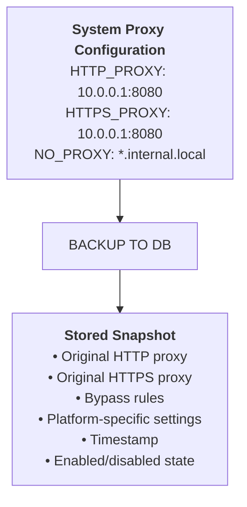
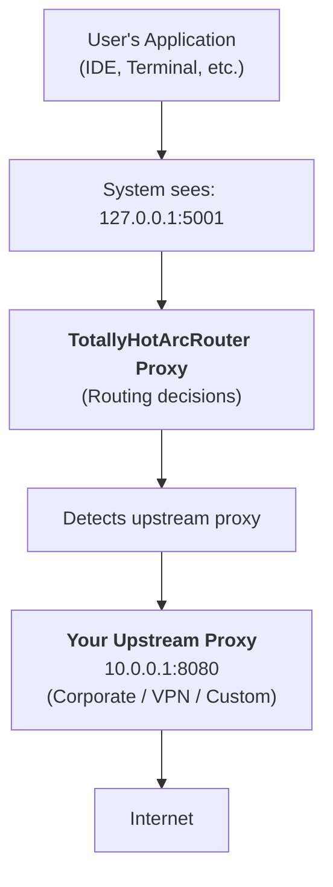
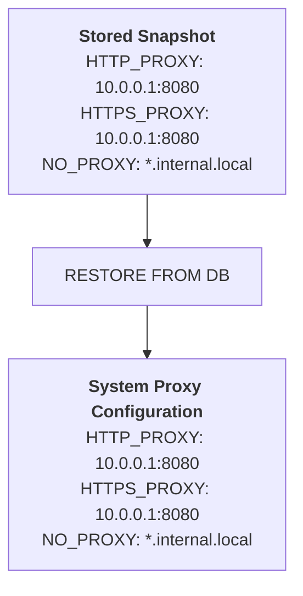
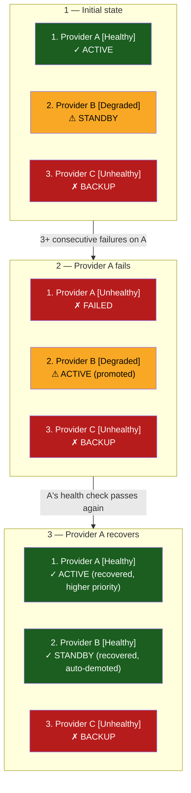
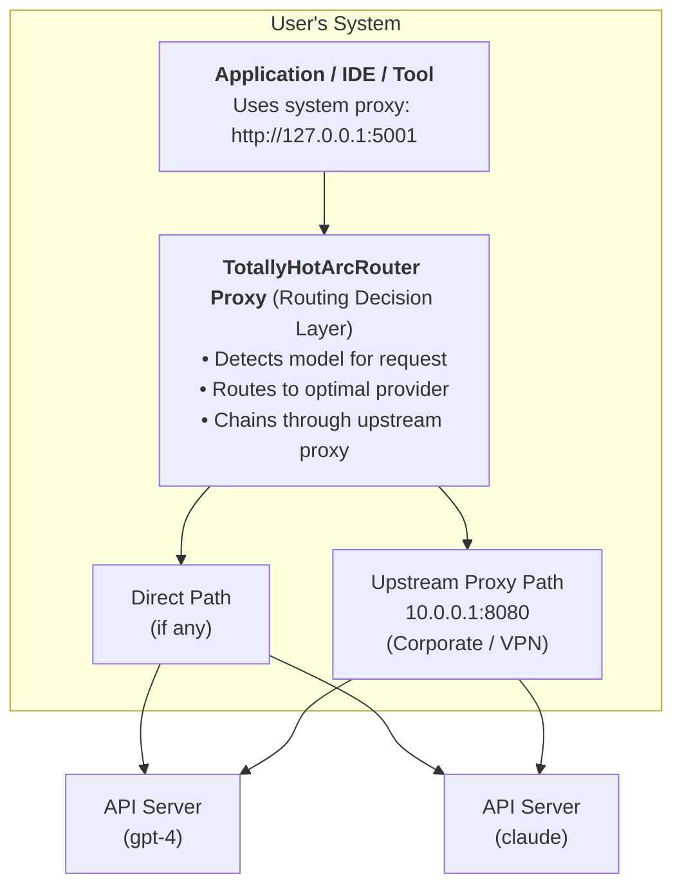
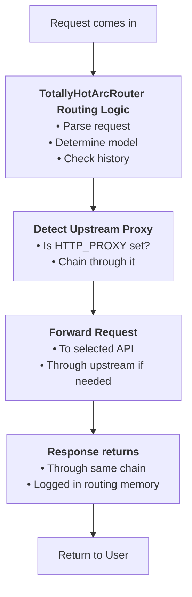

# TotallyHotArcRouter Seamless Proxy Coexistence

> **Status: Proposed — not yet implemented.** No proxy-settings detection, backup, restore, or
> upstream-chaining code exists in `src/TotallyHotArcRouter/` today (verified: no registry/WinInet calls
> anywhere in the codebase). The implemented proxy (`Proxy/ProxyServer.cs` et al.) is a standalone
> local HTTP server; it neither reads nor modifies OS/IDE proxy settings. Everything below
> describes a **proposed** design, not current behavior — treat code-level claims as aspirational
> until this note is removed. See [system-proxy-architecture.md](./system-proxy-architecture.md)
> for the related (also proposed) system-proxy interception design.

## Overview

One of TotallyHotArcRouter's proposed architectural features is the ability to **coexist seamlessly with existing proxy settings** without interference, conflicts, or data loss. Whether you use a corporate proxy, VPN, or custom proxy configuration, the design calls for TotallyHotArcRouter to automatically detect, back up, and chain through your existing infrastructure.

---

## Why This Matters

### Problem Statement

Traditional proxy routing solutions create a "proxy takeover" problem:
- ❌ Existing proxy settings are overwritten or lost
- ❌ Restoration fails or leaves system in inconsistent state
- ❌ Manual configuration required for proxy chains
- ❌ No failover or recovery mechanism
- ❌ Complex troubleshooting when conflicts arise

### TotallyHotArcRouter's Solution

✅ **Automatic Detection** — Discovers existing proxy configuration at startup  
✅ **Safe Backup** — Captures exact system state before any modifications  
✅ **Intelligent Chaining** — Routes through your upstream proxy automatically  
✅ **Graceful Restoration** — Restores original settings on shutdown  
✅ **Conflict Prevention** — Detects and avoids self-referential loops  
✅ **Failover & Recovery** — Maintains health monitoring with automatic recovery  

---

## How It Works

### Phase 1: Pre-Takeover Snapshot

When TotallyHotArcRouter starts, it captures the complete current proxy state:



**Database Storage Locations:**

TotallyHotArcRouter data is stored in an agent-neutral directory structure, spread across three
locations that differ in *scope*, not in naming. All five `StorageOptions` paths plus the routing gate
and management token are machine-wide; per-user secrets and GUI settings stay per-user; the ONNX model
caches are per-user for now.

| OS | Machine-wide operational state (`agent_telemetry.db`, `coderouterbench.db`, `transcripts.db`, voter models, `routing-gate.json`, `management-token.txt`) | Per-user secrets/settings (`secrets.dat`, `telemetry-cert.pfx`, `gui-settings.json`) | Per-user model caches |
|-----|---|---|---|
| **Windows** | `%ProgramData%\TotallyHotArcRouter\` | `%LOCALAPPDATA%\TotallyHotArcRouter\` | `%LOCALAPPDATA%\TotallyHot.ArcRouter\models\` |
| **macOS** | `/Users/Shared/TotallyHotArcRouter/` | `~/Library/Application Support/TotallyHotArcRouter/` | `~/Library/Application Support/TotallyHot.ArcRouter/models/` |
| **Linux** | `~/.local/share/TotallyHotArcRouter/` | `~/.local/share/TotallyHotArcRouter/` | `~/.local/share/TotallyHot.ArcRouter/models/` |

The machine-wide column exists because the installed service runs as `LocalSystem` while the GUI runs as
the interactive user — a per-user path resolves to a *different file per account*, which for the
management token meant a permanent 401 and for the databases meant data the interactive user could
neither read nor back up. See `StorageOptions`' remarks and `docs/router/packaging-and-distribution.md`
§3.1. `LegacyStorageMigration` adopts a pre-move copy of any of the five storage files on first startup.

The per-user columns are `Environment.GetFolderPath(Environment.SpecialFolder.LocalApplicationData)` plus
the folder name, so the paths follow whatever that API resolves to per platform rather than being
hardcoded. The machine-wide column is `SpecialFolder.CommonApplicationData` on Windows only: off Windows
that resolves to `/usr/share`, which this project's container account cannot write, so the resolver falls
back to the per-user root there (there is no LocalSystem/interactive split to bridge in a container).
The macOS row is `~/Library/Application Support`, not the `~/.local/share` it would have been on .NET 7
and earlier: [.NET 8 changed `LocalApplicationData` on macOS to `NSApplicationSupportDirectory`](https://learn.microsoft.com/dotnet/core/compatibility/core-libraries/8.0/getfolderpath-unix),
and this project targets .NET 10. Linux is unchanged - still `XDG_DATA_HOME`, defaulting to
`~/.local/share`.

**Claude Code Router (TypeScript/Electron) - Databases:**
- `config.sqlite` – Application configuration and state
- `api-keys.sqlite` – Encrypted API key storage
- `request-logs.sqlite` – Request logging and audit trail
- `usage.sqlite` – Usage statistics and tracking
- `system-proxy-snapshot.json` – Current system proxy state (backed up before takeover)
  - **Validated on startup:** TotallyHotArcRouter confirms the snapshot is valid before using it
  - **Validation checks:** File integrity, JSON format, schema structure, platform match, required fields
  - **Automatic recovery:** If snapshot is corrupted, it is safely ignored and removed
- `gateway.config.json` – Gateway/proxy configuration
- `certs/` – SSL/TLS certificates for proxy CA
- `provider-icons/` – Cached provider icons
- `raw-trace-spool/` – Raw trace spool data
- `data/` – Additional application data

**For cc-switch (Tauri version):**
- Config Directory: `~/.cc-switch/` (or `%APPDATA%\.cc-switch\` on Windows)
- SQLite Database: `cc-switch.db`
- Proxy Tables: `proxy_config`, `proxy_live_backup`, `proxy_request_logs`, `provider_health`

**What Gets Backed Up:**

- **Windows:** Registry values (`ProxyServer`, `ProxyOverride`, `ProxyEnable`, `AutoDetect`, WinHTTP settings)
- **macOS:** Per-network-service proxy settings (Web, Secure Web, SOCKS for Wi-Fi, Ethernet, VPN, etc.)
- **Linux:** Environment variables (`HTTP_PROXY`, `HTTPS_PROXY`, `ALL_PROXY`, `NO_PROXY`)

### Phase 2: Intelligent Conflict Detection

Before applying TotallyHotArcRouter's proxy configuration, three layers of conflict detection run:

#### **Loopback Detection**
```rust
// Check if system proxy already points to loopback (127.0.0.1, ::1, localhost)
fn system_proxy_points_to_loopback() -> bool {
	// If yes: skip setup (already configured)
	// If no: proceed with setup
}
```

**Scenario:** User already set `HTTP_PROXY=http://127.0.0.1:5001`
- Result: TotallyHotArcRouter detects this and does NOT re-setup (prevents double-proxying)

#### **Backup Corruption Detection**
```rust
// Check if stored backup contains proxy configuration (not user's original)
fn live_has_proxy_placeholder_for_app() -> bool {
	// If backup is corrupted/contains proxy config:
	//   - Don't use it (would lock user into proxy mode)
	//   - Rebuild from SSOT (Single Source of Truth)
	//   - Log warning for admin review
}
```

**Scenario:** Previous session crashed and backup stored proxy config instead of original
- Result: TotallyHotArcRouter rebuilds configuration from defaults instead of corrupted backup

#### **Provider Priority Recovery**
```rust
// Check if a higher-priority provider has recovered
if restored_priority < current_priority {
	// Auto-switch to recovered provider
	log::info!("Provider recovered, switching (priority {} → {})", current, restored);
}
```

**Scenario:** Primary provider becomes unavailable, system fails over to backup
- Result: When primary recovers, TotallyHotArcRouter automatically switches back

### Phase 3: Proxy Chaining

If you have an existing upstream proxy, TotallyHotArcRouter chains through it automatically:



**Example Configuration:**

```bash
# Your environment before TotallyHotArcRouter
export HTTP_PROXY=http://10.0.0.1:8080
export HTTPS_PROXY=http://10.0.0.1:8080
export NO_PROXY=localhost,127.0.0.1,*.internal.local
```

**After TotallyHotArcRouter Starts:**

```bash
# System proxy (managed by TotallyHotArcRouter)
HTTP_PROXY=http://127.0.0.1:5001          # TotallyHotArcRouter's local proxy
HTTPS_PROXY=http://127.0.0.1:5001

# Gateway process (chaining through upstream)
HTTP_PROXY=http://10.0.0.1:8080           # Original upstream
HTTPS_PROXY=http://10.0.0.1:8080
CCR_UPSTREAM_PROXY_URL=http://10.0.0.1:8080
NO_PROXY=localhost,127.0.0.1,*.internal.local,acrouter.internal
```

### Phase 4: Graceful Restoration

When TotallyHotArcRouter shuts down or is disabled, it restores your exact original configuration:



**Platform-Specific Restoration:**

**Windows (Registry):**
```powershell
# Restore exact Registry values
Set-ItemProperty "HKCU:\Software\Microsoft\Windows\CurrentVersion\Internet Settings" `
  -Name "ProxyServer" -Value $snapshot.ProxyServer
Set-ItemProperty ... -Name "ProxyOverride" -Value $snapshot.ProxyOverride
# etc.
```

**macOS (per-service):**
```bash
# Restore for each network service
networksetup -setwebproxy "Wi-Fi" $snapshot.web_proxy_host $snapshot.web_proxy_port
networksetup -setwebproxystate "Wi-Fi" $snapshot.web_proxy_enabled
# etc.
```

**Linux (environment variables):**
```bash
# Restore exact environment variables
export HTTP_PROXY=$snapshot.http_proxy
export HTTPS_PROXY=$snapshot.https_proxy
# etc.
```

---

## Platform-Specific Implementations

### Windows

**Backup:**
- HKEY_CURRENT_USER\Software\Microsoft\Windows\CurrentVersion\Internet Settings
  - `ProxyServer`
  - `ProxyOverride`
  - `ProxyEnable`
  - `AutoDetect`
- WinHTTP proxy (via `netsh.exe`)

**Setup:**
- Sets local proxy: `127.0.0.1:5001`
- Bypass rules: `<local>` (localhost, 127.0.0.1)
- Configures WinHTTP for curl/wget compatibility

**Restoration:**
- Restores all Registry values from snapshot
- Clears WinHTTP proxy if it was originally disabled
- No hardcoded defaults—uses exact snapshot

### macOS

**Backup:**
- Per network service (Wi-Fi, Ethernet, VPN, Thunderbolt Bridge, etc.):
  - Web proxy settings
  - Secure proxy settings
  - SOCKS proxy settings
  - Authentication status

**Setup:**
- For each service: `networksetup -setwebproxy <service> 127.0.0.1 5001`
- Sets bypass list: `<local>, localhost, 127.0.0.1`
- Disables SOCKS if originally disabled

**Restoration:**
- Restores per-service settings exactly as they were
- Respects which services had proxy enabled/disabled
- Handles multiple network services correctly

### Linux

**Backup:**
- Environment variables: `HTTP_PROXY`, `HTTPS_PROXY`, `ALL_PROXY`, `NO_PROXY`
- Shell profile settings (if configured)

**Setup:**
- Sets environment: `HTTP_PROXY=http://127.0.0.1:5001`
- Detects and chains upstream proxy automatically
- Falls back to direct connection if no proxy needed

**Restoration:**
- Restores exact environment variables
- Handles both uppercase and lowercase variants
- Preserves shell profile state

---

## Failover and Provider Health Monitoring

TotallyHotArcRouter maintains intelligent failover with automatic recovery:



**Health Thresholds:**

| Consecutive Failures | Status | Display | Action |
|---------------------|--------|---------|--------|
| 0 | Healthy | 🟢 Green | Use actively |
| 1-2 | Degraded | 🟡 Yellow | Monitor closely |
| 3+ | Unhealthy | 🔴 Red | Failover immediately |

**Auto-Recovery:**
- When a failed provider recovers, TotallyHotArcRouter automatically switches back if it has higher priority
- Seamless without user intervention
- Logged for audit trail

---

## Use Cases

### Use Case 1: Corporate Environment with Proxy

**Scenario:** Your organization requires all traffic through a corporate proxy.

```
Setup:
  export HTTP_PROXY=http://proxy.corp.internal:3128
  export HTTPS_PROXY=http://proxy.corp.internal:3128
  dotnet run TotallyHotArcRouter

Result:
  ✓ TotallyHotArcRouter backs up corporate proxy settings
  ✓ TotallyHotArcRouter chains requests through corporate proxy
  ✓ IDE/tools see both routing and corporate controls
  ✓ On shutdown, corporate proxy automatically restored
```

### Use Case 2: VPN + Local Development

**Scenario:** You're on a corporate VPN and developing locally.

```
Setup:
  # VPN configured system-wide
  # (system sees VPN proxy)

  dotnet run TotallyHotArcRouter

Result:
  ✓ TotallyHotArcRouter detects VPN proxy
  ✓ Backs up VPN proxy configuration
  ✓ Chains TotallyHotArcRouter through VPN
  ✓ All routing decisions respect VPN constraints
  ✓ On disconnection from VPN, TotallyHotArcRouter adapts gracefully
```

### Use Case 3: Upstream Gateway

**Scenario:** You have a gateway/proxy server in your infrastructure.

```
Setup:
  export HTTP_PROXY=http://gateway.internal:8080
  dotnet run TotallyHotArcRouter

Result:
  ✓ TotallyHotArcRouter becomes routing layer on top of gateway
  ✓ Gateway continues managing security policies
  ✓ TotallyHotArcRouter provides intelligent model routing
  ✓ Requests: Gateway → TotallyHotArcRouter → Model Selection → API
```

### Use Case 4: Multiple Network Services (macOS)

**Scenario:** Different network interfaces have different proxy settings.

```
macOS Network Setup:
  Wi-Fi: proxy.corp.internal:3128
  Ethernet: direct connection
  VPN: vpn-proxy.corp.internal:3128

Result:
  ✓ TotallyHotArcRouter backs up all three per-service settings
  ✓ Each service maintains its own proxy configuration
  ✓ Switching networks works correctly
  ✓ Restoration happens per-service
```

---

## Troubleshooting

### Issue: Proxy Not Restored After TotallyHotArcRouter Shutdown

**Diagnosis:**
```bash
# Check if backup was created
# Windows: Query database for stored snapshot
# macOS: Check networksetup history
# Linux: Check environment variables in profile
```

**Solution:**

1. **Automatic Restoration:**
   ```bash
   # Disable and re-enable TotallyHotArcRouter
   dotnet run TotallyHotArcRouter --disable-proxy
   dotnet run TotallyHotArcRouter --enable-proxy
   ```

2. **Manual Restoration (Windows):**
   ```powershell
   # Reset to default (direct connection)
   netsh winhttp reset proxy

   # Or restore known proxy
   netsh winhttp set proxy "<proxy>:<port>"
   ```

3. **Manual Restoration (macOS):**
   ```bash
   # Disable proxy on all services
   networksetup -setwebproxystate Wi-Fi off
   networksetup -setsecurewebproxystate Wi-Fi off
   ```

### Issue: Self-Referential Loop Detected

**Symptom:** TotallyHotArcRouter skips proxy setup with message "Already configured"

**Cause:** Environment already has `HTTP_PROXY=http://127.0.0.1:5001`

**Solution:**
```bash
# Clear the environment variable
unset HTTP_PROXY HTTPS_PROXY

# Restart TotallyHotArcRouter
dotnet run TotallyHotArcRouter
```

### Issue: Backup Corruption Detected

**Symptom:** TotallyHotArcRouter rebuilds configuration from defaults

**Cause:** Previous session stored proxy config in backup instead of original

**Solution:**
```bash
# Clear corrupted backup
# (TotallyHotArcRouter will auto-rebuild from SSOT)

# Verify system proxy is correct
# Windows: Check Registry
# macOS: networksetup -getwebproxy <service>
# Linux: echo $HTTP_PROXY
```

---

## Configuration

Neither surface below is read by any code today - no `PROXY_LISTEN_PORT` env var lookup and no
`TotallyHotArcRouter`/`Proxy` options-binding exist in `src/TotallyHotArcRouter/` (the real proxy port is currently
just `ProxyServer`'s `port` constructor argument, defaulting to `5001`). Both are proposed
configuration surfaces for this doc's design, consistent with the top-of-file status banner.

### Environment Variables

**TotallyHotArcRouter Proxy Configuration:**
```bash
# Port for TotallyHotArcRouter proxy
export PROXY_LISTEN_PORT=5001

# Upstream proxy (detected automatically if not set)
export CCR_UPSTREAM_PROXY_URL=http://10.0.0.1:8080

# No-proxy list (in addition to defaults)
export NO_PROXY=localhost,127.0.0.1,*.internal.local
```

### appsettings.json (.NET 10)

```json
{
  "TotallyHotArcRouter": {
	"Proxy": {
	  "Enabled": true,
	  "ListenPort": 5001,
	  "DetectUpstream": true,
	  "BackupOnStartup": true,
	  "RestoreOnShutdown": true,
	  "HealthCheckIntervalMs": 30000,
	  "FailoverThreshold": 3
	}
  }
}
```

---

## Best Practices

### ✅ Recommended

1. **Let TotallyHotArcRouter auto-detect your proxy:**
   ```bash
   # Set standard proxy env vars before running
   export HTTP_PROXY=http://proxy.company.com:3128
   dotnet run TotallyHotArcRouter
   ```

2. **Monitor health status:**
   ```bash
   # Check provider health
   curl http://127.0.0.1:5001/api/health
   ```

3. **Enable backup/restore (default):**
   - TotallyHotArcRouter automatically backs up on startup
   - Automatically restores on shutdown

4. **Use upstream proxy for corporate constraints:**
   - Your corporate proxy handles security policies
   - TotallyHotArcRouter handles intelligent routing
   - Both work together

### ❌ Avoid

1. **Don't manually modify system proxy while TotallyHotArcRouter is running:**
   - Snapshot becomes stale
   - Restoration may fail
   - Use TotallyHotArcRouter UI or API instead

2. **Don't set HTTP_PROXY to loopback manually:**
   - Creates confusion for TotallyHotArcRouter
   - TotallyHotArcRouter detects and skips setup
   - Use PROXY_LISTEN_PORT if you need custom port

3. **Don't delete TotallyHotArcRouter database while proxies are active:**
   - Loses backup information
   - Cannot restore original settings
   - Always stop TotallyHotArcRouter before clearing DB

4. **Don't assume hardcoded defaults on restoration:**
   - TotallyHotArcRouter restores YOUR exact original settings
   - Not predefined proxy settings
   - Exact values are preserved in snapshot

---

## Architecture Diagram



**Request Flow with Existing Proxy:**



---

## Summary

TotallyHotArcRouter's seamless proxy coexistence is achieved through:

| Component | Capability | Benefit |
|-----------|-----------|---------|
| **Snapshot System** | Captures exact proxy state | Safe backup, no data loss |
| **Conflict Detection** | 3-layer detection (loopback, corruption, priority) | Prevents self-conflicts |
| **Proxy Chaining** | Automatically chains through upstream | Works with corporate proxies |
| **Graceful Restoration** | Restores exact original settings | Perfect restoration |
| **Health Monitoring** | Tracks provider health, auto-recovers | Resilient and self-healing |
| **Platform Support** | Windows, macOS, Linux specific code | Reliable across OSes |

**Result:** You can deploy TotallyHotArcRouter in any networking environment—corporate, VPN, gateway, or local—and it will coexist peacefully with your existing infrastructure, require minimal configuration, and restore perfectly on shutdown.

---

## See Also

- [system-proxy-architecture.md](./system-proxy-architecture.md) — Low-level proxy implementation details
- [AGENTS.md](../../AGENTS.md) — Repository policies including Serilog logging
- [serilog-logging-guide.md](./serilog-logging-guide.md) — Logging all proxy operations

